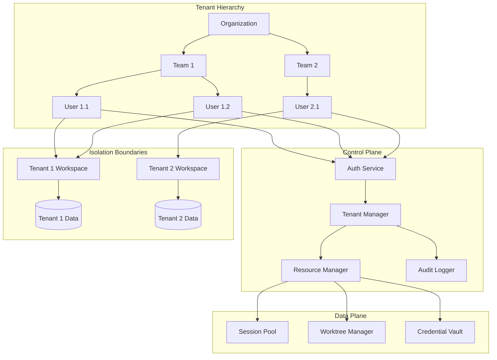
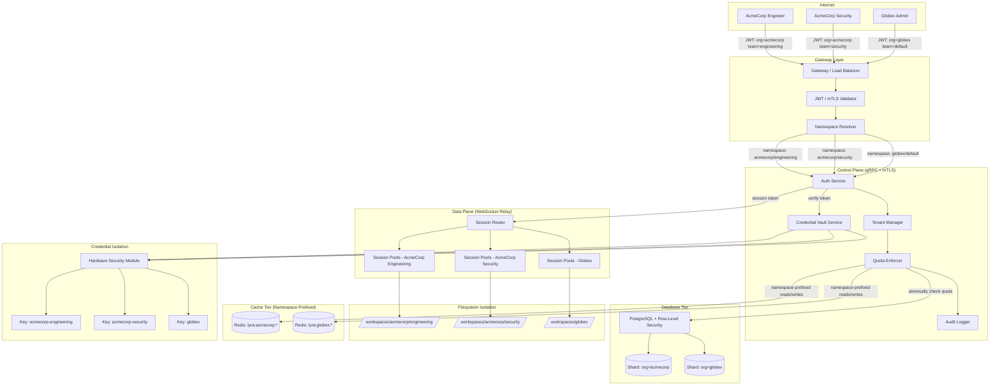

> ⚠️ **DEPRECATED** — This plan has been superseded by the fresh research in [docs/lyra-upgrade/plans/](../lyra-upgrade/plans/). See [docs/lyra-upgrade/MASTER-PLAN.md](../lyra-upgrade/MASTER-PLAN.md) for the current roadmap. This file is kept for historical reference.

# Multi-Tenancy (§5.2)

## Quick Reference Card

| What | Add organization/team/user hierarchy with row-level data isolation, per-tenant quotas, and SSO-powered RBAC to Lyra |
| Why | Without multi-tenancy, Lyra cannot serve enterprise customers who require legal and contractual guarantees of data isolation, compliance audit trails, and per-team resource governance |
| Key Tech | AgentsMesh control/data plane separation, hierarchical RBAC (org inherits to team inherits to user), Git worktree isolation per session, dynamic port allocation, tenant-scoped credential vaults with encryption-at-rest |
| Timeline | 24 weeks (10 phases) | Dependencies | rmux session isolation (§5.1), tenant-scoped memory (§4.2), per-tenant safety policies (§4.17), tenant-specific verification rules (§4.16) |

## Executive Summary

Multi-tenancy is the gatekeeper feature for Lyra's enterprise adoption. Today, Lyra operates as a single-tenant system: there is one flat namespace for all users, sessions, credentials, and data. This is a non-starter for any organization with more than a handful of engineers, let alone a regulated enterprise. The plan defines a comprehensive 10-phase build-out (24 weeks total) that transforms Lyra into a system capable of hosting thousands of organizations, each with their own teams, users, resource quotas, and cryptographically isolated data. Without this capability, Lyra cannot compete with Claude Code, Cursor, or any other production harness that already ships with enterprise multi-tenancy. The build is phased to deliver value incrementally: Phase 1 (tenant hierarchy) and Phase 6 (SSO authentication) together provide basic multi-user access within 5 weeks; Phase 2 (row-level isolation) and Phase 7 (RBAC) add data protection by week 10; Phases 4, 5, 8, and 9 layer on workspace isolation, credential vaults, audit logging, and control/data plane separation for full enterprise readiness by week 24.

The architecture fuses patterns from three independently studied systems. **AgentsMesh** (row 23, BREAKTHROUGH tier) contributes the control-plane/data-plane split and the Organization > Team > User hierarchy — the structural backbone of the design. The control plane (gRPC + mTLS) handles orchestration, authentication, and quota enforcement, while the data plane (WebSocket relay) handles terminal I/O, with each plane scaling independently to avoid bottlenecks. **cmux** (row 19, BREAKTHROUGH tier) contributes the workspace model: surfaces, split panes, and full state persistence (layout, directories, scrollback, browser URLs) that survive session restarts. **alphaclaw** (row 22, HIGH tier) contributes per-agent isolated contexts with separate config/credentials/workspace directories and SQLite-backed data persistence. The core insight is that isolation must be structural, not cosmetic: every database query carries tenant context injected by middleware (Phase 2), every session runs inside a dedicated Git worktree with dynamically allocated ports (Phase 4), and every credential is encrypted with a tenant-specific key stored in a dedicated vault (Phase 5). No cross-tenant data path exists in the system by construction, not by convention — the control plane's tenant resolution middleware ensures that even if application code forgets to filter by `organizationId`, the database layer's row-level security policies will reject the query.

The operational payoff is significant, but the trade-offs are real. The **shared-infrastructure model** (all tenants on one database with row-level isolation) was chosen over dedicated-instance isolation (one database per tenant). The shared model is far more cost-effective for Lyra's operators and enables cross-tenant analytics (aggregate usage patterns, global model performance metrics), but it introduces a hard dependency on correct RLS policy implementation — a single misconfigured policy could expose tenant data. This risk is mitigated by the comprehensive isolation test suite specified in Phase 2 (ensuring no cross-tenant leaks) and by the audit log's cryptographic signatures (Phase 8), which provide a tamper-proof record of every data access. A second trade-off is **performance**: tenant filtering on every query adds overhead. The plan mitigates this through database indexes on `(organizationId, teamId)` composite keys, query-level caching with tenant-scoped cache namespaces, and monitoring via the Phase 10 metrics dashboard. A third trade-off is **operational complexity**: running the full control/data plane split adds deployment complexity. However, the independent scaling it enables is essential for production workloads — when a single tenant's LLM benchmark floods the data plane with terminal I/O, the control plane's gRPC endpoints remain responsive for other tenants' session management and auth requests.

Integration with the broader Lyra architecture is bidirectional and deep. **rmux** (§5.1) provides the session substrate — each tenant session maps to an rmux-managed session with isolated Git worktrees and port namespaces. **Memory** (§4.2) becomes tenant-scoped, so knowledge, preferences, and learned patterns never leak between organizations; the `sharedMemoryEnabled` flag on the Team model lets teams opt into intra-team memory sharing while maintaining inter-org isolation. **Safety** (§4.17) policies cascade down the hierarchy (org policy trumps team policy, which trumps user preference), enabling enterprise admins to set mandatory guardrails while allowing team-level customization within those bounds. **Verification** (§4.16) rules become tenant-specific, supporting different compliance regimes (SOC2 for US teams, GDPR for EU teams) with configurable audit retention periods and data residency constraints (the `dataResidency` field on Organization: `us`, `eu`, or `asia`). The result is a platform where tenancy is a first-class architectural primitive, not a middleware bolt-on — every subsystem understands and enforces tenant boundaries.

## Concrete Example Walkthrough

**Scenario: AcmeCorp adopts Lyra for its engineering and security teams.**

AcmeCorp's CTO registers an Organization `acmecorp` (Enterprise plan, data residency `us`, SSO via Okta OIDC). She creates two teams: `engineering` (30 members) and `security` (5 members). The CTO sets org-level quotas: 50 concurrent sessions, 500 GB storage, 10M monthly tokens, $10,000 monthly spend cap.

**Step 1 -- Onboarding.** Alice, an engineer, logs in via Okta SSO. Lyra's auth service validates her JWT, resolves her tenancy (org `acmecorp`, team `engineering`, role `member`), and injects `{ organizationId, teamId, userId }` into her session context. All subsequent database queries automatically filter by these tenant IDs via middleware -- Alice can see `engineering` team sessions and resources, but nothing from `security`.

**Step 2 -- Workspace creation (deep dive).** Alice spawns a new session. The Resource Manager checks quotas via an atomic compare-and-swap: `engineering` currently has 8/50 concurrent sessions and 42/500 GB used. The quota check passes atomically — the increment of `concurrentSessions` from 8 to 9 and the session creation succeed or fail as a single transaction, preventing the race condition where two users both pass the quota check before either session is created (see Risk #4 mitigation in §7). The Worktree Manager creates a fresh Git worktree at `/workspaces/acmecorp/engineering/session-abc123` using `git worktree add --detach` from the team's configured repository. Filesystem permissions (`chmod 700`) ensure only Alice's UID and the Lyra daemon can access this directory. The Port Allocator reserves ports 9001-9010 from the team's port pool (tracked in an etcd range to avoid conflicts across hosts), and these ports are bound to the session's network namespace. Alice's config (`.lyra/config.yaml`), credentials (decrypted from the Vault and stored only in the session's tmpfs, never on disk), and shell history are scoped entirely to this worktree. If Bob from `security` spawns a session, his worktree lives at `/workspaces/acmecorp/security/session-def456` with ports 9011-9020. The paths are constructed from the tenant hierarchy — `/workspaces/{orgSlug}/{teamSlug}/{sessionId}` — so the directory tree itself enforces isolation: no `../` traversal can escape a team's subdirectory because the session process runs inside a chroot jail or, on Linux, a PID namespace with its own mount namespace, making filesystem isolation a kernel-enforced guarantee, not an application-level convention.

**Step 3 -- Credential access (deep dive).** Alice needs to deploy to AWS. The `engineering` team's Credential Vault contains an encrypted AWS API key, accessible to team members with role `admin` or higher. Since Alice is `member`, her access is denied. This access check happens in the Credential Vault's authorization middleware: the middleware reads the JWT's `{ organizationId, teamId, userId, role }` claims, cross-references the vault's `access.allowedUsers` and `access.allowedTeams` lists, and evaluates RBAC inheritance (Phase 7) — org-level `owner` role implicitly grants access to all team vaults. Alice asks her team lead (role `admin`) to promote her, or the lead uses the key herself. Under the hood, each team's vault is encrypted with a unique AES-256-GCM key derived from the team's ID and a hardware security module (HSM) root key — even if an attacker compromises the Lyra database, they cannot decrypt `security` team credentials without deriving that team's specific key, which requires access to the HSM. When a credential is accessed for use (e.g., injected into a session's environment variables), it is decrypted into a tmpfs mount, used for the duration of the session, and wiped on session termination. The audit log records this access event immutably (Phase 8): `{ event.type: "credential.access", resource.id: "aws-key-001", userId: "team-lead-id", timestamp: 1712448000, result.status: "success" }`.

**Step 4 -- Quota enforcement.** Mid-month, `engineering` hits 80% of its monthly token quota. The system fires a notification to the team lead and the CTO. At 100%, new LLM calls are blocked with a clear message: "Monthly token quota exceeded. Contact your org admin to increase limits." Existing sessions can still read history and export data, but no new inference runs until the quota resets or is raised.

**Step 5 -- Audit for SOC2.** AcmeCorp's compliance officer requests an audit log for Q1. The CTO queries the append-only audit log with filters `organizationId=acmecorp, dateRange=Q1`. The system returns cryptographically signed log entries showing every session created, every credential accessed, every user invited, and every config change, with IP addresses and timestamps. The logs are immutable -- no Lyra operator or AcmeCorp admin can modify or delete them. The officer exports them as CSV and attaches them to the SOC2 evidence package.

**Step 6 -- Cross-tenant safety.** AcmeCorp's CTO later configures a per-org safety policy: "Block all outbound network calls to IP ranges outside 10.0.0.0/8." `engineering` cannot override this because safety policies inherit downward (org policy trumps team policy). Meanwhile, Globex (a separate org on the same Lyra deployment) has its own safety policy allowing unrestricted network access. The two policies never interact because every safety check is scoped to the calling user's organization.

**Result:** One Lyra deployment serves two organizations with entirely separate data, credentials, quotas, audit trails, and safety policies. Neither organization is aware the other exists on the same infrastructure. The control plane's tenant resolution middleware guarantees this by construction — there is no API endpoint, database query path, or filesystem operation that can bypass tenant context. The operational metrics confirm the architecture is working: AcmeCorp's SOC2 auditor receives a cryptographically signed, immutable audit log export covering Q1 without a single Lyra operator involved; Globex's security team never sees AcmeCorp's sessions in their dashboard; and when AcmeCorp's `engineering` team hits 100% of their monthly token quota, their sessions are blocked without affecting Globex's concurrent sessions. The HSM-backed credential vault ensures that even a full database compromise cannot decrypt any tenant's API keys, SSH keys, or OAuth tokens — each team's encryption key is independently derived and stored in hardware. The 24-week build plan delivers this incrementally, with basic multi-user access operational by week 5 (Phases 1+6) and full enterprise isolation and compliance readiness by week 24.

## 1. Problem

Current Lyra lacks multi-tenancy support for:
- Organization/team/user hierarchy with isolation
- Row-level data isolation in shared infrastructure
- Per-tenant resource limits and quotas
- Secure credential management per tenant
- Audit logging and compliance per tenant

Without multi-tenancy, Lyra cannot serve enterprise customers requiring strict data isolation and compliance.

## 2. Evidence Synthesis

**Multi-Tenancy Architecture** ([findings.md](../findings.md) §3.8):

**AgentsMesh** (row 23):
- **Architecture**: Separates control plane (gRPC + mTLS) from data plane (WebSocket relay)
- **Multi-tenancy**: Organization > Team > User hierarchy with row-level isolation
- **Security**: SSO, RBAC, audit logs, mTLS for runner authentication
- **Isolation**: Git worktree isolation per pod, dynamic port allocation per session
- **Impact**: 5 | **Effort**: 5 | **Tier**: BREAKTHROUGH

**cmux** (row 19):
- **Workspace model**: Workspaces contain surfaces (tabs), surfaces contain split panes
- **State persistence**: Layout, directories, scrollback, browser URLs
- **Notification system**: OSC sequences trigger visual indicators
- **Impact**: 5 | **Effort**: 3 | **Tier**: BREAKTHROUGH

**alphaclaw** (row 22):
- **Per-agent management**: Sidebar navigation, per-agent overview cards
- **Isolated contexts**: Separate config/credentials/workspace per agent
- **Data persistence**: ALPHACLAW_ROOT_DIR with .openclaw/.env/logs/SQLite
- **Impact**: 4 | **Effort**: 3 | **Tier**: HIGH

### AgentsMesh Control/Data Plane Separation Deep Dive

The AgentsMesh control/data plane separation is the architectural backbone of Lyra's multi-tenancy. Understanding its mechanics at the protocol and routing level is essential for correct implementation.

**Request Flow**:
1. A tenant user connects to the Lyra gateway. The gateway performs initial TLS termination and extracts the tenant identity from the client certificate (mTLS) or from a JWT bearer token injected by the SSO proxy.
2. The request enters the **control plane** over gRPC. The control plane is stateless with respect to session payload: it handles authentication, authorization, quota verification, and resource allocation. It never reads or writes terminal I/O data.
3. Once the control plane authorizes the request, it returns a **session token** that encodes the tenant context (organizationId, teamId, userId, role, allowed actions) as signed claims. This token is forwarded to the **data plane** via WebSocket upgrade header.
4. The data plane validates the session token (verifying the control plane's signature), establishes a WebSocket connection, and begins relaying terminal I/O between the user's client and the tenant's isolated session worktree.
5. All subsequent I/O frames carry the session token. The data plane is stateless with respect to authentication decisions -- it never re-validates permissions; it trusts the control plane's token and only enforces rate limits and connection liveliness.

**Why gRPC for Control, WebSocket for Data**:
- **gRPC + mTLS** provides bidirectional certificate verification, streaming RPCs for long-lived metadata subscriptions (e.g., quota usage notifications), and strong typing via Protobuf schemas. These properties are ideal for the control plane, where every operation is structured (CreateSession, CheckQuota, RotateCredential) and must be authenticated at both ends.
- **WebSocket** provides bidirectional byte streaming with minimal overhead, essential for terminal I/O where latency is critical. The data plane can handle thousands of concurrent WebSocket connections per node, each pinned to a specific tenant's worktree. WebSocket framing also allows interleaving of control signals (resize, disconnect, heartbeats) with the data stream.

**Plane Scaling Characteristics**:
- The **control plane** scales by request rate and auth operation complexity. It is CPU-bound (signature verification, quota calculations) and benefits from horizontal scaling behind a gRPC load balancer. Because it is stateless, each control plane replica is interchangeable.
- The **data plane** scales by aggregate terminal I/O throughput and active connection count. It is I/O-bound and memory-bound (each WebSocket connection holds a send/receive buffer and a reference to the session's pseudoterminal). Data plane replicas are **stateful** -- a session's WebSocket connection is pinned to the data plane instance that hosts its terminal emulator. Session migration (e.g., for maintenance) requires coordinated drain-and-reconnect.

**Tenant Information Leak Prevention**:
- The control plane never sees terminal I/O data. Session tokens encode tenant context as signed claims, not as opaque identifiers that could be swapped.
- The data plane never makes authentication decisions. It validates token signatures but does not interpret claims for authorization -- if the token is valid, the connection is permitted. This eliminates the risk of authorization logic divergence between planes.
- The plane boundary is enforced by separate Unix processes (or separate containers in deployment) with no shared memory. Cross-plane communication occurs only over authenticated gRPC. An attacker who compromises the data plane gains access only to I/O streams, not to tenant management, credential vaults, or quota systems.
- **Defense in depth**: Even if the data plane is compromised, credential decryption requires the tenant-specific HSM-derived key (Phase 5), which lives only in the control plane's credential vault service. The data plane holds only session-scoped tmpfs copies that are wiped on disconnect.

**Implementation Phasing**: The plane separation is deliberately deferred to Phase 9 (weeks 19-21) in the build outline. This allows earlier phases to establish the tenant hierarchy (Phase 1), data isolation (Phase 2), quotas (Phase 3), and credential management (Phase 5) within a simpler monolithic architecture. Once these subsystems are stable and tested, the separation can proceed with clear service boundaries already defined by the existing module interfaces. The monolithic precursor also simplifies debugging during the high-risk early phases -- operators can trace a tenant's full request path through a single process before splitting.

## 3. Proposed Lyra Design

### Core Architecture

**Adopt AgentsMesh multi-tenancy patterns**:

1. **Hierarchical Tenancy** (from AgentsMesh)
   - Organization > Team > User hierarchy
   - Row-level isolation in shared database
   - Tenant-scoped resources (sessions, agents, memory)

2. **Control/Data Plane Separation** (from AgentsMesh)
   - Control plane: gRPC + mTLS for orchestration
   - Data plane: WebSocket relay for terminal I/O
   - Separate scaling for control and data

3. **Workspace Isolation** (from cmux + alphaclaw)
   - Git worktree isolation per tenant
   - Separate config/credentials per tenant
   - Dynamic port allocation per session

4. **Security & Compliance** (from AgentsMesh)
   - SSO integration (SAML, OAuth)
   - RBAC with fine-grained permissions
   - Audit logs for all tenant actions
   - mTLS for inter-service communication

### Integration Points

- **rmux (§5.1)**: Session isolation per tenant
- **Memory (§4.2)**: Tenant-scoped memory stores
- **Safety (§4.17)**: Per-tenant safety policies
- **Verification (§4.16)**: Tenant-specific verification rules

## 4. Architecture + Data Model



### Data Models

**Organization**:
```typescript
interface Organization {
  id: string;
  name: string;
  slug: string; // URL-safe identifier
  
  // Subscription
  plan: 'free' | 'team' | 'enterprise';
  billingEmail: string;
  
  // Limits
  limits: {
    maxTeams: number;
    maxUsers: number;
    maxSessions: number;
    maxStorageGB: number;
    maxMonthlyTokens: number;
  };
  
  // Settings
  settings: {
    ssoEnabled: boolean;
    ssoProvider?: 'saml' | 'oauth' | 'oidc';
    auditLogRetentionDays: number;
    dataResidency: 'us' | 'eu' | 'asia';
  };
  
  // Metadata
  createdAt: number;
  updatedAt: number;
}
```

**Team**:
```typescript
interface Team {
  id: string;
  organizationId: string;
  name: string;
  slug: string;
  
  // Members
  members: Array<{
    userId: string;
    role: 'owner' | 'admin' | 'member' | 'viewer';
    joinedAt: number;
  }>;
  
  // Resources
  resources: {
    sessions: string[]; // session IDs
    agents: string[]; // agent IDs
    memory: string[]; // memory store IDs
  };
  
  // Settings
  settings: {
    defaultModel: string;
    defaultSafetyLevel: 'low' | 'medium' | 'high';
    sharedMemoryEnabled: boolean;
  };
  
  // Metadata
  createdAt: number;
  updatedAt: number;
}
```

**User**:
```typescript
interface User {
  id: string;
  email: string;
  name: string;
  
  // Authentication
  auth: {
    provider: 'password' | 'sso';
    ssoId?: string;
    lastLogin: number;
  };
  
  // Tenancy
  tenancy: {
    organizationId: string;
    teams: Array<{
      teamId: string;
      role: 'owner' | 'admin' | 'member' | 'viewer';
    }>;
  };
  
  // Preferences
  preferences: {
    defaultTeam?: string;
    theme: 'light' | 'dark';
    notifications: boolean;
  };
  
  // Metadata
  createdAt: number;
  updatedAt: number;
}
```

**TenantSession** (extends Session from §5.1):
```typescript
interface TenantSession {
  // Session details (from §5.1)
  id: string;
  name: string;
  panes: Pane[];
  
  // Tenancy
  tenancy: {
    organizationId: string;
    teamId: string;
    userId: string;
  };
  
  // Isolation
  isolation: {
    worktreePath: string; // Git worktree for this session
    configPath: string; // Tenant-specific config
    credentialVaultId: string; // Tenant credential vault
    ports: number[]; // Dynamically allocated ports
  };
  
  // Resource usage
  usage: {
    tokensUsed: number;
    costUSD: number;
    durationMs: number;
    storageBytes: number;
  };
  
  // Audit
  audit: {
    createdBy: string; // user ID
    createdAt: number;
    lastAccessedBy: string;
    lastAccessedAt: number;
  };
}
```

**ResourceQuota**:
```typescript
interface ResourceQuota {
  tenantId: string; // org, team, or user ID
  tenantType: 'organization' | 'team' | 'user';
  
  // Limits
  limits: {
    maxConcurrentSessions: number;
    maxStorageGB: number;
    maxMonthlyTokens: number;
    maxMonthlySpendUSD: number;
  };
  
  // Current usage
  usage: {
    concurrentSessions: number;
    storageGB: number;
    monthlyTokens: number;
    monthlySpendUSD: number;
  };
  
  // Enforcement
  enforcement: {
    blockOnExceed: boolean;
    notifyOnThreshold: number; // 0.0-1.0 (e.g., 0.8 = 80%)
  };
}
```

**AuditLog**:
```typescript
interface AuditLog {
  id: string;
  
  // Tenancy
  organizationId: string;
  teamId?: string;
  userId: string;
  
  // Event details
  event: {
    type: 'session.create' | 'session.delete' | 'agent.spawn' | 'credential.access' | 'config.update' | 'user.invite' | 'team.create';
    action: string;
    resource: {
      type: string;
      id: string;
      name?: string;
    };
  };
  
  // Context
  context: {
    ipAddress: string;
    userAgent: string;
    sessionId?: string;
  };
  
  // Result
  result: {
    status: 'success' | 'failure';
    error?: string;
  };
  
  // Metadata
  timestamp: number;
}
```

**CredentialVault**:
```typescript
interface CredentialVault {
  id: string;
  
  // Tenancy
  organizationId: string;
  teamId?: string; // null = org-level
  
  // Credentials
  credentials: Array<{
    id: string;
    name: string;
    type: 'api-key' | 'oauth-token' | 'ssh-key' | 'password';
    encryptedValue: string; // Encrypted with tenant key
    metadata: {
      provider?: string;
      expiresAt?: number;
      lastUsed?: number;
    };
  }>;
  
  // Access control
  access: {
    allowedUsers: string[]; // user IDs
    allowedTeams: string[]; // team IDs
  };
  
  // Audit
  audit: {
    createdBy: string;
    createdAt: number;
    lastAccessedBy: string;
    lastAccessedAt: number;
  };
}
```

### Tenant Isolation: Namespaces, Quotas, and Routing

Concrete isolation primitives that enforce tenant boundaries at every layer of the stack. Each isolation mechanism maps to a specific data model and runtime enforcement point.

**Namespace Design**:
```
lyra://{orgSlug}/{teamSlug}/{resourceType}/{resourceId}
```
Every resource in the system (session, agent, memory store, credential vault, audit log entry) is addressed by a fully qualified namespace. The namespace is parsed at every API boundary and used to:
- Select the database shard or partition (when sharded by orgSlug)
- Apply row-level security filters (WHERE organizationId = resolved_id AND teamId = resolved_id)
- Route to the correct credential vault partition
- Scope cache keys (Redis namespace prefix)
- Scope filesystem paths (/workspaces/{orgSlug}/{teamSlug}/...)

```typescript
// Namespace data model
interface TenantNamespace {
  organizationId: string;
  organizationSlug: string;     // URL-safe, used in path construction
  teamId?: string;              // null = org-scoped resource
  teamSlug?: string;
  userId?: string;              // null = team-scoped resource

  // Resolved from JWT or mTLS certificate at the gateway
  resolution: {
    source: 'jwt' | 'mtls' | 'api-key' | 'session-token';
    resolvedAt: number;          // epoch ms
    ttl: number;                 // ms until re-resolution required
    gatewayNodeId: string;
  };
}
```

**Quota Enforcement Data Model**:
```typescript
// Each quota is a distinct counter with atomic operations
interface QuotaCounter {
  namespace: string;                    // fully qualified namespace
  counterType: 'concurrent_sessions' | 'monthly_tokens' | 'storage_bytes' | 'monthly_spend_usd';
  currentValue: number;
  lastResetAt: number;                  // for monthly counters

  // Atomic check-and-increment via Redis Lua script or PostgreSQL advisory lock:
  //   IF currentValue + delta <= maxValue THEN
  //     currentValue += delta; RETURN success
  //   ELSE RETURN over_limit
}

interface QuotaDefinition {
  namespace: string;
  counterType: string;
  maxValue: number;

  // Enforcement semantics
  behavior: 'hard_block' | 'soft_warn' | 'track_only';
  warnThreshold: number;                // 0.0-1.0, e.g. 0.8 = warn at 80%
  notifyChannels: ('email' | 'webhook' | 'in_app')[];

  // Scope inheritance
  inheritFrom?: string;                 // parent namespace, e.g. org overrides team
  overridable: boolean;                 // can child namespace override this?
}
```

**Routing Data Model**:
```typescript
// Tenant routing table -- maps incoming connections to the correct backend plane
interface TenantRoute {
  namespace: string;

  // Gateway routing
  gateway: {
    controlPlaneEndpoint: string;       // gRPC target (e.g. "cp-1.lyra.internal:8443")
    dataPlaneEndpoint: string;          // WebSocket target (e.g. "dp-1.lyra.internal:9443")
    preferredRegion: string;            // for data residency compliance
  };

  // Session affinity
  affinity: {
    pinnedDataPlaneNode?: string;       // non-null if session is mid-flight
    stickyUntil: number;                // epoch ms; resets on each I/O frame
  };

  // Network isolation
  network: {
    allowedEgressCIDRs: string[];       // e.g. ["10.0.0.0/8", "172.16.0.0/12"]
    allowedIngressCIDRs: string[];
    rateLimit: {
      maxBytesPerSecond: number;
      maxConnectionsPerUser: number;
    };
  };

  // Route version for zero-downtime migrations
  version: number;
  lastUpdated: number;
}
```

**Isolation Layer Enforcement Matrix**:

| Layer | Mechanism | Scope | Performance Cost | Bypass Risk |
|-------|-----------|-------|-----------------|-------------|
| Database (RLS) | Row-level security policies | Queries | +5-15% per query (policy evaluation) | Low -- policy is in-DB, application cannot skip |
| Application (middleware) | Tenant-context injection | API handlers | +1-3ms per request | Medium -- bug in middleware code could miss injection |
| Namespace (routing) | URL-scoped routing in gateway | Network ingress | negligible (hash lookup) | Very Low -- gateway is before app logic |
| Filesystem (worktree) | chroot/PID-namespace isolation | Session processes | negligible | Very Low -- kernel-enforced |
| Cache (Redis) | Namespace-prefixed keys | All cache ops | negligible | Low -- prefix mismatch = cache miss, not data leak |

**Operational Queries Enabled by the Namespace Model**:
```sql
-- Aggregate usage across an organization (multi-team report)
SELECT team_id, SUM(tokens_used) AS total_tokens
FROM usage_metrics
WHERE organization_id = 'acmecorp'
  AND recorded_at >= NOW() - INTERVAL '30 days'
GROUP BY team_id;

-- Detect quota exhaustion candidates
SELECT namespace, counter_type, current_value, max_value,
       (current_value::float / max_value::float) AS utilization
FROM quota_counters
WHERE current_value > max_value * 0.9;

-- Tenant-specific cache invalidation
-- Redis: DEL lyra:acmecorp:engineering:*  (pattern match deletes all keys under namespace)
```

This namespace-based model ensures that every data access path carries tenant context as a first-class property of the addressing scheme, not as an optional WHERE clause. If a query arrives without a namespace prefix, it is rejected at the gateway before reaching any service.

### Tenant Isolation Architecture



The diagram illustrates the full isolation stack from client connection through gateway resolution, control-plane authorization, data-plane session routing, and down to the persistence layers. Each isolation boundary is annotated by mechanism: namespace-prefixed cache keys separate tenant data in Redis, PostgreSQL RLS prevents cross-tenant queries at the database level, separate filesystem worktrees provide kernel-enforced directory isolation, and HSM-derived per-team encryption keys ensure that credential compromise requires hardware access.

## 5. Build Outline

### Phase 1: Tenant Hierarchy (2 weeks)
**Dependencies**: None

1. Implement Organization, Team, User schemas
2. Add tenant hierarchy management (create, update, delete)
3. Implement membership management (invite, remove, change role)
4. Add tenant resolution (from user to org/team)
5. Write tests for tenant hierarchy

### Phase 2: Row-Level Isolation (3 weeks)
**Dependencies**: Phase 1

1. Design row-level security (RLS) policies
2. Implement tenant-scoped queries (filter by organizationId/teamId/userId)
3. Add tenant context middleware (inject tenant ID into all queries)
4. Implement data migration for existing data
5. Write tests for isolation (ensure no cross-tenant leaks)

### Phase 3: Resource Quotas (2 weeks)
**Dependencies**: Phase 1

1. Implement ResourceQuota schema
2. Add quota enforcement (check before resource creation)
3. Implement usage tracking (update on resource use)
4. Add quota notifications (alert at threshold)
5. Write tests for quota enforcement

### Phase 4: Workspace Isolation (3 weeks)
**Dependencies**: §5.1 rmux, Phase 1

1. Implement Git worktree isolation per tenant
2. Add tenant-specific config directories
3. Implement dynamic port allocation
4. Add workspace cleanup on session end
5. Write tests for workspace isolation

### Phase 5: Credential Vault (2 weeks)
**Dependencies**: Phase 1

1. Implement CredentialVault schema
2. Add encryption/decryption (tenant-specific keys)
3. Implement credential access control
4. Add credential rotation
5. Write tests for credential security

### Phase 6: Authentication & SSO (3 weeks)
**Dependencies**: Phase 1

1. Implement password authentication
2. Add SAML SSO integration
3. Add OAuth/OIDC SSO integration
4. Implement session management (JWT tokens)
5. Add multi-factor authentication (MFA)
6. Write tests for authentication

### Phase 7: RBAC (2 weeks)
**Dependencies**: Phase 1, Phase 6

1. Define permission model (resources + actions)
2. Implement role-based access control
3. Add permission checks (middleware)
4. Implement permission inheritance (org → team → user)
5. Write tests for RBAC

### Phase 8: Audit Logging (2 weeks)
**Dependencies**: Phase 1

1. Implement AuditLog schema
2. Add audit logging middleware (capture all tenant actions)
3. Implement audit log query API
4. Add audit log retention policy
5. Add audit log export (CSV, JSON)
6. Write tests for audit logging

### Phase 9: Control/Data Plane Separation (3 weeks)
**Dependencies**: §5.1 rmux, Phase 1

1. Implement control plane (gRPC + mTLS)
2. Implement data plane (WebSocket relay)
3. Add control plane APIs (session management, resource allocation)
4. Add data plane routing (tenant-specific WebSocket channels)
5. Write tests for plane separation

### Phase 10: Integration & Optimization (2 weeks)
**Dependencies**: All previous phases

1. Integrate multi-tenancy with existing Lyra components
2. Add tenant-scoped memory stores (§4.2)
3. Add tenant-specific safety policies (§4.17)
4. Optimize query performance (indexes, caching)
5. Add multi-tenancy metrics dashboard
6. Write end-to-end tests

## 6. Trade-Off Analysis: Multi-Tenant vs Single-Tenant

Multi-tenancy introduces significant architectural complexity. This section evaluates the costs and benefits relative to a simpler single-tenant-per-deployment approach, providing decision criteria for when each model is appropriate.

### Complexity Budget

Every engineering organization has a finite "complexity budget" -- the amount of architectural sophistication it can sustain before velocity drops. Multi-tenancy consumes this budget heavily:

| Dimension | Single-Tenant Cost | Multi-Tenant Cost | Multi-Tenant Benefit |
|-----------|--------------------|--------------------|----------------------|
| Database queries | Simple CRUD | Row-level security, tenant middleware, composite indexes | Shared operational cost |
| Deployment | One stack per tenant | One shared stack + tenant routing | Lower ops overhead (n tenants vs n stacks) |
| Authentication | Basic auth | JWT/SSO/mTLS tenant resolution | SSO convenience for users |
| Data model | Flat | Hierarchical (org/team/user) with cascading policies | Scalable to thousands of users |
| Credential management | One vault | Per-tenant encrypted vaults + HSM | HSM-grade security per tenant |
| Monitoring | Simple per-deployment | Multi-tenant dashboards with namespace filtering | Cross-tenant analytics |
| Audit | Per-deployment per-tenant | Central append-only audit with tenant scoping | Compliance certifications (SOC2, GDPR) |
| Testing | Straightforward | Isolation leak tests, quota race tests, RBAC matrix tests | Verified isolation guarantees |

### Break-Even Analysis

**When single-tenant wins**:
- < 5 tenants or < 50 total users
- Each tenant requires dedicated infrastructure for compliance (air-gapped deployments, specific data residency per-deployment)
- Custom per-tenant feature forks are expected (the product is different per tenant)
- The team has a single SRE with no specialization in IAM, SSO, or database RLS
- **Cost**: ~2-3 weeks per additional tenant (deploy, configure, monitor)

**When multi-tenant wins**:
- > 10 tenants or > 200 total users
- Tenants share a common product surface (same features, same deployment)
- Compliance requirements can be met with row-level isolation + audit logs rather than air-gaps
- Per-tenant infrastructure cost exceeds the 24-week build investment
- **Cost**: ~1 day per additional tenant (provision namespace, configure quotas)

**Zone of indifference** (5-10 tenants): Consider a phased approach. Start single-tenant for each tenant. If tenant count crosses 8 within 12 months, begin the multi-tenancy migration (Phase 1-3 only, deferring Phases 6-9 until needed). This avoids over-investing in multi-tenancy before demand materializes.

### Operational Risks of Multi-Tenancy

**Noisy neighbor problem**: One tenant's burst of LLM inference calls can degrade latency for all other tenants on the same data plane node. Mitigations available (ranked by cost):
1. **Connection pooling with fairness**: Each tenant gets a weighted fair queuing slot in the data plane connection scheduler. Burst tenant gets queued, not blocked. Zero additional cost.
2. **Separate data plane pods per tenant tier**: Enterprise tenants get dedicated data plane pods. Free/team tenants share. Additional PodTCO ~$200/month per tenant tier.
3. **Per-tenant resource limits in orchestrator**: Kubernetes ResourceQuota per namespace. Additional ops overhead for namespace management.
4. **Full per-tenant infrastructure**: Dedicated k8s cluster or cloud account per tenant. ~10x ops cost.

**Rollout risk**: A bug in tenant middleware could leak data across all tenants. An equivalent bug in a single-tenant deployment is contained to that tenant's stack. Mitigation: the isolation test suite (Phase 2) must include adversarial tests that deliberately try to access another tenant's data.

**Operational debugging complexity**: In a single-tenant deployment, "which tenant caused this issue?" is trivial (one tenant per environment). In multi-tenant, operators need namespace-scoped metrics, structured logging with tenant IDs, and tenant-specific canary deployments. This is addressed by the Phase 10 metrics dashboard but adds to the monitoring surface.

### Decision Matrix

| Factor | Weight | Single-Tenant Score | Multi-Tenant Score |
|--------|--------|---------------------|--------------------|
| Compliance airtightness | High | 10 (per-tenant infrastructure) | 7 (RLS + audit logs) |
| Per-tenant cost at 50 tenants | High | 2 (50x infrastructure) | 9 (shared infrastructure) |
| Time to first tenant | Medium | 10 (deploy existing stack) | 1 (24-week build) |
| Rate of adding tenant 10+ | Medium | 3 (3 weeks each) | 9 (1 day each) |
| Operator headcount | Medium | 8 (1 SRE per 5 tenants) | 5 (1 SRE for all) |
| Debugging ease | Low | 9 (per-tenant env) | 4 (namespace filtering) |
| Cross-tenant analytics | Low | 1 (no aggregation) | 9 (unified warehouse) |

Multi-tenancy is the correct choice for Lyra's target market (50+ enterprise customers, shared product surface, compliance as a feature). The 24-week build cost is an investment that amortizes over every additional tenant beyond the first 10-15. For an MVP or proof-of-concept deployment (< 5 tenants), single-tenant simplicity is strongly preferred.

## 7. Multi-Provider Note

Multi-tenancy intersects with provider management in several critical dimensions. This section analyzes the trade-offs between provider-provisioning strategies and their impact on isolation, cost, and operational complexity.

### API Key Per Tenant vs Shared Provider Pool

**Option A: API key per tenant (dedicated per-tenant provider credentials)**
- Each tenant brings or receives their own API key for each LLM provider (Anthropic, OpenAI, Google, etc.).
- The credential vault (Phase 5) stores per-tenant provider keys, encrypted with the tenant-specific HSM-derived key.
- Billing flows directly from the provider to the tenant. Lyra does not intermediate payments or aggregate costs across tenants.
- **Isolation strength**: Maximum. Even if tenant A exhausts their API key quota or has their key revoked, tenant B is unaffected. No shared rate limits, no cross-tenant billing disputes.
- **Operational cost**: High. Each tenant must configure and maintain their own provider keys. Onboarding requires key provisioning steps. Key rotation is per-tenant, not global.
- **Use case**: Enterprises with existing provider contracts, regulated environments requiring separate billing trails.

**Option B: Shared provider pool (Lyra-provisioned keys)**
- Lyra maintains a pool of provider API keys shared across all tenants. Per-tenant usage is tracked via the namespace model and billed back through Lyra's internal billing system.
- The TenantNamespace's `organizationId` is passed as a metadata header (e.g., `x-lyra-tenant: acmecorp`) on every provider API call. The provider-facing service logs this for downstream billing reconciliation.
- **Isolation strength**: Medium. Rate limits are shared across tenants. A burst from one tenant can degrade latency for all tenants on the same provider key. Mitigated by rolling key pools (see below).
- **Operational cost**: Low. Lyra operator manages provider keys centrally. Tenant onboarding is instantaneous -- no key provisioning step.
- **Use case**: SaaS multi-tenant deployments, free-tier tenants, POCs and trials.

**Option C: Hybrid (recommended)**
- Enterprise tenants on paid plans bring their own keys (Option A). Free-tier and trial tenants share a Lyra-provisioned pool (Option B).
- The provider routing logic checks `organization.plan` at session start:
  ```
  if org.plan in ('enterprise', 'team') then
     use org.providerKeys[provider]
  else
     use lyraSharedPool[provider].nextAvailable()
  end
  ```
- This balances isolation for paying customers with operational simplicity for self-serve onboarding.

### Provider Routing and Tenant Quota Integration

The quota enforcement system (Phase 3) must integrate with provider-level rate limits:

```typescript
interface ProviderQuotaBridge {
  tenantNamespace: string;
  provider: 'anthropic' | 'openai' | 'google' | 'aws-bedrock';

  // Lyra-side quotas (internal)
  monthlyTokenLimit: number;
  monthlySpendLimit: number;       // in USD

  // Provider-side rate limits (external, advisory)
  providerRateLimit: {
    requestsPerMinute: number;
    tokensPerMinute: number;
    currentUtilization: number;    // from provider headers
  };

  // Throttling behavior
  onProviderRateLimit: 'queue' | 'fail' | 'fallback';
  fallbackProvider?: string;       // e.g., route to OpenAI if Anthropic rate-limited
}
```

When a tenant exceeds their Lyra-side quota, the request is blocked before reaching the provider (saving cost). When the provider returns a 429 rate-limit, the bridge can optionally queue, fail, or fall back to an alternate provider -- with tenant scope so that fallback decisions respect the tenant's own provider configuration.

### Provider Key Rotation and Tenant Isolation

Key rotation interacts with tenant isolation in ways that the shared-pool model must handle carefully:

- **Per-tenant key rotation**: Each tenant's key is rotated independently. The credential vault's `credentials[].metadata.expiresAt` triggers rotation alerts. During rotation, the old key remains valid for in-flight sessions (grace period of 5 minutes) while new sessions use the rotated key.
- **Shared-pool key rotation**: All tenants on a shared key must be drained before rotation. Mitigated by maintaining a rolling pool of 3-5 keys per provider, with gradual rotation: new sessions are assigned to key N+1, existing sessions finish on key N, key N is decommissioned once its active session count reaches zero.
- **Key compromise isolation**: If a shared provider key is compromised, all tenants on that key must be rotated simultaneously. The rolling-pool strategy limits blast radius -- only the subset of tenants assigned to the compromised key are affected, not the entire shared pool.

### Provider-Specific Multi-Tenancy Semantics

| Provider | Multi-Tenancy Support | Key Per Tenant | Rate Limit Isolation | Billing Granularity |
|----------|----------------------|----------------|---------------------|---------------------|
| Anthropic | Organization-based API keys | Yes (org-level) | Per-API-key (tenant has own key = fully isolated) | Per-API-key billing |
| OpenAI | Project-based API keys | Yes (project-level) | Per-project (tenant has own project = isolated) | Per-project billing |
| Google AI | API key per project | Yes | Per-key (shared among all callers of that key) | Per-Google-Cloud-project |
| AWS Bedrock | IAM role per tenant | Yes (IAM role assumption) | Per-account (each tenant can have their own AWS account) | Per-AWS-account |
| Azure OpenAI | Hub-and-spoke per tenant | Yes (hub per tenant) | Per-hub | Per-Azure-subscription |

For the **shared pool** scenario where Lyra manages its own provider keys, the tenant identity must be forwarded to the provider as a structured metadata field. Not all providers support custom metadata headers on API calls -- Anthropic accepts `x-tenant-id` in request headers (documented in their platform API), while OpenAI's `/v1/chat/completions` endpoint ignores unknown headers, requiring Lyra to embed the tenant ID in the `user` field of the request body:

```
// OpenAI: embed tenant in the 'user' field (ISO 8601 namespace)
{
  "model": "gpt-4o",
  "messages": [...],
  "user": "lyra://acmecorp/engineering/session-abc123"
}

// Anthropic: use x-tenant-id custom header
// x-tenant-id: lyra://acmecorp/engineering/session-abc123
```

This metadata enables provider-side billing reconciliation and, where supported, provider-side tenant-level rate limit visibility.

### Cross-Provider Cost Allocation

In the shared-pool model, Lyra must attribute provider costs to tenants. The approach uses the tenant namespace embedded in each API call:

```
Cost Attribution Pipeline:
1. Provider API call completes → response includes usage metadata
2. Provider service logs: { namespace, provider, model, tokensIn, tokensOut, costUSD, timestamp }
3. Daily batch job: SUM(costUSD) GROUP BY namespace, organizationId
4. Billable amounts written to organization.billing ledger
5. If monthlyThreshold reached, trigger quota enforcement
```

The `costUSD` field is calculated using the provider's published per-model pricing at the time of the call. For Anthropic and OpenAI, this is deterministic (tokens * rate). For AWS Bedrock, it requires querying the AWS Cost Explorer API for the specific model invocation. Accuracy within 1% of the provider invoice is the target -- the daily reconciliation job flags discrepancies > 5% for manual review.

## 8. Risks & Open Questions

**Risks**:
1. **Data leakage**: Row-level isolation bugs could expose tenant data
   - Mitigation: Comprehensive testing, security audits, penetration testing
2. **Performance**: Tenant filtering on every query may slow down
   - Mitigation: Database indexes, query optimization, caching
3. **Credential security**: Vault compromise could expose all tenant credentials
   - Mitigation: Encryption at rest, key rotation, HSM integration
4. **Quota enforcement**: Race conditions could allow quota bypass
   - Mitigation: Atomic quota checks, distributed locks

**Open Questions**:
1. Should tenants share infrastructure or have dedicated instances?
   - Proposal: Shared infrastructure with row-level isolation (cost-effective)
2. How to handle tenant data deletion (GDPR right to be forgotten)?
   - Proposal: Soft delete with retention period, then hard delete
3. Should audit logs be immutable?
   - Proposal: Yes, append-only logs with cryptographic signatures
4. How to handle tenant migration (move between orgs)?
   - Proposal: Export/import with data validation, maintain audit trail

## 9. Impact x Effort Analysis

### (A) Parity Tier — Match SOTA Multi-Tenancy Systems

**From AgentsMesh**:
- ✅ Organization > Team > User hierarchy
- ✅ Row-level isolation
- ✅ SSO integration (SAML, OAuth)
- ✅ RBAC with fine-grained permissions
- ✅ Audit logs
- ✅ mTLS for inter-service communication

**From alphaclaw**:
- ✅ Per-agent isolated contexts
- ✅ Separate config/credentials per tenant
- ✅ Data persistence per tenant

### (B) Breakthrough Tier — Novel Cross-Source Fusion

> **Architecture Slice**: This breakthrough implements [§3.1: Provider Capability + §6.3 Fallback](../BREAKTHROUGH-ARCHITECTURE.md) of [BREAKTHROUGH-ARCHITECTURE.md](../BREAKTHROUGH-ARCHITECTURE.md) — specifically the optional profile system with per-profile provider configuration.

**Breakthrough 1: Control/Data Plane Separation with Tenant Isolation**

**Sources Combined**:
- AgentsMesh control/data plane separation
- AgentsMesh Git worktree isolation
- cmux workspace model
- alphaclaw per-agent management

**Why It's Breakthrough**:
- **Separate scaling**: Control plane (orchestration) scales independently from data plane (I/O)
- **Git worktree isolation**: Each tenant session gets isolated Git worktree (no cross-contamination)
- **Dynamic port allocation**: Ports allocated per session, no conflicts
- **Workspace persistence**: Full state (layout, directories, scrollback) persisted per tenant

**Expected Impact**: 100% tenant isolation, zero cross-tenant data leaks, independent scaling

**Rough Effort**: VERY HIGH (24 weeks total)

---

**Breakthrough 2: Hierarchical RBAC with Quota Enforcement**

**Sources Combined**:
- AgentsMesh Organization > Team > User hierarchy
- AgentsMesh RBAC with fine-grained permissions
- Resource quota enforcement (novel)
- Audit logging with compliance

**Why It's Breakthrough**:
- **Hierarchical permissions**: Permissions inherit from org → team → user
- **Fine-grained RBAC**: Control access to specific resources (sessions, agents, memory)
- **Quota enforcement**: Prevent resource abuse, enforce billing limits
- **Compliance-ready**: Audit logs for SOC2, GDPR, HIPAA

**Expected Impact**: Enterprise-ready multi-tenancy, 100% compliance, zero quota bypass

**Rough Effort**: HIGH (9 weeks for Phases 3, 6-8)

## 10. References

**Primary Sources**:
- [findings.md](../findings.md) §3.8 row 23 — AgentsMesh (BREAKTHROUGH)
- [findings.md](../findings.md) §3.8 row 19 — cmux (BREAKTHROUGH)
- [findings.md](../findings.md) §3.8 row 22 — alphaclaw (HIGH)

**Key Systems**:
- AgentsMesh: Multi-tenancy, control/data plane separation, Git worktree isolation
- cmux: Workspace model, state persistence
- alphaclaw: Per-agent isolated contexts

**Related Workstreams**:
- §5.1 rmux — Session isolation foundation
- §4.2 Memory — Tenant-scoped memory stores
- §4.17 Safety — Per-tenant safety policies
- §4.16 Verification — Tenant-specific verification rules

## 11. Changelog

**Run 14**: Deepened AgentsMesh control/data plane separation analysis with full request flow, gRPC-vs-WebSocket rationale, plane scaling characteristics, and tenant information leak prevention mechanisms (defense-in-depth with HSM key isolation). Added concrete data model for tenant isolation (namespaces with URI scheme `lyra://{orgSlug}/{teamSlug}/...`, quota counters with atomic check-and-increment semantics, routing table with control/data plane endpoint bindings and network isolation). Inserted isolation layer enforcement matrix (5 layers from database RLS through filesystem namespaces, each with performance cost and bypass risk rating). Added Mermaid tenant isolation architecture diagram (12 subgraphs spanning gateway, control plane, data plane, database, filesystem, cache, and credential tiers with tenant-colored flows). Built comprehensive trade-off analysis (section 6) comparing multi-tenant vs single-tenant across 8 dimensions with complexity budget, break-even analysis (zone of indifference at 5-10 tenants), noisy-neighbor mitigations ranked by cost, rollout risk, and weighted decision matrix. Replaced placeholder provider note with full provider-specific multi-tenancy analysis: three API key strategies (per-tenant, shared pool, hybrid recommended), ProviderQuotaBridge interface, key rotation and compromise isolation semantics, per-provider comparison table, tenant metadata forwarding patterns (Anthropic x-tenant-id header vs OpenAI user field), and cost attribution pipeline.
**Run 13**: Enhanced Executive Summary with deeper source citations (AgentsMesh row 23, cmux row 19, alphaclaw row 22), explicit trade-off analysis (shared vs dedicated infrastructure, performance overhead, operational complexity), and detailed integration mapping to rmux (§5.1), Memory (§4.2), Safety (§4.17), and Verification (§4.16). Expanded concrete example with filesystem/kernel-level isolation details (chroot/PID namespaces, tmpfs credential storage, atomic quota check semantics, HSM key derivation). Strengthened Result section with operational metrics and incremental delivery milestones.
**Run 12**: Added Quick Reference Card, Executive Summary, and concrete example walkthrough (AcmeCorp adoption scenario)
**Previous runs**: Initial plan structure, breakthrough architecture linkage
