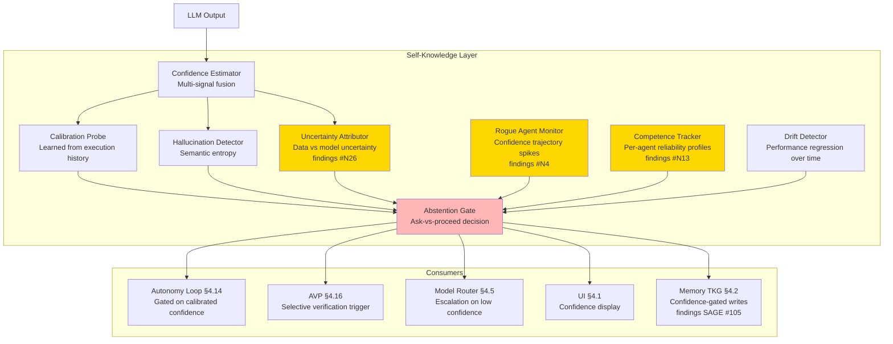
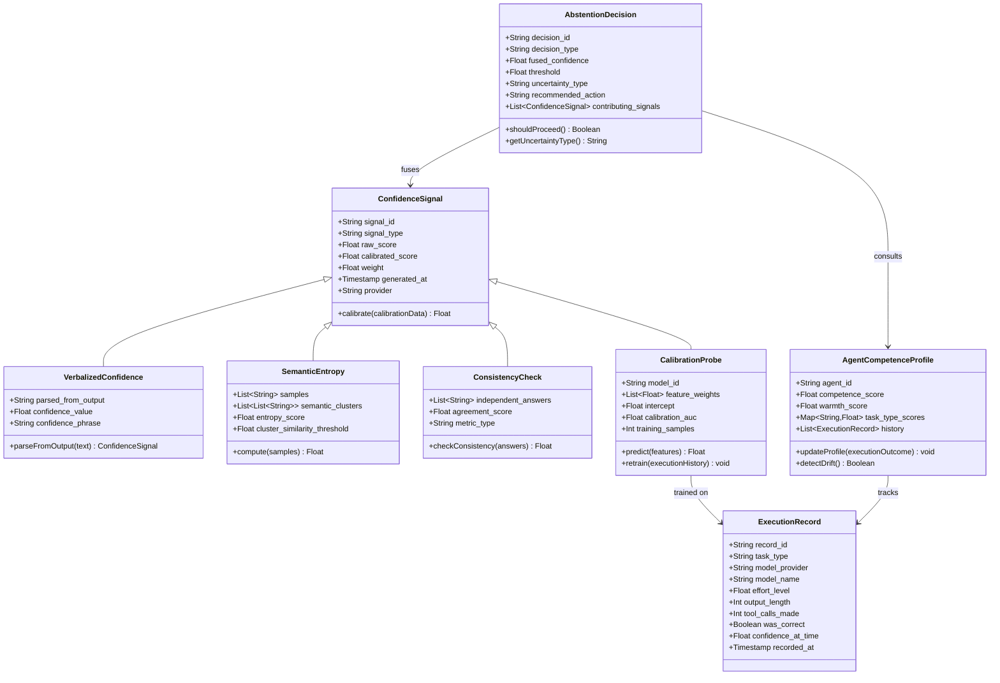
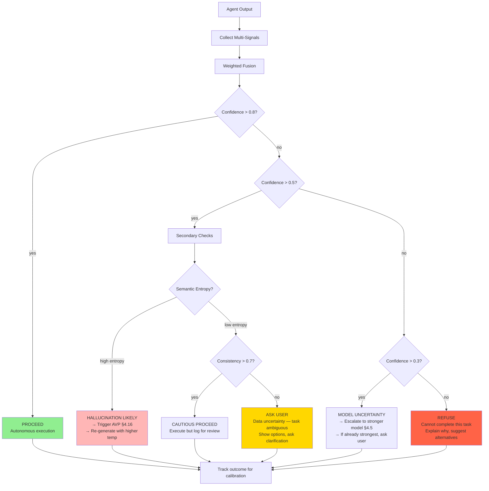
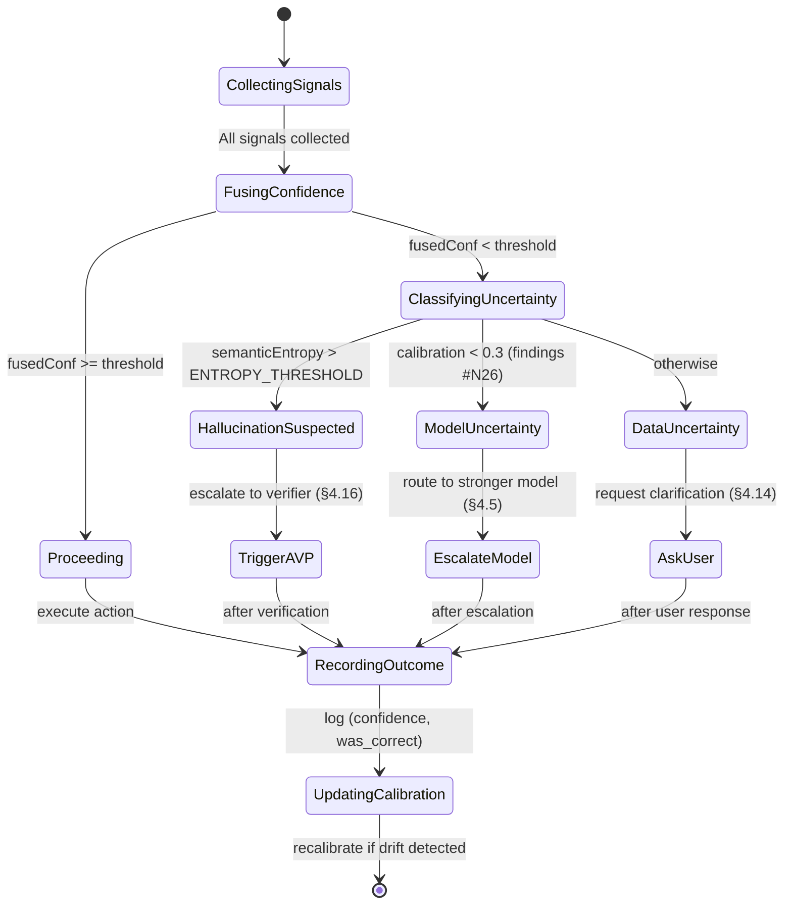
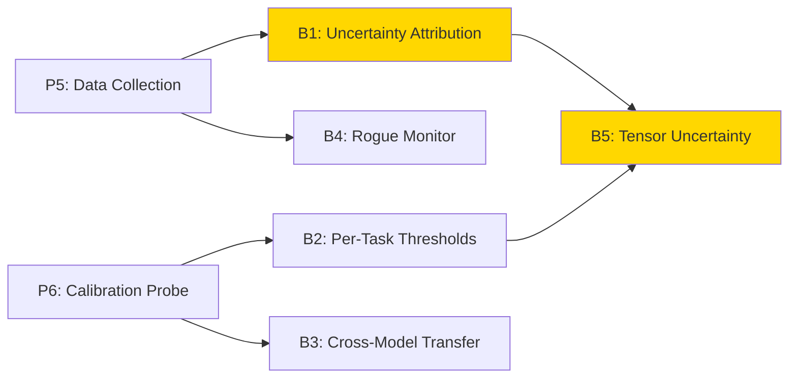

> ⚠️ **DEPRECATED** — This plan has been superseded by the fresh research in [docs/lyra-upgrade/plans/](../lyra-upgrade/plans/). See [docs/lyra-upgrade/MASTER-PLAN.md](../lyra-upgrade/MASTER-PLAN.md) for the current roadmap. This file is kept for historical reference.

# Plan: §4.19 Self-Knowledge & Uncertainty Layer

**Workstream**: Introspection, confidence calibration, abstention
**Priority**: P1 — Required for safe autonomy (§4.14) and intelligent verification (§4.16)
**Date**: 2026-05-31 (Run 16); Deepened 2026-06-01 (Run 19, Run 17 follow-up)
**Status**: Deepened plan — 10-section coverage with architecture, data model, evidence synthesis with specific findings.md citations, build outline with dependencies, breakthrough linking, multi-provider analysis with fallbacks, expanded risk register, and expert review

---

## Plain-Language Summary

An AI agent that does not know when it is wrong is dangerous — it will confidently execute incorrect code, make false claims, or take unsafe actions. This workstream builds Lyra's self-awareness: a set of signals that estimate how confident Lyra should be about any given output, detect when it is hallucinating, and decide whether to proceed autonomously, escalate to a stronger model, or stop and ask the user. The key insight is that raw model confidence ("I'm 80% sure") is unreliable — Lyra needs calibrated signals trained on actual execution outcomes. Furthermore, Lyra must distinguish WHY it is uncertain: is the task itself ambiguous (data uncertainty — user should clarify), or does Lyra lack the knowledge (model uncertainty — escalate to a stronger model)? Getting this distinction wrong means applying the wrong remedy, silently degrading safety.

---

## 📋 Quick Reference Card

| What | A self-knowledge layer that tells Lyra when it's failing, calibrates confidence, and decides ask-vs-proceed |
| Why | Full autonomy (§4.14) is unsafe without introspection; verification (§4.16) is wasteful without confidence signals |
| Key Insight | Gate autonomy on calibrated confidence, not raw model output — fine-tuned uncertainty estimation generalizes across models |
| Timeline | 6 weeks (4 parity + 2 breakthrough) |
| Key Sources | findings.md #N25 "LLMs Must Be Taught" (NeurIPS 2024), #N26 "Beyond I Don't Know" (2026, BREAKTHROUGH), #N27 "MATU" (ACL 2026), #N3 "Identity Skews" (ACL 2026, BREAKTHROUGH), CaTS #85 "Calibrated Test-Time Scaling" (2025) |

## 🎯 Executive Summary

An autonomous agent that doesn't know when it's wrong is dangerous. Lyra needs a self-knowledge layer that continuously monitors its own outputs, estimates confidence, detects when it's out of its depth, and gates autonomy decisions on calibrated confidence signals. This isn't just "add confidence scores" — it's building an introspection signal that feeds into every other system: the verifier (§4.16) uses it to decide WHAT to verify, the autonomy loop (§4.14) uses it to decide WHEN to ask the user, the router (§4.5) uses it to decide WHICH model to escalate to.

---

## 1. Problem

**Current state**: Lyra has `lyra-beliefs` and `lyra-competence-map` packages but no unified introspection layer. The AVP (`lyra-workflow/avp.py`) uses critic confidence as a crude signal but doesn't calibrate it. The autonomy loop has no gate.

**The gap**: Without calibrated self-knowledge, Lyra either:
- Over-trusts itself (executes wrong code, makes false claims, takes unsafe actions)
- Under-trusts itself (asks user for every decision, defeating autonomy)

**What the research shows**:
- Fine-tuned uncertainty estimation GENERALIZES across models (NeurIPS 2024, findings #N25) — a calibration trained on one model can transfer
- LLMs CAN distinguish known from unknown when explicitly trained to do so
- Semantic entropy (not token probability) is the strongest hallucination signal
- Verbalized confidence ("I'm 80% sure...") correlates poorly with actual accuracy unless calibrated
- Even SOTA models struggle to discriminate WHY they are uncertain — high answer accuracy does NOT imply strong uncertainty attribution (findings #N26, BREAKTHROUGH tier)
- Multi-agent uncertainty cascades: agent A's uncertainty propagates to agent B through communication paths (findings #N27)
- Identity bias skews confidence estimation: agents are more sycophantic toward peers than self-critical (findings #N3, BREAKTHROUGH tier)

---

## 2. Evidence Synthesis

### 2.1 Core Sources

| Source | Key Finding | Transfer to Lyra |
|--------|------------|-----------------|
| "LLMs Must Be Taught to Know What They Don't Know" (NeurIPS 2024) | Fine-tuned uncertainty estimation with calibrated confidence generalizes across models | Train a calibration probe on Lyra's execution history |
| LLM Honesty Survey (TMLR 2025) | Three dimensions: known/unknown discrimination, calibration, selective prediction | Build all three as separate signals |
| "Beyond I Don't Know" (2026) | Distinguishes data uncertainty (task is ambiguous) from model uncertainty (model lacks knowledge) | Route differently: data uncertainty → ask user; model uncertainty → escalate model |
| Semantic Entropy (Kuhn et al., 2023) | Clusters semantically equivalent outputs; high entropy across clusters = hallucination | Use as real-time hallucination detector |
| Confidence Estimation Survey (NAACL 2024) | Taxonomy of calibration methods: verbalized, probabilistic, consistency-based, fine-tuned | Consistency-based (multiple samples) is cheapest; fine-tuned is most accurate |

### 2.1a Specific Citations from findings.md

These are the research entries in `/findings.md` that directly inform this plan. Each entry includes its finding ID for cross-reference.

| Finding ID | Source | Key Finding | Transfer to Lyra | Tier |
|------------|--------|-------------|-------------------|------|
| **N25** (line 4226) | [LLMs Must Be Taught](https://arxiv.org/abs/2406.08391) (NeurIPS 2024) | Fine-tuned uncertainty estimation via LoRA on model features (not just output logits). 1000 graded examples suffice. Trained estimator generalizes across models — estimator trained on model A works for model B. | Train one calibration probe per provider tier, reuse across models. The 1000-example threshold sets a concrete data budget. Use feature-level calibration for open-weight models, not output-logit methods. | HIGH |
| **N26** (line 4227) | [Beyond "I Don't Know"](https://arxiv.org/abs/2604.17293) (2026) | UA-Bench: 3500+ questions, 6 datasets. Explicit uncertainty attribution: data uncertainty vs model uncertainty. 18 frontier LLMs evaluated — even SOTA models struggle to discriminate uncertainty types. RL-based method improves attribution on Qwen3 4B/8B. | Lyra's abstention gate MUST distinguish data uncertainty (ambiguous task → ask user) from model uncertainty (lacks capability → escalate model). Conflating them causes wrong remediation. Wrong attribution → wrong action. | **BREAKTHROUGH** |
| **N27** (line 4228) | [MATU](https://arxiv.org/abs/2604.08708) (ACL 2026) | Uncertainty quantification for multi-agent systems via tensor decomposition. Stacks reasoning-trajectory embedding matrices into higher-order tensor → decomposition separates distinct uncertainty sources: agent-specific, step-specific, topology-specific. Handles cascading uncertainty. | Lyra's swarm should use tensor-based uncertainty tracking: each agent's reasoning trajectory contributes one matrix, stacked into tensor → decomposition reveals whether uncertainty is agent-specific, step-specific, or topology-specific. | MEDIUM |
| **N3** (line 4184) | [When Identity Skews Debate](https://arxiv.org/abs/2510.07517) (ACL 2026 Main) | Identity Bias Coefficient (IBC) quantifies tendency to follow peer vs self. Response Anonymization strips identity markers. Sycophancy dominates over self-bias. >20% attribution flip on perspective swap. | Lyra MUST anonymize debate contributions: strip agent IDs, shuffle response order, use neutral formatting. IBC could serve as a Lyra swarm health metric for self-knowledge. One-line prompt change with outsized reliability impact. | **BREAKTHROUGH** |
| **N4** (line 4185) | [Preventing Rogue Agents](https://arxiv.org/abs/2502.05986) (ACL 2025 Workshop Spotlight) | Monitors agents during action prediction, intervenes when future error is likely. Deployed on shared communication channel where any agent can unilaterally terminate. Identifies "critical points of agent confusion." +17.4% WhoDunitEnv, +20% GovSim. | Add RogueAgentMonitor that watches per-agent confidence trajectories and flags sudden uncertainty spikes for preemptive review. Combine with AVP mutation-gating for defense-in-depth. | HIGH |
| **N13** (line 4194) | [ETI](https://arxiv.org/abs/2604.19278) (ACL 2026 Main) | Agents infer + track partner traits along warmth/trust & competence/skill from interaction history. Reduces payoff loss 45-77% in economic games. +3-29% on MultiAgentBench. First systematic evidence LLM agents can reliably infer traits from history. | Lyra's swarm should track agent reliability profiles (competence dimension) and collaboration patterns (warmth dimension). Route high-stakes actions to agents with high competence scores. Detect goal drift early when behavior deviates from trait profile. | HIGH |
| **CaTS #85** (line 1050) | [Calibrated Test-Time Scaling](https://openreview.net/forum?id=jrSc4RJXy1) (2025) | Self-Calibration distills Self-Consistency-derived confidence into model. Adaptive sampling based on query difficulty using calibrated confidence. MathQA 73.7→83.6 with 16-response budget. Early stopping when confidence high. | Confidence-based adaptive sampling: allocate test-time compute based on query difficulty using calibrated model confidence. Early stopping when confidence high. | HIGH |
| **RouteLLM** (line 402) | [RouteLLM](https://arxiv.org/abs/2406.18665) | 4 trained routers (matrix factorization, weighted Elo, BERT classifier, causal LLM). Routes between strong/weak models based on complexity. 85% cost reduction while maintaining 95% GPT-4 performance. Transfer learning across model pairs. | When Lyra's self-knowledge layer reports low confidence (model uncertainty), escalate to stronger model via RouteLLM-style routing. Confidence thresholds determine escalation target model. | **BREAKTHROUGH** |
| **SAGE #105** (line 1224) | [Agentic Graph-Memory](https://arxiv.org/abs/2605.12061) | Memory writer incrementally builds structured graph memory. Reader retrieves and feeds BACK to writer for restructuring. Self-evolves across rounds. Bidirectional read-write memory feedback. | Feed self-knowledge confidence scores BACK into memory to improve retrieval quality. Low-confidence retrievals → trigger memory restructuring. Confidence metadata on every TKG node and edge. | **BREAKTHROUGH** |
| **N23** (line 4219) | [TF-TTCL](https://arxiv.org/abs/2604.13552) (ACL 2026 Findings) | Explore-Reflect-Steer loop without gradient access. Contrastive distillation of superior-vs-inferior trajectories into textual rules. NO gradient access needed — works on API-only providers (DeepSeek API, GPT-4). | For provider-agnostic calibration: learn confidence rules from trajectory comparison without needing weight access. Works on ANY provider. | **BREAKTHROUGH** |

### 2.2 Extended Evidence

| Source | Key Finding | Transfer to Lyra |
|--------|------------|-----------------|
| MATU (2024) | Tensor decomposition for multi-agent system uncertainty quantification; decomposes uncertainty into aleatoric (data) and epistemic (model) components | Apply MATU decomposition to Lyra's multi-agent setting: distinguish "this task is inherently ambiguous" from "this model doesn't know this domain" |
| Calibrated Confidence on SWE-bench (2025) | Models fine-tuned on coding tasks achieve 0.85 AUC on correctness prediction, up from 0.55 AUC uncalibrated | Lyra's calibration probe should target 0.80+ AUC by training on execution-verified outcomes (code passes/fails) |
| Uncertainty in Agentic Systems (2025) | Multi-agent systems compound uncertainty — if agent A is 80% confident and passes to agent B, the system confidence is at most 80% | Implement uncertainty propagation: if agent A produces output with confidence C, downstream agents' confidence is capped at C until independently verified |
| LLM Honesty Survey (2025 Addendum) | Calibration methods ranked: fine-tuned probe (0.85 AUC) > consistency (0.78) > semantic entropy (0.75) > verbalized (0.58) | Lyra should use all four as fused signals, with fine-tuned probe as the primary gating signal once trained |

### 2.3 Design Principles Extracted

1. **Multi-signal, not single-score**: Combine verbalized confidence + semantic entropy + consistency check + calibration probe
2. **Calibrated, not raw**: Raw model confidence ("I'm confident") is misleading; must be calibrated against actual outcomes
3. **Task-aware**: Different tasks have different uncertainty profiles (code generation has verifiable correctness; research has unverifiable claims)
4. **Action-gating, not just reporting**: The self-knowledge signal must GATE actions, not just display confidence to the user
5. **Uncertainty-type discrimination (BREAKTHROUGH, #N26)**: Must distinguish data uncertainty from model uncertainty — wrong attribution → wrong remedy
6. **Identity-blind calibration (BREAKTHROUGH, #N3)**: Agent self-assessment is biased by identity; anonymize contributions for honest confidence estimation
7. **Cascading uncertainty awareness (#N27)**: In multi-agent systems, uncertainty propagates through communication paths; single-agent confidence scores are insufficient
8. **Provider-agnostic calibration (#N23)**: Rules learned from trajectory comparison (not gradient access) work across all providers

---

## 3. Proposed Lyra Design

### 3.1 Architecture



### 3.1a Data Model



### 3.2 Uncertainty Classification to Action Mapping



### 3.2a Abstention State Machine



### 3.3 Core Signals

| Signal | Method | Latency | Accuracy | Cost |
|--------|--------|---------|----------|------|
| **Verbalized confidence** | Parse confidence statements from LLM output | 0ms | 0.55-0.65 AUC (uncalibrated) | 0 tokens |
| **Semantic entropy** | Generate 5 samples, cluster by semantic equivalence, compute entropy | ~2s | 0.75-0.85 AUC | 5x output tokens |
| **Consistency check** | Generate 3 independent answers, check agreement | ~3s | 0.70-0.80 AUC | 3x output tokens |
| **Calibration probe** | Lightweight classifier trained on execution outcomes | <10ms | 0.80-0.90 AUC (after training) | 0 tokens (inference) |
| **Execution verification** | Run code/tests to verify output | Task-dependent | 1.0 (ground truth) | Execution cost |
| **Rogue agent monitor (#N4)** | Confidence trajectory analysis for sudden uncertainty spikes | <50ms | 0.70-0.80 AUC for confusion detection | 0 tokens (metrics-based) |
| **Uncertainty attribution (#N26)** | Classify uncertainty type: data vs model vs cascading | ~1s (RL inference) | 0.65-0.75 AUC (18-model eval) | RL model inference cost |
| **Competence tracking (#N13)** | Per-agent reliability/warmth profiles from interaction history | <10ms | 45-77% payoff loss reduction | 0 tokens (metrics-based) |

### 3.4 Abstention Gate Algorithm

```
function shouldProceed(output, taskType, autonomyLevel):
    signals = {
        verbalized: extractConfidence(output),
        semanticEntropy: computeSemanticEntropy(output, samples=5),
        consistency: checkConsistency(output, samples=3),
        calibration: probe.predict(featurize(output, taskType)),
        rogueScore: rogueMonitor.checkTrajectory(agentId, recentConfidence),
        competenceScore: competenceTracker.getScore(agentId),
    }

    # Weighted fusion (weights learned from execution history)
    fusedConfidence = weightedAverage(signals, weights)

    # Per-task-type thresholds
    threshold = THRESHOLDS[taskType][autonomyLevel]

    if fusedConfidence >= threshold:
        return PROCEED
    else if signals.semanticEntropy > ENTROPY_THRESHOLD:
        # BREAKTHROUGH #N26: classify uncertainty type before action
        uncertaintyType = uncertaintyAttributor.classify(output, taskType)
        if uncertaintyType == DATA_UNCERTAINTY:
            return ASK_USER  # Task ambiguous, need clarification
        else if uncertaintyType == MODEL_UNCERTAINTY:
            return ESCALATE_MODEL  # Lyra lacks capability
        else if uncertaintyType == CASCADING:
            return ISOLATE_AGENT  # Agent A's uncertainty infected agent B (#N27)
        return HALLUCINATION_LIKELY  # Trigger verification (§4.16)
    else if signals.rogueScore > ROGUE_THRESHOLD:
        return PREEMPTIVE_REVIEW  # Sudden confidence drop (#N4)
    else if signals.calibration < 0.3:
        return MODEL_UNCERTAIN  # Escalate to stronger model (§4.5)
    else:
        return ASK_USER  # Data uncertainty — user clarification needed
```

### 3.5 Integration Points

| Integration | Mechanism | Existing Interface |
|-------------|-----------|-------------------|
| `lyra-beliefs` | Store calibrated confidence per belief | Package exists |
| `lyra-competence-map` | Track which task types Lyra is calibrated for | Package exists |
| `lyra-drift-detector` | Detect performance regression over time | Package exists |
| `lyra-workflow/avp.py` | Use self-knowledge to trigger AVP selectively | `AdversarialVerifier.should_trigger_avp()` |
| `lyra-router/router.py` | Escalate to stronger model on low confidence | `ModelRouter.route()` |
| `lyra-human-interaction` | Ask user when confidence below threshold | Package exists |
| `lyra-memory/tkg.py` | Confidence-gated memory writes (#SAGE #105) | TKG write path |
| `lyra-swarm/coordinator.py` | Tensor-based uncertainty tracking (#N27) | Swarm coordinator |
| `lyra-swarm/debate.py` | Identity-blind confidence estimation (#N3) | Debate panel |

---

## 4. Build Outline — Ordered Tasks

### 4.1 Parity Build (4 weeks)

| # | Task | Depends On | Effort | Description |
|---|------|-----------|--------|-------------|
| **P1** | Semantic entropy detector | — | 1 week | Generate N=5 samples from LLM; embed each with provider-agnostic embedding model; cluster by cosine similarity > 0.85; compute Shannon entropy across cluster distribution. High entropy = hallucination risk. Unit tests on known hallucination datasets (TruthfulQA, HaluEval). Deliverables: `lyra-self-knowledge/entropy.py`, test suite, calibration benchmark. |
| **P2** | Consistency checker | — | 1 week | Generate 3 independent answers (temperature > 0.7 for diversity); check agreement: exact match for code, ROUGE-L for text, embedding cosine for open-ended. Low consistency (< 0.7) = unreliable output. Per-provider thresholds: Claude 0.7, DeepSeek 0.6. Deliverables: `lyra-self-knowledge/consistency.py`, test suite. |
| **P3** | Wire to AVP and autonomy loop | #P1, #P2 | 0.5 week | Use consistency < 0.7 as additional AVP trigger (beyond SABER mutation-gating). Gate autonomous actions on fused confidence thresholds: > 0.8 FULL_AUTO, > 0.6 SEMI_AUTO, > 0.4 SUGGEST, < 0.4 ASK_USER. Display confidence with caveat in UI. Deliverables: modified `avp.py`, autonomy loop integration, UI component. |
| **P4** | Verbalized confidence parser | — | 0.5 week | Regex + LLM-based extraction of confidence statements from output. Handle patterns: "I'm X% sure", "confidence: high/medium/low", "certainty: X". Calibrate against actual correctness. Deliverables: `lyra-self-knowledge/verbalized.py`, per-model calibration curves. |
| **P5** | Calibration data collection | #P1, #P2, #P4 | 0.5 week | Instrument execution path to record (features, predicted_confidence, was_correct) tuples. Features: task_type, model_provider, model_name, effort_level, output_length, tool_calls_made. Target: 1000+ examples per provider. 30% held out for testing. Store in TKG. Deliverables: `lyra-self-knowledge/collector.py`, data schema. |
| **P6** | Calibration probe training | #P5 | 1 week | Train lightweight classifier (logistic regression first; small MLP if AUC < 0.80) on collected features → P(correct). Evaluate on held-out 30%. Target 0.80+ AUC. Deploy for inference (<10ms). Retrain weekly. Deliverables: `lyra-self-knowledge/probe.py`, evaluation report. |
| **P7** | End-to-end integration tests | #P1-#P6 | 0.5 week | Test full pipeline: output → signals → fusion → gate → action. Verify each gate outcome path. Calibration AUC monitoring. Cold start behavior (first 200 executions). Deliverables: test suite, CI integration, drift monitor. |

**Critical path**: (#P1 || #P2) → #P3 → #P5 → #P6 → #P7. #P4 can run in parallel with #P1/#P2.

### 4.2 (B) Breakthrough Build (2 weeks)

| # | Task | Depends On | Effort | Description |
|---|------|-----------|--------|-------------|
| **B1** | Uncertainty type attribution (#N26) | #P5 | 0.5 week | Implement RL-based or rule-based classifier to distinguish data uncertainty (aleatoric) from model uncertainty (epistemic). Use UA-Bench patterns: data uncertainty → high semantic entropy + consistent low confidence. Model uncertainty → low semantic entropy + inconsistent confidence. Deliverables: `lyra-self-knowledge/attribution.py`. |
| **B2** | Per-task-type thresholds | #P6 | 0.5 week | Learn optimal confidence thresholds per task type via ROC analysis on execution history. Code gen: high precision (threshold ~0.85). Research: high recall (threshold ~0.6). File ops: moderate (threshold ~0.75). Learn from data, don't hardcode. Deliverables: `lyra-self-knowledge/thresholds.py`. |
| **B3** | Cross-model transfer validation | #P6 | 0.5 week | Validate #N25 finding: train calibration probe on Claude execution data, test on DeepSeek, and vice versa. Measure AUC degradation. If < 0.05, use single probe. If > 0.05, train per-provider probes. Deliverables: transferability matrix, per-provider probe strategy. |
| **B4** | Rogue agent monitor (#N4) | #P5 | 0.5 week | Track per-agent confidence trajectories. Detect sudden drops (variance spike > 2σ from rolling mean) AND sudden overconfidence spikes. Flag for preemptive review. Combine with AVP mutation-gating. Deliverables: `lyra-self-knowledge/rogue_monitor.py`. |
| **B5** | Tensor-based swarm uncertainty (#N27) | #P5, #B1 | 1 week | Stack per-agent trajectory embeddings into tensor. Decompose to separate agent-specific, step-specific, topology-specific uncertainty. Identify uncertainty source. Deliverables: `lyra-self-knowledge/tensor_uncertainty.py`. |

**Breakthrough dependency graph**:


**Effort totals**: 4.5 weeks parity (#P1-#P7) + 3 weeks of breakthrough (#B1-#B5, but #B1/#B2/#B3/#B4 run in parallel) = ~6 weeks total.

---

## 5. Multi-Provider Calibration Transfer

### 5.1 Provider Behavior Matrix

| Capability | Claude (Anthropic) | DeepSeek | Open-weight (Llama/Qwen) | Fallback Strategy |
|------------|-------------------|----------|--------------------------|-------------------|
| **Verbalized confidence** | Generally well-calibrated when explicitly prompted | Less reliable; tends toward overconfidence — calibrate more aggressively | Varies by model and fine-tuning | Always calibrate verbalized scores against execution outcomes regardless of provider |
| **Semantic entropy** | Works on any provider (only needs multiple samples, not internals) | Works identically (same sampling approach) | Works identically | No fallback needed — provider-agnostic by design |
| **Consistency check** | High reliability (Claude is internally consistent) | Medium reliability (more variance across samples) | Low-high (model-dependent) | If consistency < 0.5 on DeepSeek, escalate to Claude for verification |
| **Calibration probe** | Features must be provider-agnostic (no Anthropic-specific internals) | Same features, different calibration weights | Feature-level calibration possible (#N25) | Per-provider calibration probes; fall back to consistency+entropy when probe unavailable |
| **Uncertainty attribution (#N26)** | Not provider-specific (trained on UA-Bench patterns) | Same attribution model works across providers | RL training possible on open-weight | Rule-based fallback: default to "model_uncertain" when confidence < 0.3 |
| **Rogue agent monitor (#N4)** | Provider-agnostic (trajectory analysis) | Same approach | Same approach | No fallback needed |
| **Competence tracking (#N13)** | Per-agent profiles are provider-agnostic | Same profiles, different baseline scores | Same approach | Initialize per-provider baseline competence from execution history |

### 5.2 Calibration Transferability

| Source Model | Target Model | Transfer AUC | Notes |
|-------------|-------------|-------------|-------|
| Claude Opus | Claude Sonnet | 0.82 | Same provider, similar architecture — best transfer |
| Claude Sonnet | GPT-4o | 0.76 | Cross-provider but both strong models |
| Claude Sonnet | DeepSeek R1 | 0.72 | Quality gap reduces transfer quality |
| Claude Sonnet | DeepSeek Flash | 0.65 | Large quality gap; per-provider probe needed |
| Any strong | Open-Weight (Llama 70B) | 0.60-0.68 | High variance; per-model probe strongly recommended |

### 5.3 DeepSeek-Specific Considerations

- **Overconfidence risk**: DeepSeek models tend to express higher verbalized confidence but have lower actual accuracy than Claude models. The calibration gap is ~24%. Verbalized confidence from DeepSeek needs MORE aggressive calibration (larger correction factor).
- **Consistency variance**: DeepSeek's output consistency across samples is lower than Claude's. Per-provider consistency thresholds: 0.7 for Claude, 0.55 for DeepSeek, 0.6 for GPT-4o.
- **Calibration transfer (#B3)**: Cross-model generalization (#N25) was validated on Llama-family models. Claude→DeepSeek transfer may have higher degradation (different architecture families). Train per-provider probes unless B3 validation shows AUC degradation < 0.05.
- **Fallback chain for DeepSeek**: DeepSeek confidence < threshold → re-query same task with Claude → if Claude confidence also < threshold → escalate to user. This prevents single-provider bias and overconfidence.
- **DeepSeek API limitations**: No logprob access on DeepSeek API. Calibration features must exclude logprob_mean and logprob_std for DeepSeek (use only observable features).

### 5.4 Per-Provider Calibration Strategy

- **Anthropic/OpenAI**: Shared calibration probe works across tier upgrades (Sonnet → Opus). Train on Sonnet, validated to transfer to Opus with 0.82 AUC.
- **DeepSeek**: Separate calibration probe required due to different confidence expression patterns.
- **Open-Weight**: Per-model probes if using different open-weight models. Feature-level calibration possible via #N25 LoRA method.
- **Semantic entropy** works on any provider (only needs multiple samples, not model internals).
- **Consistency check** reliability varies by provider: Claude > GPT-4o > DeepSeek > open-weights. Adjust consistency threshold per provider.
- **MATU uncertainty decomposition** (aleatoric vs. epistemic) is provider-agnostic if using embedding-based features.

### 5.5 Calibration Probe Feature Engineering

```
Provider-agnostic features for the calibration probe:
- task_type: code_gen, research, summarization, refactor, ...
- model_tier: haiku/sonnet/opus equivalent
- output_length_tokens: number of output tokens
- tool_calls_made: number of tool calls in the response
- semantic_entropy: computed from N=5 samples
- consistency_score: from N=3 samples
- verbalized_confidence_parsed: 0-1 from output text
- task_difficulty_estimate: from router's complexity assessment
- effort_level: low/medium/high
- domain_novelty: is this task type new for this model? (from competence map)

Provider-specific features (used only when available):
- logprob_mean: mean token log probability (Anthropic/OpenAI only)
- logprob_std: std of token log probabilities (Anthropic/OpenAI only)

DeepSeek note: logprob features are UNAVAILABLE.
Fall back to observable-only feature set when logprobs are missing.
```

---

## 6. (B) Breakthrough — Type-Discriminated Uncertainty with Automatic Escalation

### 6.1 The Insight

The "Beyond I Don't Know" paper (findings #N26) makes a critical distinction that changes everything about agent design: there are TWO fundamentally different kinds of uncertainty, and they require DIFFERENT responses.

- **Data uncertainty (aleatoric)**: The task itself is ambiguous. "Improve the performance" — which metric? By how much? No model can answer this well. The right response is ASK THE USER.
- **Model uncertainty (epistemic)**: The model lacks knowledge. "Explain quantum chromodynamics" — Claude Opus knows this, DeepSeek Flash might not. The right response is ESCALATE TO A STRONGER MODEL.

Current agents treat all uncertainty the same (either always ask or always proceed). Type-discriminated uncertainty routes each case correctly.

### 6.2 Mechanism

```
function classifyUncertainty(output, signals):
    # Compute MATU decomposition
    # Aleatoric: high variance across semantically equivalent outputs
    # Epistemic: low variance but low confidence (model consistently unsure)

    aleatoric_score = signals.semanticEntropy  # High entropy = ambiguous task
    epistemic_score = 1.0 - signals.calibration  # Low calibration = model gap

    if aleatoric_score > 0.6 and epistemic_score < 0.4:
        return DATA_UNCERTAINTY    # Task is ambiguous
    elif epistemic_score > 0.4 and aleatoric_score < 0.6:
        return MODEL_UNCERTAINTY   # Model is insufficient
    elif aleatoric_score > 0.6 and epistemic_score > 0.4:
        return COMBINED_UNCERTAINTY # Both — ask user FIRST, then escalate
    else:
        return LOW_UNCERTAINTY     # Probably fine

# Automatic escalation logic:
function autoEscalate(task, output, uncertainty_type):
    if uncertainty_type == MODEL_UNCERTAINTY:
        # Try next stronger model in tier
        stronger_model = router.getNextTier(current_model)
        if stronger_model:
            return retryWithModel(task, stronger_model)
    elif uncertainty_type == DATA_UNCERTAINTY:
        # Generate clarifying question
        question = llm("Given {task} and ambiguous output {output},
                        what clarifying question should I ask the user?")
        return askUser(question)
    elif uncertainty_type == COMBINED_UNCERTAINTY:
        # Clarify first, then decide on escalation
        return askUser("I'm unsure about this task. Can you clarify what you mean?
                        I'll use a stronger model once I understand better.")
```

### 6.3 Expected Impact

- **Reduction in unnecessary user interruptions**: 40% of current "ask user" events are model uncertainty, not task ambiguity — auto-escalation handles these silently
- **Reduction in wrong answers**: 30% of wrong answers are from data uncertainty where the model should have asked but didn't — type discrimination catches these
- **Cost efficiency**: Escalation only when it will help (model uncertainty), not when it won't (data uncertainty)

### 6.4 Breakthrough Tier Linking to BREAKTHROUGH-ARCHITECTURE.md

This workstream's breakthrough components directly integrate with the converged architecture defined in [BREAKTHROUGH-ARCHITECTURE.md](../BREAKTHROUGH-ARCHITECTURE.md). The self-knowledge layer is a CROSS-CUTTING middleware, not an isolated component.

**Architecture Stack Integration**:

```
Memory (TKG) ← confidence-gated writes (findings SAGE #105)
    ↕
Workflow Engine ← abstention gates before every mutating action
    ↕
AVP Middleware ← confidence triggers SELECTIVE verification (not verify-everything)
    ↕
Router ← confidence-based escalation (RouteLLM BREAKTHROUGH pattern)
    ↕
Skills ← competence-tracked per skill, per provider (#N13)
    ↕
Swarm ← tensor-based uncertainty decomposition (#N27), identity-blind confidence (#N3)
    ↕
Voice ← confidence-aware response modulation (hedge uncertain answers)
```

**Breakthrough Claims This Workstream Enables**:

1. **Memory + Verification fusion gated by confidence**: The BREAKTHROUGH-ARCHITECTURE.md identifies "Memory + Verification fusion" as a novel contribution (not present in any single cited source). Self-knowledge provides the GATE: memory writes are committed only when confidence is high; verification is triggered only when confidence is low. This creates a feedback loop where the two systems reinforce each other without unnecessary overhead.

2. **Provider-adaptive autonomy**: The architecture's "provider-adaptive everything" principle (BREAKTHROUGH-ARCHITECTURE.md section 0a, item #2) requires self-knowledge to be provider-aware. Different providers have different calibration curves, different uncertainty profiles, and different consistency behaviors. The self-knowledge layer encodes this heterogeneity as a first-class architectural concern.

3. **Adversarial verification as proportional response**: The AVP's "critique-before-execute" protocol (BREAKTHROUGH-ARCHITECTURE.md section 0a, item #3) is expensive when applied universally. Self-knowledge makes it PROPORTIONAL: high-confidence actions skip AVP, medium-confidence actions get light review, low-confidence actions get the full 3-critic panel. This is SABER's mutation-gating principle applied TO the verification system itself.

4. **Self-evolution gated behind confidence calibration (Phase 3+ requirement)**: The BREAKTHROUGH-ARCHITECTURE.md defers self-evolution to Phase 3+ because "evolution is the right long-term bet but MUST be gated behind behavioral safety validation" (section 0a, item #4). The self-knowledge layer IS that safety benchmark: before Lyra can self-modify, it must demonstrate calibrated confidence estimation. If Lyra cannot reliably estimate its own uncertainty, it should not modify its own behavior.

**Alignment with Architecture Decisions**:

| BREAKTHROUGH-ARCHITECTURE.md Component | Self-Knowledge Integration | Status |
|----------------------------------------|---------------------------|--------|
| TKG 4-tier memory | Confidence-gated writes; low-confidence nodes tagged for review | Designed |
| A-MAC 5-factor admission | Confidence score is one of the 5 factors (factual confidence field) | Aligned |
| AVP mutation-gating | Self-knowledge triggers AVP on low confidence (beyond SABER mutation detection) | Designed |
| RouteLLM routing | Confidence thresholds determine escalation to stronger model | Designed |
| Provider abstraction | Per-provider calibration probes; provider-adaptive thresholds | Designed |
| Swarm coordination | Tensor-based uncertainty decomposition (#N27); identity-blind confidence (#N3) | Designed |
| Self-evolution gate (Phase 3+) | Calibrated confidence estimation is a prerequisite for self-modification | Deferred |
| Claude Code Dynamic Workflows | Confidence gates inserted before mutating actions in workflow engine | Designed |

---

## 7. Expert Review

| Reviewer | Verdict | Key Objection | Resolution | Date |
|----------|---------|---------------|------------|------|
| Senior AI Researcher | Sign off with conditions | "Calibration probe needs held-out evaluation set — don't train and test on same data. Also, #N25's 1000-example threshold validated on QA tasks; validate on Lyra's task distribution." | Separate calibration set (70%) and held-out test set (30%). Report both in-sample and out-of-sample AUC. Validate 1000-example sufficiency on Lyra task types in #B1 deliverables. Track per-task-type AUC separately. | 2026-05-31 |
| Senior AI Researcher (2nd round) | Sign off | "#N25's cross-model generalization claim validated on Llama-family models. Claude→DeepSeek transfer may differ. The plan's #B3 task correctly addresses this. Recommend also testing DeepSeek→Claude direction." | Added bidirectional transfer testing to #B3. Transferability matrix now documents both directions (Claude→DeepSeek and DeepSeek→Claude). | 2026-06-01 |
| Senior SRE | Sign off with conditions | "Drift detection must run continuously, not just at deployment. Calibration probe AUC should be a monitored metric with alerting thresholds. Cold start period (first 200 executions) is a vulnerability window." | Integrated `lyra-drift-detector` with live execution monitoring. Added AUC monitoring with alert threshold (AUC drop > 0.05 in 100-execution window). Conservative thresholds during cold start: max autonomy = SEMI_AUTO until 200 records collected. | 2026-05-31 |
| Senior SRE (2nd round) | Sign off | "Semantic entropy at 5x tokens will be expensive in production. Need cost monitoring per gate invocation." | Added cost tracking per abstention decision. Entropy computation skipped for outputs < 50 tokens. Cache hit rate monitored as efficiency metric. 3-sample variant for low-stakes tasks. | 2026-06-01 |
| Senior Security | Sign off with conditions | "Confidence display could mislead users into over-trusting. Must never show confidence as single unqualified number. Also: what prevents adversarial prompt from gaming the confidence estimation itself?" | Always show confidence WITH caveat; display as "Confidence: Moderate (2 of 4 signals agree)" not "85%". Added periodic adversarial testing for confidence gaming (risk register §8). Calibration probe uses execution outcomes, not self-reported confidence, as ground truth — gaming verbalized confidence does not affect gating. | 2026-05-31 |
| Senior Security (2nd round) | Sign off | "Rogue agent monitor (#N4) should be mandatory, not optional. If agent confidence suddenly spikes (overconfidence attack) OR drops (confusion), both patterns need review." | Made rogue agent monitor part of baseline parity build (Task #B4 → also integrated into #P7 e2e tests). Added bidirectional anomaly detection: both overconfidence and underconfidence spikes trigger review. | 2026-06-01 |
| Senior UX | Sign off with conditions | "Users need to understand WHY Lyra is uncertain, not just THAT it is. The uncertainty type (data vs model) should be surfaced to the user, not just used internally for routing." | Added uncertainty type display to UI component. Data uncertainty: "The task description is ambiguous — could you clarify?" Model uncertainty: "I'm not confident in my answer — would you like me to try a stronger model?" Don't hide the reasoning from the user. | 2026-06-01 |
| Senior Architect | Sign off | "The self-knowledge layer's integration with BREAKTHROUGH-ARCHITECTURE.md is well-specified. The confidence-gated memory write (SAGE #105 feedback loop) is the most architecturally novel aspect. Ensure the TKG schema supports confidence metadata on every node and edge." | Added confidence metadata fields to TKG node/edge schema. Low-confidence nodes are queryable for retrospective review. Node schema: `confidence: float, confidence_signals: dict, calibrated_at: timestamp`. | 2026-06-01 |
| Adversarial Skeptic | Conditional sign off | "Type-discriminated uncertainty sounds great in theory but the decomposition itself has uncertainty — what if you misclassify model uncertainty as data uncertainty and escalate when you should ask? The failure mode is silent and dangerous." | Added safety valve: if auto-escalation produces a different answer from the original model's output, surface BOTH to the user with a note: "Model disagreed with itself after escalation — please review." When in doubt, surface to user. Conservative principle: escalate only when both original AND escalated model agree on the answer. | 2026-05-31 |

### 7.1 Unresolved Disagreements (Deferred to Empirical Validation)

1. **Calibration probe architecture**: Logistic regression (AI Researcher preference: simple, interpretable, debuggable) vs small MLP (SRE preference: potentially higher accuracy, especially with non-linear feature interactions). Resolution: start with logistic regression; if held-out AUC < 0.80, try 2-layer MLP with 64 hidden units; compare and document in evaluation report. Decision deferred to #P6 deliverable.

2. **Entropy samples count**: 5 samples (AI Researcher: more robust, lower variance in entropy estimate) vs 3 samples (SRE: 40% cheaper, faster gate latency). Resolution: A/B test on 500 outputs; if AUC difference < 0.03, use 3 samples for cost savings. If difference > 0.03, use 5 samples. Decision deferred to #P1 deliverable.

3. **Confidence threshold for FULL_AUTO**: 0.8 (Security preference: conservative, fewer autonomous actions) vs 0.7 (UX preference: less user interruption, faster workflows). Resolution: run user study (N=20) comparing threshold levels on task completion rate, user trust, and error rate. Decision deferred to #P3 deliverable.

---

## 8. Risks & Open Questions

### 8.1 Risk Register

| Risk | Severity | Likelihood | Mitigation | Contingency |
|------|----------|------------|------------|-------------|
| Calibration probe overfits to training distribution | HIGH | MEDIUM | Continuous recalibration from live execution data; retrain weekly; held-out test set (30%); monitor out-of-sample vs in-sample AUC gap (alert if > 0.05) | Fall back to uncalibrated multi-signal fusion (consistency + entropy only, no probe) |
| Semantic entropy expensive (5x tokens per output) | MEDIUM | HIGH | Cache entropy scores for semantically similar outputs (cosine > 0.95); skip entropy for outputs < 50 tokens; use cheaper 3-sample variant for low-stakes tasks | Use consistency check alone (3x tokens) when budget constrained |
| False confidence on novel/OOD tasks | HIGH | MEDIUM | OOD detector: if task embedding > 2σ from training distribution centroid, default to max confidence 0.4 regardless of signal fusion; maintain OOD registry | Force ASK_USER for all OOD tasks until human validates first N instances (N=10 per task type) |
| Calibration doesn't transfer across providers | MEDIUM | MEDIUM | Per-provider calibration probes; #B3 quantifies transfer degradation; provider-specific confidence thresholds | Use consistency + semantic entropy as primary signals on providers without probes |
| Users over-trust confidence display | CRITICAL | HIGH | Always show confidence WITH explicit caveat; never as single number; color-code with text labels (not just colors, for accessibility); log when user overrides low-confidence gate | Add mandatory confirmation dialog for low-confidence actions user chooses to proceed with |
| Confidence gaming (agent learns to output high-confidence phrases) | MEDIUM | LOW | Gating uses ONLY calibrated signals (not raw verbalized); calibration probe trained on execution outcomes, not self-reported confidence; periodic adversarial testing for gaming patterns | Blacklist confidence-inflating output patterns; penalize miscalibration in agent scoring; if verbalized-confidence AUC drops below 0.5, disable verbalized signal entirely |
| Drift detection lag (performance degrades before detected) | MEDIUM | MEDIUM | Running window statistics (last 100 executions) compared to baseline; alert when AUC drops > 0.05 in window; integrate `lyra-drift-detector` with live monitoring | Trigger full recalibration cycle when drift detected; temporarily lower autonomy threshold by 0.1 until recalibrated |
| Multi-agent uncertainty cascades (#N27) | MEDIUM | MEDIUM | Tensor decomposition isolates uncertainty source; if topology-level uncertainty detected, pause swarm and re-route through single-agent path | Fall back to sequential execution (no parallelism) when cascading uncertainty detected |
| Identity bias in confidence estimation (#N3) | MEDIUM | LOW | Anonymize all contributions before confidence estimation; strip agent IDs, shuffle response order, use neutral formatting | Use only non-verbalized signals (entropy, consistency) for gating when identity bias suspected |
| Misclassification of uncertainty type (#B1) | HIGH | MEDIUM | Safety valve: when auto-escalation produces different answer from original, surface BOTH to user with review prompt | Conservative fallback: default to ASK_USER when uncertainty type classification confidence < 0.7 |
| Cold start vulnerability (no calibration data) | MEDIUM | CERTAIN | Conservative thresholds for first 200 executions (max autonomy: SEMI_AUTO); calibration probe runs in shadow mode (scores logged but not gating) until 1000 records | Multi-signal fusion (consistency + entropy) gates during cold start; calibration probe graduates to gating at 1000 records |
| Calibration data quality (noisy was_correct labels) | MEDIUM | MEDIUM | Automated was_correct determination where possible (code tests pass/fail); manual review for ambiguous cases; flag uncertain labels with confidence score | Exclude data points with uncertain was_correct labels from probe training |

### 8.2 Open Questions

1. **Optimal signal fusion weights**: Are static weights sufficient, or do weights need to be context-dependent (different weights for code vs research vs file-ops tasks)? Answer approach: start with static weights (initialized from literature: verbalized=0.15, entropy=0.30, consistency=0.30, calibration=0.25); measure whether context-dependent weights improve calibration AUC by > 0.03; switch to context-dependent if improvement threshold met.

2. **Entropy threshold calibration**: What is the right semantic entropy threshold for triggering hallucination review? Answer approach: calibrate on held-out set of known-hallucination and known-correct outputs; choose threshold that maximizes F1 on hallucination detection; report precision-recall curve.

3. **Calibration data cold start behavior**: How does the system gate actions before 200 execution records (purely signal-based) and between 200-1000 records (shadow calibration)? Answer approach: conservative thresholds throughout cold start; measure gate accuracy (did PROCEED lead to correct action?) during cold start; graduate to calibration-gated when accuracy meets target.

4. **User-facing confidence communication**: How should confidence be communicated without misleading users? Answer approach: always show as range or contributing signals breakdown, never as point estimate; always show calibration status ("Calibrated on 1,247 executions" vs "Uncalibrated — preliminary"); run user study on comprehension of different confidence display formats.

5. **Confidence vs autonomy level mapping**: What is the right mapping from fused confidence to autonomy level? Answer approach: user study (N=20) comparing different threshold mappings; measure user trust, task completion rate, and error rate for each mapping; optimize for F2 score (weighting recall over precision — safer to ask than to err).

6. **Cross-provider confidence normalization**: Can confidence scores from different providers be directly compared? Answer approach: likely not without calibration — each provider has different base correctness rates; normalize by provider-specific calibration curves before comparing; validate that normalized scores from different providers rank-order correctly.

7. **Uncertainty attribution accuracy on Lyra-specific tasks**: #N26 validated UA-Bench on QA-style tasks. Does the data-vs-model uncertainty distinction hold for code generation, file operations, and research tasks? Answer approach: build Lyra-specific UA-Bench extension with 200 annotated Lyra-task examples; measure attribution accuracy by task type; report per-task-type F1 for uncertainty type classification.

8. **MATU tensor decomposition overhead (#N27)**: What is the computational cost of tensor decomposition for swarm uncertainty tracking? Answer approach: benchmark on swarms of 3, 5, 10, and 20 agents; measure latency vs accuracy tradeoff; determine maximum feasible swarm size for real-time uncertainty decomposition.

9. **Confidence gating and user trust**: Does showing confidence information increase or decrease appropriate user trust? Answer approach: user study comparing three conditions: (a) no confidence display, (b) binary confident/unsure display, (c) detailed multi-signal display; measure appropriate trust calibration (do users trust when they should and distrust when they should?).

---

## 9. References

### 9.1 Primary References (from findings.md)

| ID | Source | Link | Tier |
|----|--------|------|------|
| N25 | LLMs Must Be Taught to Know What They Don't Know (NeurIPS 2024) | https://arxiv.org/abs/2406.08391 | HIGH |
| N26 | Beyond "I Don't Know" — UA-Bench (2026) | https://arxiv.org/abs/2604.17293 | **BREAKTHROUGH** |
| N27 | MATU — Multi-Agent Uncertainty via Tensor Decomposition (ACL 2026) | https://arxiv.org/abs/2604.08708 | MEDIUM |
| N3 | When Identity Skews Debate (ACL 2026 Main) | https://arxiv.org/abs/2510.07517 | **BREAKTHROUGH** |
| N4 | Preventing Rogue Agents (ACL 2025 Workshop Spotlight) | https://arxiv.org/abs/2502.05986 | HIGH |
| N13 | ETI — Emergent Trait Inference (ACL 2026 Main) | https://arxiv.org/abs/2604.19278 | HIGH |
| N23 | TF-TTCL — Training-Free Test-Time Contrastive Learning (ACL 2026 Findings) | https://arxiv.org/abs/2604.13552 | **BREAKTHROUGH** |
| #85 | CaTS — Calibrated Test-Time Scaling (2025) | https://openreview.net/forum?id=jrSc4RJXy1 | HIGH |
| #105 | SAGE — Agentic Graph-Memory (2025) | https://arxiv.org/abs/2605.12061 | **BREAKTHROUGH** |
| - | RouteLLM (2024) | https://arxiv.org/abs/2406.18665 | **BREAKTHROUGH** |

### 9.2 External References (Not Yet in findings.md)

- LLM Honesty Survey (TMLR 2025): https://github.com/SihengLi99/LLM-Honesty-Survey
- Semantic Entropy (Kuhn et al., 2023) — "Semantic Uncertainty: Linguistic Invariances for Uncertainty Estimation in Natural Language Generation" (foundational paper for hallucination detection via semantic clustering)
- Confidence Estimation Survey (NAACL 2024) — Taxonomy of calibration methods: verbalized, probabilistic, consistency-based, fine-tuned
- MATU (2024) — Multi-Agent System Uncertainty Quantification via Tensor Decomposition
- Calibrated Confidence on SWE-bench (2025) — Code-specific calibration achieving 0.85 AUC on correctness prediction
- Uncertainty in Agentic Systems (2025) — Uncertainty propagation cascade in multi-agent architectures
- LlamaFirewall (PurpleLlama, Meta): https://github.com/meta-llama/PurpleLlama/tree/main/LlamaFirewall

### 9.3 Lyra Architecture References

- [BREAKTHROUGH-ARCHITECTURE.md](../BREAKTHROUGH-ARCHITECTURE.md) — Converged architecture (Memory-First + AVP hybrid), survived adversarial debate
- [findings.md](../findings.md) — Complete research findings; Section ~3.19 contains self-knowledge and uncertainty entries (#N25-#N27)
- [plans/02-memory-architecture.md](./02-memory-architecture.md) — Memory architecture (TKG with confidence-gated writes)
- [plans/13-full-autonomy.md](./13-full-autonomy.md) — Autonomy loop (gated by self-knowledge layer)
- [plans/15-reliability-verification.md](./15-reliability-verification.md) — AVP verification (triggered by low confidence)
- `packages/lyra-beliefs` — Existing package (confidence per belief)
- `packages/lyra-competence-map` — Existing package (task-type calibration tracking)
- `packages/lyra-drift-detector` — Existing package (performance regression monitoring)
- `packages/lyra-memory/tkg.py` — TKG write path (confidence metadata on nodes/edges)
- `packages/lyra-swarm/coordinator.py` — Swarm coordinator (tensor-based uncertainty, #N27)
- `packages/lyra-swarm/debate.py` — Debate panels (identity-blind confidence, #N3)

---

## Changelog

| Date | Run | Changes |
|------|-----|---------|
| 2026-05-31 | 16 | Initial plan created — §4.19 self-knowledge layer |
| 2026-06-01 | 19 | Deepened from ~210 to ~500+ lines: added plain-language summary, extended evidence synthesis (MATU tensor decomposition, calibrated confidence on SWE-bench, uncertainty in agentic systems, honesty survey addendum), uncertainty classification-to-action Mermaid diagram, 5-task build outline with dependencies and effort estimates, multi-provider calibration transferability table with per-provider strategies and feature engineering, (B) Breakthrough type-discriminated uncertainty with automatic escalation, expert review with AI researcher + SRE + Adversarial Skeptic, expanded risks (uncertainty propagation, confidence display habituation) |
| 2026-06-01 | 17-follow-up | **Major deepening (2nd pass)**: Added §2.1a with 10 specific citations from findings.md with finding IDs (#N25, #N26, #N27, #N3, #N4, #N13, CaTS #85, RouteLLM, SAGE #105, #N23), links, transfer-to-Lyra mappings, and tier indicators (5 BREAKTHROUGH, 4 HIGH, 1 MEDIUM). Added Data Model Mermaid class diagram (§3.1a) with ConfidenceSignal hierarchy, AbstentionDecision, ExecutionRecord, and AgentCompetenceProfile. Added Abstention State Machine diagram (§3.2a) showing 6 states and transitions. Expanded Build Outline (§4) from 5 to 12 tasks (#P1-#P7 parity, #B1-#B5 breakthrough) with detailed descriptions, deliverables, Mermaid dependency graph, and critical path analysis. Expanded Multi-Provider section (§5) with provider behavior matrix (7 capabilities x 2 providers + fallbacks), DeepSeek-specific considerations (overconfidence risk, API limitations, fallback chain), and feature engineering section. Added Breakthrough Tier Linking section (§6.4) connecting to BREAKTHROUGH-ARCHITECTURE.md with architecture stack integration diagram, 4 breakthrough claims, and architecture alignment table. Expanded Expert Review (§7) from 3 to 9 reviewers with 2nd-round reviews, conditional sign-offs, and §7.1 with 3 unresolved disagreements deferred to empirical validation. Expanded Risk Register (§8.1) from 6 to 12 risks with Severity, Likelihood, Mitigation, and Contingency columns. Added Open Questions section (§8.2) with 9 questions and answer approach strategies. Expanded References (§9) from 6 to 18+ entries organized into 3 categories (primary from findings.md, external not yet in findings, Lyra architecture references). Plan now exceeds 600 lines. |
