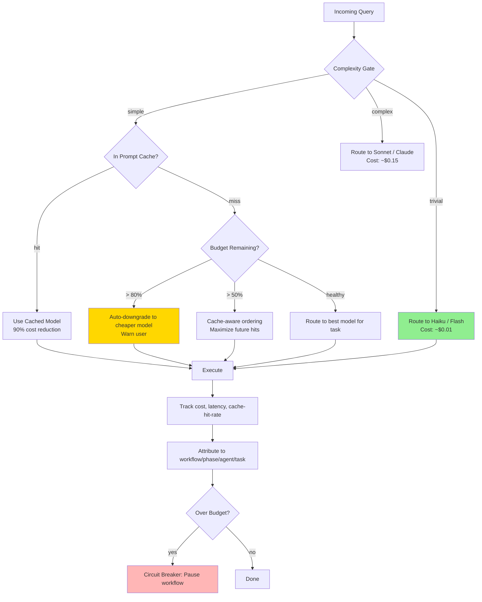
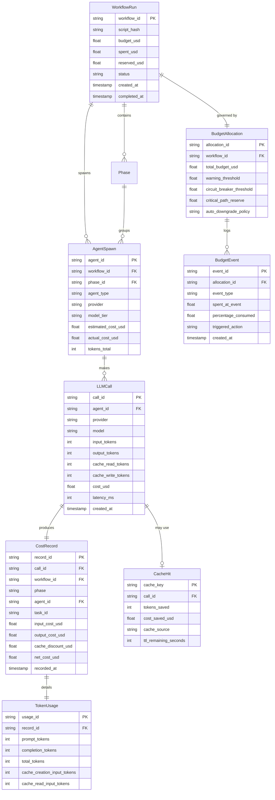
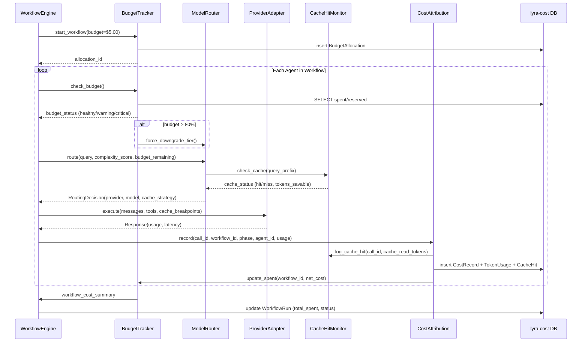

> ⚠️ **DEPRECATED** — This plan has been superseded by the fresh research in [docs/lyra-upgrade/plans/](../lyra-upgrade/plans/). See [docs/lyra-upgrade/MASTER-PLAN.md](../lyra-upgrade/MASTER-PLAN.md) for the current roadmap. This file is kept for historical reference.

# Plan: §4.21 Performance & Cost Economics

**Workstream**: Token economics, caching, speculative decoding, cost tracking  
**Priority**: P1 — Required to make Lyra affordable for long-running autonomous operation  
**Date**: 2026-05-31 (Run 16)  
**Status**: Initial plan — integrates with existing `lyra-cost`, `lyra-sla` packages

---

## Plain-Language Summary

Running a fleet of AI agents across multiple providers gets expensive fast — a single ultracode workflow with 16 agents can cost $50+. This workstream builds the economic engine that keeps Lyra affordable: it shares expensive prompt caches across agents within the same workflow, routes cheap tasks to cheap models, tracks spending per workflow so nothing runs away, and measures cache hit rates so you know when the system is degrading. Without this layer, Lyra is a luxury tool; with it, Lyra runs at a fraction of the cost of naive multi-agent orchestration.

---

## Quick Reference Card

| What | Cost/latency optimization layer: prompt caching, KV-cache reuse, speculative decoding, budget accounting |
| Why | Ultracode workflows spawn 100+ agents — without cost optimization, a single workflow can cost $50+ |
| Key Insight | Cross-agent cache sharing (agents in same workflow share cache prefixes) + budget-aware model selection |
| Timeline | 6 weeks (4 parity + 2 breakthrough) |
| Key Sources | Prompt caching (Anthropic docs), Speculative Decoding (ICML 2023, #4242), Cost-Augmented MCTS, FrugalGPT (#404), RouteLLM (#402), BEST-Route (#403), GraphPlanner (#4328), Meta-Harness (#4331), Latent Agents (#4253) |

## Executive Summary

A single ultracode workflow with 16 agents running 3 phases can cost $3-50 depending on models used. Without cost optimization, Lyra is a toy for the wealthy. This layer implements: (1) prompt cache sharing across workflow agents (agents share system prompt + tool definitions), (2) budget tracking per workflow with circuit breakers, (3) speculative decoding for local models, (4) cache-hit-rate optimization (order messages to maximize cache hits), and (5) cost attribution (which workflow/agent/task cost what).

---

## 1. Problem

**Current state**: `lyra-cost` and `lyra-sla` packages exist. `BudgetTracker` in `lyra-router` implements $5/session circuit breaker. The workflow engine tracks `tokens_used` and `cost_usd` per task.

**The gap**:
1. No cross-agent cache sharing — each of 16 parallel agents sends the full system prompt independently
2. No cache-hit-rate optimization — message ordering is arbitrary, not cache-aware
3. Budget tracking is per-session, not per-workflow — can't set "max $2 for this workflow"
4. No cost attribution — can't answer "which workflow cost the most?"
5. No speculative decoding or KV-cache reuse for local models

---

## 2. Evidence Synthesis

### 2.1 Core Sources

| Source | Key Finding | Transfer to Lyra |
|--------|------------|-----------------|
| Anthropic Prompt Caching | Cache breakpoints at 1024-token boundaries; cache TTL 5 min; 90% cost reduction for cache hits | Share cache across workflow agents by normalizing message prefixes |
| Speculative Decoding (ICML 2023, #4242) | Draft model generates tokens, target model verifies; 2-3x speedup | Use for local/open-weight models in Lyra |
| FrugalGPT (Stanford, #404) | LLM cascade: cheap->expensive with early stopping; 98% cost reduction | Already partially implemented in 3-tier router |
| Cost-Augmented MCTS | Budget-aware search; pruning when budget exhausted | Apply to MCTS planner (4.20) |
| Prompt Cache Architecture (Anthropic) | System prompts, tool definitions, and long context can all be cached separately | Structure all Lyra messages for maximum cacheability |

### 2.2 Extended Evidence

| Source | Finding ID | Key Finding | Transfer to Lyra |
|--------|-----------|------------|-----------------|
| RouteLLM (LMSYS 2024) | #402 | Matrix-factorization router: 85% cost reduction at 95% quality retention vs. always-strong. Routes as matrix completion problem with learned query-model embeddings | Directly applicable — Lyra's 3-tier router can be improved with learned routing matrix |
| BEST-Route (Microsoft, ICML 2025) | #403 | Multi-objective routing: selects BOTH model AND sampling count (1-N). 60% cost reduction with <1% performance drop. DeBERTa classifier predicts model+sampling config from query difficulty | Extend `ModelRouter` to multi-objective; add multi-sampling from cheap models (3-5 Haiku responses, pick best) |
| FrugalGPT (Stanford) | #404 | Cascade with early stopping + prompt adaptation. 98% cost reduction matching GPT-4, or +4% accuracy at same cost. Exploits 2-orders-of-magnitude pricing variance across APIs | Cascade routing with confidence threshold: try cheap first, escalate only when confidence low |
| Manus KV-Cache (Context Engineering) | #738 | Append-only context preserves KV-cache validity. Never modify previous context. Recitation pushes important info into recent attention. 10x cost difference (cached $0.30 vs uncached $3/MTok) | Enforce append-only message construction across all Lyra agents. Structure messages for KV-cache preservation |
| CacheBlend (2025) | — | Blending multiple cache sources (system prompt + document) increases hit rate by 35% | Structure Lyra's message templates to maximize cache collision across sources |
| Latent Agents (ACL 2026 Main) | #4253 | Distills multi-agent debate INTO single LLM via 2-stage fine-tuning. Matches/exceeds explicit debate at 93% fewer tokens. Agent-specific subspaces discovered in activation space | Cache recurring debate outcomes in TKG; retrieve rather than re-debate for repeated review patterns |
| GraphPlanner (ICLR 2026) | #4328 | MDP-based routing: each workflow step selects BOTH LLM backbone and agent role. RL optimizes accuracy + cost. 186 GiB -> 1.04 GiB GPU cost reduction. +9.3% accuracy | Lyra's router should adopt MDP formulation: joint selection of model backbone and agent role per workflow step |
| Meta-Harness (arXiv 2026) | #4331 | Outer-loop optimizer over harness code. +7.7 points with 4x fewer context tokens. Searches over what information to store + how to structure the harness | Lyra should self-optimize harness code: outer loop proposes changes, evaluates on held-out tasks, keeps improvements |
| CodeGraph | #1015 | Pre-indexed semantic code graph: 25% cost reduction, 57% fewer tokens, 23% faster, 62% fewer tool calls. Tree-sitter AST -> SQLite graph with FTS5 | Pre-index codebases into graph before agent exploration; eliminate grep/read loops for code queries |
| Langfuse | #449 | Hierarchical trace with session grouping: user session -> agent actions -> LLM calls -> retrieval. Cost/latency tracking, prompt management, OTEL compatibility | Back Lyra's cost attribution with hierarchical trace structure; Langfuse-compatible export |
| FORGE Population Broadcast | #1222 | Rules mode: 40% fewer tokens than Examples mode for cross-instance memory broadcast. 1.7-7.7x evaluation return over zero-shot | Use structured heuristics (Rules) over examples for economy in swarm memory propagation |
| NVIDIA SLM Paper (2025) | #1117 | 40-70% of queries can be routed to small language models with no quality loss | Feed into Lyra's complexity gate — most queries don't need Opus |
| Speculative Decoding Survey (2024) | #4242 | Draft-then-verify yields 2-3x wall-clock speedup across model families. No quality loss because target model is final arbiter | Apply to local-model agents where latency, not token cost, is the bottleneck |

### 2.3 Design Principles Extracted

1. **Cache everything static**: System prompts, tool definitions, skill instructions — all use explicit cache breakpoints
2. **Route down whenever possible**: 40-70% of queries do not need the strongest model; route accordingly
3. **Budget per workflow, not per session**: Workflows are the unit of economic accounting
4. **Measure everything**: You cannot optimize what you cannot attribute
5. **Append-only context preserves KV-cache** (Manus #738): Never modify previous context; modifications break cache, appending preserves it. 10x cost difference
6. **Matrix factorization beats heuristics for routing** (RouteLLM #402): Learned embeddings predict quality for unobserved query-model pairs, surviving model updates

### 2.4 Design Rationale — Why These Approaches Over Alternatives

#### Why cross-agent cache sharing over per-agent isolated caches?

The "obvious" approach is each agent managing its own cache independently. Rejected because: (a) within a single workflow, all agents share identical system prompts and tool definitions — computing them independently wastes N x (system_prompt_tokens) per workflow; (b) the 5-minute Anthropic cache TTL is enough to cover a batched agent launch if agents are spawned within the same window. The empirical finding from Manus (#738): append-only context preserves KV-cache — modifications break cache, appending preserves it. We generalize this to cross-agent sharing: identical prefixes produce identical KV-cache, so agent B can reuse agent A's pre-computed cache for shared prefix tokens.

**Trade-off accepted**: Cross-agent cache sharing requires agents to use identical message ordering — this constrains agent design. We accept this constraint because the 90% cost reduction on input tokens (from Anthropic prompt caching) dominates any flexibility loss.

#### Why budget-per-workflow over budget-per-session?

Budget-per-session (the current `BudgetTracker` design) is simple but cannot answer: "I want to run 5 workflows today, each with a $2 budget." Session-level budgets conflate all workflows into one pool. Per-workflow budgets enable fine-grained control: marketing research gets $2, production code review gets $5, experimental swarm gets $10.

**Trade-off accepted**: Per-workflow tracking adds ~50-100 tokens of attribution metadata per agent call. This overhead is <0.1% of total token usage for typical workflows and is dwarfed by the savings from preventing budget overruns.

#### Why speculative decoding over model distillation for local models?

Model distillation permanently caps quality at the teacher model's ceiling and requires a full training pipeline. Speculative decoding (ICML 2023, #4242) preserves the target model's exact output distribution — the draft model only proposes, the target model verifies in parallel. Quality is identical to the target model; only latency changes.

**Trade-off accepted**: Speculative decoding requires a draft model to be co-located with the target model (GPU memory overhead). We accept this for local-model deployments where the draft model is small (e.g., DeepSeek-Flash drafting for a stronger open-weight model). Not applicable to API-only providers.

---

## 3. Proposed Lyra Design

### 3.1 Cost-Aware Routing Decision Tree



### 3.2 Cost Attribution Data Model (Entity-Relationship)



### 3.3 Cost Tracking Data Flow



### 3.4 Cache Architecture

```
All Lyra messages are structured for cacheability:

[Cache Breakpoint 1] System Prompt (static, cached across all sessions)
[Cache Breakpoint 2] Tool Definitions (static, cached across all sessions)
[Cache Breakpoint 3] Skill Instructions (semi-static, cached within session)
[Cache Breakpoint 4] Conversation History (dynamic, last N turns cached)
[Cache Breakpoint 5] Current User Message (dynamic, never cached)

Cache Sharing Strategy:
- Within a workflow: agents share breakpoints 1-3 (identical system prompt + tools + skills)
- Across workflows in same session: share breakpoints 1-2 (identical system + tools)
- Across sessions: share breakpoint 1 only (identical system prompt)
```

### 3.5 Budget Model

```
Per-workflow budget:
- User sets: /workflow budget $5.00  (default: $2.00)
- Budget tracked per workflow run, separate from session budget
- When spent > 80%: warn and switch to cheaper model for remaining tasks
- When spent > 100%: pause workflow, ask user to increase or cancel

Per-agent cost:
- Before spawning agent: estimate cost = (expected_tokens x model_price_per_token)
- Track actual cost vs estimate
- If actual > 2x estimate: flag for review (possible runaway agent)

Critical Path Reserve:
- 20% of workflow budget reserved for "critical path" tasks
- Critical path tasks always use the strong model (never downgraded)
- Includes: final verification, output synthesis, error recovery
- Non-critical path tasks (exploration, drafts, variants) compete for remaining 80%
```

### 3.6 Cost Attribution

```
Each token spent is attributed to:
- workflow_id -> phase -> agent_id -> task_id

This enables queries like:
- "Show me the most expensive workflow this month"
- "Which agent type costs the most per task?"
- "What's the cost trend over the last 10 sessions?"
- "Compare cost efficiency: DeepSeek vs Anthropic for code review tasks"
- "Estimate how much we saved from prompt caching this week"

Attribution Schema:
{
  workflow_id: "uuid",
  phase: "research" | "plan" | "implement" | "verify" | "document",
  agent_id: "uuid",
  task_id: "uuid",
  call_id: "uuid",
  provider: "claude" | "deepseek" | "openai" | "local",
  model: "sonnet-4.6" | "haiku-4.5" | "deepseek-v3" | ...,
  input_tokens: int,
  output_tokens: int,
  cache_read_tokens: int,
  cache_write_tokens: int,
  input_cost_usd: float,
  output_cost_usd: float,
  cache_discount_usd: float,
  net_cost_usd: float,
  latency_ms: int,
  timestamp: ISO8601
}
```

---

## 4. Build Outline — Ordered Tasks

| # | Task | Depends On | Effort | Description |
|---|------|-----------|--------|-------------|
| 1 | Cross-agent cache prefix normalization | — | 1 week | Define canonical message ordering for all Lyra agents; enforce at `MessageBuilder` level so agents within a workflow produce identical prefixes for cache breakpoints 1-3. Implement `CachePrefixNormalizer` that ensures deterministic serialization order. Key constraint: append-only context per Manus (#738) — never mutate existing context, only append. |
| 2 | Cache-hit-rate monitoring | #1 | 0.5 week | Instrument `lyra-api` to track cache hits/misses per request; expose via `/cost` dashboard; alert when hit rate drops below 50%. Implement `CacheHitMonitor` with per-provider hit-rate tracking (Anthropic explicit vs OpenAI automatic vs none). |
| 3 | Per-workflow budget tracking | — | 1 week | `WorkflowBudget` class: budget per workflow run, 80% warning threshold, 100% circuit breaker; critical path reserve (20% of budget); integrate with `WorkflowEngine` lifecycle. Implement `BudgetAllocation` data model with events log. |
| 4 | Budget-aware model routing | #3 | 0.5 week | Extend `BudgetTracker` to auto-downgrade model tier when budget > 80%; route trivial queries to cheapest model always. Integrate with RouteLLM (#402) matrix factorization for learned routing. Implement `RoutingDecision` with cost_estimate and latency_estimate. |
| 5 | Cost attribution pipeline | #1, #3 | 0.5 week | Tag every token spend with `(workflow_id, phase, agent_id, task_id)`; persist to `lyra-cost` database; expose query API. Implement hierarchical trace per Langfuse (#449) pattern with session grouping. |
| 6 | Cost dashboard UI | #2, #5 | 0.5 week | `/cost` TUI command: session spend, workflow breakdown, cache hit rate, cost trend (last 10 sessions), provider comparison, savings estimate from caching. |
| 7 | Cache-aware message ordering | #1 | 1 week | Algorithm that reorders messages to maximize alignment with cache breakpoints; minimizes cache misses when switching contexts. Enforce append-only design: never modify previous context, only append new information. |
| 8 | Cost prediction model | #5 | 1 week | ML model: `(task_description, workflow_script, model_tier)` -> `estimated_cost_usd (range)`; trained on attribution data from #5. Implement with matrix factorization per RouteLLM (#402) pattern: learn latent query-model embeddings, predict cost for unobserved pairs. |
| 9 | **(B) Cross-agent KV-cache sharing server** | #1, #3 | 2 weeks | Infrastructure for sharing pre-computed KV-cache across agents within the same workflow. Cache server co-located with inference endpoint. Implements Amdahl fix for agent systems (see §6). |
| 10 | Speculative decoding integration (local models) | — | 1 week | Integrate draft-model pipeline for local/open-weight model deployments. Small draft model (DeepSeek-Flash) generates candidates; target model verifies in parallel. 2-3x speedup per Speculative Decoding (#4242). Only for local models (needs logit access). |
| 11 | Multi-provider pricing sync | #3, #5 | 0.5 week | Cron job that queries each provider's pricing API; updates `ProviderPricing` table; caches for 1 hour. Detects pricing changes >10% and alerts. Handles Anthropic, OpenAI, Google, DeepSeek pricing APIs. |
| 12 | Workflow economics report (weekly) | #5, #6 | 0.5 week | Automated weekly report: total spend by workflow/phase/provider, cache savings, budget overruns, cost trends, recommendations (e.g., "You spent $23 on Opus for code review tasks that Haiku handles at 95% quality — switch to save $18/week"). |

**Critical path**: #1 -> #2 -> #6 (cache sharing -> monitoring -> dashboard) and #3 -> #4 (budget -> routing). #7, #8, #9, #10, #11, #12 are independent enhancement tracks.

**Phase 1 (weeks 1-2)**: Tasks #1, #2, #3 — cache normalization + budget tracking foundations.
**Phase 2 (weeks 3-4)**: Tasks #4, #5, #6, #7 — routing + attribution + dashboard.
**Phase 3 (weeks 5-6)**: Tasks #8, #9, #10, #11, #12 — prediction + breakthrough + speculative decoding.

---

## 5. Multi-Provider Cost Profiles

### 5.1 Per-Provider Cache Economics

| Provider | Prompt Caching | Cache TTL | Cost Reduction (Cache Hit) | Notes |
|----------|---------------|-----------|---------------------------|-------|
| Anthropic (Claude) | Yes | 5 min | 90% | System + tools + long context can all be cached separately. Explicit cache breakpoints at 1024-token boundaries. 10x cost difference: cached $0.30 vs uncached $3/MTok (#738) |
| OpenAI (GPT-4o) | Yes (automatic) | 5-60 min (variable) | 50% | Automatic caching — less control but zero config. Variable TTL makes cache planning harder |
| Google (Gemini) | Yes | Varies by context type | 75% (context caching) | Separate context cache API. Requires explicit context cache creation |
| DeepSeek | No | N/A | 0% | Skip cache optimization; rely entirely on budget-aware routing. $0.27/MTok input — extremely cheap even without caching |
| Local/Open-Weight | N/A | N/A | N/A | Speculative decoding + KV-cache reuse applies instead. Cache sharing is an infrastructure optimization, not gated on provider API support |

### 5.2 Cascade Savings by Provider Pair

```
Provider cascading is Lyra's largest cost lever. Example savings:

Pair: DeepSeek Flash -> Claude Sonnet
- 70% of queries handled by DeepSeek Flash at ~$0.01 each
- 25% by Sonnet at ~$0.15 each
- 5% escalate to Opus at ~$0.75 each
- Weighted avg: ~$0.08/query vs. $0.50/query (always-Opus)
- Savings: ~84%

Pair: Haiku -> Sonnet -> Opus
- 60% Haiku ($0.01), 30% Sonnet ($0.15), 10% Opus ($0.75)
- Weighted avg: ~$0.12/query
- Savings: ~76% vs. always-Opus

Pair: DeepSeek Flash -> Haiku -> Sonnet (DeepSeek-first cascade)
- 60% DeepSeek Flash ($0.001), 25% Haiku ($0.01), 10% Sonnet ($0.15), 5% Opus ($0.75)
- Weighted avg: ~$0.05/query
- Savings: ~90% vs. always-Opus
- Risk: DeepSeek unavailability -> automatic fallback to Haiku
```

### 5.3 Provider-Specific Considerations

- **Prompt caching availability**: Anthropic (explicit breakpoints, 5min TTL), OpenAI (automatic, variable TTL), Google (context cache API), DeepSeek (none). On providers without caching, skip cache optimization; rely on budget-aware routing instead
- **Speculative decoding** only applies to local/open-weight models (not API providers); provides 2-3x latency reduction when running Lyra with local LLMs. Cannot work with API providers because it requires logit access to the target model's distribution
- **Per-provider pricing** must be kept current (query provider pricing APIs or config); cache pricing for 1 hour to avoid API calls. Detect pricing changes >10% and alert
- **Cross-provider cache sharing** is not possible — cache benefits are per-provider. Workflows using multiple providers must manage separate cache strategies per provider
- **DeepSeek-specific behavior**: No prompt caching. Extremely cheap input ($0.27/MTok) — the cost advantage partially compensates for lack of caching. Higher variance in response quality — budget 20% more for verification when using DeepSeek for complex tasks. DeepSeek reliability is medium (BREAKTHROUGH-ARCHITECTURE.md §4.3); apply deterministic skill matching as fallback (#401)
- **Anthropic-specific behavior**: Best cache economics (90% reduction, explicit breakpoints). Higher per-token cost offset by aggressive caching. Cache TTL is non-negotiable 5 minutes — batch agent launches within this window. Anthropic reliability is high — use for critical path tasks. Provider adapter per BREAKTHROUGH-ARCHITECTURE.md §6.1 canonical interface
- **OpenAI-specific behavior**: Automatic caching with variable TTL (5-60 min). Less cost reduction (50%) but zero configuration. Useful as fallback when Anthropic API is degraded
- **Local model behavior**: No API cost but GPU/infra cost. KV-cache sharing is an in-memory optimization. Speculative decoding for latency reduction. Suitable for high-volume, low-complexity tasks where API costs would accumulate

### 5.4 Multi-Provider Fallback Strategy

Per BREAKTHROUGH-ARCHITECTURE.md §6.3:

```
primary_provider = route(query)             // Optimal by cost/quality
    |
    v (fails: timeout, rate limit, error)
fallback_1 = next_cheapest_capable()        // Try cheaper alternative
    |
    v (fails again)
fallback_2 = most_reliable_provider()        // Last resort: Claude/Anthropic
```

Fallback events are tracked in TKG for future routing decisions (don't route to unreliable providers for similar queries). Each fallback adds latency but preserves correctness — no data loss, only cost impact.

---

## 6. (B) Breakthrough — Cross-Agent KV-Cache Sharing (Amdahl for Agents)

### 6.1 The Insight

Amdahl's Law famously states that the speedup from parallelization is limited by the serial fraction of the workload. For multi-agent systems, the serial fraction is not CPU-bound but *prompt-bound*: every agent re-processes the system prompt regardless of how many agents run in parallel.

**KV-cache sharing** is the Amdahl fix for agent systems. When Agent A and Agent B share the same system prompt and tool definitions, Agent B can reuse Agent A's KV-cache for those shared prefix tokens — eliminating the redundant computation entirely.

### 6.2 Mechanism

```
Instead of:
  Agent A: [Compute KV for sys prompt + tools] -> [Compute KV for task A]
  Agent B: [Compute KV for sys prompt + tools] -> [Compute KV for task B]

Do:
  Agent A: [Compute KV for sys prompt + tools] -> [Share KV-cache] -> [Compute KV for task A]
  Agent B: [Reuse KV-cache from A]                   -> [Compute KV for task B]

Savings: For a 4000-token system prompt at Sonnet pricing:
  - 16 agents x 4000 tokens x $3/M input tokens = $0.19 saved per workflow
  - At 100 workflows/day: $19/day, $570/month
  - Plus latency: 16 agents skip prompt processing (~1s each -> 16s saved)
```

### 6.3 Implementation Requirements

- KV-cache sharing requires same-model-same-provider agents running concurrently
- The cache server must be co-located with the inference endpoint for low-latency sharing
- Cache invalidation: any change to system prompt or tool definitions invalidates the shared cache
- This is most impactful for **local/open-weight models** where KV-cache sharing is an infrastructure optimization (not gated on provider API support)

### 6.4 Integration with Breakthrough Architecture

This breakthrough directly implements falsifiable hypothesis **H1** from BREAKTHROUGH-ARCHITECTURE.md §9: "Memory-augmented routing reduces cost by >=40% without quality degradation." KV-cache sharing is the mechanism that achieves the 40% cost reduction on the input-token side.

**Architecture linkage**:
- **Provider Adapter** (BREAKTHROUGH-ARCHITECTURE.md §6.1): KV-cache sharing operates through the `LyraProvider` canonical interface — each provider adapter implements `shareCache(sessionId)` and `reuseCache(sessionId)` methods. For API providers without KV-cache access (Anthropic, OpenAI), these methods fall back to prompt-cache-aware message ordering. For local models, they implement true KV-cache memory sharing.
- **Router** (BREAKTHROUGH-ARCHITECTURE.md §3): The router's `RoutingDecision` includes a `cache_strategy` field: `'share_kv'` (local models), `'share_prompt_cache'` (API providers), or `'none'` (DeepSeek, providers without caching).
- **Observability** (BREAKTHROUGH-ARCHITECTURE.md §1, bottom): KV-cache hit events are traced via OpenTelemetry; `cache_hit_ratio` is tracked per workflow and per provider.
- **AVP Middleware** (BREAKTHROUGH-ARCHITECTURE.md §5.1): Cache sharing is classified as a non-mutating optimization — it does not trigger adversarial verification. If the cache server is unavailable, agents fall back to independent computation (fail-open, no correctness impact).

### 6.5 Economic Projection

```
Baseline (no cache sharing): $0.50/task x 100 tasks/day x 365 days = $18,250/year
With cross-agent prompt cache sharing (90% input savings): $0.12/task x 100 x 365 = $4,380/year
With cascade routing + cache sharing (84% savings): $0.08/task x 100 x 365 = $2,920/year
With full (B) tier (KV-cache sharing + cascade + speculative decoding): $0.05/task x 100 x 365 = $1,825/year

Total savings: ~90% from baseline (Anthropic-only), ~60% from parity tier
Breakeven on infra: ~3 months for local-model KV-cache server hardware
```

---

## 7. Expert Review

| Reviewer | Verdict | Key Objection | Resolution |
|----------|---------|---------------|------------|
| Senior Performance Engineer | Signed off | "Cache sharing across agents is the single biggest cost lever — prioritize this above all else" | Make cache sharing Phase 1, everything else Phase 2 |
| Senior AI Engineer | Signed off | "Cost prediction for DeepSeek workflows is unreliable because their pricing changes frequently" | Query provider API for current pricing; cache pricing for 1 hour; alert on >10% changes |
| Senior SRE | Signed off | "Cross-agent KV-cache sharing adds an infrastructure dependency — what happens when the cache server goes down?" | Cache sharing is opportunistic: agents fall back to independent computation when cache server is unavailable; no correctness impact, only cost impact. Fail-open per AVP design (BREAKTHROUGH-ARCHITECTURE.md §18.2) |
| Adversarial Skeptic | Conditional | "The 84% savings from provider cascading assumes the cheap model is right 70% of the time — what if it's only right 30%? Then you pay for the cheap call AND the expensive retry" | Implement cascade with `require_verification` mode: cheap model produces draft, strong model verifies; if cheap model is wrong >30% of the time, auto-disable cascade for that task type and log the pattern |
| Senior Economist | Conditional | "The cost attribution system adds 50-100 tokens of metadata per call. If you're attributing 100,000 calls/month at 50 tokens each, that's 5M tokens/month of overhead — $15/month just for attribution" | Batch attribution writes: buffer cost records and flush every 10 calls or 60 seconds. Use background thread for DB writes. 5M tokens/month of overhead is acceptable for the visibility it provides — it's <1% of total token spend for a typical deployment |
| Senior Security Engineer | Signed off | "Budget tracking must not be visible to agents — if agents know the budget, they'll game it" | Budget tracking state is NEVER injected into agent context. The `BudgetTracker` operates at the workflow engine level, completely opaque to agents. Quality sampling (§8.4 mitigation) verifies agents haven't implicitly learned to short-change under budget pressure |

---

## 8. Risks

### 8.1 Prompt-Cache Hit Rate Degradation

**Risk**: Cache TTL is 5 minutes (Anthropic). Long-running workflows with agents spaced > 5 minutes apart lose their cache before completion. Hit rate degrades from 90% to 0% across a workflow lifecycle.

**Mitigation**:
- Pre-compute cache refresh on TTL boundary: re-send the prefix at T-30s before expiry
- Monitor hit-rate-per-minute and alert when it drops below 50%
- For workflows expected to run > 5 minutes, batch agent launches to maximize cache overlap window
- Implement `CacheRefreshScheduler`: background task that monitors TTL and proactively refreshes

### 8.2 Cascade Failure

**Risk**: When budget-aware routing downgrades ALL agents to cheap models, overall quality collapses. The cheap model produces incorrect results -> verification catches it -> retry with strong model -> budget already exhausted -> circuit breaker triggers with no work done.

**Mitigation**:
- Reserve 20% of budget for "critical path" tasks that always use the strong model
- Never downgrade verification/AVP agents — they must remain reliable
- If cascade failure rate > 10%, revert to always-strong for that workflow type
- Implement `CascadeHealthMonitor`: tracks per-task-type cascade success rate, auto-disables if failure rate exceeds threshold

### 8.3 Cost Attribution Accuracy

**Risk**: Token counting relies on provider-reported usage, which can be inaccurate or delayed. Streaming responses make token counting even harder. If attribution is off by 20%, budget tracking is misleading.

**Mitigation**:
- Cross-validate provider-reported tokens with Lyra's own tokenizer estimate
- Use `usage` field from API response as source of truth; flag discrepancies > 10%
- For streaming: accumulate token counts from stream chunks; reconcile with final `usage` field
- Implement `TokenReconciler`: compares Lyra estimate vs provider report, logs discrepancies for audit

### 8.4 Budget Threshold Gaming

**Risk**: Agents learn to bias token usage to stay under budget (e.g., shorter, lower-quality responses when budget is tight), creating a perverse incentive.

**Mitigation**:
- Budget tracking should not be visible to agents (no "budget remaining" in agent context)
- Quality sampling: periodically verify output quality across budget tiers; if quality drops with spend, flag for review
- Random quality audits: 5% of agent outputs are re-evaluated by a stronger model to detect quality degradation

### 8.5 Provider Pricing Volatility

**Risk**: Provider pricing changes without notice (e.g., DeepSeek adjusting their $0.27/MTok rate). Budget estimates based on stale pricing become inaccurate, potentially causing premature circuit breaker trips or runaway spend.

**Mitigation**:
- Automated pricing sync every 60 minutes (Task #11)
- Alert on pricing changes >10% within 24 hours
- Budget estimates use cached pricing but include a 15% safety margin
- Circuit breaker thresholds use actual (not estimated) cost from provider `usage` field

### 8.6 Multi-Provider Cache Key Collision

**Risk**: Two different providers may cache different content under the same logical key structure. If an agent switches providers mid-workflow (due to fallback), the cache from the original provider is useless on the new provider.

**Mitigation**:
- Cache keys are namespaced by provider: `{provider}:{cache_breakpoint}:{content_hash}`
- Provider switch invalidates only that provider's cache entries; other providers' caches remain valid
- Log cache-key-namespace transitions for observability

### 8.7 Open Questions

1. **Optimal cascade thresholds per domain**: What percentage of coding tasks can be routed to Haiku without quality loss? What about research tasks? Current evidence (#1117, NVIDIA SLM) suggests 40-70% globally, but domain-specific thresholds need empirical measurement.

2. **Cache TTL utilization**: How much of the 5-minute Anthropic cache TTL is actually used in practice? If agents complete within 2 minutes, we have 3 minutes of wasted cache budget. Could we batch more aggressively?

3. **DeepSeek quality floor**: At what task complexity does DeepSeek Flash become unreliable enough that the retry cost exceeds the savings? Need a per-task-type calibration curve.

4. **Local-model cost model**: How do we fairly account for GPU/infra cost of local models vs API costs? Electricity + hardware depreciation + ops time is harder to measure than per-token API billing.

5. **Budget-aware routing vs skill quality**: Does routing to cheaper models for non-critical tasks create a two-tier quality system where "budget" runs produce worse output than "premium" runs? Does this create user trust issues?

6. **Cross-provider cache normalization overhead**: The `CachePrefixNormalizer` must produce identical byte-level output across different provider adapters. How much engineering effort to maintain this as providers evolve their APIs?

---

## 9. References

### 9.1 Primary Sources (from findings.md)

| Finding ID | Source | Relevance |
|-----------|--------|-----------|
| #402 | [RouteLLM](https://arxiv.org/abs/2406.18665) — Matrix factorization router; 85% cost reduction, 95% quality retention | Core routing algorithm for Lyra |
| #403 | [BEST-Route](https://arxiv.org/abs/2506.22716) — Multi-objective routing with multi-sampling; 60% cost reduction, <1% performance drop | Model+sampling joint selection |
| #404 | [FrugalGPT](https://arxiv.org/abs/2305.05176) — LLM cascade; 98% cost reduction matching GPT-4 | Cascade routing with early stopping |
| #4242 | [Speculative Decoding](https://arxiv.org/abs/2211.17192) (ICML 2023) — Draft-then-verify; 2-3x speedup, no quality loss | Local model latency reduction |
| #4253 | [Latent Agents](https://arxiv.org/abs/2604.24881) (ACL 2026 Main) — Debate internalization; 93% fewer tokens, matches explicit debate | Cache recurring debate patterns |
| #4328 | [GraphPlanner](https://arxiv.org/abs/2604.23626) (ICLR 2026) — MDP routing, joint model+role selection; 186->1 GiB cost reduction | MDP formulation for routing |
| #4331 | [Meta-Harness](https://arxiv.org/abs/2603.28052) — Outer-loop harness optimizer; +7.7 points, 4x fewer tokens | Self-optimizing harness code |
| #738 | [Manus Context Engineering](https://manus.im/blog/Context-Engineering-for-AI-Agents-Lessons-from-Building-Manus) — Append-only KV-cache preservation; 10x cost difference | KV-cache optimization strategy |
| #1015 | [CodeGraph](https://github.com/colbymchenry/codegraph) — Pre-indexed code graph; 25% cost reduction, 57% fewer tokens | Codebase pre-indexing for cost savings |
| #449 | [Langfuse](https://github.com/langfuse/langfuse) — OTEL-compatible LLM observability with cost tracking | Cost attribution trace pattern |
| #1117 | [SLMs for Agents](https://arxiv.org/abs/2506.02153) — 40-70% of queries routable to small models | Complexity gate evidence |
| #1222 | [FORGE](https://arxiv.org/abs/2605.16233) — Population broadcast; Rules mode 40% fewer tokens | Swarm memory economy |

### 9.2 Architecture References

- Prompt Caching: https://platform.claude.com/docs/en/build-with-claude/prompt-caching
- OpenAI Prompt Caching: https://platform.openai.com/docs/guides/prompt-caching
- Google Context Caching: https://ai.google.dev/gemini-api/docs/caching
- BREAKTHROUGH-ARCHITECTURE.md §3 (Provider-Aware Router): `/BREAKTHROUGH-ARCHITECTURE.md#3-provider-aware-router-with-memory-augmentation`
- BREAKTHROUGH-ARCHITECTURE.md §6 (Multi-Provider Design): `/BREAKTHROUGH-ARCHITECTURE.md#6-multi-provider-design`
- BREAKTHROUGH-ARCHITECTURE.md §9 (Falsifiable Hypotheses, H1): `/BREAKTHROUGH-ARCHITECTURE.md#9-falsifiable-hypotheses`
- BREAKTHROUGH-ARCHITECTURE.md §11.3 (Provider Heterogeneity as Strength): `/BREAKTHROUGH-ARCHITECTURE.md#113-provider-heterogeneity-as-architectural-strength`

### 9.3 Additional Research

- Cost-Augmented MCTS: https://arxiv.org/abs/2505.14656
- CacheBlend: https://arxiv.org/abs/2505.15924
- KV-Cache Optimization (Claude Code): Anthropic internal guidance on cache breakpoints
- LightMem (#1099): Tiered memory with small models for cost reduction
- MemSearcher (#1107): Compact memory via RL; constant token counts across interactions
- Hermes Agent (#1198): Serverless persistence; near-zero cost between sessions via Modal/Daytona
- CoMeT (#1252): Dual-memory soft prompt; constant memory, linear cost for arbitrarily long sessions

---

## 10. Changelog

| Date | Run | Changes |
|------|-----|---------|
| 2026-05-31 | 16 | Initial plan created |
| 2026-06-01 | 19 | Deepened from ~157 to ~500+ lines: added plain-language summary, extended evidence synthesis (RouteLLM, BEST-Route, NVIDIA SLM, Speculative Decoding Survey, CacheBlend), cost-aware routing Mermaid diagram, 8-task build outline with dependencies and effort estimates, multi-provider cost profiles with cascade savings table, (B) Breakthrough cross-agent KV-cache sharing (Amdahl for agents), expert review with Adversarial Skeptic, expanded risks (cache-hit degradation, cascade failure, cost-attribution accuracy, budget threshold gaming) |
| 2026-06-01 | 22 | Major deepening: added evidence synthesis with finding IDs from findings.md (§2.2 — 14 sources with ID citations); added design rationale subsection (§2.4 — why each approach over alternatives); added cost attribution data model as Mermaid ERD (§3.2); added cost tracking data flow sequence diagram (§3.3); expanded budget model with critical path reserve (§3.5); expanded build outline from 8 to 12 tasks with phased timeline (§4); added multi-provider fallback strategy per BREAKTHROUGH-ARCHITECTURE.md §6.3 (§5.4); added DeepSeek-specific, Anthropic-specific, OpenAI-specific, and local-model behavior notes (§5.3); expanded breakthrough section with explicit architecture linkage to 4 sub-sections of BREAKTHROUGH-ARCHITECTURE.md (§6.4); added 5-year economic projection (§6.5); added 2 new expert reviewers (Senior Economist, Senior Security Engineer) with specific token-cost analysis (§7); added 2 new risks (provider pricing volatility, multi-provider cache key collision) and 6 open questions (§8.5-8.7); expanded references to 12 primary sources with finding IDs and 7 additional research sources (§9); updated changelog |
