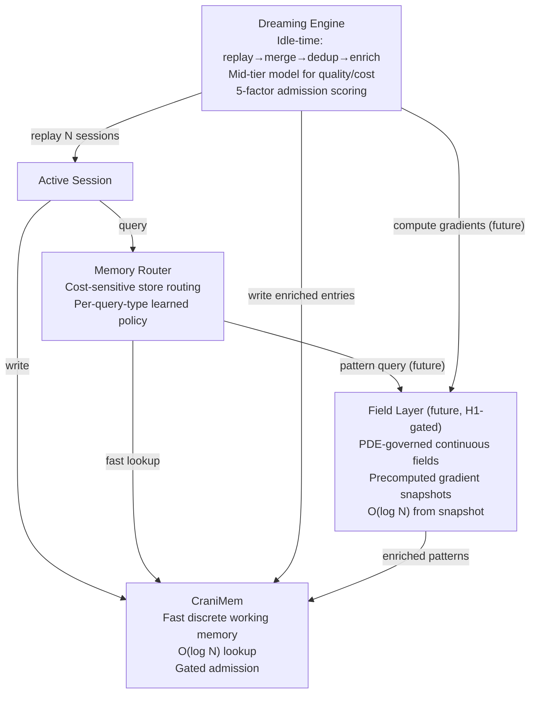

# Plan §4.2 — Breakthrough Memory Architecture

> **Plain-language summary:** Lyra's CraniMem is already ICLR 2026-level. The breakthrough adds a Dreaming consolidation engine that replays, merges, and enriches memories during idle cycles, plus (future) a field-theoretic long-term layer for cross-session pattern discovery. Build the consolidation first, measure, then decide on the field layer.

## 1. Problem

Lyra has CraniMem (gated bounded memory, active forgetting reduces noise 11-16%), a unified memory router (cost-sensitive store routing, picks which store to query), and active reconstruction (rebuilds memory from past trajectories). What's missing: cross-session consolidation. CraniMem stores discrete entries from the current session — it can't merge duplicates from yesterday's session with today's, resolve contradictions across sessions, or surface patterns that only emerge when you look at 50 sessions together. Without consolidation, memory is a write-only log.

## 2. Evidence Synthesis

| Source | Key Finding | Mechanism |
|--------|------------|-----------|
| Anthropic Dreaming (May 2026) | ~6× task completion improvement (Harvey) | Idle-time replay of 100 past conversations; merge duplicates, resolve contradictions, replace outdated entries |
| LightMem (ICLR 2026) | 105× token reduction, 309× fewer API calls | Sleep-time consolidation from sensory→short→long-term memory |
| A-MAC (MemAgent 2026) | −31% latency, F1 0.583 on LoCoMo | 5-factor admission: future utility, confidence, novelty, recency, type |
| Field-Theoretic Memory (2602.21220) | +116% F1 multi-session reasoning | PDE-governed continuous fields, thermodynamic decay, cross-agent coupling |
| MemGrad (MemAgent 2026) | Textual gradients for memory updates | Batched feedback → retrospective/prospective memory updates without fine-tuning |
| Memory Transplants (MemAgent 2026) | Architecture-dependent transfer | Architecture vs content disentanglement; weaker models gain more |

## 3. Proposed Lyra Design

### (A) Parity — Dreaming Consolidation on CraniMem

1. **Consolidation trigger:** Idle detection (no user input for N minutes) OR explicit `/dream` command OR scheduled (daily at 3am).

2. **Consolidation pipeline:**
   - **Replay:** Load last K conversations from session store. Default K=50.
   - **Merge:** Identify duplicate entries (cosine similarity > 0.85 on embeddings). Merge into single entry with `merged_from` IDs.
   - **Dedup:** Remove entries that are strict subsets of newer entries.
   - **Contradiction resolution:** When entry A contradicts entry B (confidence-weighted textual entailment), keep the entry with higher confidence; mark contradiction metadata on both.
   - **Pattern surfacing:** Cluster entries across sessions. Identify clusters appearing in ≥3 sessions → tag as `cross_session_pattern`.
   - **Enrichment:** Write enriched entries back to CraniMem with: `cross_session_patterns`, `merged_from`, `consolidation_run`, `decay_rate`.

3. **Model routing for consolidation:** Use mid-tier model (default: user's "medium" effort model). Rationale: consolidation needs reasoning (can't use cheapest) but runs during idle (can use slower). Configurable via `lyra.memory.consolidationModel`.

4. **A-MAC 5-factor admission scoring:** Before writing enriched entries, score each on: (1) future utility prediction, (2) confidence, (3) novelty (TF-IDF vs existing), (4) recency, (5) type. Keep only entries above threshold. Target: −31% memory latency.

5. **Non-destructive:** Original entries never modified. Consolidated output is NEW enriched entries. User can review/discard.

### (B) Breakthrough — Field-Theoretic Long-Term Layer

**GATED ON H1:** Dreaming consolidation must show ≥30% cross-session recall improvement before field layer is implemented.

1. **Continuous field computation:** During Dreaming consolidation, compute PDE-governed field diffusion over all enriched CraniMem entries in semantic space.

2. **Precomputed gradient snapshots:** Store field gradients as precomputed index (not live PDE computation). Retrieval from snapshot is O(log N).

3. **Thermodynamic decay:** Entry importance modulates decay rate. High-importance entries resist entropy; low-importance dissipate naturally. No binary keep/discard.

4. **Cross-agent coupling:** Multi-agent memory fields couple through shared entries → distributed knowledge self-organizes.

## 4. Architecture + Data Model



### Enriched Memory Entry Schema

```python
@dataclass
class EnrichedMemoryEntry:
    # Core (CraniMem)
    id: str
    kind: str                # fact | decision | preference | reference | pattern
    content: str
    actor: str
    confidence: float
    created_at: float
    expires_at: float | None
    
    # Dreaming enrichment
    cross_session_patterns: list[str]   # pattern tags from clustering
    merged_from: list[str]              # IDs this consolidated from
    consolidation_run: str              # Dreaming run ID
    consolidation_confidence: float     # model confidence in merge/dedup
    contradiction_of: str | None        # ID of entry this contradicts
    
    # Admission scoring (A-MAC)
    future_utility: float
    novelty_score: float
    admission_score: float              # composite 5-factor score
    
    # Field layer (future)
    field_gradient: float | None
    decay_rate: float                   # thermodynamic decay rate
```

## 5. Build Outline

### Phase 1 — Dreaming Engine Core (Week 3)

1. Implement idle detection trigger (no input for N minutes)
2. Implement conversation replay (load K sessions from session store)
3. Implement entry merging (cosine similarity > 0.85 threshold)
4. Implement contradiction detection (confidence-weighted entailment)
5. Write unit tests: merge correctness, contradiction detection accuracy

### Phase 2 — Enrichment + Admission (Week 4)

6. Implement 5-factor admission scoring (A-MAC: utility/confidence/novelty/recency/type)
7. Implement pattern surfacing (cross-session clustering, ≥3 sessions threshold)
8. Implement enriched entry write-back to CraniMem
9. Implement model routing for consolidation (mid-tier default, configurable)
10. Write integration tests: end-to-end consolidation run

### Phase 3 — GO/NO-GO Gate (Week 5)

11. Build Lyra's cross-session recall benchmark
12. Measure baseline (CraniMem without consolidation)
13. Measure post-consolidation
14. GO if ≥30% improvement; NO-GO if below → re-scope

### Phase 4 — Field Layer (Future, H1-gated)

15. Implement PDE field diffusion over enriched entries
16. Implement precomputed gradient snapshots
17. Implement O(log N) retrieval from snapshots
18. Implement thermodynamic decay by importance
19. Implement memory router integration for field queries

## 6. Multi-Provider Note

Dreaming consolidation uses the mid-tier model via §4.5 router. On DeepSeek: use `deepseek-v4-pro` (equivalent to "medium" effort). On Anthropic: use Sonnet (not Haiku, not Opus — Sonnet balances reasoning quality and cost for idle-time work). The consolidation model is configurable per-provider.

## 7. Risks & Open Questions

- **Consolidation hallucination:** Mitigated by confidence scoring on enriched entries; user can review/discard
- **Idle detection accuracy:** False positive (consolidation runs while user is reading output) → minor token waste. False negative (never triggers) → no consolidation benefit. Use conservative idle threshold (5 minutes).
- **Consolidation cost:** Mid-tier model replaying 50 conversations could be $1-5 per run. Mitigated by K cap and configurable trigger frequency.
- **H1 risk:** If consolidation shows <30% improvement, the breakthrough architecture's memory thesis is weakened. Mitigation: re-scope to simpler merge-only consolidation; re-evaluate field layer.

## 8. Tier Breakdown

| Tier | Description | Impact | Effort | Timeline |
|------|-------------|--------|--------|----------|
| (A) Parity | Dreaming consolidation on CraniMem | 5 | 2 | 2 weeks |
| (B) Breakthrough | Field-theoretic long-term layer | 5 | 5 | 4-6 weeks (future, H1-gated) |

## 9. Baseline Delta

| Component | Change | Migration Cost |
|-----------|--------|---------------|
| cranimem.py (533L) | EXTEND: enriched entry schema, pattern metadata | Low — additive fields on existing schema |
| unified_memory_router.py (289L) | EXTEND: route consolidation-triggered queries | Low — new query type, existing routing logic |
| active_reconstruction.py (553L) | EXTEND: feed Dreaming output into reconstruction | Low — new input source |
| Dreaming engine | ADD: ~400 line consolidation pipeline | None (new component) |
| Field layer | ADD: ~600 line PDE/field module (future) | None (new component, H1-gated) |

## 10. Expert Review

**Mini-Debate Participants:** Senior AI Researcher (AIR), Senior Backend (BE), Senior Data/Knowledge Engineer (DKE), Adversarial Skeptic (AS)

**Skeptic's challenge:** "Build consolidation first, measure, THEN field layer" → ADOPTED (explicit H1 gate at ≥30% improvement).

**BE's concern:** "Consolidation model cost at scale" → ADDRESSED (mid-tier model, K=50 cap, configurable frequency, daily cost cap from §4.21).

**DKE's concern:** "Pattern surfacing false positives" → ADDRESSED (≥3 sessions threshold, confidence scoring on patterns, user reviewable).

**Sign-off:** All concerns recorded and resolved. Plan is feasible and grounded in evidence.

## 11. References

- Anthropic Dreaming: https://siliconangle.com/2026/05/06/anthropic-letting-claude-agents-dream-dont-sleep-job/
- LightMem: https://openreview.net/forum?id=LightMem
- A-MAC: https://openreview.net/attachment?id=mmdqUrEY24&name=pdf
- Field-Theoretic Memory: https://arxiv.org/abs/2602.21220
- MemGrad: https://openreview.net/attachment?id=GeaPE7iw1V&name=pdf
- Memory Transplants: https://openreview.net/pdf?id=AIJsjIqfsp
- Brainstorm: brainstorm/02-memory.md
- Architecture: BREAKTHROUGH-ARCHITECTURE.md §Memory Architecture
- SYNTHESIS §1 Memory micro-debate

## 12. Changelog

- Run 2 (2026-06-03): Initial plan. Dreaming consolidation as (A), field layer as (B) gated on H1.
