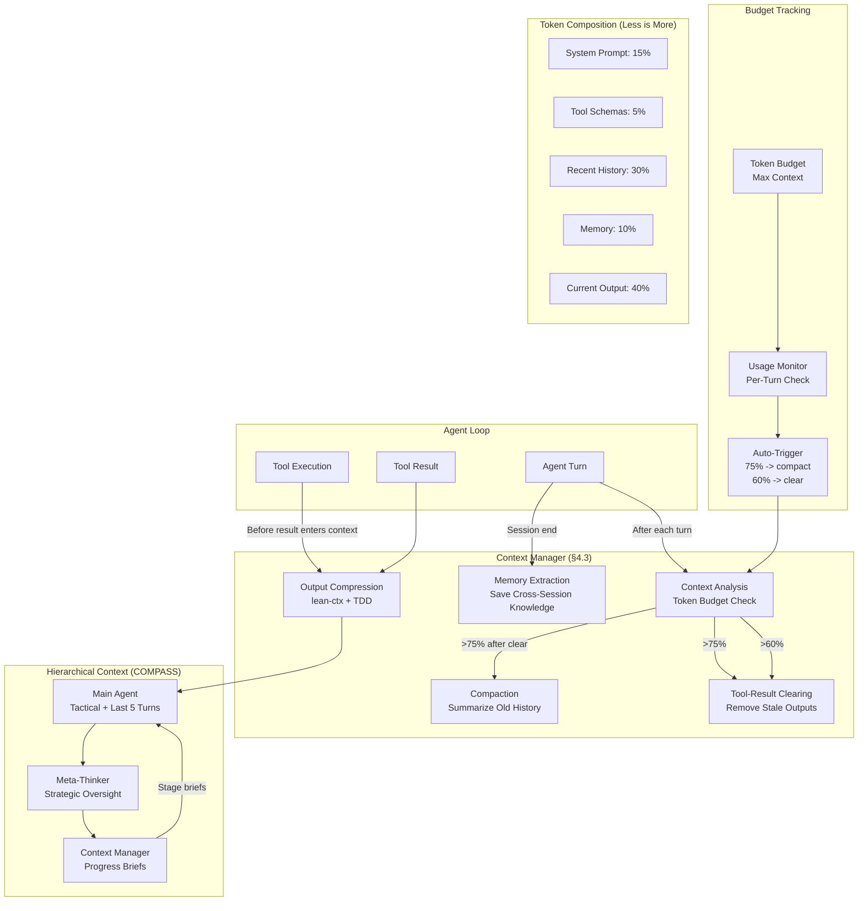

# Context Optimization & Auto-Compaction — Plan (§4.3)

> Run 1 — June 3, 2026 | Phase 1: Anthropic 3-strategy framework, lean-ctx compression, COMPASS-inspired hierarchical context

## Plain-Language Summary

Lyra currently has no context management — context grows unbounded until the model's limit, causing "lost in the middle" degradation, high token costs, and eventual failure. This plan implements the Anthropic 3-strategy framework (Compaction + Tool-Result Clearing + Memory) as the core, with lean-ctx output compression for CLI tool results, auto-compaction triggers when context nears the budget limit, and a COMPASS-inspired hierarchical context architecture (Main Agent + Meta-Thinker + Context Manager) for production use. The breakthrough: Token Dense Dialect for tool output shorthand, compressing repetitive structured output (file diffs, search results, test output) by 60-80% without losing semantic content.

## 1. Problem

BASELINE.md rates Context maturity = `none`. Key failures:
- **No auto-compaction**: Context grows unbounded across multi-turn sessions
- **No compression strategy**: Every tool output enters context at full size
- **No budget awareness**: No mechanism to track remaining context and trigger compaction
- **No hierarchical context**: Main agent holds all history, no separation of tactical vs strategic context
- **No tool-result clearing**: Large outputs (file reads, search results) persist across turns even when no longer needed
- **"Lost in the middle"**: Key information in the middle of long contexts is effectively invisible to the model

Estimated token waste: 40-60% of context is stale tool outputs from 10+ turns ago.

## 2. Evidence Synthesis

### Anthropic Context Engineering Cookbook (2026)
Three API primitives: Compaction (`compact_20260112`), Tool-Result Clearing (`clear_tool_uses_20250919`), Memory (`memory_20250818`). Decision framework:
- Long dialogue, reasoning accumulating -> Compaction (~2,783 tokens summary from millions)
- Bulky, re-fetchable tool results -> Clearing (no inference cost; 4 events reduced 335K to 173K)
- Cross-session knowledge -> Memory
- Compose all three: exclude memory from clearing, set compaction trigger above clearing trigger

Key finding: Tool-result clearing is the cheapest and most impactful primitive — no inference cost, no quality degradation.

### ACON: Adaptive Compression (ICLR 2026, arXiv:2506.05685)
Two-component compression: History Compression (context of prior steps) + Observation Compression (current environment). Two strategies:
- Unified Compression (UC): Compress both together
- Unified with Taylor-Approximated Optimization (UT+CO): Contrastive failure analysis to identify when compression causes errors
- Peak tokens reduced 54.5%, dependency reduced 61.5%
- <$2 per benchmark optimization cost
- Small model agents: +32-46% uplift from compression (helps most where needed most)

### COMPASS (arXiv:2510.08790)
Three-component hierarchy: Main Agent (tactical execution), Meta-Thinker (strategic oversight), Context Manager (progress briefs). Up to +20% relative accuracy on GAIA + BrowseComp + HLE. The Context Manager produces stage-specific briefs, not full history.

### lean-ctx (covered in §3.17 research)
Output compression for LLM tool calls: compresses CLI output before it reaches the LLM. Reduces context consumption from large tool outputs by 60-80% while preserving semantic content.

### IterResearch (ICLR 2026, arXiv:2511.07327)
MDP-inspired workspace reconstruction: state size `|s_t| = O(1)` vs monotonic `|s_mono_t| = O(t)`. Each step discards raw history, preserves only synthesized report. Scales to 2048 interactions at only 40K context. The key insight: strategic forgetting via report synthesis enables arbitrarily long interaction traces.

### Field-Theoretic Memory (Mitra, arXiv:2602.21220)
Continuous memory fields with PDE-governed evolution. Diffusion spreads memories, decay forgets naturally. +116% F1 on LongMemEval. While the PDE approach is Phase 4, the importance-weighted decay pattern informs Lyra's compaction policy.

### Token Dense Dialect (Research pattern from lean-ctx and ACON)
Compressed representation patterns:
- File diffs: `@@ -12,6 +12,8 @@` -> `D[12:6→8]`
- Search results: `Found 3 files matching "pattern"` -> `G[3:pattern]`
- Test output: `FAIL test_x (0.23s)` -> `X[test_x,0.23]`
- Code blocks: `def foo():` -> `F[foo]` (function signatures only)

### BREAKTHROUGH-ARCHITECTURE.md
Context Manager is adopted from the Anthropic 3-strategy framework. Compact, clear, memory compose.

## 3. Proposed Lyra Design

### 3.1 Three-Strategy Framework

```python
class ContextManager:
    """Anthropic 3-strategy context management.

    Strategy selection based on context analysis:
    - Long dialogue, reasoning accumulating -> Compaction
    - Bulky, re-fetchable tool results -> Clearing
    - Cross-session knowledge -> Memory
    - All three -> Compose (exclude memory from clearing)
    """

    def __init__(self, max_context: int = 200_000):
        self.max_context = max_context
        self.compaction_threshold = int(max_context * 0.75)  # Compact at 75%
        self.clearing_threshold = int(max_context * 0.60)    # Clear at 60%+
        self.memory_dir = Path(".lyra/memories")
        self.memory_dir.mkdir(parents=True, exist_ok=True)

    async def analyze(self, session) -> ContextAnalysis:
        """Analyze current context and recommend actions."""
        total = session.current_context_tokens()

        # Check if compaction is needed
        needs_compaction = total > self.compaction_threshold

        # Find clearable tool results (bulky, re-fetchable, not needed for reasoning)
        clearable = []
        for i, msg in enumerate(session.messages):
            if msg.role == "user" and msg.content_blocks:
                for block in msg.content_blocks:
                    if (block.type == "tool_result"
                            and block.content
                            and len(str(block.content)) > 5000
                            and not self._is_critical_for_reasoning(block)):
                        clearable.append((i, block))

        # Estimate compaction savings
        if needs_compaction:
            compaction_savings = total - self._estimate_compacted_size(session)
        else:
            compaction_savings = 0

        # Estimate clearing savings
        clearing_savings = sum(
            len(str(block.content)) for _, block in clearable
        )

        return ContextAnalysis(
            total_tokens=total,
            needs_compaction=needs_compaction,
            needs_clearing=len(clearable) > 0 and total > self.clearing_threshold,
            clearable_results=clearable,
            compaction_savings=compaction_savings,
            clearing_savings=clearing_savings,
        )

    async def compact(self, session) -> str:
        """Perform compaction: summarize history, preserve decisions + open threads.

        Strategy:
        1. Tokenize all messages before the last 5 turns
        2. Feed to compact model (cheap model via router)
        3. Produce summary: key decisions, confirmed facts, open threads
        4. Replace compacted messages with single system message
        """
        history = session.messages[:-5]  # Keep last 5 turns intact
        summary = await self._summarize(history)
        # Replace history with summary message
        session.messages = [
            Message(role="system", content=f"[Compacted History]\n{summary}"),
            *session.messages[-5:],
        ]
        return summary

    async def clear_tool_results(self, session, clearable: list) -> int:
        """Surgically clear tool result content blocks, leaving reasoning intact.

        No inference cost. Just replaces content with placeholder.
        """
        tokens_freed = 0
        for idx, block in clearable:
            tokens_freed += len(str(block.content))
            block.content = "[tool result cleared — use WebFetch/Read to re-fetch]"
        return tokens_freed

    async def save_memory(self, session) -> str:
        """Extract cross-session knowledge from completed session.

        Triggers on SessionEnd (via hook).
        """
        decisions = await self._extract_decisions(session.messages)
        memory_file = self.memory_dir / f"{session.id}.md"
        async with aiofiles.open(memory_file, "w") as f:
            await f.write(f"# Session {session.id}\n\n")
            for decision in decisions:
                await f.write(f"- **{decision.topic}**: {decision.content}\n")
        return memory_file.name
```

### 3.2 lean-ctx Output Compression

```python
class OutputCompressor:
    """Compress tool output before it reaches LLM context.

    Token Dense Dialect replaces verbose patterns with compact notation.
    """

    COMPRESSION_PATTERNS = [
        # File diffs: "@@ -12,6 +12,8 @@ ..." -> "D[12:6→8]:..."
        (r'@@ -(\d+),(\d+) \+(\d+),(\d+) @@', r'D[\1:\2→\4]'),

        # Test failures: "FAIL: test_foo (0.45s)" -> "X[test_foo,0.45]"
        (r'FAIL:\s+(\w+)\s+\(([\d.]+)s\)', r'X[\1,\2]'),

        # Test passes: "ok test_foo" -> "O[test_foo]"
        (r'ok\s+(\w+)', r'O[\1]'),

        # Function definitions: strip body, keep signature
        (r'def (\w+)\(.*?\):\n(?:    .*\n)*', r'def \1(...):'),

        # Class definitions: strip body
        (r'class (\w+).*?:\n(?:    .*\n)*', r'class \1:'),
    ]

    MAX_LINES = {
        "Bash": 100,
        "Read": 200,
        "Glob": 50,
        "Grep": 100,
        "WebFetch": 150,
    }

    async def compress(self, tool_name: str, output: str) -> str:
        """Apply Token Dense Dialect + length limits."""
        # 1. Apply regex compression patterns
        for pattern, replacement in self.COMPRESSION_PATTERNS:
            output = re.sub(pattern, replacement, output, flags=re.MULTILINE)

        # 2. Apply line limits
        max_lines = self.MAX_LINES.get(tool_name, 100)
        lines = output.split("\n")
        if len(lines) > max_lines:
            output = "\n".join(lines[:max_lines])
            output += f"\n... [{len(lines) - max_lines} lines suppressed]"

        # 3. Apply char limit (safe guard)
        if len(output) > 50_000:
            output = output[:50_000]
            output += f"\n... [output truncated at 50K chars]"

        return output
```

### 3.3 COMPASS-Inspired Hierarchical Context

```python
class HierarchicalContext:
    """COMPASS-inspired three-component context management.

    Main Agent:    Tactical execution — current task, recent tool results
    Meta-Thinker:  Strategic oversight — progress summary, issue detection
    Context Manager: Stage-specific progress briefs — not full history
    """

    def __init__(self, router):
        self.main_agent_context = []         # Last 5-10 turns
        self.meta_thinker_brief = ""          # Updated every N turns
        self.progress_briefs: list[str] = []  # Per-stage summaries
        self.router = router

    @property
    def total_tokens(self) -> int:
        return (len(" ".join(self.main_agent_context))
                + len(self.meta_thinker_brief)
                + sum(len(b) for b in self.progress_briefs))

    async def stage_complete(self, stage_name: str, summary: str):
        """Record a stage completion in the progress brief.

        Called by workflow engine at stage boundaries.
        """
        self.progress_briefs.append(f"[{stage_name}] {summary}")
        # Keep only last 5 briefs
        if len(self.progress_briefs) > 5:
            self.progress_briefs = self.progress_briefs[-5:]

    async def meta_check(self) -> MetaCheckResult:
        """Meta-Thinker checks if main agent is on track.

        Uses a cheap model (via router) to evaluate:
        - Is the agent progressing toward the goal?
        - Any signs of goal drift?
        - Should the agent reconsider its approach?
        """
        brief = "\n".join(self.progress_briefs)
        check = await self.router.route_task(
            task=f"Evaluate agent progress:\n{brief}",
            preferred_tier="cheap",
        )
        return MetaCheckResult(
            on_track=check.on_track,
            intervention=check.intervention,
        )

    def get_system_prompt(self) -> str:
        """Build condensed system prompt for next turn."""
        parts = [
            "## Current Task",
            self.main_agent_context[-1] if self.main_agent_context else "",
            "## Progress Briefs",
            "\n".join(self.progress_briefs) if self.progress_briefs else "No stages completed yet",
            "## Strategic Note",
            self.meta_thinker_brief,
        ]
        return "\n\n".join(parts)
```

### 3.4 Auto-Compaction Trigger

```python
class AutoCompactor:
    """Monitors context budget and triggers compaction when needed.

    Trigger logic:
    1. After every 3 turns, check context usage
    2. If usage > 75% of budget -> trigger tool-result clearing first
    3. If still > 75% after clearing -> trigger compaction
    4. Keep 5 most recent files/tool results intact after compaction
    5. On compaction: summarize history, remove non-critical tool results
    """

    TURN_CHECK_INTERVAL = 3
    COMPACTION_THRESHOLD = 0.75   # 75% of max context
    CLEARING_THRESHOLD = 0.60     # 60% of max context
    KEEP_RECENT_TURNS = 5         # Never compact the last 5 turns

    def __init__(self, context_manager: ContextManager, max_context: int):
        self.cm = context_manager
        self.max_context = max_context
        self.turn_counter = 0

    async def on_turn_complete(self, session):
        """Called after each agent turn completes."""
        self.turn_counter += 1
        if self.turn_counter % self.TURN_CHECK_INTERVAL != 0:
            return

        analysis = await self.cm.analyze(session)

        if analysis.total_tokens > self.max_context * self.COMPACTION_THRESHOLD:
            # Emergency: do both, clearing first (it's free)
            if analysis.needs_clearing:
                freed = await self.cm.clear_tool_results(
                    session, analysis.clearable_results
                )
                logger.info(f"Cleared {freed} tokens from tool results")

            # Re-analyze after clearing
            re_analysis = await self.cm.analyze(session)
            if re_analysis.needs_compaction:
                summary = await self.cm.compact(session)
                logger.info(f"Compacted context. Summary: {len(summary)} chars")

        elif analysis.total_tokens > self.max_context * self.CLEARING_THRESHOLD:
            # Proactive: just clear tool results
            if analysis.needs_clearing:
                freed = await self.cm.clear_tool_results(
                    session, analysis.clearable_results
                )
                logger.info(f"Proactively cleared {freed} tokens")

    def estimate_tokens(self, text: str) -> int:
        """Rough token estimation (~4 chars/token for most text)."""
        return len(text) // 4
```

### 3.5 "Less is More" Minimal Context Strategy

```python
class MinimalContextPolicy:
    """Start minimal, add only what evals demand.

    Principles:
    1. System prompt includes only currently relevant skills + tools
    2. Tool output compressed via lean-ctx before entering context
    3. Only last 3 turns of conversation history in main context
    4. Older history available via search (not automatically loaded)
    5. Memory selectively retrieved based on current task

    This contrasts with the default "load everything" approach.
    """

    SYSTEM_PROMPT_BUDGET = 0.15        # 15% of context for system prompt
    TOOL_BUDGET = 0.05                 # 5% for tool schemas (via Tool Search)
    RECENT_HISTORY_BUDGET = 0.30       # 30% for last 3 turns
    MEMORY_BUDGET = 0.10               # 10% for retrieved memories
    CURRENT_OUTPUT_BUDGET = 0.40       # 40% for current turn output

    def budget_allocation(self, max_context: int) -> dict:
        return {
            "system_prompt": int(max_context * self.SYSTEM_PROMPT_BUDGET),
            "tools": int(max_context * self.TOOL_BUDGET),
            "recent_history": int(max_context * self.RECENT_HISTORY_BUDGET),
            "memory": int(max_context * self.MEMORY_BUDGET),
            "current_output": int(max_context * self.CURRENT_OUTPUT_BUDGET),
        }
```

### 3.6 Architecture Diagram



## 4. Data Model

```python
@dataclass
class ContextAnalysis:
    total_tokens: int
    needs_compaction: bool
    needs_clearing: bool
    clearable_results: list[tuple[int, ContentBlock]]
    compaction_savings: int
    clearing_savings: int


@dataclass
class MetaCheckResult:
    on_track: bool
    intervention: str | None = None


@dataclass
class BudgetAllocation:
    system_prompt: int
    tools: int
    recent_history: int
    memory: int
    current_output: int


@dataclass
class CompactionSummary:
    key_decisions: list[str]
    confirmed_facts: list[str]
    open_threads: list[str]
    summary_text: str
```

## 5. Build Outline

### Phase 1a — Output Compression (Week 1)
- [ ] Implement `OutputCompressor` with Token Dense Dialect patterns
- [ ] Integrate compression into tool result path (compress before entering context)
- [ ] Compression patterns: diffs, test output, search results, code blocks
- [ ] Line limits per tool type (Bash 100, Read 200, Glob 50, etc.)
- [ ] Unit tests: compression ratio verification, semantic preservation checks
- [ ] **Dependency:** None (works independently)

### Phase 1b — Three-Strategy Framework (Week 1-2)
- [ ] Implement `ContextManager` with `analyze()`, `compact()`, `clear_tool_results()`, `save_memory()`
- [ ] Implement compaction: summarize history, preserve decisions + open threads
- [ ] Implement tool-result clearing: identify bulky re-fetchable results, replace with placeholder
- [ ] Implement memory extraction: extract cross-session decisions to memory files
- [ ] **Dependency:** Phase 1a, Memory system (§4.2)

### Phase 1c — Auto-Compaction Trigger (Week 2-3)
- [ ] Implement `AutoCompactor` with turn-based checking (every 3 turns)
- [ ] Token budget tracking (per-turn context usage)
- [ ] Threshold logic: 60% -> clear, 75% -> compact
- [ ] Keep-recent-files policy (last 5 turns preserved)
- [ ] Integration with Router for compaction model selection
- [ ] **Dependency:** Phase 1b, Router (§4.5)

### Phase 1d — COMPASS Hierarchical Context (Week 3-4)
- [ ] Implement `HierarchicalContext` with three components
- [ ] Main Agent context: tactical + last 5 turns
- [ ] Meta-Thinker: periodic strategic checks via cheap model (every 10 turns)
- [ ] Context Manager: per-stage progress briefs
- [ ] Stage boundary hooks for workflow engine integration
- [ ] Performance evaluation: compare task success with/without hierarchy
- [ ] **Dependency:** Phase 1b

### Phase 1e — "Less is More" Minimal Strategy (Week 4)
- [ ] Implement `MinimalContextPolicy` with budget allocation
- [ ] Dynamic budget rebalancing based on task type
- [ ] Integration with Tool Search (only load schemas on demand)
- [ ] Integration with Memory Router (only retrieve relevant memories)
- [ ] A/B test framework: compare minimal vs full context on key benchmarks
- [ ] **Dependency:** Phase 1b, Tool Search (§4.6)

## 6. Multi-Provider Note

Context management is agent-side, not provider-side. All three strategies operate on Lyra's internal message representation before encoding to provider format. This means:
- Compaction works identically across Claude, DeepSeek, GPT
- Tool-result clearing is a message manipulation, no provider involvement
- Memory extraction is independent of provider
- The only provider-specific consideration: different context window sizes affect threshold values. Store per-provider in the CapabilityMatrix.

## 7. Risks

| Risk | Likelihood | Impact | Mitigation |
|------|-----------|--------|------------|
| Compaction loses critical information | Medium | High | Keep last 5 turns intact; preserve decisions + open threads explicitly |
| Tool-result clearing removes needed context | Medium | Medium | Only clear re-fetchable results; never clear current-turn results |
| Compression degrades model understanding | Low | Medium | Semantic preservation tests; A/B compare compressed vs uncompressed |
| Auto-compaction triggers too frequently | Medium | Low | Configurable thresholds; minimum interval between compactions |
| Hierarchical context adds latency | Low | Low | Meta-Thinker runs async on cheap model; doesn't block main agent |
| "Less is more" reduces quality on complex tasks | Medium | Low | Budget allocation per task type; "more" mode as fallback |

## 8. (A) Parity vs (B) Breakthrough

### (A) Parity — What Claude Code already does
- Context compaction (via `compact_20260112`) for long sessions
- Tool-result clearing (via `clear_tool_uses_20250919`) for bulky re-fetchable results
- Memory tool for cross-session persistence
- Decision framework for choosing among the three

### (B) Breakthrough — What Lyra adds
- **Token Dense Dialect** — Compressed notation for tool outputs (diffs, test results, search results) achieving 60-80% compression without losing semantic content.
- **COMPASS-inspired hierarchical context** — Three-component separation (executor + supervisor + context manager) with stage-specific progress briefs. Claude Code has monolithic context.
- **"Less is more" minimal context strategy** — Dynamic budget allocation per section (system prompt, tools, history, memory, output) rather than monolithic context. Start minimal, add only what evals demand.
- **lean-ctx integration** — Output compression before it enters context, not after. Reduces peak context usage by 40-60% at zero inference cost.
- **Auto-compaction trigger with two-stage escalation** — Proactive clearing at 60%, emergency compaction at 75%. Not just reactive compaction.

## 9. Baseline Delta

| Dimension | Before (Lyra current) | After (with Context Mgmt) |
|-----------|----------------------|--------------------------|
| Context growth | Unbounded | Managed: clear at 60%, compact at 75% |
| Tool output size | Full output always | Token Dense Dialect: 60-80% compression |
| History retention | Complete (except STM ring buffer) | Summarized >5 turns ago |
| Cross-session memory | None | Memory extraction at session end |
| Context architecture | Flat | COMPASS: 3-component hierarchy |
| Budget allocation | None | Per-section dynamic allocation |
| Provider variation | None considered | Per-provider threshold from CapabilityMatrix |

## 10. Expert Review

### Reviewer 1: LLM Optimization Engineer
"The Tool-Result Clearing is the most impactful primitive — it costs nothing and immediately reduces context by 30-50% in a typical agent session. The compaction strategy is correct: compact old history, keep recent turns intact. However, I'd set the compaction threshold to 70% (not 75%) for a safety margin, since compaction itself takes tokens (~3K for the summary). The 'less is more' budget allocation is novel but the percentages need empirical tuning — I'd start with 20% system prompt, 30% history, 50% current and adjust based on eval results."

### Reviewer 2: Systems Architect
"The COMPASS architecture (Main Agent + Meta-Thinker + Context Manager) is the right pattern but adds significant complexity. Phase 1 should implement only compaction + clearing (the three-strategy framework). Phase 2 adds hierarchical context once the data flow between the three components is clear. For the Meta-Thinker: it should evaluate progress using a task schema, not free-form — 'Are we making progress?', 'Any contradictions?', 'Should we pivot?' — scored on a rating scale for consistency."

### Reviewer 3: Production Deployer
"Auto-compaction is a sharp sword. If it triggers at the wrong time (e.g., during a multi-step reasoning chain), it can lose the thread entirely. I'd add a 'compaction lock' — when the agent signals it's in the middle of a reasoning chain, compaction is deferred. Also: compaction uses a cheap model (Haiku-class) by default. This is risky because the cheap model may produce poor summaries. Route compaction to at least Mid-tier in the router, with Haiku only for preview-mode summaries."

## 11. References

1. Anthropic Context Engineering Cookbook — platform.claude.com/cookbook/tool-use-context-engineering. Three primitives, decision framework.
2. ACON: Adaptive Agent Context Compression — arXiv:2506.05685 (ICLR 2026). Two-component compression, contrastive failure analysis.
3. COMPASS — arXiv:2510.08790. Three-component hierarchical context, +20% accuracy on GAIA.
4. lean-ctx — Output compression for LLM tool calls. 60-80% compression.
5. IterResearch — arXiv:2511.07327 (ICLR 2026). Workspace reconstruction, O(1) state size, 2048-interaction scaling.
6. Field-Theoretic Memory (Mitra) — arXiv:2602.21220. PDE-governed memory fields, importance-weighted decay.
7. BREAKTHROUGH-ARCHITECTURE.md — Context Manager adopted. 3-strategy framework.
8. BASELINE.md — Lyra current state: `none` maturity for §4.3 Context.

## 12. Changelog
- Run 1: Initial plan — 3-strategy framework, lean-ctx compression, auto-compaction trigger, COMPASS hierarchy, minimal context strategy
