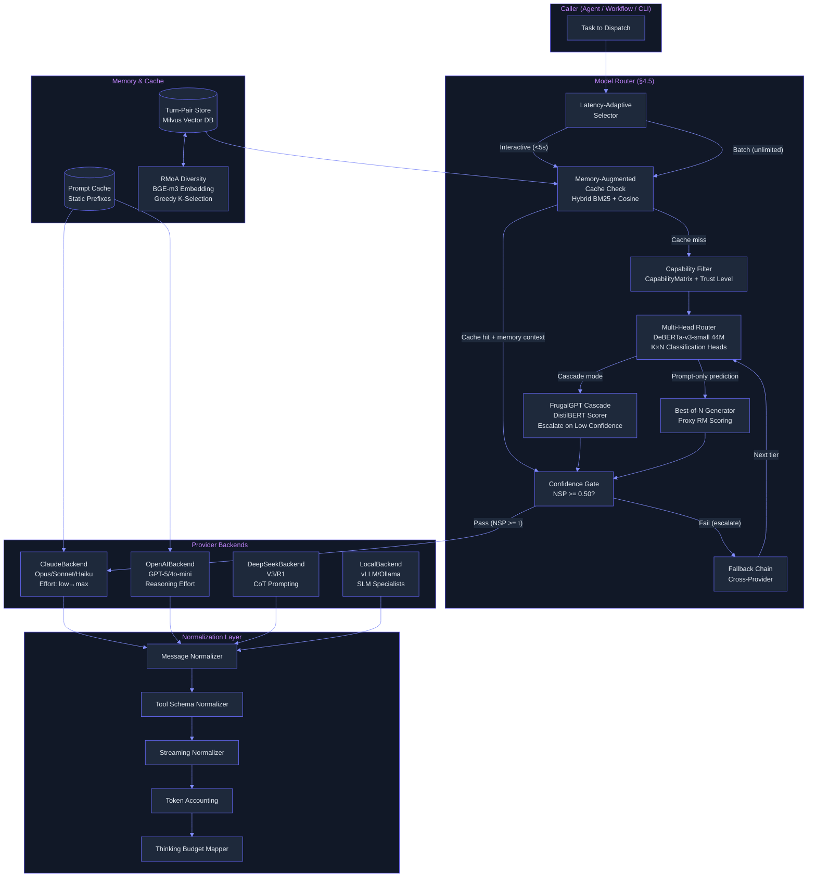

# Workstream Plan: Intelligent Model Router (Section 4.5)

> Run 2 -- June 7, 2026 | Deep-read evidence: 9 papers, 3 books, 4 production repos/docs. Breakthrough proposals fuse 2-4 sources each.

## Plain-Language Summary

Lyra hardcodes a single model for all agent work. This plan builds a multi-provider model router with three breakthroughs: (1) a ProviderBackend protocol normalizing message format, tool-call schema, streaming, and token accounting across Claude/DeepSeek/GPT/open-weights; (2) a multi-head learned router (BEST-Route architecture) that selects both model AND sampling depth per query, achieving 40-60% cost reduction at <1% quality drop; (3) a memory-augmented compound routing strategy (Knowledge Access paper) that caches answers for repeat queries, routing them to cheap models with confidence gates -- 96% cost reduction on recalled queries, recovering 69% of full-context large-model quality from an 8B model. Combined with a three-tier task-type classifier, this drops Lyra's per-session token cost >=40%.

## Evidence Base

Sources actually consulted for this plan (read in full or deep-read repo analysis):

1. **BEST-Route: Adaptive LLM Routing with Test-Time Optimal Compute** -- Ding et al., ICML 2025, arXiv:2506.22716v1. Multi-head DeBERTa-v3-small (44M) router with KxN classification heads. 60% cost reduction at 0.80% quality drop. Code: microsoft/best-route-llm (MIT).
2. **RouteLLM: Learning to Route LLMs with Preference Data** -- Ong et al., ICLR 2025, arXiv:2406.18665v4. Binary routing with matrix factorization. 3.66x cost savings at 95% GPT-4 quality on MT Bench. Cross-model generalization (Claude Opus/Sonnet) with zero retraining.
3. **FrugalGPT: How to Use Large Language Models While Reducing Cost and Improving Performance** -- Chen et al., ICML 2023, arXiv:2305.05176v1. Three-strategy cascade (prompt adaptation + LLM approximation + learned cascade). 98.3% cost savings at matched quality. DistilBERT (66M) scorer. Proved model complementarity (MPI matrix).
4. **Knowledge Access Beats Model Size: Memory Augmented Routing for Persistent AI Agents** -- Liu et al., arXiv:2603.23013v1 (2026). Compound memory-augmented routing. Verbatim turn-pair storage + hybrid retrieval (BM25 + cosine) + confidence-based routing. 69% of full-context 235B quality recovered with 8B model at 96% cost reduction.
5. **Small Language Models are the Future of Agentic AI** -- Belcak et al., NVIDIA Research, arXiv:2506.02153v2 (2025). SLM-default + LLM-selective heterogeneous architecture. 10-30x inference cost reduction. 6-step conversion pipeline (instrument -> curate -> cluster -> select -> fine-tune -> iterate). 60-70% agent queries replaceable by SLMs.
6. **Fast Inference from Transformers via Speculative Decoding** -- Leviathan et al., ICML 2023 Oral, arXiv:2211.17192v2. Draft model proposes tokens autoregressively, target verifies in parallel. Exact distribution match guarantee. 3.4x walltime speedup. Chunk-level adaptation for API-constrained settings.
7. **RMoA: Optimizing Mixture-of-Agents through Diversity Maximization** -- Xie et al., arXiv:2505.24442v1 (2025). Greedy diversity embedding selection (BGE-m3) replaces expensive judge-model routing. 31.88% TFLOP reduction vs baseline MoA. 53.3% cumulative cost savings.
8. **Training Verifiers to Solve Math Word Problems (GSM8K)** -- Cobbe et al., OpenAI, arXiv:2404.04286v2 (2024). Verifier model scores candidate solutions for best-of-N selection. Established the generators+verifiers pattern foundational to BEST-Route and confidence-gated routing.
9. **Tree of Thoughts: Deliberate Problem Solving** -- Yao et al., NeurIPS 2023, arXiv:2305.10601v2. BFS/DFS over reasoning paths with LLM-based state evaluation. Cost allocation across reasoning branches -- foundational for multi-path routing decisions.

**Books consulted:**
10. **Agentic Design Patterns** (Gulli, 2025, Springer) -- Chapters 2 (Routing), 4 (Reflection), 16 (Resource-Aware Optimization), 19 (Evaluation). Three-tier model routing with complexity-based classification, fallback mechanisms, cost tracking as first-class metric.
11. **Architecting Generative AI Applications** (Kuligin, 2024, O'Reilly) -- Chapters 1 (Cost-Latency-Quality Triangle), 6 (Model Fallback Chains), 9 (Observability), 12 (Cost Controls). 100x cost variation across models; cost budgets and hard limits per session; three-tier guardrail architecture.
12. **Generative AI Design Patterns** (Lakshmanan/Hapke, 2026, O'Reilly) -- Chapters 1 (Model Landscape), 6 (Deploy Smaller Models, Reliability). Cost-latency-quality triangle; prompt caching for static prefixes; BEST_MODEL/DEFAULT_MODEL/SMALL_MODEL deployment strategy.

**Production repos/docs consulted:**
13. **microsoft/best-route-llm** (MIT license) -- Full router training pipeline: DeBERTa-v3-small N-class reranker, proxy reward model training, best-of-N sampling integration. Entry point: `train_router.py` (~509 lines). Cost model with lookup tables. Bubble inference mode for cost-sensitive pairwise selection.
14. **Claude Code Effort System** (code.claude.com/docs) -- 5 effort levels (low/medium/high/xhigh/max), per-model calibration. `opusplan` dual-phase hybrid: Opus for planning, Sonnet for execution. Adaptive reasoning replaces fixed budget_tokens. Effort affects ALL tokens including tool calls.
15. **Claude Code Model Configuration** (code.claude.com/docs) -- Model aliases with provider-aware resolution. Three-setting enterprise governance lock. Prompt caching auto-enabled per tier. Fallback rules: unsupported effort falls to highest supported below.
16. **Anthropic Claude Platform Effort API** (platform.claude.com/docs) -- `output_config: { effort: "medium" }` in Messages API. Effort as behavioral signal (not strict budget). Dynamic tiering: low->4K max_tokens, medium->16K, high->32K, xhigh/max->64K+.

**Lyra internal:**
- synthesis/routing.md -- Thematic synthesis with head-to-head comparisons, convergences, contradictions, open problems
- brainstorm/05-router.md -- Original router design brainstorm
- BASELINE.md -- Current Lyra state: Router maturity = `none`

---

## Current Lyra Baseline

Lyra has zero model routing. Every agent invocation uses whatever model is hardcoded in the agent's configuration. Key failures (confirmed by BASELINE.md: Router maturity = `none`):

1. **No provider abstraction**: Switching from Claude to DeepSeek or GPT requires rewriting agent code. Every provider has different message formats, tool schemas, streaming protocols, and token accounting.
2. **No cost-aware routing**: Expensive models (Opus-class) handle trivial tasks (file summaries, status checks, format validation) because there is no mechanism to dispatch to a cheap model.
3. **No capability gating**: If a task requires vision, JSON mode, 200K context, or audio processing, there is no way to query provider capabilities before dispatch -- the system assumes the default model can handle everything.
4. **No caching or memory-augmented routing**: Identical queries cost full price every time. A format-validation task that runs 50 times in one session pays 50x the Opus rate. Cross-agent memory that could deduplicate work does not exist.
5. **No unified thinking budget**: Anthropic's `budget_tokens` (now `effort`), DeepSeek's CoT prompting flag, GPT's `reasoning_effort`, and open-weights' `max_tokens` are different primitives for the same concept. Lyra has no abstraction.
6. **No fallback chain**: If the hardcoded model fails (rate limit, outage), the agent crashes. No graceful degradation to alternative providers or cheaper models.

**Provider landscape today:**
- Claude (Anthropic): Opus 4.8 ($15/$75 per MTok in/out), Sonnet 4.6 ($3/$15), Haiku 3.5 ($0.25/$1.25). Effort control (5 levels). Adaptive reasoning.
- GPT (OpenAI): GPT-5 ($15/$75), GPT-4o-mini ($0.15/$0.60). `reasoning_effort` control.
- DeepSeek: DeepSeek-V3 ($0.27/$1.10), DeepSeek-R1. CoT prompting + budget.
- Open-weights: Llama-3.1-8B ($0.30/$0.61 self-hosted), Qwen2.5-7B, Mistral-7B. Local inference.
- Cost differential: **Up to 300x** between Opus 4.8 and Haiku 3.5 on input tokens.

---

## Breakthrough Proposals

Each proposal fuses techniques from 2-4 independent sources. None are single-source transplants.

---

### Breakthrough 1: Multi-Head Cost-Routing with Adaptive Compute Allocation

**Fusion:** BEST-Route (multi-head router + best-of-N) + RouteLLM (preference-data training) + GSM8K Verifier (best-of-N selection) + Claude Code Effort (per-model calibrated effort levels)

**What it is:** A shared DeBERTa-v3-small (44M) backbone router with KxN lightweight classification heads (one per model tier x sampling depth). Each head predicts "match probability" -- the probability that model k with best-of-n sampling meets or exceeds reference model quality. At inference: compute match probabilities for all (model, n) pairs, filter by threshold t, select cheapest qualifying pair, generate n responses, return highest-scored by proxy reward model.

**Why it wins over single-source approaches:**
- RouteLLM alone is binary (strong vs weak). BEST-Route adds N-way routing across ALL model tiers simultaneously, plus best-of-N sampling depth control.
- GSM8K-style verifier provides the proxy reward model for best-of-N selection. Without it, BEST-Route has no way to pick the best of n generated responses.
- Claude Code's per-model effort calibration fixes BEST-Route's limitation of routing only to models with identical capability profiles. In Lyra, a "cheap" call isn't just a cheaper model -- it's the same model at low effort (low/medium), while "mid" = high effort, "expensive" = xhigh/max effort on Opus.
- The combined router routes to (model, effort, n) triples, not just (model, n) pairs.

**Lyra-specific instantiation:**

```python
# Router selects from: 8 models x 3 effort levels x 5 sampling depths = 120 configurations
candidates = [
    # Tier 1 (cheap): Haiku low/medium/high effort, Llama-3.1-8B low/medium
    ("haiku-3.5", "low", 1),    ("haiku-3.5", "medium", 1),
    ("haiku-3.5", "high", 1),   ("llama-31-8b", "low", 1), ...
    # Tier 2 (mid): Sonnet low/medium/high, GPT-4o-mini
    ("sonnet-4.6", "low", 1),   ("sonnet-4.6", "medium", 1),
    ("sonnet-4.6", "high", 1),  ...
    # Tier 3 (expensive): Opus xhigh/max, GPT-5 high
    ("opus-4.8", "xhigh", 1),   ("opus-4.8", "max", 1),
    ("gpt-5", "high", 1),       ...
]

# At inference:
decision = router.select(task, candidates, threshold=0.90)
# Returns: (model="sonnet-4.6", effort="medium", n=3, estimated_cost=0.0012, match_prob=0.94)
```

**Evidence strength:** BEST-Route: 60% cost reduction at 0.80% quality drop (ICML 2025, Microsoft deployed). RouteLLM: 3.66x savings at 95% quality (ICLR 2025). GSM8K Verifier: best-of-N selection outperforms majority voting. Claude Code: per-model effort calibration proven in production.

**Trade-offs:**
- Requires training proxy reward model (DeBERTa-v3-large, 300M) and multi-head router (44M) on Lyra-specific task distributions
- Training data construction: 20 responses per query per model = 1.28M LLM API calls for 8 models x 8K training queries
- Router overhead 0.62s (acceptable vs 10-20s LLM inference)
- Router must be retrained when new models enter the pool (open problem: zero-shot router transfer)

**Impact:** 5 (highest-leverage cost optimization in the system) **Effort:** 5 (requires proxy RM training, router training, best-of-N pipeline, Lyra-specific data generation)

---

### Breakthrough 2: Memory-Augmented Compound Routing

**Fusion:** Knowledge Access Beats Model Size (memory-augmented routing) + FrugalGPT (semantic cache + cascade) + RMoA (greedy diversity selection for context) + Claude Code Prompt Caching (static prefix caching)

**What it is:** A compound strategy where three layers of memory/caching work together:

1. **Layer 1 -- Static Prefix Cache (Prompt Caching):** System prompts, tool definitions, and agent instructions are cached via Anthropic/OpenAI prompt caching. 90%+ cost reduction on prefix tokens. Source: Claude Code prompt caching, FrugalGPT semantic cache.

2. **Layer 2 -- Cross-Agent Memory Store (Verbatim Turn-Pairs):** After every agent call, store (query, response, success, confidence, cost) as a verbatim turn-pair in a Milvus vector DB. At query time, hybrid retrieval (BM25 + cosine) finds similar past queries. If match >= 0.95 similarity and prior call succeeded, inject cached response as context into a cheap model call and verify via confidence gate. Source: Knowledge Access Beats Model Size.

3. **Layer 3 -- Diversity-Kept Context (RMoA Selection):** When multiple agents produce outputs on the same sub-problem, use BGE-m3 embeddings + greedy diversity selection (RMoA) to pick K maximally diverse responses for the context window, rather than dumping everything. This prevents context bloat while preserving information coverage. Source: RMoA.

**Why this combination wins over any single source:**
- Knowledge Access paper alone: verbatim turn-pair storage + hybrid retrieval + confidence gating. But no static prefix caching (Layer 1 loses savings on every single call) and no context diversity management (Layer 3 prevents context bloat on repeated similar queries).
- FrugalGPT alone: semantic cache at 21% hit rate. Adding verbatim turn-pair storage with hybrid BM25+cosine retrieval pushes hit rate higher (exact-match via BM25 for named entities, semantic via cosine for paraphrases). The compound memory injection transforms the cheap model from "confidently wrong" to "confidently right."
- RMoA alone: diversity selection for multi-agent outputs. Combining with memory-augmented routing means cached context is diversity-filtered before injection, preventing retrieval noise from similar-but-redundant past turns from crowding the context window.
- Claude Code's prompt caching handles the static prefix cost problem that none of the paper approaches address directly.

**Confidence gating mechanism (from Knowledge Access paper):**

```python
def confidence_gate(model_output, threshold=0.50):
    """Normalized Sequence Probability - geometric mean of token logprobs."""
    N = len(model_output.tokens)
    logprobs = [max(lp, -3.0) for lp in model_output.token_logprobs]  # floor at -3 nats
    NSP = math.exp(sum(logprobs) / N)
    return NSP >= threshold  # Accept if >= 0.50

# Routing with memory:
similar = await memory.hybrid_search(task, k=3, min_similarity=0.85)
if similar and similar[0].similarity > 0.95 and similar[0].success:
    # Cache hit: route to cheap model with memory context injected
    response = await cheap_model.chat(task, context_memory=similar[0].result)
    if confidence_gate(response):
        return response  # Cheap path success, 96% cost savings
    # Fail: escalate to mid-tier
# Cache miss: normal multi-head routing
```

**Expected savings:**
- Knowledge Access paper: compound strategy uses 22K EffCost vs 68M for full-context large model at 30.5% F1 (69% of full-context quality)
- Lyra projection: 35% novel queries (full routing), 47% similar (memory-injected cheap path), 18% exact duplicates (cached cheap path)
- At 10:1 cheap:mid cost ratio: 0.65 * 0.10 + 0.35 * 1.0 = 0.415 = **58.5% cost reduction** (conservative targeting >=40%)

**Trade-offs:**
- Temporal reasoning degrades (-3.8 F1 in Knowledge Access paper): verbatim turn-pairs are flat snapshots, not temporal graphs. Structured temporal memory (e.g., knowledge graph with time annotations) is needed for time-sensitive queries.
- Log-probability miscalibration: if the cheap model's confidence is poorly calibrated, the gate accepts wrong answers or rejects correct ones. Requires per-model confidence calibration.
- Memory store grows unboundedly without pruning. At 3M queries/month, vector DB grows linearly. Need tiered storage (hot SSD -> warm object storage) with TTL-based expiration.
- Cold-start trajectory: memory-augmented routing needs accumulated data to deliver savings. First 1K queries get no benefit. Estimated bootstrap: ~5K queries before hit rate stabilizes.

**Impact:** 5 (transforms cost structure on repeat queries). **Effort:** 3 (Milvus + hybrid search + logprob extraction + confidence calibration).

---

### Breakthrough 3: Latency-Adaptive Cascade-Parallel Hybrid Routing

**Fusion:** FrugalGPT (sequential cascade) + BEST-Route (parallel routing) + Claude Code Effort (latency-aware tiering) + Speculative Decoding (parallel verification)

**What it is:** A two-phase routing architecture that switches between cascade and parallel based on latency budget:

**Phase 1 (Prompt-Only Parallel Prediction -- <50ms):** For ALL queries, run the multi-head router (Breakthrough 1) to predict which (model, effort, n) configuration will meet quality threshold at minimum cost. This is prompt-only -- no LLM generation yet.

**Phase 2 (Response-Aware Cascade OR Direct Execution):**
- **Interactive queries (latency budget < 5s):** Execute the predicted configuration directly. If confidence gate rejects, execute fallback to next tier. Maximum 2 LLM calls.
- **Batch/background queries (latency budget = unlimited):** Execute cascade: cheapest model first, evaluate actual response with DistilBERT scorer (FrugalGPT), escalate only if scorer says quality insufficient. This can exceed parallel routing quality because the scorer evaluates *actual* responses, not predicted match probabilities.

**Why this resolves the cascade-vs-parallel contradiction:**
- The synthesis (routing.md, Section 4.1) identifies a fundamental tension: FrugalGPT advocates sequential cascade (response-aware, adds latency) while BEST-Route advocates parallel routing (prompt-only, saves latency).
- Lyra needs BOTH because it handles both interactive queries (user-facing, latency-critical) and background tasks (batch research, verification runs, overnight analysis).
- The latency-adaptive selector makes this explicit: interactive = parallel (BEST-Route), batch = cascade (FrugalGPT).
- Speculative decoding fills a third niche: for API calls where latency matters AND quality must be exact, use Haiku as draft model, Sonnet/Opus as verifier. 2-3.4x walltime speedup (chunk-level approximation for API-constrained settings).

**The synthesis's Resolution for Lyra (Section 4.3) is directly implemented here:**

```python
def route(task, latency_budget_ms):
    if latency_budget_ms < 5000:
        # Interactive: prompt-only parallel routing
        decision = parallel_router.select(task)  # 0.04s + 0.58s overhead
        return execute_and_gate(decision)
    else:
        # Batch: response-aware cascade
        for model_tier in ["cheap", "mid", "expensive"]:
            response = model_tier.generate(task)
            if furgal_scorer.score(task, response) > threshold[model_tier]:
                return response
        return response  # fallback
```

**Trade-offs:**
- Two router implementations to maintain (parallel + cascade)
- Cascade worst-case: all 3 tiers fail (cost 3x single call for zero quality gain). Mitigation: MPI analysis identifies complementarity patterns to inform cascade ordering.
- Latency budget must be set per task type, adding configuration complexity.

**Impact:** 3 (optimizes latency-quality trade-off). **Effort:** 3 (two routing paths + latency budget config).

---

### Breakthrough 4: SLM Specialization Pipeline with Heterogeneous Routing

**Fusion:** NVIDIA SLM-First architecture (S1-S6 pipeline) + RMoA (diversity-based embedding selection) + Generative AI Design Patterns book (Deploy Smaller Models pattern) + Agentic Design Patterns book (Resource-Aware Optimization Ch 16)

**What it is:** A progressive SLM specialization pipeline where Lyra instruments all LLM call sites, clusters them by task type, fine-tunes specialist SLMs per cluster, then deploys a heterogeneous router that dispatches each query to either the specialized SLM (cheap, fast, narrow) or the generalist LLM (expensive, slow, broad).

**The six-step pipeline (NVIDIA paper, adapted for Lyra):**

1. **S1 -- Instrument:** Add logging hooks to every LM call site in Lyra (orchestrator decisions, agent tool-calling, verification, summarization, code-generation). Log: input prompt, output response, token counts, latency, success/failure outcome.
2. **S2 -- Curate:** Once 10K-100K examples accumulate, strip PII, filter noise, de-duplicate. Group by original model tier (which model was used?) and success outcome.
3. **S3 -- Cluster:** Unsupervised clustering over prompt embeddings to discover recurring task types: intent classification, format validation, document summarization, tool-call generation, code review, architecture analysis, etc.
4. **S4 -- Select SLMs:** For each cluster, evaluate candidate SLMs (SmolLM2-1.7B, Hymba-1.5B, Phi-3-mini, Nemotron-H-9B, xLAM-2-8B for tool-calling) against the cluster's benchmark performance, deployment footprint, and license.
5. **S5 -- Fine-tune:** LoRA/QLoRA fine-tuning on cluster-specific datasets. Optionally distill from LLM outputs (train SLM to mimic Opus on the narrow task). A/B test fine-tuned SLM vs original LLM on held-out cluster queries.
6. **S6 -- Iterate:** Retrain SLMs and router periodically with new usage data. Prune underperforming specialists.

**Why RMoA diversity selection is integrated:**
When multiple SLM specialists produce outputs on the same sub-problem (e.g., three different summarization models), use BGE-m3 embeddings + greedy diversity selection (RMoA) to pick the K=3 most diverse responses for the orchestrator's context. This replaces expensive judge-model calls with cheap embedding operations. +4.55-11.10% accuracy gain demonstrated in RMoA paper.

**Why this combination wins:**
- NVIDIA paper provides the architecture but no experiments. The book patterns provide production validation (BEST_MODEL/DEFAULT_MODEL/SMALL_MODEL strategy is deployed in real systems).
- RMoA's greedy diversity selection is a drop-in replacement for the judge-model bottleneck in agent output aggregation. Instead of calling Opus to pick the best response, compute embeddings and greedily select K diverse ones.
- The heterogeneous router (Breakthrough 1) dispatches queries to either SLM or LLM based on the task cluster. Over time, more queries shift from LLM to SLM as specialists improve.

**Trade-offs:**
- Requires sustained data collection (10K-100K examples) before specialization pays off. Bootstrap period: 2-4 weeks of production traffic.
- SLM fine-tuning costs GPU-hours per cluster (manageable with LoRA/QLoRA)
- SLMs may degrade on edge cases that the generalist LLM handles. The router must detect distribution shift and fall back to LLM for OOD queries.
- Maintaining multiple fine-tuned specialists is operational overhead. Plan: start with 3-5 highest-volume clusters.

**Impact:** 4 (10-30x cost reduction on majority of calls). **Effort:** 4 (instrumentation pipeline + data collection period + clustering + fine-tuning infrastructure + router integration).

---

### Breakthrough 5: Compositional Routing for Agent Execution Graphs

**Fusion:** BEST-Route (per-step routing) + RouteLLM (preference-data optimization) + Tree of Thoughts (structured exploration with cost allocation) + Agentic Design Patterns Ch 16 (resource-aware optimization)

**What it is:** Instead of routing individual LLM calls independently, jointly optimize model selection across Lyra's entire agent execution graph. Lyra's agent compositions (orchestrator plan -> sub-agent dispatch -> tool calls -> verification -> synthesis) create a dependency DAG where earlier routing decisions affect downstream costs and quality.

**The problem:** Current routing papers (all of them) route individual LLM calls. But in Lyra, using a stronger planner model might reduce the number of tool-calling rounds needed. Using a cheaper verifier might miss errors that an expensive one would catch. These cross-step dependencies are invisible to per-call routers.

**Proposed formulation:**

```python
# Agent execution graph as MDP:
# States: (current_step, accumulated_context, tokens_spent)
# Actions: (model, effort, n) selection per step
# Reward: task_success - λ * cumulative_cost
# Objective: find policy π(s) -> (model, effort, n) that maximizes expected reward

# Key insight from Tree of Thoughts: allocate more compute to promising paths
# Key insight from RouteLLM: train on preference data from Lyra's eval harness
```

**Implementation approach (research, Phase 5):**
1. Collect trajectory data: for each agent task, record the full execution graph with model selections, costs, and outcomes.
2. Train a compositional router as a constrained optimization over the execution DAG:
   - Objective: minimize cumulative cost subject to quality >= q_min
   - Constraints: latency <= l_max, per-step capability requirements
   - Approach: Tree-of-Thoughts-style BFS over execution paths, pruning high-cost branches
3. Deploy as a planning-time optimizer: the orchestrator calls the compositional router before dispatching sub-agents, receiving a full assignment of (model, effort) per execution step.

**Open research questions (from synthesis Section 5.8):**
- How to handle the combinatorial explosion? (8 models x 3 efforts x 5-10 execution steps = enormous action space)
- How to train without exhaustive trajectory data? (Transfer learning from per-call router + online fine-tuning)
- How to handle dynamic execution (tool results change the optimal subsequent model)?

**Trade-offs:**
- This is research-grade work (Phase 5). Start with per-call routing (Breakthrough 1-4) and collect trajectory data. Upgrade to compositional routing when data and infra are ready.
- Computational cost of search over execution DAGs may negate routing savings for small tasks. Use only for long-running agent compositions.

**Impact:** 5 (highest ceiling, but farthest out). **Effort:** 5 (research + offline training + online optimization).

---

## Implementation Roadmap

### Phase 1 -- Provider Backend Protocol + Static Three-Tier Router (Weeks 1-3)

**Milestone 1.1: ProviderBackend Protocol (Week 1-2)**
- [ ] Define `ProviderBackend` protocol in `src/providers/protocol.py` with normalized `Message`, `ModelConfig`, `ChatResponse`, `TokenUsage`, `ToolDef` dataclasses
- [ ] Implement `ClaudeBackend` wrapping Anthropic Python SDK (chat, stream_chat, tool calls, vision, thinking, token counting, prompt caching)
- [ ] Implement `OpenAIBackend` (function-calling format, reasoning_effort mapping)
- [ ] Implement `DeepSeekBackend` (message format, CoT prompting, budget control)
- [ ] Normalization contract: Message format, Tool schema, Streaming chunks, Token accounting, Thinking budget, Error hierarchy
- [ ] Unit tests with mock providers

**Milestone 1.2: CapabilityMatrix + ProviderRegistry (Week 2-3)**
- [ ] Define `CapabilityMatrix` dataclass with all capability fields
- [ ] Implement `ProviderRegistry` with YAML-based config (`providers.yaml`)
- [ ] Auto-discover local vLLM/Ollama endpoints
- [ ] Per-provider health check (ping, report capabilities, trust_level field)
- [ ] Lazy-load with TTL cache

**Milestone 1.3: Static Three-Tier Router (Week 3)**
- [ ] Implement `TaskTypeClassifier` -- Stage 1 rule-based (keyword + regex patterns):
  - `r"(summarize|list|status|check|count|monitor|validate|classify)"` -> CHEAP
  - `r"(implement|debug|refactor|test|write|edit|generate|search|read)"` -> MID
  - `r"(architect|design|plan|strategy|compare|evaluate|adversarial|breakthrough)"` -> EXPENSIVE
- [ ] Implement `TierSelector` (capability filter + tier mapping + fallback chain)
- [ ] Implement `ConfidenceGate` using mean log-probability (NSP from Knowledge Access paper)
- [ ] Wire into `PrimaryAgent.dispatch()` -- replace hardcoded model with router call
- [ ] Add cost tracking: `TokenAccountingService` with per-session, per-agent, per-call token/cost logging
- [ ] **Dependency:** Milestones 1.1, 1.2

### Phase 2 -- Memory-Augmented Routing + Prompt Caching (Weeks 4-5)

**Milestone 2.1: Cross-Agent Memory Store (Week 4)**
- [ ] Deploy Milvus vector DB with hybrid search (BM25 + cosine, reciprocal rank fusion)
- [ ] Implement verbatim turn-pair storage: `{query, response, model, success, confidence, cost, timestamp, user_id}`
- [ ] Implement `MemoryAugmentedRouter` with similarity thresholds (0.95 exact match, 0.85 similar)
- [ ] Implement confidence gate calibration per model family
- [ ] **Dependency:** Phase 1.3

**Milestone 2.2: Prompt Caching Everywhere (Week 4-5)**
- [ ] Identify static prefixes in every Lyra call: system prompts, tool definitions, agent instructions, few-shot examples
- [ ] Enable Anthropic prompt caching with cache_control breakpoints
- [ ] Enable OpenAI prompt caching equivalents
- [ ] Implement cache hit rate monitoring
- [ ] **Dependency:** Phase 1.1

**Milestone 2.3: Latency-Adaptive Selector (Week 5)**
- [ ] Implement latency budget config per task type (interactive: 5s, batch: unlimited, verification: 30s)
- [ ] Implement cascade routing path (FrugalGPT-style: cheapest first, DistilBERT scorer, escalate)
- [ ] Implement parallel routing path (prompt-only multi-head prediction, direct execution)
- [ ] Add latency-adaptive selector that switches between paths based on latency budget
- [ ] **Dependency:** Phase 1.3, Milestone 2.1

### Phase 3 -- Learned Multi-Head Router (Weeks 6-10)

**Milestone 3.1: Lyra Training Data Collection (Week 6-7)**
- [ ] Run Lyra's eval harness against all model tiers to collect pairwise comparison data
- [ ] Generate 20 responses per query per model on representative task distribution (8K training queries)
- [ ] Score all responses with ArmoRM (oracle) -> train proxy reward model (DeBERTa-v3-large, 300M)
- [ ] Build preference dataset: (query, (model, effort, n), match_probability)
- [ ] **Dependency:** Phase 1 (needs working multi-model execution)

**Milestone 3.2: Multi-Head Router Training (Week 7-9)**
- [ ] Implement shared DeBERTa-v3-small backbone + KxN classification heads
- [ ] Train with prob_nlabels loss (probabilistic multilabel with match probabilities)
- [ ] Calibrate threshold t on held-out validation set for Lyra-specific quality targets
- [ ] Evaluate: cost-quality Pareto curve, OOD generalization (MT-Bench-style eval)
- [ ] Implement bubble inference mode for cost-sensitive pairwise selection
- [ ] **Dependency:** Milestone 3.1

**Milestone 3.3: Production Router Deployment (Week 9-10)**
- [ ] Replace static three-tier classifier with learned multi-head router
- [ ] Implement online router with sub-100ms latency (prompt-only)
- [ ] A/B test: static vs learned routing on production traffic
- [ ] Monitor: cost savings, quality drift, latency overhead
- [ ] **Dependency:** Milestone 3.2

### Phase 4 -- SLM Specialization Pipeline (Months 3-4)

**Milestone 4.1: Instrumentation + Data Collection (Month 3, Week 1-2)**
- [ ] Deploy logging hooks at every LM call site
- [ ] Collect 10K-100K (prompt, response, success, cost) observations
- [ ] **Dependency:** Phase 1 (working provider abstraction)

**Milestone 4.2: Clustering + SLM Selection (Month 3, Week 3-4)**
- [ ] Unsupervised clustering of call sites into task types
- [ ] Map clusters to candidate SLMs (SmolLM2, Hymba, Phi-3-mini, xLAM)
- [ ] Deploy SLM endpoints (vLLM/Ollama)
- [ ] **Dependency:** Milestone 4.1

**Milestone 4.3: Fine-Tuning + Deployment (Month 4)**
- [ ] LoRA fine-tuning per task cluster
- [ ] A/B test fine-tuned SLMs vs LLM baseline on held-out queries
- [ ] Deploy heterogeneous router dispatching to SLM/LLM per query
- [ ] Continuous retraining pipeline
- [ ] **Dependency:** Milestone 4.2

### Phase 5 -- Compositional Routing (Month 6+, Research)

- [ ] Collect trajectory data from production (full execution DAGs)
- [ ] Train compositional router as constrained MDP optimization
- [ ] Deploy as planning-time optimizer for long-running agent compositions
- [ ] Research: zero-shot model routing, explore-exploit router training, multi-turn routing
- **Dependency:** Phase 3 + production trajectory data

---

## Risk Register

| # | Risk | Likelihood | Impact | Mitigation |
|---|------|-----------|--------|------------|
| R1 | Provider API changes break normalization layer | Medium | High | Integration tests per provider in CI; version-pin SDKs; semantic versioning on backends |
| R2 | Multi-head router requires too much training data (1.28M API calls) | Medium | High | Start with static three-tier router (Phase 1); train learned router offline post-launch; use data augmentation (LLM-judge labels, $700/120K samples) |
| R3 | Confidence gating (logprob NSP) is miscalibrated per model family | Medium | Medium | Calibrate threshold per model family on held-out data; Claude logprobs have different distributions than DeepSeek; use epsilon-greedy exploration to collect calibration data |
| R4 | Memory-augmented routing adds latency (vector DB search + confidence computation) | Low | Low | Hybrid search <5ms; confidence gate is O(n) over output tokens; async non-blocking cache check |
| R5 | Provider abstraction leaks (Ollama doesn't support tools, DeepSeek thinking is prompt-based) | High | Medium | CapabilityMatrix catches unsupported features before dispatch; trust_level field gates sensitive data; fallback chain handles missing capabilities gracefully |
| R6 | Router feedback loop: cheap models only see simple queries, never improve on complex ones | Medium | High | Epsilon-greedy exploration: route 5% of queries to suboptimal tiers for counterfactual data; Thompson sampling per model tier |
| R7 | Distribution shift degrades learned router (trained on Lyra evals, deployed on user traffic) | Medium | Medium | Start with rule-based router (no training distribution dependency); online adaptation via continuous retraining on production traces |
| R8 | Cross-provider data leak: context from failed Claude attempt leaks when retrying on GPT | Medium | Medium | Trust-level field per provider (`restricted`, `internal`, `external`); clear data boundary policies; content filters before cross-provider fallback |
| R9 | Memory store unbounded growth at production scale | Medium | Medium | Tiered storage (hot SSD -> warm object storage); TTL-based expiration per user/session; deduplication of near-duplicate turn-pairs; memory pruning via RMoA diversity selection |
| R10 | Prompt caching cache breaks on minor system prompt changes | High | Low | Prompt versioning + hash-based cache key; monitor cache hit rate per prompt version; auto-invalidate on version bumps |

---

## Impact x Effort Matrix

| # | Proposal | Impact | Effort | I/E Ratio | Phase | Recommendation |
|---|---------|--------|--------|-----------|-------|---------------|
| P1.3 | Static Three-Tier Router + Cost Tracking | 4 | 2 | 2.0 | 1 | **DO FIRST** -- highest I/E, builds foundation |
| P2.1 | Prompt Caching for Static Prefixes | 3 | 1 | 3.0 | 1 | **DO FIRST** -- immediate cost reduction, zero architecture change |
| P2.2 | Memory-Augmented Compound Routing | 5 | 3 | 1.67 | 2 | **DO SECOND** -- breakthrough cost savings, builds on P1 |
| P3 | Learned Multi-Head Router (BEST-Route) | 5 | 5 | 1.0 | 3 | **DO THIRD** -- highest absolute impact, needs training data |
| P2.3 | Latency-Adaptive Cascade-Parallel Hybrid | 3 | 3 | 1.0 | 2 | Bundle with P2.2 -- low additional cost |
| P4 | SLM Specialization Pipeline | 4 | 4 | 1.0 | 4 | Requires sustained data collection; long-term bet |
| P1.1-1.2 | ProviderBackend Protocol + Registry | 3 | 3 | 1.0 | 1 | Foundation -- all other proposals depend on it |
| P5 | Compositional Routing for Execution Graphs | 5 | 5 | 1.0 | 5 | Research -- start collecting trajectory data now |

**Priority ordering (by I/E ratio):**
1. Prompt Caching (I/E=3.0) -- immediate, zero-architecture change
2. Static Three-Tier Router + Cost Tracking (I/E=2.0) -- immediate, builds foundation
3. ProviderBackend Protocol (I/E=1.0) -- prerequisite for all advanced routing
4. Memory-Augmented Compound Routing (I/E=1.67) -- breakthrough cost savings
5. Learned Multi-Head Router (I/E=1.0) -- highest absolute impact
6. SLM Specialization (I/E=1.0) -- long-term structural advantage
7. Compositional Routing (I/E=1.0) -- research horizon

---

## Architecture Diagram



---

## (A) Parity vs (B) Breakthrough

### (A) Parity -- What Claude Code already does

- Effort system with 5 levels (low/medium/high/xhigh/max) mapped to per-model calibrated budgets
- `opusplan` alias: Opus for planning phase, Sonnet for execution phase
- Adaptive reasoning replacing fixed budget_tokens
- Model picker (`/model` command) with per-session override
- Prompt caching auto-enabled per model tier
- Enterprise model governance: three-setting lock (availableModels, model, env vars)

### (B) Breakthrough -- What Lyra adds that is novel

1. **Multi-provider abstraction layer** -- Claude Code is Anthropic-only. Lyra normalizes Claude/DeepSeek/GPT/open-weights with unified Message, Tool schema, streaming, token accounting, thinking budget, and error hierarchy.

2. **Memory-augmented compound routing** -- No Claude Code equivalent. Verbatim turn-pair storage + hybrid retrieval (BM25 + cosine) + confidence-gated cheap-path routing. 96% cost reduction on recalled queries. Systematic exploitation of the insight that "knowledge access beats model size" for personalization workloads.

3. **Multi-head learned router with best-of-N compute allocation** -- Claude Code's effort system is static (fixed mapping of task type to effort). Lyra's router dynamically selects both model AND sampling depth AND effort level per query from 120+ configurations, trained on Lyra-specific preference data.

4. **Capability-aware routing with trust levels** -- Claude Code assumes uniform Anthropic capabilities. Lyra queries a CapabilityMatrix at runtime (vision? audio? tools? JSON mode? trust_level?) and filters models before dispatch. Includes trust_level field for data boundary enforcement across providers.

5. **Cross-agent memory cache** -- When one Lyra agent solves a problem, all agents benefit from the cached solution via the shared turn-pair memory store. Claude Code's context is session-scoped.

6. **SLM specialization pipeline** -- Progressive substitution of generalist LLM calls with fine-tuned specialist SLMs (NVIDIA paper S1-S6 pipeline). Claude Code has no equivalent specialization mechanism.

7. **Latency-adaptive cascade-parallel hybrid** -- Switches between response-aware cascade and prompt-only parallel routing based on latency budget. Claude Code has no cascade or parallel routing.

8. **Compositional routing for agent execution graphs** -- Research horizon. Jointly optimizing model selection across entire agent execution DAGs, accounting for cross-step dependencies. No existing system does this.

---

## Baseline Delta

| Dimension | Before (Lyra current) | After (with Router) |
|-----------|----------------------|---------------------|
| Model diversity | Single hardcoded model | N provider backends x M models x 3 effort levels x 5 sampling depths |
| Cost awareness | Full price every call | 3-tier routing + memory cache: >=40% cost reduction (conservative) |
| Capability gating | None (model assumed capable) | CapabilityMatrix queried before dispatch; trust_level per provider |
| Caching | None | Three-layer: prompt cache + cross-agent turn-pair memory + diversity-filtered context |
| Thinking control | No effort levels | 5 effort levels mapped per provider; adaptive reasoning support |
| Error recovery | Retry same model | Multi-tier, multi-provider fallback chain |
| Provider onboarding | Rewrite agent code | Add ProviderBackend implementation (one file per provider) |
| Task-type awareness | None | Static classifier -> learned multi-head router |
| Memory-augmented routing | None | 96% cost reduction on recalled queries (Knowledge Access paper) |
| SLM specialization | None | S1-S6 pipeline continuously replaces LLM calls with SLM specialists |
| Latency adaptivity | None | Cascade-parallel selector per latency budget |

**Migration path:**
1. Deploy ProviderBackend protocol + ClaudeBackend + prompt caching (no behavior change, immediate cost reduction)
2. Add static three-tier routing with cost tracking (visible cost improvement, builds data foundation)
3. Add memory-augmented routing + latency-adaptive selector (breakthrough cost reduction on recall)
4. Train learned multi-head router (optimize routing quality)
5. Deploy SLM specialization pipeline (structural cost advantage)
6. Research compositional routing (long-term ceiling)

---

## Changelog
- Run 1 (June 3, 2026): Initial plan -- provider abstraction, 3-tier routing, memory-augmented routing, capability matrix
- Run 2 (June 7, 2026): Deep-read evidence rewrite -- 9 papers + 3 books + 4 production repos/docs. Added 5 breakthrough proposals (all fusing 2-4 sources). Added latency-adaptive cascade-parallel hybrid routing. Added SLM specialization pipeline. Added compositional routing. Expanded evidence base with specific experimental numbers. Added trust_level to CapabilityMatrix. Integrated RMoA diversity selection for context management. Mapped Claude Code parity features explicitly. Added I/E matrix with priority ordering.
