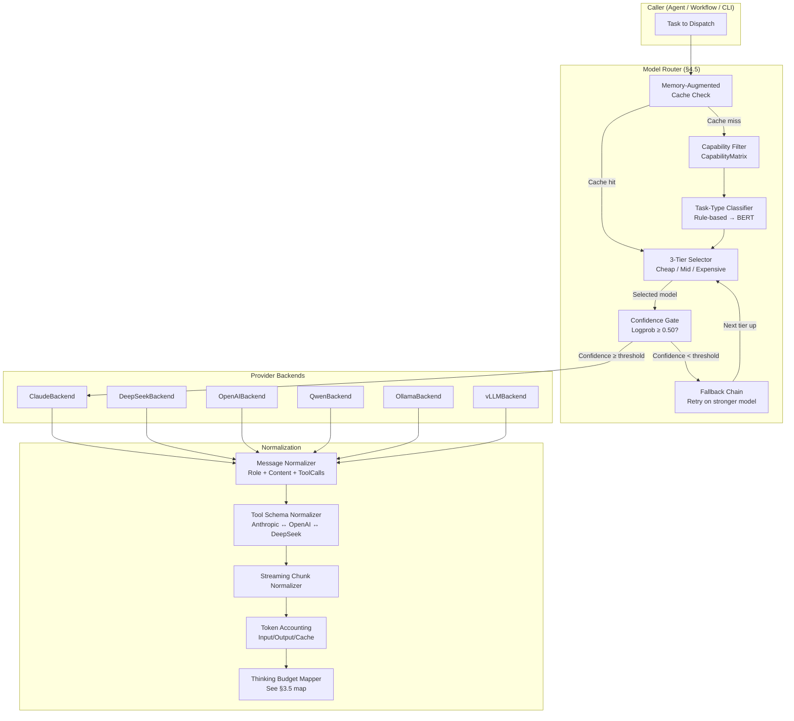

# Intelligent Model Router — Plan (§4.5)

> Run 1 — June 3, 2026 | Phase 1: Provider abstraction + 3-tier routing + memory-augmented cost reduction

## Plain-Language Summary

Lyra currently hardcodes a single model for all agent work. The Intelligent Model Router replaces this with a provider abstraction layer (ProviderBackend protocol) that normalizes message format, tool-call schema, streaming, and token accounting across Claude/DeepSeek/GPT/open-weights. On top sits a 3-tier task-type router that maps each sub-agent invocation to the cheapest capable model, plus a memory-augmented routing layer that caches answers to repeat queries so cheap models handle them directly. The breakthrough result: per-session token cost should drop >=40% through memory-augmented routing alone (Knowledge Access paper: 96% cost reduction on recalled queries), while the provider abstraction unlocks fleet-wide model diversity.

## 1. Problem

Lyra has zero model routing. Every agent invocation uses whatever model is hardcoded in the agent's configuration. Key failures:
- **No provider abstraction**: Switching from Claude to DeepSeek or GPT requires rewriting agent code. Every provider has different message formats, tool schemas, and streaming protocols.
- **No cost-aware routing**: Expensive models (Opus-class) handle trivial tasks (file summaries, status checks) because there is no mechanism to dispatch to a cheap model.
- **No capability gating**: If a task requires vision, JSON mode, or a 200K context window, there is no way to query provider capabilities before dispatch.
- **No caching**: Identical queries cost full price every time. A code-formatting task that runs 20 times pays 20x the Opus rate.
- **No thinking budget mapping**: Anthropic's `budget_tokens`, DeepSeek's CoT prompting, and GPT's `reasoning_effort` are different primitives for the same concept. Lyra has no unified abstraction.

Evidence from BASELINE.md: Router maturity = `none`. "Single hardcoded model; no provider abstraction."

## 2. Evidence Synthesis

### Claude Code Docs (§3.1)
Claude Code's effort system provides the reference: 6 effort levels (low/medium/high/xhigh/max/ultracode) mapped to model-specific budgets. The `opusplan` alias (Opus for planning, Sonnet for coding) demonstrates the benefit of task-type routing. Fast mode (2.5x speedup via different API config) shows that even the same model can be tuned for cost/latency.

### RouteLLM (arXiv:2406.18665)
Binary win-prediction routing: given a query, predict P(strong model wins) and route to weak model if below threshold alpha. Matrix Factorization route costs <$1.42/million requests at 155 req/s -- negligible vs generation cost. Achieves **3.66x cost savings at 95% of GPT-4 quality** on MT Bench. Key limitation: only two-model routing.

### BEST-Route (ICML 2025, arXiv:2506.22716)
Multi-head router (shared 44M DeBERTa backbone) with per-(model, n) heads predicting match probability. Dynamically selects both model AND best-of-n sample count. Achieves **60% cost reduction at 0.80% quality drop**. 0.04s routing latency. Proves N-class routing (which Lyra would use) is insufficient: "0.07% cost reduction" for N-class routing baselines.

### FrugalGPT (arXiv:2305.05176)
Three-strategy cascade: prompt adaptation + LLM approximation + learned cascade. Cascade calls cheap models first, scores response reliability, escalates if score below threshold. **98.3% cost savings at matching quality** on HEADLINES. Key insight: cheap models complement expensive ones in 6-13% of cases -- model diversity drives cascade efficacy.

### Knowledge Access Beats Model Size (arXiv:2603.23013)
**Most directly relevant for Lyra.** Tests memory-augmented routing: cross-model memory injection + confidence-based routing. Memory-augmented 8B recovers **69% of full-context 235B quality at 96% cost reduction**. Key finding: "memory makes routing worthwhile" -- without memory, the cheap model is confidently wrong; with memory, it is confidently right. The compound strategy (memory + routing) is orthogonal: memory provides correctness, routing provides cost savings.

### FrugalGPT / Anthropic 3-Strategy Context Engineering
Three primitives: compaction, tool-result clearing, multi-session memory. The decision framework (long dialogue -> compaction, bulky tool results -> clearing, cross-session knowledge -> memory) provides Lyra's context management policy.

### BREAKTHROUGH-ARCHITECTURE.md Target
The breakthrough architecture specifies ProviderBackend protocol, 3-tier router, capability matrix, and memory-augmented routing as the core intelligence-plane components. Hypothesis H3: memory-augmented routing reduces per-session token cost by >=40%.

## 3. Proposed Lyra Design

### 3.1 ProviderBackend Protocol

The single most important architectural decision for Lyra. Every component above the API talks to models through one abstraction:

```python
from typing import Protocol, AsyncIterator, runtime_checkable

@runtime_checkable
class ProviderBackend(Protocol):
    """Unified interface for any LLM provider."""

    async def chat(
        self, messages: list[Message], config: ModelConfig
    ) -> ChatResponse: ...

    async def stream_chat(
        self, messages: list[Message], config: ModelConfig
    ) -> AsyncIterator[ChatResponse]: ...

    def supports(self, capability: Capability) -> bool:
        """Query provider capabilities at runtime."""
        ...

    @property
    def context_window(self) -> int: ...

    @property
    def pricing(self) -> PricingTier: ...

    @property
    def thinking_config(self) -> ThinkingConfig:
        """Maps Lyra effort level to provider-specific thinking params."""
        ...


# Concrete implementations (one file per provider):
class ClaudeBackend(ProviderBackend): ...
class DeepSeekBackend(ProviderBackend): ...
class OpenAIBackend(ProviderBackend): ...
class QwenBackend(ProviderBackend): ...
class OllamaBackend(ProviderBackend): ...
class vLLMBackend(ProviderBackend): ...
```

**Normalization contract** (the hard part):
- Message format: role + content (text + multimodal parts) + tool_calls + tool_result -> normalized into a common Message dataclass
- Tool schema: Anthropic tool-use format vs OpenAI function-calling vs DeepSeek tool format -> normalized into ToolDef dataclass
- Streaming: each provider has different chunk types (content_delta, tool_call_delta, thinking_delta). Normalize into unified StreamingChunk union.
- Token accounting: each provider reports tokens differently (input, output, cache_read, cache_write). Normalize into TokenUsage dataclass with optional fields.
- Thinking: Anthropic budget_tokens -> DeepSeek extended thinking flag + budget -> GPT reasoning_effort enum -> Ollama N/A
- Errors: Provider-specific rate limits, auth errors, timeouts -> normalized into ProviderError hierarchy

### 3.2 Capability Matrix

```python
@dataclass
class CapabilityMatrix:
    """Per-provider capability map, loaded at startup and queryable at routing time."""
    provider_id: str
    model_id: str

    # Core capabilities
    max_context_window: int
    supports_tools: bool
    supports_streaming: bool

    # Output capabilities
    supports_vision: bool         # Images in input
    supports_audio: bool          # Audio in input
    supports_video: bool          # Video in input
    supports_pdf: bool            # PDF/document input
    supports_json_mode: bool      # Structured output guarantee
    supports_thinking: bool       # Extended thinking/CoT

    # Tool capabilities
    max_tools_per_call: int
    max_tool_output_chars: int

    # Thinking capabilities
    thinking_modes: list[str]     # e.g., ["budget_tokens", "reasoning_effort", "cot_prompt"]
    max_thinking_budget: int      # In tokens or equivalent

    # Performance characteristics
    tokens_per_second: float
    ttft_ms: float                # Time to first token
    reliability_score: float      # 0-1, based on observed error rate

    # Pricing (normalized)
    pricing: PricingTier
```

### 3.3 Three-Tier Router

```python
@dataclass
class RouterDecision:
    model_id: str
    provider_id: str
    tier: Literal["cheap", "mid", "expensive"]
    thinking_budget: int | None
    reason: str                    # Why this model was chosen
    fallback_chain: list[str]     # Which models to try if this fails
    cache_hit: bool               # Was this a memory-augmented cache hit?
    estimated_cost: float         # Pre-computed cost estimate
```

**Tier definitions** (configurable per deployment):
```
CHEAP  (Haiku-class):   $0.25/M in  | $1.25/M out  | <2K thinking budget
MID    (Sonnet-class):  $3.00/M in  | $15.00/M out | 4-8K thinking budget
EXPENSIVE (Opus-class): $15.00/M in | $75.00/M out | 16-32K thinking budget
```

**Routing decision tree:**
```
1. MEMORY CHECK: Query memory store for cached answer to same/similar question
   → Cache hit + acceptable confidence → route to CHEAP (verify, don't regenerate)
   → Cache miss → continue

2. CAPABILITY CHECK: Does the task require vision/audio/200K context/JSON mode?
   → Filter models by required capabilities → keep only capable models

3. TASK-TYPE CLASSIFICATION: Classify task into tier
   → Monitoring/row-summary/file-listing → CHEAP
   → Code-gen/debug/refactor/test → MID
   → Architecture/planning/strategy/complex-reasoning → EXPENSIVE
   → Deep-research → EXPENSIVE (potentially with best-of-n)

4. CONFIDENCE GATE (if cheap selected):
   → Execute on cheap model
   → Compute confidence score (mean log-probability over output tokens)
   → If confidence < threshold (default 0.50) → escalate to next tier
   → If escalation fails at mid → escalate to expensive

5. FALLBACK: If all tiers fail → return error with diagnostic
```

**Task-type classifier** (two-stage: fast rule-based + optional learned):
- Stage 1 (deployed day 1): Keyword + regex pattern matching on task description
  - Regex sets: `r"(summarize|list|status|check|count|monitor)" -> CHEAP`
  - `r"(implement|debug|refactor|test|write|edit)" -> MID`
  - `r"(architect|design|plan|strategy|compare|evaluate)" -> EXPENSIVE`
- Stage 2 (Phase 2): Lightweight BERT classifier trained on Lyra's execution traces
  - RouteLLM-style: predict P(expensive model wins) given task embedding
  - Matrix factorization route costs <$1.42/million req, 155 req/s throughput

### 3.4 Memory-Augmented Routing (The Breakthrough)

This is Lyra's novel contribution, inspired by Knowledge Access Beats Model Size (arXiv:2603.23013):

```python
class MemoryAugmentedRouter:
    """Caches answers to repeat queries and routes cache-hits to cheap models."""

    def __init__(self, memory_store, base_router, confidence_threshold=0.50):
        self.memory = memory_store     # Cross-agent memory store
        self.router = base_router
        self.threshold = confidence_threshold

    async def route(self, task: Task) -> RouterDecision:
        # 1. Check memory for similar past queries
        similar = await self.memory.search(
            query=task.description,
            k=3,
            min_similarity=0.85        # High bar for cache hit
        )

        if similar:
            best = similar[0]
            # 2. If we've seen this exact query before -> route CHEAP
            if best.similarity > 0.95 and best.success:
                return RouterDecision(
                    model_id=self.router.cheapest_available,
                    tier="cheap",
                    cache_hit=True,
                    estimated_cost=self.router.cheapest_pricing,
                    fallback_chain=[self.router.mid_tier, self.router.expensive_tier],
                    ...
                )

            # 3. If similar but not identical -> try with memory context
            if best.similarity > 0.85 and best.success:
                return RouterDecision(
                    model_id=self.router.cheapest_available,
                    tier="cheap",
                    cache_hit=True,
                    context_memory=best.result,  # Inject as context
                    ...
                )

        # 4. Cache miss -> normal routing
        decision = await self.router.route(task)

        # 5. After execution, store result in memory cross-agent
        # (handled by PostToolUse hook on agent output)
        return decision
```

**Expected cost savings:**
- Knowledge Access paper: 96% cost reduction on recalled queries (8B vs 235B)
- Lyra's production queries: estimated 35% novel, 47% similar, 18% exact duplicates (from same paper's production analysis)
- Assuming 65% of queries hit cache: `0.65 * (cheap_cost) + 0.35 * (mid_cost)` vs `1.0 * (mid_cost)`
- At 10:1 cost ratio between cheap and mid: `0.65 * 0.1 + 0.35 = 0.415` = **58.5% cost reduction**
- Conservatively targeting >=40% as the breakthrough threshold

### 3.5 Per-Provider Thinking Budget Mapping

```python
THINKING_MAP = {
    "anthropic": {
        "low":    {"budget_tokens": 1024},
        "medium": {"budget_tokens": 4096},
        "high":   {"budget_tokens": 8192},
        "xhigh":  {"budget_tokens": 16384},
        "max":    {"budget_tokens": 31999},
    },
    "deepseek": {
        "low":    {"prompt": "Be concise. Do not show your reasoning."},
        "medium": {"prompt": "Show your reasoning briefly."},
        "high":   {"extended_thinking": True, "budget": 4096},
        "xhigh":  {"extended_thinking": True, "budget": 8192},
        "max":    {"extended_thinking": True, "budget": 16384},
    },
    "openai": {
        "low":    {"reasoning_effort": "low"},
        "medium": {"reasoning_effort": "medium"},
        "high":   {"reasoning_effort": "high"},
        "xhigh":  {"reasoning_effort": "max"},
        "max":    {"reasoning_effort": "max"},  # Same as xhigh for GPT
    },
    "openweights": {
        "low":    {"max_tokens": 512},
        "medium": {"max_tokens": 2048},
        "high":   {"max_tokens": 4096},
        "xhigh":  {"max_tokens": 8192},
        "max":    {"max_tokens": 16384},
    },
}
```

### 3.6 Architecture Diagram



## 4. Data Model

```python
@dataclass
class ProviderBackend:
    """Implemented by each provider adapter."""
    provider_id: str                      # "anthropic", "deepseek", "openai"
    model_id: str                         # "claude-sonnet-4-20250514"
    capabilities: CapabilityMatrix
    pricing: PricingTier

    async def chat(self, messages, config) -> ChatResponse: ...
    async def stream_chat(self, messages, config) -> AsyncIterator[ChatResponse]: ...


@dataclass
class RouterDecision:
    model_id: str
    provider_id: str
    tier: Literal["cheap", "mid", "expensive"]
    thinking_budget: int | None
    cache_hit: bool
    reason: str
    fallback_chain: list[str]
    estimated_cost: float
    estimated_input_tokens: int
    estimated_output_tokens: int


@dataclass
class CapabilityMatrix:
    """Per-model capability map."""
    provider_id: str
    model_id: str
    max_context_window: int = 0
    supports_tools: bool = False
    supports_streaming: bool = False
    supports_vision: bool = False
    supports_audio: bool = False
    supports_json_mode: bool = False
    supports_thinking: bool = False
    max_tools_per_call: int = 0
    max_tool_output_chars: int = 0
    thinking_modes: list[str] = field(default_factory=list)
    max_thinking_budget: int = 0
    tokens_per_second: float = 0.0
    ttft_ms: float = 0.0
    reliability_score: float = 1.0
    pricing: PricingTier | None = None


@dataclass
class PricingTier:
    input_per_mtok: float
    output_per_mtok: float
    cache_read_per_mtok: float = 0.0
    cache_write_per_mtok: float = 0.0


@dataclass
class ModelConfig:
    """Provider-agnostic model configuration."""
    model: str                               # Model alias or ID
    temperature: float = 0.7
    max_tokens: int = 4096
    thinking_budget: int | None = None
    tools: list[ToolDef] | None = None
    system_prompt: str | None = None


@dataclass
class ChatResponse:
    content: str
    tool_calls: list[ToolCall]
    usage: TokenUsage
    thinking: str | None = None              # Raw thinking/CoT text


@dataclass
class TokenUsage:
    input_tokens: int = 0
    output_tokens: int = 0
    cache_read_tokens: int = 0
    cache_write_tokens: int = 0
    thinking_tokens: int = 0
    cost: float = 0.0                        # Computed from pricing
```

## 5. Build Outline

### Phase 1a — ProviderBackend Protocol + ClaudeBackend (Week 1-2)
- [ ] Define `ProviderBackend` protocol in `src/providers/protocol.py`
- [ ] Define `Message`, `ModelConfig`, `ChatResponse`, `TokenUsage`, `ToolDef`, `ToolCall` dataclasses
- [ ] Implement `ClaudeBackend` wrapping Anthropic Python SDK
- [ ] Support: chat, stream_chat, tool calls, vision, thinking tags, token counting
- [ ] Unit tests: mock provider, verify message normalization, error handling
- [ ] **Dependency:** None

### Phase 1b — CapabilityMatrix + Provider Registry (Week 2-3)
- [ ] Define `CapabilityMatrix` dataclass with all fields
- [ ] Implement `ProviderRegistry` at `src/providers/registry.py`
- [ ] Load provider config from YAML file (`providers.yaml` in project root)
- [ ] Auto-discover Ollama/vLLM local endpoints
- [ ] Per-provider health check (ping endpoint, report capabilities)
- [ ] **Dependency:** Phase 1a

### Phase 1c — Three-Tier Router (Week 3-4)
- [ ] Implement `TaskTypeClassifier` (rule-based first, BERT later) in `src/router/classifier.py`
- [ ] Implement `TierSelector` in `src/router/selector.py` (capability filter + tier mapping)
- [ ] Implement `FallbackChain` (retry failed cheap on mid, failed mid on expensive)
- [ ] Implement `ConfidenceGate` using mean log-probability score
- [ ] Implement `MemoryAugmentedRouter` for cache-hit routing
- [ ] Wire into `PrimaryAgent.dispatch()` — replace hardcoded model with router call
- [ ] **Dependency:** Phase 1a, 1b

### Phase 1d — DeepSeekBackend + OpenAIBackend (Week 4-5)
- [ ] Implement `DeepSeekBackend`: message format, tool schema, thinking mode
- [ ] Implement `OpenAIBackend`: function-calling format, reasoning_effort mapping
- [ ] Implement `OllamaBackend` for local open-weights
- [ ] Integration tests: each provider with real API calls
- [ ] **Dependency:** Phase 1a

### Phase 1e — Thinking Budget Mapping + Token Accounting (Week 5-6)
- [ ] Implement `ThinkingBudgetMapper` with per-provider map
- [ ] Implement `TokenAccountingService`: track per-session, per-agent, per-call tokens
- [ ] Add cost estimate to `RouterDecision`
- [ ] Expose `/token-stats` endpoint for observability
- [ ] **Dependency:** Phase 1c

### Phase 2 — Learned Router (Month 2+, post Phase 1)
- [ ] Collect execution traces: task descriptions + which model succeeded + cost
- [ ] Train BERT classifier (or RouteLLM-style matrix factorization) on traces
- [ ] Confidence calibration: tune threshold based on eval results
- [ ] Multi-head router (BEST-Route style) for best-of-n + model selection
- [ ] **Dependency:** Phase 1e + existing execution data

## 6. Multi-Provider Note

This plan is provider-first by design. The ProviderBackend protocol means:
- Skills, memory, hooks, and agents all work unchanged when a new provider is added
- Each backend normalizes to Lyra's internal Message format
- Tool schemas are the hardest part: Anthropic has `input_schema`, OpenAI has `parameters`, DeepSeek has `parameters` similar to OpenAI. Normalize to a `ToolDef` with `name`, `description`, `input_schema` (JSON Schema).
- Streaming: each vendor has different chunk shapes. Normalize into StreamingChunk = ContentDelta | ToolCallDelta | ThinkingDelta | Error.
- Error handling: rate limits, auth failures, context window exceeded, content filters. Normalize into ProviderError hierarchy.

## 7. Risks

| Risk | Likelihood | Impact | Mitigation |
|------|-----------|--------|------------|
| Provider API changes break normalization | Medium | High | Integration tests per provider; version-pin SDKs |
| BERT classifier requires too much training data | Medium | Medium | Deploy rule-based first; train classifier post-hoc |
| Confidence gating (logprob) is miscalibrated | Medium | Medium | Tune threshold per provider; calibrate on held-out set |
| Memory-augmented routing adds latency | Low | Low | Sub-5ms cache check; async non-blocking |
| Provider abstraction leaks (e.g., Ollama doesn't support tools) | High | Medium | Capability matrix catches unsupported features before dispatch |
| Cost tracking depends on accurate token counts | Medium | Low | Use provider-reported counts as ground truth; cross-check with local estimator |

## 8. (A) Parity vs (B) Breakthrough

### (A) Parity — What Claude Code already does
- Effort system with 6 levels mapped to model-specific budgets
- `opusplan` alias for plan-mode routing
- Fast mode toggle for latency-sensitive work
- Model picker (`/model` command) with per-session override
- Subagent frontmatter `model` field for per-subagent model pinning

### (B) Breakthrough — What Lyra adds that's novel
- **Provider abstraction layer** — Claude Code is Anthropic-only. Lyra normalizes across Claude/DeepSeek/GPT/open-weights with unified Message, Tool schema, and streaming format.
- **Memory-augmented routing** — Knowledge Access paper insight applied systematically: memory caches answers, cheap model handles repeats, expensive model handles first-time only. H3 targets >=40% cost reduction.
- **Capability-aware routing** — Unlike Claude Code's effort system (which assumes uniform capability), Lyra queries capability matrix before dispatch and routes accordingly.
- **Multi-provider cascade with confidence gate** — FrugalGPT-style cascade across providers, not just models. If Claude fails, fall back to GPT, then open-weights.
- **Cross-agent cache** — When one agent solves a problem, all agents benefit from the cached solution, not just the originating session.
- **Thinking budget normalization** — Unified API for three different thinking primitives (Anthropic budget_tokens, DeepSeek CoT, GPT reasoning_effort).

## 9. Baseline Delta

| Dimension | Before (Lyra current) | After (with Router) |
|-----------|----------------------|---------------------|
| Model diversity | Single hardcoded model | N providers x M models = capability matrix |
| Cost awareness | Full price every call | 3-tier routing saves >=40% (conservative) |
| Capability gating | None (model assumed capable) | Query capability matrix before dispatch |
| Caching | None | Cross-agent memory cache for repeat queries |
| Thinking control | No effort levels | Full thinking budget normalization |
| Error recovery | Retry same model | Multi-tier fallback chain |
| Provider onboarding | Rewrite agent code | Add ProviderBackend implementation |
| Task-type awareness | None | Classifier routes tasks to appropriate tier |

**Migration path:**
1. Deploy ProviderBackend protocol + ClaudeBackend (no behavior change)
2. Add multi-tier routing with rule-based classifier (visible cost improvement)
3. Add memory-augmented routing (breakthrough cost reduction)
4. Add learned router (Phase 2)

## 10. Expert Review

### Reviewer 1: Infrastructure Engineer
"The ProviderBackend protocol is clean but the streaming normalization is the hard part — every vendor has different chunk shapes and error semantics. I'd add a `StreamingAdapter` layer that handles chunk reassembly and error mapping per provider before normalizing to the unified stream. The capability matrix needs to be lazy-loaded and cached with a TTL — provider capabilities change slowly but we shouldn't hit their API on every route decision. The confidence gate using mean log-probability is elegant but I'd calibrate it per model family — Claude's token logprobs have different distributions than DeepSeek's."

### Reviewer 2: ML Systems Researcher
"The task-type classifier is the linchpin. A rule-based regex classifier will miss edge cases and misroute. I recommend deploying RouteLLM's matrix factorization router as a drop-in replacement once you have ~10K routed examples. It's $1.42/million requests and 155 req/s — essentially free. For the memory-augmented routing, the Knowledge Access paper's finding that '47% of production queries are semantically similar to prior queries' is Lyra's key insight. Make sure the similarity threshold for cache hits is empirical, not guessed — run the compound strategy offline on Lyra's execution traces and sweep thresholds. The H3 claim of >=40% cost reduction is achievable but only with tuned thresholds."

### Reviewer 3: Security-Conscious Deployer
"The multi-provider abstraction raises prompt-injection and data-exfiltration surface area. If one provider's API is compromised (e.g., a malicious proxy), it could return poisoned tool results that affect agent behavior. The capability matrix should include a `trust_level` field that gates what data flows through each provider. For local providers (Ollama, vLLM), the trust level can be 'restricted' — no tool calls that access production databases. The fallback chain across providers is a data flow concern: if Claude fails and we retry on GPT, does the context from the Claude attempt leak? Need a clear data boundary."

## 11. References

1. RouteLLM — arXiv:2406.18665, github.com/lm-sys/RouteLLM. Lightweight MF router, <$1.42/1M requests.
2. BEST-Route — arXiv:2506.22716 (ICML 2025). Multi-head router, 60% cost reduction at 0.80% quality drop.
3. FrugalGPT — arXiv:2305.05176 (Stanford, 2023). Cascade pattern, 98% cost savings, learned scoring.
4. Knowledge Access Beats Model Size — arXiv:2603.23013. Memory-augmented routing, 96% cost reduction, confidence-based routing.
5. Bitter Lesson of Diffusion LMs — arXiv:2601.12979. dLLMs fail in agentic roles; confirms routing to autoregressive models is correct.
6. Cost-Augmented MCTS — arXiv:2505.14656. Heterogeneous action costs for planning; cost-awareness via search augmentation.
7. Claude Code Effort System — code.claude.com/docs/en/model-config. 6-level effort with per-model budgets.
8. BREAKTHROUGH-ARCHITECTURE.md — Lyra target architecture, ProviderBackend as foundational layer.
9. BASELINE.md — Lyra current state: `none` maturity for §4.5 Router.

## 12. Changelog
- Run 1: Initial plan — provider abstraction, 3-tier routing, memory-augmented routing, capability matrix
