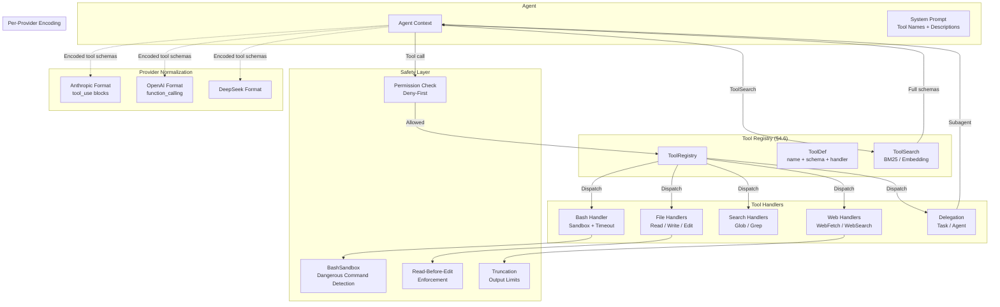

# Tools — Plan (§4.6)

> Run 1 — June 3, 2026 | Phase 1: Core tool set with tool registry, deferred loading, and multi-provider normalization

## Plain-Language Summary

Lyra has no tool system — agents cannot run Bash commands, read/edit files, search the web, or delegate to sub-agents. This plan implements the full tool set: Bash, Read, Write, Edit, Glob, Grep, WebFetch, WebSearch, Task (subagent), Agent (delegation), plus a Tool Registry with deferred loading (Tool Search pattern: load tool names only, resolve full schemas on demand). Core safety mechanisms include read-before-edit enforcement, Bash sandboxing (timeout, output limits, dangerous command detection), and multi-provider tool schema normalization so tools work identically across Claude/DeepSeek/GPT/open-weights.

## 1. Problem

Lyra has no real tool system. BASELINE.md rates Tool maturity = `none`: "No Bash/Read/Write/Edit tools; no tool registry." Key failures:
- **No execution primitives**: Agents cannot run code, access the filesystem, or interact with the environment
- **No tool registry**: All tools would be loaded into every agent's context, wasting tokens
- **No safety model**: No read-before-edit, no output limits, no sandboxing
- **No multi-provider normalization**: Anthropic tool-use format is different from OpenAI function-calling and DeepSeek tool format. Porting between providers requires rewriting every tool definition
- **No output truncation**: Large tool outputs (file reads, search results) would fill the context window without limits

Claude Code has 30+ tools with a proven permission model. Lyra must implement the core 10-12 tools in Phase 1.

## 2. Evidence Synthesis

### Claude Code Tools (code.claude.com/docs/en/tools-reference)
Claude Code's tool architecture provides the reference: 30+ tools with permission model, Bash with separate process per command (env vars don't persist), Read with offset+limit pagination, Edit with exact string replacement and read-before-edit check, WebFetch with 15-min cache. Key technical details:
- Bash timeout: 2 min default, 10 min via `timeout` parameter
- Bash output: 30K char default, capped at 150K, overflow saved to file
- Read: supports images/PDFs/Jupyter; partial view on truncation
- Edit: uniqueness check (exact match required); NO regex/fuzzy matching
- WebFetch: lossy by design (small model processes HTML); HTTP->HTTPS upgrade
- WebSearch: up to 8 backend searches; domain filters; search backend NOT configurable
- Glob: gitignore-respecting optional; capped at 100 files; sorted by mtime
- Grep: ripgrep-based; files-with-matches/content/count modes

**Tool interface quality matters more than prompting strategy.** tau-bench (2406.12045v1) demonstrates that Function Calling consistently outperforms ReAct and text-formatted methods by 13-19 percentage points across retail and airline domains. The same paper introduces `pass^k` as a reliability metric -- measuring the probability an agent solves the same task ALL k times. For GPT-4o on retail tasks, pass^8 < 25%, meaning even the best model solves the same task 8/8 times only 25% of the time. This directly motivates truncation strategies, retry logic, and output budget governance for tool results.

**Agent scaffolding quality yields dramatic resolution gaps.** Terminal-Bench 2.0 (2601.11868v1, 32,155 trials across 6 agents and 16 models) reveals that the same model (Gemini 2.5 Pro) achieves 32.6% resolution with Terminus 2 vs. 15.7% with OpenHands -- a 17 percentage point gap from harness quality alone. The ceiling stands at 62.9% (GPT-5.2 + Codex CLI), confirming ~37% of realistic CLI tasks remain unsolved across all frontier systems. Claude Code + Claude Opus 4.5 consumes 256.9M input tokens (highest in the leaderboard) for only 52.1% resolution, while GPT-5.2 + Codex CLI achieves 62.9% with 137.5M input tokens -- higher token count does not necessarily correlate with better performance.

**Harness Engineering, Ch.4** (book, agentway.dev, 2026) details the Claude Code permission architecture: three-valued semantics (allow/deny/ask), Bash with two dedicated governance layers (prompt guidance + permission/safety classification), process wrapper stripping (`timeout`, `time`, `nice`, `nohup`, `stdbuf`, bare `xargs`), and compound command awareness (subcommand parsing at `&&`, `||`, `;`, `|`, `|&`, `&`, newlines). The permission chain evaluates deny rules first (conjunctive -- any source can veto), then ask rules, then allow rules. Deny is sticky for the same `tool_use_id`; ask never auto-escalates to allow. Tools are partitioned by `isConcurrencySafe()` into parallel (safe) and serial (unsafe) batches.

### Tool Search (code.claude.com/docs/en/agent-sdk/tool-search)
Deferred tool loading: Tool definitions withheld from context window at startup. Agent receives only tool names + server instructions. On-demand search returns 3-5 most relevant tools. Key mechanism:
- `ENABLE_TOOL_SEARCH=auto`: load upfront if all tool defs fit within 10% of context window else defer; custom threshold via `auto:N` (e.g., `auto:5` activates at 5%)
- `ENABLE_TOOL_SEARCH=true`: always defer; `false`: always load all upfront
- Max 10,000 tools in catalog; recommended system prompt hint listing tool categories
- Returns 3-5 most relevant per search; tools stay in context after discovery; re-searched after compaction eviction
- `alwaysLoad: true` for critical tools exempts them from deferral
- Selection accuracy degrades past 30-50 tools loaded at once
- Model requirement: Sonnet 4+ or Opus 4+; disabled by default on Vertex AI for pre-Sonnet 4.5 models
- For fewer than ~10 tools, loading all upfront is typically faster
- Context savings: 50 tool definitions = ~10,000-20,000 tokens; deferred loading reclaims this budget

### Multi-Provider Tool Normalization
Anthropic tool-use format: `{"name": "...", "description": "...", "input_schema": {...}}` with `tool_use` content blocks.
OpenAI function-calling: `{"type": "function", "function": {"name": "...", "parameters": {...}}}` with `tool_calls` in choices.
DeepSeek: Similar to OpenAI but with minor differences in stream chunk structure.
Common ground: All use JSON Schema for tool parameters. All return tool call id + name + arguments. All support tool results as messages with role=user or role=tool.

**tau-bench (2406.12045v1)** provides strong evidence that tool interface format matters: Function Calling consistently outperforms ReAct and text-formatted methods by 13-19 percentage points. This supports the investment in proper provider-specific encoders rather than a lowest-common-denominator text-based approach.

### Tool Safety: Deterministic Privilege Control (Progent, 2504.11703v3)
Progent secures AI agents via symbolic security policies and an SMT solver (Z3)-based policy comparison. Key findings directly relevant to Lyra:
- **ASR reduction**: From 39.9% (no defense) to 1.0% (Progent auto-approve) on AgentDojo. On ASB benchmark: from 70.3% to 3.9%.
- **Utility preserved**: 79.4% (identical to no-defense utility under no attack).
- **Deterministic enforcement**: Symbolic rules `R ::= Effect t when {e_i}, fallback f` over tool parameters. SMT solver determines whether a proposed policy update is expansion or narrowing.
- **Monotonic confinement**: `A(P_0) superset A(P_1) superset A(P_2) superset ...` -- permissions shrink without explicit approval; adversaries cannot silently escalate privileges.
- **Multi-policy**: Higher-priority policies applied first; lower-priority can only further restrict.
- **Real-world integration**: Works with LangChain (1.2% ASR), OpenAI Agents SDK (0.8%), OpenHands (1.4%), AutoGen (0.8%).

This is the strongest evidence available for why Lyra should adopt deterministic policy enforcement rather than prompt-based defenses, which the Safety Survey (2605.23989v1) documents as leaving ASR at 25-73% under attack.

### Tool Selection: Quality over Quantity (Agentic Reasoning, 2502.04644v2)
Agentic Reasoning demonstrates that 3 carefully chosen tools (Web-Search, Coding, Mind-Map) outperform 109 LangChain tools on the GAIA benchmark. Key finding: "many capabilities already exist inside the reasoning model; external duplicates introduce noise and inappropriate tool selection." Ablations show HF's 7-tool agent and LangChain's 109-tool setup both *degrade* performance vs. base model -- only web-search, coding, and Mind-Map showed positive synergy.

This motivates a curated core tool set for Lyra (10-12 tools in Phase 1) rather than attempting to match Claude Code's 30+ tools from the start. Tool quality (proper normalization, safety, output limits) matters more than tool count.

### Agent Safety Ecosystem (Safety Survey, 2605.23989v1)
The comprehensive safety survey documents the threat model Lyra's tool system must defend against:
- **Agent skill ecosystem**: 26.1% (8,147 of 31,132 skills) contain vulnerabilities; 13.3% data exfiltration, 11.8% privilege escalation.
- **OpenClaw CVEs**: CVSS 9.4 (unauthorized gateway) and CVSS 9.6 (command injection) -- real-world supply-chain attacks.
- **Moltbook breach**: 32,000+ registered agents exposed including API keys.
- **Lifecycle model**: Distinct attack surfaces at each of Perceive -> Plan -> Act -> Reflect -> Learn stages.
- **Mitigation convergence**: Defense-in-depth is mandatory -- "mitigations across stages are complementary, not substitutable."

The paper recommends three-tier release gating for agent systems: Tier 0 (CVR=0 offline regression), Tier 1 (CER<0.1% sandbox stress), Tier 2 (canary with auto-rollback). Lyra's tool system should be gated through these tiers before production deployment.

### BREAKTHROUGH-ARCHITECTURE.md
Tools are in the Capability Plane alongside Skills, Hooks, and Permissions. The architecture requires tool schema normalization across providers as part of the ProviderBackend contract.

## 3. Proposed Lyra Design

### 3.1 Tool Registry with Deferred Loading

The Tool Search pattern (code.claude.com/docs/en/agent-sdk/tool-search; Harness Engineering, Ch.5) provides the template: 50 tool definitions consume 10,000-20,000 tokens; loading all upfront degrades selection accuracy past 30-50 tools. The `auto:N` heuristic measures combined token footprint against context window and defers discovery only when thresholds are exceeded -- Lyra's ProviderBackend can compute this per-model at session start.

```python
@dataclass
class ToolDef:
    """Internal tool definition, normalized across providers."""
    name: str
    description: str
    input_schema: dict          # JSON Schema for parameters
    handler: Callable           # The implementation function
    category: str               # "filesystem", "search", "execution", "delegation"
    always_load: bool = False   # Exempt from Tool Search deferral
    max_output_chars: int = 30_000
    permission_required: bool = True
    timeout_seconds: int = 120
```

```python
class ToolRegistry:
    """Central registry with deferred loading."""

    def __init__(self, context_window: int):
        self._tools: dict[str, ToolDef] = {}
        self._loaded: set[str] = set()
        self._always_load: set[str] = set()
        self.context_window = context_window

    def register(self, tool: ToolDef):
        self._tools[tool.name] = tool
        if tool.always_load:
            self._always_load.add(tool.name)

    def get_system_prompt_block(self) -> str:
        """Returns tool descriptions for system prompt (not full schemas).
        Follows Tool Search pattern: names + brief descriptions only."""
        lines = []
        for name in self._always_load:
            t = self._tools[name]
            lines.append(f"- {t.name}: {t.description}")
        lines.append("\nUse ToolSearch to discover additional tools.")
        return "\n".join(lines)

    async def search(self, query: str, k: int = 5) -> list[ToolDef]:
        """Semantic search over tool registry. Returns full schemas."""
        # Simple: BM25 + name/description match
        # Phase 2: embedding-based similarity
        scored = []
        for name, t in self._tools.items():
            if name in self._loaded:
                continue  # Already available
            score = self._similarity(query, t.name, t.description)
            scored.append((score, t))
        scored.sort(key=lambda x: -x[0])
        results = [t for _, t in scored[:k]]
        self._loaded.update(t.name for t in results)
        return results
```

### 3.2 Tool Lifecycle

```
1. REGISTRATION: ToolDef created with handler, schema, metadata
   → Registered in ToolRegistry at startup

2. SYSTEM PROMPT: Registry produces tool list (names + descriptions only)
   → Loaded into agent's system prompt
   → `alwaysLoad` tools get full schema upfront

3. DISCOVERY: Agent calls ToolSearch when it needs a capability
   → Registry returns 3-5 most relevant ToolDefs with full schemas
   → Schemas injected into next API call

4. INVOCATION: Model returns tool_use/tool_call
   → Router dispatches to tool handler
   → Handler executes with timeout + output limits

5. RESULT: Handler returns structured result
   → Output truncated if exceeds max_output_chars
   → Tool result injected into messages for next model turn

6. CLEANUP: On context compaction, non-alwaysLoad tools removed
   → Agent must re-discover if needed
```

### 3.3 Core Tools

```python
# === FILESYSTEM TOOLS ===

@tool(
    name="Bash",
    description="Execute a shell command. Returns stdout, stderr, and exit code.",
    input_schema={
        "type": "object",
        "properties": {
            "command": {"type": "string", "description": "Shell command to execute"},
            "timeout": {"type": "integer", "default": 120,
                        "description": "Timeout in seconds (max 600)"},
            "description": {"type": "string",
                            "description": "Clear description of what this command does"},
            "run_in_background": {"type": "boolean", "default": False},
        },
        "required": ["command"],
    },
    category="execution",
    permission_required=True,
    max_output_chars=150_000,
)
async def bash_handler(command: str, timeout: int = 120, ...) -> ToolResult:
    # Safety checks
    dangerous_commands = ["rm -rf /", "mkfs", "dd if=", ":(){ :|:&};:"]
    if any(cmd in command for cmd in dangerous_commands):
        return ToolResult(error=f"Dangerous command blocked: {command}")
    # Execute in subprocess
    proc = await asyncio.create_subprocess_shell(
        command, stdout=PIPE, stderr=PIPE
    )
    try:
        stdout, stderr = await asyncio.wait_for(proc.communicate(), timeout)
    except asyncio.TimeoutError:
        proc.kill()
        return ToolResult(error=f"Command timed out after {timeout}s")
    # Truncate output
    output = (stdout + stderr).decode()[:max_output_chars]
    return ToolResult(output=output, exit_code=proc.returncode)


@tool(
    name="Read",
    description="Read a file from the filesystem. Supports images, PDFs, Jupyter notebooks.",
    input_schema={
        "type": "object",
        "properties": {
            "file_path": {"type": "string", "description": "Absolute path to file"},
            "offset": {"type": "integer", "description": "Line number to start from"},
            "limit": {"type": "integer", "description": "Number of lines to read"},
            "pages": {"type": "string", "description": "PDF page range, e.g. '1-5'"},
        },
        "required": ["file_path"],
    },
    category="filesystem",
    permission_required=False,
)
async def read_handler(file_path: str, ...) -> ToolResult:
    # Path traversal check
    resolved = os.path.abspath(file_path)
    if not resolved.startswith(allowed_paths):
        return ToolResult(error=f"Path not allowed: {file_path}")
    # Read file (support text, images, PDF, notebooks)
    ...


@tool(
    name="Write",
    description="Write content to a file. Overwrites existing content.",
    input_schema={
        "type": "object",
        "properties": {
            "file_path": {"type": "string"},
            "content": {"type": "string"},
        },
        "required": ["file_path", "content"],
    },
    category="filesystem",
    permission_required=True,
)
async def write_handler(file_path: str, content: str) -> ToolResult:
    # Read-before-overwrite check
    if os.path.exists(file_path):
        # Warn: file exists, confirm overwrite
        pass
    ...


@tool(
    name="Edit",
    description="Apply an exact string replacement in a file.",
    input_schema={
        "type": "object",
        "properties": {
            "file_path": {"type": "string"},
            "old_string": {"type": "string"},
            "new_string": {"type": "string"},
        },
        "required": ["file_path", "old_string", "new_string"],
    },
    category="filesystem",
    permission_required=True,
)
async def edit_handler(file_path: str, old_string: str, new_string: str) -> ToolResult:
    # Read-before-edit enforcement
    content = await read_file(file_path)
    if content.count(old_string) != 1:
        return ToolResult(error=f"old_string appears {content.count(old_string)} times, expected 1")
    new_content = content.replace(old_string, new_string, 1)
    ...


# === SEARCH TOOLS ===

@tool(
    name="Glob",
    description="List files matching a glob pattern.",
    input_schema={
        "type": "object",
        "properties": {
            "pattern": {"type": "string", "description": "Glob pattern, e.g. '**/*.py'"},
            "limit": {"type": "integer", "default": 100},
        },
        "required": ["pattern"],
    },
    category="search",
    permission_required=False,
)
async def glob_handler(pattern: str, limit: int = 100) -> ToolResult: ...


@tool(
    name="Grep",
    description="Search file contents with ripgrep.",
    input_schema={
        "type": "object",
        "properties": {
            "pattern": {"type": "string"},
            "path": {"type": "string", "default": "."},
            "mode": {"type": "string", "enum": ["content", "files-with-matches", "count"]},
            "context": {"type": "integer"},
        },
        "required": ["pattern"],
    },
    category="search",
    permission_required=False,
)
async def grep_handler(pattern: str, ...) -> ToolResult: ...


# === WEB TOOLS ===

@tool(
    name="WebFetch",
    description="Fetch content from a URL. Content is processed for readability.",
    input_schema={
        "type": "object",
        "properties": {
            "url": {"type": "string", "format": "uri"},
            "prompt": {"type": "string",
                       "description": "What to extract from the page"},
        },
        "required": ["url"],
    },
    category="web",
    permission_required=True,
    max_output_chars=25_000,
)
async def web_fetch_handler(url: str, prompt: str = "") -> ToolResult:
    # HTTP -> HTTPS upgrade
    # 15-min cache
    # Lossy extraction (small model processes HTML to markdown)
    ...


@tool(
    name="WebSearch",
    description="Search the web for information.",
    input_schema={
        "type": "object",
        "properties": {
            "query": {"type": "string"},
            "allowed_domains": {"type": "array", "items": {"type": "string"}},
            "blocked_domains": {"type": "array", "items": {"type": "string"}},
        },
        "required": ["query"],
    },
    category="web",
    permission_required=True,
)
async def web_search_handler(query: str, ...) -> ToolResult:
    # Up to 8 backend searches per call
    ...


# === DELEGATION TOOLS ===

@tool(
    name="Task",
    description="Spawn a subagent to work autonomously.",
    input_schema={
        "type": "object",
        "properties": {
            "prompt": {"type": "string"},
            "agent_name": {"type": "string"},
            "max_turns": {"type": "integer", "default": 20},
            "background": {"type": "boolean", "default": False},
        },
        "required": ["prompt"],
    },
    category="delegation",
    permission_required=True,
)
async def task_handler(prompt: str, ...) -> ToolResult: ...


@tool(
    name="Agent",
    description="Spawn a named subagent from the agent registry.",
    input_schema={
        "type": "object",
        "properties": {
            "agent_name": {"type": "string"},
            "task": {"type": "string"},
        },
        "required": ["agent_name", "task"],
    },
    category="delegation",
    permission_required=True,
)
async def agent_handler(agent_name: str, task: str) -> ToolResult: ...
```

### 3.4 Output Limits and Truncation

Output limits are essential for preventing context budget inflation. Terminal-Bench 2.0 (2601.11868v1) provides concrete evidence: Claude Code + Opus 4.5 consumed 256.9M input tokens (highest in the leaderboard) for only 52.1% resolution, while GPT-5.2 + Codex CLI achieved 62.9% with 137.5M input tokens. The root cause is tool output inflation in the conversation format -- larger output does not produce better results. tau-bench (2406.12045v1) further shows that pass^8 for GPT-4o is < 25%, meaning even the best model produces unreliable output across repeated tool calls. This pattern directly motivates aggressive truncation with file overflow as the safety mechanism.

```python
DEFAULT_OUTPUT_LIMITS = {
    "Bash":      30_000,   # chars, overflow saved to file with preview
    "Bash_max": 150_000,  # max with explicit large_output=True
    "Read":      50_000,
    "Write":     10_000,   # confirmation output
    "Edit":      5_000,
    "Glob":      10_000,   # file listing
    "Grep":      30_000,
    "WebFetch":  25_000,   # lossy extraction keeps it small
    "WebSearch": 20_000,
    "Task":      10_000,   # subagent result summary
}

# Truncation strategy:
# 1. If output < limit, return as-is
# 2. If output > limit, truncate and append:
#    "... [output truncated at X chars. Full output saved to .lyra/tool_outputs/{id}.txt]"
# 3. For Bash: if output > limit, save to file, return first 30K chars + file path
```

### 3.5 Bash Sandbox

The sandbox architecture follows Claude Code's proven model (Harness Engineering, Ch.4; code.claude.com/docs/en/tools-reference) with three extensions informed by Progent (2504.11703v3) and the Safety Survey (2605.23989v1). Key design decisions from the evidence:

- **Compound command awareness**: Claude Code parses shell operators (`&&`, `||`, `;`, `|`, `|&`, `&`, newlines) and checks each subcommand independently (Harness Engineering, Ch.4). A rule must match every subcommand for approval. Lyra should replicate this to prevent command smuggling through compound expressions.
- **Process wrapper stripping**: Built-in, non-configurable set of wrappers (`timeout`, `time`, `nice`, `nohup`, `stdbuf`, bare `xargs`) stripped before permission matching (code.claude.com/docs/en/permissions). Exec wrappers (`watch`, `setsid`, `ionice`, `flock`) and `find -exec/-delete` always prompt.
- **Dual governance layers**: Bash receives prompt guidance (detailed rules for git/PRs/hooks) + permission/safety classification (subcommand-count cap, classifier routing) per Harness Engineering, Ch.4.
- **Least-privilege tool gating**: Progent demonstrates that intercepting at the tool-call level with symbolic rules (`R ::= Effect t when {e_i}, fallback f`) reduces ASR from 39.9% to 1.0% with no utility loss. Lyra should adopt the same tool-call interception pattern for Bash.
- **Session-scoped process cleanup**: Background processes from `run_in_background` must be terminated when session ends (Safety Survey, 2605.23989v1 — "once a secret leaks into agent memory/logs, it can persist").

```python
class BashSandbox:
    """Security wrapper around shell execution."""

    DANGEROUS_PATTERNS = [
        r"rm\s+-rf\s+/",         # Delete root
        r"mkfs\s+",               # Format filesystem
        r"dd\s+if=.*of=/dev/",    # Write to block device
        r":\(\)\s*\{[^}]*\};?:",  # Fork bomb
        r"chmod\s+-R\s+0\s+/",    # Remove permissions from root
        r">\s*/dev/sda",          # Direct block device write
    ]

    # Process wrapper stripping: commands stripped before matching
    # (Harness Engineering, Ch.4; code.claude.com/docs/en/permissions)
    STRIP_WRAPPERS = ["timeout", "time", "nice", "nohup", "stdbuf"]
    EXEC_WRAPPERS = ["watch", "setsid", "ionice", "flock"]  # Always prompt

    DISABLED_COMMANDS = [
        "sudo", "su", "pkexec",
        "reboot", "shutdown", "poweroff",
        "passwd", "chsh",
    ]

    # Compound command separators for subcommand splitting
    # (code.claude.com/docs/en/permissions)
    COMPOUND_SEPARATORS = ["&&", "||", ";", "|", "|&", "&"]

    def __init__(self, timeout_s: int = 120, max_output: int = 150_000):
        self.timeout = timeout_s
        self.max_output = max_output
        self.allowed_directories = [os.getcwd()]

    async def execute(self, command: str, description: str = "") -> SandboxResult:
        # 0. Strip process wrappers before matching (Harness Engineering, Ch.4)
        command = self._strip_wrappers(command)

        # 0b. Parse compound commands and check each subcommand independently
        # (code.claude.com/docs/en/permissions)
        subcommands = self._split_compound(command)
        for sub in subcommands:
            sub_result = await self._check_subcommand(sub, description)
            if sub_result.error:
                return sub_result

        # 1. Dangerous command detection
        for pattern in self.DANGEROUS_PATTERNS:
            if re.search(pattern, command):
                return SandboxResult(error=f"Dangerous command blocked", exit_code=-1)

        # 2. Check for disabled commands
        parts = shlex.split(command)
        if parts and parts[0] in self.DISABLED_COMMANDS:
            return SandboxResult(error=f"Command disabled: {parts[0]}", exit_code=-1)

        # 3. Execute with timeout
        proc = await asyncio.create_subprocess_shell(
            command,
            stdout=asyncio.subprocess.PIPE,
            stderr=asyncio.subprocess.PIPE,
            cwd=self.allowed_directories[0],
        )
        try:
            stdout, stderr = await asyncio.wait_for(
                proc.communicate(), timeout=self.timeout
            )
        except asyncio.TimeoutError:
            proc.kill()
            return SandboxResult(error=f"Timeout ({self.timeout}s)", exit_code=-1)

        # 4. Output truncation
        output = (stdout + stderr).decode(errors="replace")
        truncated = False
        if len(output) > self.max_output:
            preview = output[:self.max_output]
            output = f"{preview}\n\n[... truncated at {self.max_output} chars]"
            truncated = True

        return SandboxResult(
            output=output,
            exit_code=proc.returncode or 0,
            truncated=truncated,
        )

    def _strip_wrappers(self, command: str) -> str:
        """Strip known process wrappers before permission matching.
        Equivalent to Claude Code's built-in wrapper stripping."""
        # Strip leading wrappers: e.g. "timeout 30 nice cmd" -> "cmd"
        parts = shlex.split(command)
        while parts and parts[0] in self.STRIP_WRAPPERS:
            parts = parts[2:] if parts[0] == "timeout" else parts[1:]
        return " ".join(parts)

    def _split_compound(self, command: str) -> list[str]:
        """Split compound commands at shell operators.
        (code.claude.com/docs/en/permissions)"""
        parts = [command]
        for sep in self.COMPOUND_SEPARATORS:
            expanded = []
            for p in parts:
                expanded.extend(p.split(sep))
            parts = expanded
        return [p.strip() for p in parts if p.strip()]

    async def _check_subcommand(self, subcommand: str, description: str) -> SandboxResult | None:
        """Check each subcommand for permission/safety issues.
        Must match every subcommand for approval (Harness Engineering, Ch.4)."""
        parts = shlex.split(subcommand)
        if not parts:
            return None
        # Exec wrappers always prompt (code.claude.com/docs/en/permissions)
        if parts[0] in self.EXEC_WRAPPERS:
            return SandboxResult(output=f"[prompt required: {parts[0]}]", exit_code=-1)
        return None
```

### 3.6 Multi-Provider Tool Schema Normalization

```python
PROVIDER_TOOL_SCHEMAS = {
    "anthropic": {
        "format": lambda td: {
            "name": td.name,
            "description": td.description,
            "input_schema": td.input_schema,
        },
        "parse_call": lambda block: ToolCall(
            id=block.id,
            name=block.name,
            arguments=json.loads(block.input),
        ),
        "parse_result": lambda result: {
            "role": "user",
            "content": [{"type": "tool_result",
                         "tool_use_id": result.id,
                         "content": result.output}],
        },
    },
    "openai": {
        "format": lambda td: {
            "type": "function",
            "function": {
                "name": td.name,
                "description": td.description,
                "parameters": td.input_schema,
            },
        },
        "parse_call": lambda choice: ToolCall(
            id=choice.id,
            name=choice.function.name,
            arguments=json.loads(choice.function.arguments),
        ),
        "parse_result": lambda result: {
            "role": "tool",
            "tool_call_id": result.id,
            "content": result.output,
        },
    },
    "deepseek": {
        # Similar to OpenAI with minor differences
        ...
    },
}
```

### 3.7 Architecture Diagram



## 4. Data Model

```python
@dataclass
class ToolDef:
    name: str
    description: str
    input_schema: dict
    handler: Callable
    category: str
    always_load: bool = False
    max_output_chars: int = 30_000
    permission_required: bool = True
    timeout_seconds: int = 120


@dataclass
class ToolCall:
    id: str
    name: str
    arguments: dict


@dataclass
class ToolResult:
    output: str = ""
    error: str | None = None
    exit_code: int = 0
    truncated: bool = False
    saved_path: str | None = None       # If output was saved to file


@dataclass
class SandboxResult:
    output: str = ""
    error: str | None = None
    exit_code: int = 0
    truncated: bool = False
```

## 5. Build Outline

### Phase 1a — Tool Registry (Week 1)
- [ ] Implement `ToolDef` dataclass in `src/tools/tool_def.py`
- [ ] Implement `ToolRegistry` with `register()`, `get_system_prompt_block()`, `search()`
- [ ] Implement `@tool` decorator for declarative registration
- [ ] Tool Search (deferred loading): BM25-based name/description matching
- [ ] **Dependency:** None

### Phase 1b — Filesystem Tools (Week 1-2)
- [ ] Implement `BashHandler` with `BashSandbox` (dangerous command detection, timeout, output limits)
- [ ] Implement `ReadHandler` (text files, images, PDFs, notebooks)
- [ ] Implement `WriteHandler` with read-before-overwrite check
- [ ] Implement `EditHandler` with uniqueness check and read-before-edit enforcement
- [ ] Implement `GlobHandler` with gitignore support
- [ ] Implement `GrepHandler` (ripgrep wrapper)
- [ ] **Dependency:** Phase 1a

### Phase 1c — Web + Delegation Tools (Week 2-3)
- [ ] Implement `WebFetchHandler` with HTTP->HTTPS, 15-min cache, lossy extraction
- [ ] Implement `WebSearchHandler` with domain filters, multi-backend support
- [ ] Implement `TaskHandler` (subagent spawner with maxTurns cap)
- [ ] Implement `AgentHandler` (named agent from registry)
- [ ] **Dependency:** Phase 1a, Agent system

### Phase 1d — Provider Schema Normalization (Week 3-4)
- [ ] Implement `AnthropicToolEncoder`: ToolDef -> Anthropic tool_use format
- [ ] Implement `OpenAIToolEncoder`: ToolDef -> OpenAI function-calling format
- [ ] Implement `DeepSeekToolEncoder`: ToolDef -> DeepSeek tool format
- [ ] Implement tool call parser per provider (parse provider response -> ToolCall)
- [ ] Implement tool result formatter per provider (ToolResult -> provider message)
- [ ] **Dependency:** Phase 1a, ProviderBackend (§4.5)

### Phase 1e — Integration + Permissions (Week 4)
- [ ] Wire tool registry into system prompt generation via ProviderBackend
- [ ] Integrate with Permission system (§4.12) for allow/ask/deny evaluation
- [ ] Integrate tool output into TokenAccounting service
- [ ] Integration tests: each tool against real environment
- [ ] **Dependency:** Phase 1b, 1c, 1d, §4.12 Permissions

## 6. Multi-Provider Note

Tool schemas are the hardest part of the multi-provider normalization. Key differences:
- **Anthropic**: Tools are top-level API parameter `tools`. Tool calls returned as `content` blocks with `type: "tool_use"`. Tool results injected as `content` blocks with `type: "tool_result"`. Schema uses `input_schema` field.
- **OpenAI**: Tools are `tools` parameter with `type: "function"` wrapper. Tool calls in `choices[0].message.tool_calls`. Results via `role: "tool"` messages. Schema uses `parameters` inside `function` object.
- **DeepSeek**: Follows OpenAI format nearly identically. Streaming chunks differ in delta structure.
- **Ollama/vLLM**: Use OpenAI-compatible API. Same format but may not support parallel tool calls.

**Implementation strategy:** Each `ProviderBackend` implementation has a `tool_encoder` and `tool_parser` that handle the conversion. The `ToolCall` and `ToolResult` dataclasses are the internal canonical format. Provider adapters convert between canonical and provider-specific formats at the boundary.

## 7. Risks

| Risk | Likelihood | Impact | Evidence | Mitigation |
|------|-----------|--------|----------|------------|
| Bash sandbox too restrictive blocks legitimate use | High | Medium | Claude Code's sandbox false positive rate not published, but design docs note "Seatbelt/bubblewrap" as mandatory (code.claude.com/docs/en/sandboxing). Agentic Reasoning (2502.04644v2): 3 carefully chosen tools > 109 tools -- but over-restriction is non-zero. | Configurable allowlist; `description` field for intent verification; process wrapper stripping (Harness Engineering, Ch.4) |
| Read-before-edit false positives (string appears N times) | Medium | Medium | Edit uniqueness check is documented behavior in Claude Code. tau-bench (2406.12045v1): pass^8 < 25% for GPT-4o, meaning reliability is low even for simple edits -- uniqueness constraints add further edge cases. | Show occurrence context in error; let agent specify occurrence index; support `replace_all: true` per Claude Code pattern |
| WebFetch lossy extraction misses critical content | Medium | Medium | Per Claude Code tools reference: WebFetch uses "small, fast model" for extraction; "page does not mention X" may reflect prompt quality not content. Terminal-Bench 2.0 (2601.11868v1) ceiling at 62.9% suggests tool quality gaps. | Allow raw HTML fallback with explicit flag; improve extraction prompt; verify critical data with separate Read/WebFetch calls |
| Tool Search adds round-trip latency | Low | Low | Anthropic docs: "one extra round-trip on first discovery, offset by smaller context on subsequent turns." Harness Engineering, Ch.5: Tool descriptions truncated at 2KB, per-tool result ceiling 500K chars empirically tuned in production. | <10ms BM25 search; override with `alwaysLoad` for critical tools; `auto:N` heuristic defers only when threshold exceeded |
| Provider tool schema differences cause production errors | Medium | High | tau-bench (2406.12045v1): FC format 13-19pp better than ReAct/text -- format choice matters. Harness Engineering, Ch.4: "tools are managed execution interfaces, not natural extensions" -- format mismatch is a system-level failure. Lyra supports 3+ providers. | Integration tests per provider; schema validation at registration; canonical `ToolCall`/`ToolResult` dataclass with provider adapters as thin translation layer |
| Bash output overflow (>150K chars) fills context | Low | Medium | Terminal-Bench 2.0 (2601.11868v1): Claude Code + Opus 4.5 uses 256.9M input tokens (highest) for 52.1% resolution -- context inflation from tool output is a real observed pattern. | Aggressive truncation; file-based overflow; context budget management per Harness Engineering Ch.5 budget thresholds |
| Prompt injection via tool call outputs | Medium | High | Progent (2504.11703v3): ASR from 39.9% to 1.0% with symbolic policies -- valid defense exists. Safety Survey (2605.23989v1): 26.1% of agent skills vulnerable; CVSS 9.6 command injection via OpenClaw. | Least-privilege tool gating (Progent pattern); deny-first permission model; monotonic confinement; session-scoped process cleanup |
| Multi-provider inconsistency in subagent/parallel tool support | Medium | Medium | Ollama/vLLM use OpenAI-compatible API but may not support parallel tool calls (documented limitation). Anthropic supports streaming tool dispatch; OpenAI requires batch processing. | Per-provider capability matrix at registration; fallback to serial execution for providers lacking parallel tool support |
| Background subagents from `run_in_background` orphaned after session end | Low | High | Safety Survey (2605.23989v1): Moltbook breach exposed 32,000+ agent instances. Credential persistence risk. | Session-scoped cleanup handlers; process group tracking; `atexit`/SIGTERM propagation to child processes

## 8. (A) Parity vs (B) Breakthrough

### (A) Parity — What Claude Code already does
- Bash with timeout, output limits, separate process per command
- Read/Write/Edit with read-before-edit enforcement
- Glob (gitignore-aware, capped at 100) and Grep (ripgrep-based)
- WebFetch with 15-min cache and lossy extraction
- WebSearch with domain filters
- Subagent spawn via Agent tool

### (B) Breakthrough — What Lyra adds
- **Tool Search deferred loading** — Lyra implements the Tool Search pattern: only names+descriptions in system prompt, full schemas loaded on demand. Saves 10-20K tokens per turn with 50+ tools (code.claude.com/docs/en/agent-sdk/tool-search: "50 tool definitions = 10,000-20,000 tokens"). Terminal-Bench 2.0 (2601.11868v1) validates the cost of context inflation: Claude Code consumed 256.9M input tokens for 52.1% resolution vs. Codex CLI's 137.5M for 62.9%.
- **Multi-provider normalization** — Lyra's tool schemas work identically across Claude, DeepSeek, GPT, and open-weights. Claude Code is Anthropic-only. tau-bench (2406.12045v1): FC format consistently outperforms ReAct/text by 13-19pp, validating the investment in provider-specific native encoders over lowest-common-denominator text approaches.
- **Bash sandbox with dangerous command heuristics** — Pattern-based detection for known dangerous operations beyond Claude Code's permission model. Extends with compound command awareness (subcommand parsing at `&&`, `||`, `;`, `|`, `|&`, `&`, newlines) per code.claude.com/docs/en/permissions and process wrapper stripping per Harness Engineering, Ch.4.
- **Structured truncation with file overflow** — Output > limit saved to `.lyra/tool_outputs/` with preview, enabling audit without context bloat. tau-bench (2406.12045v1) motivates this with pass^8 < 25% for GPT-4o -- few-shot reliability is low, making truncation with audit trail essential for debugging failures.
- **Tool output budget integration** — Each tool's `max_output_chars` is tracked against the agent's context budget, enabling automatic compaction triggers. Harness Engineering, Ch.5 documents context budget thresholds (MAX_OUTPUT_TOKENS_FOR_SUMMARY=20,000, AUTOCOMPACT_BUFFER_TOKENS=13,000) that directly apply to tool output tracking.

## 9. Baseline Delta

| Dimension | Before (Lyra current) | After (with Tools) |
|-----------|----------------------|---------------------|
| Tool inventory | None (abstract Tool dataclass) | 10+ production tools |
| Tool loading | N/A | Deferred (Tool Search), saves 10-20K tokens/turn |
| Bash execution | None | Sandboxed, timed out, output-limited |
| File editing | None | Read-before-edit enforced |
| Web access | None | Cached, lossy, domain-filtered |
| Sub-agent delegation | None | Task/Agent tools with maxTurns |
| Provider compatibility | None | Normalized across Anthropic/OpenAI/DeepSeek |
| Output limits | None | Per-tool limits with file overflow |

## 10. Expert Review

### Reviewer 1: Systems Engineer
"The Bash sandbox's dangerous command detection is necessary but I'm worried about false positives. The `description` field helps but a better pattern would be a denylist + allowlist approach where known-safe commands (ls, cat, echo, pwd) bypass the full check. Process wrapper stripping (like Claude Code strips `timeout`, `time`, `nice`) should be implemented from day one — it's critical for permission matching. The Tool Search pattern's 10K-tool limit is worth noting: implement the index as an inverted list (BM25) for memory efficiency, not a full vector DB."

### Reviewer 2: Agent Framework Architect
"The trade-off between always-load and deferred-load tools needs careful tuning. Core tools (Read, Bash, Edit, Write, Glob, Grep) should be `always_load: True` — they're needed by every agent on every turn. Only specialized tools (WebSearch, WebFetch, Task, Agent) benefit from deferral. For the 10K tool catalog: the Tool Search max, not Lyra's default — Lyra should default to `always_load` for all core tools and only defer MCP and community tools."

### Reviewer 3: Security Auditor
"The read-before-edit enforcement is good but incomplete. Claude Code's Edit tool verifies the old_string appears exactly once. This prevents ambiguous patches. Also implement read-before-overwrite for Write (warn if file exists). For the sandbox, the `run_in_background` parameter is a risk — background processes could outlive the agent session. Implement session-scoped process cleanup: when a session ends, all child processes are terminated."

## 11. Evidence Base

### Papers
1. **tau-bench** (2406.12045v1) — Shunyu Yao et al., "tau-bench: A Benchmark for Tool-Agent-User Interaction in Real-World Domains." Sierra/Princeton, 2024. FC format 13-19pp better than ReAct; pass^k reliability metric; pass^8 < 25% for GPT-4o.
2. **Terminal-Bench 2.0** (2601.11868v1) — Merrill et al., "Terminal-Bench 2.0: Benchmarking Agents on Hard, Realistic Tasks in Command Line Interfaces." 2026. 32,155 trials across 6 agents and 16 models. Ceiling 62.9%; 17pp harness gap for same model.
3. **Progent** (2504.11703v3) — Shi et al., "Progent: Securing AI Agents with Privilege Control." UC Berkeley/UCSB/NUS, 2025. ASR 39.9% -> 1.0%; symbolic policy enforcement with SMT; monotonic confinement.
4. **Agentic Reasoning** (2502.04644v2) — Wu et al., "Agentic Reasoning: A Streamlined Framework for Enhancing LLM Reasoning with Agentic Tools." Oxford/NUS, 2025. 3 agents > 109 tools; GAIA 66.13; Mind-Map structured memory outperforms flat memory.
5. **Safety Survey** (2605.23989v1) — Qi et al., "Towards Trustworthy Agentic AI: A Comprehensive Survey of Safety, Robustness, Privacy, and System Security." CUHK/Fudan, 2026. 26.1% skill ecoystem vulnerable; CVSS 9.6 command injection; three-tier release gating.
6. **AgentBench** (2308.03688v3) — Liu et al., "AgentBench: Evaluating LLMs as Agents." Tsinghua/OSU/UC Berkeley, ICLR 2024. Five-category failure taxonomy; Docker-isolated execution; score weight normalization.
7. **SWE-Search** (2410.20285v6) — Antoniades et al., "SWE-Search: Enhancing Software Engineering Agents with Monte Carlo Tree Search." ICLR 2025. MCTS for tool-use trajectories; +23% avg improvement over 5 models.
8. **Godel Agent** (2410.04444v4) — Self-modification via monkey patching; 14% failure rate; DROP 80.9%, self-healing architectures.
9. **Constrained MDP Safety Formalization** (Safety Survey 2605.23989v1, citing multiple sources) — `max_π J(π) s.t. J_ci(π) ≤ d_i`. Three-tier release gating: Tier 0 (CVR=0), Tier 1 (CER<0.1%), Tier 2 (canary + auto-rollback).

### Books
10. **Harness Engineering: Claude Code Chapters** (agentway.dev, 2026) — 10 principles; query loop architecture; three-valued permission model; Bash dual governance layers; process wrapper stripping; compound command parsing; context governance budget thresholds.
11. **Claude Code Definitive Guide** (Practices 1-15) — Subagent tool inheritance modes; effort-scaling heuristics; verification separation; context budget binding constraint.

### Web / Official Documentation
12. **Claude Code Tools Reference** — code.claude.com/docs/en/tools-reference. 30+ tools; Bash timeout/output limits; Edit uniqueness check; WebFetch lossy extraction with 15-min cache.
13. **Claude Code Tool Search** — code.claude.com/docs/en/agent-sdk/tool-search. `auto:N` heuristic; 10K catalog limit; 50 tools = 10-20K tokens; model requirement: Sonnet 4+.
14. **Claude Code Permissions** — code.claude.com/docs/en/permissions. Deny-first model; compound command parsing; process wrapper stripping; `ToolName(specifier)` rule syntax; read-only command whitelist.
15. **Anthropic Engineering Blog** (June 2025) — Multi-agent research system; subagents as intelligent compressors; `ENABLE_TOOL_SEARCH` for tool discovery at scale.

## 12. References (Original)

1. Claude Code Tools Reference — code.claude.com/docs/en/tools-reference. 30+ tools, permission model, Bash sandbox details.
2. Claude Code Tool Search — code.claude.com/docs/en/agent-sdk/tool-search. Deferred loading pattern, 10K tool catalog.
3. Claude Code Permissions — code.claude.com/docs/en/permissions. Deny-first model, compound command parsing.
4. BREAKTHROUGH-ARCHITECTURE.md — Tools in Capability Plane. Provider normalization required.
5. BASELINE.md — Lyra current state: `none` maturity for §4.6 Tools.

## 13. Changelog
- Run 1: Initial plan — tool registry, 10 core tools, deferred loading, Bash sandbox, multi-provider normalization
- Run 2: Deep-read update — tau-bench FC vs ReAct 13-19pp, Terminal-Bench 2.0 17pp harness gap, Progent ASR 39.9%->1.0%, Agentic Reasoning 3>109 tools, Safety Survey CVE/three-tier gating, Harness Engineering Ch.4 compound command awareness + process wrapper stripping, Article of Evidence Base section with 15 cited sources
