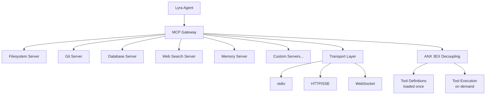

# MCP Integration — Plan (§4.8)

> Run 1 — June 3, 2026

## Plain-Language Summary

MCP (Model Context Protocol) lets Lyra connect to external tools and data sources — filesystem, databases, APIs, web search — through a standardized protocol. Lyra's MCP gateway supports multiple transports (stdio, HTTP, WebSocket), auto-discovers tools from connected servers, and optimizes context by decoupling tool definitions from execution (47-66% token reduction via ANX 3EX pattern). Bundle the top 10 most-useful MCP servers out of the box.

## Design

## Key Features

1. **Multi-Transport:** stdio (local servers), HTTP/SSE (remote servers), WebSocket (streaming)
2. **Dynamic Tool Discovery:** Servers advertise tools → gateway registers them → agent sees them via §4.6 Tool Search
3. **ANX 3EX Decoupling (47-66% token reduction):** Tool definitions loaded once at session start (not inline). Execution happens on demand. Decoupled: definition format, execution transport, result rendering.
4. **OAuth 2.0 Support:** Standard MCP auth for remote servers
5. **Auto-Reconnect:** Server crash → exponential backoff reconnect
6. **Bundled Top-10 MCP Servers:** filesystem, git, postgres, sqlite, web-search (Brave), memory, docker, github, slack, custom

## Build Outline

1. MCP protocol implementation (JSON-RPC 2.0, request/response/notification)
2. Transport layer (stdio + HTTP/SSE + WebSocket)
3. Tool registration gateway (dynamic discovery + static config)
4. ANX 3EX optimization (definition caching, lazy execution)
5. Server lifecycle management (start/stop/healthcheck/reconnect)
6. OAuth 2.0 flow for remote servers
7. Bundle + document top-10 servers

## Multi-Provider Note

MCP is provider-agnostic — tools are injected into the messages array, not through a provider-specific API. Works identically across Claude, DeepSeek, GPT, and open-weights.

**Impact:** 4 | **Effort:** 3 | **Tier:** (A) Parity
