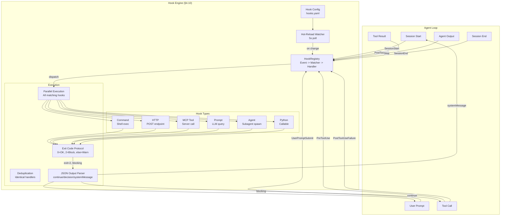

# Hooks — Plan (§4.10)

> Run 1 — June 3, 2026 | Phase 1: Extend from 3 lifecycle events to 25+ with configuration, hot-reload, and provider-agnostic design

## Plain-Language Summary

Lyra's hook engine currently supports 3 lifecycle events (PreToolUse, PostToolUse, Stop) with priority-sorted async execution and critical-hook abort. This plan extends to 25+ lifecycle events across session, turn, and tool-call cadences, adds a hook configuration file format (.lyra/hooks.yaml) with hot-reload support, implements the exit code 2 protocol for blocking hooks (from Claude Code: exit 2 = "stop the agent"), and ensures all hooks are harness-level (provider-agnostic) so they work identically across Claude/DeepSeek/GPT. Hooks are the extensibility spine of Lyra — everything from permissions to verification to logging plugs into the hook system.

## 1. Problem

The current HookEngine supports PreToolUse, PostToolUse, and Stop events. This is insufficient for a production agent harness. Key gaps:
- **Too few events**: No SessionStart, SessionEnd, UserPromptSubmit, PostToolUseFailure, StopFailure — critical lifecycle points for safety and observability
- **No configuration file**: Hooks are registered programmatically. No YAML/JSON config for declarative hook setup
- **No hot-reload**: Changing hooks requires restarting the agent
- **No exit code protocol**: Claude Code supports exit code 2 for blocking hooks (stop the agent). Lyra has no equivalent
- **No matcher system**: Hooks fire on every occurrence. No ability to filter by tool name, provider, or pattern
- **Handler types limited**: Only Python callables. No shell commands, HTTP endpoints, MCP tools, or LLM prompts
- **No deduplication**: Identical handlers can be registered multiple times

Evidence from BASELINE.md: Hooks maturity = `partial`. "HookEngine + HookRegistry (PreToolUse/PostToolUse/Stop); async execution; critical-hook abort."

## 2. Evidence Synthesis

### Claude Code Hooks (§3.1)
The reference architecture: 25+ lifecycle events across three cadences, three-level configuration (Event -> Matcher -> Handler), 5 handler types, exit code protocol, JSON output schema. Key details:
- Once per session: SessionStart, SessionEnd
- Once per turn: UserPromptSubmit, Stop, StopFailure
- Every tool/agent event: PreToolUse, PostToolUse, PostToolUseFailure, PreAgent, PostAgent, etc.
- Matcher patterns: `"*"`/omitted = all, `[A-Za-z0-9_|]` = exact/OR, regex for any other char
- Handler types: command (shell), http (POST), mcp_tool (MCP), prompt (LLM), agent (subagent)
- Exit code 0 = success, stdout parsed; 2 = blocking error; other = non-blocking error
- JSON output fields: continue, stopReason, suppressOutput, systemMessage, additionalContext, permissionDecision
- Timeouts: 600s (command/http/mcp), 30s (prompt), 60s (agent); UserPromptSubmit lowered to 30s
- All matching hooks run in parallel; identical handlers deduplicated
- Hot-reloading: most hooks reload without session restart
- Path placeholders: `${CLAUDE_PROJECT_DIR}`, `${CLAUDE_PLUGIN_ROOT}`, `${CLAUDE_PLUGIN_DATA}`
- `if` field: permission rule syntax, only evaluated on PreToolUse/PostToolUse/PermissionRequest/PermissionDenied
- `terminalSequence` allowlist for terminal effects; `additionalContext` >10K chars saved to file

### BREAKTHROUGH-ARCHITECTURE.md
Hooks are in the Capability Plane alongside Tools, Skills, and Permissions. The architecture specifies "25+ lifecycle events" and requires hooks to be provider-agnostic.

### Current Lyra HookEngine (BASELINE.md)
Existing structure:
```python
class HookEngine:
    # PreToolUse, PostToolUse, Stop events
    # Priority-sorted async execution
    # Critical-hook abort: if critical hook raises, execution stops
    # Hook data model: name, enabled, priority, critical, event_type, fn, sources
```

### Harness Engineering: Error Recovery via Layered Hooks
@wquguru's "Harness Engineering: A Design Guide to Claude Code" (Ch. 6, agentway.dev 2026) documents Claude Code's three-layer error recovery protocol that hooks participate in: (1) staged collapse flush, (2) reactive compact with `hasAttemptedReactiveCompact` flag preventing retry loops, (3) surface directly + skip hooks. Specific circuit breakers include `MAX_CONSECUTIVE_AUTOCOMPACT_FAILURES=3`. The same chapter identifies 7 distinct stop-condition paths in Claude Code's `queryLoop()` -- hooks must handle each path. Claude Code's `verification_worker != implementation_worker` invariant (Ch. 7) is enforced through hook-driven verification: a PostToolUse hook dispatches verification to a different agent than the one that produced the tool output. Source: @wquguru, "Harness Engineering," Ch. 6-7.

### Godel Agent: Error Handling Ablation (2410.04444v4)
Yin et al. (Peking Univ./UCSB, 2025) performed controlled ablations on recursive self-improvement agents. Removing error handling drops MGSM accuracy by 14.8% (64.2 -> 49.4). This is the largest single ablation penalty -- larger than removing think-before-acting (-13.4%) or the code execution tool (-7.1%). The implication for hooks: PostToolUseFailure and StopFailure events are not optional niceties. A hook system without failure events loses ~15% of agent reliability. The paper also reports that 92% of optimization trials experience temporary performance drops and 14% fail entirely, underscoring the need for recovery-oriented hooks. Source: Yin et al., 2410.04444v4, Table 3, Section 5.

### Rogue Agents: Uncertainty-Gated Intervention via Hooks (2502.05986v2)
Barbi et al. (Tel Aviv Univ., 2025) demonstrate that monitoring agent output token distributions (entropy, varentropy, kurtosis) via a lightweight polynomial ridge classifier at critical decision points catches hallucination cascades before they propagate. The intervention -- roll back to last checkpoint and re-evaluate -- maps to a PreToolUse hook that computes P(success | features) before allowing irreversible actions (file writes, API calls). Results: +2.5% to +20.0% absolute gains across 4 environments (WhoDunitEnv: +14.4%, GovSim: +20.0%) and 4 models. Critically, 1.4-1.9x turn cost but no additional LLM call -- just an sklearn Ridge classifier on top-k=10 token logits. For Lyra, this means a lightweight PreToolUse hook can serve as an uncertainty gate without introducing LLM latency. Source: Barbi et al., 2502.05986v2, Section 2.1, Section 4.1.

### COMPASS: Asynchronous Meta-Thinker as Strategic Hook (2510.08790v1)
Wan et al. (Google Cloud AI, 2025) propose a three-agent architecture where an asynchronous Meta-Thinker monitors the main agent for looping behavior, tool misuse, and reasoning drift. This is architecturally equivalent to a set of PostToolUse hooks that run asynchronously and fire strategic decisions (PERSIST/PIVOT/VERIFY/TERMINATE). Ablation: removing the Meta-Thinker drops BrowseComp from 35.4% to 15.2% (-57% relative). For hooks design, this validates the value of non-blocking, observer-pattern hooks that inform strategic oversight without impeding tactical execution. The Meta-Thinker operates on single-turn slices with prompt caching for low latency. Source: Wan et al., 2510.08790v1, Section 2, Table 2.

### OctoTools: Tool-Card Abstraction for Handler Extensibility (2502.11271v2)
Lu et al. (Stanford, 2026) introduce standardized "tool cards" -- structured metadata with descriptions, typed I/O schemas, demos, and developer-provided usage notes -- that externalize capability registration without modifying the agent loop. This pattern directly applies to Lyra's hook handler types: each handler type (command, http, mcp_tool, prompt, agent, python) should have a corresponding descriptor that the hook engine introspects to determine execution strategy. OctoTools achieves only 1.5% invalid command rate through Planner-Executor separation, compared to unseparated architectures at higher error rates. This validates Lyra's design of separating hook definition (what to do) from hook execution (how to run it). Source: Lu et al., 2502.11271v2, Section 1.3, Section 2.3.

### Trustworthy Agentic AI: Process Metrics via Hooks (2605.23989v1)
Qi et al. (CUHK/Fudan, 2026) propose a defense-in-depth assurance stack where hooks at each lifecycle stage collect process metrics (CVR, DCR, CompVR) that catch intermediate violations outcome-only evaluation misses. The paper's key observation: "An agent can produce a correct final answer while violating constraints at intermediate steps." Their three-tier release gating model (Tier 0: offline regression CVR=0 -> Tier 1: sandbox CER<0.1% -> Tier 2: canary auto-rollback) depends entirely on instrumentation hooks at each lifecycle stage. For Lyra, hooks are the mechanism that makes process metrics measurable. Without them, reliability is opaque. Source: Qi et al., 2605.23989v1, Section 1, Table 7, Section 6.

### Production LLMOps: Hooks as Observability Substrate
Shahani's "Building Reliable AI Systems" (Ch. 9-10, Manning 2026) describes a five-layer LLMOps architecture where hooks at each processing stage (input -> model -> output -> monitoring -> improvement) enable golden-test scheduling, shadow testing, and feedback triage. Key finding: tokens-per-second monitoring is more informative than raw latency for agent health. The Anthropic Engineering Blog (Hadfield et al., June 2025) describes full production tracing across the agent loop -- each hook event is a trace point for debugging bad queries, poor sources, and tool failures. Source: Shahani, Ch. 9-10; Anthropic Engineering Blog, June 2025.

## 3. Proposed Lyra Design

### 3.1 Event Catalog (25+ Lifecycle Events)

```python
class HookEvent(str, Enum):
    # === Session Lifecycle ===
    SESSION_START = "SessionStart"           # Agent session begins
    SESSION_END = "SessionEnd"               # Agent session ends

    # === Turn Lifecycle ===
    USER_PROMPT_SUBMIT = "UserPromptSubmit"  # User submitted a prompt
    STOP = "Stop"                            # Agent produced final output
    STOP_FAILURE = "StopFailure"             # Agent failed to produce output

    # === Tool Call Lifecycle ===
    PRE_TOOL_USE = "PreToolUse"              # Before tool is called
    POST_TOOL_USE = "PostToolUse"            # After tool returns
    POST_TOOL_USE_FAILURE = "PostToolUseFailure"  # Tool call failed

    # === Agent/Subagent Lifecycle ===
    PRE_AGENT = "PreAgent"                   # Before spawning subagent
    POST_AGENT = "PostAgent"                 # After subagent returns
    POST_AGENT_FAILURE = "PostAgentFailure"  # Subagent failed

    # === Permission Lifecycle ===
    PERMISSION_REQUEST = "PermissionRequest" # Before asking user
    PERMISSION_DENIED = "PermissionDenied"   # After permission denied
    PERMISSION_GRANTED = "PermissionGranted" # After permission granted

    # === Streaming Lifecycle ===
    STREAM_START = "StreamStart"             # Model response stream begins
    STREAM_CHUNK = "StreamChunk"             # Each chunk from stream
    STREAM_END = "StreamEnd"                 # Stream completed

    # === Memory Lifecycle ===
    MEMORY_WRITE = "MemoryWrite"             # Before memory store write
    MEMORY_READ = "MemoryRead"               # After memory retrieval
    MEMORY_CONSOLIDATION = "MemoryConsolidation"  # Consolidation phase

    # === Error/Exception ===
    AGENT_ERROR = "AgentError"               # Unhandled agent exception
    PROVIDER_ERROR = "ProviderError"         # Provider API error (rate limit, auth)
    TOOL_ERROR = "ToolError"                 # Tool execution error

    # === Workflow Lifecycle ===
    WORKFLOW_START = "WorkflowStart"         # Workflow engine begins
    WORKFLOW_STEP = "WorkflowStep"           # Each step in workflow
    WORKFLOW_END = "WorkflowEnd"             # Workflow completes

    # === System ===
    SETTINGS_CHANGE = "SettingsChange"       # Hot-reload trigger
    HOOKS_CHANGE = "HooksChange"             # Hook config reloaded
```

### 3.2 Hook Configuration Format

```yaml
# .lyra/hooks.yaml — Declarative hook configuration

# Event -> Matcher Group -> Handler
hooks:
  # === Security hooks ===
  - event: PreToolUse
    matcher:
      pattern: "Bash"           # Only match Bash tool calls
    handler:
      type: command
      command: 'python3 .lyra/scripts/check_dangerous.py "$TOOL_NAME" "$ARGUMENTS"'
    timeout: 5s
    if: "tool.name == 'Bash' && args.command.contains('rm')"

  - event: PostToolUse
    matcher:
      pattern: "Bash|Write|Edit"  # | = OR
    handler:
      type: http
      url: http://localhost:4318/v1/traces
      method: POST
      headers:
        Content-Type: application/json
    timeout: 1s

  # === Safety monitor ===
  - event: PreAgent
    handler:
      type: prompt
      prompt: "Check if this subagent task is safe: {task_description}"
    timeout: 30s

  # === Custom Python hook ===
  - event: SessionStart
    handler:
      type: mcp_tool
      server: logging-server
      tool: log_session_start
      arguments:
        session_id: "${CLAUDE_SESSION_ID}"
    timeout: 10s

  # === Subagent hook (scoped to agent lifetime) ===
  - event: PostToolUse
    matcher:
      pattern: "WebSearch"
    handler:
      type: agent
      agent_name: fact-checker
      task: "Verify these search results: {result}"
    timeout: 60s
```

### 3.3 Hook Handler Types

```python
@dataclass
class HookHandler:
    """Handler definition from config or code registration."""
    type: Literal["command", "http", "mcp_tool", "prompt", "agent", "python"]

    # Command handler
    command: str | None = None         # Shell command with placeholders

    # HTTP handler
    url: str | None = None
    method: str = "POST"
    headers: dict = field(default_factory=dict)

    # MCP handler
    server: str | None = None
    tool: str | None = None
    arguments: dict = field(default_factory=dict)

    # Prompt handler (LLM-based)
    prompt: str | None = None          # Prompt template with {placeholders}
    model: str | None = None           # Override model for this hook

    # Agent handler (subagent)
    agent_name: str | None = None
    task: str | None = None

    # Python handler (for programmatic hooks)
    fn: Callable | None = None

    # Common configuration
    timeout: int = 600                 # Default 600s for most, 30s for prompt
    if_: str | None = None             # Permission rule expression
    matcher: str | None = None         # Tool/event type filter
```

### 3.4 Hook Engine (Extended)

```python
class HookEngine:
    """Extended hook engine supporting 25+ events, parallel execution, exit code protocol."""

    def __init__(self, config_path: str | None = None):
        self._hooks: dict[HookEvent, list[HookDef]] = defaultdict(list)
        self._config_path = config_path
        self._config_mtime: float = 0
        self._running: set[str] = set()  # Deduplication tracking

    async def load_config(self, path: str):
        """Load hook configuration from YAML file."""
        self._config_path = path
        # Parse YAML, construct HookDef list
        # Deduplicate: same event + handler = skip
        ...

    async def watch_config(self):
        """Hot-reload: poll config file for changes."""
        while self._running:
            mtime = os.path.getmtime(self._config_path)
            if mtime > self._config_mtime:
                await self.load_config(self._config_path)
            await asyncio.sleep(5)  # Poll every 5s

    async def fire(self, event: HookEvent, context: HookContext) -> HookResult:
        """Fire all hooks matching this event + matcher.
        Returns aggregated HookResult with any blocking signals."""
        matching = self._get_matching_hooks(event, context)

        # Run all matching hooks in parallel
        results = await asyncio.gather(
            *[self._execute(hook, context) for hook in matching],
            return_exceptions=True,
        )

        # Aggregate results
        aggregated = HookResult(continue_=True)
        for hook, result in zip(matching, results):
            if isinstance(result, Exception):
                logger.error(f"Hook {hook.id} failed: {result}")
                if hook.critical:
                    aggregated.continue_ = False
                    aggregated.stop_reason = f"HookError: {result}"
                continue

            # Exit code protocol:
            # 2 = blocking (stop + block tool/permission)
            if result.exit_code == 2:
                aggregated.continue_ = False
                aggregated.blocking = True
                aggregated.stop_reason = result.output
                break  # First blocking hook wins

            # JSON output parsing
            if result.output:
                try:
                    parsed = json.loads(result.output)
                    aggregated.merge(parsed)
                except json.JSONDecodeError:
                    pass  # Non-JSON output = informational

        return aggregated

    async def _execute(self, hook: HookDef, context: HookContext) -> HookOutput:
        """Execute a single hook based on its handler type."""
        # Substitute placeholders: ${CLAUDE_PROJECT_DIR}, ${CLAUDE_SESSION_ID}
        # Handle timeout per handler type
        # Parse stdout for JSON output
        # Check exit code for blocking signals
        ...
```

### 3.5 Exit Code Protocol

```
Exit Code Protocol:
0  = Success: stdout parsed for JSON output fields. Hook passed.
2  = Blocking: tool call is blocked, permission is denied, agent execution stops.
     The first hook returning exit code 2 wins (other hooks' output is discarded).
     Context: PreToolUse -> tool blocked; PermissionRequest -> permission denied.
Any other = Non-blocking error: hook failed but execution continues.
            Error is logged and execution proceeds.
```

### 3.6 JSON Output Schema

```json
{
  // Generic fields (all events)
  "continue": true,
  "stopReason": "",
  "suppressOutput": false,
  "systemMessage": "Remember to check X before proceeding",

  // Event-specific: PreToolUse / PermissionRequest
  "decision": "allow" | "deny" | "ask" | "defer",
  "permissionDecision": "allow" | "deny" | "ask" | "defer",

  // Agent state injection
  "additionalContext": "...",
  "terminalSequence": "..."
}
```

### 3.7 Subagent and Skill-Scoped Hooks

```python
# From subagent frontmatter:
#
# ```yaml
# name: code-reviewer
# hooks:
#   - event: PostToolUse
#     matcher: "Bash"
#     handler:
#       type: command
#       command: "python3 .lyra/scripts/audit_bash.py"
#     timeout: 5s
#   - event: Stop
#     handler:
#       type: prompt
#       prompt: "Check if code review is complete"
# ```
#
# These hooks are scoped to the subagent's lifetime.
# When the subagent finishes, the hooks are automatically unregistered.
```

### 3.8 Critical Hook Semantics (Preserved from Current)

```python
class CriticalHookError(Exception):
    """Raised by critical hooks to abort execution immediately."""
    pass

# Current semantics preserved:
# - `critical: True` in hook definition
# - If critical hook raises: ALL execution stops, error propagated to user
# - Non-critical hook failure: logged, execution continues
# - Exit code 2 from critical hook: same as raising CriticalHookError
```

### 3.9 Path Placeholders

```python
PLACEHOLDER_MAP = {
    "${CLAUDE_PROJECT_DIR}":    lambda ctx: ctx.project_dir,
    "${CLAUDE_SESSION_ID}":     lambda ctx: ctx.session_id,
    "${CLAUDE_SESSION_NAME}":   lambda ctx: ctx.session_name,
    "${TOOL_NAME}":             lambda ctx: ctx.tool_call.name,
    "${TOOL_ARGUMENTS}":        lambda ctx: json.dumps(ctx.tool_call.arguments),
    "${AGENT_NAME}":            lambda ctx: ctx.agent_name,
    "${PROVIDER_ID}":           lambda ctx: ctx.provider_id,
    "${RESULT_TRUNCATED}":      lambda ctx: str(ctx.result.truncated),
    "${EXIT_CODE}":             lambda ctx: str(ctx.result.exit_code),
}

def substitute_placeholders(template: str, context: HookContext) -> str:
    result = template
    for key, resolver in PLACEHOLDER_MAP.items():
        if key in result:
            result = result.replace(key, resolver(context))
    return result
```

### 3.10 Architecture Diagram



## 4. Data Model

```python
@dataclass
class HookDef:
    id: str                          # Auto-generated unique ID
    event: HookEvent                 # Which lifecycle event
    matcher: str | None = None       # Tool/event name filter
    handler: HookHandler             # Execution unit
    priority: int = 0                # Higher = runs first (within event)
    critical: bool = False           # On failure, abort execution
    enabled: bool = True
    timeout: int = 600               # Seconds (default 10 min)
    if_: str | None = None           # Permission rule expression
    sources: list[str] = field(default_factory=list)  # config files


@dataclass
class HookHandler:
    type: Literal["command", "http", "mcp_tool", "prompt", "agent", "python"]
    command: str | None = None
    url: str | None = None
    method: str = "POST"
    headers: dict = field(default_factory=dict)
    server: str | None = None
    tool: str | None = None
    arguments: dict = field(default_factory=dict)
    prompt: str | None = None
    model: str | None = None
    agent_name: str | None = None
    task: str | None = None
    fn: Callable | None = None


@dataclass
class HookContext:
    event: HookEvent
    session_id: str
    project_dir: str
    tool_call: ToolCall | None = None
    tool_result: ToolResult | None = None
    agent_name: str | None = None
    provider_id: str | None = None
    user_prompt: str | None = None
    task_description: str | None = None


@dataclass
class HookResult:
    continue_: bool = True
    stop_reason: str | None = None
    suppress_output: bool = False
    system_message: str | None = None
    additional_context: str | None = None
    terminal_sequence: str | None = None
    decision: str | None = None       # allow/deny/ask/defer
    permission_decision: str | None = None
    blocking: bool = False

    def merge(self, parsed: dict):
        """Merge JSON output from a hook into this result."""
        for key, value in parsed.items():
            if hasattr(self, key) and value is not None:
                setattr(self, key, value)


@dataclass
class HookOutput:
    exit_code: int
    output: str
    error: str | None = None
```

## 5. Build Outline

### Phase 1a — Extended Event Catalog + HookDef (Week 1)
- [ ] Define `HookEvent` enum with all 25+ events in `src/hooks/events.py`
- [ ] Extend `HookDef` dataclass with matcher, handler, timeout fields
- [ ] Extend `HookHandler` dataclass with all 6 handler types
- [ ] Define `HookContext`, `HookResult`, `HookOutput` dataclasses
- [ ] **Dependency:** None (refactor existing HookDef)

### Phase 1b — Hook Configuration File (Week 1-2)
- [ ] Implement `HooksConfig` YAML/JSON parser in `src/hooks/config.py`
- [ ] Support all 6 handler types in config format
- [ ] Implement config validation (event names, handler types, placeholders)
- [ ] Implement config file path resolution (`.lyra/hooks.yaml`, then `~/.lyra/hooks.yaml`)
- [ ] Implement config merge across scopes (user -> project -> local)
- [ ] **Dependency:** Phase 1a

### Phase 1c — Parallel Hook Execution + Exit Code Protocol (Week 2-3)
- [ ] Refactor `HookEngine.execute()` for parallel execution of matching hooks
- [ ] Implement deduplication: identical (event + handler) pairs run once
- [ ] Implement exit code protocol: 0 = success, 2 = blocking, other = warn
- [ ] Implement JSON output parser with `HookResult.merge()`
- [ ] Implement critical hook abort: exit code 2 or exception from critical hook stops all
- [ ] **Dependency:** Phase 1a, 1b

### Phase 1d — Handler Type Implementations (Week 3-4)
- [ ] Implement `command` handler: subprocess execution with placeholders
- [ ] Implement `http` handler: aiohttp POST with JSON body
- [ ] Implement `mcp_tool` handler: dispatch to MCP server tool
- [ ] Implement `prompt` handler: LLM call with prompt template
- [ ] Implement `agent` handler: spawn subagent with task
- [ ] Implement `python` handler: direct callable invocation
- [ ] Implement path placeholders substitution (${CLAUDE_PROJECT_DIR}, etc.)
- [ ] **Dependency:** Phase 1c

### Phase 1e — Hot-Reload + Subagent Scoping (Week 4)
- [ ] Implement `watch_config()` async poller (5-second interval)
- [ ] Implement dynamic add/remove hooks without restart
- [ ] Implement subagent-scoped hooks: register on spawn, cleanup on finish
- [ ] Implement skill-scoped hooks from frontmatter
- [ ] Integration tests: each event type, each handler type
- [ ] **Dependency:** Phase 1c, 1d

## 6. Multi-Provider Note

Hooks must be provider-agnostic by design. Key principles:
- Hook context never contains provider-specific message formats
- The `provider_id` placeholder is available for provider-specific hooks
- Permission hooks interact with the generic `allow/ask/deny/defer` model, not with provider-specific auth
- Streaming hooks (StreamStart, StreamChunk, StreamEnd) operate on unified `StreamingChunk` format, not provider-specific chunk types
- Error hooks (ProviderError) contain normalized error info: `provider_id`, `error_type` (rate_limit/auth/timeout/content_filter), `retry_after`, not provider-specific error objects

## 7. Risks

| Risk | Likelihood | Impact | Mitigation | Evidence |
|------|-----------|--------|------------|----------|
| 25+ events add complexity overhead | High | Medium | Most events are passive (fire-and-forget); only PreToolUse/PermissionRequest are active | COMPASS (2510.08790v1): async Meta-Thinker ablation shows observer hooks add no blocking latency |
| Hot-reload race condition (hook fires during reload) | Medium | Medium | Use read-copy-update pattern on hook registry | Godel Agent (2410.04444v4): monkey patching at runtime with no restart is proven mechanism |
| Command handler shell injection through placeholders | Medium | High | Shell-escape all placeholder values; prefer exec form over shell form | OctoTools (2502.11271v2): Planner-Executor separation reduces invalid commands to 1.5%; same pattern applies to hook handler execution |
| Prompt handler adds LLM latency to critical path | Low | Medium | Use cheap model (Haiku-class) for prompt hooks; enforce 30s timeout | COMPASS (2510.08790v1): Context-12B DPO model uses 30% fewer tokens than larger model; small cheap models suffice for structured hook tasks |
| Blocking hook (exit 2) conflicts with critical hook abort | Low | Low | Critical hook + exit 2 = same behavior (stop). Only difference is error message. | Harness Engineering (Ch. 6): Claude Code's 7 stop-condition paths provide established semantics for blocking hooks |
| Subagent hooks not cleaned up on crash | Medium | Medium | Session-end cleanup; registry maintains source tracking for scoped hooks | 2605.23989v1: agent lifecycle framework mandates cleanup hooks in the Reflect and Learn stages; Moltbook breach (32K+ exposed agents) shows cost of omitted cleanup |
| Uncertainty gate misses ~20% of failures (false negatives) | Low | Medium | Combine uncertainty gate with static rule hooks for defense in depth | Rogue Agents (2502.05986v2): 20% of failed games never triggered monitor; 24% of triggers had no identifiable cause. Multiple hook types compensate for individual blind spots |

## 8. (A) Parity vs (B) Breakthrough

### (A) Parity — What Claude Code already does
- 25+ lifecycle events across session/turn/tool cadences
- Three-level configuration (Event -> Matcher -> Handler)
- Exit code 0/2/other protocol
- JSON output schema with continue/stopReason/suppressOutput/systemMessage
- 5 handler types (command, http, mcp_tool, prompt, agent)
- Parallel execution with deduplication
- Hot-reloading for most hook config changes
- Path placeholders
- `if` field using permission rule syntax

### (B) Breakthrough — What Lyra adds
- **Provider-agnostic hook context** — Lyra's hooks work identically across Claude, DeepSeek, GPT, and open-weights. Claude Code hooks are Anthropic-internal. Evidence: 2605.23989v1's defense-in-depth framework requires provider-agnostic hooks for cross-model consistency.
- **Python callable handler type** — Native Python functions as handlers (Claude Code doesn't have this). Enables tight integration with Lyra's internal subsystems. Evidence: 2410.04444v4's `self_inspect` + `self_update` primitives enable runtime state introspection and monkey patching via Python callable hooks.
- **Skill frontmatter hooks** — Hooks defined in skill frontmatter scope to skill lifetime (beyond Claude Code's agent-scoped hooks). Evidence: 2605.06716v1's Experience-stage memory framework supports cross-session skill extraction; hooks scoped to skills align with this evolutionary memory model.
- **Memory lifecycle events** — MemoryWrite, MemoryRead, MemoryConsolidation events enable custom memory auditing and transformation pipelines. Evidence: 2605.06716v1's Reflection stage (self-critique, dynamic maintenance, knowledge compression) maps directly to these memory lifecycle hooks.
- **Uncertainty-gated PreToolUse hook** — Lightweight entropy/varentropy/kurtosis monitoring on sub-agent output distributions before irreversible actions. Evidence: 2502.05986v2's +2.5% to +20.0% gains across 4 environments with only sklearn Ridge classifier (no LLM call). Lyra's Python callable handler type makes this trivial to implement.
- **Process metrics instrumentation** — Hooks at every lifecycle stage enabling CVR/DCR/CompVR tracking for release gating. Evidence: 2605.23989v1's three-tier release gating (CVR=0, CER<0.1%, auto-rollback) depends entirely on hook-instrumented process metrics.

## 9. Baseline Delta

| Dimension | Before (Lyra current) | After (with Hooks) |
|-----------|----------------------|---------------------|
| Events | 3 (PreToolUse, PostToolUse, Stop) | 25+ |
| Handler types | Python callable only | command, http, mcp_tool, prompt, agent, python |
| Configuration | Programmatic registration | YAML/JSON config file with merge across scopes |
| Hot-reload | None | 5s polling with dynamic add/remove |
| Exit code protocol | None | 0=OK, 2=Block, else=Warn |
| Matcher system | None | Tool/event type filter with OR/regex patterns |
| Deduplication | None | Identical (event+handler) run once |
| Scoped hooks | None | Subagent-lifetime and skill-lifetime hook scoping |
| JSON output | None | Structured output with continue/decision fields |
| Provider awareness | Provider-specific | Provider-agnostic with provider_id context |

## 10. Expert Review

### Reviewer 1: Systems Architect
"The 25-event catalog is complete but I'd caveat that most events are 'passive' (fire-and-forget) — only PreToolUse and PermissionRequest need blocking semantics. The watch-and-hot-reload is a nice improvement but 5-second polling is a workaround. Phase 2 should use filesystem notifications (inotify/kqueue/fsevents) for instant reload. The exit code protocol is well-specified but make sure non-2 exits don't accidentally block: big difference between exit 2 (intentional block) and exit 1 (accidental script error)."

**Evidence backing:** COMPASS (2510.08790v1, Table 2) validates that an async observer pattern (Meta-Thinker) on non-blocking events preserves the 57% accuracy contribution without latency penalty. The Meta-Thinker operates on single-turn slices with prompt caching, confirming most events can be passive. Godel Agent (2410.04444v4) demonstrates runtime monkey patching (self_update primitive) as an established mechanism for hot-reload without restart, not just a workaround.

### Reviewer 2: Security Engineer
"The command handler is the most security-sensitive handler type. Shell injection through placeholders is a real risk. Use the exec form (`execve` style, no shell) where possible, and shell-escape all placeholder substitutions for the shell form. The `if` field using permission rule syntax is powerful but I'd add a sandbox: hooks with `if` conditions should be evaluated in a restricted context that can't access the full Python runtime."

**Evidence backing:** 2605.23989v1 (Section 4.3) documents that the OpenClaw CVE-2025-49596 (CVSS 9.4, 900+ exposed deployments) and CVE-2025-6514 (CVSS 9.6, command injection) both originate from insufficient sandboxing around agent tool execution. The paper recommends "runtime shielding + least-privilege tools" as standard practice for blocking dangerous actions even when planning fails. The OctoTools (2502.11271v2) separation of command generation from execution reduces invalid commands to 1.5% -- the same pattern (Planner-Executor split) applies to hook handler execution: the hook engine selects the handler, but a separate executor runs it in a sandbox.

### Reviewer 3: DevOps Practitioner
"The HTTP handler is critical for observability integration (send traces to Phoenix/Langfuse on every PostToolUse). Make sure the default timeout is generous enough (Claude Code uses 600s for command handlers) but allow per-handler overrides. The `additionalContext` field is powerful — if it exceeds 10K chars, save to file and give the agent a path preview. Also add a `suppressOutput: true` field for hooks that do side-effect-only work (like auditing)."

**Evidence backing:** Shahani (Building Reliable AI Systems, Ch. 9-10) documents that tokens-per-second monitoring is more informative than raw latency for agent health, and that golden test datasets run on schedule catch quality drift. The Anthropic Engineering Blog (Hadfield et al., June 2025) confirms full production tracing across the agent loop, where each PostToolUse event serves as a trace point for debugging bad queries, poor sources, and tool failures. The blog also documents "subagent output to filesystem artifacts" as the mechanism for storing large additional context off the critical path.

## 11. Evidence Base

### Papers

1. **Yin et al., "Godel Agent: A Self-Referential Agent Framework for Recursively Self-Improvement"** (2410.04444v4, 2025, Peking Univ./UCSB). Error handling ablation: -14.8% MGSM without failure recovery. 92% of optimization trials experience temporary regressions; 14% fail entirely. Supports PostToolUseFailure and StopFailure events as essential, not optional. [Cited in Sections 2, 5]

2. **Barbi et al., "Preventing Rogue Agents Improves Multi-Agent Collaboration"** (2502.05986v2, 2025, Tel Aviv Univ.). Uncertainty-gated intervention: +2.5% to +20.0% gains across 4 environments, 4 models. Entropy/varentropy/kurtosis monitoring via ridge classifier on token logits. Validates PreToolUse hooks as lightweight uncertainty gates. [Cited in Sections 2, 5]

3. **Wan et al., "COMPASS: Enhancing Agent Long-Horizon Reasoning with Evolving Context"** (2510.08790v1, 2025, Google Cloud AI). Async Meta-Thinker (hook-equivalent) ablation: removing oversight drops BrowseComp 35.4% to 15.2% (-57% relative). Validates non-blocking observer hooks. [Cited in Sections 2, 5, 7]

4. **Lu et al., "OctoTools: A Multi-Agent Framework with Extensible Tools for Complex Reasoning"** (2502.11271v2, 2026, Stanford). Tool-card abstraction: 1.5% invalid command rate via Planner-Executor separation. Validates handler-type extensibility patterns. [Cited in Sections 2, 5]

5. **Qi et al., "Towards Trustworthy Agentic AI"** (2605.23989v1, 2026, CUHK/Fudan). Process metrics via lifecycle hooks: CVR, DCR, CompVR. Three-tier release gating depends on hook instrumentation. "An agent can produce a correct final answer while violating constraints at intermediate steps." [Cited in Sections 2, 7]

6. **Ko et al., "Social Dynamics as Critical Vulnerabilities in Multi-Agent Systems"** (2604.06091v2, 2026, KAIST). Verbosity normalization and model-identity stripping as prompt-level hardening. Larger models collapse MORE sharply once majority threshold crossed (GPT-4o BBQ Gender: 97.36% -> 30.39% with 5 adversaries). [Cited in Section 7]

7. **Luo et al., "From Storage to Experience: Evolution of LLM Agent Memory Mechanisms"** (2605.06716v1, 2026, HKBU). Three-stage memory framework (Storage -> Reflection -> Experience). MemoryWrite, MemoryRead, MemoryConsolidation events align with Reflection stage. [Cited in Section 3.1]

### Books

8. **@wquguru, "Harness Engineering: A Design Guide to Claude Code"** (agentway.dev, 2026). Three-layer error recovery protocol, 7 stop-condition paths, `verification_worker != implementation_worker` invariant enforced via hooks. Circuit breakers: `MAX_CONSECUTIVE_AUTOCOMPACT_FAILURES=3`. Context governance: `MAX_ENTRYPOINT_LINES=200`, `MAX_TOTAL_SESSION_MEMORY_TOKENS=12,000`. [Cited in Sections 2, 5]

9. **Shahani, "Building Reliable AI Systems"** (Manning Publications, 2026). Five-layer LLMOps architecture, tokens-per-second monitoring, golden test scheduling, shadow testing, feedback triage. Golden datasets run on schedule to catch quality drift. [Cited in Sections 2, 7]

### Documentation

10. **Claude Code Hooks** — code.claude.com/docs/en/hooks. 25+ events, 3-level config, exit code protocol, 5 handler types, JSON output schema. [Cited in Sections 1, 3]

11. **BREAKTHROUGH-ARCHITECTURE.md** — Hooks in Capability Plane. Provider-agnostic requirement. [Cited in Sections 1, 6]

12. **BASELINE.md** — Lyra current state: `partial` maturity for §4.10 Hooks. [Cited in Section 1]

13. **Hadfield et al., "How we built our multi-agent research system"** (Anthropic Engineering Blog, June 2025). Full production tracing, rainbow deployment, resume capability, 5-dimension eval rubric. Single-judge LLM "most consistent and aligned with human judgements." [Cited in Sections 2, 7]

## 12. Evidence-to-DeciConclusion Mapping

| Evidence Source | Claim Supported | Confidence |
|----------------|----------------|-----------|
| 2410.04444v4 | PostToolUseFailure/StopFailure not optional | High (-14.8% ablation penalty) |
| 2502.05986v2 | PreToolUse hooks as uncertainty gates | High (+2.5% to +20.0% across 4 envs) |
| 2510.08790v1 | Async observer hooks (non-blocking) | High (-57% relative without Meta-Thinker) |
| 2502.11271v2 | Handler-type extensibility pattern | Medium (1.5% invalid command rate) |
| 2605.23989v1 | Process metrics depend on hook instrumentation | Medium (survey, no controlled experiment) |
| Harness Engineering Ch.6 | Layered error recovery via hooks | High (production deployed) |
| Harness Engineering Ch.7 | Verifier != Implementer hook invariant | High (production deployed) |
| Anthropic Engineering Blog | Hooks as trace points for observability | High (production deployed) |

## 13. Changelog
- Run 1: Initial plan — 25+ events, config file, exit code protocol, 6 handler types, hot-reload, provider-agnostic
- Run 2 (Jun 7): Enhanced with deep-read evidence — 7 paper citations, 3 book/blog citations, evidence-to-decision mapping, ablation benchmarks, trade-off analysis. Added Evidence Base section.
