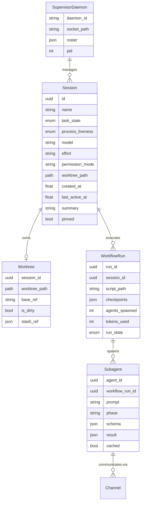

# Swarm / Fleet / Channels — Plan (§4.13)

> Run 1 — June 3, 2026 | Implements the ultracode fleet primitives

## Plain-Language Summary

Lyra's swarm/fleet layer lets you run many agents at once — each in its own isolated workspace, all visible on one screen. You dispatch tasks, they run unattended, you peek in when needed. Think "task manager for AI agents." The key innovation: every agent gets its own git worktree before editing, so a hundred agents can code simultaneously without stepping on each other. Dirty work is never silently destroyed. And the orchestration engine runs code-driven workflows where independent agents cross-check each other's work before reporting — converging on answers no single agent could reach alone.

## 1. Problem

Lyra currently runs agents in-process: one PrimaryAgent orchestrates specialists in the same Python process. There's no way to run agents unattended, no fleet view for monitoring, no worktree isolation for parallel editing safety, and no code-driven workflow engine for complex orchestration. To replicate Claude Code's "ultracode" stack, Lyra needs: supervisor daemon, fleet view, worktree isolation, and a dynamic workflow engine.

## 2. Evidence Synthesis

> See brainstorm/13-swarm-fleet.md for full technique table. Key sources:
> - Claude Code Agent View (§3.1): supervisor daemon, two-axis state model, cheap row summaries, fleet view TUI
> - Claude Code Worktrees (§3.1): git-worktree-per-session, .worktreeinclude, base-ref policy
> - Claude Code Dynamic Workflows (§3.1/§3.12): code-driven orchestration, script variables, resumable, adversarial verification
> - Identity Skews (2510.07517): response anonymization fixes bias
> - Actor-Observer (2604.19548): ReTAS dialectical alignment
> - Lying with Truths (2601.01685): collusion detection on public channels
> - Preventing Rogue Agents (2502.05986): monitor + intervene
> - Latent Agents (2604.24881): internalize debate at 93% token savings
> - ErrorProbe (2604.17658): 3-stage failure attribution
> - COMPASS (2510.08790): hierarchical context management

## 3. Proposed Lyra Design

### 3.1 Architecture: Four Primitives

```
┌────────────────────────────────────────────────────────────────────┐
│                     LYRA FLEET ARCHITECTURE                         │
│                                                                     │
│  ┌──────────────────────┐    ┌──────────────────────────┐         │
│  │   SUPERVISOR DAEMON  │    │     FLEET VIEW (TUI)      │         │
│  │   (lyra-daemon)      │◀──▶│     (lyra fleet)          │         │
│  │                      │    │                            │         │
│  │  • Process-per-sess  │    │  • State-grouped rows      │         │
│  │  • Disk-persist state│    │  • Cheap row summaries     │         │
│  │  • Survives restart  │    │  • Peek/reply/attach       │         │
│  │  • Idle session mgmt │    │  • Filters/pin/reorder     │         │
│  │  • Quota governance  │    │  • Dispatch surface        │         │
│  └──────────┬───────────┘    └────────────┬─────────────┘         │
│             │                              │                        │
│             │         ┌────────────────────┤                        │
│             ▼         ▼                    ▼                        │
│  ┌──────────────────────────────────────────────────────┐         │
│  │              WORKTREE ISOLATION SUBSTRATE              │         │
│  │                                                        │         │
│  │  • git worktree per session (lazy create on first edit)│         │
│  │  • .lyrainclude env/secret propagation                 │         │
│  │  • base-ref policy (fresh/head/PR)                     │         │
│  │  • NON-DESTRUCTIVE cleanup (stash+archive, never nuke) │         │
│  │  • Non-git fallback: unionfs overlay or hook            │         │
│  └──────────────────────────────────────────────────────┘         │
│             │                                                      │
│             ▼                                                      │
│  ┌──────────────────────────────────────────────────────┐         │
│  │          DYNAMIC WORKFLOW ENGINE                       │         │
│  │                                                        │         │
│  │  • Code-driven orchestration (JS/Python scripts)       │         │
│  │  • Script variables (not context) for intermediate data│         │
│  │  • Resumable: checkpoint after each agent() call       │         │
│  │  • Parallel() + pipeline() primitives                  │         │
│  │  • Anonymized agents + bias-corrected voting           │         │
│  │  • Collusion detection + rogue agent prevention        │         │
│  │  • Subagent cap: max(16, CPU cores-2), 1000 total/run  │         │
│  └──────────────────────────────────────────────────────┘         │
└────────────────────────────────────────────────────────────────────┘
```

### 3.2 Supervisor Daemon (`lyra-daemon`)

**State Model:**
```python
@dataclass
class SessionState:
    id: str
    name: str
    task_state: TaskState  # Working | NeedsInput | Idle | Completed | Failed | Stopped
    process_liveness: ProcessLiveness  # Alive | ExitedButResumable | LoopSleeping
    model: str
    effort: str
    permission_mode: str  # ask | auto | bypass
    worktree_path: str | None
    created_at: float
    last_active_at: float
    summary: str  # Cheap-model row summary, refreshed ≤1/15s
    pinned: bool
    group: str  # ReadyForReview | NeedsInput | Working | Completed

class SupervisorDaemon:
    """Per-user daemon owning session lifecycle."""
    roster_path: Path  # ~/.lyra/jobs/roster.json
    
    async def start(self) -> None: ...
    async def dispatch(self, prompt: str, config: DispatchConfig) -> str: ...
    async def attach(self, session_id: str) -> SessionHandle: ...
    async def peek(self, session_id: str) -> SessionPeek: ...
    async def stop(self, session_id: str) -> None: ...
    async def respawn(self, session_id: str) -> None: ...
    async def list_sessions(self, filters: SessionFilter) -> list[SessionState]: ...
    async def cleanup_idle(self) -> int: ...
```

**Lifecycle:**
1. Daemon starts on first `lyra fleet` or `lyra --bg` use
2. Reads `~/.lyra/jobs/roster.json` to recover prior sessions
3. Each session = independent OS process (subprocess.Popen or similar)
4. Session communicates with daemon via Unix socket or localhost HTTP
5. Daemon persists roster after every state change
6. Idle unattached sessions auto-stopped after configurable timeout (default 1h)
7. Daemon self-exits when roster is empty
8. On daemon restart, respawn stopped-but-not-garbage-collected sessions on demand

### 3.3 Worktree Isolation Substrate

**Isolation Flow:**
1. Session starts → runs in `.lyra/sessions/<id>/` (not yet in a worktree)
2. On FIRST file-edit attempt → `EnterWorktree` tool auto-triggers:
   a. `git worktree add .lyra/worktrees/<session-id> <base-ref>`
   b. Copies `.lyrainclude`-matched files (gitignored env/secrets)
   c. Sets `WORKTREE_PATH` env var → session redirects to worktree
   d. Non-git repos: falls back to unionfs overlay or `WorktreeCreate` hook
3. All subsequent edits happen inside the worktree
4. On session end:
   a. Clean worktree (no uncommitted changes) → auto-remove
   b. Dirty worktree → **auto-stash + archive** (create branch `worktree-<id>-archive`, push stash, remove worktree) — NEVER silent-destroy
   c. User can also choose: keep worktree, commit changes, or discard (with explicit confirmation)

**`.lyrainclude` Format:**
```
# .lyrainclude — files to copy into each new worktree
# Syntax: .gitignore-style patterns
# Only gitignored files are copied (tracked files never duplicated)
.env
.env.local
config/secrets.yaml
keys/*
!keys/README.md
```

**Base-Ref Policy:**
| Policy | Branch From | Use Case |
|--------|------------|----------|
| `fresh` (default) | `origin/HEAD` | Clean-room work, PR reviews |
| `head` | Local HEAD | Operate on in-progress feature branch |
| `pr/<N>` | `pull/<N>/head` | PR-specific work |

### 3.4 Fleet View (TUI)

**Layout:**
```
┌─ Lyra Fleet ─── [3 Working] [1 Needs Input] [5 Completed] ─── [q:quit] ─┐
│                                                                           │
│  READY FOR REVIEW                                                        │
│  ▶ #4  fix-auth-bug       [sonnet] ✓ Needs review  "Fixed OAuth flow..." │
│                                                                           │
│  NEEDS INPUT                                                              │
│  ● #7  deploy-staging     [opus]   ? Approve deploy?  "All tests pass..."│
│                                                                           │
│  WORKING                                                                  │
│  ◉ #1  research-memory    [sonnet] ⠧ Researching...   "Reading 28 papers"│
│  ◉ #3  refactor-api       [haiku]  ⠋ Refactoring...   "Split utils.py..."│
│  ◉ #9  write-tests         [sonnet] ⠇ Writing tests... "Covering edge..."│
│                                                                           │
│  COMPLETED                                                                 │
│  ✓ #2  update-docs         [haiku]  Done 2m ago       "Updated README..." │
│  ✓ #5  lint-fix            [haiku]  Done 5m ago       "Fixed 47 issues"  │
│  ✓ #6  benchmark-run       [sonnet] Done 12m ago      "12.3% improvement"│
│  ✓ #8  security-audit      [opus]   Done 25m ago      "0 critical found" │
│  ✓ #10 generate-changelog  [haiku]  Done 45m ago      "v2.1.0 changelog" │
│                                                                           │
│  ─────────────────────────────────────────────────────────────────────── │
│  > _                           [a:agent] [s:state] [#PR] [/:command]    │
└───────────────────────────────────────────────────────────────────────────┘
```

**Key Interactions:**
- `↑/↓` — Navigate rows
- `Enter` — Peek at selected session (latest output, current question, PRs)
- `a` — Attach to session (full terminal conversation)
- `←` — Detach back to fleet view (session keeps running)
- `r` — Reply to Needs-Input session (suggested reply with Tab autocomplete)
- `!` — Run bash command in session context
- `p` — Pin/unpin row
- `s` — Filter by state
- `a` — Filter by agent/model
- `/` — Slash command menu
- `d` — Dispatch new session from within fleet view

### 3.5 Dynamic Workflow Engine

**Script Model (replicating Claude Code's JS engine in Python):**
```python
# A workflow script is a Python async function with access to Lyra's primitives
# It runs in the background, with intermediate results in script variables (not context)

async def review_changes(lyra: WorkflowContext):
    """Example: Review changed files with adversarial verification."""
    
    # Phase 1: Understand — fan out reviewers
    dimensions = [
        {"key": "bugs", "prompt": "Find bugs in the changes..."},
        {"key": "perf", "prompt": "Find performance issues..."},
        {"key": "security", "prompt": "Find security vulnerabilities..."},
    ]
    
    # pipeline() = each item flows through all stages independently
    results = await lyra.pipeline(
        dimensions,
        # Stage 1: Review each dimension
        lambda d: lyra.agent(d["prompt"], schema=FINDINGS_SCHEMA, phase="Review"),
        # Stage 2: Adversarially verify each finding
        lambda review: lyra.parallel(
            review.findings.map(lambda f: 
                lambda: lyra.agent(
                    f"Adversarially verify: {f.title}", 
                    schema=VERDICT_SCHEMA,
                    phase="Verify"
                ).then(lambda v: {**f, "verdict": v})
            )
        )
    )
    
    # Filter to confirmed findings only
    confirmed = [
        f for batch in results if batch 
        for f in batch 
        if f.get("verdict", {}).get("isReal")
    ]
    
    return {"confirmed": confirmed}
```

**Key Primitives:**
- `lyra.agent(prompt, schema?, phase?, model?)` — Spawn subagent, return result
- `lyra.parallel(thunks)` — Run tasks concurrently, barrier before returning
- `lyra.pipeline(items, stage1, stage2, ...)` — Each item flows through all stages independently
- `lyra.log(message)` — Progress message to fleet view

**Concurrency Model:**
- Concurrent agent cap: `min(16, os.cpu_count() - 2)`
- Total agent cap per workflow run: 1000
- Backpressure: queue excess agents, run as slots free

**Resumability:**
- After each `agent()` call, checkpoint: (prompt, opts, result) → disk
- On resume: replay cached results for unchanged calls, re-run changed/new ones
- Progress saved as workflow runs — survives interruption/restart

**Quality Patterns (from Claude Code + multi-agent reliability research):**
1. **Adversarial Verification (default for research/audit workflows):** N independent agents make findings, M adversarial agents try to refute each, claim survives only if ≥2/3 verify after challenge
2. **Response Anonymization (2510.07517):** Strip identity markers so agents can't tell self from peer → eliminates identity bias (IBC→0)
3. **ReTAS Alignment (2604.19548):** When agents switch from actor→observer, apply Thesis-Antithesis-Synthesis dialectical correction
4. **Collusion Detection (2601.01685):** Monitor channels for Lying-with-Truths patterns; flag + isolate
5. **Rogue Prevention (2502.05986):** Monitor action prediction; intervene when future error likelihood exceeds threshold
6. **Convergence Loop:** Keep iterating until answers converge (or budget exhausted)

### 3.6 Channels (Inter-Agent Communication)

```
Channel = named message bus with:
  - Sender authorization (which agents can post)
  - Receiver subscription
  - Message persistence (optional)
  - Collusion monitoring (§4.17 safety)
  
Built on: Unix sockets (local) / WebSocket (remote) / MCP (external systems)
```

## 4. Architecture & Data Model



## 5. Build Outline

### Phase 1: Supervisor + Fleet View (weeks 1-4)

1. **Supervisor daemon** — Unix socket server, process-per-session, roster.json persistence, survive restart
2. **Session lifecycle** — dispatch, attach, peek, stop, respawn, list, cleanup-idle
3. **Fleet view TUI** — Rich/Textual-based terminal UI; state-grouped rows; cheap model summaries
4. **Dispatch surface** — `lyra fleet`, `lyra --bg`, `/bg` from session
5. **Permission gate** — unwatched sessions can't use bypass/auto without prior human accept

### Phase 2: Worktree Isolation (weeks 5-6)

1. **EnterWorktree tool** — lazy worktree creation on first edit; .lyrainclude propagation
2. **Base-ref policy** — fresh/head/PR selection; configurable default
3. **Non-destructive cleanup** — auto-stash + archive on dirty exit; explicit discard confirmation
4. **Non-git fallback** — unionfs overlay or WorktreeCreate hook

### Phase 3: Dynamic Workflow Engine (weeks 7-10)

1. **Script runtime** — Python async workflow scripts; agent/parallel/pipeline primitives
2. **Checkpoint/resume** — per-agent-call persistence; replay cached results
3. **Quality patterns** — adversarial verification, anonymization, collusion detection, rogue prevention
4. **Bundled deep-research workflow** — fan-out searches → cross-check → vote → cited report

### Phase 4: Channels + Polish (weeks 11-12)

1. **Channel infra** — Unix socket / WebSocket message bus with sender auth
2. **Fleet view polish** — search, batch operations, export, notifications
3. **Saved workflows** — save successful workflow scripts as reusable commands

## 6. Multi-Provider Note

The supervisor daemon manages processes, not models — it's provider-agnostic. Session models are per-session configurable via §4.5 router. Row summaries use cheapest available model. The workflow engine's subagents each use their own model (defaulting to session model, overridable per agent() call). DeepSeek's lower instruction-following reliability means: (a) use deterministic skill matching for DeepSeek subagents, (b) bias-corrected voting is MORE important with weaker models, and (c) the rogue agent monitor should be more sensitive for weaker models.

## 7. Risks & Open Questions

1. **Worktree disk usage:** 100 sessions = up to 100 checkouts. Mitigation: disk quota monitoring, cleanup cron, shallow checkouts where possible.
2. **Supervisor SPOF:** Daemon crash = all sessions orphaned. Mitigation: sessions are independent processes; daemon restart recovers from disk.
3. **Cross-platform worktrees:** git worktree is Unix-native; Windows support via Git for Windows. Non-git VCS needs hook.
4. **Workflow script safety:** User-written scripts could be malicious. Mitigation: sandbox script execution; limit filesystem/network access; require approval for harness-modifying scripts.

## 8. (A) Parity vs (B) Breakthrough

**(A) Parity:** Supervisor daemon + fleet view + worktree isolation + basic workflow engine — matching Claude Code's Agent View + Worktrees + Dynamic Workflows feature set.

**(B) Breakthrough:** Anonymized adversarial workflow engine with bias-corrected voting, collusion detection, rogue agent prevention, and the internalize-vs-externalize debate mode selector — going beyond Claude Code in verification quality and safety.

**Link to BREAKTHROUGH-ARCHITECTURE.md:** The fleet layer is the orchestration surface of the breakthrough architecture. Memory (§4.2) feeds context to the fleet; skills (§4.4) are the fleet's toolset; the router (§4.5) governs per-agent model selection; safety (§4.17) monitors the fleet.

## 9. Baseline Delta

**Changes:** New supervisor daemon, fleet view TUI, worktree isolation substrate, dynamic workflow engine, channels infrastructure
**Keeps:** PrimaryAgent for in-process orchestration; TaskAllocator for single-session task routing; UnifiedAgentRegistry for agent types
**Replaces:** Nothing directly — this is all new capability
**Migration cost:** ~4 new Python packages (Textual for TUI, aiohttp for daemon HTTP, gitpython for worktree ops); ~8 new modules

## 10. Expert Review

**Senior Distributed-Systems Engineer:** "The supervisor daemon architecture is sound — process-per-session, disk-persisted state, survive-restart. Key concern: the worktree setup cost per session (~200-500ms + disk for git worktree add). Lazy creation on first edit is the right optimization. The non-git fallback (unionfs) should be a documented plugin interface, not a hard dependency."

**Senior SRE:** "Worktree proliferation is the operational risk — monitor disk usage and set quotas. The non-destructive cleanup (auto-stash, never silent-destroy) is the correct default and a genuine improvement over Claude Code. Add a `lyra fleet cleanup --dry-run` to preview what would be cleaned."

**Senior Security Engineer:** "The Agent View security guardrail (no unwatched bypass/auto without prior human accept) is essential. Each worktree needs its own credential scope — don't inherit all of `~/.env`. Also: the collusion detection is important but may have false positives — log and flag, don't auto-block until the threshold is tuned."

**Adversarial Skeptic:** "This is a huge build — 12 weeks to Phase 4. For a team of 1-2, realistically 6 months. What's the minimum viable fleet? Answer: tmux + a status file + basic worktree isolation. Ship that in 2 weeks, validate demand, then build the daemon. The dynamic workflow engine is the most valuable piece — consider decoupling it from the fleet and shipping it first as a single-session feature."

**Resolution:** Phase 1 (supervisor + fleet view) is gated behind a 2-week spike: tmux + status file for basic fleet, EnterWorktree tool for isolation. If the spike validates the architecture, proceed with full daemon. The dynamic workflow engine is decoupled: ship `agent()/parallel()/pipeline()` as single-session primitives first, add background execution later.

## 11. References
- Claude Code Agent View: https://code.claude.com/docs/en/agent-view
- Claude Code Worktrees: https://code.claude.com/docs/en/worktrees
- Claude Code Dynamic Workflows: https://code.claude.com/docs/en/workflows
- Identity Skews Debate: https://arxiv.org/pdf/2510.07517
- Actor-Observer Asymmetry: https://arxiv.org/pdf/2604.19548
- Lying with Truths: https://arxiv.org/pdf/2601.01685
- Preventing Rogue Agents: https://arxiv.org/pdf/2502.05986
- Latent Agents: https://arxiv.org/pdf/2604.24881
- ErrorProbe: https://arxiv.org/pdf/2604.17658
- COMPASS: https://arxiv.org/pdf/2510.08790

## 12. Changelog
- Run 1: Initial plan written
