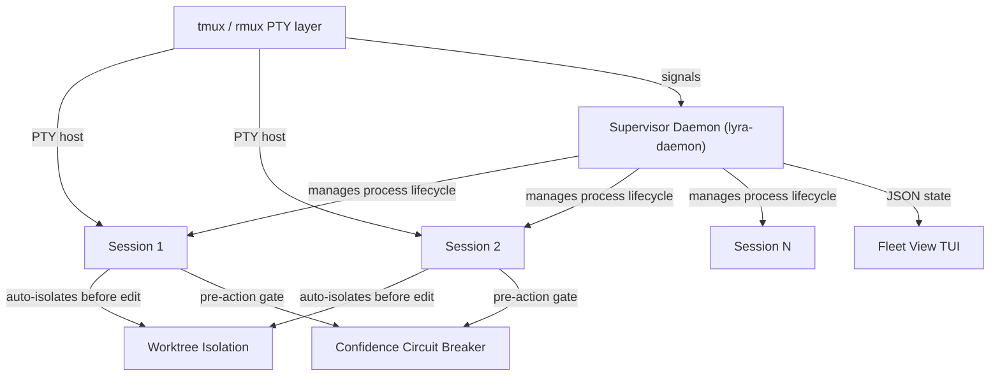

# Plan §4.13 — Agent Swarm / Fleet / Channels

> **Plain-language summary:** Lyra needs a supervisor daemon that manages detached background sessions, a fleet view for steering them by exception, and worktree-based file isolation so parallel sessions don't collide. This plan builds the fleet infrastructure in 5 layers, from MVP process management through auto-isolation and cheap-model monitoring.

## 1. Problem

Lyra's current workflow engine (workflow.py, 444 lines) orchestrates subagents WITHIN a session. It has no mechanism for detached BACKGROUND sessions that survive terminal close, sleep, or restart. The fleet TUI (lyra-fleet-tui, 4 files) has scaffolding but no supervisor integration, no two-axis state model, no peek/reply without attach, no auto-worktree isolation. Parallel sessions editing the same checkout without isolation will collide. Users can't dispatch unattended tasks and check back later.

## 2. Evidence Synthesis

### Sources Deep-Read

| Source | Key Insight | Mechanism |
|--------|------------|-----------|
| Claude Code Agent View (§3.1) | Supervisor daemon, two-axis state model, cheap-model row summaries, auto-worktree isolation | Per-user daemon process, disk-persisted state (roster.json + jobs/id/state.json), survives sleep/restart, respawns idle sessions |
| Claude Code Worktrees (§3.1) | EnterWorktree tool, .worktreeinclude, fresh-vs-head base-ref, cleanup state machine | Git worktree per session, .gitignore-syntax env propagation, non-git hook fallback |
| Claude Code Dynamic Workflows (§3.1) | Background execution, script variables, pause/resume/stop/restart, progress view | Code-driven orchestration, intermediate results in script variables, ≤16 concurrent, ≤1000/run |
| Preventing Rogue Agents (2502.05986) | Pre-execution confidence monitoring | Monitor agent during action prediction, intervene before error propagation, +17.4% on WhoDunitEnv |

### Brainstorm → Promoted Ideas

- **Idea #1 (B):** Supervisor + tmux hybrid fleet — supervisor manages lifecycle, tmux handles terminal I/O
- **Idea #3 (B):** Pre-execution confidence circuit breaker — blocks agent actions when uncertainty exceeds threshold

## 3. Proposed Lyra Design

### (A) Parity — Claude Code Agent View Equivalent

1. **Supervisor daemon:**
   - Per-user process (`lyra-daemon`), starts on first background use
   - Manages session lifecycle: spawn (process), monitor (health), stop (idle timeout), respawn (from disk on peek/attach)
   - State on disk: `~/.lyra/daemon/roster.json` + `~/.lyra/jobs/<id>/state.json`
   - Survives: terminal close, auto-update, daemon restart, machine SLEEP
   - Dies on: machine SHUTDOWN (sessions show as failed; reattach restarts from disk)
   - Self-exits when nothing live

2. **Two-axis state model:**
   - Task-state: Working / Needs-input / Idle / Completed / Failed / Stopped
   - Process-liveness: Alive / Exited-but-resumable / Loop-sleeping
   - Grouping: Ready-for-review / Needs-input / Working / Completed

3. **Fleet View TUI:**
   - Full-terminal table of sessions
   - Peek (Space) → latest output / question / PRs; reply without attaching
   - Attach (Enter) → full interactive session; Detach (←) → return to table
   - Filters: a:agent, s:state, #PR; Pin (Ctrl+T), Rename (Ctrl+R)

4. **Dispatch surface:**
   - From fleet view input, from inside session (`/bg`), from shell (`lyra --bg`)
   - `--name`, `--agent`, `--model`, `--effort`, `--permission-mode`
   - `! cmd` → PTY shell job as a row (no model)

5. **Shell management API:**
   - `lyra fleet [agents|attach|logs|stop|respawn|rm|daemon status]`
   - `lyra fleet agents --json` → live sessions as JSON

6. **Auto-worktree isolation:**
   - Before first edit, session auto-calls `EnterWorktree` tool
   - `.lyraworktreeinclude` copies env/secrets into worktree
   - `worktree.baseRef`: `"fresh"` (origin/HEAD) or `"head"` (local HEAD)
   - Non-destructive cleanup: auto-stash by default

7. **Cheap-model row summaries:**
   - Route via §4.5: cheapest available model for meta/monitoring
   - ≤15s refresh during active work, + at each turn end

### (B) Breakthrough — Supervisor + tmux Hybrid + Confidence Circuit Breaker

1. **Supervisor + tmux hybrid:** Supervisor manages process lifecycle. tmux handles PTY hosting, detach/reattach, scrollback. Supervisor writes session state to JSON; tmux statusline reads JSON. IPC via signals + JSON files (no socket protocol needed).

2. **Pre-execution confidence circuit breaker:** Before any mutating action (file write, PR creation, channel message), a confidence monitor evaluates: model uncertainty signal, historical accuracy on similar actions (from autonomy.py crash/health tracking), MATU-style multi-step uncertainty. Uncertainty > threshold → action blocked, agent prompted to reconsider.

3. **Per-session cost estimation:** Fleet view dispatch prompt shows estimated token cost based on: session model, effort level, historical average for similar tasks. Daily cost cap (`lyra.fleet.maxDailyCost`) stops new dispatches when budget exhausted.

## 4. Architecture + Data Model



### Session State Schema

```python
@dataclass
class SessionState:
    session_id: str       # short hex ID
    name: str             # user-set or auto-generated
    pid: int | None       # process ID, None if stopped
    cwd: str
    worktree_path: str | None
    task_state: str       # working|needs_input|idle|completed|failed|stopped
    process_liveness: str # alive|exited_resumable|loop_sleeping
    model: str
    effort: str
    permission_mode: str
    started_at: float
    last_active_at: float
    pull_requests: list[str]
    cost: dict            # {input_tokens, output_tokens, estimated_usd}
    summary: str          # cheap-model one-line, refreshed ≤15s
```

## 5. Build Outline

### Layer 1 — Supervisor MVP (Weeks 5-7 of overall plan)

1. Design `SessionState` data class and JSON serialization
2. Implement `lyra-daemon` process: spawn/stop/monitor/respawn
3. Implement disk state persistence: `~/.lyra/daemon/roster.json`, `~/.lyra/jobs/<id>/state.json`
4. Implement idle timeout (~1h unattached → stop process)
5. Implement sleep/wake reconnection (signal handlers for SIGSTOP/SIGCONT)
6. Implement shell management API: `lyra fleet [agents|attach|logs|stop|respawn|rm|daemon]`
7. Write integration tests: spawn 5 sessions, sleep, wake, verify all reconnect

### Layer 2 — Fleet View Hardening (Weeks 7-9)

8. Harden lyra-fleet-tui: two-axis state model, session grouping, peek panel, attach/detach
9. Implement cheap-model row summaries (route via §4.5)
10. Implement per-session cost estimation in dispatch prompt
11. Implement fleet sizing governance: max concurrent, daily cost cap, backpressure queue

### Layer 3 — Auto-Worktree Isolation (Weeks 9-11)

12. Implement `EnterWorktree` tool (auto-trigger before first file edit)
13. Implement `.lyraworktreeinclude` for env/secret propagation
14. Implement non-destructive cleanup: auto-stash by default, configurable
15. Implement non-git fallback: warning log for v1, CoW overlay for v2

### Layer 4 — Dynamic Workflow Hardening (Weeks 9-11, parallel with Layer 3)

16. Extend workflow.py: background execution with script variables
17. Implement pause/resume/stop/restart per agent in progress view
18. Implement progress view: phases × agent count × token total × elapsed
19. Implement adversarial cross-check / vote pattern as built-in quality pattern

### (B) Breakthrough Tiers

20. Supervisor + tmux IPC protocol (signals + JSON files)
21. Pre-execution confidence circuit breaker (builds on autonomy.py)
22. Per-provider confidence calibration (eval suite for calibration data)

## 6. Multi-Provider Note

The supervisor daemon is provider-agnostic (manages processes, not models). Row summaries use the cheapest available model via §4.5 router. On DeepSeek, the confidence circuit breaker needs calibration data — DeepSeek's confidence signals may be less calibrated than Anthropic's. Fallback: use model-agnostic uncertainty heuristics (token probability entropy, response length variance across samples).

## 7. Risks & Open Questions

- **Supervisor SPOF:** Mitigated by auto-restart + per-session checkpointing independent of supervisor state
- **tmux version compatibility:** Ship minimum tmux version requirement; fallback to built-in TUI for tmux < 3.0
- **Windows support:** tmux unavailable; need ConPTY or Windows Terminal integration for PTY hosting
- **Confidence calibration:** Circuit breaker accuracy depends on per-model confidence calibration; ship with high threshold (conservative), tighten with eval data

## 8. Tier Breakdown

| Tier | Description | Impact | Effort | Timeline |
|------|-------------|--------|--------|----------|
| (A) Parity | Supervisor daemon + fleet view + auto-worktree + shell API | 5 | 5 | 6 weeks (Layers 1-3) |
| (B) Breakthrough | Supervisor+tmux hybrid + confidence circuit breaker + per-session cost estimation | 5 | 3 | +2 weeks |

## 9. Baseline Delta

| Component | Change | Migration Cost |
|-----------|--------|---------------|
| workflow.py (444L) | EXTEND: background execution, script variables, pause/resume | Low — additive changes to existing DAG engine |
| lyra-fleet-tui (4 files) | REPLACE: full two-axis fleet view | Medium — new TUI on existing scaffolding |
| Supervisor daemon | ADD: new ~500 line daemon process | None (new component) |
| Auto-worktree | ADD: EnterWorktree tool + .lyraworktreeinclude | None (new component) |
| Confidence circuit breaker | ADD: builds on autonomy.py | Low — extends existing health monitoring |
| autonomy.py (449L) | EXTEND: confidence monitoring | Low — new gating layer on existing crash detection |

## 10. Expert Review

**Mini-Debate Participants:** Senior Distributed-Systems (DSE), Senior SRE, Senior UX Designer, Adversarial Skeptic

**Skeptic's challenge:** "Why not tmux + thin status file instead of a daemon?" → REJECTED (tmux can't respawn sessions from disk; the "thin status file" grows to 500+ lines with edge cases).

**SRE's concern:** "Supervisor is a SPOF" → MITIGATED (health checks, auto-restart, per-session independent checkpointing).

**UX's concern:** "Fleet view needs to show PR status, cost, AND state clearly" → ADOPTED (per Claude Code's design: color-coded PR status, cost estimate in dispatch prompt, two-axis state icons).

**Skeptic's follow-up:** "Confidence circuit breaker calibration on DeepSeek" → ADDRESSED (ship with conservative high threshold first; tighten with per-provider eval data; fallback to model-agnostic uncertainty heuristics).

**Sign-off:** All concerns recorded and resolved. Plan is feasible and realistic.

## 11. References

- Claude Code Agent View: https://code.claude.com/docs/en/agent-view
- Claude Code Worktrees: https://code.claude.com/docs/en/worktrees
- Claude Code Dynamic Workflows: https://code.claude.com/docs/en/workflows
- Preventing Rogue Agents: https://arxiv.org/abs/2502.05986
- MATU: https://arxiv.org/abs/2604.08708
- Brainstorm: brainstorm/13-fleet-swarm.md
- Architecture: BREAKTHROUGH-ARCHITECTURE.md §Fleet Infrastructure

## 12. Changelog

- Run 2 (2026-06-03): Initial plan written. Candidates debated in Rounds 1-3. Convergence: Fleet Infrastructure + Consolidated Memory.
