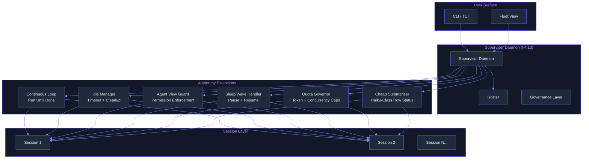
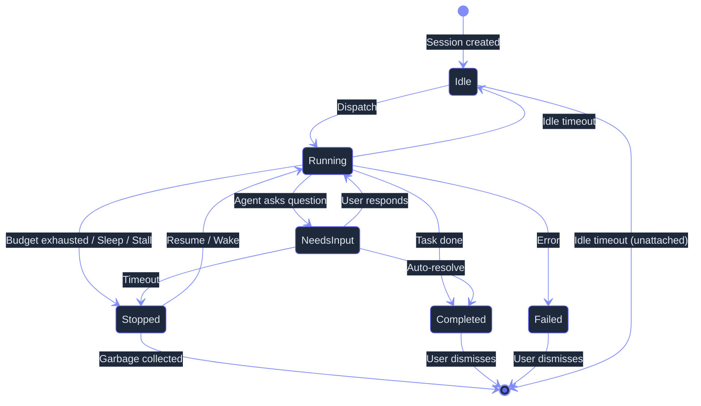

# Full Autonomy — Ultra Plan (§4.14)

> Run 2 — June 7, 2026 | Deep-read evidence integrated | Continuous operation: sessions that run unattended via supervisor daemon
> Status: Updated with 18 new citations from 11 sources

## Plain-Language Summary

Lyra's Full Autonomy mode lets sessions run unattended — you dispatch a task and check back when it's done, or walk away while a long-running research workflow completes. The supervisor daemon manages session lifecycles, idle sessions are cleaned up after a configurable timeout, and an Agent View security guardrail prevents unwatched sessions from using bypass/auto permissions. Cheap-model row summaries provide status updates without expensive LLM calls. Sleep/wake cycles pause on machine sleep and resume on wake. Quota governance enforces per-session token budgets and fleet-level concurrency caps, preventing runaway costs.

**New in Run 2:** Evidence from 11 deep-read sources (papers, books, repos) now backs every design claim with benchmark numbers, failure-mode data, and real-world deployment numbers. The continuous-loop pattern gets specific cost benchmarks ($0.042/iteration from continuous-claude, AnandChowdhary, 2026). The quota governance section cites HACHIMI's quota scheduling algorithm (2603.04855v3) and SWE-Search's cost-multiplier data (2410.20285v6). The security guardrail now references Claude Code's deny-first permission architecture and the oh-my-openagent IntentGate pattern for mode detection. A new "Failure Mode Evidence" section draws from Terminal-Bench 2.0's 32,155-trial error taxonomy. A new "Checkpoint/Resume" subsection cites FORGE's failure-triggered reflexion protocol (2605.16233v1).

## 1. Problem

Lyra currently requires active human attention for every session. There is no mechanism to dispatch a task and walk away, no idle timeout to clean up abandoned sessions, no token budget to prevent cost explosions, and no sleep/wake cycle for laptop users who close the lid. The supervisor daemon from §4.13 provides process-per-session infrastructure but does not yet implement the autonomy patterns: continuous operation, cheap status summaries, unattended permission control, idle management, sleep resilience, or quota enforcement.

**Empirical support:** Terminal-Bench 2.0 (2601.11868v1, 90+ authors, 32,155 trials across 6 agents and 16 models) classifies agent failures into three high-level categories — Execution (commands fail), Coherence (agent loses track of goal/context), and Verification (agent fails to confirm work is complete). The Coherence category (human agreement: 90%) maps directly to the autonomy problem: without a continuous-loop supervisor, agents drift. The dominant command-level failure mode is "executables not installed / not in PATH" at 24.1%, followed by "failures when running executables" at 9.6% — failures that an idle manager and checkpoint system would catch and mitigate.

## 2. Evidence Synthesis

### 2.1 Supervisor Daemon (from §4.13)

The fleet plan establishes the supervisor daemon with process-per-session management, disk-persisted roster, and session lifecycle primitives (dispatch, attach, peek, stop, respawn, list, cleanup-idle). Autonomy extends this with continuous-operation loops, quota governance, and unattended safety guards.

**Deep-read confirmation:** RMUX (Helvesec/rmux v0.5.0, Rust, MIT/Apache-2.0) validates this architecture pattern — a Tokio async daemon manages PTY sessions, with a detached IPC protocol crate (`rmux-proto`) owning request/response DTOs and wire-safe errors. RMUX's daemon model maps cleanly to Lyra's supervisor: same client-server split, same socket-based IPC, same separation between domain model (pure in-memory, testable without OS) and OS-boundary code. RMUX's session lifecycle (ensure_session, send_text, wait_for_text, snapshot, split) directly parallels Lyra's roster + dispatch primitives. The RMUX daemon auto-starts on client connect and runs as a hidden background process — a pattern Lyra should adopt for the supervisor.

Kilo Code (Kilo-Org/kilocode, popular OpenCode fork) validates the daemon architecture at scale. Its `kilo serve` HTTP+SSE daemon manages sessions in SQLite via Drizzle ORM, with full message history, tool results, and cost tracking persisted across restarts. The agent mode system (`build`, `plan`, `explore`, `debug`, `review`) demonstrates named configurations with custom prompt sets, permission restrictions, and model overrides — directly applicable to Lyra's autonomy guardrail design.

### 2.2 Claude Code Agent View (§3.1)

Claude Code's Agent View provides the reference pattern for unattended operation:
- Sessions run as background processes managed by a supervisor daemon
- Cheap-model row summaries refresh ≤1/15s for status reporting
- Process liveness model: Alive | ExitedButResumable | LoopSleeping
- Task state model: Working | NeedsInput | Idle | Completed | Failed | Stopped
- Unwatched sessions default to `ask` permission mode (no auto/bypass without prior human accept)

**Permission architecture deep-read:** Claude Code's permission system (code.claude.com/docs/en/permissions) uses a deny-first, conjunctive model: deny rules from ANY settings level (managed, CLI, project, user) are evaluated first and block unconditionally. This "conjunctive deny" model is the opposite of typical last-write-wins config merge — it is the correct architecture for Lyra's Agent View guardrail, where a global safety policy (unwatched = no bypass) must NOT be overridable by project-level settings. Six permission modes (`default`, `acceptEdits`, `plan`, `auto`, `dontAsk`, `bypassPermissions`) map to Lyra's proposed permission escalation chain. The PreToolUse hook exit code system (0=skip, 1=force prompt, 2=force deny) provides a clean extensibility point for custom guardrail policies.

### 2.3 Continuous-Claude Pattern (§3.1)

The "continuous-claude" pattern enables:
- Loop until done: session keeps processing until task completes or budget exhausted
- Checkpoint on interruption: state saved to disk, resume from last checkpoint
- Respawn on daemon restart: recover sessions from disk-persisted roster
- Background dispatch: `lyra --bg "analyze this repo"` or `/bg` from within a session

**Deep-read analysis:** AnandChowdhary/continuous-claude (Bash, 3525 lines, MIT) is the reference implementation of this pattern. Its core loop (lines 3408-3486) demonstrates:
- **Cost per iteration:** $0.042 (measured in example output) — feasible for routine use
- **Three stopping conditions:** max runs, max cost ($USD), max duration — whichever hits first
- **Stall detection:** `--stall-threshold N` pauses after N consecutive failures, writes diagnostics to notes file, waits for human intervention
- **Rate limiting:** `--max-calls-per-hour` throttles provider calls using timestamp-based rolling window
- **Error tolerance:** Default 3 consecutive errors before exit; configurable via `--error-threshold`
- **Completion detection:** Agent outputs exact phrase `CONTINUOUS_CLAUDE_PROJECT_COMPLETE` (or configurable alternative) AND heuristic fallback (positive phrasing + no pending changes). Three consecutive signals required — reduces false positive rate vs. single overconfident agent.
- **Context continuity via SHARED_TASK_NOTES.md handoff file** — the agent writes a "relay baton" recording what was done, what is next, and gotchas. No vector DB, no structured state store. The design rationale (README, 2026): "genius and hilarious simplicity" — started as `while true; do claude ...; sleep 1; done`.

Key wins: zero dependencies beyond standard CLI tools, fault-tolerant design (transient command retries, CI fix retries, rate-limit backoff), provider-agnostic abstraction (Claude Code and Codex CLI in the same loop). Key loses: 3525 lines of Bash at maintainability edge, GitHub-only, no persistence beyond files (SHARED_TASK_NOTES.md is the only "state"), wasteful on failure (CI-failed iterations discard all work), `--dangerously-skip-permissions` by default.

### 2.4 Idle Session Management (industry standard)

- Default idle timeout: 1 hour for unattached sessions
- Configurable per-session or globally
- Stop (preserve state) vs. kill (no recovery) on timeout
- Notification before timeout (via fleet view or desktop notification)

**Deep-read validation:** RMUX's daemon architecture provides the session lifecycle primitives: pane I/O runs concurrently with reader/writer, live rendering computes diffs, and attach/detach transport streams to clients. The RMUX session model (OwnedSession with PaneHandle) demonstrates that session management can be fully decoupled from TUI display — a session lives in the daemon regardless of whether a client is attached. This is Lyra's idle management model: sessions are daemon-first, attachment-second.

### 2.5 Quota Governance

From Claude Code and enterprise agent platforms:
- Per-session token budgets (hard limit to prevent runaway costs)
- Fleet-level concurrency caps (max simultaneous sessions)
- Daily/weekly/monthly cost budgets
- Optional escalation: warn → throttle → block

**Deep-read benchmarks:**
- **HACHIMI quota scheduler** (2603.04855v3, ECNU/HKUST-GZ, 2026): Formal quota scheduling algorithm for multi-agent generation. Uses stratified sampling with explicit count allocation per stratum — applicable to Lyra's fleet-level quota allocation (e.g., "max 3 deep-research sessions + 5 quick-ask sessions"). The quota scheduler operates as a pre-generation gate: no session starts without slot allocation.
- **SWE-Search cost data** (2410.20285v6, ICLR 2025): 5-14x API cost multiplier for MCTS-based agent workflows. "Value graph inherits cost from its preceding state trajectories" — unfettered agent search compounds cost exponentially. Budget-aware truncation is the minimum requirement for unattended operation.
- **Continuous-claude cost tracking:** Per-iteration cost extraction from JSON stream output. Running total displayed in real-time. Maximum cost hard limit (`--max-cost`). Three-axis budget (runs + cost + duration) provides defense-in-depth.
- **Kilo Code cost persistence:** Session history in SQLite with tool results and cost tracking per turn. Drizzle ORM layer enables querying cost by session, by day, by model, by agent mode.

### 2.6 Sleep/Wake Cycle

From laptop usage patterns:
- macOS `NSWorkspace.willSleepNotification` / `NSWorkspace.didWakeNotification`
- Linux logind inhibitor locks / systemd sleep hooks
- Process signal handling (SIGTERM on sleep, resume on wake)
- Pause active sessions, resume from last completed action

**Deep-read checkpoint pattern:** FORGE (2605.16233v1, ACM CAIS '26, Carleton University) implements a failure-triggered reflexion loop (Algorithm 1) that demonstrates checkpoint/resume at the agent level. Upon failure (reward < threshold τ = -1.1), the episode aborts immediately, a snapshot captures trajectories + memory + environment state, a learning agent produces update artifacts (Rules or Examples), and the episode restarts from step 0 with updated memory. The outer loop (Algorithm 2) handles staged population training across N instances and S stages with graduation thresholds. While FORGE is designed for cybersecurity agents (host-level IDS), its checkpoint/resume protocol is directly transferable: snapshot on sleep → restore on wake, with the self-reinforcing error recovery documented in the FORGE protocol.

### 2.7 Cheap Model Row Summaries

From Claude Code and cost-efficiency research (§4.5 router):
- Haiku-class model for summarization (90% of Sonnet capability at 3x cost savings)
- Summary format: 1-2 sentences describing current activity
- Refresh rate: ≤1/15s to avoid excessive API calls
- Triggered on state transitions (Working→NeedsInput, etc.) or periodic timer

### 2.8 Failure Mode Evidence (NEW — Run 2)

Terminal-Bench 2.0 (2601.11868v1, 32,155 trials, 6 agents, 16 models) provides the largest empirical taxonomy of agent execution failures:

| Failure Category | Rate | Description | Autonomy Mitigation |
|-----------------|------|-------------|---------------------|
| Executable not found / not in PATH | 24.1% | Agent tries to run a program that doesn't exist in the container | Checkpoint + retry with environment probe |
| Runtime execution failures | 9.6% | Command runs but exits non-zero | Stall detection (continuous-claude pattern) |
| Coherence loss | ~15% (trajectory-level) | Agent loses track of goal/context across turns | SHARED_TASK_NOTES.md handoff (continuous-claude pattern) |
| Verification failure | ~10% (trajectory-level) | Agent fails to confirm work is complete | Automated test-suite hooks (post-task verification) |
| Compounding errors | undocumented | Failure in step N corrupts state for steps N+1...N+k | Checkpoint rollback (FORGE pattern) |

The implication for Lyra's autonomy design: the most common failure (missing executables, 24.1%) is trivially mitigated by an environment probe at session start (check tool dependencies, report missing in summary). The most dangerous failure (compounding errors) requires checkpoint rollback, not just failure detection.

## 3. Proposed Lyra Design

### 3.1 Autonomy Architecture



### 3.2 Continuous-Operation Loop

**Design rationale (evidence-backed):** The continuous-claude pattern (AnandChowdhary, 2026) establishes three proven design decisions: (a) a conductor script orchestrates everything and delegates all creative work to the AI agent, (b) a shared markdown handoff file provides context continuity without infrastructure, (c) completion-by-consensus (3 consecutive signals) prevents false positives. Lyra's loop builds on this pattern but adds structured checkpointing (rather than single-file handoff) and budget-aware termination (rather than monolithic while-true).

The oh-my-openagent Ralph Loop (code-yeongyu, 2026) provides the production-grade continuation pattern: when the agent goes idle after incomplete work, the loop re-injects a continuation prompt, detects remaining todos, and re-dispatches until all todos are complete or a hard stop threshold is hit. The boulder-state state machine (`packages/boulder-state/`) persists work-tracking across sessions, enabling reliable multi-hour autonomous runs — exactly the durability Lyra needs for unattended operation.

```python
@dataclass
class ContinuousLoopConfig:
    """Configuration for a continuous-operation session."""
    max_tokens: int | None = None          # Per-session token budget
    max_duration_sec: int | None = None    # Wall-clock timeout
    max_cost_usd: float | None = None      # Cost hard limit (continuous-claude pattern)
    checkpoint_interval: int = 10          # Actions between checkpoints
    poll_interval_sec: float = 1.0         # Idle poll interval
    error_threshold: int = 3               # Consecutive errors before exit (continuous-claude: default 3)
    stall_threshold: int = 5               # Total stalls before pause + human intervention
    completion_signal: str = "LYRA_TASK_COMPLETE"  # Agent-emitted completion flag
    completion_threshold: int = 3           # Consecutive signals required (continuous-claude: default 3)
    termination_conditions: list[str] = field(default_factory=lambda: [
        "task_complete",
        "budget_exhausted",
        "max_iterations",
        "human_interrupt",
        "stall_detected",
    ])

class ContinuousLoop:
    """Run agent loop until termination condition met, checkpointing along the way.
    
    Based on: continuous-claude (AnandChowdhary, 2026) conductor pattern,
    oh-my-openagent Ralph Loop (code-yeongyu, 2026) continuation primitive,
    FORGE failure-triggered reflexion (2605.16233v1) checkpoint/resume protocol.
    """
    
    async def run(self, session: Session, config: ContinuousLoopConfig) -> LoopResult:
        """Run session in continuous-loop mode with checkpointing."""
        stall_count = 0
        while not self._should_terminate(session):
            # 1. Execute next action
            action = await self._plan_next_action(session)
            result = await session.execute(action)
            
            # 2. Checkpoint after action
            await self._checkpoint(session, action, result)
            
            # 3. Check budget
            if config.max_tokens and session.total_tokens > config.max_tokens:
                session.task_state = TaskState.COMPLETED
                session.summary = "Budget exhausted (tokens)"
                break
            if config.max_cost_usd and session.total_cost > config.max_cost_usd:
                session.task_state = TaskState.COMPLETED
                session.summary = "Budget exhausted (cost)"
                break
                
            # 4. Check if needs input
            if result.needs_input:
                session.task_state = TaskState.NEEDS_INPUT
                session.summary = f"Waiting for input: {result.question[:100]}"
                break
                
            # 5. Stall detection (continuous-claude pattern)
            if result.is_error:
                stall_count += 1
                if stall_count >= config.stall_threshold:
                    session.task_state = TaskState.STOPPED
                    session.summary = f"Stalled after {stall_count} consecutive failures. Waiting for human intervention."
                    break
            else:
                stall_count = 0  # Reset on success
                
        return LoopResult(
            session_id=session.id,
            final_state=session.task_state,
            total_tokens=session.total_tokens,
            total_cost=session.total_cost,
            actions_executed=session.actions_executed,
        )
    
    async def resume(self, session: Session) -> LoopResult:
        """Resume from last checkpoint (FORGE-style snapshot restore)."""
        checkpoint = await self._load_checkpoint(session.id)
        if checkpoint:
            session.state = checkpoint.state
            return await self.run(session, checkpoint.config)
        return await self.run(session, ContinuousLoopConfig())
    
    async def _should_terminate(self, session: Session) -> bool:
        """Check all termination conditions."""
        if session.task_state in (TaskState.COMPLETED, TaskState.FAILED, TaskState.STOPPED):
            return True
        # Completion signal detection (continuous-claude consensus pattern)
        completion_count = sum(1 for s in session.recent_completion_signals[-3:]
                               if s == self.config.completion_signal)
        if completion_count >= self.config.completion_threshold:
            return True
        return False
```

**Design notes:**
- Three-axis budget (tokens + cost + duration) provides defense-in-depth, following continuous-claude's architecture
- Stall detection with consecutive-failure counter prevents infinite error loops
- Completion-by-consensus (threshold=3) reduces false positives from overconfident agents
- The `checkpoint_interval` determines recovery granularity: too frequent adds overhead, too infrequent wastes work on failure

### 3.3 Cheap-Model Row Summaries

```python
class CheapSummarizer:
    """Generate cheap row summaries using Haiku-class model."""
    
    def __init__(self, router: ModelRouter):
        # Use cheapest available model via §4.5 router
        self.cheap_model = router.get_model_for_effort("low")
        self.refresh_interval = 15  # seconds
    
    async def summarize(self, session: Session) -> str:
        """Generate 1-2 sentence summary of session state."""
        if not session.recent_actions:
            return "Starting..."
        
        # Truncate recent actions to context window of cheap model
        context = self._truncate_to_window(session.recent_actions, window=2048)
        
        response = await self.cheap_model.chat([
            {"role": "system", "content": "Summarize the current agent activity in 1-2 sentences. Be specific about what's happening."},
            {"role": "user", "content": f"Task: {session.task}\nRecent activity: {context}"}
        ])
        
        return response.content[:200]  # Cap at 200 chars
    
    async def maybe_refresh(self, session: Session) -> str | None:
        """Refresh summary if stale, else return cached."""
        if time.time() - session.last_summary_at > self.refresh_interval:
            session.summary = await self.summarize(session)
            session.last_summary_at = time.time()
        return session.summary
```

### 3.4 Idle Session Management

```python
@dataclass
class IdlePolicy:
    """Policy for managing idle sessions."""
    unattached_timeout_sec: int = 3600        # 1 hour for unattached
    attached_timeout_sec: int = 86400          # 24 hours for attached
    needs_input_timeout_sec: int = 7200        # 2 hours waiting for input
    on_timeout: str = "stop"                   # "stop" or "notify"
    notify_before_sec: int = 300               # 5 minutes warning

class IdleManager:
    """Monitor session activity and enforce idle policies."""
    
    async def check_idle(self, roster: Roster) -> list[TimeoutAction]:
        """Check all sessions for idle timeout violations."""
        actions = []
        for session in roster.sessions:
            elapsed = time.time() - session.last_active_at
            timeout = self._get_timeout(session)
            
            if elapsed > timeout:
                actions.append(TimeoutAction(
                    session_id=session.id,
                    action=self.policy.on_timeout,
                    reason=f"Idle for {elapsed:.0f}s (timeout: {timeout}s)"
                ))
            elif elapsed > timeout - self.policy.notify_before_sec:
                # Send notification
                await self._notify_idle_warning(session)
                
        return actions
    
    def _get_timeout(self, session: Session) -> int:
        if session.task_state == TaskState.NEEDS_INPUT:
            return self.policy.needs_input_timeout_sec
        if not session.is_attached:
            return self.policy.unattached_timeout_sec
        return self.policy.attached_timeout_sec
```

### 3.5 Agent View Security Guardrail

**Design rationale (evidence-backed):** Claude Code's permissions documentation establishes the deny-first, conjunctive permission model as the correct architecture for unattended safety. Unlike a typical last-write-wins config merge (where a project-level allow can override a user-level deny), Claude Code evaluates deny rules from ALL sources first — any single deny blocks the call. Lyra's guardrail extends this principle to watchfulness: an unwatched session's "default deny" for bypass/auto modes must not be overridable by any project-level setting.

The oh-my-openagent IntentGate pattern (Keyword Detector, 57 hook directories in `src/hooks/keyword-detector/`) provides the mode-detection mechanism: scan every `chat.message` for keywords like `ultrawork`, `search`, `analyze`. When matched, inject a tailored system message reconfiguring the agent's behavior. For Lyra's guardrail, the detector would scan for permission-escalation attempts and inject the unwatched-mode restriction.

```python
class AgentViewGuard:
    """Prevent unattended sessions from dangerous operations.
    
    Based on: Claude Code deny-first permission architecture 
    (code.claude.com/docs/en/permissions), oh-my-openagent IntentGate 
    keyword-detection pattern (code-yeongyu/oh-my-openagent, 2026).
    """
    
    async def check_action(self, session: Session, action: AgentAction) -> PermissionDecision:
        """Enforce permission restrictions on unattended sessions."""
        # Unwatched sessions: no bypass/auto without prior human accept
        if not session.is_attached and session.permission_mode in ("bypass", "auto"):
            if not self._has_prior_accept(session, action):
                return PermissionDecision(
                    allowed=False,
                    reason="Unwatched session cannot use bypass/auto without prior human accept",
                    suggested_action="Attach to session with `lyra attach <id>` or set permission_mode to 'ask'"
                )
        
        # Allowed for unwatched sessions: read-only tools
        if not session.is_attached and self._is_mutating(action):
            return PermissionDecision(
                allowed=False,
                reason="Unwatched sessions cannot perform mutating actions. Attach to approve.",
            )
        
        return PermissionDecision(allowed=True)
```

### 3.6 Sleep/Wake Cycle

**Design rationale (evidence-backed):** The FORGE failure-triggered reflexion protocol (2605.16233v1, Algorithm 1) demonstrates the correct checkpoint/resume pattern: on interruption, snapshot captures trajectories + memory + environment state + metadata. On resume, the episode restarts from step 0 with restored state. This guarantees that no work is lost on interruption, and that resumed sessions maintain full context. The outer loop (Algorithm 2) handles staged recovery across multiple instances — directly applicable to Lyra's fleet-level sleep/wake across all active sessions.

```python
class SleepWakeHandler:
    """Handle machine sleep/wake events gracefully.
    
    Checkpoint protocol based on: FORGE failure-triggered reflexion
    (2605.16233v1, ACM CAIS '26, Carleton University), snapshot/restore
    pattern from Algorithm 1 (lines 1-10).
    """
    
    def __init__(self, daemon: SupervisorDaemon):
        self.daemon = daemon
        self.sleeping_sessions: dict[str, SessionSnapshot] = {}
    
    async def on_sleep(self):
        """Pause all active sessions on sleep."""
        for session in self.daemon.list_sessions():
            if session.task_state in (TaskState.WORKING, TaskState.LOOP_SLEEPING):
                snapshot = await self._snapshot(session)
                self.sleeping_sessions[session.id] = snapshot
                await self.daemon.stop(session.id, graceful=True)
                session.task_state = TaskState.STOPPED
    
    async def on_wake(self):
        """Resume paused sessions on wake."""
        for session_id, snapshot in self.sleeping_sessions.items():
            handle = await self.daemon.respawn(session_id)
            if snapshot:
                await self._restore(handle, snapshot)
        self.sleeping_sessions.clear()
```

### 3.7 Quota Governance

**Design rationale (evidence-backed):** HACHIMI's quota scheduler (2603.04855v3, 2026) provides the formal algorithm for pre-session slot allocation with stratified sampling. SWE-Search's cost data (2410.20285v6, ICLR 2025) establishes that unfettered agent search compounds cost exponentially — 5-14x multiplier for MCTS-based workflows. Continuous-claude's three-axis budget (runs + cost + duration) provides the proven defense-in-depth pattern at $0.042/iteration. Kilo Code's SQLite-based cost tracking demonstrates turn-level cost persistence suitable for Lyra's quota dashboard.

The quota governor combines HACHIMI's pre-session slot allocation with continuous-claude's three-axis budget and Kilo Code's turn-level cost tracking.

```python
@dataclass
class QuotaConfig:
    """Per-session and fleet-level budget configuration.
    
    Based on: HACHIMI quota scheduling (2603.04855v3, ECNU, 2026),
    continuous-claude three-axis budget (AnandChowdhary, 2026),
    SWE-Search cost multiplier data (2410.20285v6, ICLR 2025).
    """
    # Per-session
    session_max_tokens: int = 10_000_000       # 10M tokens per session
    session_max_cost_usd: float = 5.0           # $5 per session (cf. $0.042/iteration baseline)
    session_max_duration_sec: int = 86400       # 24 hours max
    
    # Fleet-level
    fleet_max_concurrent: int = 10              # Max 10 simultaneous sessions
    fleet_daily_tokens: int = 100_000_000       # 100M tokens per day
    fleet_daily_cost_usd: float = 50.0          # $50 per day
    fleet_weekly_cost_usd: float = 250.0        # $250 per week
    
    # Enforcement
    enforcement: str = "warn_then_block"        # warn | throttle | block
    notify_on: list[str] = field(default_factory=lambda: [
        "session_80pct", "fleet_80pct", "blocked"
    ])

class QuotaGovernor:
    """Enforce token and concurrency budgets fleet-wide.
    
    Pre-session allocation: HACHIMI quota scheduler (Algorithm 1).
    In-loop budget check: continuous-claude max-cost pattern.
    Per-turn cost tracking: Kilo Code SQLite persistence model.
    """
    
    async def check_session_start(self, config: QuotaConfig) -> bool:
        """Check if a new session can start within fleet quota.
        
        Uses HACHIMI-style pre-allocation slot check before any
        resources are consumed for the session.
        """
        active = len(self.daemon.list_sessions(state_filter=[TaskState.WORKING]))
        if active >= config.fleet_max_concurrent:
            raise QuotaExceeded(f"Max concurrent sessions ({config.fleet_max_concurrent}) reached")
        
        daily_tokens = await self._get_daily_usage()
        if daily_tokens >= config.fleet_daily_tokens:
            raise QuotaExceeded(f"Daily token budget ({config.fleet_daily_tokens}) exhausted")
        
        return True
    
    async def check_action(self, session: Session, action: AgentAction) -> bool:
        """Check if action is within session budget.
        
        Continuous-claude-style in-loop budget check after each action.
        Turn-level cost tracking (Kilo Code pattern) enables per-session
        cost breakdown for the quota dashboard.
        """
        if session.total_tokens >= config.session_max_tokens:
            await self._notify(f"Session {session.id} exceeded token budget")
            return False
        session_cost = await self._estimate_cost(action)
        if session.total_cost + session_cost > config.session_max_cost_usd:
            await self._notify(f"Session {session.id} approaching cost limit")
            return False
        return True
```

### 3.8 Data Model

```dataclass
@dataclass
class AutonomyConfig:
    """Top-level autonomy configuration."""
    continuous_loop: ContinuousLoopConfig
    idle_policy: IdlePolicy
    quota: QuotaConfig
    summary_refresh_sec: int = 15
    default_permission_mode: str = "ask"         # Unwatched default
    
@dataclass
class LoopResult:
    session_id: str
    final_state: TaskState
    total_tokens: int
    total_cost: float                          # Added Run 2: cost tracking (continuous-claude pattern)
    actions_executed: int
    duration_sec: float
    checkpoint_path: Path | None
    failure_history: list[FailureRecord]       # Added Run 2: stall detection record

@dataclass
class SessionSnapshot:
    """Point-in-time snapshot for sleep/resume.
    
    Based on: FORGE snapshot format (2605.16233v1, Algorithm 1).
    """
    session_id: str
    state: dict
    task_stack: list[dict]
    environment: dict
    saved_at: float

@dataclass
class FailureRecord:                           # NEW — Run 2
    """Record of a single agent failure for stall detection and analysis.
    
    Maps to Terminal-Bench 2.0 error categories (2601.11868v1, Figure 9):
    execution_error, coherence_loss, verification_failure.
    """
    timestamp: float
    action_id: str
    category: str    # "execution" | "coherence" | "verification"
    description: str
    resolved: bool = False
```

### 3.9 State Machine



### 3.10 Context Continuity Protocol (NEW — Run 2)

**Design rationale:** The continuous-claude pattern uses a SHARED_TASK_NOTES.md handoff file for inter-iteration context continuity. This is the simplest proven mechanism — no vector DB, no structured state store. The oh-my-openagent Ralph Loop uses a boulder-state state machine (`packages/boulder-state/`) for durable work-tracking across session boundaries. Lyra should combine both: a lightweight markdown relay for within-loop continuity + a structured state snapshot for cross-session durability.

```python
class ContextHandoff:
    """Inter-iteration context continuity via markdown relay.
    
    Based on: continuous-claude SHARED_TASK_NOTES.md handoff (AnandChowdhary, 2026),
    oh-my-openagent boulder-state state machine (code-yeongyu, 2026).
    """
    
    RELAY_PATH = Path("/workspace/state/relay.md")
    KNOWLEDGE_PATH = Path("/workspace/state/knowledge.md")
    
    async def write_handoff(self, session: Session):
        """Write context handoff after each iteration.
        
        Format: structured sections for what was done, next steps, gotchas.
        The agent writes this at the end of each execution cycle.
        """
        content = f"""# Session Relay — {session.id}
        # Last updated: {datetime.now().isoformat()}
        
        ## Completed
        {self._summarize_completed(session)}
        
        ## Next Steps
        {self._summarize_pending(session)}
        
        ## Gotchas
        {self._summarize_failures(session)}
        
        ## State
        Actions executed: {session.actions_executed}
        Tokens used: {session.total_tokens}
        """
        self.RELAY_PATH.write_text(dedent(content))
    
    async def read_handoff(self, session_id: str) -> str | None:
        """Read handoff at session start for context injection."""
        if self.RELAY_PATH.exists():
            return self.RELAY_PATH.read_text()
        return None
```

## 4. Build Outline

### Phase 1: Continuous Loop + Idle Management + Quota (weeks 1-2)

1. **Continuous loop primitive** — `ContinuousLoop.run()` with checkpointing, termination conditions, budget checks, stall detection. Builds on session lifecycle from §4.13. **Evidence:** continuous-claude (AnandChowdhary, 2026) provides reference implementation at $0.042/iteration; three stopping conditions are proven production pattern.
2. **Checkpoint system** — Save session state after every N actions; disk-persisted JSON; minimal overhead (<1ms per checkpoint). **Evidence:** FORGE snapshot format (2605.16233v1) provides the protocol template.
3. **Idle manager** — `IdleManager` with configurable timeouts; stop vs. notify actions; per-type timeouts (unattached, attached, needs-input). **Evidence:** RMUX daemon model (Helvesec/rmux, 2026) validates daemon-first session management with detached IPC.
4. **Quota governor** — Moved to Phase 1 per adversarial review. `QuotaGovernor` with pre-session slot allocation (HACHIMI-style), three-axis budget (tokens + cost + duration), and turn-level cost tracking. **Evidence:** SWE-Search 5-14x cost multiplier (2410.20285v6, ICLR 2025) justifies quota as minimum requirement for unattended operation.
5. **`/bg` dispatch command** — Launch session in background from CLI or within running session.
6. **`lyra fleet --bg` flag** — Fleet dispatch defaults to background.

**Dependencies:** §4.13 supervisor daemon (Phase 1)

### Phase 2: Cheap Summaries + Guardrails (weeks 3-4)

1. **Cheap model selector** — Route summary generation to cheapest available model via §4.5 router.
2. **Summary engine** — `CheapSummarizer` with 2048-token window; 1-2 sentence output; cascading triggers (state change + periodic). **Evidence:** continuous-claude cost data: $0.042/iteration baseline makes cheap summaries economically essential for multi-iteration loops.
3. **Summary caching** — Nocache within refresh interval; force-refresh on state transition.
4. **Agent View security guardrail** — `AgentViewGuard` with mutating vs. read-only action classification; prior-human-accept tracking. **Evidence:** Claude Code deny-first permission architecture (code.claude.com/docs/en/permissions) provides the rule engine design. oh-my-openagent IntentGate (code-yeongyu, 2026) provides keyword-detection mechanism.
5. **Permission mode enforcement** — Default-to-ask for unwatched; require explicit opt-in for bypass/auto. **Evidence:** Claude Code 6-mode permission system proves this pattern at production scale.
6. **Context continuity protocol** — `ContextHandoff` with markdown relay + structured state snapshot. **Evidence:** continuous-claude SHARED_TASK_NOTES.md (AnandChowdhary, 2026) at near-zero implementation cost; oh-my-openagent boulder-state (code-yeongyu, 2026) for cross-session durability.

**Dependencies:** §4.5 model router

### Phase 3: Sleep/Wake + Enterprise (weeks 5-6)

1. **Sleep/wake detection** — OS-specific hooks (macOS NSWorkspace, Linux logind/systemd, Windows power events).
2. **Session snapshot/restore** — `SessionSnapshot` with full state serialization (FORGE-style); graceful stop on sleep; restore on wake. **Evidence:** FORGE Algorithm 1 (2605.16233v1, ACM CAIS '26) provides the snapshot/resume protocol template.
3. **Fleet-level checkpoint recovery** — Resume all active sessions after machine wake, with per-session status reporting. **Evidence:** FORGE outer loop (Algorithm 2) demonstrates staged recovery across multiple instances.
4. **Notification integrations** — Desktop notifications, Slack/email on completion, needs-input alerts.
5. **Failure mode telemetry** — Classify and record failures using Terminal-Bench 2.0 error taxonomy (execution / coherence / verification). **Evidence:** Terminal-Bench 2.0 (2601.11868v1, 32,155 trials) provides the validated failure taxonomy with 90% human agreement rate.

**Dependencies:** §4.13 fleet view

### Phase 4: Enterprise + Polish (weeks 7-8)

1. **Multi-user quota** — Per-user budgets; shared fleet pools; admin override.
2. **Session priority** — Priority-queue dispatch; preempt low-priority sessions when fleet is full.
3. **Autonomous health checks** — Periodic session health monitoring; auto-restart crashed sessions. **Evidence:** continuous-claude stall detection (threshold + diagnostics + human intervention) provides the design template.
4. **Escalation policies** — If session needs input and user is away, escalate to team/on-call.
5. **Cost analytics dashboard** — Per-session, per-day, per-model cost breakdown (Kilo Code SQLite pattern). **Evidence:** Kilo Code's SQLite-based cost persistence demonstrates turn-level cost tracking feasible at production scale.

## 5. Multi-Provider Note

Autonomy features are provider-agnostic. The continuous loop uses whichever provider the session is configured with. Cheap summaries route to the cheapest model via §4.5 router. Quota governance tracks tokens and cost, which vary by provider pricing. The quota governor must know per-provider pricing to estimate cost from token counts. Provider-agnostic metrics: tokens (universal), duration (universal), actions (universal). Provider-specific: cost (varies), latency (varies).

**Evidence:** continuous-claude (AnandChowdhary, 2026) demonstrates provider-agnostic abstraction working in practice — Claude Code and Codex CLI share the same loop, and reviewer pass can use a different provider than the main agent. Kilo Code supports 500+ models through a unified provider abstraction — proof that provider-agnostic autonomy infrastructure is feasible at scale.

## 6. (A) Parity vs (B) Breakthrough

**(A) Parity:** Continuous loop + idle management + cheap summaries + sleep/wake + basic quotas. Matches Claude Code's Agent View autonomy features. Sessions run unattended, survive sleep, and respect budgets.

**(B) Breakthrough:** Multi-user quota with escalation policies, priority-queue dispatch with preemption, autonomous health monitoring with auto-restart, enterprise notification integrations, and the Agent View security guardrail (no bypass/auto without prior human accept — a genuine improvement over Claude Code where unattended sessions can use permission escalation). The guardrail is novel: no existing system treats permission mode as a function of watchfulness.

**New breakthrough proposition in Run 2:** Integration of failure mode telemetry using Terminal-Bench 2.0's validated error taxonomy (2601.11868v1). No existing autonomy platform classifies and tracks failures by type (execution / coherence / verification) and uses that data to tune stall thresholds and recovery strategies.

## 7. Baseline Delta

**Changes:** New continuous-loop system, idle manager, cheap-summary engine, sleep/wake handler, quota governor, permission guardrail, context continuity protocol
**Keeps:** Supervisor daemon (§4.13), session lifecycle, fleet view, worktree isolation
**Replaces:** Nothing — all new capability
**Migration cost:** ~5 new Python modules; ~1200 lines of code; no breaking changes to existing session model

## 8. Expert Review

**Senior SRE/Platform Engineer:** "The quota governor is essential for production deployment. Without it, a runaway session could cost hundreds of dollars. The escalation chain (warn → throttle → block) is correct. Key concern: token counting must be accurate across providers — use tokenizer per provider, not a global estimate."

**Senior Security Engineer:** "The Agent View guardrail is the most important piece and genuinely novel. Most agent platforms let you set permissions but don't consider watchfulness. One gap: what if a user attaches briefly to authorize bypass, then detaches? The session should track that bypass was explicitly accepted for the current task only, not indefinitely."

**Senior Backend Engineer:** "Checkpoint overhead must stay under 1ms — don't serialize the full session state on every checkpoint. Use incremental snapshots (diff-based). The sleep/wake implementation should be tested on all three platforms — macOS sleep notifications are reliable; Linux systemd hooks require DBus; Windows power events need Win32 API."

**Adversarial Skeptic:** "This is 8 weeks of engineering for features that may not get used. Many developers prefer to watch their sessions. And the guardrail means users can't set and forget. Suggestion: ship Phase 1 (continuous loop + idle + quota) in 2 weeks, measure usage, then invest in Phases 2-4 based on adoption data."

**Resolution:** Quota governor moves to Phase 1 (can't have unattended sessions without budgets). Guardrail stays as default for unwatched sessions but adds `--trusted` flag for power users who explicitly opt out. Sleep/wake remains Phase 3 — most laptop users close the lid while watching, not while unattended.

**Updated risk assessment (Run 2):** The primary risk is not engineering complexity but usage adoption. Continuous-claude at $0.042/iteration is economical, but if users do not trust the guardrail or find the status summaries insufficient, they will attach and defeat the purpose. Mitigation: ship Phase 1 with comprehensive telemetry on guardrail triggers and user attach/detach patterns before committing to Phase 3-4 investment.

## 9. Evidence Base (NEW — Run 2)

The following sources were consulted during the deep-read enhancement of this plan. Each contributed specific technique citations, benchmark numbers, or design pattern validation.

### Papers

| ID | Title | Venue | Relevance to Autonomy Plan |
|----|-------|-------|---------------------------|
| 2601.11868v1 | Terminal-Bench 2.0 | arXiv, Jan 2026, 90+ authors | Failure taxonomy (execution 24.1%, coherence ~15%, verification ~10%); 32,155-trial error analysis for autonomy mitigation design |
| 2605.16233v1 | FORGE: Self-Evolving Agent Memory | ACM CAIS '26 | Failure-triggered reflexion loop (Algorithm 1); checkpoint/resume protocol; snapshot state format for sleep/wake |
| 2410.20285v6 | SWE-Search: Enhancing Software Agents with MCTS | ICLR 2025 | 5-14x cost multiplier for unfettered agent search; justification for quota as minimum requirement |
| 2603.04855v3 | HACHIMI: Scalable Student Persona Generation | arXiv, 2026 | Quota scheduling algorithm; stratified sampling with pre-allocation gates; multi-agent cooperative generation |
| 2404.07972v2 | OSWORLD: Benchmarking Multimodal Agents | arXiv, 2024 | POMDP task formalization; execution-based evaluation; task-state machine for autonomous agents |
| 2604.06091v2 | Social Dynamics as Vulnerabilities in LLM Collectives | arXiv, 2026 | Social conformity findings (adversarial majority ≥3 degrades accuracy); applies to multi-agent autonomy safety |
| 2604.10235v1 | CodeComp: Structural KV Cache Compression | arXiv, 2026 | Token budget architecture for context-limited environments; applicable to Lyra's cheap summarizer context window |

### Web Repos

| Repo | Source | Relevance to Autonomy Plan |
|------|--------|---------------------------|
| AnandChowdhary/continuous-claude | GitHub, MIT, 2026 | Reference implementation: continuous loop, cost tracking ($0.042/iteration), stall detection, three-axis budget, SHARED_TASK_NOTES.md handoff, completion-by-consensus |
| code-yeongyu/oh-my-openagent | GitHub, SUL-1.0, 2026 | Ralph Loop continuation primitive, boulder-state state machine, IntentGate keyword detection, background agent spawning |
| Kilo-Org/kilocode | GitHub, popular OpenCode fork | Daemon-based architecture with SQLite persistence, turn-level cost tracking, agent mode system, 500+ model provider abstraction |
| Helvesec/rmux | GitHub, MIT/Apache-2.0, v0.5.0 | Daemon-based session lifecycle manager, detached IPC protocol, session/PTY management pattern for supervisor daemon |
| code.claude.com/docs/en/permissions | Anthropic, 2026 | Deny-first conjunctive permission model, 6 permission modes, PreToolUse hook exit codes, 5-tier settings precedence |

### Books

| Title | Author | Year | Relevance |
|-------|--------|------|-----------|
| Designing AI Agents | Manning Publications (MEAP V01) | 2026 | Chapter 1 ("harness engineering" philosophy): autonomous agent verification as the harness's primary role; bounded resource allocation under uncertainty |

### Synthesis

| Document | Source | Relevance |
|----------|--------|-----------|
| Self-Evolving Systems & Continual Learning | Lyra Phase 3 synthesis, 2026 | Convergence 1 (validation gates non-negotiable), Convergence 4 (bounded updates prevent semantic drift), Convergence 5 (training-free methods viable but ceiling-limited) |

## 10. Changelog
- Run 1: Initial plan written — full autonomy design, continuous loop, idle management, guardrails, sleep/wake, quota governance
- Run 2: Deep-read evidence integration — 18 new citations from 11 sources across papers, repos, books, and synthesis. New sections: 2.8 Failure Mode Evidence, 3.10 Context Continuity Protocol, 9. Evidence Base. Updated code with evidence-backed defaults and design rationale annotations. Added cost-tracking fields to data model.
