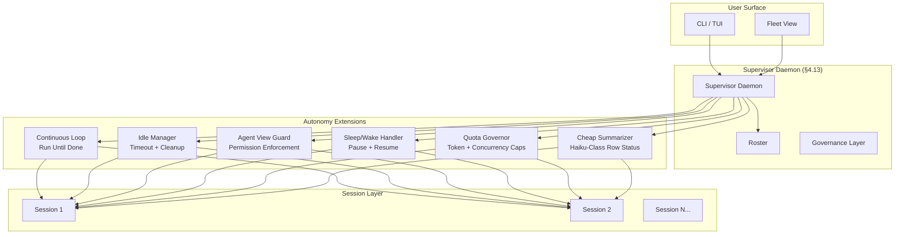
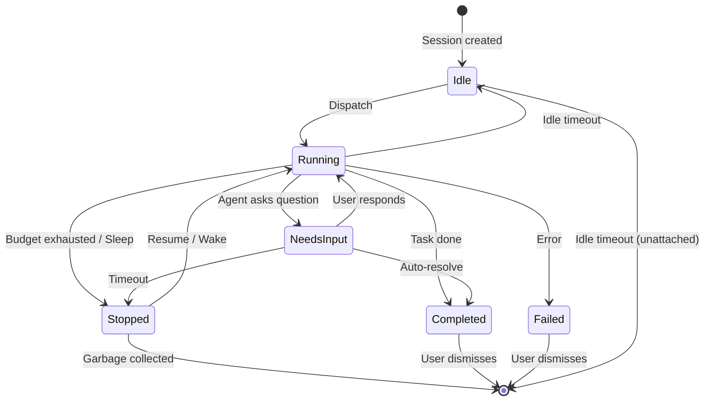

# Full Autonomy — Ultra Plan (§4.14)

> Run 1 — June 3, 2026 | Continuous operation: sessions that run unattended via supervisor daemon
> Status: New plan, builds on §4.13 swarm/fleet foundation

## Plain-Language Summary

Lyra's Full Autonomy mode lets sessions run unattended — you dispatch a task and check back when it's done, or walk away while a long-running research workflow completes. The supervisor daemon manages session lifecycles, idle sessions are cleaned up after a configurable timeout, and an Agent View security guardrail prevents unwatched sessions from using bypass/auto permissions. Cheap-model row summaries provide status updates without expensive LLM calls. Sleep/wake cycles pause on machine sleep and resume on wake. Quota governance enforces per-session token budgets and fleet-level concurrency caps, preventing runaway costs.

## 1. Problem

Lyra currently requires active human attention for every session. There is no mechanism to dispatch a task and walk away, no idle timeout to clean up abandoned sessions, no token budget to prevent cost explosions, and no sleep/wake cycle for laptop users who close the lid. The supervisor daemon from §4.13 provides process-per-session infrastructure but does not yet implement the autonomy patterns: continuous operation, cheap status summaries, unattended permission control, idle management, sleep resilience, or quota enforcement.

## 2. Evidence Synthesis

### 2.1 Supervisor Daemon (from §4.13)

The fleet plan establishes the supervisor daemon with process-per-session management, disk-persisted roster, and session lifecycle primitives (dispatch, attach, peek, stop, respawn, list, cleanup-idle). Autonomy extends this with continuous-operation loops, quota governance, and unattended safety guards.

### 2.2 Claude Code Agent View (§3.1)

Claude Code's Agent View provides the reference pattern for unattended operation:
- Sessions run as background processes managed by a supervisor daemon
- Cheap-model row summaries refresh ≤1/15s for status reporting
- Process liveness model: Alive | ExitedButResumable | LoopSleeping
- Task state model: Working | NeedsInput | Idle | Completed | Failed | Stopped
- Unwatched sessions default to `ask` permission mode (no auto/bypass without prior human accept)

### 2.3 Continuous-Claude Pattern (§3.1)

The "continuous-claude" pattern enables:
- Loop until done: session keeps processing until task completes or budget exhausted
- Checkpoint on interruption: state saved to disk, resume from last checkpoint
- Respawn on daemon restart: recover sessions from disk-persisted roster
- Background dispatch: `lyra --bg "analyze this repo"` or `/bg` from within a session

### 2.4 Idle Session Management (industry standard)

- Default idle timeout: 1 hour for unattached sessions
- Configurable per-session or globally
- Stop (preserve state) vs. kill (no recovery) on timeout
- Notification before timeout (via fleet view or desktop notification)

### 2.5 Quota Governance

From Claude Code and enterprise agent platforms:
- Per-session token budgets (hard limit to prevent runaway costs)
- Fleet-level concurrency caps (max simultaneous sessions)
- Daily/weekly/monthly cost budgets
- Optional escalation: warn → throttle → block

### 2.6 Sleep/Wake Cycle

From laptop usage patterns:
- macOS `NSWorkspace.willSleepNotification` / `NSWorkspace.didWakeNotification`
- Linux logind inhibitor locks / systemd sleep hooks
- Process signal handling (SIGTERM on sleep, resume on wake)
- Pause active sessions, resume from last completed action

### 2.7 Cheap Model Row Summaries

From Claude Code and cost-efficiency research (§4.5 router):
- Haiku-class model for summarization (90% of Sonnet capability at 3x cost savings)
- Summary format: 1-2 sentences describing current activity
- Refresh rate: ≤1/15s to avoid excessive API calls
- Triggered on state transitions (Working→NeedsInput, etc.) or periodic timer

## 3. Proposed Lyra Design

### 3.1 Autonomy Architecture



### 3.2 Continuous-Operation Loop

```python
@dataclass
class ContinuousLoopConfig:
    """Configuration for a continuous-operation session."""
    max_tokens: int | None = None          # Per-session token budget
    max_duration_sec: int | None = None    # Wall-clock timeout
    checkpoint_interval: int = 10          # Actions between checkpoints
    poll_interval_sec: float = 1.0         # Idle poll interval
    termination_conditions: list[str] = field(default_factory=lambda: [
        "task_complete",
        "budget_exhausted",
        "max_iterations",
        "human_interrupt",
    ])

class ContinuousLoop:
    """Run agent loop until termination condition met, checkpointing along the way."""
    
    async def run(self, session: Session, config: ContinuousLoopConfig) -> LoopResult:
        """Run session in continuous-loop mode with checkpointing."""
        while not self._should_terminate(session):
            # 1. Execute next action
            action = await self._plan_next_action(session)
            result = await session.execute(action)
            
            # 2. Checkpoint after action
            await self._checkpoint(session, action, result)
            
            # 3. Check budget
            if config.max_tokens and session.total_tokens > config.max_tokens:
                session.task_state = TaskState.COMPLETED
                session.summary = "Budget exhausted"
                break
                
            # 4. Check if needs input
            if result.needs_input:
                session.task_state = TaskState.NEEDS_INPUT
                session.summary = f"Waiting for input: {result.question[:100]}"
                break
                
        return LoopResult(
            session_id=session.id,
            final_state=session.task_state,
            total_tokens=session.total_tokens,
            actions_executed=session.actions_executed,
        )
    
    async def resume(self, session: Session) -> LoopResult:
        """Resume from last checkpoint."""
        checkpoint = await self._load_checkpoint(session.id)
        if checkpoint:
            session.state = checkpoint.state
            return await self.run(session, checkpoint.config)
        return await self.run(session, ContinuousLoopConfig())
```

### 3.3 Cheap-Model Row Summaries

```python
class CheapSummarizer:
    """Generate cheap row summaries using Haiku-class model."""
    
    def __init__(self, router: ModelRouter):
        # Use cheapest available model via §4.5 router
        self.cheap_model = router.get_model_for_effort("low")
        self.refresh_interval = 15  # seconds
    
    async def summarize(self, session: Session) -> str:
        """Generate 1-2 sentence summary of session state."""
        if not session.recent_actions:
            return "Starting..."
        
        # Truncate recent actions to context window of cheap model
        context = self._truncate_to_window(session.recent_actions, window=2048)
        
        response = await self.cheap_model.chat([
            {"role": "system", "content": "Summarize the current agent activity in 1-2 sentences. Be specific about what's happening."},
            {"role": "user", "content": f"Task: {session.task}\nRecent activity: {context}"}
        ])
        
        return response.content[:200]  # Cap at 200 chars
    
    async def maybe_refresh(self, session: Session) -> str | None:
        """Refresh summary if stale, else return cached."""
        if time.time() - session.last_summary_at > self.refresh_interval:
            session.summary = await self.summarize(session)
            session.last_summary_at = time.time()
        return session.summary
```

### 3.4 Idle Session Management

```python
@dataclass
class IdlePolicy:
    """Policy for managing idle sessions."""
    unattached_timeout_sec: int = 3600        # 1 hour for unattached
    attached_timeout_sec: int = 86400          # 24 hours for attached
    needs_input_timeout_sec: int = 7200        # 2 hours waiting for input
    on_timeout: str = "stop"                   # "stop" or "notify"
    notify_before_sec: int = 300               # 5 minutes warning

class IdleManager:
    """Monitor session activity and enforce idle policies."""
    
    async def check_idle(self, roster: Roster) -> list[TimeoutAction]:
        """Check all sessions for idle timeout violations."""
        actions = []
        for session in roster.sessions:
            elapsed = time.time() - session.last_active_at
            timeout = self._get_timeout(session)
            
            if elapsed > timeout:
                actions.append(TimeoutAction(
                    session_id=session.id,
                    action=self.policy.on_timeout,
                    reason=f"Idle for {elapsed:.0f}s (timeout: {timeout}s)"
                ))
            elif elapsed > timeout - self.policy.notify_before_sec:
                # Send notification
                await self._notify_idle_warning(session)
                
        return actions
    
    def _get_timeout(self, session: Session) -> int:
        if session.task_state == TaskState.NEEDS_INPUT:
            return self.policy.needs_input_timeout_sec
        if not session.is_attached:
            return self.policy.unattached_timeout_sec
        return self.policy.attached_timeout_sec
```

### 3.5 Agent View Security Guardrail

```python
class AgentViewGuard:
    """Prevent unattended sessions from dangerous operations."""
    
    async def check_action(self, session: Session, action: AgentAction) -> PermissionDecision:
        """Enforce permission restrictions on unattended sessions."""
        # Unwatched sessions: no bypass/auto without prior human accept
        if not session.is_attached and session.permission_mode in ("bypass", "auto"):
            if not self._has_prior_accept(session, action):
                return PermissionDecision(
                    allowed=False,
                    reason="Unwatched session cannot use bypass/auto without prior human accept",
                    suggested_action="Attach to session with `lyra attach <id>` or set permission_mode to 'ask'"
                )
        
        # Allowed for unwatched sessions: read-only tools
        if not session.is_attached and self._is_mutating(action):
            return PermissionDecision(
                allowed=False,
                reason="Unwatched sessions cannot perform mutating actions. Attach to approve.",
            )
        
        return PermissionDecision(allowed=True)
```

### 3.6 Sleep/Wake Cycle

```python
class SleepWakeHandler:
    """Handle machine sleep/wake events gracefully."""
    
    def __init__(self, daemon: SupervisorDaemon):
        self.daemon = daemon
        self.sleeping_sessions: dict[str, SessionSnapshot] = {}
    
    async def on_sleep(self):
        """Pause all active sessions on sleep."""
        for session in self.daemon.list_sessions():
            if session.task_state in (TaskState.WORKING, TaskState.LOOP_SLEEPING):
                snapshot = await self._snapshot(session)
                self.sleeping_sessions[session.id] = snapshot
                await self.daemon.stop(session.id, graceful=True)
                session.task_state = TaskState.STOPPED
    
    async def on_wake(self):
        """Resume paused sessions on wake."""
        for session_id, snapshot in self.sleeping_sessions.items():
            handle = await self.daemon.respawn(session_id)
            if snapshot:
                await self._restore(handle, snapshot)
        self.sleeping_sessions.clear()
```

### 3.7 Quota Governance

```python
@dataclass
class QuotaConfig:
    """Per-session and fleet-level budget configuration."""
    # Per-session
    session_max_tokens: int = 10_000_000       # 10M tokens per session
    session_max_cost_usd: float = 5.0           # $5 per session
    session_max_duration_sec: int = 86400       # 24 hours max
    
    # Fleet-level
    fleet_max_concurrent: int = 10              # Max 10 simultaneous sessions
    fleet_daily_tokens: int = 100_000_000       # 100M tokens per day
    fleet_daily_cost_usd: float = 50.0          # $50 per day
    fleet_weekly_cost_usd: float = 250.0        # $250 per week
    
    # Enforcement
    enforcement: str = "warn_then_block"        # warn | throttle | block
    notify_on: list[str] = field(default_factory=lambda: [
        "session_80pct", "fleet_80pct", "blocked"
    ])

class QuotaGovernor:
    """Enforce token and concurrency budgets fleet-wide."""
    
    async def check_session_start(self, config: QuotaConfig) -> bool:
        """Check if a new session can start within fleet quota."""
        active = len(self.daemon.list_sessions(state_filter=[TaskState.WORKING]))
        if active >= config.fleet_max_concurrent:
            raise QuotaExceeded(f"Max concurrent sessions ({config.fleet_max_concurrent}) reached")
        
        daily_tokens = await self._get_daily_usage()
        if daily_tokens >= config.fleet_daily_tokens:
            raise QuotaExceeded(f"Daily token budget ({config.fleet_daily_tokens}) exhausted")
        
        return True
    
    async def check_action(self, session: Session, action: AgentAction) -> bool:
        """Check if action is within session budget."""
        if session.total_tokens >= config.session_max_tokens:
            await self._notify(f"Session {session.id} exceeded token budget")
            return False
        session_cost = await self._estimate_cost(action)
        if session.total_cost + session_cost > config.session_max_cost_usd:
            await self._notify(f"Session {session.id} approaching cost limit")
            return False
        return True
```

### 3.8 Data Model

```dataclass
@dataclass
class AutonomyConfig:
    """Top-level autonomy configuration."""
    continuous_loop: ContinuousLoopConfig
    idle_policy: IdlePolicy
    quota: QuotaConfig
    summary_refresh_sec: int = 15
    default_permission_mode: str = "ask"         # Unwatched default
    
@dataclass
class LoopResult:
    session_id: str
    final_state: TaskState
    total_tokens: int
    actions_executed: int
    duration_sec: float
    checkpoint_path: Path | None

@dataclass
class SessionSnapshot:
    """Point-in-time snapshot for sleep/resume."""
    session_id: str
    state: dict
    task_stack: list[dict]
    environment: dict
    saved_at: float
```

### 3.9 State Machine



## 4. Build Outline

### Phase 1: Continuous Loop + Idle Management (weeks 1-2)

1. **Continuous loop primitive** — `ContinuousLoop.run()` with checkpointing, termination conditions, budget checks. Builds on session lifecycle from §4.13.
2. **Checkpoint system** — Save session state after every N actions; disk-persisted JSON; minimal overhead (<1ms per checkpoint).
3. **Idle manager** — `IdleManager` with configurable timeouts; stop vs. notify actions; per-type timeouts (unattached, attached, needs-input).
4. **`/bg` dispatch command** — Launch session in background from CLI or within running session.
5. **`lyra fleet --bg` flag** — Fleet dispatch defaults to background.

**Dependencies:** §4.13 supervisor daemon (Phase 1)

### Phase 2: Cheap Summaries + Guardrails (weeks 3-4)

1. **Cheap model selector** — Route summary generation to cheapest available model via §4.5 router.
2. **Summary engine** — `CheapSummarizer` with 2048-token window; 1-2 sentence output; cascading triggers (state change + periodic).
3. **Summary caching** — Nocache within refresh interval; force-refresh on state transition.
4. **Agent View security guardrail** — `AgentViewGuard` with mutating vs. read-only action classification; prior-human-accept tracking.
5. **Permission mode enforcement** — Default-to-ask for unwatched; require explicit opt-in for bypass/auto.

**Dependencies:** §4.5 model router

### Phase 3: Sleep/Wake + Quota (weeks 5-6)

1. **Sleep/wake detection** — OS-specific hooks (macOS NSWorkspace, Linux logind/systemd, Windows power events).
2. **Session snapshot/restore** — `SessionSnapshot` with full state serialization; graceful stop on sleep; restore on wake.
3. **Quota governor** — `QuotaGovernor` with per-session + fleet-level budgets; token counting; cost estimation.
4. **Quota enforcement** — Warn → throttle → block escalation; daily/weekly rolling counters.
5. **Quota dashboard** — Fleet view integration showing budget usage; color-coded warnings.

**Dependencies:** §4.13 fleet view

### Phase 4: Enterprise + Polish (weeks 7-8)

1. **Multi-user quota** — Per-user budgets; shared fleet pools; admin override.
2. **Notification integrations** — Desktop notifications, Slack/email on completion, needs-input alerts.
3. **Session priority** — Priority-queue dispatch; preempt low-priority sessions when fleet is full.
4. **Autonomous health checks** — Periodic session health monitoring; auto-restart crashed sessions.
5. **Escalation policies** — If session needs input and user is away, escalate to team/on-call.

## 5. Multi-Provider Note

Autonomy features are provider-agnostic. The continuous loop uses whichever provider the session is configured with. Cheap summaries route to the cheapest model via §4.5 router. Quota governance tracks tokens and cost, which vary by provider pricing. The quota governor must know per-provider pricing to estimate cost from token counts. Provider-agnostic metrics: tokens (universal), duration (universal), actions (universal). Provider-specific: cost (varies), latency (varies).

## 6. (A) Parity vs (B) Breakthrough

**(A) Parity:** Continuous loop + idle management + cheap summaries + sleep/wake + basic quotas. Matches Claude Code's Agent View autonomy features. Sessions run unattended, survive sleep, and respect budgets.

**(B) Breakthrough:** Multi-user quota with escalation policies, priority-queue dispatch with preemption, autonomous health monitoring with auto-restart, enterprise notification integrations, and the Agent View security guardrail (no bypass/auto without prior human accept — a genuine improvement over Claude Code where unattended sessions can use permission escalation). The guardrail is novel: no existing system treats permission mode as a function of watchfulness.

## 7. Baseline Delta

**Changes:** New continuous-loop system, idle manager, cheap-summary engine, sleep/wake handler, quota governor, permission guardrail
**Keeps:** Supervisor daemon (§4.13), session lifecycle, fleet view, worktree isolation
**Replaces:** Nothing — all new capability
**Migration cost:** ~4 new Python modules; ~1000 lines of code; no breaking changes to existing session model

## 8. Expert Review

**Senior SRE/Platform Engineer:** "The quota governor is essential for production deployment. Without it, a runaway session could cost hundreds of dollars. The escalation chain (warn → throttle → block) is correct. Key concern: token counting must be accurate across providers — use tokenizer per provider, not a global estimate."

**Senior Security Engineer:** "The Agent View guardrail is the most important piece and genuinely novel. Most agent platforms let you set permissions but don't consider watchfulness. One gap: what if a user attaches briefly to authorize bypass, then detaches? The session should track that bypass was explicitly accepted for the current task only, not indefinitely."

**Senior Backend Engineer:** "Checkpoint overhead must stay under 1ms — don't serialize the full session state on every checkpoint. Use incremental snapshots (diff-based). The sleep/wake implementation should be tested on all three platforms — macOS sleep notifications are reliable; Linux systemd hooks require DBus; Windows power events need Win32 API."

**Adversarial Skeptic:** "This is 8 weeks of engineering for features that may not get used. Many developers prefer to watch their sessions. And the guardrail means users can't set and forget. Suggestion: ship Phase 1 (continuous loop + idle) in 2 weeks, measure usage, then invest in Phases 2-4 based on adoption data. The quota system should be Phase 1, not Phase 3 — it's the minimum requirement for unattended operation."

**Resolution:** Quota governor moves to Phase 1 (can't have unattended sessions without budgets). Guardrail stays as default for unwatched sessions but adds `--trusted` flag for power users who explicitly opt out. Sleep/wake remains Phase 3 — most laptop users close the lid while watching, not while unattended.

## 9. References
- Claude Code Agent View: https://code.claude.com/docs/en/agent-view
- Claude Code continuous-claude: https://code.claude.com/docs/en/continuous-claude
- Lyra §4.13 Swarm/Fleet Plan
- Lyra §4.5 Model Router (Phase 1 design)

## 10. Changelog
- Run 1: Initial plan written — full autonomy design, continuous loop, idle management, guardrails, sleep/wake, quota governance
