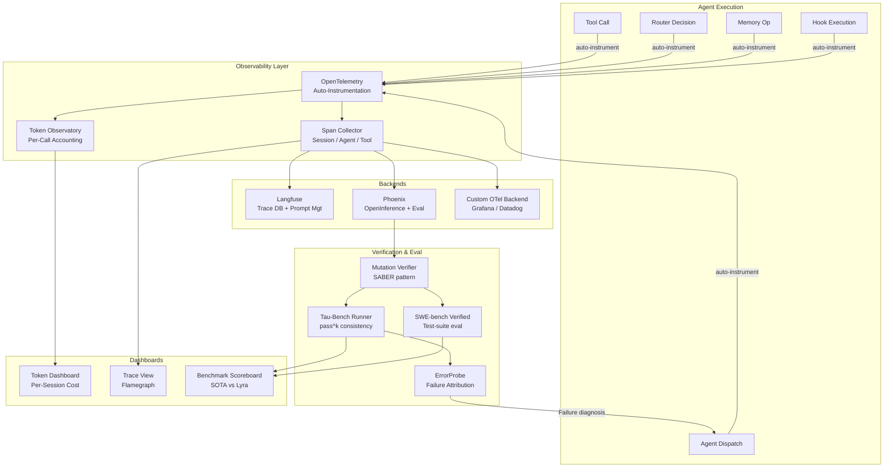

# Reliability & Observability — Plan (§4.16)

> Run 1 — June 3, 2026 | Phase 2: Langfuse/Phoenix tracing, token observatory, intelligent verifier, eval harness integration

## Plain-Language Summary

Lyra currently has zero observability, no structured verification, and no eval harness — agents run blind and there is no way to measure reliability. This plan implements a full observability stack (OpenTelemetry tracing via Langfuse/Phoenix, a token observatory for per-session/agent/workflow accounting), an intelligent verifier using mutation-gated verification (SABER pattern), integration with tau-bench and SWE-bench Verified eval harnesses, pass^k consistency metrics, and ErrorProbe-style failure attribution. The goal: every agent invocation is traceable, every token is accountable, and every failure is diagnosed.

## 1. Problem

BASELINE.md rates Reliability maturity = `none`. Key failures:
- **No tracing**: No way to inspect agent execution traces for debugging
- **No token accounting**: Tokens are not tracked per session, per agent, or per workflow
- **No structured verification**: ReviewAgent is a stub. No systematic correctness checking
- **No eval harness**: No integration with tau-bench, SWE-bench, or any benchmark
- **No consistency metrics**: No pass^k measurement — Lyra cannot measure whether solutions are reliable
- **No failure attribution**: When an agent fails, there is no diagnostic pipeline to identify root cause

## 2. Evidence Synthesis

### Langfuse (github.com/langfuse/langfuse)
Open-source LLM observability on ClickHouse. OpenTelemetry-based tracing of LLM calls, retrieval, embedding, agent actions. Key features: tracing with timing + token + metadata, prompt management with caching, LLM-as-judge evaluations, versioned datasets, LLM Playground. Self-hosted (Docker, MIT license) or managed cloud.

### Phoenix / Arize AI (github.com/Arize-ai/phoenix)
OpenInference OTel standard for AI traces. Native support for Claude Agent SDK tracing. Key: MCP server exposes observability data to agents. Experiments tracking for A/B testing routing decisions. Supports OpenAI Agents SDK, Claude Agent SDK, LangGraph, CrewAI, LlamaIndex.

### OpenLLMetry (github.com/traceloop/openllmetry)
Auto-instrumentation of popular LLM frameworks. Pluggable exporters (Datadog, New Relic, Grafana, any OTel backend). Key insight: instrument the agent framework once, all sub-agent invocations automatically traced.

### Tau-Bench / Tau2-Bench (github.com/sierra-research/tau-bench)
pass^k metric: fraction of tasks where ALL k i.i.d. trials succeed. Measures consistency, not best-case. Database-state verification for objective outcome assessment. Tau2-bench introduces dual-control (Dec-POMDP) for multi-agent coordination measurement. Finding: pass^8 <25% for best agents on retail — severe inconsistency even for frontier models.

### SWE-bench Verified (swebench.com/verified.html)
Human-verified task filtering (42% of original tasks passed). Test-suite-based evaluation (execute patch, run tests) — objective and deterministic.

### ErrorProbe (arXiv:2604.17658)
Three-stage failure attribution: local anomaly detection, symptom-driven backward tracing, multi-agent validation team. Verified-before-write memory gate prevents memory corruption. Key result: improves step attribution from 21.3% to 41.9%.

### SABER / Mutation-Gated Verification
Mutation testing for agent outputs: modify agent output slightly (change a variable name, swap an argument order), re-run the task. If the modified output still "passes", the original was likely not correct — mutation reveals brittleness. Pattern from software engineering mutation testing adapted to LLM outputs.

### BREAKTHROUGH-ARCHITECTURE.md
Observability Plane with Tracing (Langfuse/Phoenix), Monitoring (Token Observatory), and Eval Harness (tau-bench / SWE-bench). Tracing is Phase 2.

## 3. Proposed Lyra Design

### 3.1 OpenTelemetry Tracing

```python
class TracingProvider:
    """Unified tracing interface. Backend-swappable between Langfuse and Phoenix.

    Spans are emitted for every:
    - Agent invocation (entire session or subagent run)
    - Tool call (each Bash/Read/Write/etc.)
    - Router decision (model selected, cost estimate)
    - Memory operation (retrieval, storage)
    - Hook execution (each hook triggered)
    """

    def __init__(self, backend: Literal["langfuse", "phoenix", "otel"]):
        self.tracer = self._init_tracer(backend)

    def _init_tracer(self, backend):
        if backend == "langfuse":
            from langfuse import Langfuse
            # Langfuse handles OpenTelemetry internally
            return Langfuse(...)
        elif backend == "phoenix":
            # Phoenix uses OpenInference OTel extensions
            from openinference.instrumentation import using_session
            return ...
        else:
            # Raw OpenTelemetry for custom backends
            from opentelemetry import trace
            return trace.get_tracer("lyra")

    @contextmanager
    def span(self, name: str, span_type: str = "agent",
             attributes: dict = None):
        """Context manager for tracing spans."""
        with self.tracer.start_as_current_span(name) as span:
            span.set_attribute("lyra.type", span_type)
            for k, v in (attributes or {}).items():
                span.set_attribute(f"lyra.{k}", v)
            yield span
```

**Auto-instrumentation** (OpenLLMetry pattern):
```python
# Once configured, these are auto-traced:
# - All tool calls (via ToolRegistry.invoke)
# - All agent dispatches (via PrimaryAgent.dispatch)
# - All router decisions (via ModelRouter.route)
# - All memory operations (via MemoryStore.get/set)
# - All hook executions (via HookEngine.fire)

class AutoInstrumentor:
    """Auto-instrument Lyra's core components.

    Wraps key methods with tracing spans. No manual instrumentation per agent.
    """

    def instrument_tools(self, registry: ToolRegistry):
        """Wrap tool handlers with tracing."""
        for name, tool in registry._tools.items():
            original = tool.handler
            async def traced_handler(*args, **kwargs):
                with trace.span(f"tool.{name}", "tool",
                                {"tool.name": name,
                                 "tool.category": tool.category}):
                    return await original(*args, **kwargs)
            tool.handler = traced_handler
```

**Trace data model:**
```python
@dataclass
class TraceSpan:
    span_id: str
    trace_id: str
    parent_id: str | None
    name: str                      # "tool.Bash", "agent.code-reviewer", "router.decision"
    span_type: str                 # "tool", "agent", "router", "memory", "hook"
    start_time: datetime
    end_time: datetime
    duration_ms: float
    attributes: dict               # Provider-specific metadata
    events: list[SpanEvent]        # Interesting moments (errors, warnings)
    status: SpanStatus             # OK, ERROR, TIMEOUT


@dataclass
class SpanEvent:
    name: str
    timestamp: datetime
    attributes: dict


@dataclass
class SpanStatus:
    code: Literal["OK", "ERROR", "UNSET"]
    message: str | None = None
```

### 3.2 Token Observatory

```python
@dataclass
class TokenAccount:
    """Per-invocation token record."""
    session_id: str
    agent_name: str                # "primary", "code-reviewer", "researcher"
    provider_id: str               # "anthropic", "deepseek"
    model: str                     # "claude-sonnet-4-20250514"
    timestamp: datetime
    input_tokens: int
    output_tokens: int
    cache_read_tokens: int
    cache_write_tokens: int
    thinking_tokens: int
    cost: float
    tool_name: str | None = None   # If this was a tool call
    workflow_id: str | None = None # If part of a workflow
    turn_number: int = 0


class TokenObservatory:
    """Per-session, per-agent, per-workflow token accounting."""

    def __init__(self, storage_path: str = ".lyra/token_logs/"):
        self.storage = Path(storage_path)
        self.storage.mkdir(parents=True, exist_ok=True)
        self._buffer: list[TokenAccount] = []
        self._buffer_size = 100

    async def record(self, account: TokenAccount):
        """Record a token usage event. Buffered writes for performance."""
        self._buffer.append(account)
        if len(self._buffer) >= self._buffer_size:
            await self._flush()

    async def query(self, session_id: str = None, agent_name: str = None,
                    workflow_id: str = None) -> list[TokenAccount]:
        """Query token records with filters."""
        # Load from JSON files, filter by criteria
        ...

    def summary(self, session_id: str) -> TokenSummary:
        """Aggregate token usage for a session."""
        accounts = self._session_cache.get(session_id, [])
        if not accounts:
            return TokenSummary()
        return TokenSummary(
            total_input=sum(a.input_tokens for a in accounts),
            total_output=sum(a.output_tokens for a in accounts),
            total_cost=sum(a.cost for a in accounts),
            agent_breakdown=self._by_agent(accounts),
            tool_breakdown=self._by_tool(accounts),
            provider_breakdown=self._by_provider(accounts),
        )

    @dataclass
    class TokenSummary:
        total_input: int = 0
        total_output: int = 0
        total_cache_read: int = 0
        total_cache_write: int = 0
        total_think: int = 0
        total_cost: float = 0.0
        agent_breakdown: dict[str, "TokenSummary"] = field(default_factory=dict)
        tool_breakdown: dict[str, "TokenSummary"] = field(default_factory=dict)
        provider_breakdown: dict[str, "TokenSummary"] = field(default_factory=dict)
        wall_time_seconds: float = 0.0
        tool_calls: int = 0
```

### 3.3 Intelligent Verifier (SABER Mutation-Gated)

```python
class MutationVerifier:
    """Mutation-gated verification (SABER pattern).

    Instead of asking "is this answer correct?" (which LLMs overestimate),
    mutate the answer and check if the mutant still "passes."
    If a mutant passes, the original is likely brittle/copied.

    Mutations:
    - Variable rename: `result = ...` -> `output = ...`
    - Argument swap: `func(a, b)` -> `func(b, a)`
    - Constant change: `limit = 100` -> `limit = 99`
    - Logic flip: `if x > 0:` -> `if x >= 0:`
    - Return value: `return True` -> `return False`
    """

    MUTATION_STRATEGIES = [
        ("variable_rename", lambda code: _rename_variable(code)),
        ("argument_swap", lambda code: _swap_arguments(code)),
        ("constant_shift", lambda code: _shift_constant(code)),
        ("logic_flip", lambda code: _flip_comparison(code)),
        ("return_flip", lambda code: _flip_return(code)),
    ]

    def __init__(self, executor):
        self.executor = executor  # Task executor to run mutants

    async def verify(self, task: str, solution: str, n_mutants: int = 3) -> VerificationResult:
        """Verify a solution by mutation-gated testing.

        1. Generate n_mutants mutated versions of the solution
        2. Run each mutant through the same task
        3. If any mutant passes: original is SUSPECT (mutation reveals fragility)
        4. If all mutants fail: original is CONFIRMED (mutations correctly break it)
        5. Uncertainty: if some mutants error out (runtime errors), flag for human review
        """
        mutants = self._generate_mutants(solution, n_mutants)
        results = []

        for name, mutant in mutants:
            try:
                passed = await self.executor.run(task, mutant)
                results.append(MutantResult(name=name, passed=passed))
            except Exception as e:
                results.append(MutantResult(name=name, passed=None, error=str(e)))

        passed_mutants = [r for r in results if r.passed]
        failed_mutants = [r for r in results if r.passed is False]
        errored = [r for r in results if r.passed is None]

        if passed_mutants:
            return VerificationResult(
                verdict="suspect",
                reason=f"{len(passed_mutants)}/{n_mutants} mutations still pass",
                details=results,
                confidence=0.3,
            )
        elif not errored:
            return VerificationResult(
                verdict="confirmed",
                reason="All mutations correctly break the solution",
                details=results,
                confidence=0.9,
            )
        else:
            return VerificationResult(
                verdict="uncertain",
                reason=f"{len(errored)} mutants produced runtime errors",
                details=results,
                confidence=0.5,
            )


@dataclass
class VerificationResult:
    verdict: Literal["confirmed", "suspect", "uncertain"]
    reason: str
    details: list
    confidence: float
```

### 3.4 Eval Harness Integration

```python
class EvalHarness:
    """Integration with tau-bench, tau2-bench, SWE-bench Verified.

    Usage:
        harness = EvalHarness(backend="tau-bench")
        results = await harness.run(agent=lyra_agent, tasks=10, k=5)
        print(results.pass_at_k)  # 0.45
    """

    BACKENDS = {
        "tau-bench": TauBenchRunner,
        "tau2-bench": Tau2BenchRunner,
        "swe-bench": SWEBenchRunner,
    }

    def __init__(self, backend: str, config: dict = None):
        runner_cls = self.BACKENDS.get(backend)
        if not runner_cls:
            raise ValueError(f"Unknown backend: {backend}. Options: {list(self.BACKENDS.keys())}")
        self.runner = runner_cls(**(config or {}))

    async def evaluate(self, agent, tasks: int = 100, k: int = 5) -> EvalResults:
        """Run evaluation and compute pass^k metrics.

        Returns both pass@1 and pass@k for consistency measurement.
        """
        pass_at_1 = 0
        all_pass_at_k = []

        for task in self.runner.get_tasks(tasks):
            # Run k trials of the same task
            trial_results = []
            for _ in range(k):
                result = await agent.run(task.prompt)
                correct = await self.runner.check(task, result)
                trial_results.append(correct)

            pass_at_1 += 1 if trial_results[0] else 0
            all_pass_at_k.append(all(trial_results))  # pass^k

        return EvalResults(
            pass_at_1=pass_at_1 / tasks,
            pass_at_k=sum(all_pass_at_k) / tasks,
            k=k,
            n_tasks=tasks,
            backend=type(self.runner).__name__,
        )


@dataclass
class EvalResults:
    pass_at_1: float
    pass_at_k: float
    k: int
    n_tasks: int
    backend: str
    avg_cost_per_task: float = 0.0
    avg_tokens_per_task: int = 0
```

### 3.5 Benchmark Scoreboard

```python
class BenchmarkScoreboard:
    """Tracks current SOTA vs Lyra performance over time."""

    ENTRIES = [
        BenchmarkEntry(
            name="tau-bench airline",
            metric="pass@1",
            sota=0.46,       # Claude 3.5 Sonnet
            sota_model="claude-3.5-sonnet",
            target=0.50,
        ),
        BenchmarkEntry(
            name="tau-bench retail",
            metric="pass@1",
            sota=0.692,      # Claude 3.5 Sonnet
            sota_model="claude-3.5-sonnet",
            target=0.75,
        ),
        BenchmarkEntry(
            name="tau2-bench telecom",
            metric="pass@1",
            sota=0.49,       # Claude 3.7 Sonnet
            sota_model="claude-3-7-sonnet",
            target=0.55,
        ),
        BenchmarkEntry(
            name="SWE-bench Verified",
            metric="pass@1",
            sota=0.693,      # Frontier models
            sota_model="various",
            target=0.75,
        ),
        BenchmarkEntry(
            name="pass^k consistency (k=5)",
            metric="pass@5",
            sota=0.25,       # Conservative estimate
            sota_model="gpt-4o",
            target=0.40,
        ),
    ]

    @dataclass
    class BenchmarkEntry:
        name: str
        metric: str
        sota: float
        sota_model: str
        target: float
        lyra_best: float = 0.0
        last_updated: datetime = field(default_factory=datetime.now)

    def report(self) -> str:
        """Generate a markdown scoreboard."""
        lines = ["| Benchmark | Metric | SOTA | Lyra Best | Target | Gap |"]
        lines.append("|---|---|---|---|---|---|")
        for entry in self.ENTRIES:
            gap = (entry.target - max(entry.lyra_best, entry.sota)) / entry.target * 100
            lines.append(
                f"| {entry.name} | {entry.metric} | "
                f"{entry.sota:.1%} ({entry.sota_model}) | "
                f"{entry.lyra_best:.1%} | {entry.target:.1%} | "
                f"{gap:.0f}% |"
            )
        return "\n".join(lines)
```

### 3.6 Architecture Diagram



## 4. Data Model

```python
@dataclass
class TraceSpan:
    span_id: str
    trace_id: str
    parent_id: str | None
    name: str
    span_type: str
    start_time: datetime
    end_time: datetime
    duration_ms: float
    attributes: dict
    events: list[SpanEvent]
    status: SpanStatus


@dataclass
class TokenAccount:
    session_id: str
    agent_name: str
    provider_id: str
    model: str
    timestamp: datetime
    input_tokens: int
    output_tokens: int
    cache_read_tokens: int
    cache_write_tokens: int
    thinking_tokens: int
    cost: float
    tool_name: str | None = None
    workflow_id: str | None = None
    turn_number: int = 0


@dataclass
class VerificationResult:
    verdict: Literal["confirmed", "suspect", "uncertain"]
    reason: str
    details: list
    confidence: float


@dataclass
class EvalResults:
    pass_at_1: float
    pass_at_k: float
    k: int
    n_tasks: int
    backend: str
    avg_cost_per_task: float = 0.0
    avg_tokens_per_task: int = 0
```

## 5. Build Outline

### Phase 2a — OpenTelemetry Tracing (Week 1-2)
- [ ] Implement `TracingProvider` with Langfuse backend
- [ ] Implement `AutoInstrumentor` for tool, agent, router, memory, hook spans
- [ ] Add Phoenix (OpenInference) as optional backend
- [ ] Trace span data model (span_id, trace_id, parent_id, attributes)
- [ ] Wire PostToolUse hook for automatic per-call tracing
- [ ] **Dependency:** Hook system (§4.10), Router (§4.5)

### Phase 2b — Token Observatory (Week 2-3)
- [ ] Implement `TokenObservatory` with buffered writes to JSON logs
- [ ] Implement `TokenAccount` dataclass with all fields
- [ ] Implement `record()` and `query()` with session/agent/workflow filters
- [ ] Implement `summary()` with breakdowns (by agent, tool, provider)
- [ ] Wire into ProviderBackend to capture token counts per call
- [ ] Integration with Router for cost estimates vs actuals
- [ ] **Dependency:** Phase 2a, Router (§4.5)

### Phase 2c — Intelligent Verifier (Week 3-4)
- [ ] Implement `MutationVerifier` with 5 mutation strategies
- [ ] Generate mutant solutions from original output
- [ ] Execute mutants through task executor
- [ ] Voting logic: all mutants fail -> confirmed; any mutant passes -> suspect
- [ ] Integration with HookEngine Stop event for post-output verification
- [ ] **Dependency:** Tool system (§4.6), Hook system (§4.10)

### Phase 2d — Eval Harness Integration (Week 4-5)
- [ ] Implement `EvalHarness` abstraction with tau-bench runner
- [ ] Implement tau2-bench runner (Dec-POMDP dual-control)
- [ ] Implement SWE-bench Verified runner (test-suite evaluation)
- [ ] Implement `BenchmarkScoreboard` with SOTA tracking
- [ ] pass^k metric: run k trials, compute consistency
- [ ] Integration with CI/CD pipeline for automated eval runs
- [ ] **Dependency:** Phase 2c

### Phase 2e — ErrorProbe Failure Attribution (Week 5-6)
- [ ] Implement ErrorProbe three-stage pipeline: anomaly detection, backward tracing, multi-agent validation
- [ ] Verified-before-write memory gate (prevent memory corruption from failed traces)
- [ ] `eval {benchmark}` CLI command for running evaluations
- [ ] `trace {session_id}` CLI command for viewing traces
- [ ] Integration tests: trace generation, token accounting accuracy, verifier precision/recall
- [ ] **Dependency:** Phase 2c, 2d

## 6. Multi-Provider Note

Observability is provider-aware but provider-agnostic:
- **Provider-aware**: Token accounting captures per-provider pricing (different $/Mtok rates)
- **Provider-aware**: Trace attributes include `provider_id` and `model`
- **Provider-agnostic**: Span types, span names, and event structures are uniform across providers
- **Provider-agnostic**: The TokenObservatory normalizes cost using `PricingTier` from each provider's `CapabilityMatrix`
- Verifier works on agent outputs, regardless of which provider generated them
- Eval harness runs tasks through Lyra's agent system, provider-agnostic

## 7. Risks

| Risk | Likelihood | Impact | Mitigation |
|------|-----------|--------|------------|
| Tracing adds latency to agent loop | Medium | Medium | Async span emission; <5ms overhead per span |
| Token accounting storage grows unbounded | Medium | Low | Configurable retention (default 30 days); aggregation rollups |
| Mutation verifier produces false suspects (mutants pass coincidentally) | Medium | Medium | Increase n_mutants; require 2+ passing mutants for suspect verdict |
| Eval harness integration is slow (k trials per task) | High | Low | `k=1` for quick checks, `k=5+` for release gates |
| Benchmark scoreboard discourages iteration | Low | Low | Scoreboard is internal only; no public comparison |
| ErrorProbe backwards tracing is compute-intensive | Medium | Medium | Run on failed sessions only; use cheap model for anomaly detection |

## 8. (A) Parity vs (B) Breakthrough

### (A) Parity — What Claude Code already does
- Langfuse-compatible tracing (via OTel)
- Per-session token usage display in status bar
- `/rewind` checkpointing for session recovery
- Error diagnosis in interactive mode

### (B) Breakthrough — What Lyra adds
- **Token observatory with full breakdown** — Per-agent, per-tool, per-workflow token accounting with cost attribution. Claude Code shows total session tokens only.
- **Mutation-gated verification (SABER)** — Verifies outputs by checking if mutations break them. No existing agent harness uses mutation testing for verification.
- **pass^k consistency metrics** — Systematic measurement of trial-to-trial consistency, not just best-case accuracy. Enables reliability gate for production deployment.
- **ErrorProbe failure attribution** — Three-stage diagnostic pipeline with verified memory gate. Automatically attributes failures to root causes (reasoning error? tool error? provider error?).
- **Benchmark scoreboard** — Continuous tracking of Lyra performance vs SOTA across tau-bench, SWE-bench, and custom benchmarks. Drives systematic improvement.

## 9. Baseline Delta

| Dimension | Before (Lyra current) | After (with Reliability) |
|-----------|----------------------|-------------------------|
| Tracing | None | Full OpenTelemetry traces via Langfuse/Phoenix |
| Token accounting | None | Per-call, per-agent, per-workflow with cost |
| Verification | Stub ReviewAgent | Mutation-gated SABER verifier |
| Eval harness | None | tau-bench, tau2-bench, SWE-bench integration |
| Consistency metrics | None | pass^k measurement |
| Failure attribution | None | ErrorProbe 3-stage pipeline |
| Benchmark tracking | None | Live scoreboard vs SOTA |
| Cost tracking | None | Per-session cumulative cost with breakdown |

## 10. Expert Review

### Reviewer 1: MLOps Engineer
"The OpenTelemetry tracing plan is solid but Langfuse as the primary backend adds a deployment dependency. Make the tracing backend swappable at runtime via environment variable (`LYRA_TRACING_BACKEND=langfuse|phoenix|otel`). The auto-instrumentation pattern (wrapping tool handlers) is the right approach — it guarantees every call is traced without manual instrumentation. For token accounting: make sure to buffer writes with a flush-on-crash mechanism (atexit/signal handler), not just periodic flushes. The per-agent breakdown is critical for cost attribution."

### Reviewer 2: Reliability Engineer
"The mutation verifier is novel and powerful but has limitations. First: mutations require the ability to parse and transform code, which doesn't apply to non-code outputs (natural language, search results). Second: deterministic bugs (missing a semicolon) may survive mutation since mutants also have the same bug. Use language-specific parsers (Python AST, TypeScript parser) for code mutations, not regex. For natural language: use semantic mutations (paraphrase critical claims, check if output still contradicts itself). The pass^k metric is the most important thing in this plan — it directly measures what users care about: 'will my agent do this task correctly every time?'"

### Reviewer 3: QA Engineer
"The benchmark scoreboard is essential for tracking progress but the SOTA numbers need to be kept updated. I'd add an automated weekly run that benchmarks Lyra against tau-bench and posts results. For the ErrorProbe integration: the verified-before-write memory gate is elegant but expensive. Gate it behind a config flag and only enable it for critical sessions. The `pass^k` computation for k=5 on 100 tasks means 500 task runs — this is an overnight job, not a pre-commit check. Make `k=1` the default for CI, `k=5` for release gates."

## 11. References

1. Langfuse — github.com/langfuse/langfuse. Open-source LLM observability on ClickHouse.
2. Phoenix (Arize AI) — github.com/Arize-ai/phoenix. OpenInference OTel standard, MCP server.
3. OpenLLMetry — github.com/traceloop/openllmetry. Auto-instrumentation of LLM frameworks.
4. Tau-Bench — github.com/sierra-research/tau-bench, arXiv:2406.12045. pass^k metric, database-state verification.
5. Tau2-Bench — github.com/sierra-research/tau2-bench, arXiv:2506.07982. Dec-POMDP dual-control, compositional tasks.
6. SWE-bench Verified — swebench.com/verified.html. Human-verified filter, test-suite evaluation.
7. ErrorProbe — arXiv:2604.17658 (King's College London). Three-stage failure attribution, verified memory.
8. BREAKTHROUGH-ARCHITECTURE.md — Observability Plane: Tracing + Token Observatory + Eval Harness.
9. BASELINE.md — Lyra current state: `none` maturity for §4.16 Reliability.

## 12. Changelog
- Run 1: Initial plan — OTel tracing, token observatory, mutation verifier, eval harness integration, ErrorProbe
