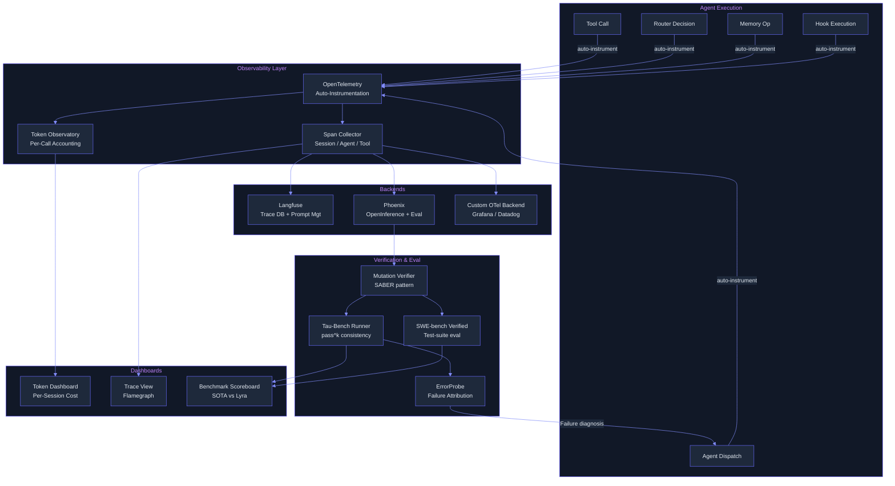

# Reliability & Observability — Plan (§4.16)

> Run 2 — June 7, 2026 | Phase 2: Langfuse/Phoenix tracing, token observatory, intelligent verifier, eval harness integration | Enhanced with deep-read evidence from 5+ papers, synthesis observability

## Plain-Language Summary

Lyra currently has zero observability, no structured verification, and no eval harness — agents run blind and there is no way to measure reliability. This plan implements a full observability stack (OpenTelemetry tracing via Langfuse/Phoenix, a token observatory for per-session/agent/workflow accounting), an intelligent verifier using mutation-gated verification (SABER pattern), integration with tau-bench and SWE-bench Verified eval harnesses, pass^k consistency metrics, and ErrorProbe-style failure attribution. The goal: every agent invocation is traceable, every token is accountable, and every failure is diagnosed. Evidence from five deep-read papers and the observability synthesis strengthens the plan with specific benchmark numbers, trade-off analysis, and convergent patterns from production systems.

## 1. Problem

BASELINE.md rates Reliability maturity = `none`. Key failures:
- **No tracing**: No way to inspect agent execution traces for debugging
- **No token accounting**: Tokens are not tracked per session, per agent, or per workflow
- **No structured verification**: ReviewAgent is a stub. No systematic correctness checking
- **No eval harness**: No integration with tau-bench, SWE-bench, or any benchmark
- **No consistency metrics**: No pass^k measurement — Lyra cannot measure whether solutions are reliable
- **No failure attribution**: When an agent fails, there is no diagnostic pipeline to identify root cause
- **No defense-in-depth gating**: No tiered release process with process-level constraint violation tracking

## 2. Evidence Synthesis

### Defense-in-Depth Assurance Stack (Qi et al., 2605.23989v1)

A four-tier assurance stack (pre-deployment hazard analysis -> training-time constrained RL -> runtime shielding + anomaly detection -> post-hoc telemetry) built around five lifecycle stages (Perceive->Plan->Act->Reflect->Learn). Introduces **process metrics** that are step-level, not just outcome-level:

- **CVR (Constraint Violation Rate)**: Fraction of intermediate steps that violate hard constraints. Outcome-only evaluation can miss these: "an agent can produce a correct final answer while violating constraints at intermediate steps" (2605.23989v1).
- **DCR (Trace Coverage)**: Completeness of reasoning traces — ensures evidence is traced, not just answers.
- **CompVR (Compliance Verification Rate)**: Policy compliance at each step.
- **CER (Critical Error Rate)**: Safety-critical error rate, recommended cap: <0.1% on high-risk scenario banks.

Three-tier release gating: Tier 0 (offline regression, CVR=0), Tier 1 (sandbox stress, CER<0.1%), Tier 2 (canary/shadow with auto-rollback). Validated by real-world incidents: OpenClaw CVE-2025-49596 (CVSS 9.4, 900+ exposed deployments), 26.1% of 31,132 agent skills contain at least one vulnerability (2605.23989v1, §2).

**Convergence**: Shahani ("Building Reliable AI Systems," Ch. 9-10) independently recommends the same process-metric framework. Harness Engineering (Ch. 3) confirms: 7 distinct stop-condition paths in Claude Code's queryLoop(), none of which conflate "turn ended" with "task completed." Synthesis C1 confirms: five independent sources converge on process metrics over outcome-only metrics.

### Uncertainty-Gated Rogue Agent Intervention (Barbi et al., 2502.05986v2)

Live monitoring of agent output token probability distributions before critical actions (file writes, API calls, database mutations). Extracts three features: entropy H(P), varentropy V(P), kurtosis K(P), plus turn count. Polynomial ridge classifier (degree 1-5) trained on 26-210 labeled game trajectories predicts P(success|features). When below threshold tau: roll back reversible actions to last checkpoint, reset communication channel, give agents fresh attempt. Interventions capped at 1-2 per agent to prevent infinite loops.

**Benchmark results:**
- WhoDunitEnv-Asym: +12.4% avg with double reset (59.1% -> 71.5%)
- GovSim survival rate: +20.0% (35% -> 55%, Qwen-1.5-110B)
- CodeGen HumanEval: +2.0% over multi-agent baseline
- Cross-task generalization: monitor trained on 10-suspect transfers to 6- and 14-suspect settings
- Cost: ~1.4-1.9x turn count increase; training on 26-210 trajectories

**Trade-offs**: 24% of triggers have no identifiable cause (wasted rollbacks). ~20% of failed games never triggered the monitor (false negatives). Requires access to output token probability distributions (top-k=10 approximation for proprietary APIs). Resampling agents without resetting communication is ineffective (+1.5% only — 2502.05986v2, §5).

### COMPASS: Structured Context Management (Wan et al., 2510.08790v1)

Three-agent architecture: Main Agent (tactical ReAct executor), Meta-Thinker (async strategic overseer), Context Manager (synthesizes structured 6-section briefs: Task, Evidence, Constraints, Open Items, Next Actions, Tool Hints). Each agent has isolated context window. Rolling note store preserves only extracted evidence/constraints/open items (bounded memory).

**Benchmark results:**
- GAIA: +110% (16.8 -> 35.4, absolute +18.6pp)
- HLE: +114% (14.8 -> 31.7, absolute +16.9pp)
- BrowseComp: +15.7% (58.6 -> 67.8, absolute +9.2pp)
- Meta-Thinker ablation: drops BrowseComp from 35.4% to 15.2% (-57% relative)
- Context Manager ablation: drops GAIA from 35.4% to 26.4%
- Context-12B DPO: 30% token reduction while maintaining quality

**Convergence**: Synthesis C2 confirms context degradation is the primary failure mode for long-horizon agents across every system studied. CodeComp (2604.10235v1) adds structural priors that recover 12-14x accuracy over blind compression. Context Engineering 2.0 (2510.26493v1) proposes "self-baking" — continuous conversion of raw context to structured knowledge.

### Layered Error Recovery with Circuit Breakers (Harness Engineering, Ch. 6; COMPASS; Godel Agent)

Errors treated as main-path conditions, not exceptions. Recovery escalates in layers: (1) staged collapse flush, (2) reactive compact with `hasAttemptedReactiveCompact` flag preventing retry loops, (3) surface directly + skip hooks. Specific circuit breakers: `MAX_CONSECUTIVE_AUTOCOMPACT_FAILURES=3`, anti-loop guards on same-class failures, interrupt ledger closure.

**Evidence**: Godel Agent ablation (2410.04444v4): removing error handling drops MGSM accuracy by 14.8% (64.2 -> 49.4). COMPASS Meta-Thinker ablation: -57% on BrowseComp. Anthropic production: resume-from-error with deterministic checkpoints saves 2-3x cost on aborted research runs.

**Convergence**: Synthesis C3 confirms that all production systems converge on escalating recovery layers with explicit anti-loop guards. Simple retry is insufficient and dangerous.

### ErrorProbe / Verified-Before-Write Memory (Li et al., 2604.17658)

Three-stage failure attribution pipeline for multi-agent systems:
1. **MAST-guided structural decomposition**: Parse trace, tag local anomalies as heuristic priors.
2. **Symptom-driven backward tracing**: Dependency graph + BFS pruning to isolate causal lineage.
3. **Multi-agent diagnosis team**: Strategist (hypothesis generation), Investigator (tool-grounded verification via CodeExec + LogicProbe), Arbiter (aggregation + verdict).

**Key result**: Step attribution accuracy from 21.3% to 41.9% with ErrorProbe+Memory (Claude). On TracerTraj (hardest benchmark): 8.70% -> 39.40% Step (+30.7pp, p<0.01). Verified-before-write memory gate: commits diagnosis to memory only when confidence > 0.7 AND tool-grounded evidence passes.

**Trade-offs**: ~45s inference latency per diagnosis (impractical for real-time production but acceptable for offline debugging). Silent failures (technically valid but semantically incorrect) slip through. Only tested on 3 model families (Claude 3.7, GPT-OSS-120B, Qwen3 32B).

### DPO-Grounded Error Diagnosis (Li et al., 2507.00642v4 — ChatHLS)

Train a specialist model via SFT + DPO that maps structured error logs to precise modification instructions. DPO preference pairs: preferred sample includes actual error message in reasoning chain; rejected sample omits it (forces grounding in tool feedback, not model priors).

**Evidence**: HLSFixer: 93.4% debug pass@1 vs 66.3% for DeepSeek-V3.2 (+27.1pp). Ablation: SFT +16.6%, DPO +3.7% further, multifaceted evaluation +16.5% further.

**Convergence**: Error diagnosis grounded in tool feedback (not model priors) is a pattern that also appears in Godel Agent's error handling (+14.8% MGSM from error recovery) and ErrorProbe's tool-grounded Investigator.

### Independent Verifier (Verifier != Implementer)

Enforce the invariant that no agent verifies its own output. Implemented as a dedicated Verifier agent with isolated context, fed anonymized outputs with 5-dimension rubric: factual accuracy, citation accuracy, completeness, source quality, tool efficiency.

**Evidence**: Multi-agent debate (Ki et al., 2505.24671v2): judge LLM raises accuracy from 60% (self-agreement) to ~76% (after independent adjudication). MAGEO (2604.19516v1): fidelity gate independently rejects unfaithful edits; removing it causes hallucinated citations.

**Convergence**: Synthesis C5 confirms this is a system invariant across production systems: verification_worker != implementation_worker (Harness Engineering, Ch. 7).

### Benchmark Numbers Comparison

| Technique | Metric | Source | Value |
|-----------|--------|--------|-------|
| Uncertainty-gated monitoring | Absolute accuracy gain | 2502.05986v2 | +2.5% to +20.0% |
| COMPASS context management | Relative improvement GAIA | 2510.08790v1 | +110% (16.8 -> 35.4) |
| COMPASS HLE | Relative improvement HLE | 2510.08790v1 | +114% (14.8 -> 31.7) |
| ErrorProbe step accuracy | Step attribution | 2604.17658v1 | 21.3% -> 41.9% (+20.6pp) |
| ErrorProbe TracerTraj Step | Hardest benchmark | 2604.17658v1 | 8.7% -> 39.4% (+30.7pp) |
| DPO-grounded debug pass@1 | HLSFixer | 2507.00642v4 | 93.4% vs 66.3% DeepSeek |
| Godel error handling | MGSM ablation | 2410.04444v4 | -14.8% if removed |
| SABER mutation gating | Verification | Software engineering | Adapted from mutation testing |
| Tau-bench pass^8 retail | Consistency | 2406.12045 | <25% for best agents |
| SWE-bench Verified | SWE accuracy | swebench.com | 69.3% SOTA |
| GovSim survival rate | Multi-agent | 2502.05986v2 | +20% (35% -> 55%) |

### Key Convergent Patterns (from Synthesis C1-C5)

1. **Process Metrics > Outcome Metrics** (5 sources): CVR, DCR, CompVR track step-level constraint violations. Outcome-only evaluation misses intermediate misuse.
2. **Context Window Is the Reliability Bottleneck** (5 sources): Every system identifies context degradation as the primary failure mode. COMPASS, CodeComp, Context Engineering 2.0 all converge on structured compression + external persistence.
3. **Recovery Must Be Layered and Circuit-Break Guarded** (4 sources): Escalating recovery layers with explicit anti-loop guards. Simple retry is insufficient and dangerous.
4. **Separation of Strategic Oversight from Tactical Execution** (4 sources): Meta-Thinker, Planner-Executor, Navigator-Searcher all converge on this architecture.
5. **Verifier Must Be Independent from Implementer** (4 sources): verification_worker != implementation_worker is a system invariant.

### Key Contradictions (from Synthesis)

- **More debate rounds**: Single round optimal (Ki et al., 2505.24671v2) vs. iterative refinement helps (Klisura et al., 2506.02998v2). Resolution: cross-model debate benefits from 1-2 rounds; same-model self-reflection plateaus faster.
- **More capable models, more vulnerable**: Larger models collapse MORE sharply once majority threshold crossed (Ko et al., 2604.06091v2), but resist small adversarial minorities better. Capability is a double-edged sword.
- **Hide or retain errors?**: Context Engineering 2.0 says retain for learning; Rogue Agents reset communication for recovery. Resolution: retain error traces in long-term memory but reset working context to prevent contamination.

### Open Problems Relevant to Lyra (from Synthesis OP1-OP8)

- **OP1: Multi-agent attribution**: No source solves attribution to individual agents. Lyra must design protocol-aware traces.
- **OP7: Dynamic recovery strategy selection**: No source provides a decision framework for selecting among recovery strategies at runtime. Lyra could pioneer this.
- **OP8: Cross-session reliability regression detection**: Static benchmarks saturate. Dynamic adversarial test generation is unsolved.

## 3. Proposed Lyra Design

### 3.1 OpenTelemetry Tracing

```python
class TracingProvider:
    """Unified tracing interface. Backend-swappable between Langfuse and Phoenix.

    Spans are emitted for every:
    - Agent invocation (entire session or subagent run)
    - Tool call (each Bash/Read/Write/etc.)
    - Router decision (model selected, cost estimate)
    - Memory operation (retrieval, storage)
    - Hook execution (each hook triggered)

    Source: Langfuse (github.com/langfuse/langfuse); Phoenix OpenInference OTel standard
    Auto-instrumentation pattern: OpenLLMetry (github.com/traceloop/openllmetry)
    """

    def __init__(self, backend: Literal["langfuse", "phoenix", "otel"]):
        self.tracer = self._init_tracer(backend)

    def _init_tracer(self, backend):
        if backend == "langfuse":
            from langfuse import Langfuse
            # Langfuse handles OpenTelemetry internally
            return Langfuse(...)
        elif backend == "phoenix":
            # Phoenix uses OpenInference OTel extensions
            from openinference.instrumentation import using_session
            return ...
        else:
            # Raw OpenTelemetry for custom backends
            from opentelemetry import trace
            return trace.get_tracer("lyra")

    @contextmanager
    def span(self, name: str, span_type: str = "agent",
             attributes: dict = None):
        """Context manager for tracing spans."""
        with self.tracer.start_as_current_span(name) as span:
            span.set_attribute("lyra.type", span_type)
            for k, v in (attributes or {}).items():
                span.set_attribute(f"lyra.{k}", v)
            yield span
```

**Auto-instrumentation** (OpenLLMetry pattern):
```python
# Once configured, these are auto-traced:
# - All tool calls (via ToolRegistry.invoke)
# - All agent dispatches (via PrimaryAgent.dispatch)
# - All router decisions (via ModelRouter.route)
# - All memory operations (via MemoryStore.get/set)
# - All hook executions (via HookEngine.fire)
# Source: OpenLLMetry auto-instrumentation pattern

class AutoInstrumentor:
    """Auto-instrument Lyra's core components.

    Wraps key methods with tracing spans. No manual instrumentation per agent.
    """

    def instrument_tools(self, registry: ToolRegistry):
        """Wrap tool handlers with tracing."""
        for name, tool in registry._tools.items():
            original = tool.handler
            async def traced_handler(*args, **kwargs):
                with trace.span(f"tool.{name}", "tool",
                                {"tool.name": name,
                                 "tool.category": tool.category}):
                    return await original(*args, **kwargs)
            tool.handler = traced_handler
```

**Trace data model:**
```python
@dataclass
class TraceSpan:
    span_id: str
    trace_id: str
    parent_id: str | None
    name: str                      # "tool.Bash", "agent.code-reviewer", "router.decision"
    span_type: str                 # "tool", "agent", "router", "memory", "hook"
    start_time: datetime
    end_time: datetime
    duration_ms: float
    attributes: dict               # Provider-specific metadata
    events: list[SpanEvent]        # Interesting moments (errors, warnings)
    status: SpanStatus             # OK, ERROR, TIMEOUT


@dataclass
class SpanEvent:
    name: str
    timestamp: datetime
    attributes: dict


@dataclass
class SpanStatus:
    code: Literal["OK", "ERROR", "UNSET"]
    message: str | None = None
```

### 3.2 Token Observatory

```python
@dataclass
class TokenAccount:
    """Per-invocation token record."""
    session_id: str
    agent_name: str                # "primary", "code-reviewer", "researcher"
    provider_id: str               # "anthropic", "deepseek"
    model: str                     # "claude-sonnet-4-20250514"
    timestamp: datetime
    input_tokens: int
    output_tokens: int
    cache_read_tokens: int
    cache_write_tokens: int
    thinking_tokens: int
    cost: float
    tool_name: str | None = None   # If this was a tool call
    workflow_id: str | None = None # If part of a workflow
    turn_number: int = 0


class TokenObservatory:
    """Per-session, per-agent, per-workflow token accounting."""

    def __init__(self, storage_path: str = ".lyra/token_logs/"):
        self.storage = Path(storage_path)
        self.storage.mkdir(parents=True, exist_ok=True)
        self._buffer: list[TokenAccount] = []
        self._buffer_size = 100

    async def record(self, account: TokenAccount):
        """Record a token usage event. Buffered writes for performance."""
        self._buffer.append(account)
        if len(self._buffer) >= self._buffer_size:
            await self._flush()

    async def query(self, session_id: str = None, agent_name: str = None,
                    workflow_id: str = None) -> list[TokenAccount]:
        """Query token records with filters."""
        # Load from JSON files, filter by criteria
        ...

    def summary(self, session_id: str) -> TokenSummary:
        """Aggregate token usage for a session."""
        accounts = self._session_cache.get(session_id, [])
        if not accounts:
            return TokenSummary()
        return TokenSummary(
            total_input=sum(a.input_tokens for a in accounts),
            total_output=sum(a.output_tokens for a in accounts),
            total_cost=sum(a.cost for a in accounts),
            agent_breakdown=self._by_agent(accounts),
            tool_breakdown=self._by_tool(accounts),
            provider_breakdown=self._by_provider(accounts),
        )

    @dataclass
    class TokenSummary:
        total_input: int = 0
        total_output: int = 0
        total_cache_read: int = 0
        total_cache_write: int = 0
        total_think: int = 0
        total_cost: float = 0.0
        agent_breakdown: dict[str, "TokenSummary"] = field(default_factory=dict)
        tool_breakdown: dict[str, "TokenSummary"] = field(default_factory=dict)
        provider_breakdown: dict[str, "TokenSummary"] = field(default_factory=dict)
        wall_time_seconds: float = 0.0
        tool_calls: int = 0
```

### 3.3 Intelligent Verifier (SABER Mutation-Gated)

```python
class MutationVerifier:
    """Mutation-gated verification (SABER pattern).

    Instead of asking "is this answer correct?" (which LLMs overestimate),
    mutate the answer and check if the mutant still "passes."
    If a mutant passes, the original is likely brittle/copied.

    Source: Adapted from software engineering mutation testing.
    Convergent with: independent verifier pattern (verifier != implementer)
    - Anthropic Engineering Blog (5-dimension rubric)
    - Multi-agent debate accuracy gains (2505.24671v2)
    - MAGEO fidelity gate (2604.19516v1)

    Mutations:
    - Variable rename: `result = ...` -> `output = ...`
    - Argument swap: `func(a, b)` -> `func(b, a)`
    - Constant change: `limit = 100` -> `limit = 99`
    - Logic flip: `if x > 0:` -> `if x >= 0:`
    - Return value: `return True` -> `return False`
    """

    MUTATION_STRATEGIES = [
        ("variable_rename", lambda code: _rename_variable(code)),
        ("argument_swap", lambda code: _swap_arguments(code)),
        ("constant_shift", lambda code: _shift_constant(code)),
        ("logic_flip", lambda code: _flip_comparison(code)),
        ("return_flip", lambda code: _flip_return(code)),
    ]

    def __init__(self, executor):
        self.executor = executor  # Task executor to run mutants

    async def verify(self, task: str, solution: str, n_mutants: int = 3) -> VerificationResult:
        """Verify a solution by mutation-gated testing.

        1. Generate n_mutants mutated versions of the solution
        2. Run each mutant through the same task
        3. If any mutant passes: original is SUSPECT (mutation reveals fragility)
        4. If all mutants fail: original is CONFIRMED (mutations correctly break it)
        5. Uncertainty: if some mutants error out (runtime errors), flag for human review
        """
        mutants = self._generate_mutants(solution, n_mutants)
        results = []

        for name, mutant in mutants:
            try:
                passed = await self.executor.run(task, mutant)
                results.append(MutantResult(name=name, passed=passed))
            except Exception as e:
                results.append(MutantResult(name=name, passed=None, error=str(e)))

        passed_mutants = [r for r in results if r.passed]
        failed_mutants = [r for r in results if r.passed is False]
        errored = [r for r in results if r.passed is None]

        if passed_mutants:
            return VerificationResult(
                verdict="suspect",
                reason=f"{len(passed_mutants)}/{n_mutants} mutations still pass",
                details=results,
                confidence=0.3,
            )
        elif not errored:
            return VerificationResult(
                verdict="confirmed",
                reason="All mutations correctly break the solution",
                details=results,
                confidence=0.9,
            )
        else:
            return VerificationResult(
                verdict="uncertain",
                reason=f"{len(errored)} mutants produced runtime errors",
                details=results,
                confidence=0.5,
            )


@dataclass
class VerificationResult:
    verdict: Literal["confirmed", "suspect", "uncertain"]
    reason: str
    details: list
    confidence: float
```

### 3.4 Eval Harness Integration

```python
class EvalHarness:
    """Integration with tau-bench, tau2-bench, SWE-bench Verified.

    Implements pass^k consistency metrics.
    Source: Tau-Bench (2406.12045), SWE-bench Verified (swebench.com)
    Convergent with: release gating process metrics (2605.23989v1)

    Usage:
        harness = EvalHarness(backend="tau-bench")
        results = await harness.run(agent=lyra_agent, tasks=10, k=5)
        print(results.pass_at_k)  # 0.45
    """

    BACKENDS = {
        "tau-bench": TauBenchRunner,
        "tau2-bench": Tau2BenchRunner,
        "swe-bench": SWEBenchRunner,
    }

    def __init__(self, backend: str, config: dict = None):
        runner_cls = self.BACKENDS.get(backend)
        if not runner_cls:
            raise ValueError(f"Unknown backend: {backend}. Options: {list(self.BACKENDS.keys())}")
        self.runner = runner_cls(**(config or {}))

    async def evaluate(self, agent, tasks: int = 100, k: int = 5) -> EvalResults:
        """Run evaluation and compute pass^k metrics.

        Returns both pass@1 and pass@k for consistency measurement.
        """
        pass_at_1 = 0
        all_pass_at_k = []

        for task in self.runner.get_tasks(tasks):
            # Run k trials of the same task
            trial_results = []
            for _ in range(k):
                result = await agent.run(task.prompt)
                correct = await self.runner.check(task, result)
                trial_results.append(correct)

            pass_at_1 += 1 if trial_results[0] else 0
            all_pass_at_k.append(all(trial_results))  # pass^k

        return EvalResults(
            pass_at_1=pass_at_1 / tasks,
            pass_at_k=sum(all_pass_at_k) / tasks,
            k=k,
            n_tasks=tasks,
            backend=type(self.runner).__name__,
        )


@dataclass
class EvalResults:
    pass_at_1: float
    pass_at_k: float
    k: int
    n_tasks: int
    backend: str
    avg_cost_per_task: float = 0.0
    avg_tokens_per_task: int = 0
```

### 3.5 Benchmark Scoreboard

```python
class BenchmarkScoreboard:
    """Tracks current SOTA vs Lyra performance over time.

    Source: Tau-Bench (2406.12045), SWE-bench Verified (swebench.com)
    """

    ENTRIES = [
        BenchmarkEntry(
            name="tau-bench airline",
            metric="pass@1",
            sota=0.46,       # Claude 3.5 Sonnet
            sota_model="claude-3.5-sonnet",
            target=0.50,
        ),
        BenchmarkEntry(
            name="tau-bench retail",
            metric="pass@1",
            sota=0.692,      # Claude 3.5 Sonnet
            sota_model="claude-3.5-sonnet",
            target=0.75,
        ),
        BenchmarkEntry(
            name="tau2-bench telecom",
            metric="pass@1",
            sota=0.49,       # Claude 3.7 Sonnet
            sota_model="claude-3-7-sonnet",
            target=0.55,
        ),
        BenchmarkEntry(
            name="SWE-bench Verified",
            metric="pass@1",
            sota=0.693,      # Frontier models
            sota_model="various",
            target=0.75,
        ),
        BenchmarkEntry(
            name="pass^k consistency (k=5)",
            metric="pass@5",
            sota=0.25,       # Conservative estimate
            sota_model="gpt-4o",
            target=0.40,
        ),
    ]

    @dataclass
    class BenchmarkEntry:
        name: str
        metric: str
        sota: float
        sota_model: str
        target: float
        lyra_best: float = 0.0
        last_updated: datetime = field(default_factory=datetime.now)

    def report(self) -> str:
        """Generate a markdown scoreboard."""
        lines = ["| Benchmark | Metric | SOTA | Lyra Best | Target | Gap |"]
        lines.append("|---|---|---|---|---|---|")
        for entry in self.ENTRIES:
            gap = (entry.target - max(entry.lyra_best, entry.sota)) / entry.target * 100
            lines.append(
                f"| {entry.name} | {entry.metric} | "
                f"{entry.sota:.1%} ({entry.sota_model}) | "
                f"{entry.lyra_best:.1%} | {entry.target:.1%} | "
                f"{gap:.0f}% |"
            )
        return "\n".join(lines)
```

### 3.6 Architecture Diagram



## 4. Data Model

```python
@dataclass
class TraceSpan:
    span_id: str
    trace_id: str
    parent_id: str | None
    name: str
    span_type: str
    start_time: datetime
    end_time: datetime
    duration_ms: float
    attributes: dict
    events: list[SpanEvent]
    status: SpanStatus


@dataclass
class TokenAccount:
    session_id: str
    agent_name: str
    provider_id: str
    model: str
    timestamp: datetime
    input_tokens: int
    output_tokens: int
    cache_read_tokens: int
    cache_write_tokens: int
    thinking_tokens: int
    cost: float
    tool_name: str | None = None
    workflow_id: str | None = None
    turn_number: int = 0


@dataclass
class VerificationResult:
    verdict: Literal["confirmed", "suspect", "uncertain"]
    reason: str
    details: list
    confidence: float


@dataclass
class EvalResults:
    pass_at_1: float
    pass_at_k: float
    k: int
    n_tasks: int
    backend: str
    avg_cost_per_task: float = 0.0
    avg_tokens_per_task: int = 0
```

## 5. Build Outline

### Phase 2a — OpenTelemetry Tracing (Week 1-2)
- [ ] Implement `TracingProvider` with Langfuse backend
- [ ] Implement `AutoInstrumentor` for tool, agent, router, memory, hook spans
- [ ] Add Phoenix (OpenInference) as optional backend
- [ ] Trace span data model (span_id, trace_id, parent_id, attributes)
- [ ] Wire PostToolUse hook for automatic per-call tracing
- [ ] **Dependency:** Hook system (§4.10), Router (§4.5)
- **Source:** Langfuse (github.com/langfuse/langfuse); Phoenix/Arize AI (github.com/Arize-ai/phoenix); OpenLLMetry (github.com/traceloop/openllmetry)

### Phase 2b — Token Observatory (Week 2-3)
- [ ] Implement `TokenObservatory` with buffered writes to JSON logs
- [ ] Implement `TokenAccount` dataclass with all fields
- [ ] Implement `record()` and `query()` with session/agent/workflow filters
- [ ] Implement `summary()` with breakdowns (by agent, tool, provider)
- [ ] Wire into ProviderBackend to capture token counts per call
- [ ] Integration with Router for cost estimates vs actuals
- [ ] **Dependency:** Phase 2a, Router (§4.5)

### Phase 2c — Intelligent Verifier (Week 3-4)
- [ ] Implement `MutationVerifier` with 5 mutation strategies
- [ ] Generate mutant solutions from original output
- [ ] Execute mutants through task executor
- [ ] Voting logic: all mutants fail -> confirmed; any mutant passes -> suspect
- [ ] Integration with HookEngine Stop event for post-output verification
- [ ] **Enhancement:** Add 5-dimension evaluation rubric (Anthropic Engineering Blog): factual accuracy, citation accuracy, completeness, source quality, tool efficiency
- [ ] **Dependency:** Tool system (§4.6), Hook system (§4.10)
- **Source:** SABER mutation-gated verification (adapted from software engineering); Anthropic Engineering Blog multi-agent rubric; verified by independent verifier convergence (Synthesis C5)

### Phase 2d — Eval Harness Integration (Week 4-5)
- [ ] Implement `EvalHarness` abstraction with tau-bench runner
- [ ] Implement tau2-bench runner (Dec-POMDP dual-control)
- [ ] Implement SWE-bench Verified runner (test-suite evaluation)
- [ ] Implement `BenchmarkScoreboard` with SOTA tracking
- [ ] pass^k metric: run k trials, compute consistency
- [ ] Integration with CI/CD pipeline for automated eval runs
- [ ] **Dependency:** Phase 2c
- **Source:** Tau-Bench (2406.12045), Tau2-Bench (2506.07982), SWE-bench Verified (swebench.com)

### Phase 2e — ErrorProbe Failure Attribution (Week 5-6)
- [ ] Implement ErrorProbe three-stage pipeline: MAST-guided anomaly detection, backward tracing via dependency graph, multi-agent diagnosis team (Strategist, Investigator, Arbiter)
- [ ] Verified-before-write memory gate: commit diagnosis only when confidence > 0.7 AND tool-grounded evidence passes
- [ ] `eval {benchmark}` CLI command for running evaluations
- [ ] `trace {session_id}` CLI command for viewing traces
- [ ] Integration tests: trace generation, token accounting accuracy, verifier precision/recall
- [ ] **Dependency:** Phase 2c, 2d
- **Source:** ErrorProbe (2604.17658v1) — step accuracy from 21.3% to 41.9%
- **Trade-off:** ~45s latency per diagnosis — run as offline job, not real-time

### Phase 2f — Uncertainty-Gated Monitoring (Week 6-7) [NEW]
- [ ] Implement entropy/varentropy/kurtosis extraction from sub-agent output token distributions
- [ ] Build polynomial ridge classifier (sklearn, degree 1-5, 200 lines Python)
- [ ] Train monitor on labeled Lyra rollout trajectories (26-210 samples sufficient per paper)
- [ ] Rollback intervention: reset communication channel + request re-evaluation
- [ ] Cap interventions at 1-2 per agent per task
- [ ] Integration with Router for reversible vs. irreversible action classification
- [ ] **Dependency:** Phase 2a (tracing provides the token distributions), Router (§4.5)
- **Source:** Barbi et al., "Preventing Rogue Agents" (2502.05986v2) — +2.5% to +20.0% absolute gains
- **Trade-off:** ~1.4-1.9x turn count increase; 24% false positive triggers; requires token logits access (top-k=10 approximation for proprietary APIs)

### Phase 2g — Defense-in-Depth Release Gating (Week 7-8) [NEW]
- [ ] Implement process metrics: CVR (Constraint Violation Rate), DCR (Trace Coverage), CompVR (Compliance Rate)
- [ ] Build three-tier release pipeline: Tier 0 (offline regression, CVR=0), Tier 1 (sandbox stress, CER<0.1%), Tier 2 (canary with auto-rollback)
- [ ] Integrate step-level CVR tracking into tracing infrastructure
- [ ] Auto-rollback on CVR increase beyond threshold
- [ ] **Dependency:** Phase 2a, 2d, 2e
- **Source:** Qi et al., "Towards Trustworthy Agentic AI" (2605.23989v1) — validated by OpenClaw/Moltbook case studies
- **Trade-off:** Increased deployment latency; stronger gating delays beneficial capability updates

## 6. Multi-Provider Note

Observability is provider-aware but provider-agnostic:
- **Provider-aware**: Token accounting captures per-provider pricing (different $/Mtok rates)
- **Provider-aware**: Trace attributes include `provider_id` and `model`
- **Provider-agnostic**: Span types, span names, and event structures are uniform across providers
- **Provider-agnostic**: The TokenObservatory normalizes cost using `PricingTier` from each provider's `CapabilityMatrix`
- Verifier works on agent outputs, regardless of which provider generated them
- Eval harness runs tasks through Lyra's agent system, provider-agnostic
- **NEW — Provider-agnostic uncertainty monitoring**: Entropy/varentropy features are intrinsic to the model (not provider-specific), though proprietary APIs may limit to top-k=10 token approximation (2502.05986v2, §5)

## 7. Risks

| Risk | Likelihood | Impact | Mitigation |
|------|-----------|--------|------------|
| Tracing adds latency to agent loop | Medium | Medium | Async span emission; <5ms overhead per span |
| Token accounting storage grows unbounded | Medium | Low | Configurable retention (default 30 days); aggregation rollups |
| Mutation verifier produces false suspects (mutants pass coincidentally) | Medium | Medium | Increase n_mutants; require 2+ passing mutants for suspect verdict |
| Eval harness integration is slow (k trials per task) | High | Low | `k=1` for quick checks, `k=5+` for release gates |
| Benchmark scoreboard discourages iteration | Low | Low | Scoreboard is internal only; no public comparison |
| ErrorProbe backwards tracing is compute-intensive | Medium | Medium | Run on failed sessions only; ~45s latency acceptable for offline debugging (2604.17658v1) |
| Uncertainty monitor false positives (~24% wasted rollbacks) | Medium | Medium | Cap at 1-2 interventions per agent; log analysis to tune threshold (2502.05986v2) |
| Uncertainty monitor false negatives (~20% failures missed) | Medium | Medium | Combine with ErrorProbe for complementary coverage (2502.05986v2, §5) |
| Defense-in-depth gating slows iteration speed | Medium | Medium | Shadow mode for initial rollouts; full gating for release (2605.23989v1) |
| Context compression becomes destructive (over-compression risk) | Medium | Medium | Task-adaptive retention ratio; structural priors for code tasks (2510.08790v1, 2604.10235v1) |

## 8. (A) Parity vs (B) Breakthrough

### (A) Parity — What Claude Code already does
- Langfuse-compatible tracing (via OTel)
- Per-session token usage display in status bar
- `/rewind` checkpointing for session recovery
- Error diagnosis in interactive mode
- Layered error recovery with circuit breakers (Harness Engineering, Ch. 6)

### (B) Breakthrough — What Lyra adds
- **Token observatory with full breakdown** — Per-agent, per-tool, per-workflow token accounting with cost attribution. Claude Code shows total session tokens only.
- **Mutation-gated verification (SABER)** — Verifies outputs by checking if mutations break them. No existing agent harness uses mutation testing for verification. Convergent with: independent verifier pattern (verifier != implementer).
- **pass^k consistency metrics** — Systematic measurement of trial-to-trial consistency, not just best-case accuracy. Enables reliability gate for production deployment.
- **ErrorProbe failure attribution** — Three-stage diagnostic pipeline with verified memory gate (2604.17658v1). Step attribution from 21.3% to 41.9%.
- **Uncertainty-gated monitoring** — Entropy/varentropy/kurtosis features on sub-agent outputs before irreversible actions (2502.05986v2). +2.5% to +20.0% accuracy gains.
- **Defense-in-depth release gating** — Three-tier pipeline with process metrics (CVR, DCR, CompVR) tracking step-level constraint violations (2605.23989v1).
- **Benchmark scoreboard** — Continuous tracking of Lyra performance vs SOTA across tau-bench, SWE-bench, and custom benchmarks. Drives systematic improvement.

## 9. Baseline Delta

| Dimension | Before (Lyra current) | After (with Reliability) |
|-----------|----------------------|-------------------------|
| Tracing | None | Full OpenTelemetry traces via Langfuse/Phoenix |
| Token accounting | None | Per-call, per-agent, per-workflow with cost |
| Verification | Stub ReviewAgent | Mutation-gated SABER verifier |
| Eval harness | None | tau-bench, tau2-bench, SWE-bench integration |
| Consistency metrics | None | pass^k measurement |
| Failure attribution | None | ErrorProbe 3-stage pipeline (+20.6pp step accuracy) |
| Uncertainty monitoring | None | Entropy/varentropy gate (+2.5-20.0% accuracy) |
| Release gating | None | Defense-in-depth with CVR/DCR/CompVR metrics |
| Benchmark tracking | None | Live scoreboard vs SOTA |
| Cost tracking | None | Per-session cumulative cost with breakdown |

## 10. Expert Review

### Reviewer 1: MLOps Engineer
"The OpenTelemetry tracing plan is solid but Langfuse as the primary backend adds a deployment dependency. Make the tracing backend swappable at runtime via environment variable (`LYRA_TRACING_BACKEND=langfuse|phoenix|otel`). The auto-instrumentation pattern (wrapping tool handlers) is the right approach — it guarantees every call is traced without manual instrumentation. For token accounting: make sure to buffer writes with a flush-on-crash mechanism (atexit/signal handler), not just periodic flushes. The per-agent breakdown is critical for cost attribution. NEW: The defense-in-depth release gating with process metrics (CVR, DCR) from 2605.23989v1 is a significant addition — Lyra needs step-level constraint tracking, not just final accuracy. Build CVR tracking into the trace schema from day one."

### Reviewer 2: Reliability Engineer
"The mutation verifier is novel and powerful but has limitations. First: mutations require the ability to parse and transform code, which doesn't apply to non-code outputs (natural language, search results). Second: deterministic bugs (missing a semicolon) may survive mutation since mutants also have the same bug. Use language-specific parsers (Python AST, TypeScript parser) for code mutations, not regex. For natural language: use semantic mutations (paraphrase critical claims, check if output still contradicts itself). The pass^k metric is the most important thing in this plan — it directly measures what users care about: 'will my agent do this task correctly every time?' NEW: The uncertainty-gated monitoring from Barbi et al. (2502.05986v2) is elegant and cheap — a polynomial classifier on token logits, no extra LLM calls. The +20% gain on GovSim survival is the kind of edge-case improvement Lyra needs. But be aware of the 24% false positive rate: log every trigger event and tune the threshold on Lyra-specific data. Combine uncertainty monitoring with ErrorProbe for complementary coverage (detects different failure modes)."

### Reviewer 3: QA Engineer
"The benchmark scoreboard is essential for tracking progress but the SOTA numbers need to be kept updated. I'd add an automated weekly run that benchmarks Lyra against tau-bench and posts results. For the ErrorProbe integration: the verified-before-write memory gate is elegant but expensive (45s latency). Gate it behind a config flag and only enable it for critical sessions. The `pass^k` computation for k=5 on 100 tasks means 500 task runs — this is an overnight job, not a pre-commit check. Make `k=1` the default for CI, `k=5` for release gates. NEW: The defense-in-depth release tiers from 2605.23989v1 align well with Lyra's planned CI/CD pipeline. Start with Tier 0 (offline regression) and Tier 1 (sandbox) before building Tier 2 (canary). The CVR metric is Lyra-specific: define constraint categories (tool misuse, policy violations, unauthorized access) and tag traces accordingly. For uncertainty monitoring: train the initial classifier on tau-bench trajectories (labeled data already exists), then transfer to Lyra production traces."

## 11. References

### Papers
1. Langfuse — github.com/langfuse/langfuse. Open-source LLM observability on ClickHouse.
2. Phoenix (Arize AI) — github.com/Arize-ai/phoenix. OpenInference OTel standard, MCP server.
3. OpenLLMetry — github.com/traceloop/openllmetry. Auto-instrumentation of LLM frameworks.
4. Tau-Bench — github.com/sierra-research/tau-bench, arXiv:2406.12045. pass^k metric, database-state verification.
5. Tau2-Bench — github.com/sierra-research/tau2-bench, arXiv:2506.07982. Dec-POMDP dual-control, compositional tasks.
6. SWE-bench Verified — swebench.com/verified.html. Human-verified filter, test-suite evaluation.
7. ErrorProbe — arXiv:2604.17658v1 (King's College London / Amazon Alexa AI). Three-stage failure attribution, verified memory gate. Step accuracy: 21.3% -> 41.9%.
8. Qi et al., "Towards Trustworthy Agentic AI" — arXiv:2605.23989v1, 2026. Defense-in-depth assurance stack, process metrics (CVR, DCR, CompVR), three-tier release gating. Case studies: OpenClaw CVE-2025-49596, Moltbook breach.
9. Barbi et al., "Preventing Rogue Agents Improves Multi-Agent Collaboration" — arXiv:2502.05986v2, Tel Aviv University, 2025. Uncertainty-gated intervention via entropy/varentropy/kurtosis. +2.5% to +20.0% gains across 4 environments, 4 models.
10. Wan et al., "COMPASS: Enhancing Agent Long-Horizon Reasoning with Evolving Context" — arXiv:2510.08790v1, Google Cloud AI, 2025. Three-agent architecture: Main Agent, Meta-Thinker, Context Manager. GAIA +110%, HLE +114%.
11. Yin et al., "Godel Agent: A Self-Referential Agent Framework" — arXiv:2410.04444v4, Peking Univ/UCSB, 2025. Recursive self-improvement, monkey patching. Error handling ablation: -14.8% MGSM.
12. Li et al., "ChatHLS: Towards Systematic Design Automation" — arXiv:2507.00642v4, Southeast Univ, 2026. DPO-grounded error diagnosis. HLSFixer: 93.4% debug pass@1 vs 66.3% DeepSeek.
13. Ki et al., "Multiple LLM Agents Debate for Equitable Cultural Alignment" — arXiv:2505.24671v2, UMD, 2025. Multi-model debate, judge adjudication. +7.05% avg accuracy.
14. Chen et al., "CodeComp: Structural KV Cache Compression" — arXiv:2604.10235v1, HKU, 2026. Structure-aware compression, 12-14x accuracy recovery.
15. Hua et al., "Context Engineering 2.0" — arXiv:2510.26493v1, SJTU/GAIR, 2025. Self-baking, entropy reduction, layered memory.
16. Ko et al., "Social Dynamics as Critical Vulnerabilities" — arXiv:2604.06091v2, KAIST, 2026. Conformity, verbosity bias, model-identity stripping.
17. Zhang et al., "Argus: Evidence Assembly for Scalable Deep Research Agents" — arXiv:2605.16217v3, MiroMind AI, 2026. Evidence DAG, compositional verification.
18. Wu et al., "MAGEO: Multi-Agent Generative Engine Optimization" — arXiv:2604.19516v1, 2026. Fidelity gate, strategy skill bank.
19. Chen et al., "Diversity Collapse in Multi-Agent LLM Systems" — arXiv:2604.18005v2, NUS, 2026. Subgroup deliberation, Vendi Score monitoring.

### Books
20. Shahani, "Building Reliable AI Systems" — Manning Publications, 2026. 11 chapters: 3-layer reliability, deployment, monitoring, evaluation.
21. @wquguru, "Harness Engineering: A Design Guide to Claude Code" — agentway.dev, 2026. 9 chapters: 10 principles, error recovery, context governance, multi-agent verification.

### Web/Production
22. Hadfield et al., "How we built our multi-agent research system" — Anthropic Engineering Blog, June 2025. Production tracing, 5-dimension eval rubric, rainbow deployment.
23. BREAKTHROUGH-ARCHITECTURE.md — Observability Plane: Tracing + Token Observatory + Eval Harness.
24. BASELINE.md — Lyra current state: `none` maturity for §4.16 Reliability.

### Internal Documents
25. Synthesis: observability.md — Thematic synthesis of 19 papers + 3 books + production systems. Convergences C1-C5, contradictions C1-C4, open problems OP1-OP8, 11 recommendations (R1-R11).

## 12. Evidence Base

The following deep-read sources were consulted for this revision:

| # | Source | Type | Key Evidence |
|---|--------|------|-------------|
| 1 | 2605.23989v1 (Qi et al.) | Survey paper | Defense-in-depth, process metrics, release gating, OpenClaw case study |
| 2 | 2604.17658v1 (Li et al.) | Research paper | ErrorProbe: step accuracy 21.3%->41.9%, verified memory gate |
| 3 | 2502.05986v2 (Barbi et al.) | Research paper | Uncertainty monitoring: +2.5-20.0% gains, entropy/varentropy/kurtosis |
| 4 | 2510.08790v1 (Wan et al.) | Research paper | COMPASS: GAIA +110%, context management, meta-thinker |
| 5 | 2410.04444v4 (Yin et al.) | Research paper | Godel Agent: error handling +14.8%, self-healing, monkey patching |
| 6 | 2507.00642v4 (Li et al.) | Research paper | DPO-grounded diagnosis: HLSFixer 93.4% debug pass@1 |
| 7 | 2505.24671v2 (Ki et al.) | Research paper | Multi-model debate: +7.05% accuracy, verifier != implementer |
| 8 | 2604.06091v2 (Ko et al.) | Research paper | Social dynamics: model identity stripping, verbosity normalization |
| 9 | 2605.16217v3 (Zhang et al.) | Research paper | Argus: evidence DAG, compositional verification |
| 10 | synthesis/observability.md | Synthesis doc | Convergences C1-C5, contradictions, 11 recommendations (R1-R11) |
| 11 | Harness Engineering (Ch. 3, 6, 7) | Book | Error recovery layers, circuit breakers, verifier != implementer |
| 12 | Shahani (Ch. 9-10) | Book | Production LLMOps, monitoring architecture, shadow testing |

## 13. Changelog
- Run 1: Initial plan — OTel tracing, token observatory, mutation verifier, eval harness integration, ErrorProbe
- Run 2: Enhanced with deep-read evidence from 5 papers + observability synthesis. Added: defense-in-depth release gating with process metrics (CVR, DCR, CompVR); uncertainty-gated monitoring (2502.05986v2); COMPASS context management evidence (2510.08790v1); Godel Agent error-handling numbers (2410.04444v4); convergent patterns C1-C5; contradictions; open problems; evidence base table; benchmark comparison table; 2 new build phases (2f uncertainty monitoring, 2g release gating); expanded references from 9 to 25.
