# Workstream Plan: Voice Mode -- FLAGSHIP INTERFACE

> **Plain-language summary:** Lyra's voice interface ships in two tiers. Tier (A) is an optimized cascaded pipeline (STT -> LLM -> TTS) with self-correction buffer and Smart Turn barge-in, built on open-source components and a Pipecat Frame/LiveKit WebRTC transport, targeting sub-1.7s end-to-end latency for simple queries. Tier (B) is a full-duplex speech-to-speech breakthrough with Inner Monologue migration, gated on cascaded latency measurement. Every technique cites specific sources. All breakthrough proposals fuse 2+ independent sources.

---

## 1. Evidence Base

Sources actually consulted, with deep-read evidence extracted from each. Numbered for cross-reference throughout the plan.

### Papers (8)

| # | Paper | ID | Key Evidence |
|---|-------|----|--------------|
| P1 | Moshi: a speech-text foundation model for real-time dialogue (Kyutai) | arXiv:2410.00037v2 | Full-duplex multi-stream (17 streams), Inner Monologue (text prefix before audio tokens at 80ms frames), 160ms theoretical latency, Split RVQ Mimi codec at 12.5Hz/1.1kbps, Inner Monologue improves SQA from 9.2% to 26.6% (WebQ), acoustic delay tau=1-2 prevents collapse, W4A8 quantization preserves 95.7% quality at ~5GB |
| P2 | VoxMind: An End-to-End Agentic Spoken Dialogue System | arXiv:2604.15710v1 | Think-before-Speak (TbS) CoT reasoning improves StepAudio2 from 34.88 to 74.57 (+113.79%), outperforms Gemini-2.5-Pro (71.51), parallel auxiliary LLM tool retrieval with O(1) latency overhead from 1-100 tools, CoT prevents catastrophic forgetting (VoiceBench 64.21 with vs 54.80 without), 12.6% token overhead, 86% real-speech task success |
| P3 | Full-Duplex-Bench: A Benchmark to Evaluate Full-Duplex Spoken Dialogue Models | arXiv:2503.04721v3 | 4-axis evaluation: Pause Handling (TOR), Backchanneling (TOR+Freq+JSD), Smooth Turn-Taking (TOR+Latency), User Interruption (TOR+GPT-4o Score+Latency). Moshi: best latency (0.265s) but worst pause handling (TOR 0.98). Gemini Live: best pause handling (TOR 0.31) and backchannel timing (JSD 0.896). No model dominates all dimensions |
| P4 | Full-Duplex-Bench-v3: Benchmarking Tool Use for Full-Duplex Voice Agents Under Real-World Disfluency | arXiv:2604.04847v1 | 100 real-human recordings, 5 disfluency categories (Fillers, Pauses, Hesitations, False Starts, Self-Corrections), 11 mock APIs across 4 domains. Cascaded: Tool Sel F1=0.803, Pass@1=0.450, 100% turn-take, Latency=10.12s. GPT-Realtime: F1=0.876, Pass@1=0.600, 96% turn-take. Self-correction hardest: cascaded Pass@1=0.176 |
| P5 | Open ASR Leaderboard: Towards Reproducible and Transparent Multilingual and Long-Form Speech Recognition | arXiv:2510.06961v4 | 86 models benchmarked on A100-80GB. Best accuracy: Cohere Labs Transcribe (WER 5.42%, RTFx 525). Fastest competitive: NVIDIA Parakeet TDT 0.6B v2 (WER 6.05%, RTFx 3390). Best speed: NVIDIA FastConformer CTC Large (WER 8.96%, RTFx 6400). Conformer+TDT gives 6.5x speedup for 0.63pp WER tradeoff vs best Transformer decoder |
| P6 | LlamaFirewall: An open source guardrail system for building secure AI agents | arXiv:2505.03574v1 | Three-layer guard: PromptGuard 2 (DeBERTa jailbreak detection, 22M/86M variants), AlignmentCheck (CoT auditing via few-shot LLM, OS/TS thresholds), CodeShield (2-tier static analysis: ~60ms regex + ~300ms Semgrep). Multi-layer orchestration with YAML policy engine. Replay-based offline evaluation |
| P7 | Orpheus TTS: An LLM-Backbone Text-to-Speech System | arXiv:2506.13131v1; canopyai/Orpheus-TTS (Apache 2.0) | Llama-3.2-3B backbone extended with 28,682 SNAC audio codec tokens (7 tokens/frame at 24kHz), 20 emotion tags, zero-shot voice cloning, ~200ms streaming via vLLM, interleaved training curriculum (2:1->1:1->0:1 text:speech ratio), LoRA fine-tuning with ~50 examples, Apache 2.0 license |
| P8 | CSM: Conversational Speech Model | SesameAILabs/csm (Apache 2.0) | Llama-3.2-1B backbone + 100M decoder, 12.5Hz Mimi codec frames (32 RVQ + 1 text token per frame), 33-position unified frame representation, backbone-decoder split for efficiency, SilentCipher imperceptible watermarking, ~1.5-2GB GPU at BF16, single-commit inference-only snapshot |

### Repositories (6)

| # | Repo | Key Evidence |
|---|------|--------------|
| R1 | pipecat-ai/pipecat (BSD 2-Clause) | Frame-based pipeline architecture: typed Frame objects (SystemFrame, DataFrame, ControlFrame) flow through FrameProcessor graph. Multi-worker architecture with bus (Redis/PGMQ). Smart Turn V3 integration. 60+ provider integrations. InterruptionFrame with UninterruptibleFrame marker. ParallelPipeline with lifecycle sync barriers |
| R2 | livekit/agents (Apache 2.0) | WebRTC voice agent framework. Pipeline nodes as overridable async generators (stt_node -> llm_node -> tts_node). Process-level isolation via ProcPool. 50+ provider plugins. Built-in turn detection, endpointing, interruption handling. AgentSession state machine with AgentActivity |
| R3 | kyutai-labs/moshi (Apache 2.0) | Three independent inference stacks (PyTorch/MLX/Rust+Candle). StreamingContainer with CUDA-graphed forward passes. Mimi codec: SEANet encoder/decoder + transformer bottleneck + SplitRVQ (1 semantic + 7 acoustic). LMGen with temperature/top-k sampling, CFG support. WebSocket server for real-time audio |
| R4 | canopyai/Orpheus-TTS (Apache 2.0) | vLLM async engine for streaming, async-to-sync bridge via thread+queue, sliding-window SNAC decode (4 frames of 28 tokens), LoRA fine-tuning (rank=32, alpha=64), llama.cpp CPU inference option, SilentCipher watermarking integration |
| R5 | openai/whisper (MIT) | 6 model sizes (39M-1.55B params), 680k hours training data (98 languages), 30s sliding windows, temperature fallback (T=0.0,0.2,0.4,0.6,0.8,1.0), hallucination heuristics (compression_ratio > 2.4, avg_logprob < -1.0), word-level timestamps via cross-attention DTW |
| R6 | snakers4/silero-vad (MIT) | ~2MB JIT/ONNX model, <1ms per 31.25ms chunk, dual-rate (8kHz/16kHz), hysteresis thresholding (entry 0.5, exit 0.35), streaming VADIterator state machine, max speech duration with silence-based cutting, pad+merge post-processing |

### Books (1)

| # | Book | Key Evidence |
|---|------|--------------|
| B1 | Building Multimodal GenAI and Agentic Applications (Kar, 2026, BPB), Ch.11-12 | Voice RAG as bidirectional pipeline (STT->RAG->LLM->TTS). "Reasoning is the bridge between generation and intelligence." 10 reasoning types mapped to GenAI techniques. CoT as universal reasoning enabler. Voice latency management via async I/O and Ollama local LLMs |

---

## 2. Current Lyra Baseline

Lyra has voice pipeline scaffolding: `lyra-voice/` with `pipeline.py`, `providers.py`, `sfx.py`, `voice_hooks.py` (5 files). No real-time voice interface exists. Missing: VAD, streaming STT, barge-in handling, turn-taking semantics, emotion/prosody control, multilingual support, audio watermarking. The terminal is text-only.

A cascaded pipeline at parity quality would require integration of: audio capture, VAD, streaming STT, turn detection, LLM response generation with streaming output, TTS with sentence-level chunking, audio playback with interruption handling, and SFX hooks.

---

## 3. Breakthrough Proposals

Each proposal fuses 2+ independent sources. Notation: P=paper, R=repo, B=book.

### Breakthrough A: Tentative-State Self-Correction Pipeline

**Fuses:** FDB-v3 (P4) + Smart Turn V3 (R1) + Conformer+TDT ASR (P5) + Silero VAD (R6)

**Why the combination wins:**
FDB-v3 (P4) reveals cascaded self-correction Pass@1 is 0.176 -- the single largest failure mode. The root cause is ASR finalization before the correction arrives. Smart Turn V3 (R1) provides semantic endpointing that can distinguish internal pauses from end-of-turn (unlike naive VAD). Open ASR Leaderboard (P5) shows Conformer+TDT (Parakeet TDT 0.6B, RTFx 3390, WER 6.05%) produces partial transcripts 20-40x faster than Whisper, enabling the system to detect self-corrections ("actually", "wait", "no, I meant") while they are still in-flight. Silero VAD (R6) gates Smart Turn execution, running only on silence-detected segments rather than continuously, keeping CPU load minimal.

**Specific technique:**
1. Streaming ASR produces partial transcripts every 80-200ms (Conformer+TDT)
2. Partial transcripts feed into a **tentative-state buffer** -- tool call parameters held uncommitted
3. Smart Turn V3 classifies turn-complete vs turn-continuing (sigmoid >0.5 = respond)
4. Self-correction keyword detector scans partial transcripts; on match, rolls back buffer to last confirmed state
5. Only on Smart Turn "turn-complete" signal + no active self-correction window does the buffer commit
6. If a tool call was already dispatched and a correction arrives, issue a cancel/rollback to the tool layer

**Trade-off depth:**
- **Win:** Directly addresses FDB-v3's 0.176 Pass@1 on cascaded self-correction. Low implementation complexity (buffer pattern from database transactions). No model training required.
- **Loss:** Adds 50ms-100ms to end-of-turn detection (Smart Turn inference time). Occasional false-positive correction detection ("actually" used as discourse marker, not correction). Doesn't help with corrections that arrive after ASR finalization if the speaker pauses between original and correction.
- **Why not pure end-to-end:** End-to-end models (Moshi P1, VoxMind P2) handle self-correction more gracefully (Pass@1 0.588 for GPT-Realtime in P4) but their safety frameworks (P1: ALERT 83.05) and reliability (Gemini Live 3.1: 22% silent worker in P4) are not production-ready.

**Impact:** 5/5 | **Effort:** 2/5 | **Risk:** Low

---

### Breakthrough B: Tiered Reasoning Router with Inner Monologue Preparation

**Fuses:** Moshi Inner Monologue (P1) + VoxMind TbS (P2) + Multimodal GenAI Book Ch.12 (B1) + Orpheus LLM-Backbone TTS (P7, R4)

**Why the combination wins:**
Moshi (P1) proves that text tokens BEFORE audio tokens at each 80ms frame nearly triple spoken QA accuracy (9.2% -> 26.6% WebQ). VoxMind (P2) proves that explicit CoT before action improves task completion 113.79% with only 12.6% token overhead. The Book (B1) Ch.12 establishes that "reasoning is the bridge between generation and intelligence" and catalogs 10 reasoning types. Orpheus TTS (P7, R4) uses an LLM backbone that natively understands semantic context -- meaning the text reasoning can directly influence TTS prosody without a separate prosody model.

The key insight: NOT every turn needs CoT. VoxMind (P2) shows the 1:0.5 think:answer ratio is optimal (74.57 vs 71.97 at 1:1). A lightweight task router (Qwen2.5-0.5B or heuristic classifier) decides whether a turn is "simple" (greeting, confirmation, factual lookup) or "complex" (multi-step tool use, reasoning, ambiguous query).

**Specific technique:**
1. ASR output -> Task Router classifier (simple/complex)
2. **Simple path:** Text -> Lyra LLM direct answer -> Orpheus TTS (latency target: sub-1.7s)
3. **Complex path:** Text -> CoT reasoning (Inner Monologue) -> Lyra LLM -> Orpheus TTS (latency target: sub-4.7s)
4. Orpheus TTS receives the full LLM output (including reasoning tokens) as context for prosody -- the LLM backbone "understands" what it's saying
5. First TTS audio chunk streams before full response is complete (sentence-boundary chunking)

**Trade-off depth:**
- **Win:** Delivers reasoning quality boost where it matters (complex queries) without paying the 12.6% token overhead on every greeting. Orpheus LLM-backbone produces contextually appropriate prosody because it semantically understands the text (not just phonetics). Clean separation: task router is a 0.5B model, cheap to run.
- **Loss:** Task router misclassification: simple query routed to complex path = unnecessary latency; complex routed to simple = degraded quality. Router adds 50-100ms to pipeline. CoT tokens inflate TTS latency on complex turns (+88 tokens ~= +1-2s depending on model speed). Orpheus 3B model requires GPU for streaming (vLLM); CPU fallback (llama.cpp) adds latency.
- **Why not pure VoxMind:** VoxMind (P2) requires H20-NVLink GPUs for training, uses synthetic TTS training data with -7.3% real-speech gap, and the dual-agent tool management adds complexity for a v1. Cascaded pipeline with routed CoT captures the benefit with lower operational cost.

**Impact:** 5/5 | **Effort:** 3/5 | **Risk:** Medium

---

### Breakthrough C: Multi-Layer Voice Safety Firewall

**Fuses:** LlamaFirewall (P6) + FDB-v3 disfluency analysis (P4) + CSM watermarking (P8) + Orpheus emotion control (P7)

**Why the combination wins:**
LlamaFirewall (P6) provides a proven 3-layer guardrail architecture (PromptGuard input -> AlignmentCheck reasoning -> CodeShield output) for text agents, but no equivalent exists for speech. FDB-v3 (P4) shows that disfluencies (fillers, false starts) can cause hallucinated tool calls that text guardrails never see because they operate post-ASR. CSM (P8) provides SilentCipher imperceptible watermarking (SDR 36dB) but uses a public key -- a private key per deployment is needed for Lyra. Orpheus (P7) supports 20 emotion tags -- these can be restricted by policy to prevent prosodic manipulation (e.g., sarcasm-tagged output that passes text safety but carries hostile tone).

The key insight: Safety gates must operate at the ASR-output boundary (input filtering), the CoT-reasoning boundary (alignment check), AND the TTS-output boundary (emotion policy + watermark). No single layer catches everything.

**Specific technique:**
1. **Input gate (ASR output -> LLM):** PromptGuard 2-style jailbreak classifier on transcribed text. Also: disfluency-annotated transcription fed to LLM (preserving "um", "actually, wait" markers so the LLM can reason about uncertainty, not just final text)
2. **Reasoning gate (CoT -> Action):** AlignmentCheck-style CoT auditor (few-shot prompted small LLM) verifies that proposed actions align with user intent. Runs only on complex-path turns (gated by Breakthrough B's task router)
3. **Output gate (LLM text -> TTS):** Emotion tag policy filter on Orpheus input. Restricted emotion set: neutral, warm, concerned, cheerful. Blocked: sarcastic, angry, mocking. Text content filter (standard Lyra safety)
4. **Audio watermark:** SilentCipher at TTS output stage (post-audio-generation, not pre-codec, per P1 finding that Audioseal 0.9999 degrades to 0.08 after neural codec re-encoding) with per-deployment private key
5. **Replay-based regression testing:** (P6 pattern) evaluate safety gate against recorded conversation traces; gate voice model changes on safety score thresholds

**Trade-off depth:**
- **Win:** Three independent layers catch different failure modes. Input gate blocks jailbreaks via audio. Reasoning gate catches misaligned tool calls. Output gate prevents prosodic hostility and enables traceability. Disfluency preservation lets the LLM reason about speaker uncertainty.
- **Loss:** AlignmentCheck adds 200-500ms latency on complex turns (LLM inference for the auditor). Emotion tag filtering may reduce TTS expressiveness. Watermarking adds ~5ms post-processing. Three gates = three failure points; if any gate has a false-positive rate, some valid queries will be blocked. The safety UX (explaining to user why their speech was flagged) is itself a design challenge.
- **Why not rely on text-only safety:** Moshi (P1) safety evaluation is text-only and achieves only ALERT 83.05 (vs Llama 2's 99.98). Audio-specific toxicity (tone, irony, prosodic hostility) is completely unevaluated in current benchmarks. Voice agents open a new attack surface.

**Impact:** 4/5 | **Effort:** 3/5 | **Risk:** Medium

---

### Breakthrough D: Multidimensional Voice Evaluation Gate

**Fuses:** Full-Duplex-Bench (P3) + FDB-v3 (P4) + Open ASR Leaderboard methodology (P5)

**Why the combination wins:**
FDB (P3) proves that no model dominates all conversational dimensions -- architecture trade-offs are fundamental, not optimization artifacts. FDB-v3 (P4) proves that self-correction scenarios are the most diagnostic (all models fail >40% of them). Open ASR Leaderboard (P5) provides a standardized, reproducible benchmarking methodology with community contribution protocols.

The key insight: Without a multidimensional evaluation suite, voice model changes will regress specific conversational behaviors (e.g., faster response time breaks pause handling). A single aggregate "voice quality" score is misleading. Each dimension must be gated independently.

**Specific technique:**
1. Build Lyra-specific evaluation suite with 4 FDB axes:
   - **Pause Handling:** 50+ scenarios where speaker pauses mid-utterance (0.4-1.0s). TOR target <0.30
   - **Backchanneling:** 30+ scenarios with natural backchannel opportunities. JSD target <0.90
   - **Smooth Turn-Taking:** 50+ scenarios with clear turn boundaries. Latency target <2.0s, TOR target >0.90
   - **User Interruption:** 50+ scenarios with mid-response barge-in. Coherence score target >3.5/5
2. Augment with 5 disfluency categories from FDB-v3 (P4): Fillers, Pauses, Hesitations, False Starts, Self-Corrections
3. Add Lyra-specific scenarios: VI+EN code-switching, tool-use under disfluency, long-context voice conversations (>10 turns)
4. Gate every voice model change on Pass@1 thresholds per dimension. CI-integrated nightly runs
5. Record 20-30 real-speaker samples from Lyra team for ecological validity (per P4's real-human recording methodology)

**Trade-off depth:**
- **Win:** Catches regressions that aggregate scores miss. FDB (P3) shows Moshi has best overall latency but worst pause handling -- without per-dimension gating, you optimize one axis at the expense of others. Nightly CI gating prevents voice model drift.
- **Loss:** Building the suite takes 3-4 weeks (scenario authoring, mock API creation, evaluation harness). GPT-4o judge for coherence scoring adds API cost (~$0.50-1.00 per full suite run). Scenario coverage will never be complete -- novel disfluency patterns will emerge in production. The evaluation is English-only (per current FDB limitations); VI-specific evaluation requires native-speaker annotation.

**Impact:** 4/5 | **Effort:** 3/5 | **Risk:** Low

---

### Breakthrough E: Inner Monologue Migration Architecture

**Fuses:** Moshi multi-stream (P1, R3) + CSM backbone-decoder split (P8) + VoxMind TbS (P2) + Pipecat Frame architecture (R1)

**Why the combination wins:**
This is the v2 architectural target, designed now to prevent lock-in. Moshi (P1) proves Inner Monologue is the single highest-impact innovation (3x SQA improvement) and the multi-stream RQ-Transformer can be initialized from a text LLM backbone. CSM (P8) shows a simpler backbone-decoder split pattern (1B backbone + 100M decoder) that is more practical for a ~1B target model than Moshi's 7B + Depth Transformer. VoxMind (P2) proves that CoT training preserves general speech ability (prevents catastrophic forgetting). Pipecat (R1) Frame architecture provides the pipeline abstraction that can gracefully add a speech-token stream alongside text frames.

The key insight: The architecture must support a text token stream at 80ms granularity as the interface between cascaded and end-to-end modes. In v1 (cascaded), this text stream is synthesized from ASR output. In v2 (end-to-end), it becomes the model's Inner Monologue output. The interface is the same -- only the source changes.

**Specific technique:**
1. Define a `SpeechToken` Frame type in Pipecat pipeline (extends DataFrame, carries semantic+acoustic tokens at 12.5Hz)
2. Implement a `StreamBridge` processor that can switch between:
   - **Cascaded source:** ASR text -> Frame text tokens
   - **End-to-end source:** S2S model Inner Monologue -> Frame text tokens
3. Train/fine-tune a ~1B speech-to-speech model using CSM architecture (P8) with a dedicated CoT token prefix (from VoxMind P2)
4. Implement Mimi codec (P1, R3) or SNAC codec (P7) for audio tokenization at 12.5 Hz
5. Text stream feeds Lyra's existing LLM for reasoning, tool use, and safety -- preserving the cascaded pipeline's strengths
6. Audio stream bypasses the text bottleneck for latency-critical backchannels and turn-taking signals
7. Quantize to W4A8 or W8A8 for deployment (per P1 quantization results: W4A8 preserves 95.7% quality at ~5GB)

**Trade-off depth:**
- **Win:** Architectural preparation now (Frame types, codec integration, stream bridge) costs ~2 weeks and prevents a complete rewrite later. The text-token-at-80ms interface is the Rosetta Stone between cascaded and end-to-end worlds. CSM's backbone-decoder split (P8) is simpler than Moshi's RQ-Transformer and easier to train at ~1B scale.
- **Loss:** This is 12+ weeks of work for the full implementation. Training a speech model requires significant compute (P1: 1M pretraining steps, P2: H20-NVLink GPUs). The model will never match a cascaded pipeline's LLM reasoning quality at ~1B params. English+VI bilingual training data is scarce (Common Voice VI is small; FLEURS VI exists but is read speech, not conversational). The safety framework for end-to-end speech output is completely undeveloped (P1: ALERT 83.05).
- **Why not commit to end-to-end now:** FDB-v3 (P4) shows cascaded achieves higher tool-use accuracy than several end-to-end models (Pass@1=0.450 cascaded vs 0.410 Ultravox), and cascaded's 100% turn-take reliability vs end-to-end's unpredictable behaviors (Gemini Live 3.1: 22% silent worker) makes cascaded the safer v1.

**Impact:** 5/5 (v2) | **Effort:** 5/5 | **Risk:** High

---

## 4. Architecture

```mermaid
%%{init: {'theme': 'base', 'themeVariables': {
  'primaryColor': '#7c3aed',
  'primaryTextColor': '#e2e8f0',
  'primaryBorderColor': '#a78bfa',
  'lineColor': '#818cf8',
  'secondaryColor': '#1e293b',
  'tertiaryColor': '#0f172a',
  'background': '#0d0d1a',
  'mainBkg': '#1e293b',
  'nodeBorder': '#6366f1',
  'clusterBkg': '#111827',
  'clusterBorder': '#4f46e5',
  'titleColor': '#c084fc',
  'edgeLabelBackground': '#1e293b',
  'nodeTextColor': '#e2e8f0',
  'fontSize': '14px'
}}}%%
graph TB
    subgraph "Tier (A): Optimized Cascaded with Self-Correction (v1)"
        MIC[Microphone] --> WEBAEC[WebRTC AEC + Noise Suppression]
        WEBAEC --> VAD[Silero VAD<br/>2MB ONNX, hysteresis 0.5/0.35]
        VAD -->|speech segment| ASR[Parakeet TDT 0.6B<br/>Conformer+TDT, RTFx 3390]
        ASR -->|streaming partials| CORRECTION[Tentative-State Buffer<br/>Self-Correction Detector]
        CORRECTION -->|committed transcript| ROUTER[Task Router<br/>Qwen2.5-0.5B]
        ROUTER -->|simple| LLM_DIRECT[Lyra LLM<br/>Direct Answer]
        ROUTER -->|complex| LLM_COT[Lyra LLM<br/>CoT + Inner Monologue]
        LLM_DIRECT --> SAFETY[Safety Gate<br/>PromptGuard + AlignmentCheck]
        LLM_COT --> SAFETY
        SAFETY --> TTS[Orpheus TTS<br/>Llama-3.2-3B, streaming]
        TTS --> WATERMARK[SilentCipher<br/>private key]
        WATERMARK --> SPKR[Speaker]
        VAD -.->|barge-in| TTS
        VAD -.->|Smart Turn V3 gating| CORRECTION
    end

    subgraph "Tier (B): Full-Duplex S2S with Inner Monologue (v2, future)"
        MIC2[Microphone] --> CODEC[Mimi/SNAC Codec<br/>12.5Hz frames]
        CODEC -->|speech tokens| S2S[Speech-to-Speech Model ~1B<br/>CSM architecture + TbS]
        S2S -->|text prefix<br/>Inner Monologue| AGENT2[Lyra LLM<br/>reasoning, tools, safety]
        S2S -->|audio tokens| CODEC2[Neural Codec Decode]
        CODEC2 --> WATERMARK2[SilentCipher]
        WATERMARK2 --> SPKR2[Speaker]
    end

    subgraph "Transport"
        PIPECAT[Pipecat Frame Pipeline<br/>typed frames, interruption semantics]
        LIVEKIT[LiveKit WebRTC<br/>UDP, 20-50ms transport]
        EVAL[FDB-Style Eval Suite<br/>4 axes + 5 disfluency types<br/>CI-gated nightly]
    end
```

## 5. Implementation Roadmap

### Phase 1: Cascaded Baseline (Weeks 1-6)

**Milestone 1.1 -- Audio I/O + VAD (Week 1-2)**
- Integrate Silero VAD (R6): ONNX runtime, streaming VADIterator with hysteresis (0.5 entry, 0.35 exit). P1
- Build audio capture module: device selection, 16kHz mono PCM, 20ms frame buffering. P1
- Integrate WebRTC AudioProcessing: echo cancellation, noise suppression. P2 (from LiveKit R2)

**Milestone 1.2 -- Streaming ASR + Smart Turn (Week 3-4)**
- Integrate NVIDIA Parakeet TDT 0.6B v2 (P5): RTFx 3390, WER 6.05%. P1
- Alternative provider: Deepgram API as initial fallback if local GPU unavailable. P3
- Integrate Smart Turn V3 (R1): ONNX inference, VAD-gated execution, 60MB RSS, 0.3s cold start. P3
- Implement streaming partial ASR: emit transcripts every 80-200ms. P4

**Milestone 1.3 -- Self-Correction Buffer (Week 4-5)**
- Build tentative-state buffer: tool-call parameters held uncommitted. P4
- Implement self-correction keyword detector: "actually", "wait", "no, I meant", "sorry, I mean". P4
- Wire rollback: on correction detection, revert to last confirmed state, reprocess. P4

**Milestone 1.4 -- TTS Integration (Week 5-6)**
- Integrate Orpheus TTS (P7, R4): Llama-3.2-3B backbone, vLLM streaming, ~200ms TTFB. P1
- Implement sentence-boundary chunking: LLM output split at sentence boundaries, TTS per sentence. P1
- Implement barge-in: VAD detects user speech during TTS -> InterruptionFrame -> flush TTS queue -> process new input. P2

### Phase 2: Reasoning + Safety (Weeks 7-10)

**Milestone 2.1 -- Task Router (Week 7-8)**
- Deploy Qwen2.5-0.5B or heuristic classifier for simple vs complex routing. P2, B1
- Implement CoT path for complex queries: explicit reasoning before response generation. P2
- Wire Orpheus TTS context: pass CoT output to TTS for prosodic awareness. P7

**Milestone 2.2 -- Safety Firewall (Week 8-10)**
- Implement PromptGuard 2-style input gate on ASR output. P6
- Implement AlignmentCheck-style CoT auditor on complex-path turns. P6
- Implement emotion tag policy filter on Orpheus TTS input. P7
- Integrate SilentCipher watermarking with per-deployment private key. P8
- Build replay-based regression test harness. P6

### Phase 3: Evaluation + Polish (Weeks 11-14)

**Milestone 3.1 -- FDB-Style Eval Suite (Week 11-12)**
- Build 4-axis evaluation: Pause Handling, Backchanneling, Turn-Taking, Interruption. P3
- Build 5-category disfluency scenarios with 21 self-correction cases. P4
- Add VI+EN code-switching scenarios (20-30 samples). P3-P4
- Record 20-30 real-speaker samples from Lyra team. P4
- Integrate into CI with per-dimension Pass@1 thresholds. P5 methodology

**Milestone 3.2 -- SFX + Voice Persona (Week 12-13)**
- Fine-tune Orpheus on Lyra voice persona (50-300 examples, LoRA rank=32). P7, R4
- Implement SFX layer: session-start notification, answer-complete cue, voice packs. P1 (existing plan)
- Wire via hooks: `on-session-start`, `on-response-complete`. P1 (existing plan)

**Milestone 3.3 -- Latency Optimization (Week 13-14)**
- Measure end-to-end latency budget per component (target: sub-1.7s simple, sub-4.7s complex). P4 latency framework
- Parallelize ASR partials + endpointing. P5
- Optimize LLM context: trim conversation history, cache system prompt. P2 (VoxMind pattern)
- Evaluate Kokoro-82M as TTS fallback for CPU-only deployments (82M params, Apache 2.0). R6
- Gate Tier (B) decision on: cascaded latency measurement, self-correction Pass@1, user satisfaction MOS

### Phase 4: Inner Monologue Migration (Weeks 15-26, v2, GATED)

**Gate criteria (must pass all):**
- Cascaded latency < 2.0s p50 for simple queries
- Cascaded latency < 5.0s p50 for complex queries
- Self-correction Pass@1 > 0.50 (from 0.176 FDB-v3 baseline)
- User satisfaction MOS > 3.5 for voice interactions

**If gate passes:** proceed with Breakthrough E (Inner Monologue Migration Architecture).
**If gate fails:** full-duplex end-to-end becomes necessary. Invest in Moshi-based approach instead.

## 6. Latency Budget

| Stage | Component | Target Latency | Cumulative | Source |
|-------|-----------|---------------|------------|--------|
| Transport (mic -> server) | LiveKit WebRTC | 20-50ms | 50ms | R2 |
| AEC + Noise Suppression | WebRTC AudioProcessing | 10ms | 60ms | R2 |
| VAD | Silero VAD (512-sample chunks) | <5ms | 65ms | R6 |
| ASR (first partial) | Parakeet TDT 0.6B | 80-150ms | 215ms | P5 |
| Endpointing | Smart Turn V3 (post-VAD) | 50ms | 265ms | R1 |
| Self-Correction Check | Keyword scan + buffer ops | <10ms | 275ms | P4 |
| Task Routing | Qwen2.5-0.5B classifier | 50-100ms | 375ms | P2 |
| LLM (simple) | Direct answer | 500-1000ms | 1375ms | P4 (cascaded baseline) |
| LLM (complex) | CoT + reasoning | 2000-4000ms | 4375ms | P2 |
| Safety Gate | PromptGuard + AlignmentCheck | 50-250ms | 1625/4625ms | P6 |
| TTS (TTFB) | Orpheus streaming | 200ms | 1825/4825ms | P7, R4 |
| Transport (server -> spkr) | LiveKit WebRTC | 20-50ms | 1875/4875ms | R2 |
| **TOTAL (simple query)** | | **~1.9s** | | |
| **TOTAL (complex query)** | | **~4.9s** | | |

FDB-v3 cascaded baseline (Whisper -> GPT-4o -> OpenAI TTS): 10.12s. Our optimized budget achieves **2-5x improvement** via: Conformer+TDT ASR instead of Whisper, streaming partials instead of waiting for finalization, sentence-boundary TTS chunking instead of batch synthesis.

## 7. Risk Register

| # | Risk | Probability | Impact | Mitigation | Source Evidence |
|---|------|------------|--------|------------|-----------------|
| R1 | VI+EN ASR quality: Whisper/Parakeet VI accuracy below EN | Medium | High | Test with real VI speech before committing. Fallback: Deepgram API (commercial VI support). Maintain separate VI and EN ASR models if needed | P5: multilingual degrades English WER by 0.27-0.65pp |
| R2 | Cascaded latency exceeds UX threshold (>3s feels sluggish) | Medium | High | Streaming TTS (start on first sentence). Speculative first-word TTS. Push-to-talk default (latency expectation lower than always-listening). If >3s p50, escalate to Tier (B) end-to-end | P4: cascaded baseline 10.12s; P3: Moshi 0.265s turn-taking |
| R3 | GPU memory exhaustion with concurrent users (Orpheus 3B + Parakeet 0.6B + LLM) | High | Medium | Model quantization (W8A8). Request queuing with timeout. Graceful degradation: Kokoro-82M TTS fallback (CPU). Deepgram API ASR fallback | P7: Orpheus vLLM required; P1: W4A8 preserves 95.7% |
| R4 | Self-correction buffer false positives (discourse markers misidentified as corrections) | Medium | Medium | Context-aware detection: "actually" followed by contradiction vs elaboration. Adjustable sensitivity. User-facing: allow explicit "cancel" voice command | P4: self-correction Pass@1 0.176 baseline |
| R5 | Orpheus license change or quality below expectation | Low | Medium | Kokoro-82M (Apache 2.0, 82M params) as immediate fallback. Evaluate MOS of both before committing. Architecture supports TTS provider swap | R4: Orpheus Apache 2.0; R6: Kokoro Apache 2.0 |
| R6 | Audio watermark defeated by transcoding, compression, or re-recording | Medium | Low | SilentCipher at final output stage (post-TTS, not pre-codec). Accept that over-the-air re-recording cannot be watermarked. Use watermark for provenance, not DRM | P1: Audioseal 0.9999 -> 0.08 after Mimi re-encode; P8: CSM watermarking at 44.1kHz output |
| R7 | Safety gate false positives degrade UX (legitimate queries blocked) | Medium | High | Tunable thresholds per gate. User-facing explanation: "I can't help with that request." Log all blocks for review. AlignmentCheck only on complex-path turns | P6: PromptGuard FPR configurable (1% or 3% target) |
| R8 | Smart Turn V3 regresses on VI speech (trained on multilingual but VI coverage uncertain) | Medium | Medium | Test on VI speech corpus before deploying. Fallback: VAD-only endpointing (simpler but less accurate). Collect VI turn-completion data for fine-tuning | R1: Smart Turn supports "23 languages incl. VI+EN" |

## 8. Impact x Effort Matrix

| # | Proposal | Impact | Effort | I/E Ratio | Timeline | Dependencies |
|---|----------|--------|--------|-----------|----------|--------------|
| A | Self-Correction Pipeline | 5 | 2 | 2.5 | Phase 1, Week 4-5 | VAD (1.2), ASR (1.2) |
| B | Tiered Reasoning Router | 5 | 3 | 1.67 | Phase 2, Week 7-8 | Cascaded pipeline (Phase 1) |
| C | Multi-Layer Voice Safety | 4 | 3 | 1.33 | Phase 2, Week 8-10 | TTS (1.4), Router (2.1) |
| D | Multidimensional Eval Gate | 4 | 3 | 1.33 | Phase 3, Week 11-12 | Cascaded pipeline (Phase 1) |
| E | Inner Monologue Migration | 5 (v2) | 5 | 1.0 | Phase 4 (gated) | All Phase 1-3 gates passed |

**Execution priority:** A -> D -> B -> C. Rationale: Self-correction (A) is the highest-leverage fix for the biggest known failure mode (P4). Eval gate (D) prevents regressions and must exist before B/C make changes. Reasoning (B) is more impactful than safety (C) because it directly improves task completion; safety is layered on top.

## 9. Tier Breakdown

| Tier | Description | Impact | Effort | Timeline | Gate |
|------|-------------|--------|--------|----------|------|
| (A) Parity | Optimized cascaded pipeline: Silero VAD + Parakeet TDT ASR + Smart Turn V3 + Self-Correction Buffer + Orpheus TTS + Pipecat/LiveKit transport | 5 | 3 | 14 weeks (Phase 1-3) | None -- ship v1 |
| (B) Breakthrough | MIT-compatible speech-to-speech model (~1B) with Inner Monologue, CSM architecture, Mimi/SNAC codec, streaming inference | 5 | 5 | 12+ weeks (Phase 4) | Cascaded latency <2s p50 simple; <5s p50 complex; self-corr Pass@1 >0.50; MOS >3.5 |

## 10. Baseline Delta

| Component | Change | Migration Cost | Risk |
|-----------|--------|---------------|------|
| lyra-voice/pipeline.py | EXTEND: real-time audio capture, VAD, streaming ASR, self-correction buffer, barge-in | Medium -- significant extension of existing scaffolding | R2, R3 |
| lyra-voice/providers.py | EXTEND: Parakeet TDT (ASR), Orpheus (TTS), Kokoro (TTS fallback), Smart Turn V3 (endpointing) | Low -- new providers in existing provider pattern | R1, R5 |
| lyra-voice/safety.py | NEW: PromptGuard-style input gate, AlignmentCheck-style CoT auditor, emotion policy filter, SilentCipher watermarking | Medium -- new module with 3 sub-components | R7, R6 |
| lyra-voice/correction.py | NEW: Tentative-state buffer, self-correction keyword detector, rollback logic | Low -- standalone module, well-defined interface | R4 |
| lyra-voice/eval.py | NEW: FDB-style 4-axis evaluation suite, disfluency scenario generator, CI integration | Medium -- ~30-50 scenarios, GPT-4o judge integration | None |
| lyra-voice/router.py | NEW: Task complexity classifier (simple vs complex), CoT path activation | Low -- standalone module, 0.5B model | R2 |
| lyra-hooks | EXTEND: on-session-start voice, on-response-complete voice, voice pack selection | Low -- new hook types | None |
| lyra-session | EXTEND: SessionType enum (conversation, transcription, research), transport binding | Low -- enum + dispatch | None |

## 11. Expert Review (Preserved from Original)

**Mini-Debate Participants:** Senior Voice/Audio Engineer (VAE), Senior AI Engineer (AIE), Senior UX Designer (UX), Adversarial Skeptic (AS)

**VAE:** Cascaded pipeline latency is the elephant. 10.12s in FDB-v3 is unacceptable. Our optimized budget targets 1.9s simple / 4.9s complex, which is in the acceptable range for push-to-talk. The key mitigations: Conformer+TDT ASR at RTFx 3390 (P5), streaming TTS on first sentence (P7), and Smart Turn interruption (R1). The 12.5 Hz codec framerate (P1, P8) is emerging as standard -- we should standardize on it now even for cascaded, because it sets up the v2 migration path.

**UX:** Push-to-talk is the right default. Always-listening creates trust issues and the "silent worker" problem (P4: Gemini Live 3.1 22% silent). Hotword ("Hey Lyra") is Phase 3+. The self-correction buffer is actually a UX feature -- users naturally self-correct ("book me to New York -- actually, Boston"), and a system that handles this gracefully feels intelligent. Make the correction handling visible: "Got it, Boston" confirms the rollback.

**AS:** The (B) tier requires training a speech model. The team's core competency is agent engineering, not speech model training. The cascaded pipeline uses battle-tested open-source models with 0 training. The Inner Monologue migration architecture (Breakthrough E) is smart -- it costs ~2 weeks now to prevent architectural lock-in -- but do not commit to training a speech model until the cascaded pipeline is shipped AND measured. FDB-v3 (P4) shows cascaded can be competitive (Pass@1 0.450 vs best end-to-end 0.600) with the right optimizations.

**Sign-off:** Cascaded pipeline with self-correction buffer is the right v1. Push-to-talk default. Smart Turn for interruption. Tiered reasoning router for quality. FDB-style eval gate before any model change. (B) tier gated on cascaded latency measurement against defined thresholds.

## 12. References

All sources cited above are abbreviated by their reference code (P1-P8, R1-R6, B1). Full references:

**Papers:**
- P1: Moshi -- Defossez et al., arXiv:2410.00037v2, Kyutai, Oct 2024. https://arxiv.org/abs/2410.00037
- P2: VoxMind -- Liang et al., arXiv:2604.15710v1, Zhejiang Univ., Apr 2026. https://arxiv.org/abs/2604.15710
- P3: Full-Duplex-Bench -- Lin et al., arXiv:2503.04721v3, NTU/UCB/MIT, Aug 2025. https://arxiv.org/abs/2503.04721
- P4: Full-Duplex-Bench-v3 -- Lin et al., arXiv:2604.04847v1, NTU/NVIDIA, Apr 2026. https://arxiv.org/abs/2604.04847
- P5: Open ASR Leaderboard -- Srivastav et al., arXiv:2510.06961v4, HuggingFace/NVIDIA, Mar 2026. https://arxiv.org/abs/2510.06961
- P6: LlamaFirewall -- Chennabasappa et al., arXiv:2505.03574v1, Meta AI, Apr 2025. https://arxiv.org/abs/2505.03574
- P7: Orpheus TTS -- canopyai/Orpheus-TTS, arXiv:2506.13131v1, Apache 2.0. https://github.com/canopyai/Orpheus-TTS
- P8: CSM -- SesameAILabs/csm, Apache 2.0. https://github.com/SesameAILabs/csm

**Repositories:**
- R1: Pipecat -- pipecat-ai/pipecat, BSD 2-Clause. https://github.com/pipecat-ai/pipecat
- R2: LiveKit Agents -- livekit/agents, Apache 2.0. https://github.com/livekit/agents
- R3: Moshi -- kyutai-labs/moshi, Apache 2.0. https://github.com/kyutai-labs/moshi
- R4: Orpheus TTS -- canopyai/Orpheus-TTS, Apache 2.0. https://github.com/canopyai/Orpheus-TTS
- R5: Whisper -- openai/whisper, MIT. https://github.com/openai/whisper
- R6: Silero VAD -- snakers4/silero-vad, MIT. https://github.com/snakers4/silero-vad

**Books:**
- B1: Building Multimodal GenAI and Agentic Applications -- Kar, BPB Publications, 2026, Ch.11-12.

**Additional:**
- Smart Turn V3: pipecat-ai/smart-turn. https://github.com/pipecat-ai/smart-turn
- Kokoro TTS: hexgrad/kokoro, Apache 2.0. https://github.com/hexgrad/kokoro
- OpenAI Realtime API: https://developers.openai.com/api/docs/guides/realtime

## 13. Changelog

- Run 2 (2026-06-03): Initial voice plan. Cascaded pipeline as (A), speech-to-speech as (B) gated on latency measurement.
- Run 3 (2026-06-07): Deep-read rewrite. Added 5 breakthrough proposals fusing 2+ sources each. Expanded from 2 tiers to 5 breakthroughs with IxE ranking. Replaced generic latency estimates with FDB-v3 evidence (10.12s cascaded baseline). Added self-correction buffer based on FDB-v3 0.176 Pass@1 finding. Added multidimensional eval gate based on FDB 4-axis framework. Added LlamaFirewall-based safety firewall. Added Inner Monologue migration architecture. All claims now cite specific paper IDs, repo names, or book chapters. Latency budget decomposed per component with source citations.
