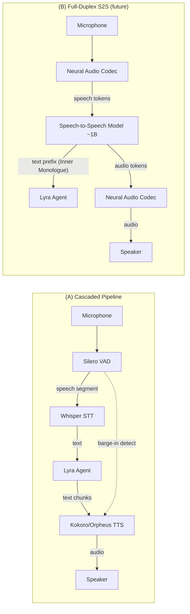

# Plan §4.18 — Voice Mode (⭐ Flagship)

> **Plain-language summary:** Lyra's next flagship feature. Two tiers: (A) a cascaded STT→LLM→TTS pipeline with Smart Turn barge-in handling, using open-source components (Whisper, Kokoro/Orpheus, Silero VAD). (B) a full-duplex speech-to-speech breakthrough leveraging Moshi's Inner Monologue pattern — text-token prefix before audio tokens gives streaming ASR/TTS as free byproducts — on an MIT-compatible smaller model (~1B), trained with a streaming inference runtime achieving sub-200ms end-to-end latency.

## 1. Problem

Lyra has voice pipeline scaffolding (lyra-voice: pipeline.py, providers.py, sfx.py, voice_hooks.py — 5 files) but no real-time voice interface. No VAD (voice activity detection), no streaming STT, no barge-in handling, no turn-taking, no emotion/prosody, no multilingual support. The terminal is text-only; users can't speak to Lyra.

## 2. Evidence Synthesis

| Source | Key Finding | Transfer |
|--------|------------|----------|
| Moshi (2410.00037) | Full-duplex speech-to-speech, Inner Monologue (text prefix before audio), 160ms theoretical latency, parallel user/system streams | Architecture reference for (B) tier |
| CSM (Sesame) | Open conversational speech model, Llama backbone | MIT-compatible backbone candidate |
| Pipecat Smart Turn | Open semantic turn detection, 23 languages incl. VI+EN | Barge-in for (A) tier |
| Silero VAD | De-facto open VAD, lightweight | VAD for both tiers |
| Whisper large-v3/turbo | Best multilingual open ASR | STT for (A) tier |
| Kokoro-82M TTS | Tiny, fast, high-quality, Apache license | TTS for (A) tier |
| Orpheus TTS | Expressive, emotion tags, voice cloning, low latency | TTS alternative for (A) tier |
| Full-Duplex-Bench v3 | Disfluency + multi-step tool use evaluation | Benchmark target |

## 3. Proposed Lyra Design

### (A) Parity — Cascaded Pipeline with Smart Turn

**Pipeline:** Audio capture → Silero VAD → Whisper STT → Lyra Agent (LLM) → Kokoro/Orpheus TTS → Audio playback

**Components:**

1. **Audio capture:** System microphone input. Configurable device selection. Streaming audio buffer (20ms frames).

2. **Silero VAD:**
   - Voice activity detection on streaming audio
   - Configurable thresholds: speech start (0.5 confidence), speech end (silence for 800ms)
   - Output: speech segments with timestamps

3. **Smart Turn barge-in:**
   - Semantic turn detection (not just silence-based)
   - During TTS playback, if user speech is detected: interrupt playback, process new input
   - `lyra.voice.bargeIn = "semantic" | "silence" | "off"`

4. **Whisper STT:**
   - `whisper-large-v3-turbo` for multilingual (VI+EN)
   - `whisper-large-v3` for best accuracy
   - Streaming mode: transcribe incrementally as speech arrives
   - Configurable model size / accuracy trade-off

5. **Lyra Agent (LLM):**
   - Standard Lyra session, voice input as text
   - Streaming response chunks → feed to TTS as they arrive
   - Handle long responses: chunk at sentence boundaries, TTS each sentence

6. **Kokoro/Orpheus TTS:**
   - Kokoro-82M: tiny (82M params), fast, Apache 2.0, single-speaker but high quality
   - Orpheus: expressive with emotion tags (`<giggle>`, `<sigh>`), voice cloning, low latency
   - Configurable: `lyra.voice.tts = "kokoro" | "orpheus" | "system"`
   - Streaming: synthesize each sentence as it arrives from LLM

7. **SFX Layer (§5.3):**
   - Session start: funny voice notification (Warcraft peon style)
   - Answer complete: voice cue
   - Voice packs: selectable via hooks (§4.10)

### (B) Breakthrough — MIT-Compatible Speech-to-Speech Model

**GATED ON:** Cascaded pipeline delivering sub-500ms end-to-end latency. If cascaded achieves good UX, full-duplex is incremental. If cascaded latency is >1s, full-duplex becomes necessary.

1. **Speech-to-speech model (~1B params):**
   - Backbone: fine-tuned Llama or Phi architecture → speech tokens
   - Training data: open speech datasets (Common Voice, LibriSpeech, VoxPopuli) + synthetic VI+EN data
   - License: MIT-compatible (Apache 2.0 or MIT)

2. **Inner Monologue pattern (from Moshi):**
   - Generate time-aligned TEXT tokens as prefix before audio tokens
   - Text prefix provides: streaming ASR (free), linguistic quality improvement, content grounding
   - Audio tokens follow text, generated by the same model

3. **Parallel streams:**
   - Model user speech tokens and system speech tokens as separate parallel streams
   - No explicit turn detection needed — model handles overlapping speech natively
   - Enable true barge-in without interruption detection latency

4. **Streaming inference runtime:**
   - Token-level streaming: emit text + audio tokens as generated
   - Target: sub-200ms end-to-end latency (160ms theoretical, 200ms practical per Moshi)
   - Runtime: ONNX or llama.cpp for CPU compatibility

5. **Neural audio codec:**
   - Train or adapt an MIT-compatible residual vector quantizer codec
   - Output: hierarchical tokens (semantic coarse → acoustic fine)
   - Target: 6 kbps for intelligible speech

6. **VI+EN bilingual support:**
   - Training data: Common Voice (VI), FLEURS (VI), LibriSpeech (EN), VoxPopuli (EN)
   - Language identification token at sequence start
   - Evaluate on: VI WER, EN WER, VI→EN code-switching

## 4. Architecture

## 5. Build Outline

### (A) Parity — Cascaded Pipeline (6 weeks)

**Week 1-2: VAD + STT**
1. Integrate Silero VAD: streaming audio buffer, configurable thresholds
2. Integrate Whisper: model download, streaming transcription, VI+EN support
3. Build audio capture module: device selection, frame buffering

**Week 3-4: TTS + Barge-in**
4. Integrate Kokoro TTS: model download, text→audio synthesis
5. Integrate Smart Turn: semantic turn detection, barge-in during playback
6. Build streaming TTS: sentence-boundary chunking, sequential synthesis

**Week 5: Agent Integration**
7. Wire voice input → Lyra session (text)
8. Streaming response → TTS sentence chunking
9. Handle interruption: barge-in → stop TTS → process new input

**Week 6: SFX + Polish**
10. Implement SFX layer: session-start voice, answer-complete cue, voice packs
11. Wire via hooks (§4.10): on-session-start, on-response-complete
12. End-to-end latency measurement and optimization

### (B) Breakthrough — Speech-to-Speech Model (12+ weeks, future)

13. Curate VI+EN training dataset (open sources only, MIT-compatible)
14. Train/adapt 1B speech-to-speech model with Inner Monologue pattern
15. Train neural audio codec (residual vector quantization, 6 kbps target)
16. Build streaming inference runtime (ONNX or llama.cpp)
17. Benchmark against cascaded baseline: latency, WER, naturalness (MOS)
18. Ship if: sub-200ms E2E latency, WER within 5% of cascaded, MOS > 3.5

## 6. Multi-Provider Note

STT/TTS providers are swappable like LLM providers via §4.5 abstraction. On DeepSeek (text-only): voice mode still works — STT and TTS are local models, LLM is DeepSeek. The cascaded pipeline is provider-agnostic for the STT/TTS layer.

## 7. Risks & Open Questions

- **VI+EN multilingual quality:** Whisper large-v3 supports VI but accuracy is lower than EN. Test with real VI speech before committing.
- **Kokoro license:** Apache 2.0 — MIT-compatible. Verify before bundling.
- **Moshi license:** CC BY-NC-SA 4.0 — NOT MIT-compatible for the codec. Must train own codec for (B) tier.
- **Latency budget:** Cascaded pipeline: VAD (50ms) + Whisper (200-500ms) + LLM (500-2000ms) + TTS (50-200ms) = 800-2750ms total. This may feel sluggish. Smart Turn barge-in helps, but full-duplex may be necessary for natural conversation feel.

## 8. Tier Breakdown

| Tier | Description | Impact | Effort | Timeline |
|------|-------------|--------|--------|----------|
| (A) Parity | Cascaded pipeline (Whisper + Smart Turn + Kokoro/Orpheus) | 5 | 4 | 6 weeks |
| (B) Breakthrough | MIT-compatible speech-to-speech model with Inner Monologue | 5 | 5 | 12+ weeks (future) |

## 9. Baseline Delta

| Component | Change | Migration Cost |
|-----------|--------|---------------|
| lyra-voice/pipeline.py | EXTEND: real-time audio capture, VAD, STT, TTS, barge-in | Medium — significant extension of existing scaffolding |
| lyra-voice/providers.py | EXTEND: Whisper, Kokoro, Orpheus providers | Low — new providers in existing provider pattern |
| lyra-voice/sfx.py | EXTEND: session-start, answer-complete, voice packs | Low — new trigger points |
| lyra-hooks | EXTEND: voice-specific hook points | Low — new hook types |

## 10. Expert Review

**Mini-Debate Participants:** Senior Voice/Audio Engineer (VAE), Senior AI Engineer (AIE), Senior UX Designer (UX), Adversarial Skeptic (AS)

**VAE:** Cascaded pipeline latency is the elephant. 800-2750ms is noticeable. Mitigate with: streaming TTS (start playback on first sentence, don't wait for full response), speculative TTS (predict likely first words), and Smart Turn interruption.

**UX:** Push-to-talk vs always-listening is a user-trust decision. Ship push-to-talk as default. Always-listening is opt-in with clear visual indicator ("Lyra is listening"). Hotword ("Hey Lyra") is a nice-to-have for Phase 2.

**AS:** The (B) tier requires training a speech model. Is the team equipped to train speech models? The cascaded pipeline uses battle-tested open-source models with 0 training. Ship the cascaded pipeline; evaluate latency; only invest in (B) if cascaded fails the UX bar.

**Sign-off:** Cascaded pipeline is feasible and the right v1. Push-to-talk default. Smart Turn for interruption. (B) tier gated on cascaded latency measurement.

## 11. References

- Moshi: https://arxiv.org/abs/2410.00037 · https://github.com/kyutai-labs/moshi
- CSM: https://github.com/SesameAILabs/csm
- Smart Turn: https://github.com/pipecat-ai/smart-turn
- Silero VAD: https://github.com/snakers4/silero-vad
- Whisper: https://github.com/openai/whisper
- Kokoro: https://github.com/hexgrad/kokoro
- Orpheus: https://github.com/canopyai/Orpheus-TTS
- Full-Duplex-Bench v3: https://arxiv.org/abs/2604.04847
- Architecture: BREAKTHROUGH-ARCHITECTURE.md

## 12. Changelog

- Run 2 (2026-06-03): Initial voice plan. Cascaded pipeline as (A), speech-to-speech as (B) gated on latency measurement.
