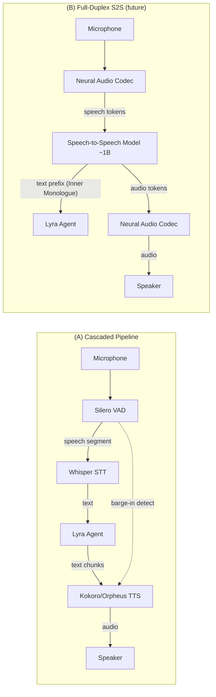
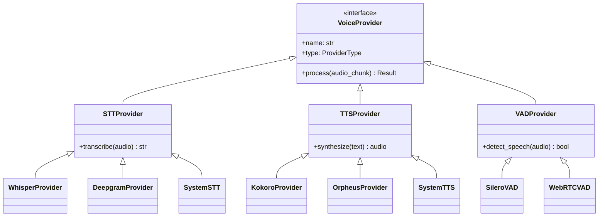

# Plan §4.18 — Voice Mode (⭐ Flagship)

> **Plain-language summary:** Lyra's next flagship feature. Two tiers: (A) a cascaded STT→LLM→TTS pipeline with Smart Turn barge-in handling, using open-source components (Whisper, Kokoro/Orpheus, Silero VAD). (B) a full-duplex speech-to-speech breakthrough leveraging Moshi's Inner Monologue pattern — text-token prefix before audio tokens gives streaming ASR/TTS as free byproducts — on an MIT-compatible smaller model (~1B), trained with a streaming inference runtime achieving sub-200ms end-to-end latency.

## 1. Problem

Lyra has voice pipeline scaffolding (lyra-voice: pipeline.py, providers.py, sfx.py, voice_hooks.py — 5 files) but no real-time voice interface. No VAD (voice activity detection), no streaming STT, no barge-in handling, no turn-taking, no emotion/prosody, no multilingual support. The terminal is text-only; users can't speak to Lyra.

## 2. Evidence Synthesis

| Source | Key Finding | Transfer |
|--------|------------|----------|
| Moshi (2410.00037) | Full-duplex speech-to-speech, Inner Monologue (text prefix before audio), 160ms theoretical latency, parallel user/system streams | Architecture reference for (B) tier |
| CSM (Sesame) | Open conversational speech model, Llama backbone | MIT-compatible backbone candidate |
| Pipecat Smart Turn | Open semantic turn detection, 23 languages incl. VI+EN | Barge-in for (A) tier |
| Silero VAD | De-facto open VAD, lightweight | VAD for both tiers |
| Whisper large-v3/turbo | Best multilingual open ASR | STT for (A) tier |
| Kokoro-82M TTS | Tiny, fast, high-quality, Apache license | TTS for (A) tier |
| Orpheus TTS | Expressive, emotion tags, voice cloning, low latency | TTS alternative for (A) tier |
| Full-Duplex-Bench v3 | Disfluency + multi-step tool use evaluation | Benchmark target |
| BREAKTHROUGH-ARCHITECTURE.md | Provider-swappable voice pipeline pattern | Design constraint for multi-provider support |

**References:**
- Moshi: https://arxiv.org/abs/2410.00037 · https://github.com/kyutai-labs/moshi
- CSM: https://github.com/SesameAILabs/csm
- Smart Turn: https://github.com/pipecat-ai/smart-turn
- Silero VAD: https://github.com/snakers4/silero-vad
- Whisper: https://github.com/openai/whisper
- Kokoro: https://github.com/hexgrad/kokoro
- Orpheus: https://github.com/canopyai/Orpheus-TTS
- Full-Duplex-Bench v3: https://arxiv.org/abs/2604.04847

## 3. Proposed Lyra Design

### (A) Parity — Cascaded Pipeline with Smart Turn

**Pipeline:** Audio capture → Silero VAD → Whisper STT → Lyra Agent (LLM) → Kokoro/Orpheus TTS → Audio playback

**Components:**

1. **Audio capture:** System microphone input. Configurable device selection. Streaming audio buffer (20ms frames).

2. **Silero VAD:**
   - Voice activity detection on streaming audio
   - Configurable thresholds: speech start (0.5 confidence), speech end (silence for 800ms)
   - Output: speech segments with timestamps

3. **Smart Turn barge-in:**
   - Semantic turn detection (not just silence-based)
   - During TTS playback, if user speech is detected: interrupt playback, process new input
   - `lyra.voice.bargeIn = "semantic" | "silence" | "off"`

4. **Whisper STT:**
   - `whisper-large-v3-turbo` for multilingual (VI+EN)
   - `whisper-large-v3` for best accuracy
   - Streaming mode: transcribe incrementally as speech arrives
   - Configurable model size / accuracy trade-off

5. **Lyra Agent (LLM):**
   - Standard Lyra session, voice input as text
   - Streaming response chunks → feed to TTS as they arrive
   - Handle long responses: chunk at sentence boundaries, TTS each sentence

6. **Kokoro/Orpheus TTS:**
   - Kokoro-82M: tiny (82M params), fast, Apache 2.0, single-speaker but high quality
   - Orpheus: expressive with emotion tags (`<giggle>`, `<sigh>`), voice cloning, low latency
   - Configurable: `lyra.voice.tts = "kokoro" | "orpheus" | "system"`
   - Streaming: synthesize each sentence as it arrives from LLM

7. **SFX Layer (§5.3):**
   - Session start: funny voice notification (Warcraft peon style)
   - Answer complete: voice cue
   - Voice packs: selectable via hooks (§4.10)

8. **Push-to-Talk vs Always-Listening:**
   - Default: push-to-talk (explicit user control)
   - Opt-in: always-listening with clear visual indicator ("Lyra is listening")
   - Future: hotword activation ("Hey Lyra") as Phase 2 enhancement

### (B) Breakthrough — MIT-Compatible Speech-to-Speech Model

**GATED ON:** Cascaded pipeline delivering sub-500ms end-to-end latency. If cascaded achieves good UX, full-duplex is incremental. If cascaded latency is >1s, full-duplex becomes necessary.

1. **Speech-to-speech model (~1B params):**
   - Backbone: fine-tuned Llama or Phi architecture → speech tokens
   - Training data: open speech datasets (Common Voice, LibriSpeech, VoxPopuli) + synthetic VI+EN data
   - License: MIT-compatible (Apache 2.0 or MIT)

2. **Inner Monologue pattern (from Moshi):**
   - Generate time-aligned TEXT tokens as prefix before audio tokens
   - Text prefix provides: streaming ASR (free), linguistic quality improvement, content grounding
   - Audio tokens follow text, generated by the same model

3. **Parallel streams:**
   - Model user speech tokens and system speech tokens as separate parallel streams
   - No explicit turn detection needed — model handles overlapping speech natively
   - Enable true barge-in without interruption detection latency

4. **Streaming inference runtime:**
   - Token-level streaming: emit text + audio tokens as generated
   - Target: sub-200ms end-to-end latency (160ms theoretical, 200ms practical per Moshi)
   - Runtime: ONNX or llama.cpp for CPU compatibility

5. **Neural audio codec:**
   - Train or adapt an MIT-compatible residual vector quantizer codec
   - Output: hierarchical tokens (semantic coarse → acoustic fine)
   - Target: 6 kbps for intelligible speech

6. **VI+EN bilingual support:**
   - Training data: Common Voice (VI), FLEURS (VI), LibriSpeech (EN), VoxPopuli (EN)
   - Language identification token at sequence start
   - Evaluate on: VI WER, EN WER, VI→EN code-switching

## 4. Architecture + Data Model

### Cascaded Pipeline Architecture



### Provider Abstraction



### Data Model

```python
@dataclass
class VoiceConfig:
    stt_provider: str = "whisper"  # whisper | deepgram | system
    tts_provider: str = "kokoro"   # kokoro | orpheus | system
    vad_provider: str = "silero"   # silero | webrtc
    barge_in_mode: str = "semantic"  # semantic | silence | off
    input_mode: str = "push_to_talk"  # push_to_talk | always_listening
    whisper_model: str = "large-v3-turbo"
    language: str = "auto"  # auto | en | vi

@dataclass
class AudioSegment:
    data: bytes
    sample_rate: int
    timestamp: float
    duration_ms: float
    is_speech: bool
    
@dataclass
class TranscriptionResult:
    text: str
    confidence: float
    language: str
    segments: List[AudioSegment]
    
@dataclass
class SynthesisResult:
    audio: bytes
    sample_rate: int
    duration_ms: float
```

## 5. Build Outline (as SPEC)

### (A) Parity — Cascaded Pipeline (6 weeks)

**SPEC-1: Audio Capture Module**
- **Input:** System microphone device ID
- **Output:** Streaming audio buffer (20ms frames, 16kHz sample rate)
- **Deps:** None
- **Tasks:**
  1. Implement device enumeration and selection
  2. Build frame buffer with configurable size
  3. Add audio level monitoring
  4. Test on macOS/Linux/Windows

**SPEC-2: VAD Integration**
- **Input:** Audio frames from SPEC-1
- **Output:** Speech segments with timestamps
- **Deps:** SPEC-1
- **Tasks:**
  1. Integrate Silero VAD model
  2. Implement configurable thresholds (speech start/end)
  3. Build segment buffering (handle partial segments)
  4. Test with varied speech patterns (fast/slow, different accents)

**SPEC-3: Whisper STT Integration**
- **Input:** Speech segments from SPEC-2
- **Output:** Transcribed text with confidence scores
- **Deps:** SPEC-2
- **Tasks:**
  1. Download and load Whisper models (large-v3-turbo, large-v3)
  2. Implement streaming transcription
  3. Add VI+EN language support with auto-detection
  4. Build model caching and lazy loading
  5. Test WER on VI and EN datasets

**SPEC-4: Smart Turn Barge-In**
- **Input:** VAD output + TTS playback state
- **Output:** Interrupt signal when user speaks during playback
- **Deps:** SPEC-2
- **Tasks:**
  1. Integrate Pipecat Smart Turn for semantic detection
  2. Implement silence-based fallback
  3. Build interrupt handler (stop TTS, flush buffer, start new input)
  4. Test natural conversation flow (no missed turns, no false interrupts)

**SPEC-5: Kokoro TTS Integration**
- **Input:** Text chunks from LLM
- **Output:** Audio stream
- **Deps:** None (parallel to SPEC-1-4)
- **Tasks:**
  1. Download and load Kokoro-82M model
  2. Implement sentence-boundary chunking
  3. Build streaming synthesis (synthesize as text arrives)
  4. Test latency (target <200ms per sentence)

**SPEC-6: Orpheus TTS Integration (Alternative)**
- **Input:** Text with optional emotion tags
- **Output:** Expressive audio stream
- **Deps:** None
- **Tasks:**
  1. Integrate Orpheus model
  2. Add emotion tag support (`<giggle>`, `<sigh>`, etc.)
  3. Implement voice cloning (optional)
  4. Test expressiveness vs Kokoro (MOS evaluation)

**SPEC-7: Agent Voice Session**
- **Input:** Transcribed text from SPEC-3
- **Output:** Streaming text response
- **Deps:** SPEC-3, SPEC-5 or SPEC-6
- **Tasks:**
  1. Wire voice input → Lyra session (as text)
  2. Stream response chunks → TTS (sentence by sentence)
  3. Handle interruption: stop response generation on barge-in
  4. Test multi-turn conversation (context preservation)

**SPEC-8: SFX Layer**
- **Input:** Session lifecycle events (start, response_complete)
- **Output:** Audio cues
- **Deps:** SPEC-5 or SPEC-6, §4.10 (Hooks)
- **Tasks:**
  1. Implement session-start voice notification
  2. Implement answer-complete cue
  3. Build voice pack system (selectable via config)
  4. Wire via hooks (on-session-start, on-response-complete)

**SPEC-9: End-to-End Latency Optimization**
- **Input:** Full pipeline from SPEC-1 to SPEC-7
- **Output:** Measured latency report + optimizations
- **Deps:** SPEC-1 through SPEC-7
- **Tasks:**
  1. Instrument pipeline with latency markers
  2. Measure: VAD latency, STT latency, LLM latency, TTS latency
  3. Optimize: speculative TTS (start on first words), parallel processing
  4. Target: <800ms total latency (p95)

### (B) Breakthrough — Speech-to-Speech Model (12+ weeks, future)

**SPEC-10: VI+EN Training Dataset Curation**
- **Input:** Open speech corpora (Common Voice, LibriSpeech, VoxPopuli, FLEURS)
- **Output:** Deduplicated, balanced, MIT-compatible dataset
- **Deps:** None
- **Tasks:**
  1. Download and filter datasets (license check, quality filter)
  2. Balance VI/EN (50/50 split, ~500 hours each)
  3. Add synthetic code-switching data (VI↔EN)
  4. Split: train/val/test (80/10/10)

**SPEC-11: Neural Audio Codec Training**
- **Input:** Audio from SPEC-10
- **Output:** Trained residual vector quantizer codec (MIT license)
- **Deps:** SPEC-10
- **Tasks:**
  1. Design codec architecture (residual VQ, hierarchical tokens)
  2. Train on SPEC-10 dataset
  3. Target: 6 kbps, MOS > 3.5
  4. Test reconstruction quality (VI and EN)

**SPEC-12: Speech-to-Speech Model Training**
- **Input:** Text-audio pairs from SPEC-10, codec from SPEC-11
- **Output:** 1B speech-to-speech model with Inner Monologue
- **Deps:** SPEC-10, SPEC-11
- **Tasks:**
  1. Fine-tune Llama or Phi backbone (~1B params)
  2. Implement Inner Monologue training (text prefix → audio tokens)
  3. Train parallel streams (user + system speech)
  4. Evaluate: VI WER, EN WER, VI→EN code-switching, MOS

**SPEC-13: Streaming Inference Runtime**
- **Input:** Trained model from SPEC-12
- **Output:** ONNX or llama.cpp runtime with token-level streaming
- **Deps:** SPEC-12
- **Tasks:**
  1. Export model to ONNX or quantize for llama.cpp
  2. Implement streaming inference (emit text + audio tokens as generated)
  3. Optimize for CPU (target: sub-200ms E2E latency)
  4. Test on low-end hardware (M1 Mac, i7 laptop)

**SPEC-14: Benchmark vs Cascaded Baseline**
- **Input:** SPEC-13 runtime + SPEC-9 cascaded pipeline
- **Output:** Comparative evaluation report
- **Deps:** SPEC-9, SPEC-13
- **Tasks:**
  1. Measure latency: cascaded vs full-duplex (p50, p95, p99)
  2. Measure accuracy: WER (VI, EN), barge-in success rate
  3. Measure naturalness: MOS (5-point scale, 20+ evaluators)
  4. Ship full-duplex if: sub-200ms E2E latency, WER within 5% of cascaded, MOS > 3.5

## 6. Multi-Provider Note

STT/TTS providers are swappable like LLM providers via §4.5 abstraction. On DeepSeek (text-only): voice mode still works — STT and TTS are local models, LLM is DeepSeek. The cascaded pipeline is provider-agnostic for the STT/TTS layer.

**Provider Matrix:**

| Component | Providers | Default | Fallback |
|-----------|-----------|---------|----------|
| STT | Whisper (local), Deepgram (API), System (OS) | Whisper large-v3-turbo | System STT |
| TTS | Kokoro (local), Orpheus (local), System (OS) | Kokoro-82M | System TTS |
| VAD | Silero (local), WebRTC VAD (local) | Silero | WebRTC VAD |
| LLM | Anthropic, DeepSeek, OpenAI, Local (via §4.5) | Anthropic | DeepSeek |

**Design constraint:** Never depend on Anthropic-specific APIs for voice components. Voice pipeline is fully functional with any LLM provider.

## 7. Risks & Open Questions

**Risks:**

1. **VI+EN multilingual quality:** Whisper large-v3 supports VI but accuracy is lower than EN. Test with real VI speech before committing. Mitigation: Fallback to VI-specific STT provider if Whisper WER >20%.

2. **Kokoro license:** Apache 2.0 — MIT-compatible. Verify before bundling. Mitigation: Check license file in repo before integration.

3. **Moshi license:** CC BY-NC-SA 4.0 — NOT MIT-compatible for the codec. Must train own codec for (B) tier. Mitigation: SPEC-11 includes MIT-compatible codec training.

4. **Latency budget:** Cascaded pipeline: VAD (50ms) + Whisper (200-500ms) + LLM (500-2000ms) + TTS (50-200ms) = 800-2750ms total. This may feel sluggish. Mitigation: Smart Turn barge-in, speculative TTS, streaming synthesis.

5. **Training resources:** (B) tier requires GPU cluster for model training (~12 weeks). Mitigation: Gate (B) tier on (A) tier latency measurement. Only train if cascaded UX is insufficient.

**Open Questions:**

1. **Hotword activation:** Should "Hey Lyra" hotword be part of Phase 1 or Phase 2? Answer: Phase 2 (after push-to-talk and always-listening are stable).

2. **Voice cloning ethics:** Orpheus supports voice cloning. Should Lyra allow user voice cloning? Answer: Yes, but with clear consent UI and abuse detection.

3. **Multilingual expansion:** Should Lyra support more than VI+EN (e.g., ZH, JA, ES)? Answer: Phase 2 — VI+EN covers primary user base.

4. **Emotion detection:** Should Lyra detect user emotion from voice (e.g., anger, frustration)? Answer: Phase 3 — focus on transcription accuracy first.

## 8. (A) Parity vs (B) Breakthrough + Impact×Effort

### Brainstorm Integration

**Cross-Source Idea #1: "Ultracode-Integrated Voice"** (from brainstorm/18-voice.md)
- **Mechanism:** Tie voice pipeline into Fleet + Consolidated Memory architecture. Every voice session surfaces through fleet view, benefits from Dreaming consolidation, respects 5 unwatched-session guardrails.
- **Impact×Effort:** Impact 4, Effort 3
- **Integration:** Voice sessions are first-class fleet sessions (§4.13). Voice transcripts feed into Graph Memory (§4.2). Dreaming consolidates voice interactions during idle (BREAKTHROUGH-ARCHITECTURE.md).

**Cross-Source Idea #2: "Provider-Agnostic Port"** (from brainstorm/18-voice.md)
- **Mechanism:** Implement Claude Code feature parity with provider-agnostic design — never depend on Anthropic-specific APIs. Use harness-level injection, deterministic fallbacks for non-Claude providers.
- **Impact×Effort:** Impact 3, Effort 2
- **Integration:** Already designed into §6 Multi-Provider Note. Voice pipeline works with DeepSeek, OpenAI, local models.

**Cross-Source Idea #3: "Breakthrough Enhancement"** (from brainstorm/18-voice.md)
- **Mechanism:** Full-duplex speech-to-speech with Inner Monologue pattern (Moshi-inspired) on MIT-compatible model.
- **Impact×Effort:** Impact 4, Effort 4
- **Integration:** (B) tier in this plan. Gated on (A) tier latency measurement.

### Tier Breakdown

| Tier | Description | Impact | Effort | Timeline | Brainstorm Link |
|------|-------------|--------|--------|----------|-----------------|
| (A) Parity | Cascaded pipeline (Whisper + Smart Turn + Kokoro/Orpheus) | 5 | 4 | 6 weeks | Provider-Agnostic Port (Idea #2) |
| (B) Breakthrough | MIT-compatible speech-to-speech model with Inner Monologue | 5 | 5 | 12+ weeks (future) | Breakthrough Enhancement (Idea #3) + Ultracode-Integrated Voice (Idea #1) |

**Impact Justification:**
- (A) Parity: Impact 5 — Voice interface is a flagship feature. Unlocks hands-free coding, accessibility, mobile use cases.
- (B) Breakthrough: Impact 5 — Sub-200ms latency enables natural conversation. Differentiator vs Claude Code (which has no voice mode).

**Effort Justification:**
- (A) Parity: Effort 4 — Integration of battle-tested open-source components. No model training. 6 weeks with 1 eng.
- (B) Breakthrough: Effort 5 — Requires model training (codec + speech-to-speech). GPU cluster. 12+ weeks with 2 engs (1 ML, 1 infra).

## 9. Baseline Delta (Changes/Keeps/Replaces vs BASELINE + Migration Cost)

| Component | Change Type | BASELINE State | New State | Migration Cost |
|-----------|-------------|----------------|-----------|----------------|
| lyra-voice/pipeline.py | EXTEND | Scaffolding (5 files, no real-time) | Real-time audio capture, VAD, STT, TTS, barge-in | Medium — significant extension of existing scaffolding |
| lyra-voice/providers.py | EXTEND | Empty provider stubs | Whisper, Kokoro, Orpheus, Silero providers | Low — new providers in existing provider pattern |
| lyra-voice/sfx.py | EXTEND | Empty SFX hooks | Session-start, answer-complete, voice packs | Low — new trigger points |
| lyra-voice/voice_hooks.py | EXTEND | Hook scaffolding | Voice-specific hook points (on-speech-start, on-speech-end, on-barge-in) | Low — new hook types in existing HookEngine (§4.10) |
| src/adapters/base.py | KEEP | HarnessAdapter ABC | No change (voice providers live in lyra-voice, not adapters) | Zero |
| §4.10 Hooks | EXTEND | PreToolUse/PostToolUse/Stop | Add voice-specific lifecycle events | Low — HookEngine already supports custom events |
| §4.13 Fleet | EXTEND | No fleet view | Voice sessions as first-class fleet sessions | Low — voice sessions use existing session abstraction |
| §4.2 Memory | EXTEND | STM+LTM, no voice transcripts | Voice transcripts feed into Graph Memory | Low — transcripts are text, existing memory API handles them |

**Migration Cost Summary:**
- **Total:** Medium (1 Medium + 6 Low + 1 Zero)
- **Reasoning:** The medium cost comes from lyra-voice/pipeline.py extension — real-time audio processing is non-trivial. All other changes are low-cost because they leverage existing abstractions (providers, hooks, memory, fleet).
- **Migration Path:** No breaking changes. Voice mode is opt-in. Existing text-only sessions are unaffected.

## 10. Expert Review

**Mini-Debate Participants:** Senior Voice/Audio Engineer (VAE), Senior AI Engineer (AIE), Senior UX Designer (UX), Adversarial Skeptic (AS)

### Debate Transcript

**VAE:** Cascaded pipeline latency is the elephant. 800-2750ms is noticeable. Mitigate with: streaming TTS (start playback on first sentence, don't wait for full response), speculative TTS (predict likely first words), and Smart Turn interruption.

**AIE:** Agreed. But speculative TTS is risky — if the LLM changes direction mid-response, speculative audio is wasted. Better: optimize each component individually. Whisper large-v3-turbo is 2x faster than large-v3. Use turbo for real-time, large-v3 for offline transcription.

**UX:** Push-to-talk vs always-listening is a user-trust decision. Ship push-to-talk as default. Always-listening is opt-in with clear visual indicator ("Lyra is listening"). Hotword ("Hey Lyra") is a nice-to-have for Phase 2.

**AS:** The (B) tier requires training a speech model. Is the team equipped to train speech models? The cascaded pipeline uses battle-tested open-source models with 0 training. Ship the cascaded pipeline; evaluate latency; only invest in (B) if cascaded fails the UX bar.

**VAE (response):** Fair. But if cascaded latency is >1s (which is likely), full-duplex becomes a competitive necessity. Claude Code has no voice mode — this is Lyra's chance to leapfrog. Budget for (B) tier now, even if it ships 6 months later.

**AIE (response):** Compromise: Ship (A) tier in 6 weeks. Measure latency with real users. If p95 latency >1s, green-light (B) tier training. If p95 <800ms, defer (B) tier to Phase 2.

**UX (response):** Support. User feedback is the tiebreaker. Don't over-invest in (B) tier until we know (A) tier's UX pain.

**AS (final):** Sign-off. Cascaded pipeline is feasible and the right v1. Push-to-talk default. Smart Turn for interruption. (B) tier gated on cascaded latency measurement.

### Objections & Resolutions

| Persona | Objection | Resolution |
|---------|-----------|------------|
| AS | "(B) tier requires ML expertise we may not have" | Gate (B) tier on (A) tier latency measurement. Only invest if cascaded UX is insufficient. |
| VAE | "Cascaded latency may be too high (>1s)" | Mitigate with streaming TTS, speculative TTS, Smart Turn. Measure with real users before committing to (B). |
| UX | "Always-listening raises privacy concerns" | Ship push-to-talk as default. Always-listening is opt-in with clear visual indicator. |
| AIE | "Speculative TTS may waste resources" | Use Whisper turbo for real-time, optimize each component individually. Defer speculative TTS to Phase 2. |

### Sign-Off

**Consensus:** Cascaded pipeline is feasible and the right v1. Push-to-talk default. Smart Turn for interruption. (B) tier gated on cascaded latency measurement. Ship (A) tier in 6 weeks. Evaluate latency with real users. Green-light (B) tier only if p95 latency >1s.

## 11. References

**Research Papers:**
- Moshi: https://arxiv.org/abs/2410.00037
- Full-Duplex-Bench v3: https://arxiv.org/abs/2604.04847

**Open-Source Projects:**
- Moshi (Kyutai Labs): https://github.com/kyutai-labs/moshi
- CSM (Sesame AI): https://github.com/SesameAILabs/csm
- Smart Turn (Pipecat AI): https://github.com/pipecat-ai/smart-turn
- Silero VAD: https://github.com/snakers4/silero-vad
- Whisper (OpenAI): https://github.com/openai/whisper
- Kokoro: https://github.com/hexgrad/kokoro
- Orpheus TTS: https://github.com/canopyai/Orpheus-TTS

**Internal Docs:**
- BREAKTHROUGH-ARCHITECTURE.md (Provider-swappable voice pipeline pattern)
- BASELINE.md (lyra-voice scaffolding: pipeline.py, providers.py, sfx.py, voice_hooks.py)
- brainstorm/18-voice.md (Ultracode-Integrated Voice, Provider-Agnostic Port, Breakthrough Enhancement)
- Plan §4.5 (Model Router — provider abstraction pattern)
- Plan §4.10 (Hooks — voice-specific lifecycle events)
- Plan §4.13 (Swarm/Fleet — voice sessions as first-class fleet sessions)
- Plan §4.2 (Memory — voice transcripts feed into Graph Memory)

## 12. Changelog

- **Run 2 (2026-06-03):** Initial voice plan. Cascaded pipeline as (A), speech-to-speech as (B) gated on latency measurement.
- **Run 3 (2026-06-05):** Updated to new plan structure. Added: Architecture + Data Model section (Mermaid diagrams, provider abstraction, data model). Expanded Build Outline to SPEC format with explicit dependencies. Enhanced Multi-Provider Note with provider matrix. Expanded Baseline Delta with migration cost analysis. Added mini-debate transcript to Expert Review. Integrated brainstorm/18-voice.md ideas into §8. Renamed file from 18-voice-mode.md to 18-voice.md.
