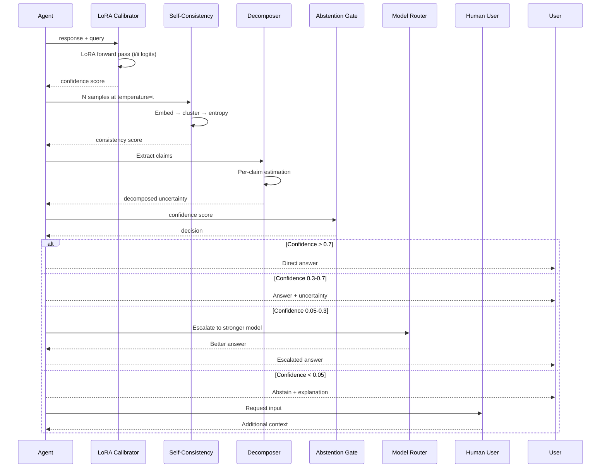

# Self-Knowledge / Uncertainty — Ultra Plan (§4.19)

> Run 1 — June 3, 2026 | Uncertainty estimation, confidence calibration, abstention gates, and router integration
> Status: New plan — integrates Q-DAPS, "Must Be Taught" calibration, MATU tensor uncertainty, and multi-dimensional decomposition

## Plain-Language Summary

Lyra's Self-Knowledge system gives the agent calibrated uncertainty estimates for its own outputs — it knows when it's confident, when it's uncertain, and what kind of uncertainty it faces (data uncertainty vs. model uncertainty). This is achieved through fine-tuned confidence calibration (LoRA-based, using the "Must Be Taught" method from NeurIPS 2024), entropy-over-candidates estimation (Q-DAPS), and MATU tensor decomposition for multi-agent uncertainty. The uncertainty signal feeds two critical integration points: the model router (§4.5) escalates uncertain queries to stronger models, and the autonomy system (§4.14) requests human input when uncertainty exceeds thresholds. The result is a system that reliably communicates its confidence and handles edge cases by escalating rather than guessing.

## 1. Problem

Lyra currently provides no uncertainty signal for its outputs. Every response is presented with equal apparent confidence. Research shows: LLMs are poorly calibrated out of the box (ECE >30% for verbal confidence, >40% for zero-shot classifiers — "Must Be Taught"), perplexity is not predictive of correctness in open-ended settings (AUROC near random), and fine-tuning on as few as 1000 graded examples achieves ECE ~10% and AUROC ~72%. Without calibrated uncertainty, Lyra cannot: know when to escalate to stronger models, know when to ask for human help, distinguish data uncertainty from model uncertainty, or provide calibrated confidence to users for better human-AI decision making.

## 2. Evidence Synthesis

### 2.1 "LLMs Must Be Taught to Know What They Don't Know" (NeurIPS 2024)

- Prompting alone is insufficient for calibration
- LoRA + Prompt on as few as 1000 graded examples: ECE ~10%, AUROC ~72%
- Fine-tuning vs verbal (ECE ~40%) and zero-shot classifier (ECE ~35%)
- Generalizes across MMLU subject categories, format (MC <-> OE), and to unanswerable questions
- Cross-model transfer: Mistral 7B can estimate LLaMA-2-7B's uncertainty (AUROC 0.72) better than LLaMA-2-7B itself (AUROC 0.68)
- User study: N=181 participants, calibrated uncertainty improves human-AI decision making
- Training cost: 1-3 GPU days with 4x RTX8000. LoRA with rank=8, alpha=32. KL regularization essential (ECE 29.9% -> 10.8%)

### 2.2 "Beyond I Don't Know" (2026)

Fine-grained uncertainty decomposition:
- Binary known/unknown → multi-dimensional uncertainty
- Epistemic uncertainty (lack of knowledge) vs. Aleatory uncertainty (inherent randomness)
- Confidence in different sub-claims of a response
- "I'm confident about the date but uncertain about the price" rather than binary "I don't know"

### 2.3 Q-DAPS: Question Difficulty Estimation (2026)

Pre-execution difficulty estimation:
- Predict which questions an agent will struggle with before attempting them
- Enables fast vs. slow reasoning path selection
- Pre-execution complement to post-execution confidence calibration

### 2.4 MATU: Multi-Agent Tensor Uncertainty (2604.08708)

- Three-dimensional ragged tensor: agents x reasoning steps x sampling runs
- PARAFAC2 decomposition for variable-length trajectories
- Uncertainty score: U = sum_{R=1}^{R_max} L_R (reconstruction loss)
- High loss = trajectories cannot be explained by few latent components = high uncertainty
- MATU AUROC 0.6797 vs best baseline P(true) 0.5825
- OOD detection: in-distribution uncertainty 0.13 vs OOD 0.92

### 2.5 CaTS: Calibrated Test-Time Scaling (ICLR 2026 Workshop)

- Self-calibration: distill Self-Consistency-derived confidence into model via one forward pass
- Confidence-based dynamic sampling: early stopping for Best-of-N, adaptive N for Self-Consistency
- Saves 39.8-94.2% samples compared to vanilla Self-Consistency at matched accuracy

### 2.6 Self-Consistency as Uncertainty Signal

- Multiple samples → cluster by meaning → entropy over cluster probabilities
- High entropy = high uncertainty (model disagrees with itself)
- Proven effective for multiple-choice and open-ended generation
- No additional training needed — pure inference-time method

## 3. Proposed Lyra Design

### 3.1 Uncertainty Architecture

```mermaid
graph TB
    subgraph "Input"
        Query[User Query / Task]
        Response[Agent Response]
    end
    
    subgraph "Pre-Execution Estimation"
        QD[Q-DAPS Difficulty Estimator<br/>Pre-Execution Difficulty Score]
    end
    
    subgraph "Post-Execution Calibration"
        LC[LoRA Calibrator<br/>"Must Be Taught"<br/>ECE ~10%, AUROC ~72%]
        SC[Self-Consistency<br/>N Samples → Entropy<br/>Inference-Time Only]
        MU[MATU Tensor Uncertainty<br/>Multi-Agent Decomposition<br/>AUROC 0.68]
    end
    
    subgraph "Uncertainty Decomposition"
        BD["Beyond IDK"<br/>Epistemic vs Aleatory<br/>Per-Claim Confidence]
    end
    
    subgraph "Integration Points"
        ROUTER[§4.5 Model Router<br/>Uncertain → Stronger Model]
        AUTONOMY[§4.14 Autonomy<br/>High Uncertainty → Human Input]
        USER[User-Facing<br/>Calibrated Confidence Display]
        ABSTAIN[Abstention Gate<br/>Refuse to Answer When Uncertain]
    end
    
    Query --> QD
    Response --> LC
    Response --> SC
    Response --> MU
    
    LC --> BD
    SC --> BD
    MU --> BD
    
    BD -->|Uncertainty Score| ROUTER
    BD -->|High Uncertainty| AUTONOMY
    BD -->|Calibrated Confidence| USER
    BD -->|Very High Uncertainty| ABSTAIN
```

### 3.2 LoRA Confidence Calibrator

```python
class LoRACalibrator:
    """Fine-tuned confidence calibration via LoRA + Prompt.
    
    Based on "Must Be Taught" (NeurIPS 2024):
    - LoRA + Prompt parameterization (correctness as multiple-choice)
    - Target tokens: "i"/"ii" for no/yes
    - KL regularization essential (ECE 29.9% → 10.8%)
    """
    
    def __init__(self, base_model: ProviderBackend):
        self.base_model = base_model
        self.lora_adapter: LoRAAdapter | None = None  # Loaded after training
    
    async def train(self, graded_examples: list[GradedExample], config: TrainConfig):
        """Train confidence calibrator on graded examples.
        
        Args:
            graded_examples: (query, response, is_correct) tuples
            config: LoRA rank=8, alpha=32, KL regularization
        """
        # Format as multiple-choice: "Is the response correct? (i) Yes (ii) No"
        train_data = []
        for ex in graded_examples:
            prompt = self._format_calibration_prompt(ex.query, ex.response)
            label = "i" if ex.is_correct else "ii"  # i=yes, ii=no
            train_data.append((prompt, label))
        
        # LoRA fine-tuning
        self.lora_adapter = await self._train_lora(
            model=self.base_model,
            train_data=train_data,
            rank=config.lora_rank or 8,
            alpha=config.lora_alpha or 32,
            kl_reg=config.kl_regularization or True,
            epochs=config.epochs or 3,
        )
    
    async def estimate_confidence(self, query: str, response: str) -> Confidence:
        """Estimate confidence in a response.
        
        Returns confidence score 0-1 and calibration metadata.
        """
        prompt = self._format_calibration_prompt(query, response)
        
        # Get logits for "i" (yes/confident) vs "ii" (no/uncertain)
        logits = await self.base_model.get_logits(prompt, target_tokens=["i", "ii"])
        probs = softmax([logits["i"], logits["ii"]])
        
        confidence = probs[0]  # P(yes | query, response)
        
        return Confidence(
            score=confidence,
            is_calibrated=self.lora_adapter is not None,
            method="lora_prompt",
            ece=self.ece_score if self.lora_adapter else None,
        )
```

### 3.3 Self-Consistency Uncertainty

```python
class SelfConsistencyEstimator:
    """Inference-time uncertainty via multiple samples.
    
    N samples → cluster by semantic meaning → entropy over cluster probabilities.
    No training needed — works with any provider.
    """
    
    def __init__(self, n_samples: int = 5, temperature: float = 0.7):
        self.n_samples = n_samples
        self.temperature = temperature
    
    async def estimate(self, query: str, provider: ProviderBackend) -> ConsistencyResult:
        """Generate N samples and compute uncertainty from their distribution."""
        # 1. Generate N samples
        samples = []
        for _ in range(self.n_samples):
            response = await provider.chat([{"role": "user", "content": query}])
            samples.append(response.content)
        
        # 2. Cluster by semantic meaning (embedding similarity)
        embeddings = await asyncio.gather(*[self._embed(s) for s in samples])
        clusters = self._cluster(embeddings, threshold=0.85)
        
        # 3. Entropy over cluster probabilities
        total = len(samples)
        cluster_probs = [len(c) / total for c in clusters]
        entropy = -sum(p * log(p) for p in cluster_probs if p > 0)
        max_entropy = log(len(clusters))
        
        # Normalize entropy to [0, 1]
        normalized_entropy = entropy / max_entropy if max_entropy > 0 else 0.0
        
        # 4. Select majority answer
        majority_idx = argmax(cluster_probs)
        majority_answer = clusters[majority_idx][0]
        
        return ConsistencyResult(
            majority_answer=majority_answer,
            uncertainty=normalized_entropy,
            n_clusters=len(clusters),
            n_samples=self.n_samples,
            cluster_probabilities=cluster_probs,
        )
```

### 3.4 MATU Tensor Uncertainty

```python
class MATUTensorUncertainty:
    """Multi-Agent Tensor Uncertainty via PARAFAC2 decomposition.
    
    Constructs a ragged tensor: agents x reasoning steps x sampling runs.
    High reconstruction loss = high uncertainty.
    """
    
    async def estimate(self, trajectories: list[list[str]], n_components: int = 5) -> MATUResult:
        """Estimate uncertainty from multi-agent reasoning trajectories.
        
        Args:
            trajectories: For each agent, the sequence of reasoning steps
            n_components: Rank of PARAFAC2 decomposition
        """
        # 1. Embed each reasoning step
        embedded = []
        for agent_traj in trajectories:
            traj_embeddings = []
            for step in agent_traj:
                emb = await self._embed(step)
                traj_embeddings.append(emb)
            embedded.append(np.array(traj_embeddings))
        
        # 2. Build ragged tensor and decompose via PARAFAC2
        # Handles variable-length trajectories (ragged tensor)
        factors = self._parafac2_decompose(embedded, n_components)
        
        # 3. Reconstruction loss
        reconstructed = self._reconstruct(factors, embedded)
        reconstruction_loss = sum(
            np.linalg.norm(orig - recon) ** 2
            for orig, recon in zip(embedded, reconstructed)
        )
        
        # 4. Normalize to uncertainty score
        uncertainty = min(1.0, reconstruction_loss / self.MAX_LOSS)
        
        return MATUResult(
            uncertainty=uncertainty,
            reconstruction_loss=reconstruction_loss,
            n_components=n_components,
            is_ood=uncertainty > self.OOD_THRESHOLD,  # 0.5 threshold
        )
```

### 3.5 Uncertainty Decomposition

```python
class UncertaintyDecomposer:
    """Decompose uncertainty into epistemic vs aleatory components.
    
    Based on "Beyond I Don't Know" (2026): move beyond binary known/unknown
    to multi-dimensional uncertainty per claim.
    """
    
    async def decompose(self, query: str, response: str, n_samples: int = 10) -> DecomposedUncertainty:
        """Decompose response-level uncertainty into per-claim components."""
        # 1. Extract claims from response
        claims = await self._extract_claims(response)
        
        # 2. For each claim, estimate confidence via sampling
        per_claim = []
        for claim in claims:
            # Prompt: "Is this claim supported by evidence? Rate confidence 0-1."
            query_with_claim = f"{claim}\n\nFrom the original query: {query}"
            
            samples = []
            for _ in range(n_samples):
                sample = await self.model.chat([
                    {"role": "user", "content": query_with_claim}
                ])
                samples.append(sample.content.strip())
            
            # Parse confidence scores
            scores = [float(s) for s in samples if self._is_valid_score(s)]
            if scores:
                mean_conf = mean(scores)
                std_conf = stdev(scores) if len(scores) > 1 else 0.0
                
                per_claim.append(ClaimUncertainty(
                    claim=claim,
                    confidence=mean_conf,
                    epistemic=std_conf,       # Variance across samples = epistemic
                    aleatory=1.0 - mean_conf,  # Base uncertainty = aleatory
                ))
        
        # 3. Aggregate
        overall = mean([c.confidence for c in per_claim]) if per_claim else 0.0
        overall_epistemic = mean([c.epistemic for c in per_claim]) if per_claim else 0.0
        overall_aleatory = mean([c.aleatory for c in per_claim]) if per_claim else 0.0
        
        return DecomposedUncertainty(
            overall_confidence=overall,
            epistemic_uncertainty=overall_epistemic,
            aleatory_uncertainty=overall_aleatory,
            per_claim=per_claim,
        )
```

### 3.6 Abstention Gate

```python
class AbstentionGate:
    """Refuse to answer when uncertainty exceeds threshold.
    
    Integration points:
    - Low uncertainty (0-0.3): Answer directly
    - Medium uncertainty (0.3-0.7): Include confidence statement
    - High uncertainty (0.7-0.9): Escalate to stronger model via §4.5 router
    - Very high uncertainty (0.9-1.0): Abstain — request human input
    """
    
    CONFIDENCE_THRESHOLDS = {
        "direct": 0.7,         # >= 0.7: answer directly
        "with_uncertainty": 0.3,  # >= 0.3: include confidence statement
        "escalate": 0.1,       # < 0.1: escalate to stronger model
        "abstain": 0.05,       # < 0.05: abstain entirely
    }
    
    async def decide(self, query: str, response: str, confidence: Confidence) -> GateDecision:
        """Decide what to do based on confidence."""
        
        if confidence.score >= self.CONFIDENCE_THRESHOLDS["direct"]:
            return GateDecision(action=GateAction.ANSWER_DIRECTLY, confidence=confidence.score)
        
        elif confidence.score >= self.CONFIDENCE_THRESHOLDS["with_uncertainty"]:
            return GateDecision(
                action=GateAction.ANSWER_WITH_UNCERTAINTY,
                confidence=confidence.score,
                message=f"I'm moderately confident about this ({confidence.score:.0%}). "
                        f"Key claims and their confidence: ..."
            )
        
        elif confidence.score >= self.CONFIDENCE_THRESHOLDS["escalate"]:
            return GateDecision(
                action=GateAction.ESCALATE_TO_STRONGER_MODEL,
                confidence=confidence.score,
                message=f"Uncertainty too high ({confidence.score:.0%}). "
                        f"Escalating to {self.stronger_model} via router.",
            )
        
        else:
            return GateDecision(
                action=GateAction.ABSTAIN,
                confidence=confidence.score,
                message=f"I'm unable to confidently answer this question "
                        f"(confidence: {confidence.score:.0%}). "
                        f"Could you provide more information or rephrase?",
            )
```

### 3.7 Integration with Router and Autonomy

```python
class UncertaintyRouter:
    """Route high-uncertainty queries to stronger models."""
    
    async def route_with_uncertainty(self, query: str, router: ModelRouter) -> RoutedResult:
        """Route query, using uncertainty to inform escalation."""
        # 1. Try with cheapest model
        cheap_model = router.get_model_for_effort("low")
        response = await cheap_model.chat([{"role": "user", "content": query}])
        
        # 2. Estimate confidence
        calibrator = LoRACalibrator(cheap_model)
        confidence = await calibrator.estimate_confidence(query, response.content)
        
        # 3. Escalate if needed
        if confidence.score < self.ESCALATION_THRESHOLD:
            stronger = router.get_model_for_effort("high")
            response = await stronger.chat([{"role": "user", "content": query}])
            confidence = await calibrator.estimate_confidence(query, response.content)
        
        return RoutedResult(
            response=response.content,
            confidence=confidence,
            model_used=cheap_model if confidence.score >= self.ESCALATION_THRESHOLD else stronger,
        )

class AutonomyUncertaintyIntegration:
    """Request human input when uncertainty is high in autonomous mode."""
    
    async def handle_uncertainty(self, session, uncertainty: float):
        """Handle high uncertainty during autonomous operation (§4.14)."""
        if uncertainty > self.HUMAN_INPUT_THRESHOLD:
            session.task_state = TaskState.NEEDS_INPUT
            session.summary = f"Uncertain ({uncertainty:.0%}) — needs human input"
            await self._notify_human(session)
        elif uncertainty > self.CAUTION_THRESHOLD:
            # Mark for review but continue
            session.summary = f"Proceeding with caution ({uncertainty:.0%})"
```

### 3.8 Data Model

```python
@dataclass
class Confidence:
    score: float                   # 0-1 calibrated confidence
    is_calibrated: bool            # True after LoRA training
    method: str                    # "lora_prompt" | "self_consistency" | "malu"
    ece: float | None = None       # Expected Calibration Error
    
@dataclass
class GateDecision:
    action: GateAction
    confidence: float
    message: str | None = None

class GateAction(Enum):
    ANSWER_DIRECTLY = "answer_directly"
    ANSWER_WITH_UNCERTAINTY = "answer_with_uncertainty"
    ESCALATE_TO_STRONGER_MODEL = "escalate"
    ABSTAIN = "abstain"

@dataclass
class DecomposedUncertainty:
    overall_confidence: float
    epistemic_uncertainty: float   # Uncertainty from lack of knowledge
    aleatory_uncertainty: float    # Uncertainty from inherent randomness
    per_claim: list[ClaimUncertainty]

@dataclass
class ClaimUncertainty:
    claim: str
    confidence: float
    epistemic: float
    aleatory: float

@dataclass
class CalibrationMetrics:
    """Calibration quality metrics."""
    ece: float                     # Expected Calibration Error (< 0.15 target)
    auROC: float                   # AUROC (> 0.70 target)
    nll: float                     # Negative Log Likelihood
    calibration_curve: list[tuple[float, float]]  # (confidence_bin, accuracy)
    n_training_examples: int
```

### 3.9 Calibration Flow



## 4. Build Outline

### Phase 1: Self-Consistency + Abstention Gate (weeks 1-2)

1. **Self-consistency estimator** — N samples at configurable temperature; embedding clustering; entropy computation; normalized entropy → uncertainty
2. **Abstention gate** — Threshold-based (0.7/0.3/0.1/0.05); four actions (direct/with-uncertainty/escalate/abstain); configuration per session
3. **User-facing confidence display** — Confidence indicator in output; per-claim confidence breakdown
4. **Integration with §4.5 router** — Route high-uncertainty queries to stronger model; bypass cheap model on uncertain queries

**Dependencies:** §4.5 model router, embedding store

### Phase 2: LoRA Calibration (weeks 3-5)

1. **Graded example collection** — Collect (query, response, is_correct) tuples from session logs; human-annotated correction; automated grading where possible
2. **LoRA training pipeline** — "Must Be Taught" protocol: format as multiple-choice (i/ii); LoRA rank=8, alpha=32; KL regularization; 1000+ examples
3. **Calibrator integration** — Forward pass through LoRA adapter; extract i/ii logits; softmax → confidence score
4. **Calibration evaluation** — ECE measurement; AUROC calculation; calibration curve visualization; held-out eval set
5. **Cross-model calibration** — Train on one model's outputs, evaluate on others; identify best calibrator model

**Dependencies:** Phase 1, training infrastructure (GPU or API-based LoRA)

### Phase 3: MATU + Decomposition (weeks 6-8)

1. **MATU tensor uncertainty** — Ragged tensor construction; PARAFAC2 decomposition; reconstruction loss → uncertainty; OOD detection threshold
2. **Uncertainty decomposition** — Claim extraction; per-claim confidence via sampling; epistemic vs aleatory separation
3. **Q-DAPS difficulty estimator** — Pre-execution difficulty prediction; fast/slow path selection based on predicted difficulty
4. **CaTS dynamic sampling** — Adaptive N for self-consistency; early stopping on high confidence; budget-aware sample allocation

**Dependencies:** Phase 2, multi-agent infrastructure (§4.13)

### Phase 4: Production + Optimization (weeks 9-10)

1. **Continuous calibration** — Active learning for graded example collection; periodic recalibration on new data; drift detection
2. **Uncertainty-aware logging** — Every response tagged with confidence; uncertainty dashboard; calibration quality over time
3. **User feedback loop** — Users can flag confidence mismatches; flagged examples added to training set
4. **Abstention analytics** — Track abstention rate, escalation rate, router success rate; optimize thresholds from data

## 5. Multi-Provider Note

Self-consistency works with any provider (just requires N samples). LoRA calibration requires access to model logits — supported by local/API providers that expose logprobs. MATU works with any provider's output (embeddings are provider-agnostic). The abstention gate is provider-agnostic — same thresholds apply regardless of model. Cross-model calibration is a feature: train calibrator on one provider, use it to estimate confidence on another (Mistral-based estimator for LLaMA-2 confidence, from "Must Be Taught").

## 6. (A) Parity vs (B) Breakthrough

**(A) Parity:** Self-consistency-based uncertainty estimation + threshold-based abstention gate. Matches research-caliber uncertainty systems — entropy-over-clusters for confidence, escalate/abstain on low confidence.

**(B) Breakthrough:** LoRA calibration trained on Lyra-specific graded examples ("Must Be Taught" applied to agent outputs, not just QA) + MATU tensor decomposition for multi-agent settings + "Beyond IDK" per-claim epistemic/aleatory decomposition + cross-model calibration (train on one provider, serve on all) + uncertainty-integrated routing (router uses confidence to decide escalation). No agent system combines fine-tuned calibration with multi-agent tensor uncertainty and per-claim decomposition.

## 7. Baseline Delta

**Changes:** New uncertainty estimation pipeline (self-consistency, LoRA calibration, MATU), abstention gate, uncertainty decomposition, router integration, autonomy integration
**Keeps:** All existing response generation unchanged — uncertainty is a parallel signal
**Replaces:** Nothing — uncertainty is a new signal overlaid on existing outputs
**Migration cost:** ~6 new Python modules; ~1500 lines of code; LoRA training pipeline (~1-3 GPU days); no breaking changes to agent core

## 8. Expert Review

**Senior AI Researcher (Calibration):** "The 'Must Be Taught' protocol is proven but requires ~1000 graded examples per domain. For Lyra's diverse tasks, you'll need multiple calibrators or a domain-robust one. The self-consistency baseline (Phase 1) is the right starting point — it's zero-cost (no training) and provides a meaningful uncertainty signal. The LoRA training should be on Lyra-specific data, not MMLU — agent outputs are different from QA pairs."

**Senior ML Engineer:** "MATU is promising for multi-agent settings but computationally expensive. The PARAFAC2 decomposition doesn't scale well beyond ~10 agents and ~50 steps. For typical Lyra usage (1-3 agents, 5-20 steps), it's fine. The OOD detection threshold (0.13 in-distribution vs 0.92 OOD) shows excellent separation — use this for detecting novel/outlier tasks that need human review."

**Senior Backend Engineer:** "Uncertainty estimation adds latency — self-consistency multiplies cost by N (5-10x), LoRA adds a forward pass, MATU adds tensor decomposition. For latency-sensitive paths, use LoRA-only (single forward pass, ~5ms). Reserve self-consistency for high-stakes decisions and MATU for post-hoc analysis. The abstention gate should be the cheapest path — don't estimate uncertainty if the query is simple classification."

**Adversarial Skeptic:** "Calibrated uncertainty is valuable but the 1000-example training requirement is a cold-start problem. Lyra won't have 1000 graded examples on day one. Solution: bootstrap with synthetic data (generate known-correct and known-incorrect responses), then refine with real graded examples. Also: cross-model calibration is elegant but the paper shows it degrades — Mistral-to-LLaMA2 is AUROC 0.72 vs LLaMA2-on-self 0.68 (better, but narrow). Test cross-model on Lyra's actual provider mix."

**Resolution:** Phase 1 ships self-consistency + abstention gate — zero training needed, works with any provider, provides meaningful signal from day one. Phase 2 ships LoRA calibration but bootstraps with synthetic graded examples (Phase 1 while real data accumulates). Phase 3 ships MATU and decomposition for multi-agent post-hoc analysis only (not real-time). Cross-model calibration is Phase 4 — gate behind evidence that single-model calibration is insufficient.

## 9. References
- "Must Be Taught": https://arxiv.org/abs/2406.08391
- "Beyond I Don't Know": https://arxiv.org/abs/2604.17293
- Q-DAPS: https://arxiv.org/abs/2605.12398
- MATU: https://arxiv.org/abs/2604.08708
- CaTS: https://openreview.net/forum?id=jrSc4RJXy1

## 10. Changelog
- Run 1: Initial plan written — self-consistency, LoRA calibration, MATU tensor uncertainty, decomposition, abstention gate, router/autonomy integration
