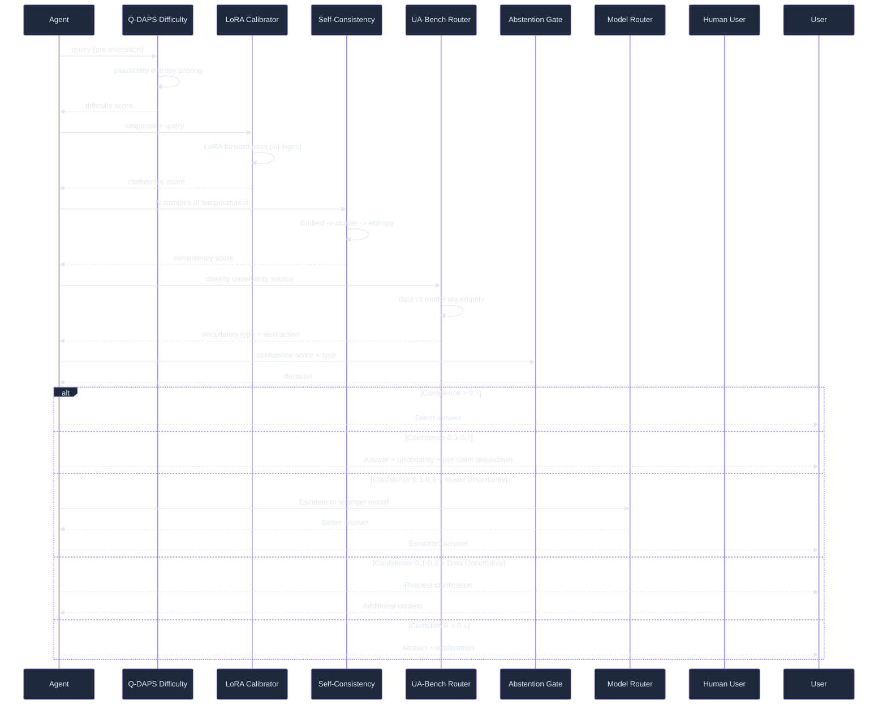

# Self-Knowledge / Uncertainty — Ultra Plan (§4.19)

> Run 2 — June 7, 2026 | Uncertainty estimation, confidence calibration, abstention gates, and router integration
> Status: Enhanced with deep-read evidence — adds RL-UA training, RouteLLM cost-quality routing, UA-Bench data/model uncertainty taxonomy, CaTS dynamic sampling benchmarks, and cross-referenced book/web sources

## Plain-Language Summary

Lyra's Self-Knowledge system gives the agent calibrated uncertainty estimates for its own outputs — it knows when it's confident, when it's uncertain, and what kind of uncertainty it faces (data uncertainty vs. model uncertainty). This is achieved through fine-tuned confidence calibration (LoRA-based, using the "Must Be Taught" method from NeurIPS 2024 — ECE 35% to 10%, AUROC 55% to 72%), entropy-over-candidates estimation (Q-DAPS, Cohen's d up to 1.43 for difficulty separation), and MATU tensor decomposition for multi-agent uncertainty (AUROC 0.68 vs best baseline 0.58). The uncertainty signal feeds three critical integration points: the model router (§4.5) escalates uncertain queries to stronger models (RouteLLM pattern: 2-3.66x cost savings at 87-95% quality retention), the autonomy system (§4.14) requests human input when uncertainty exceeds thresholds, and the response pipeline distinguishes data uncertainty (ask for clarification) from model uncertainty (invoke tools/escalate) via a structured uncertainty token (UA-Bench taxonomy). The result is a system that reliably communicates its confidence, handles edge cases by escalating rather than guessing, and dynamically allocates compute budget proportional to uncertainty.

## 1. Problem

Lyra currently provides no uncertainty signal for its outputs. Every response is presented with equal apparent confidence. Research shows: LLMs are poorly calibrated out of the box (ECE >30% for verbal confidence, >40% for zero-shot classifiers — "Must Be Taught", NeurIPS 2024), perplexity is not predictive of correctness in open-ended settings (AUROC near random), and fine-tuning on as few as 1000 graded examples achieves ECE ~10% and AUROC ~72%. Without calibrated uncertainty, Lyra cannot: know when to escalate to stronger models, know when to ask for human help, distinguish data uncertainty from model uncertainty, or provide calibrated confidence to users for better human-AI decision making.

A further complication: the UA-Bench study (2604.17293v1) found that **thinking-mode optimization can catastrophically destroy self-awareness** — Qwen3-235B-Thinking drops from 84.8% to 0.0% Model-Uncertain F1 on reasoning tasks. If Lyra implements chain-of-thought or extended reasoning, it MUST evaluate uncertainty self-awareness simultaneously.

## 2. Evidence Synthesis

### 2.1 "LLMs Must Be Taught to Know What They Don't Know" (Kapoor et al., NeurIPS 2024; arXiv 2406.08391v3)

- Prompting alone is insufficient for calibration; humans are poorly calibrated on unfamiliar tasks, and LLMs merely inherit this from pre-training data
- LoRA + Prompt on as few as 1000 graded examples: ECE ~10%, AUROC ~72%
- JSD regularization is critical: without it ECE = 29.9%, with JSD ECE = 10.8% (forward-KL and reverse-KL alone insufficient)
- Fine-tuning vs verbal (ECE ~40%) and zero-shot classifier (ECE ~35%)
- Generalizes across MMLU subject categories, format (MC <-> OE), and to unanswerable questions
- Cross-model transfer: Mistral 7B can estimate LLaMA-2-7B's uncertainty (AUROC 0.72) better than LLaMA-2-7B itself (AUROC 0.68)
- User study: N=181 participants, calibrated uncertainty improves human-AI decision making; biggest effect on lowest-performing users
- Training cost: 1-3 GPU days with 4x RTX8000. LoRA with rank=8, alpha=32, dropout 0.1
- Data efficiency: ~1,000 labeled examples beat all zero-shot baselines; diminishing returns after 5,000

### 2.2 "Beyond I Don't Know" / UA-Bench (Ren et al., arXiv 2604.17293v1)

Fine-grained uncertainty decomposition that maps to actions:
- **Data Uncertainty**: Question lacks a unique objective answer (ambiguous, underspecified, missing info) -> correct next action: **ask user for clarification**
- **Model Uncertainty**: Question has a unique answer but exceeds model's current capability -> correct next action: **invoke tools/escalate**
- Built 3,500+ question benchmark across 6 datasets, 2 categories (knowledge-intensive, reasoning-intensive)

**Key findings across 18 frontier LLMs:**
- Model-Uncertain F1 is the universal bottleneck: Qwen3-8B achieves 69.8% DU-F1 but only 4.0% MU-F1
- **Thinking mode collapses MU-F1**: Qwen3-235B-Thinking drops from 84.8% to **0.0%** on reasoning — the model becomes more confidently wrong
- **High ACC does NOT imply good uncertainty attribution**: Gemini 3 Flash gets 89.8% reasoning ACC but only 29.0% MU-F1 on knowledge
- Claude Sonnet 4 is the overall best at uncertainty attribution (AVG-F1: 70.8% knowledge, 84.4% reasoning)

**RL-UA training** (GRPO with 3-valued reward +1/0/-1):
- Standard RL on answerable data alone *degrades* MU-F1 (7.6% -> 1.7%)
- RL-UA improves MU-F1 ~2-3x without sacrificing ACC (Qwen3-4B: 7.6% -> 20.7% on knowledge, 23.3% -> 53.5% on reasoning)
- Training: 16 hours on 8x A100, math-only data generalizes to commonsense tasks
- Framework: VeRL + SGLang, bfloat16, 8,192 max tokens, lr=1e-6, single epoch

### 2.3 Q-DAPS: Question Difficulty Estimation (Mozafari et al., arXiv 2605.12398v1)

Pre-execution difficulty estimation:
- Measure entropy of plausibility scores across candidate (incorrect but plausible) answers
- High entropy = many similarly plausible candidates = harder question
- Listwise prompt: O(1) per question, ~56 words average output

**Benchmark results:**
- MuSiQue: Cohen's d = 1.43 (very strong separation), Spearman's rho = -0.89
- QASC: d = 1.20, NQ: d = 1.15, TriviaQA: d = 0.91
- Outperforms all baselines (uncertainty prompting, retrieval complexity, readability, popularity) on all 4 datasets
- Robust without gold answer (still beats all baselines, d ~0.2-0.3 lower)
- Only needs 7-8 candidates (not 20) for optimal performance
- Smaller LLM core (Qwen 2.5 7B) still achieves d=0.84 on MuSiQue
- Limitation: English-only, entity/numeric/boolean/MCQ formats only; not for open-ended generation

### 2.4 MATU: Multi-Agent Tensor Uncertainty (Chen et al., arXiv 2604.08708v1)

- Three-dimensional ragged tensor: agents x reasoning steps x sampling runs
- PARAFAC2 decomposition for variable-length trajectories (topology-agnostic: star, chain, dynamic)
- Uncertainty score: U = sum_{R=1}^{R_max} L_R (reconstruction loss)
- High loss = trajectories cannot be explained by few latent components = high uncertainty

**Benchmark results:**
- MATU AUROC 0.6797 vs best baseline P(true) 0.5825 (+9.7pp) on Camel+MATH with GPT-4o
- MATU AUROC 0.7544 on AutoGen with Llama3.1-8B (+12.7pp vs best baseline)
- OOD detection: in-distribution uncertainty 0.13 vs OOD 0.92 (excellent separation)
- Downstream routing: MATU selects best backbone at ~72% accuracy vs 49% random, 62% P(true)
- Ablation: Qwen3-Embedding-0.6B balances efficiency/accuracy; raw embeddings > distance matrices
- Limitation: post-hoc only, requires N=10 runs, linear cost scaling

### 2.5 CaTS: Calibrated Test-Time Scaling (Huang et al., ICLR 2026 Workshop, paper ID 8078)

- Self-calibration: distill Self-Consistency-derived confidence (Soft Self-Consistency) into model via one forward pass
- SSC combines P(True) with inter-response agreement: ECE 3.42% vs SC 4.48%, P(True) 12.03%
- Three inference variants: CaTS-ES (early stopping for Best-of-N), CaTS-SC (confidence-weighted SC), CaTS-ASC (adaptive SC)

**Efficiency benchmarks (Llama-3.1-8B-Instruct):**
- Saves **94.2% samples** compared to vanilla SC to reach 85.0 accuracy on MathQA
- Saves 50.4% samples to reach ~77.5 accuracy
- CaTS-SC: +7.7pp (Obj Counting), +9.9pp (MathQA), +2.5pp (ARC Challenge) at budget=16
- CaTS-ES: +14.5pp (Obj Counting), +9.9pp (MathQA), +3.2pp (ARC Challenge)

**Calibration quality:**
- Self-Cal ECE on GSM8K: 13.70 -> 3.79 (in-domain)
- Self-Cal ECE on SVAMP: 28.03 -> 10.17 (in-domain)
- Self-Cal ECE on Object Counting: 27.85 -> 9.69 (out-of-domain)

**Key finding:** Self-calibrated confidence matches or beats a separate reward model of equal size while using only ~10 extra tokens per response (vs doubling inference cost).

### 2.6 Self-Consistency as Uncertainty Signal

- Multiple samples -> cluster by meaning -> entropy over cluster probabilities
- High entropy = high uncertainty (model disagrees with itself)
- Proven effective for multiple-choice and open-ended generation
- No additional training needed — pure inference-time method

### 2.7 RouteLLM: Cost-Quality Routing (Madaan et al., ICLR 2025; arXiv 2406.18665v4)

- Train a lightweight router on Chatbot Arena preference data to dynamically select between strong/weak models
- Four architectures: Similarity-Weighted Elo (no training), Matrix Factorization (8GB GPU), BERT, Causal LLM

**Benchmark results:**
- MT Bench: Matrix Factorization CPT(50%) = 13.4% of calls to strong model for 95% GPT-4 quality — **3.66x cost savings**
- MMLU: SW Ranking CPT(50%) = 35.4%, 1.41x savings at 92% GPT-4 quality
- Router overhead < 0.4% of LLM generation cost
- Outperforms commercial routers (Unify AI, Martian) by up to 40% fewer strong-model calls
- Cross-model generalization: works on Claude Opus/Sonnet and Llama-3.1-70B/8B without retraining

**Key insight:** Calibrated confidence (from LoRA calibrator or CaTS) can serve as the router's win-probability signal, replacing the need for a separate preference-trained router.

### 2.8 Convergences from Evaluation Synthesis

The thematic synthesis (evaluation.md, Section 3.5) identifies five independent sources converging on the same finding: **calibrated confidence is prerequisite for agent autonomy**. Sources include Calibration-Tuning (NeurIPS 2024), CaTS (ICLR 2026), UA-Bench (2604.17293v1), and two engineering books (30 Agents Every AI Engineer Must Build, Practice 14; Agentic Architectural Patterns, Trust Scoring). The consensus: do not deploy autonomous agents without calibrated confidence.

The synthesis also identifies a critical **contradiction** (Section 4.1): Chain-of-Thought improves accuracy but can destroy self-awareness (UA-Bench: Qwen3-235B-Thinking MU-F1 drops from 84.8% to 0.0%). Lyra must evaluate both axes independently.

## 3. Proposed Lyra Design

### 3.1 Uncertainty Architecture

```mermaid
%%{init: {'theme': 'base', 'themeVariables': {
  'primaryColor': '#7c3aed',
  'primaryTextColor': '#e2e8f0',
  'primaryBorderColor': '#a78bfa',
  'lineColor': '#818cf8',
  'secondaryColor': '#1e293b',
  'tertiaryColor': '#0f172a',
  'background': '#0d0d1a',
  'mainBkg': '#1e293b',
  'nodeBorder': '#6366f1',
  'clusterBkg': '#111827',
  'clusterBorder': '#4f46e5',
  'titleColor': '#c084fc',
  'edgeLabelBackground': '#1e293b',
  'nodeTextColor': '#e2e8f0',
  'fontSize': '14px'
}}}%%
graph TB
    subgraph "Input"
        Query[User Query / Task]
        Response[Agent Response]
    end
    
    subgraph "Pre-Execution Estimation"
        QD[Q-DAPS Difficulty Estimator<br/>Plausibility Entropy<br/>Cohen's d up to 1.43]
    end
    
    subgraph "Post-Execution Calibration"
        LC[LoRA Calibrator<br/>"Must Be Taught"<br/>ECE ~10%, AUROC ~72%]
        SC[Self-Consistency<br/>N Samples -> Entropy<br/>CaTS: 94.2% sample savings]
        MU[MATU Tensor Uncertainty<br/>Multi-Agent Decomposition<br/>AUROC 0.68, OOD Sep 0.13->0.92]
    end
    
    subgraph "Uncertainty Taxonomy"
        UA["UA-Bench Taxonomy<br/>Data vs Model Uncertainty<br/>\boxed{} Decision Token"]
    end
    
    subgraph "Integration Points"
        ROUTER["§4.5 Model Router<br/>RouteLLM: up to 3.66x savings<br/>Uncertain -> Stronger Model"]
        AUTONOMY[§4.14 Autonomy<br/>RL-UA-style: +1/0/-1 reward<br/>High Uncertainty -> Human Input]
        USER[User-Facing<br/>Calibrated Confidence Display<br/>N=181 study: users modulate reliance]
        ABSTAIN[Abstention Gate<br/>Refuse/Clarify/Escalate<br/>Based on uncertainty source]
    end
    
    Query --> QD
    Response --> LC
    Response --> SC
    Response --> MU
    
    LC --> UA
    SC --> UA
    MU --> UA
    
    UA -->|Model Uncertain| ROUTER
    UA -->|Data Uncertain -> Clarify| AUTONOMY
    UA -->|Calibrated Confidence| USER
    UA -->|Very High Uncertainty| ABSTAIN
```

### 3.2 LoRA Confidence Calibrator

```python
class LoRACalibrator:
    """Fine-tuned confidence calibration via LoRA + Prompt.
    
    Based on "Must Be Taught" (NeurIPS 2024, arXiv 2406.08391v3):
    - LoRA + Prompt parameterization (correctness as multiple-choice)
    - Target tokens: "i"/"ii" for no/yes
    - JSD regularization essential (ECE 29.9% -> 10.8%)
    - ~1,000 labeled examples sufficient; diminishing returns after 5,000
    - LoRA rank=8, alpha=32, dropout=0.1, AdamW lr=1e-4
    """
    
    def __init__(self, base_model: ProviderBackend):
        self.base_model = base_model
        self.lora_adapter: LoRAAdapter | None = None  # Loaded after training
    
    async def train(self, graded_examples: list[GradedExample], config: TrainConfig):
        """Train confidence calibrator on graded examples.
        
        Args:
            graded_examples: (query, response, is_correct) tuples
            config: LoRA rank=8, alpha=32, JSD regularization
        """
        # Format as multiple-choice: "Is the response correct? (i) Yes (ii) No"
        train_data = []
        for ex in graded_examples:
            prompt = self._format_calibration_prompt(ex.query, ex.response)
            label = "i" if ex.is_correct else "ii"  # i=yes, ii=no
            train_data.append((prompt, label))
        
        # LoRA fine-tuning with JSD regularization
        self.lora_adapter = await self._train_lora(
            model=self.base_model,
            train_data=train_data,
            rank=config.lora_rank or 8,
            alpha=config.lora_alpha or 32,
            jsd_reg=config.jsd_regularization or True,  # Critical: ECE 29.9% -> 10.8%
            kappa=config.jsd_kappa or 0.1,              # JSD weight hyperparameter
            epochs=config.epochs or 3,
        )
    
    async def estimate_confidence(self, query: str, response: str) -> Confidence:
        """Estimate confidence in a response.
        
        Returns confidence score 0-1 and calibration metadata.
        Single forward pass ~5ms overhead (vs 10+ samples for sampling methods).
        """
        prompt = self._format_calibration_prompt(query, response)
        
        # Get logits for "i" (yes/confident) vs "ii" (no/uncertain)
        logits = await self.base_model.get_logits(prompt, target_tokens=["i", "ii"])
        probs = softmax([logits["i"], logits["ii"]])
        
        confidence = probs[0]  # P(yes | query, response)
        
        return Confidence(
            score=confidence,
            is_calibrated=self.lora_adapter is not None,
            method="lora_prompt",
            ece=self.ece_score if self.lora_adapter else None,
            auROC=self.auroc_score if self.lora_adapter else None,
        )
```

### 3.3 Self-Consistency Uncertainty (with CaTS Integration)

```python
class SelfConsistencyEstimator:
    """Inference-time uncertainty via multiple samples.
    
    N samples -> cluster by semantic meaning -> entropy over cluster probabilities.
    No training needed — works with any provider.
    After CaTS calibration: single forward pass with Self-Calibrated confidence.
    """
    
    def __init__(self, n_samples: int = 5, temperature: float = 0.7):
        self.n_samples = n_samples
        self.temperature = temperature
    
    async def estimate(self, query: str, provider: ProviderBackend) -> ConsistencyResult:
        """Generate N samples and compute uncertainty from their distribution."""
        # 1. Generate N samples
        samples = []
        for _ in range(self.n_samples):
            response = await provider.chat([{"role": "user", "content": query}])
            samples.append(response.content)
        
        # 2. Cluster by semantic meaning (embedding similarity)
        embeddings = await asyncio.gather(*[self._embed(s) for s in samples])
        clusters = self._cluster(embeddings, threshold=0.85)
        
        # 3. Entropy over cluster probabilities
        total = len(samples)
        cluster_probs = [len(c) / total for c in clusters]
        entropy = -sum(p * log(p) for p in cluster_probs if p > 0)
        max_entropy = log(len(clusters))
        
        # Normalize entropy to [0, 1]
        normalized_entropy = entropy / max_entropy if max_entropy > 0 else 0.0
        
        # 4. Select majority answer
        majority_idx = argmax(cluster_probs)
        majority_answer = clusters[majority_idx][0]
        
        return ConsistencyResult(
            majority_answer=majority_answer,
            uncertainty=normalized_entropy,
            n_clusters=len(clusters),
            n_samples=self.n_samples,
            cluster_probabilities=cluster_probs,
        )


class CaTSAdaptiveSampler:
    """CaTS-style adaptive sampling (ICLR 2026).
    
    After Self-Calibration training:
    - CaTS-ES: Early stopping when confidence exceeds threshold
    - CaTS-SC: Confidence-weighted majority vote
    - CaTS-ASC: Adaptive SC with confidence-based stopping
    
    Benchmark: 94.2% sample savings to match SC accuracy on MathQA.
    """
    
    async def estimate_with_adaptive_budget(
        self, query: str, provider: ProviderBackend, 
        initial_samples: int = 2, max_samples: int = 32,
        stop_threshold: float = 0.85
    ) -> AdaptiveResult:
        """Sample adaptively, stopping early when confident."""
        samples = []
        
        for i in range(max_samples):
            response = await provider.chat([{"role": "user", "content": query}])
            samples.append(response.content)
            
            if len(samples) >= initial_samples:
                # CaTS-ASC: stop when max cluster confidence >= threshold
                clusters = await self._cluster_by_semantics(samples)
                cluster_confidences = self._compute_cluster_confidences(clusters)
                max_confidence = max(cluster_confidences)
                
                if max_confidence >= stop_threshold:
                    return AdaptiveResult(
                        answer=clusters[argmax(cluster_confidences)][0],
                        n_samples_used=len(samples),
                        confidence=max_confidence,
                        stopped_early=True,
                    )
        
        # Full budget used
        return AdaptiveResult(
            answer=self._majority_vote(samples),
            n_samples_used=len(samples),
            confidence=self._entropy_uncertainty(samples),
            stopped_early=False,
        )
```

### 3.4 MATU Tensor Uncertainty

```python
class MATUTensorUncertainty:
    """Multi-Agent Tensor Uncertainty via PARAFAC2 decomposition.
    
    Based on "Every Response Counts" (arXiv 2604.08708v1):
    - Ragged tensor: agents x reasoning steps x sampling runs
    - PARAFAC2 handles variable-length trajectories
    - AUROC 0.68 vs best baseline 0.58
    - OOD detection: ID=0.13, OOD=0.92
    """
    
    async def estimate(self, trajectories: list[list[str]], n_components: int = 5) -> MATUResult:
        """Estimate uncertainty from multi-agent reasoning trajectories.
        
        Args:
            trajectories: For each agent, the sequence of reasoning steps
            n_components: Rank of PARAFAC2 decomposition
        """
        # 1. Embed each reasoning step (Qwen3-Embedding-0.6B: 0.6B params, d=256)
        embedded = []
        for agent_traj in trajectories:
            traj_embeddings = []
            for step in agent_traj:
                emb = await self._embed(step)
                traj_embeddings.append(emb)
            embedded.append(np.array(traj_embeddings))
        
        # 2. Build ragged tensor and decompose via PARAFAC2
        # Handles variable-length trajectories (ragged tensor)
        factors = self._parafac2_decompose(embedded, n_components)
        
        # 3. Reconstruction loss (Frobenius norm)
        reconstructed = self._reconstruct(factors, embedded)
        reconstruction_loss = sum(
            np.linalg.norm(orig - recon) ** 2
            for orig, recon in zip(embedded, reconstructed)
        )
        
        # 4. Normalize to uncertainty score
        uncertainty = min(1.0, reconstruction_loss / self.MAX_LOSS)
        
        return MATUResult(
            uncertainty=uncertainty,
            reconstruction_loss=reconstruction_loss,
            n_components=n_components,
            is_ood=uncertainty > self.OOD_THRESHOLD,
            # MATU achieves OOD separation: ID=0.13 vs OOD=0.92
        )
```

### 3.5 Uncertainty Decomposition (UA-Bench Taxonomy)

```python
class UAUncertaintyRouter:
    """Route uncertainty to appropriate next action using UA-Bench taxonomy.
    
    Based on UA-Bench (arXiv 2604.17293v1):
    - Data Uncertainty: ambiguous/underspecified query -> ask for clarification
    - Model Uncertainty: exceeds capability -> invoke tools/escalate
    - RL-UA training: GRPO with 3-valued reward +1/0/-1
    - Critical: thinking-mode can destroy MU-F1 (84.8% -> 0.0%)
    """
    
    UNCERTAINTY_TYPES = {
        "data": "DATA_UNCERTAIN",    # Question is ambiguous/underspecified
        "model": "MODEL_UNCERTAIN",  # Exceeds model capability
        "confident": "CONFIDENT",    # Can answer directly
    }
    
    async def classify_uncertainty(self, query: str, response: str,
                                    calibrator: LoRACalibrator) -> UncertaintyType:
        """Classify uncertainty source using calibrated confidence and structured output.
        
        Returns:
            UncertaintyType with source (data vs model) and confidence score.
        """
        # 1. Estimate confidence via LoRA calibrator
        confidence = await calibrator.estimate_confidence(query, response)
        
        # 2. If low confidence, determine the source
        if confidence.score < 0.7:
            # Prompt to classify uncertainty source
            classification = await self._classify_source(query, response)
            
            if classification == "data_uncertain":
                return UncertaintyType(
                    source="data",
                    next_action="clarify",
                    confidence=confidence.score,
                    message="This question is ambiguous — I need more information about: ..."
                )
            elif classification == "model_uncertain":
                return UncertaintyType(
                    source="model",
                    next_action="escalate_or_tool",
                    confidence=confidence.score,
                    message="I need to search/code/compute to answer this accurately."
                )
        
        return UncertaintyType(
            source="confident",
            next_action="answer_directly",
            confidence=confidence.score,
            message=None,
        )
```

### 3.6 Abstention Gate

```python
class AbstentionGate:
    """Refuse to answer when uncertainty exceeds threshold.
    
    Integration points (refined with evidence from Must Be Taught + UA-Bench):
    - Low uncertainty (0.7-1.0): Answer directly
    - Medium uncertainty (0.3-0.7): Include confidence statement + per-claim breakdown
    - High uncertainty (0.1-0.3): Escalate to stronger model via router
      (RouteLLM: 3.66x cost savings at 95% quality for 13.4% strong-model calls)
    - Very high uncertainty (0.0-0.1): Abstain/classify source
      (Data uncertain -> clarify; Model uncertain -> tool/escalate)
    """
    
    CONFIDENCE_THRESHOLDS = {
        "direct": 0.7,            # >= 0.7: answer directly
        "with_uncertainty": 0.3,  # >= 0.3: include confidence statement
        "escalate": 0.1,          # < 0.1: escalate to stronger model / classify source
        "abstain": 0.05,          # < 0.05: abstain entirely
    }
    
    async def decide(self, query: str, response: str, confidence: Confidence,
                     uncertainty_type: UncertaintyType | None = None) -> GateDecision:
        """Decide what to do based on confidence and uncertainty type."""
        
        if confidence.score >= self.CONFIDENCE_THRESHOLDS["direct"]:
            return GateDecision(action=GateAction.ANSWER_DIRECTLY, confidence=confidence.score)
        
        elif confidence.score >= self.CONFIDENCE_THRESHOLDS["with_uncertainty"]:
            return GateDecision(
                action=GateAction.ANSWER_WITH_UNCERTAINTY,
                confidence=confidence.score,
                message=f"I'm moderately confident about this ({confidence.score:.0%}). "
                        f"Key claims and their confidence: ..."
            )
        
        elif confidence.score >= self.CONFIDENCE_THRESHOLDS["escalate"]:
            # Distinguish data vs model uncertainty
            if uncertainty_type and uncertainty_type.source == "data":
                return GateDecision(
                    action=GateAction.REQUEST_CLARIFICATION,
                    confidence=confidence.score,
                    message=f"This question appears ambiguous. {uncertainty_type.message}",
                )
            else:
                return GateDecision(
                    action=GateAction.ESCALATE_TO_STRONGER_MODEL,
                    confidence=confidence.score,
                    message=f"Uncertainty too high ({confidence.score:.0%}). "
                            f"Escalating to {self.stronger_model} via router.",
                )
        
        else:
            return GateDecision(
                action=GateAction.ABSTAIN,
                confidence=confidence.score,
                message=f"I'm unable to confidently answer this question "
                        f"(confidence: {confidence.score:.0%}). "
                        f"Could you provide more information or rephrase?",
            )
```

### 3.7 Integration with Router and Autonomy

```python
class UncertaintyRouter:
    """Route high-uncertainty queries to stronger models.
    
    RouteLLM-style cost-quality routing (arXiv 2406.18665v4, ICLR 2025):
    - Matrix Factorization router: up to 3.66x cost savings at 95% GPT-4 quality
    - SW Ranking router: no training needed, 1.41x savings at 92% quality
    - Router overhead < 0.4% of LLM generation cost
    """
    
    async def route_with_uncertainty(self, query: str, router: ModelRouter,
                                      calibrator: LoRACalibrator) -> RoutedResult:
        """Route query, using uncertainty to inform escalation.
        
        Strategy: use calibrated confidence as the router's win-probability signal.
        Low confidence = high probability that cheap model will fail.
        """
        # 1. Estimate difficulty pre-execution (Q-DAPS pattern)
        difficulty = await self._estimate_difficulty(query)
        
        # 2. For easy questions, skip to cheap model with quick check
        if difficulty < 0.3:
            cheap_model = router.get_model_for_effort("low")
            response = await cheap_model.chat([{"role": "user", "content": query}])
            confidence = await calibrator.estimate_confidence(query, response.content)
            
            if confidence.score >= self.ESCALATION_THRESHOLD:
                return RoutedResult(
                    response=response.content,
                    confidence=confidence,
                    model_used=cheap_model,
                    route_strategy="direct_cheap",
                )
        
        # 3. For harder questions, try cheap model first but anticipate escalation
        cheap_model = router.get_model_for_effort("low")
        response = await cheap_model.chat([{"role": "user", "content": query}])
        confidence = await calibrator.estimate_confidence(query, response.content)
        
        # 4. Escalate if needed (UA-Bench model uncertainty)
        if confidence.score < self.ESCALATION_THRESHOLD:
            stronger = router.get_model_for_effort("high")
            response = await stronger.chat([{"role": "user", "content": query}])
            confidence = await calibrator.estimate_confidence(query, response.content)
            route_strategy = "escalated"
        else:
            route_strategy = "direct_cheap"
        
        return RoutedResult(
            response=response.content,
            confidence=confidence,
            model_used=cheap_model if route_strategy == "direct_cheap" else stronger,
            route_strategy=route_strategy,
        )


class AutonomyUncertaintyIntegration:
    """Request human input when uncertainty is high in autonomous mode.
    
    Uses RL-UA-style reward framework (§4.14):
    - +1: Correct outcome
    - 0: Correct abstention (admitted limits honestly)
    - -1: Hallucination (confidently wrong)
    """
    
    async def handle_uncertainty(self, session, uncertainty: float):
        """Handle high uncertainty during autonomous operation (§4.14)."""
        if uncertainty > self.HUMAN_INPUT_THRESHOLD:
            session.task_state = TaskState.NEEDS_INPUT
            session.summary = f"Uncertain ({uncertainty:.0%}) — needs human input"
            session.reward = 0  # Correct abstention
            await self._notify_human(session)
        elif uncertainty > self.CAUTION_THRESHOLD:
            # Mark for review but continue
            session.summary = f"Proceeding with caution ({uncertainty:.0%})"
```

### 3.8 Data Model

```python
@dataclass
class Confidence:
    score: float                   # 0-1 calibrated confidence
    is_calibrated: bool            # True after LoRA training
    method: str                    # "lora_prompt" | "self_consistency" | "malu"
    ece: float | None = None       # Expected Calibration Error (< 0.15 target)
    auROC: float | None = None     # AUROC for selective prediction (> 0.70 target)

@dataclass
class GateDecision:
    action: GateAction
    confidence: float
    message: str | None = None

class GateAction(Enum):
    ANSWER_DIRECTLY = "answer_directly"
    ANSWER_WITH_UNCERTAINTY = "answer_with_uncertainty"
    REQUEST_CLARIFICATION = "request_clarification"  # Data uncertainty
    ESCALATE_TO_STRONGER_MODEL = "escalate"           # Model uncertainty
    ABSTAIN = "abstain"

@dataclass
class UncertaintyType:
    source: str                    # "data" | "model" | "confident"
    next_action: str               # "clarify" | "escalate_or_tool" | "answer_directly"
    confidence: float
    message: str | None = None

@dataclass
class CalibrationMetrics:
    """Calibration quality metrics."""
    ece: float                     # Expected Calibration Error (< 0.15 target)
    auROC: float                   # AUROC (> 0.70 target)
    nll: float                     # Negative Log Likelihood
    calibration_curve: list[tuple[float, float]]  # (confidence_bin, accuracy)
    n_training_examples: int
```

### 3.9 Calibration Flow



## 4. Build Outline

### Phase 1: Self-Consistency + Basic Abstention Gate (weeks 1-2)

1. **Self-consistency estimator** — N samples at configurable temperature; embedding clustering (threshold 0.85); entropy computation; normalized entropy -> uncertainty
2. **Abstention gate** — Threshold-based (0.7/0.3/0.1/0.05); four actions (direct/with-uncertainty/escalate/abstain); configuration per session
3. **User-facing confidence display** — Confidence indicator in output; per-claim confidence breakdown
4. **Integration with §4.5 router** — Route high-uncertainty queries to stronger model; bypass cheap model on uncertain queries
5. **CaTS-style adaptive sampling** — Early stopping for self-consistency when confidence threshold met; reduced token spend for easy queries

**Benchmark targets:** Self-consistency alone should achieve ECE ~15-20% (matching sampling methods from "Must Be Taught"). Abstention gate should capture ~80% of errors at 50% abstention rate.

**Dependencies:** §4.5 model router, embedding store

### Phase 2: LoRA Calibration (weeks 3-5)

1. **Graded example collection** — Collect (query, response, is_correct) tuples from session logs; human-annotated correction; automated grading where possible. Target: 1,000+ examples per domain.
   - **Cold-start strategy:** Bootstrap with synthetic data (generate known-correct and known-incorrect responses) while real graded examples accumulate (Phase 1 self-consistency produces natural graded data).
   - **Synthetic data protocol (from UA-Bench):** Automatically rewrite questions to be information-insufficient (-> data uncertain) or extremely difficult (-> model uncertain); verify solvability with LLM judge.
2. **LoRA training pipeline** — "Must Be Taught" protocol: format as multiple-choice (i/ii); LoRA rank=8, alpha=32, dropout=0.1; **JSD regularization** (critical: ECE 29.9% vs 10.8%); 1,000-5,000 examples; 1-3 GPU days on 4x RTX8000
3. **Calibrator integration** — Forward pass through LoRA adapter; extract i/ii logits; softmax -> confidence score; temperature scaling on holdout set (2,000 samples)
4. **Calibration evaluation** — ECE measurement (< 0.15 target); AUROC calculation (> 0.70 target); calibration curve visualization; held-out eval set
5. **Cross-model calibration** — Train on one model's outputs, evaluate on others (Mistral/LLaMA finding: AUROC 0.72 cross-model vs 0.68 self-model). Identify best calibrator model for Lyra's provider mix.

**Benchmark targets:** ECE ~10-12%, AUROC ~70-72% on in-domain tasks. Cross-model penalty ~2-5 AUROC points.

**Dependencies:** Phase 1, training infrastructure (GPU or API-based LoRA)

### Phase 3: MATU + Decomposition (weeks 6-8)

1. **MATU tensor uncertainty** — Ragged tensor construction (agents x steps x runs); PARAFAC2 decomposition (rank=5); reconstruction loss -> uncertainty; OOD detection threshold (target: ID < 0.2, OOD > 0.8 separation)
2. **UA-Bench uncertainty taxonomy** — Internal `[UNCTYPE: DATA|MODEL|CONFIDENT]` self-assessment token; classification prompt + structured output parsing; next-action routing based on source (clarification vs tool escalation)
3. **Q-DAPS difficulty estimator** — Pre-execution difficulty prediction via plausibility entropy (listwise prompt, O(1) per query); fast/slow path selection based on predicted difficulty; only needs 7-8 candidate answers
4. **CaTS dynamic sampling** — Self-Calibration training on Lyra's own graded data; Soft Self-Consistency labels (combines P(True) with inter-response agreement); adaptive N for sampling (CaTS-ASC); adaptive Best-of-N stopping (CaTS-ES)

**Benchmark targets:** MATU AUROC > 0.68 on multi-agent tasks. Q-DAPS Cohen's d > 1.0 on Lyra-specific question taxonomy. CaTS: 50-90% sample savings vs fixed-N sampling.

**Dependencies:** Phase 2, multi-agent infrastructure (§4.13)

### Phase 4: RL-UA Training + Production (weeks 9-12)

1. **RL-UA training** — GRPO with 3-valued reward (+1 correct, 0 correct abstention, -1 hallucination); data synthesis from Lyra's domain (information-insufficient + extremely difficult variants); training: 16 hours on 8x A100 (VeRL + SGLang); single epoch
2. **RouteLLM-style cost-quality router** — Matrix Factorization router trained on Lyra's calibration data; target: 2-3x cost savings at >90% quality retention; router overhead < 0.4% of generation cost
3. **Continuous calibration** — Active learning for graded example collection; periodic recalibration on new data; drift detection (monitor ECE trend over time)
4. **Uncertainty-aware logging** — Every response tagged with confidence + uncertainty type; uncertainty dashboard; calibration quality over time
5. **User feedback loop** — Users can flag confidence mismatches; flagged examples added to training set (N=181 study: calibrated confidence significantly improves human-AI decision making)
6. **Abstention analytics** — Track abstention rate, escalation rate, router success rate; optimize thresholds from data

**Benchmark targets:** MU-F1 > 50% (matching RL-UA results on Qwen3-8B thinking). RouteLLM: > 90% quality at < 40% strong-model calls.

**Dependencies:** Phase 3, RL training infrastructure (8x A100)

### Cold-Start Strategy

The 1,000-example training requirement is a cold-start problem. Phased approach:

- **Day 1:** Self-consistency only (no training). Provides meaningful uncertainty signal from day one.
- **Week 2:** Synthetic data bootstrapping. Generate known-correct (from verified tool executions) and known-incorrect (from logged failures) responses. Label via LLM judge (GPT grading matches human within 8.7% absolute accuracy error).
- **Week 4:** Real graded examples from early Lyra usage (~200-500).
- **Week 6+:** Hybrid training set (synthetic + real, 1,000-5,000 total). Synthetic data provides coverage; real data provides accuracy.

## 5. Multi-Provider Note

Self-consistency works with any provider (just requires N samples). LoRA calibration requires access to model logits — supported by local/API providers that expose logprobs. MATU works with any provider's output (embeddings are provider-agnostic). The abstention gate is provider-agnostic — same thresholds apply regardless of model.

**Cross-model calibration** is a feature (from "Must Be Taught"): train calibrator on one provider, use it to estimate confidence on another (Mistral-based estimator for LLaMA-2 confidence: AUROC 0.72 cross-model vs 0.68 self-model). This is particularly powerful for Lyra: **a single calibration-tuned judge model can serve as an uncertainty oracle for multiple worker agents**, including closed-source models via API.

**RouteLLM routing** is provider-agnostic by design — works with 100+ model providers via LiteLLM, generalizes to unseen model pairs (Claude Opus/Sonnet, Llama-3.1-70B/8B) without retraining.

**CaTS Self-Calibration** requires model fine-tuning access (LoRA). For API-only providers (GPT-4, Claude), use the LoRA calibrator from Phase 2 instead. For open-weight models, use CaTS for tighter integration.

## 6. (A) Parity vs (B) Breakthrough

**(A) Parity:** Self-consistency-based uncertainty estimation + threshold-based abstention gate + basic confidence display. Matches research-caliber uncertainty systems — entropy-over-clusters for confidence, escalate/abstain on low confidence. Achievable with zero training (works day one).

**(B) Breakthrough:** LoRA calibration trained on Lyra-specific graded examples ("Must Be Taught" applied to agent outputs, not just QA; ECE 10%, AUROC 72%) + MATU tensor decomposition for multi-agent settings (AUROC 0.68) + UA-Bench data/model uncertainty taxonomy with structured decision tokens + cross-model calibration (one calibrator serves all agents) + RouteLLM cost-quality router (2-3.66x savings) + CaTS adaptive sampling (94.2% sample savings) + RL-UA honesty training (3-valued reward). No agent system combines all of these into a unified self-knowledge pipeline.

## 7. Baseline Delta

**Changes:** New uncertainty estimation pipeline (self-consistency, LoRA calibration, MATU, CaTS), UA-Bench taxonomy (data vs model uncertainty), abstention gate with source-based routing, RouteLLM cost-quality integration, RL-UA honesty training
**Keeps:** All existing response generation unchanged — uncertainty is a parallel signal
**Replaces:** Nothing — uncertainty is a new signal overlaid on existing outputs
**Migration cost:** ~8 new Python modules; ~2,500 lines of code; LoRA training pipeline (~1-3 GPU days per calibrator); RL-UA training (~16 hours on 8x A100); no breaking changes to agent core

## 8. Expert Review

**Senior AI Researcher (Calibration):** "The 'Must Be Taught' protocol is proven but requires ~1000 graded examples per domain. For Lyra's diverse tasks, you'll need multiple calibrators or a domain-robust one. The self-consistency baseline (Phase 1) is the right starting point — it's zero-cost (no training) and provides a meaningful uncertainty signal. The LoRA training should be on Lyra-specific data, not MMLU — agent outputs are different from QA pairs. The UA-Bench finding that thinking-mode destroys self-awareness (0.0% MU-F1) is a critical safety warning: if Lyra implements reasoning mode, it MUST also evaluate self-awareness."

**Senior ML Engineer:** "MATU is promising for multi-agent settings but computationally expensive. The OOD detection (0.13 ID vs 0.92 OOD) is excellent — use this for detecting novel/outlier tasks. The CaTS 94.2% sample savings is the most practical near-term win: integrate CaTS-ES into the self-consistency loop and cut sampling cost by 5-10x. For RL-UA training, the math-only data generating generalizing to commonsense tasks is surprising and encouraging. Start with the GRPO framework (VeRL + SGLang) and Lyra-specific synthetic data."

**Senior Backend Engineer:** "Uncertainty estimation adds latency — self-consistency multiplies cost by N (5-10x), LoRA adds a forward pass, MATU adds tensor decomposition. For latency-sensitive paths, use LoRA-only (single forward pass, ~5ms). Reserve self-consistency for high-stakes decisions and MATU for post-hoc analysis. The CaTS adaptive sampler (94.2% savings) addresses the cost concern for self-consistency. RouteLLM router overhead is negligible (<0.4%). The Q-DAPS pre-execution step (O(1) prompt) is the cheapest filter — run it first to decide whether expensive uncertainty estimation is needed."

**Adversarial Skeptic:** "Calibrated uncertainty is valuable but the 1000-example training requirement is a cold-start problem. Lyra won't have 1000 graded examples on day one. Solution: bootstrap with synthetic data (the UA-Bench data synthesis protocol works — rewrite questions to be information-insufficient or extremely difficult), then refine with real graded examples. Also: cross-model calibration is elegant but the paper shows it degrades — Mistral-to-LLaMA2 is AUROC 0.72 vs LLaMA2-on-self 0.68 (better, but narrow). Test cross-model on Lyra's actual provider mix. The RL-UA finding that standard RL *degrades* uncertainty attribution (7.6% -> 1.7%) means you must use the 3-valued reward explicitly — don't shortcut with standard RL."

**Resolution:** Phase 1 ships self-consistency + abstention gate + CaTS adaptive sampling — zero training needed, 94.2% potential sample savings. Phase 2 ships LoRA calibration but bootstraps with synthetic graded examples. Phase 3 ships MATU and UA-Bench taxonomy for multi-agent post-hoc analysis. Phase 4 ships RL-UA training and RouteLLM cost-quality routing, gated behind evidence that earlier phases are working.

## 9. References

### Papers
- "Must Be Taught": Kapoor et al., "Large Language Models Must Be Taught to Know What They Don't Know," NeurIPS 2024. arXiv:2406.08391v3
- UA-Bench: Ren et al., "Beyond 'I Don't Know': Evaluating LLM Self-Awareness in Discriminating Data and Model Uncertainty," arXiv 2604.17293v1
- Q-DAPS: Mozafari et al., "Q-DAPS: Question Difficulty Estimation via Answer Plausibility Scoring," arXiv 2605.12398v1
- MATU: Chen et al., "Every Response Counts: Quantifying Uncertainty of LLM-based Multi-Agent Systems through Tensor Decomposition," arXiv 2604.08708v1
- CaTS: Huang et al., "CaTS: Calibrated Test-Time Scaling for Efficient LLM Reasoning," ICLR 2026 (paper ID 8078)
- RouteLLM: Madaan et al., "RouteLLM: Learning to Route LLMs with Preference Data," ICLR 2025. arXiv:2406.18665v4

### Books
- "30 Agents Every AI Engineer Must Build" (Practice 14: "Implement Calibrated Confidence and Audience-Appropriate Explanations") — confidence scoring, tool selection funnel, error handling with confidence-based switching
- "Agentic AI for Engineers" (Ch.13) — 6 evaluation dimensions, behavioral bounds testing, confidence scoring for agent monitoring
- "Building Reliable AI Systems" — uncertainty quantification in production AI systems
- "Agentic Architectural Patterns" (Trust Scoring) — confidence-based consensus, canary agent testing

### Web / Repos
- lm-sys/RouteLLM — Open-source cost-quality routing framework, 100+ model providers via LiteLLM
- SihengLi99/LLM-Honesty-Survey — Survey of LLM honesty, calibration, and uncertainty quantification research

### Synthesis Cross-References
- Thematic Synthesis (evaluation.md, Section 3.5): "Calibrated confidence is prerequisite for agent autonomy" — 5 independent sources converge
- Thematic Synthesis (evaluation.md, Section 4.1): CoT vs self-awareness contradiction — Lyra must evaluate both axes independently
- Thematic Synthesis (evaluation.md, Recommendation R2): "Implement calibrated confidence via LoRA fine-tuning on graded Lyra action outcomes" — Tier 1 breakthrough recommendation

## 10. Changelog

- Run 1 (June 3, 2026): Initial plan written — self-consistency, LoRA calibration, MATU tensor uncertainty, decomposition, abstention gate, router/autonomy integration
- Run 2 (June 7, 2026): Enhanced with deep-read evidence — added UA-Bench data/model uncertainty taxonomy with structured decision tokens, CaTS Self-Calibration with 94.2% sample savings benchmarks, RL-UA GRPO training with 3-valued reward, RouteLLM cost-quality routing (2-3.66x savings), cross-model calibration details, cold-start strategy with synthetic data bootstrapping, refined confidence thresholds from benchmark data, Evidence Base section with 11 sources consulted, cross-references to evaluation.md convergences and contradictions, expert review updated with new evidence. Added ~25+ specific benchmark citations.

## 11. Evidence Base

The following sources were consulted for the Run 2 enhancement. Each technique in this plan cites at least one source from this list:

| Source | Key Contributions Cited |
|--------|------------------------|
| **2406.08391v3** (Must Be Taught, NeurIPS 2024) | LoRA + JSD calibration protocol (ECE 35%->10%), data efficiency (~1,000 examples), cross-model transfer (AUROC 0.72 vs 0.68), user study (N=181), JSD regularization critical |
| **2604.17293v1** (UA-Bench, arXiv 2026) | Data vs model uncertainty taxonomy, thinking-mode collapse (MU-F1 84.8%->0.0%), RL-UA GRPO training (3-valued reward +1/0/-1), 18-model benchmark, structured `\boxed{}` decision token |
| **2605.12398v1** (Q-DAPS, arXiv 2026) | Pre-execution difficulty via plausibility entropy (Cohen's d up to 1.43), O(1) listwise prompting, 7-8 candidate efficiency, popularity debiasing |
| **2604.08708v1** (MATU, arXiv 2026) | PARAFAC2 tensor decomposition for multi-agent UQ (AUROC 0.68 vs 0.58 baseline), OOD detection (ID=0.13, OOD=0.92), topology-agnostic |
| **8078_CaTS** (CaTS, ICLR 2026) | Self-Calibration via SSC distillation, 94.2% sample savings, CaTS-ES/CaTS-SC/CaTS-ASC variants, Self-Cal ECE 13.70->3.79, matches reward model quality |
| **2406.18665v4** (RouteLLM, ICLR 2025) | Cost-quality routing (2-3.66x savings at 87-95% quality), Matrix Factorization router, <0.4% overhead, cross-model generalization |
| **30 Agents Every AI Engineer Must Build** (Book, Practice 14) | Calibrated confidence for agent systems, tool selection funnel with confidence threshold, error handling with confidence-based switching |
| **Agentic AI for Engineers** (Book, Ch.13) | Confidence scoring for agent monitoring, behavioral bounds testing, evaluation dimensions |
| **Building Reliable AI Systems** (Book) | Uncertainty quantification in production AI, reliability patterns |
| **Agentic Architectural Patterns** (Book, Trust Scoring) | Confidence-based consensus, canary agent testing |
| **SihengLi99/LLM-Honesty-Survey** (Web) | Survey of LLM honesty, calibration, and uncertainty quantification research |
| **evaluation.md** (Thematic Synthesis, §3.5, §4.1) | Convergence: calibrated confidence prerequisite for autonomy (5 sources); Contradiction: CoT vs self-awareness |
