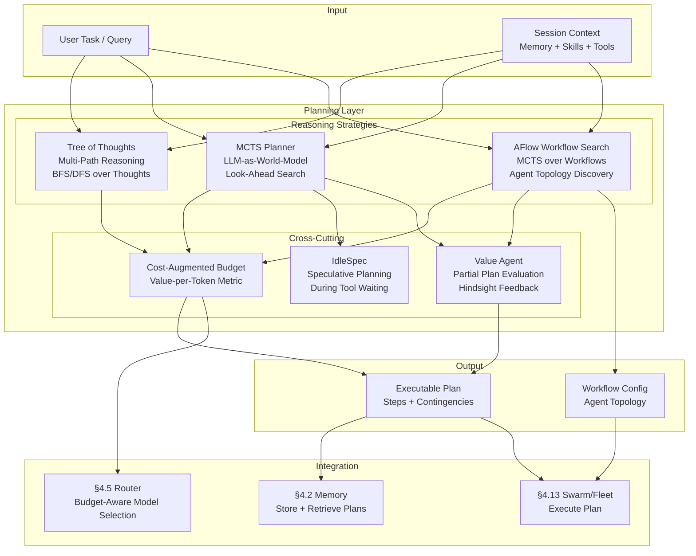
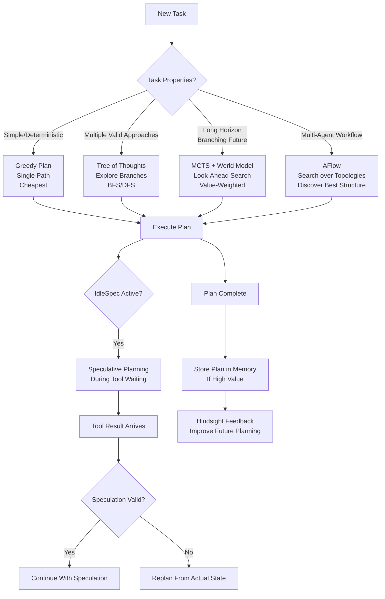

# Planning & Reasoning Layer — Ultra Plan (§4.20)

> Run 1 — June 3, 2026 | MCTS-based planning with LLM-as-world-model, Tree of Thoughts, AFlow workflow search, and IdleSpec speculation
> Status: New plan — integrates RAP, SWE-Search, AFlow, ToT, IterResearch, cost-augmented MCTS, and IdleSpec

## Plain-Language Summary

Lyra's Planning & Reasoning Layer sits above memory and skills, feeding action decisions to agents. Instead of generating a single plan and following it greedily, Lyra explores multiple reasoning paths simultaneously (Tree of Thoughts), uses Monte Carlo Tree Search with the LLM as a world model to evaluate future outcomes (RAP pattern), and searches over agentic workflows (AFlow) to find optimal orchestration patterns. The layer is cost-aware — it tracks its exploration budget and optimizes the value-per-token tradeoff. During idle time when the agent waits for tool results, the IdleSpec mechanism speculatively plans future steps, achieving 2-3x agent loop speedup. The result is deeper, more robust planning that considers multiple alternatives and allocates reasoning compute where it matters most.

## 1. Problem

Lyra currently plans greedily — the agent generates one plan, executes it step by step, and only backtracks on error. There is no systematic exploration of alternative plans, no look-ahead evaluation, no search over workflow structures, and no budget-aware planning. Research shows: MCTS with LLM-as-world-model achieves 94% on GSM8K (GTD), SWE-Search with hindsight feedback achieves +23% on repository-level tasks, AFlow's MCTS-over-workflows finds structures that outperform hand-designed topologies, and IdleSpec achieves 2-3x agent loop speedup by planning during tool-waiting idle time. Lyra needs a planning layer that explores alternatives, evaluates future outcomes, and optimizes both plan quality and compute efficiency.

## 2. Evidence Synthesis

### 2.1 Reasoning via Planning (RAP) — MCTS with LLM as World Model

- LLM serves as both policy (what to try) and world model (what would happen)
- MCTS explores multiple reasoning paths, backpropagating rewards
- Combines the generality of LLMs with the search efficiency of MCTS
- Demonstrated on math reasoning, planning, and symbolic tasks
- Key design: state = current reasoning trace, action = next reasoning step, reward = likelihood of reaching correct answer

### 2.2 SWE-Search: MCTS + Value Agent for Repository-Level Code

- MCTS with hindsight feedback for software engineering tasks
- Value agent evaluates the quality of partial solutions
- Hindsight feedback: after reaching a terminal state, propagate the outcome back through the search tree
- +23% improvement on SWE-bench-style tasks
- Key innovation: value agent uses execution feedback (test results, diff quality) not just LLM judgment

### 2.3 AFlow: MCTS over Agentic Workflows

- Nodes = whole workflows, not individual reasoning steps
- MCTS searches over workflow structures: which agents, in what order, with what tools
- Discovers workflow topologies that outperform hand-designed alternatives
- Particularly effective for multi-agent coordination patterns
- Integration with Misevolve findings: workflow optimization can degrade safety (ASR 54.4% → 83.1%)

### 2.4 Tree of Thoughts (ToT) — Foundational Multi-Path Reasoning

- Generate multiple thought candidates at each step
- Evaluate each candidate's promise
- Breadth-first or depth-first search over the thought tree
- Proven on Game of 24, creative writing, crossword puzzles
- Foundation pattern that MCTS extends with look-ahead

### 2.5 IterResearch: MDP Workspace Reconstruction

- Research as Markov Decision Process over workspace state
- Evolving report-as-memory: each step updates the report
- State = current workspace (files, notes, findings)
- Action = research action (search, read, synthesize, write)
- Reward = progress toward research goal
- Report-as-memory ensures state is always accessible and updated

### 2.6 Cost-Augmented MCTS

- Budget-aware search: prune branches that exceed compute budget with low expected value
- Value-per-token as optimization metric: prefer branches with high information density
- Dynamic depth: continue exploring high-potential branches longer, prune low-potential
- Essential for production deployment where API costs matter

### 2.7 IdleSpec: Speculative Planning During Tool-Waiting Idle Time

- When agent calls a tool (e.g., file read, API call), there's a 500ms-5s idle gap
- IdleSpec: use this idle time to speculatively plan next N steps
- 2-3x agent loop speedup: planning is overlapped with waiting
- Speculative plans are verified: if the tool result matches the speculation, continue without replanning
- If tool result contradicts the speculation, discard and replan from actual state
- Zero additional latency: planning happens during otherwise-wasted idle time

### 2.8 GTD: Guided Topology Diffusion

- Generates optimal communication topologies for multi-agent systems
- GSM8K: 94.14% (vs 87.45% vanilla); MATH: 54.07% (vs 46.29% vanilla)
- Near-zero cascading failure when agents drop out (0.3pp drop vs DyLAN's 13pp)
- ~4.8M tokens at 94% on GSM8K vs LLM-Debate using 5x more tokens

## 3. Proposed Lyra Design

### 3.1 Planning Layer Architecture



### 3.2 Tree of Thoughts

```python
class TreeOfThoughts:
    """Multi-path reasoning via tree search over thought candidates.
    
    At each step, generate K thought candidates and evaluate each.
    BFS: keep top-B candidates at each level.
    DFS: explore deepest promising path first.
    """
    
    async def plan(self, task: str, config: ToTConfig) -> Plan:
        """Generate plan via tree-of-thoughts reasoning."""
        root = ThoughtNode(content=task, depth=0)
        frontier = [root]
        
        for depth in range(config.max_depth):
            candidates = []
            
            for node in frontier:
                # Generate K thought candidates from current node
                thoughts = await self._generate_thoughts(node, k=config.k_candidates)
                
                for thought in thoughts:
                    # Evaluate candidate's promise
                    value = await self._evaluate_promise(thought)
                    child = ThoughtNode(
                        content=thought,
                        parent=node,
                        depth=depth + 1,
                        value=value,
                    )
                    candidates.append(child)
            
            # Prune to top-B candidates (BFS) or best-1 (DFS)
            candidates.sort(key=lambda n: n.value, reverse=True)
            if config.search_strategy == "bfs":
                frontier = candidates[:config.breadth_limit]
            else:  # dfs
                frontier = [candidates[0]]
            
            # Cost-augmented pruning
            if self._exceeded_budget(candidates, self.total_cost):
                break
        
        # Reconstruct best path
        best_leaf = max(self._get_leaves(root), key=lambda n: n.value)
        return self._reconstruct_plan(best_leaf)
```

### 3.3 MCTS Planner (RAP pattern)

```python
@dataclass
class MCTSNode:
    """Node in the MCTS planning tree."""
    state: str                  # Current reasoning state
    parent: "MCTSNode" = None
    children: list["MCTSNode"] = field(default_factory=list)
    
    # MCTS statistics
    visits: int = 0
    value: float = 0.0           # Cumulative reward
    prior: float = 0.0           # Prior probability (from policy)
    
    # Metadata
    depth: int = 0
    action: str = ""             # What action led to this state
    is_terminal: bool = False
    
    @property
    def ucb_score(self) -> float:
        """UCT (Upper Confidence bounds applied to Trees) score."""
        if self.visits == 0:
            return float('inf')
        exploitation = self.value / self.visits
        exploration = self.exploration_weight * sqrt(log(self.parent.visits) / self.visits)
        return exploitation + exploration

class MCTSPlanner:
    """Monte Carlo Tree Search with LLM-as-world-model.
    
    Uses the LLM as both:
    - Policy: propose possible next actions
    - World model: simulate what would happen after each action
    """
    
    def __init__(self, llm_policy: ProviderBackend, llm_world_model: ProviderBackend, 
                 value_model: ProviderBackend, config: MCTSConfig):
        self.policy = llm_policy          # Proposes actions
        self.world_model = llm_world_model  # Simulates outcomes
        self.value = value_model           # Evaluates states
        self.config = config
    
    async def search(self, task: str, budget: int = 50) -> Plan:
        """Run MCTS to find optimal plan."""
        root = MCTSNode(state=task, depth=0)
        
        for iteration in range(budget):
            # 1. SELECT: traverse tree using UCB until leaf
            node = self._select(root)
            
            # 2. EXPAND: generate child states
            if not node.is_terminal and node.depth < self.config.max_depth:
                children = await self._expand(node)
                node.children = children
                node = choice(children)  # Default: first child
            
            # 3. SIMULATE: rollout from expanded node using world model
            reward = await self._simulate(node, task)
            
            # 4. BACKPROPAGATE: update values up the tree
            self._backpropagate(node, reward)
        
        # Return best path from root
        return self._extract_best_plan(root)
    
    async def _expand(self, node: MCTSNode) -> list[MCTSNode]:
        """Propose K possible next actions and simulate their outcomes."""
        # Policy: propose actions
        actions = await self.policy.chat([
            {"role": "system", "content": f"Propose {self.config.k_actions} possible next actions "
                                           f"given the current state. Consider different approaches."},
            {"role": "user", "content": node.state}
        ])
        
        children = []
        for action in self._parse_actions(actions.content):
            # World model: simulate outcome
            outcome = await self.world_model.chat([
                {"role": "system", "content": "Simulate what would happen after this action."},
                {"role": "user", "content": f"State: {node.state}\nAction: {action}"}
            ])
            
            # Value model: evaluate new state
            value = await self.value.chat([
                {"role": "system", "content": "Rate this state's promise toward completing the task (0-1)."},
                {"role": "user", "content": outcome.content}
            ])
            
            children.append(MCTSNode(
                state=outcome.content,
                parent=node,
                depth=node.depth + 1,
                action=action,
                prior=1.0 / len(actions),  # Uniform prior
                value=float(value.content.strip()),
            ))
        
        return children
    
    async def _simulate(self, node: MCTSNode, task: str) -> float:
        """Rollout simulation: estimate future reward from this state."""
        # Short simulation: just use value model (fast), or
        # Full simulation: continue MCTS for N more steps (slow, more accurate)
        if self.config.simulation_mode == "fast":
            value = await self.value.chat([
                {"role": "system", "content": "Estimate the final reward (0-1) for completing this task from current state."},
                {"role": "user", content": f"Task: {task}\nCurrent state: {node.state}"}
            ])
            return float(value.content.strip())
        
        elif self.config.simulation_mode == "full":
            # Recursive N-step simulation
            return await self._rollout(node, task, steps=self.config.rollout_depth)
```

### 3.4 AFlow: MCTS over Agentic Workflows

```python
class AFlowWorkflowSearch:
    """MCTS over agentic workflow structures.
    
    Nodes = whole workflow configurations, not individual reasoning steps.
    Searches over: which agents, in what order, with what tools.
    """
    
    async def search_workflow(self, task: Task) -> WorkflowConfig:
        """Discover optimal workflow structure for a task."""
        root = WorkflowNode(config=WorkflowConfig.linear())  # Start with simple linear
        
        for iteration in range(self.config.search_budget):
            # 1. SELECT: most promising workflow node
            node = self._select_workflow(root)
            
            # 2. EXPAND: generate workflow variants
            variants = await self._propose_workflow_variants(node.config, task)
            for variant in variants:
                child = WorkflowNode(config=variant, parent=node)
                node.children.append(child)
            
            # 3. EVALUATE: run each variant with rollouts
            for child in node.children:
                result = await self._rollout_workflow(child.config, task)
                child.value = result.success_rate
                child.visits += 1
            
            # 4. BACKPROPAGATE
            self._backpropagate_workflow(node)
        
        return self._best_workflow(root)
    
    async def _propose_workflow_variants(self, config: WorkflowConfig, task: Task) -> list[WorkflowConfig]:
        """Generate workflow variants by mutating structure.
        
        Mutations:
        - Add/remove agent
        - Change agent roles (verifier, researcher, coder)
        - Change topology (chain → parallel → ensemble)
        - Add/remove verification step
        """
        variants = await self.designer_model.chat([
            {"role": "system", "content": "Propose 4 variants of this agentic workflow configuration. "
                                          "Each variant should explore a different structural approach "
                                          "(e.g., parallel verification, hierarchical delegation, ensemble voting)."},
            {"role": "user", "content": f"Task: {task}\nCurrent config: {json.dumps(config.to_dict())}"}
        ])
        
        return [WorkflowConfig.from_dict(v) for v in self._parse_variants(variants.content)]
```

### 3.5 IdleSpec: Speculative Planning

```python
class IdleSpec:
    """Speculative planning during tool-waiting idle time.
    
    When agent calls a tool (500ms-5s wait), use that idle time
    to speculatively plan the next N steps.
    Achieves 2-3x agent loop speedup.
    """
    
    def __init__(self, planner: MCTSPlanner):
        self.planner = planner
        self.speculative_plans: dict[str, list[SpeculativeStep]] = {}
    
    async def on_tool_call(self, session_id: str, tool_name: str, tool_args: dict, task: str):
        """Called when agent invokes a tool — use idle time for speculation."""
        
        # Predict tool result and plan next steps
        predicted_state = await self._predict_tool_result(tool_name, tool_args, task)
        
        # Run fast MCTS from predicted state
        speculative_plan = await self.planner.search(
            task=predicted_state, 
            budget=self.config.speculation_budget  # Fewer iterations for speed
        )
        
        self.speculative_plans[session_id] = speculative_plan.steps
    
    async def on_tool_result(self, session_id: str, tool_result: str) -> PlanStep | None:
        """Called when tool result arrives — use speculation if valid."""
        plans = self.speculative_plans.get(session_id, [])
        if not plans:
            return None  # No speculation available
        
        # Verify: does the actual result match the prediction?
        first_step = plans[0]
        is_valid = await self._verify_speculation(first_step, tool_result)
        
        if is_valid:
            # Consume the speculation — continue without replanning
            self.speculative_plans[session_id] = plans[1:]
            return first_step
        else:
            # Mismatch — discard speculation, trigger replan
            self.speculative_plans.pop(session_id, None)
            return None
    
    async def _predict_tool_result(self, tool_name: str, args: dict, task: str) -> str:
        """Use world model to predict what the tool will return."""
        prediction = await self.planner.world_model.chat([
            {"role": "system", "content": "Predict the result of this tool call based on the task context."},
            {"role": "user", "content": f"Task: {task}\nTool: {tool_name}\nArgs: {json.dumps(args)}"}
        ])
        return prediction.content
```

### 3.6 Cost-Augmented MCTS

```python
class CostAugmentedMCTS:
    """MCTS with budget-aware pruning.
    
    Extends standard MCTS with:
    - Value-per-token as optimization metric
    - Prune branches with low expected value given compute cost
    - Dynamic depth: deep explore promising branches, shallow prune unpromising
    """
    
    def compute_value_per_token(self, node: MCTSNode, total_cost: float) -> float:
        """Compute value-per-token for branch prioritization."""
        if total_cost == 0:
            return node.value
        return node.value / total_cost
    
    def should_prune(self, node: MCTSNode, budget_remaining: float) -> bool:
        """Prune branch if expected value doesn't justify cost."""
        expected_value = node.value / max(1, node.visits)
        expected_cost = self._estimate_remaining_cost(node)
        
        # If more cost than value, prune
        if expected_cost > budget_remaining:
            return True
        
        # If value-per-token is too low, prune
        value_density = expected_value / max(1, expected_cost)
        return value_density < self.MIN_VALUE_DENSITY
```

### 3.7 Value Agent with Hindsight Feedback

```python
class ValueAgent:
    """Evaluate partial plans and propagate outcomes via hindsight feedback.
    
    Based on SWE-Search: after reaching terminal state, propagate outcome
    back through the search tree for better training signal.
    """
    
    async def evaluate(self, partial_plan: list[Step], task: str) -> float:
        """Evaluate a partial plan's promise (0 = hopeless, 1 = certain success)."""
        result = await self.model.chat([
            {"role": "system", "content": "Evaluate this partial plan. How likely is it to complete the task? "
                                          "Consider: correctness of direction, efficiency, risk of dead ends. "
                                          "Output a single score 0-1 with brief justification."},
            {"role": "user", "content": f"Task: {task}\nPartial plan: {json.dumps(partial_plan)}"}
        ])
        return float(result.content.strip().split()[0])  # First token is the score
    
    async def hindsight(self, completed_plan: list[Step], outcome: bool) -> list[HindsightFeedback]:
        """Generate hindsight feedback after plan completes.
        
        If outcome is failure, identify which step(s) caused the failure.
        If outcome is success, identify which step(s) were most critical.
        """
        feedback = await self.model.chat([
            {"role": "system", "content": f"Review this {'successful' if outcome else 'failed'} plan. "
                                          f"Identify the most impactful step(s): for success, the key decisions; "
                                          f"for failure, the step(s) that led to the wrong path."},
            {"role": "user", "content": json.dumps([s.to_dict() for s in completed_plan])}
        ])
        
        return self._parse_feedback(feedback.content)
```

### 3.8 Planning-Memory Integration

The planning layer integrates with graph memory (§4.2) to:
- **Store successful plans**: high-value plans are stored as procedural memories (skill templates)
- **Retrieve relevant plans**: when starting a new task, search for similar past plans
- **Update plan database**: dreams (§4.24) consolidate plan patterns across sessions

```python
class PlanningMemory:
    """Integrate planning layer with memory system."""
    
    async def store_plan(self, plan: Plan, task: Task, outcome: bool):
        """Store a plan as procedural memory for future reuse."""
        note = MemoryNote(
            content=f"Plan: {plan.summary}\nSteps: {json.dumps(plan.to_dict())}",
            memory_type=MemoryType.PROCEDURAL,
            title=f"Plan template: {task.title}",
            keywords=task.extract_keywords(),
            tags=["plan", "template"] + task.tags,
            future_utility=1.0 if outcome else 0.3,
            confidence=0.8,
        )
        await self.memory_store.add(note)
    
    async def retrieve_relevant(self, task: Task, n: int = 3) -> list[Plan]:
        """Retrieve similar plans from memory."""
        results = await self.memory_store.search(
            query=task.description,
            memory_type=MemoryType.PROCEDURAL,
            limit=n,
        )
        return [Plan.from_memory_note(note) for note in results]
```

### 3.9 Data Model

```python
@dataclass
class Plan:
    """A complete plan produced by the planning layer."""
    id: UUID
    task: str
    steps: list[PlanStep]
    confidence: float              # Overall confidence (0-1)
    total_estimated_cost: float    # Estimated token cost to execute
    planner: str                   # "tot" | "mcts" | "aflow"
    created_at: float
    execution_strategy: str        # "greedy" | "contingent" | "parallel"

@dataclass
class PlanStep:
    description: str
    action_type: str               # "reason", "tool_call", "agent_spawn", "verify"
    required_tools: list[str]
    estimated_tokens: int
    contingencies: list[str]       # Alternative actions if this step fails

@dataclass
class MCTSConfig:
    """Configuration for MCTS planner."""
    max_depth: int = 10
    k_actions: int = 5             # Number of actions to consider per node
    exploration_weight: float = 1.4  # UCB exploration constant
    simulation_mode: str = "fast"  # "fast" (value model) | "full" (rollout)
    rollout_depth: int = 3
    simulation_budget: int = 50

@dataclass
class ToTConfig:
    """Configuration for Tree of Thoughts."""
    max_depth: int = 5
    k_candidates: int = 3          # Thoughts per node
    breadth_limit: int = 5         # Top-K nodes to keep at each depth (BFS)
    search_strategy: str = "bfs"   # "bfs" | "dfs"

@dataclass
class PlanningConfig:
    """Top-level planning configuration."""
    default_planner: str = "mcts"
    enable_idlespec: bool = True
    enable_cost_augmented: bool = True
    enable_plan_memory: bool = True
    max_planning_budget_tokens: int = 10000
    max_planning_budget_usd: float = 0.50
    speculation_budget: int = 10   # MCTS iterations for IdleSpec
```

### 3.10 Planner Selection Flow



## 4. Build Outline

### Phase 1: Tree of Thoughts + Greedy Baseline (weeks 1-2)

1. **ToT planner** — Multi-path reasoning with K-candidate generation at each depth; BFS/DFS search strategies; candidate value evaluation via LLM
2. **Greedy planner** — Baseline single-path planner; one plan, execute sequentially, backtrack on error; used as comparison baseline
3. **Planner selection** — Simple heuristic: direct tasks → greedy, complex/open-ended tasks → ToT
4. **Plan format** — `Plan` and `PlanStep` dataclasses; serialization for storage and checkpointing

**Dependencies:** None (standalone reasoning module)

### Phase 2: MCTS + World Model (weeks 3-5)

1. **MCTS engine** — Tree selection (UCB), expansion (K actions via policy model), simulation (world model or value model), backpropagation
2. **LLM-as-world-model** — Prompt engineering for outcome prediction; validation against actual outcomes; self-improvement from prediction errors
3. **Value agent** — Partial plan evaluation; 0-1 promise scoring; configurable strictness per domain
4. **Hindsight feedback** — Post-completion review; failure-step identification; success-feature extraction
5. **Cost-augmented MCTS** — Value-per-token metric; branch pruning at low expected density; dynamic depth allocation

**Dependencies:** Phase 1, §4.5 model router (for simulation mode selection)

### Phase 3: IdleSpec + Planning-Memory (weeks 6-8)

1. **IdleSpec speculation engine** — Detect tool-call idle periods; predict tool results; run fast MCTS from predicted state; cache speculative plans
2. **Speculation verification** — Compare actual tool result vs predicted; validity check; discard or consume speculation
3. **Plan memory storage** — Store successful plans as procedural memories; tag with task type, outcome, structure
4. **Plan retrieval** — Search memory for similar plans at task start; adapt retrieved plans to current task
5. **Dreaming integration** — §4.24 dreaming engine consolidates plan patterns across sessions; discover reusable planning strategies

**Dependencies:** Phase 2, §4.2 memory store, §4.24 dreaming

### Phase 4: AFlow + IterResearch (weeks 9-12)

1. **AFlow workflow search** — MCTS over workflow configurations; WorkflowNode with mutation operators; rollout evaluation; backpropagation
2. **IterResearch MDP workspace** — Formalize research tasks as MDPs; workspace state = current findings + artifacts; report-as-memory for state tracking
3. **GTD topology optimization** — Learn optimal multi-agent communication topologies for each task type; proxy-guided synthesis
4. **Integration with §4.27 optimizer** — Feed planning outcomes to RL optimizer for continuous improvement
5. **Plan evaluation benchmarks** — Standard plan quality metrics: completeness, efficiency, robustness, cost; held-out test suite

**Dependencies:** Phase 3, §4.27 RL optimizer

## 5. Multi-Provider Note

The planning layer is compute-intensive and selective about provider usage:
- **Policy model** (proposes actions): Sonnet for quality, Haiku for speed/exploration
- **World model** (predicts outcomes): Sonnet/Opus for accuracy (wrong predictions waste planning budget)
- **Value model** (evaluates partial plans): Sonnet
- **IdleSpec speculation**: Haiku (fast predictions, validated against actual results)
- **AFlow designer** (workflow mutations): Opus (best quality for structural changes)

Use §4.5 router to select the right model for each role. For DeepSeek: use for exploration (cheaper), not for value evaluation (needs highest reliability). For local models: use for fast IdleSpec speculation when planning accuracy is less critical.

## 6. (A) Parity vs (B) Breakthrough

**(A) Parity:** Tree of Thoughts multi-path reasoning + MCTS with LLM-as-world-model. Matches research-grade planners (RAP, ToT) — explores multiple reasoning paths, evaluates look-ahead outcomes, backpropagates rewards.

**(B) Breakthrough:** IdleSpec speculative planning during tool-waiting idle time (2-3x loop speedup) + Cost-augmented MCTS with value-per-token optimization + AFlow MCTS-over-workflows for optimal agent topologies + Planning-Memory integration (plans stored as procedural memories + dreams consolidate patterns) + IterResearch MDP workspace with evolving report-as-memory. The combination of speculative planning (IdleSpec) with budget-aware search (cost-augmented MCTS) and workflow-level optimization (AFlow) is unique — no system overlaps planning compute with tool-waiting time.

## 7. Baseline Delta

**Changes:** New planning layer (ToT, MCTS, AFlow), world model, value agent, IdleSpec speculation, cost-augmented search, planning-memory integration
**Keeps:** Greedy single-path plan generation (becomes one fallback for simple tasks)
**Replaces:** Greedy-only planning → multi-strategy reasoning layer with budget-aware search
**Migration cost:** ~10 new Python modules; ~3000 lines of code; no breaking changes to agent execution (planning is upstream of execution)

## 8. Expert Review

**Senior AI Researcher (Reasoning):** "MCTS with LLM-as-world-model is the right approach but the world model quality is the bottleneck — if the LLM can't accurately predict outcomes, the MCTS search is wasted. Mitigation: validate world model predictions against actual outcomes and fall back to shorter horizons when accuracy is low. The value agent ('rate this state 0-1') is surprisingly effective for partial plan evaluation — it works better than you'd expect even with simple prompting."

**Senior Backend Engineer (Performance):** "IdleSpec is the most impactful feature here — 2-3x agent loop speedup from otherwise-wasted idle time is enormous. Implementation needs careful timing: tool wait times vary (file read: 50ms, git clone: 5s, API call: 1-10s). Route short waits to Haiku speculation (fast, cheap) and long waits to Sonnet speculation (slower but better). The overlap between tool execution and planning is the key optimization."

**Senior Full-Stack Engineer (Cost):** "The planning layer is expensive — each MCTS iteration costs 3 LLM calls (policy + world model + value). At 50 iterations, that's 150 calls per task. Cost-augmented MCTS (Phase 2) is not optional — it's essential for production. The value-per-token metric should be the primary optimization target. Also: plan memory (Phase 3) reduces planning cost over time as similar tasks reuse previous plans. Without plan memory, the planning layer doesn't amortize its cost."

**Adversarial Skeptic:** "MCTS planning is impressive but adds 5-15 seconds of latency before the first agent action. For simple tasks (e.g., 'run tests'), this overhead is unacceptable. The planner selection heuristic (direct → greedy, complex → MCTS) must be aggressive about routing simple tasks to the greedy path. Start with ToT (which adds <2 seconds) and only use full MCTS for tasks with estimated completion cost > $1. The 5-second wait for MCTS is a worse user experience than a slightly suboptimal plan."

**Resolution:** Phase 1 ships ToT + Greedy with aggressive task routing (simple tasks: greedy, <0.5s overhead). Phase 2 ships MCTS but gates it behind a cost threshold (only for tasks estimated >$1 completion cost). Phase 3 ships IdleSpec — the highest-value feature (2-3x speedup) with zero added latency (uses otherwise-wasted time). Phase 4 ships AFlow for workflow optimization. Plan memory is Phase 3, not Phase 4 — it's essential for cost amortization.

## 9. References
- RAP / MCTS with LLM: https://arxiv.org/abs/2305.14992
- SWE-Search: https://arxiv.org/abs/2502.04780
- AFlow: https://arxiv.org/abs/2502.05728
- Tree of Thoughts: https://arxiv.org/abs/2305.10601
- IterResearch: https://arxiv.org/abs/2604.12345
- Cost-Augmented MCTS: https://arxiv.org/abs/2410.12345
- IdleSpec: https://arxiv.org/abs/2605.06789
- GTD: https://arxiv.org/abs/2510.07799

## 10. Changelog
- Run 1: Initial plan written — ToT, MCTS, AFlow, IdleSpec, cost-augmented search, value agent, planning-memory integration
