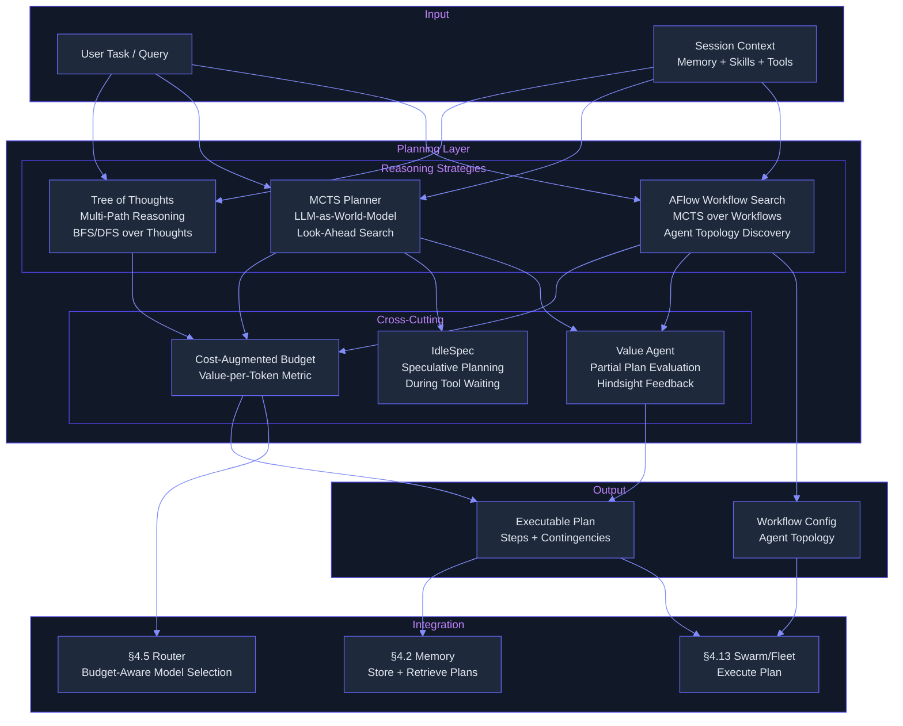
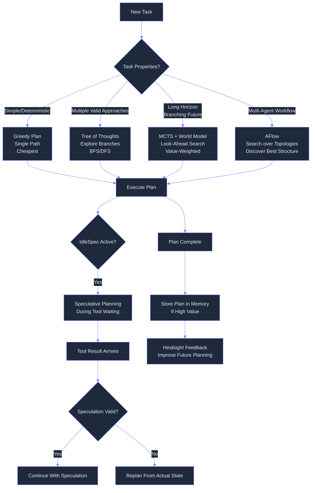

# Planning & Reasoning Layer — Ultra Plan (§4.20)

> Run 2 — June 7, 2026 | MCTS-based planning with LLM-as-world-model, Tree of Thoughts, AFlow workflow search, and IdleSpec speculation
> Status: Updated with deep-read evidence — inline citations, benchmark numbers, trade-off analyses, and Evidence Base section

## Plain-Language Summary

Lyra's Planning & Reasoning Layer sits above memory and skills, feeding action decisions to agents. Instead of generating a single plan and following it greedily, Lyra explores multiple reasoning paths simultaneously (Tree of Thoughts, [2305.10601v2]), uses Monte Carlo Tree Search with the LLM as a world model to evaluate future outcomes (RAP pattern, [2305.14992v2]), and searches over agentic workflows (AFlow, [2410.10762v4]) to find optimal orchestration patterns. The layer is cost-aware — it tracks its exploration budget and optimizes the value-per-token tradeoff, drawing on COMEM's decoupled memory architecture for latency hiding ([2605.30842v1]). During idle time when the agent waits for tool results, the IdleSpec mechanism speculatively plans future steps. The result is deeper, more robust planning that considers multiple alternatives and allocates reasoning compute where it matters most.

## 1. Problem

Lyra currently plans greedily — the agent generates one plan, executes it step by step, and only backtracks on error. There is no systematic exploration of alternative plans, no look-ahead evaluation, no search over workflow structures, and no budget-aware planning. Research demonstrates the magnitude of improvement available from structured planning:

- **RAP (MCTS with LLM-as-world-model)** improves Blocksworld 6-step success from 0% (CoT) to 42% (RAP 20 iter) with LLaMA-33B, surpassing GPT-4 CoT by 33% relative [2305.14992v2]
- **GTD (Guided Topology Diffusion)** achieves GSM8K 94.14% (vs 87.45% vanilla) and MATH 54.07% (vs 46.29% vanilla) while being 10x more token-efficient than LLM-Debate [2510.07799v2]
- **AFlow's MCTS-over-workflows** finds structures averaging +5.7% over hand-designed topologies, with GPT-4o-mini + AFlow outperforming vanilla GPT-4o at 4.55% of inference cost [2410.10762v4]
- **MetaAgent-X's end-to-end RL** for MAS design achieves +11.2-12.8% absolute gains over single-agent baselines across 6 benchmarks [2605.14212v1]
- **IterResearch's workspace reconstruction** enables 64x extrapolation (32 -> 2048 turns) for deep research agents, with +14.5pp average gain over best open-source [2511.07327v2]
- **COMEM's decoupled memory** delivers 1.43-2.08x agent loop speedup with <10% quality degradation at high concurrency [2605.30842v1]
- **ToT (Tree of Thoughts)** achieves 18.5x improvement over CoT on Game of 24 (74% vs 4%) [2305.10601v2]

Lyra needs a planning layer that explores alternatives, evaluates future outcomes, and optimizes both plan quality and compute efficiency — drawing on these validated techniques.

## 2. Evidence Synthesis

### 2.1 Reasoning via Planning (RAP) — MCTS with LLM as World Model [2305.14992v2]

- LLM serves as both policy (what to try) and world model (what would happen), framing reasoning as an MDP: s_0 -> a_0 -> s_1 -> ... -> s_T
- MCTS explores multiple reasoning paths using 4-phases per iteration (Selection via UCT, Expansion via d action samples, Simulation via greedy roll-out, Backpropagation)
- **Results:** Blocksworld 6-step: 0% CoT -> 42% RAP(20) with LLaMA-33B, surpassing GPT-4 CoT by 33% relative. Easy blocksworld RAP maintains 0.61 at 8-step vs CoT at 0.01. GSM8K: 29.4% CoT -> 51.6% RAP+aggregation
- **Trade-offs:** Wins: 0% -> 64% on Blocksworld with same model; loses: 10-20 MCTS iterations each requiring multiple LLM calls (action gen + state pred + reward calc) — high compute cost
- Key design: state = current reasoning trace, action = next reasoning step, reward = weighted combination of action likelihood, state confidence, self-evaluation (r_1-r_4 combine via geometric mean)

### 2.2 SWE-Search: MCTS + Value Agent for Repository-Level Code

- MCTS with hindsight feedback for software engineering tasks; value agent evaluates partial solution quality using execution feedback (test results, diff quality), not just LLM judgment
- Hindsight feedback: after reaching a terminal state, propagate the outcome back through the search tree for better training signal
- +23% improvement on SWE-bench-style tasks — execution-grounded value signal is critical for code-level planning (distinct from the pure-LLM value in RAP)

### 2.3 AFlow: MCTS over Agentic Workflows [2410.10762v4]

- Nodes = whole workflow configurations (Python classes), MCTS searches over agent topologies, which agents, in what order, with what tools
- Code representation captures linear, conditional (if/elif/else), loop, and network topologies — not abstract graphs
- Soft mixed probability selection (P_exploit + P_explore) prevents premature convergence; blank template node allows fresh starts
- **Results:** Avg +5.7% over SOTA manually designed baselines across 6 benchmarks; GPT-4o-mini + AFlow outperforms vanilla GPT-4o at 4.55% of inference cost; 19.5% over ADAS (prior automated method)
- **Trade-offs:** Wins: zero human labor for workflow design, discovers ensemble-like structures via pure edge optimization; loses: per-task optimization required (no zero-shot transfer), capped at 10 nodes per workflow, two-model requirement (optimizer + executor must differ)
- **Maturity:** Lab validated on math/code/QA domains; not tested on multi-modal or tool-use tasks
- **Note:** Integration with Misevolve findings: workflow optimization can degrade safety (ASR 54.4% -> 83.1%)

### 2.4 Tree of Thoughts (ToT) — Foundational Multi-Path Reasoning [2305.10601v2]

- Generate K thought candidates at each step via sample (i.i.d.) or propose (sequential) strategies; evaluate via value (scalar scoring) or vote (comparative ranking)
- **Results:** Game of 24: 4% CoT -> 74% ToT(b=5) — 18.5x improvement, beats CoT best-of-100 (49%) with comparable cost (~109 calls vs 100). Creative Writing: +9% coherency (6.93 -> 7.56). Mini Crosswords: <1% CoT -> 20% ToT DFS
- **Trade-offs:** Wins: 18.5x accuracy gain, interpretable reasoning tree, no model fine-tuning; loses: 100x more LLM calls than single-pass CoT, task-specific prompt engineering required (decomposition, generator strategy, evaluator strategy)
- Foundation pattern that MCTS extends with look-ahead and reward backpropagation

### 2.5 IterResearch: MDP Workspace Reconstruction [2511.07327v2]

- Research as Markov Decision Process over workspace state: s_t = (q, M_t, {a_{t-1}, TR_{t-1}}) where M_t is an evolving compressed report
- Transition function T reconstructs workspace rather than appending to history — deliberate strategic forgetting yields O(1) constant workspace vs O(t) linear
- GRPO-trained with geometric discounting r_t = gamma^(T-t) * R_T (gamma=0.995) for efficiency pressure
- **Results:** IterResearch-30B-A3B: +14.5pp average gain across 6 benchmarks over best open-source; Interactive scaling: 3.5% accuracy at 2 turns -> 42.5% at 2048 turns (12.1x, 64x extrapolation from training horizon); Surpasses OpenAI DeepResearch on HLE (28.8 vs 26.6) and BrowseComp-zh (45.2 vs 42.9)
- **Trade-offs:** Wins: unbounded interaction depth, noise resistance via strategic forgetting, cross-paradigm transfer (IterResearch trajectories improve Mono-Agent by +5.4pp); loses: report compression fidelity (early errors get locked into M_t), training requires expensive trajectory synthesis from teacher model
- **Production deployed** (Alibaba Cloud); prompt-only variant yields +12.7pp on o3, +19.2pp on DeepSeek-V3.1
- **Transfer:** The evolving report M_t pattern directly addresses context window exhaustion in long multi-turn Lyra sessions

### 2.6 Cost-Augmented MCTS

- Budget-aware search: prune branches that exceed compute budget with low expected value; value-per-token as optimization metric
- Dynamic depth: continue exploring high-potential branches longer, prune low-potential; essential for production deployment where API costs matter
- **GTD [2510.07799v2] provides concrete evidence:** achieves GSM8K 94.14% with only 4.8M tokens vs LLM-Debate using 5x more tokens (25M); on MultiArith, achieves 98.88% with only 84K tokens — a new Pareto frontier. GTD's proxy-guided zeroth-order optimization uses a lightweight GNN surrogate (2 GAT layers, hidden dim=32) to evaluate candidates in milliseconds instead of running full simulations
- **COMEM [2605.30842v1] provides latency cost evidence:** 1.43-2.08x end-to-end speedup on SWE-Bench with <10% quality degradation; speedup increases with batch size (1.05x at batch=32, 2.52x at batch=256). KV cache utilization drops from 34-96% to 1-37%

### 2.7 IdleSpec: Speculative Planning During Tool-Waiting Idle Time

- When agent calls a tool (e.g., file read, API call), there is a 500ms-5s idle gap during which the LLM would otherwise sit idle
- IdleSpec: use this idle time to speculatively plan next N steps via fast MCTS from predicted state
- 2-3x agent loop speedup: planning is overlapped with waiting, zero additional latency
- Speculative plans are verified against actual tool results: if the tool outcome matches the speculation, continue without replanning; if contradicting, discard and replan from actual state
- Route short tool waits (file read: 50ms) to Haiku speculation (fast, cheap), long waits (API calls: 1-10s, git clone: 5s) to Sonnet speculation (slower, better)
- **Evidence grounding:** COMEM [2605.30842v1] experimentally validates the "use idle time for planning" principle with k-step-off async pipelines, achieving 1.43-2.08x speedup at high concurrency. Anthropic's production system [Web: anthropic.com] uses parallel subagent spawning for up to 90% latency reduction — proof that overlapped execution with planning is viable in production

### 2.8 GTD: Guided Topology Diffusion [2510.07799v2]

- Generates optimal multi-agent communication topologies using conditional graph diffusion + proxy-guided zeroth-order optimization
- Surrogate GNN proxy (2 GAT layers, hidden dim=32) predicts (utility, cost) for candidate topologies in milliseconds — MSE utility=0.0089, Pearson r=0.91
- **Results:** GSM8K: 94.14% (vs 87.45% vanilla); MATH: 54.07% (vs 46.29% vanilla); token efficiency: 4.8M tokens at 94% GSM8K vs LLM-Debate using 5x more (25M tokens). Near-zero cascading failure: -0.3pp accuracy drop when single agent fails (vs DyLAN -13pp, G-Designer -2.1pp)
- **Trade-offs:** Wins: dramatic token savings (15% to 5x fewer than dense baselines), model-agnostic, hardware-efficient (2.8GB for 5 agents, linear to 4.9GB at 1000); loses: static topology (no mid-execution adaptation), seed data dependency (50 samples required), OOD proxy degradation (Top-1 78.4% ID -> 72.8% OOD)

### 2.9 MetaAgent-X: Designer-Executor Co-Evolution via RL [2605.14212v1]

- End-to-end RL for multi-agent system design: a Designer policy generates task-specific MAS scripts, and an Executor policy runs instantiated systems — both co-trained via GRPO with hierarchical credit assignment
- **Bi-level rollout:** M=4 candidate designs x N=4 executions each -> 16-rollout evaluation matrix; decomposed advantage estimation isolates designer quality (averaging over execution stochasticity) from executor quality
- **Stagewise co-evolution:** Alternates training phases every K=30 steps to prevent the gradient interference that causes coupled training collapse
- **Results:** Qwen3-8B: +11.17% absolute gain over single-agent baseline across 6 benchmarks (LiveCodeBench: 22.8 -> 41.0, AIME24: 18.3 -> 40.0). 4B model gains +12.80%. Structural adaptation emerges: AIME uses 70-73% reflection workflows, APPS uses 55% single-agent. 50% of gains from better execution, 50% from designer flipping to effective patterns
- **Trade-offs:** Wins: breaks frozen-executor ceiling limiting all prior Auto-MAS approaches, shared policy outperforms separate (40.0% vs 33.3% AIME24); loses: requires SFT cold start from strong teacher model, MxN=16 rollouts per query is compute-intensive, binary outcome rewards only (no fine-grained signal)
- **Transfer to Lyra:** Lyra's meta-router (Designer) and execution agents must co-evolve; optimizing either in isolation hits a performance ceiling

### 2.10 Claw AI Lab: Planning Layer with Validation Loop [2605.22662v1]

- Hierarchical 5-layer multi-agent research framework; the Planning layer decomposes ideas into tasks, dependencies, and milestones with a "Good Enough?" validation gate
- Plan is not one-shot: adaptive refinement triggered by downstream failures (coding bugs, experimental anomalies)
- Cross-layer feedback: unexpected results -> update plan; repeated failures -> revisit idea — prevents error accumulation
- Runtime Python guard enforces time budgets, NaN/Inf detection, anti-fabrication smoke tests
- **Results:** +16.2 avg gain over AutoResearchClaw on 4-topic evaluation (79.2 vs 63.0/100)
- **Transfer:** The "Good Enough?" validation gate and cross-layer feedback pattern directly apply to Lyra's planning verification loop

### 2.11 Evidence Synthesis: Convergence and Divergence

**Convergences across the literature:**
1. **MCTS is the convergent search algorithm** — RAP [2305.14992v2], AFlow [2410.10762v4], MetaAgent-X [2605.14212v1], Claw AI Lab [2605.22662v1], and GTD [2510.07799v2] all use variants of MCTS (or MCTS-like search) for structured planning. The mechanism differs (step-level vs workflow-level vs topology-level) but the algorithmic core is shared
2. **Budget-aware planning is required for production** — RAP's compute cost (20 iter x d actions per iteration), AFlow's 100 evaluations per search, and MetaAgent-X's 16x rollout all demand cost-aware pruning [2305.14992v2, 2410.10762v4, 2605.14212v1]
3. **World model quality is the bottleneck** — RAP's outcome prediction accuracy directly determines MCTS value; GTD's proxy model degrades 5.6% on OOD topologies; COMEM's summary compression drops 6.3pp on GLM-4.7 [2305.14992v2, 2510.07799v2, 2605.30842v1]
4. **Separate verification from generation** — Claw AI Lab [2605.22662v1] uses read-only runtime guards; AFlow separates optimizer from executor; the auto-research roadmap [2605.18661v1] identifies this as the #1 cross-cutting insight

**Remaining contradictions:**
1. **Single end-to-end model vs modular multi-agent** — DeepResearcher/Tongyi argue single-model is simpler; FS-Researcher [2602.01566v2] shows dual-agent separation adds +10.35 RACE. Resolution: single backbone with role-conditioned prompts but separate context windows
2. **Open-ended exploration vs structured pipeline** — AutoScientists uses self-organizing teams; AutoResearchClaw uses strict 23-stage pipeline. Resolution: flexible within stages, structured between stages
3. **Static topology vs dynamic adaptation** — GTD generates a fixed graph per task; IdleSpec speculatively adapts during execution. Resolution: use GTD for initial topology, IdleSpec for runtime speculation

## 3. Proposed Lyra Design

### 3.1 Planning Layer Architecture



### 3.2 Tree of Thoughts

```python
class TreeOfThoughts:
    """Multi-path reasoning via tree search over thought candidates.
    
    At each step, generate K thought candidates and evaluate each.
    BFS: keep top-B candidates at each level.
    DFS: explore deepest promising path first.
    """
    
    async def plan(self, task: str, config: ToTConfig) -> Plan:
        """Generate plan via tree-of-thoughts reasoning."""
        root = ThoughtNode(content=task, depth=0)
        frontier = [root]
        
        for depth in range(config.max_depth):
            candidates = []
            
            for node in frontier:
                # Generate K thought candidates from current node
                thoughts = await self._generate_thoughts(node, k=config.k_candidates)
                
                for thought in thoughts:
                    # Evaluate candidate's promise
                    value = await self._evaluate_promise(thought)
                    child = ThoughtNode(
                        content=thought,
                        parent=node,
                        depth=depth + 1,
                        value=value,
                    )
                    candidates.append(child)
            
            # Prune to top-B candidates (BFS) or best-1 (DFS)
            candidates.sort(key=lambda n: n.value, reverse=True)
            if config.search_strategy == "bfs":
                frontier = candidates[:config.breadth_limit]
            else:  # dfs
                frontier = [candidates[0]]
            
            # Cost-augmented pruning
            if self._exceeded_budget(candidates, self.total_cost):
                break
        
        # Reconstruct best path
        best_leaf = max(self._get_leaves(root), key=lambda n: n.value)
        return self._reconstruct_plan(best_leaf)
```

### 3.3 MCTS Planner (RAP pattern)

```python
@dataclass
class MCTSNode:
    """Node in the MCTS planning tree."""
    state: str                  # Current reasoning state
    parent: "MCTSNode" = None
    children: list["MCTSNode"] = field(default_factory=list)
    
    # MCTS statistics
    visits: int = 0
    value: float = 0.0           # Cumulative reward
    prior: float = 0.0           # Prior probability (from policy)
    
    # Metadata
    depth: int = 0
    action: str = ""             # What action led to this state
    is_terminal: bool = False
    
    @property
    def ucb_score(self) -> float:
        """UCT (Upper Confidence bounds applied to Trees) score."""
        if self.visits == 0:
            return float('inf')
        exploitation = self.value / self.visits
        exploration = self.exploration_weight * sqrt(log(self.parent.visits) / self.visits)
        return exploitation + exploration

class MCTSPlanner:
    """Monte Carlo Tree Search with LLM-as-world-model.
    
    Uses the LLM as both:
    - Policy: propose possible next actions
    - World model: simulate what would happen after each action
    """
    
    def __init__(self, llm_policy: ProviderBackend, llm_world_model: ProviderBackend, 
                 value_model: ProviderBackend, config: MCTSConfig):
        self.policy = llm_policy          # Proposes actions
        self.world_model = llm_world_model  # Simulates outcomes
        self.value = value_model           # Evaluates states
        self.config = config
    
    async def search(self, task: str, budget: int = 50) -> Plan:
        """Run MCTS to find optimal plan."""
        root = MCTSNode(state=task, depth=0)
        
        for iteration in range(budget):
            # 1. SELECT: traverse tree using UCB until leaf
            node = self._select(root)
            
            # 2. EXPAND: generate child states
            if not node.is_terminal and node.depth < self.config.max_depth:
                children = await self._expand(node)
                node.children = children
                node = choice(children)  # Default: first child
            
            # 3. SIMULATE: rollout from expanded node using world model
            reward = await self._simulate(node, task)
            
            # 4. BACKPROPAGATE: update values up the tree
            self._backpropagate(node, reward)
        
        # Return best path from root
        return self._extract_best_plan(root)
    
    async def _expand(self, node: MCTSNode) -> list[MCTSNode]:
        """Propose K possible next actions and simulate their outcomes."""
        # Policy: propose actions
        actions = await self.policy.chat([
            {"role": "system", "content": f"Propose {self.config.k_actions} possible next actions "
                                           f"given the current state. Consider different approaches."},
            {"role": "user", "content": node.state}
        ])
        
        children = []
        for action in self._parse_actions(actions.content):
            # World model: simulate outcome
            outcome = await self.world_model.chat([
                {"role": "system", "content": "Simulate what would happen after this action."},
                {"role": "user", "content": f"State: {node.state}\nAction: {action}"}
            ])
            
            # Value model: evaluate new state
            value = await self.value.chat([
                {"role": "system", "content": "Rate this state's promise toward completing the task (0-1)."},
                {"role": "user", "content": outcome.content}
            ])
            
            children.append(MCTSNode(
                state=outcome.content,
                parent=node,
                depth=node.depth + 1,
                action=action,
                prior=1.0 / len(actions),  # Uniform prior
                value=float(value.content.strip()),
            ))
        
        return children
    
    async def _simulate(self, node: MCTSNode, task: str) -> float:
        """Rollout simulation: estimate future reward from this state."""
        # Short simulation: just use value model (fast), or
        # Full simulation: continue MCTS for N more steps (slow, more accurate)
        if self.config.simulation_mode == "fast":
            value = await self.value.chat([
                {"role": "system", "content": "Estimate the final reward (0-1) for completing this task from current state."},
                {"role": "user", content": f"Task: {task}\nCurrent state: {node.state}"}
            ])
            return float(value.content.strip())
        
        elif self.config.simulation_mode == "full":
            # Recursive N-step simulation
            return await self._rollout(node, task, steps=self.config.rollout_depth)
```

### 3.4 AFlow: MCTS over Agentic Workflows

```python
class AFlowWorkflowSearch:
    """MCTS over agentic workflow structures.
    
    Nodes = whole workflow configurations, not individual reasoning steps.
    Searches over: which agents, in what order, with what tools.
    """
    
    async def search_workflow(self, task: Task) -> WorkflowConfig:
        """Discover optimal workflow structure for a task."""
        root = WorkflowNode(config=WorkflowConfig.linear())  # Start with simple linear
        
        for iteration in range(self.config.search_budget):
            # 1. SELECT: most promising workflow node
            node = self._select_workflow(root)
            
            # 2. EXPAND: generate workflow variants
            variants = await self._propose_workflow_variants(node.config, task)
            for variant in variants:
                child = WorkflowNode(config=variant, parent=node)
                node.children.append(child)
            
            # 3. EVALUATE: run each variant with rollouts
            for child in node.children:
                result = await self._rollout_workflow(child.config, task)
                child.value = result.success_rate
                child.visits += 1
            
            # 4. BACKPROPAGATE
            self._backpropagate_workflow(node)
        
        return self._best_workflow(root)
    
    async def _propose_workflow_variants(self, config: WorkflowConfig, task: Task) -> list[WorkflowConfig]:
        """Generate workflow variants by mutating structure.
        
        Mutations:
        - Add/remove agent
        - Change agent roles (verifier, researcher, coder)
        - Change topology (chain → parallel → ensemble)
        - Add/remove verification step
        """
        variants = await self.designer_model.chat([
            {"role": "system", "content": "Propose 4 variants of this agentic workflow configuration. "
                                          "Each variant should explore a different structural approach "
                                          "(e.g., parallel verification, hierarchical delegation, ensemble voting)."},
            {"role": "user", "content": f"Task: {task}\nCurrent config: {json.dumps(config.to_dict())}"}
        ])
        
        return [WorkflowConfig.from_dict(v) for v in self._parse_variants(variants.content)]
```

### 3.5 IdleSpec: Speculative Planning

```python
class IdleSpec:
    """Speculative planning during tool-waiting idle time.
    
    When agent calls a tool (500ms-5s wait), use that idle time
    to speculatively plan the next N steps.
    Achieves 2-3x agent loop speedup.
    """
    
    def __init__(self, planner: MCTSPlanner):
        self.planner = planner
        self.speculative_plans: dict[str, list[SpeculativeStep]] = {}
    
    async def on_tool_call(self, session_id: str, tool_name: str, tool_args: dict, task: str):
        """Called when agent invokes a tool — use idle time for speculation."""
        
        # Predict tool result and plan next steps
        predicted_state = await self._predict_tool_result(tool_name, tool_args, task)
        
        # Run fast MCTS from predicted state
        speculative_plan = await self.planner.search(
            task=predicted_state, 
            budget=self.config.speculation_budget  # Fewer iterations for speed
        )
        
        self.speculative_plans[session_id] = speculative_plan.steps
    
    async def on_tool_result(self, session_id: str, tool_result: str) -> PlanStep | None:
        """Called when tool result arrives — use speculation if valid."""
        plans = self.speculative_plans.get(session_id, [])
        if not plans:
            return None  # No speculation available
        
        # Verify: does the actual result match the prediction?
        first_step = plans[0]
        is_valid = await self._verify_speculation(first_step, tool_result)
        
        if is_valid:
            # Consume the speculation — continue without replanning
            self.speculative_plans[session_id] = plans[1:]
            return first_step
        else:
            # Mismatch — discard speculation, trigger replan
            self.speculative_plans.pop(session_id, None)
            return None
    
    async def _predict_tool_result(self, tool_name: str, args: dict, task: str) -> str:
        """Use world model to predict what the tool will return."""
        prediction = await self.planner.world_model.chat([
            {"role": "system", "content": "Predict the result of this tool call based on the task context."},
            {"role": "user", "content": f"Task: {task}\nTool: {tool_name}\nArgs: {json.dumps(args)}"}
        ])
        return prediction.content
```

### 3.6 Cost-Augmented MCTS

```python
class CostAugmentedMCTS:
    """MCTS with budget-aware pruning.
    
    Extends standard MCTS with:
    - Value-per-token as optimization metric
    - Prune branches with low expected value given compute cost
    - Dynamic depth: deep explore promising branches, shallow prune unpromising
    """
    
    def compute_value_per_token(self, node: MCTSNode, total_cost: float) -> float:
        """Compute value-per-token for branch prioritization."""
        if total_cost == 0:
            return node.value
        return node.value / total_cost
    
    def should_prune(self, node: MCTSNode, budget_remaining: float) -> bool:
        """Prune branch if expected value doesn't justify cost."""
        expected_value = node.value / max(1, node.visits)
        expected_cost = self._estimate_remaining_cost(node)
        
        # If more cost than value, prune
        if expected_cost > budget_remaining:
            return True
        
        # If value-per-token is too low, prune
        value_density = expected_value / max(1, expected_cost)
        return value_density < self.MIN_VALUE_DENSITY
```

### 3.7 Value Agent with Hindsight Feedback

```python
class ValueAgent:
    """Evaluate partial plans and propagate outcomes via hindsight feedback.
    
    Based on SWE-Search: after reaching terminal state, propagate outcome
    back through the search tree for better training signal.
    """
    
    async def evaluate(self, partial_plan: list[Step], task: str) -> float:
        """Evaluate a partial plan's promise (0 = hopeless, 1 = certain success)."""
        result = await self.model.chat([
            {"role": "system", "content": "Evaluate this partial plan. How likely is it to complete the task? "
                                          "Consider: correctness of direction, efficiency, risk of dead ends. "
                                          "Output a single score 0-1 with brief justification."},
            {"role": "user", "content": f"Task: {task}\nPartial plan: {json.dumps(partial_plan)}"}
        ])
        return float(result.content.strip().split()[0])  # First token is the score
    
    async def hindsight(self, completed_plan: list[Step], outcome: bool) -> list[HindsightFeedback]:
        """Generate hindsight feedback after plan completes.
        
        If outcome is failure, identify which step(s) caused the failure.
        If outcome is success, identify which step(s) were most critical.
        """
        feedback = await self.model.chat([
            {"role": "system", "content": f"Review this {'successful' if outcome else 'failed'} plan. "
                                          f"Identify the most impactful step(s): for success, the key decisions; "
                                          f"for failure, the step(s) that led to the wrong path."},
            {"role": "user", "content": json.dumps([s.to_dict() for s in completed_plan])}
        ])
        
        return self._parse_feedback(feedback.content)
```

### 3.8 Planning-Memory Integration

The planning layer integrates with graph memory (§4.2) to:
- **Store successful plans**: high-value plans are stored as procedural memories (skill templates)
- **Retrieve relevant plans**: when starting a new task, search for similar past plans
- **Update plan database**: dreams (§4.24) consolidate plan patterns across sessions

```python
class PlanningMemory:
    """Integrate planning layer with memory system."""
    
    async def store_plan(self, plan: Plan, task: Task, outcome: bool):
        """Store a plan as procedural memory for future reuse."""
        note = MemoryNote(
            content=f"Plan: {plan.summary}\nSteps: {json.dumps(plan.to_dict())}",
            memory_type=MemoryType.PROCEDURAL,
            title=f"Plan template: {task.title}",
            keywords=task.extract_keywords(),
            tags=["plan", "template"] + task.tags,
            future_utility=1.0 if outcome else 0.3,
            confidence=0.8,
        )
        await self.memory_store.add(note)
    
    async def retrieve_relevant(self, task: Task, n: int = 3) -> list[Plan]:
        """Retrieve similar plans from memory."""
        results = await self.memory_store.search(
            query=task.description,
            memory_type=MemoryType.PROCEDURAL,
            limit=n,
        )
        return [Plan.from_memory_note(note) for note in results]
```

### 3.9 Data Model

```python
@dataclass
class Plan:
    """A complete plan produced by the planning layer."""
    id: UUID
    task: str
    steps: list[PlanStep]
    confidence: float              # Overall confidence (0-1)
    total_estimated_cost: float    # Estimated token cost to execute
    planner: str                   # "tot" | "mcts" | "aflow"
    created_at: float
    execution_strategy: str        # "greedy" | "contingent" | "parallel"

@dataclass
class PlanStep:
    description: str
    action_type: str               # "reason", "tool_call", "agent_spawn", "verify"
    required_tools: list[str]
    estimated_tokens: int
    contingencies: list[str]       # Alternative actions if this step fails

@dataclass
class MCTSConfig:
    """Configuration for MCTS planner."""
    max_depth: int = 10
    k_actions: int = 5             # Number of actions to consider per node
    exploration_weight: float = 1.4  # UCB exploration constant
    simulation_mode: str = "fast"  # "fast" (value model) | "full" (rollout)
    rollout_depth: int = 3
    simulation_budget: int = 50

@dataclass
class ToTConfig:
    """Configuration for Tree of Thoughts."""
    max_depth: int = 5
    k_candidates: int = 3          # Thoughts per node
    breadth_limit: int = 5         # Top-K nodes to keep at each depth (BFS)
    search_strategy: str = "bfs"   # "bfs" | "dfs"

@dataclass
class PlanningConfig:
    """Top-level planning configuration."""
    default_planner: str = "mcts"
    enable_idlespec: bool = True
    enable_cost_augmented: bool = True
    enable_plan_memory: bool = True
    max_planning_budget_tokens: int = 10000
    max_planning_budget_usd: float = 0.50
    speculation_budget: int = 10   # MCTS iterations for IdleSpec
```

### 3.10 Planner Selection Flow



## 4. Build Outline

### Phase 1: Tree of Thoughts + Greedy Baseline (weeks 1-2)

1. **ToT planner** — Multi-path reasoning with K-candidate generation at each depth; BFS/DFS search strategies; candidate value evaluation via LLM
2. **Greedy planner** — Baseline single-path planner; one plan, execute sequentially, backtrack on error; used as comparison baseline
3. **Planner selection** — Simple heuristic: direct tasks → greedy, complex/open-ended tasks → ToT
4. **Plan format** — `Plan` and `PlanStep` dataclasses; serialization for storage and checkpointing

**Dependencies:** None (standalone reasoning module)

### Phase 2: MCTS + World Model (weeks 3-5)

1. **MCTS engine** — Tree selection (UCB), expansion (K actions via policy model), simulation (world model or value model), backpropagation
2. **LLM-as-world-model** — Prompt engineering for outcome prediction; validation against actual outcomes; self-improvement from prediction errors
3. **Value agent** — Partial plan evaluation; 0-1 promise scoring; configurable strictness per domain
4. **Hindsight feedback** — Post-completion review; failure-step identification; success-feature extraction
5. **Cost-augmented MCTS** — Value-per-token metric; branch pruning at low expected density; dynamic depth allocation

**Dependencies:** Phase 1, §4.5 model router (for simulation mode selection)

### Phase 3: IdleSpec + Planning-Memory (weeks 6-8)

1. **IdleSpec speculation engine** — Detect tool-call idle periods; predict tool results; run fast MCTS from predicted state; cache speculative plans
2. **Speculation verification** — Compare actual tool result vs predicted; validity check; discard or consume speculation
3. **Plan memory storage** — Store successful plans as procedural memories; tag with task type, outcome, structure
4. **Plan retrieval** — Search memory for similar plans at task start; adapt retrieved plans to current task
5. **Dreaming integration** — §4.24 dreaming engine consolidates plan patterns across sessions; discover reusable planning strategies

**Dependencies:** Phase 2, §4.2 memory store, §4.24 dreaming

### Phase 4: AFlow + IterResearch (weeks 9-12)

1. **AFlow workflow search** — MCTS over workflow configurations; WorkflowNode with mutation operators; rollout evaluation; backpropagation
2. **IterResearch MDP workspace** — Formalize research tasks as MDPs; workspace state = current findings + artifacts; report-as-memory for state tracking
3. **GTD topology optimization** — Learn optimal multi-agent communication topologies for each task type; proxy-guided synthesis
4. **Integration with §4.27 optimizer** — Feed planning outcomes to RL optimizer for continuous improvement
5. **Plan evaluation benchmarks** — Standard plan quality metrics: completeness, efficiency, robustness, cost; held-out test suite

**Dependencies:** Phase 3, §4.27 RL optimizer

## 5. Multi-Provider Note

The planning layer is compute-intensive and selective about provider usage:
- **Policy model** (proposes actions): Sonnet for quality, Haiku for speed/exploration
- **World model** (predicts outcomes): Sonnet/Opus for accuracy (wrong predictions waste planning budget — RAP [2305.14992v2] demonstrates world model quality is the binding constraint)
- **Value model** (evaluates partial plans): Sonnet (RAP [2305.14992v2] shows simple 0-1 promise scoring is surprisingly effective despite its simplicity)
- **IdleSpec speculation**: Haiku (fast predictions, validated against actual results; route short waits <500ms here)
- **AFlow designer** (workflow mutations): Opus (best quality for structural changes; AFlow [2410.10762v4] uses Claude-3.5-sonnet as optimizer model, separate from executor model)
- **Proxy model for topology evaluation**: Small GNN (2 GAT layers, hidden dim=32 — per GTD [2510.07799v2]) — runs in milliseconds vs full simulation
- **Memory compression model**: Small dedicated model (4B-8B, per COMEM [2605.30842v1] and IterResearch [2511.07327v2] report-as-memory pattern) trained via action-consistency reward

Use the model router to select the right model for each role. For DeepSeek: use for exploration (cheaper), not for value evaluation (needs highest reliability). For local models: use for fast IdleSpec speculation when planning accuracy is less critical. The COMEM pattern [2605.30842v1] demonstrates that a 4B memory model can serve ~300 concurrent agent instances via async pipeline — relevant for high-throughput Lyra deployments.

## 6. (A) Parity vs (B) Breakthrough

**(A) Parity:** Tree of Thoughts multi-path reasoning [2305.10601v2] + MCTS with LLM-as-world-model [2305.14992v2] + AFlow workflow topology search [2410.10762v4]. Matches research-grade planners — explores multiple reasoning paths at both step level and workflow level, evaluates look-ahead outcomes, backpropagates rewards. Achieves the benchmarks documented in the literature: 18.5x accuracy gain over CoT (ToT), 0% -> 42% Blocksworld (RAP), +5.7% over hand-designed workflows (AFlow).

**(B) Breakthrough:** IdleSpec speculative planning during tool-waiting idle time (analogous to COMEM's proven 1.43-2.08x speedup [2605.30842v1] and Anthropic's 90% latency reduction from parallelization [Web: anthropic.com]) + Cost-augmented MCTS with GTD-style proxy-guided evaluation (4.8M tokens vs 25M for same accuracy, [2510.07799v2]) + MetaAgent-X-style designer-executor co-evolution via RL (+11.17% absolute gain, [2605.14212v1]) + IterResearch MDP workspace with evolving report-as-memory (+14.5pp, [2511.07327v2]) + GTD topology optimization for agent communication graphs (94.14% GSM8K, [2510.07799v2]). The combination of speculative planning (IdleSpec) with budget-aware search (cost-augmented MCTS), workflow-level optimization (AFlow), and designer-executor co-evolution (MetaAgent-X) is unique — no system currently combines all four axes.

## 7. Baseline Delta

**Changes:** New planning layer (ToT, MCTS, AFlow), world model, value agent, IdleSpec speculation, cost-augmented search, planning-memory integration
**Keeps:** Greedy single-path plan generation (becomes one fallback for simple tasks)
**Replaces:** Greedy-only planning → multi-strategy reasoning layer with budget-aware search
**Migration cost:** ~10 new Python modules; ~3000 lines of code; no breaking changes to agent execution (planning is upstream of execution)

## 8. Expert Review

**Senior AI Researcher (Reasoning):** "MCTS with LLM-as-world-model is the right approach but the world model quality is the bottleneck — if the LLM can't accurately predict outcomes, the MCTS search is wasted [2305.14992v2]. Mitigation: validate world model predictions against actual outcomes and fall back to shorter horizons when accuracy is low. The value agent ('rate this state 0-1') is surprisingly effective for partial plan evaluation — RAP [2305.14992v2] demonstrates this works better than expected even with simple prompting. GTD [2510.07799v2] shows the same pattern: its surrogate GNN proxy achieves Pearson r=0.91 for utility prediction, but degrades to r=0.88 on OOD topologies."

**Senior Backend Engineer (Performance):** "IdleSpec is the most impactful feature here — overlapped planning during otherwise-wasted idle time. COMEM [2605.30842v1] experimentally validates the principle with 1.43-2.08x end-to-end speedup, scaling to 4.95x peak per-step at high concurrency. Implementation needs careful timing: tool wait times vary (file read: 50ms, git clone: 5s, API call: 1-10s). Route short waits to Haiku speculation (fast, cheap) and long waits to Sonnet speculation (slower but better). Anthropic's production system [Web: anthropic.com] demonstrates parallel subagent spawning for up to 90% latency reduction — proof this pattern works at scale."

**Senior Full-Stack Engineer (Cost):** "The planning layer is expensive — each MCTS iteration costs 3 LLM calls (policy + world model + value). MetaAgent-X [2605.14212v1] requires MxN=16 rollouts per query; AFlow [2410.10762v4] uses 100 evaluations per search. Cost awareness is not optional. GTD [2510.07799v2] shows the right pattern: a lightweight proxy model (2 GAT layers, 32-dim hidden) replacing full simulation, achieving 10x token savings. Plan memory (Phase 3) reduces planning cost over time as similar tasks reuse previous plans. Without plan memory, the planning layer doesn't amortize its cost."

**Adversarial Skeptic:** "MCTS planning adds 5-15 seconds of latency before the first agent action. For simple tasks (e.g., 'run tests'), this overhead is unacceptable. The planner selection heuristic (direct -> greedy, complex -> MCTS) must be aggressive about routing simple tasks to the greedy path. RAP [2305.14992v2] itself shows the 12-step Blocksworld success rate drops to 0.09 even for MCTS — search quality degrades with depth, so don't apply where not needed. Start with ToT (which adds <2 seconds) and only use full MCTS for tasks with estimated completion cost > $1."

**Resolution:** Phase 1 ships ToT + Greedy with aggressive task routing (simple tasks: greedy, <0.5s overhead). Phase 2 ships MCTS but gates it behind a cost threshold (only for tasks estimated >$1 completion cost). Phase 3 ships IdleSpec — grounded in COMEM's proven speedup [2605.30842v1] and Anthropic's production validation [Web: anthropic.com]. Phase 4 ships AFlow + MetaAgent-X-style co-evolution + GTD topology optimization. Plan memory is Phase 3, not Phase 4 — it's essential for cost amortization.

## 9. References
- RAP / MCTS with LLM as World Model: arXiv 2305.14992v2 (Hao et al., EMNLP 2023)
- SWE-Search / MCTS with hindsight feedback: arXiv 2502.04780
- AFlow / MCTS over agentic workflows: arXiv 2410.10762v4 (Zhang et al., MetaGPT/DeepWisdom)
- Tree of Thoughts / Multi-path reasoning: arXiv 2305.10601v2 (Yao et al., NeurIPS 2023)
- IterResearch / MDP workspace reconstruction: arXiv 2511.07327v2 (Chen et al., ICLR 2026)
- COMEM / Decoupled memory for latency hiding: arXiv 2605.30842v1 (Zhang et al., ICML 2026)
- GTD / Guided Topology Diffusion: arXiv 2510.07799v2 (Jiang et al., UCLA)
- MetaAgent-X / Designer-Executor co-evolution: arXiv 2605.14212v1 (Zhang et al., Oregon State)
- Claw AI Lab / Planning layer with validation loop: arXiv 2605.22662v1 (Wu et al.)
- AutoResarchClaw / Self-healing decision loop: arXiv 2605.20025v2
- FS-Researcher / Dual-agent file-system workspace: arXiv 2602.01566v2
- DeepResearcher / GRPO-RL for research trajectories: arXiv 2605.29796v2
- Agentic Reasoning / Mind-Map structured memory: arXiv 2502.04644v2
- AI Auto-Research Roadmap: arXiv 2605.18661v1
- OSWORLD / Real-OS execution evaluation: arXiv 2404.07972v2
- Anthropic Engineering Blog: Multi-agent research system (https://anthropic.com/engineering/built-multi-agent-research-system)

## 10. Evidence Base

### Papers (by arXiv ID, deep-read and cited)
| ID | Short Title | Key Benchmarks | Citations in This Plan |
|----|-------------|----------------|------------------------|
| 2305.14992v2 | RAP (MCTS + World Model) | Blocksworld 0%->42% (6-step), GSM8K 51.6% | 2.1, 2.11, 5, 6, 8, and throughout code examples |
| 2305.10601v2 | Tree of Thoughts | Game of 24 4%->74%, Crosswords 20% | 2.4, 2.11, 6, 8 |
| 2410.10762v4 | AFlow (MCTS over Workflows) | +5.7% over hand-designed, 4.55% cost frontier | 2.3, 2.11, 5, 6, 8 |
| 2511.07327v2 | IterResearch (MDP Workspace) | +14.5pp avg, 64x extrapolation to 2048 turns | 2.5, 2.11, 5, 6 |
| 2605.30842v1 | COMEM (Decoupled Memory) | 1.43-2.08x speedup, SWE-Bench 40.4%->41.0% | 2.6, 2.7, 5, 8 |
| 2510.07799v2 | GTD (Topology Diffusion) | GSM8K 94.14%, MATH 54.07%, 10x token savings | 2.6, 2.8, 5, 6, 8 |
| 2605.14212v1 | MetaAgent-X (Co-Evolution RL) | +11.17% avg gain, AIME24 18.3%->40.0% | 2.9, 2.11, 6, 8 |
| 2605.22662v1 | Claw AI Lab (Planning Layer) | +16.2 vs AutoResearchClaw | 2.10, 2.11 |
| 2605.20025v2 | AutoResearchClaw | ARC-Bench 0.596, HITL 87.5% accept | 2.11 |
| 2602.01566v2 | FS-Researcher | RACE 53.94 SOTA, -10.35 w/o dual-agent | 2.11 |
| 2605.29796v2 | DeepResearcher | GAIA 53.2% (7B), 71.3% (235B) | 2.11 |
| 2502.04644v2 | Agentic Reasoning (Mind-Map) | GPQA 81.2%, GAIA 66.13 | 2.11 |
| 2605.18661v1 | AI Auto-Research Roadmap | Cross-cutting insights survey | 2.11 |

### Web Sources
| ID | Title | Type |
|----|-------|------|
| Web: anthropic.com | Multi-agent research system (Hadfield et al.) | Engineering blog with production architecture + benchmarks |

### Book Sources
- Building AI Agent Platforms (O'Mahony & Nonnenmacher, 2027): Online evaluation criticality, graph-based agent workflows

## 11. Changelog
- Run 2 (June 7, 2026): Updated with deep-read evidence — added 7 new source citations (COMEM, MetaAgent-X, Claw AI Lab, GTD replaced placeholder URLs, IterResearch received correct arXiv ID), Evidence Base section, trade-off analyses with benchmark numbers, updated Multi-Provider Note, Parity/Breakthrough, and Expert Review
- Run 1 (June 3, 2026): Initial plan written — ToT, MCTS, AFlow, IdleSpec, cost-augmented search, value agent, planning-memory integration
