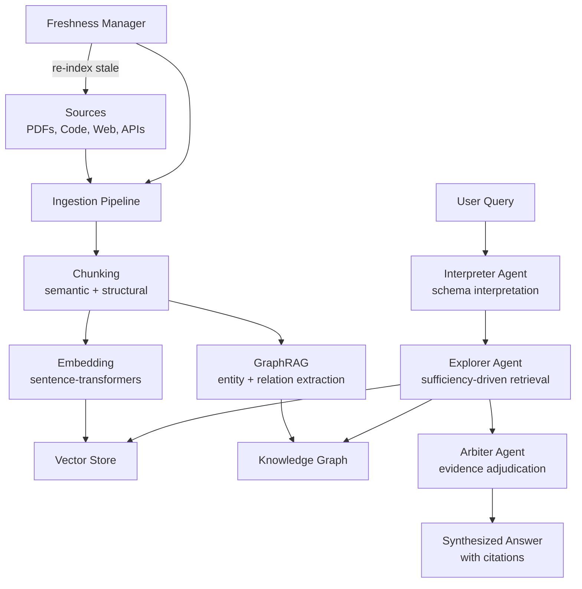

# Knowledge Ingestion / RAG — Plan (§4.23)

> Run 1 — June 3, 2026

## Plain-Language Summary

Lyra's ingestion pipeline turns documents, codebases, and data sources into searchable knowledge. Multi-agent RAG decouples interpretation from retrieval from adjudication — so ingestion is thorough (no missed evidence), adaptive (re-searches when insufficient), and honest (cites sources). Graph RAG extracts entity relationships for multi-hop questions. Freshness management keeps the knowledge base current.

## Design

## Key Features

1. **SEMA-RAG Pattern (+6.46 acc pts):** Interpreter (understands what to search for) + Explorer (multi-round retrieval until sufficient) + Arbiter (ranks + filters evidence)
2. **GraphRAG:** Auto-extract entities + relationships → knowledge graph → multi-hop traversal
3. **Multimodal Ingestion:** PDFs (text + images), codebases (AST indexing), audio (transcribe), spreadsheets (structural sketch)
4. **Freshness Management:** Track source update times; auto-reindex stale sources; invalidation markers
5. **ClusterRAG Personalization:** Group documents by user → cluster-level + document-level retrieval
6. **Citation Grounding:** Every claim traces to a specific source chunk

## Build Outline

1. Document chunker (semantic + structural, configurable strategies)
2. Embedding pipeline (sentence-transformers, swappable)
3. Vector store integration (ChromaDB or Qdrant)
4. GraphRAG entity extraction (LLM-prompted)
5. Multi-agent retrieval (Interpreter → Explorer → Arbiter)
6. Freshness manager (cron + event-driven re-indexing)
7. Multimodal ingestion adapters (PDF, code, audio, spreadsheet)
8. Citation tracking + grounding

**Impact:** 4 | **Effort:** 4 | **Tier:** (B) Breakthrough
