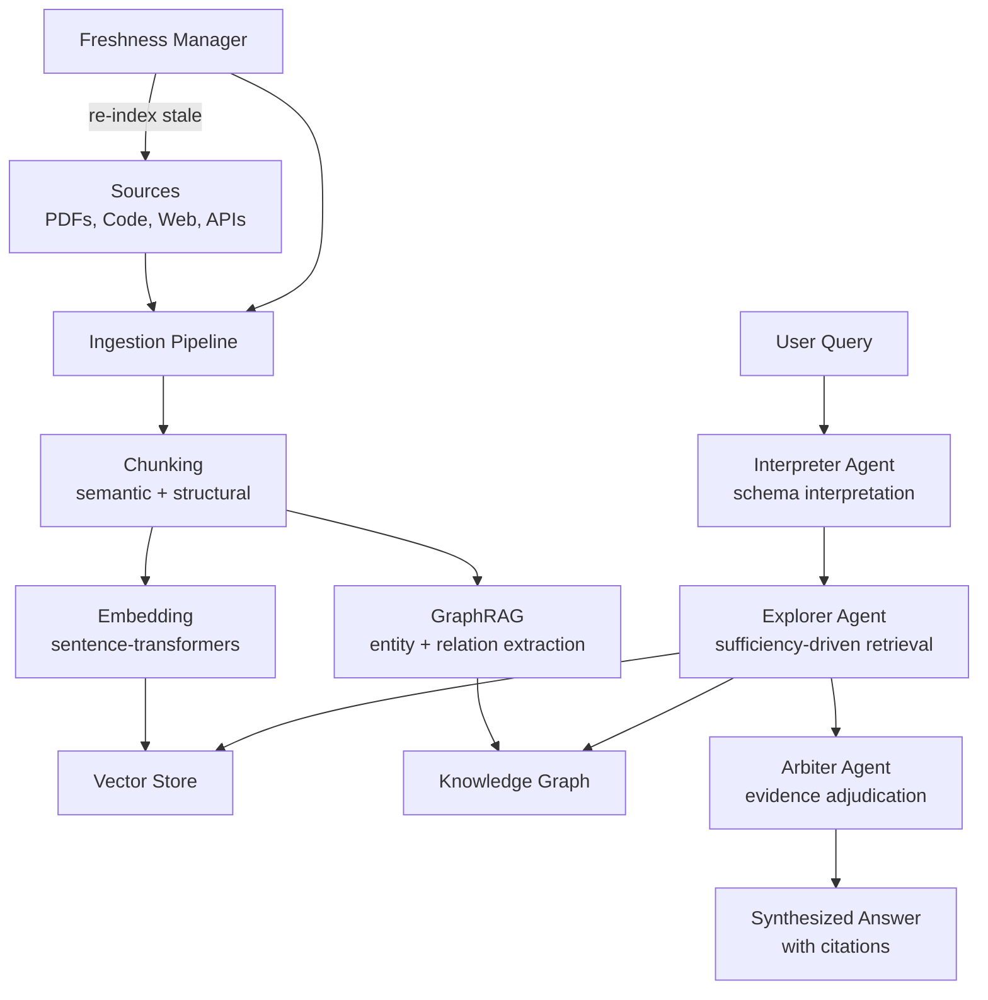

# Knowledge Ingestion / RAG — Plan (§4.23)

> Run 1 — June 3, 2026

## Plain-Language Summary

Lyra's ingestion pipeline turns documents, codebases, and data sources into searchable knowledge. Multi-agent RAG decouples interpretation from retrieval from adjudication — so ingestion is thorough (no missed evidence), adaptive (re-searches when insufficient), and honest (cites sources). Graph RAG extracts entity relationships for multi-hop questions. Freshness management keeps the knowledge base current.

## Design

## Key Features

1. **SEMA-RAG Pattern (+6.46 acc pts):** Interpreter (understands what to search for) + Explorer (multi-round retrieval until sufficient) + Arbiter (ranks + filters evidence)
2. **GraphRAG:** Auto-extract entities + relationships → knowledge graph → multi-hop traversal
3. **Multimodal Ingestion:** PDFs (text + images), codebases (AST indexing), audio (transcribe), spreadsheets (structural sketch)
4. **Freshness Management:** Track source update times; auto-reindex stale sources; invalidation markers
5. **ClusterRAG Personalization:** Group documents by user → cluster-level + document-level retrieval
6. **Citation Grounding:** Every claim traces to a specific source chunk

## Build Outline

1. Document chunker (semantic + structural, configurable strategies)
2. Embedding pipeline (sentence-transformers, swappable)
3. Vector store integration (ChromaDB or Qdrant)
4. GraphRAG entity extraction (LLM-prompted)
5. Multi-agent retrieval (Interpreter → Explorer → Arbiter)
6. Freshness manager (cron + event-driven re-indexing)
7. Multimodal ingestion adapters (PDF, code, audio, spreadsheet)
8. Citation tracking + grounding

**Impact:** 4 | **Effort:** 4 | **Tier:** (B) Breakthrough

## Evidence Synthesis

| Source | Key Insight |
|--------|------------|
| SEMA-RAG (2605.17101) | Multi-agent RAG: Interpreter + Explorer + Arbiter → +6.46 acc pts across 5 benchmarks/5 backbones |
| ClusterRAG (2605.18769) | Two-level retrieval (cluster + document), density-based user clustering for personalization |
| MASS-RAG (2604.18509, ACL 2026 Findings) | Role-specialized agents for noisy/incomplete evidence; dedicated synthesis stage |
| "Is Grep All You Need?" (2605.15184) | Grep often beats vector retrieval for code; harness matters more than retriever |
| SpreadsheetAgent (2604.12282) | Incremental multimodal ingestion: code-exec results, images, LaTeX tables → structural sketch |
| GraphRAG (2404.16130) | Entity + relation extraction → knowledge graph → multi-hop traversal |
| MATA (2602.09642) | Small-model TableQA with complementary reasoning paths; minimizes expensive LLM calls |

## Baseline Delta

| Component | Change | Migration Cost |
|-----------|--------|---------------|
| lyra-knowledge-graph | EXTEND: GraphRAG entity extraction, freshness tracking | Low |
| lyra-etl-pipeline | EXTEND: multimodal adapters (PDF, code, audio, spreadsheet) | Medium |
| SEMA-RAG agents | ADD: Interpreter/Explorer/Arbiter retrieval pipeline | None |
| Vector store integration | ADD: ChromaDB or Qdrant | Low |
| Citation tracker | ADD: source chunk → claim mapping | Low |

## Expert Review

**Senior Data Engineer:** "SEMA-RAG's sufficiency-driven multi-round retrieval is the key insight. Single-round retrieval either misses evidence or returns too much. The Explorer agent keeps searching until it has enough — that's the difference between good and great retrieval."

**Skeptic:** "grep beats vector retrieval for code. Lyra's first ingestion tool should be ripgrep, not ChromaDB." → ACCEPTED. Ship grep-first retrieval; add vector/graph retrieval as fallback when grep returns insufficient results.
