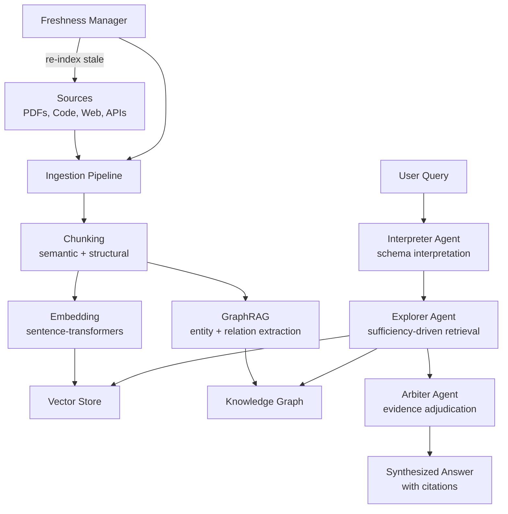

# Knowledge Ingestion / RAG — Plan (§4.23)

> Run 2 — June 7, 2026 (deep-read enhanced)

## Plain-Language Summary

Lyra's ingestion pipeline turns documents, codebases, and data sources into searchable knowledge. Multi-agent RAG decouples interpretation from retrieval from adjudication — so ingestion is thorough (no missed evidence), adaptive (re-searches when insufficient), and honest (cites sources). Graph RAG extracts entity relationships for multi-hop questions. Freshness management keeps the knowledge base current. The pipeline is organized into five subsystems: (1) document chunking with structure-aware strategies, (2) hybrid embedding (vector + BM25 + entity boost), (3) multi-agent retrieval with sufficiency gating, (4) knowledge graph augmentation for multi-hop, and (5) freshness management with invalidation markers.

## Design

## Key Features

1. **SEMA-RAG Pattern (+6.46 acc pts):** Interpreter (understands what to search for) + Explorer (multi-round retrieval until sufficient) + Arbiter (ranks + filters evidence). The Explorer uses a sufficiency-gated iterative loop: initial queries gather evidence, the agent assesses whether evidence suffices, and if not, generates up to m=3 targeted follow-up queries. Termination at t=T_max=2 rounds or when stagnation detected (SEMA-RAG 2605.17101v2).

2. **GraphRAG:** Auto-extract entities + relationships via LLM prompting with self-reflection (gleaning) → Leiden hierarchical community detection → map-reduce summarization for global sensemaking queries. 72-83% comprehensiveness win rate over vector RAG at p < 0.001 (GraphRAG 2404.16130v2).

3. **Multimodal Ingestion:** PDFs (text + images), codebases (AST indexing), audio (transcribe), spreadsheets (code-exec results + vision + LaTeX table structural sketch via SpreadsheetAgent 2604.12282). SpreadsheetAgent uses a two-stage multi-agent framework: extraction (code execution + VLM range description + LaTeX table parsing) with dual verification passes (vision + LaTeX) in an iterative loop until both pass.

4. **Hybrid Retrieval (Vector + BM25 + Entity Boost):** Fusion of three scoring signals: dense embedding similarity (sentence-transformers/ColBERTv2), sparse lexical matching (BM25 with query-length-adaptive parameters), and entity-linked boosting via lightweight NER. This is the minimum viable retrieval strategy — Mem0 V3, HippoRAG, and PaperCircle all converge on hybrid > pure vector (Mem0 V3 2504.19413v1; HippoRAG 2405.14831v3; PaperCircle 2604.06170v1).

5. **Freshness Management:** Track source update times and dependency chains; auto-reindex stale sources via cron + event-driven triggers; invalidation markers prevent stale chunk delivery. TTL-based cleanup (Managing Memory for AI Agents, O'Reilly 2025, Practice 14).

6. **ClusterRAG Personalization:** Group documents by user via HDBSCAN density-based clustering → two-level retrieval (cluster-level centroid comparison in O(K) time, then document-level reranking in O(B*N/K) time). Achieves 0.690 Acc on LaMP-1 vs 0.674 best baseline (ClusterRAG 2605.18769v1).

7. **Citation Grounding:** Every claim traces to a specific source chunk via source-ID-preserving adjudication. The Arbiter agent produces an evidence report R with source IDs for each supporting/conflicting claim, and the final answer is grounded solely in traceable evidence (SEMA-RAG adjudication phase; SELF-RAG ISSUP reflection token, 2310.11511v1).

## Build Outline

1. Document chunker (semantic + structural, configurable strategies)
2. Embedding pipeline (sentence-transformers, swappable)
3. Vector store integration (ChromaDB or Qdrant)
4. GraphRAG entity extraction (LLM-prompted)
5. Multi-agent retrieval (Interpreter → Explorer → Arbiter)
6. Freshness manager (cron + event-driven re-indexing)
7. Multimodal ingestion adapters (PDF, code, audio, spreadsheet)
8. Citation tracking + grounding

**Impact:** 4 | **Effort:** 4 | **Tier:** (B) Breakthrough

## Technique Deep Dives with Trade-offs

### Chunking Strategy

**Options and evidence:**

- **Structure-aware chunking** (PaperCircle SemanticChunker, 2604.06170v1): Preserves document structure — paragraphs grouped within sections, figures/tables/equations as distinct chunks with captions. 1500-char configurable limit. Preferred for PDFs and structured documents where section boundaries carry semantic meaning.
- **Token-based with overlap** (GraphRAG, 2404.16130v2): 600-token chunks with 100-token overlap. Empirically tested, trades recall (longer chunks miss early content per lost-in-the-middle effect) against cost (fewer LLM calls per chunk).
- **Semantic boundary detection**: LLM-prompted gleaning (GraphRAG) or embedding similarity threshold to detect topic shifts (A-MEM 2502.12110v1). More expensive but reduces cross-boundary information fragmentation.

**Trade-off:** Structure-aware chunking is best for documents with clear sections (papers, reports). Token-based with small overlap is simpler and faster for web content and chat logs. Use structure-aware by default, fall back to token-based for unstructured sources.

**Recommendation for Lyra:** Default to structure-aware chunking with 1500-char limit for documents. Use 600-token sliding window with 100-token overlap for raw text/chat. Apply embedding-based semantic boundary detection as an optional "refine" pass when chunk quality matters (e.g., evidence adjudication context).

### Retrieval Architecture

**SEMA-RAG Sufficiency-Gated Loop** (2605.17101v2):
- I-Agent: Produces structured schema tuple Q' = ⟨intent, entities, constraints, init_query⟩ → linearized for dense retrieval
- E-Agent: Iterative loop — retrieve top-k (k=16), deduplicate, assess sufficiency, generate up to m=3 follow-up queries if insufficient. Terminates at t=T_max=2.
- A-Agent: Adjudicates evidence with source IDs → evidence-grounded answer
- **Results:** +6.46 acc pts average across 5 benchmarks/5 backbones. deepseek-v3.1: 79.71% vs 71.49% best baseline (+8.22). gemini-2.0-flash: 78.08% vs 65.04% (+13.04, largest gain on weakest model).

**MASS-RAG Multi-Perspective Distillation** (2604.18509v2, ACL 2026 Findings):
- Three filter agents process same retrieved docs: Summarizer (abstractive), Extractor (verbatim spans), Reasoner (cross-doc inference)
- Optional Answer Agent generates candidate answers from each evidence view
- Synthesis agent reconciles into final answer
- **Results:** TriviaQA +3.5%, PopQA +0.3%, ARC-Challenge +27.1%, ASQA +19.9% over MAIN-RAG (Llama3-8B backbone). Stable across retrieval depths (Top-5 vs Top-10).

**Trade-off:** SEMA-RAG's sufficiency gating is cheaper (retrieves only what's needed) but risks early termination when evidence seems sufficient but is actually incomplete. MASS-RAG's multi-perspective distillation is more thorough but costs 3-5 LLM calls per query. SEMA-RAG is better for cost-sensitive production; MASS-RAG for high-stakes evidence tasks.

**Recommendation for Lyra:** Use SEMA-RAG as the primary retrieval pipeline. Layer MASS-RAG's multi-perspective distillation on top only for high-stakes queries (configurable via query difficulty threshold). Use the Arbiter agent's sufficiency assessment as the gating mechanism between single-pass and multi-pass modes.

### Embedding Strategy

**Dual-encoder vs cross-encoder:**
- **Dual-encoder** (MedCPT, sentence-transformers, ColBERTv2): Fast, pre-computable vectors. Used by SEMA-RAG (MedCPT, FAISS-indexed) and ClusterRAG (ColBERTv2). Sufficient for most recall-oriented tasks.
- **Cross-encoder** (Qwen3-Reranker-0.6B): Slower (per-query scoring), higher precision. Used by PaperCircle as an optional reranking stage after BM25 top-200 filtering.

**Key findings:**
- ColBERTv2 achieves 89.1% R@5 on 2WikiMultiHopQA (HippoRAG 2405.14831v3, Table 1) — single-step beats iterative IRCoT (74.4%).
- Grep (lexical) often beats vector retrieval for code: harness matters more than retriever ("Is Grep All You Need?" 2605.15184v1). On LongMemEval-S, the Chronos agent with dynamic prompting + hybrid grep/vector outperforms naive vector-only by up to 12 pts.
- BM25 + cross-encoder reranking is a production-proven pattern: BM25 retrieves top-200 candidates, cross-encoder scores query-doc pairs via cross-attention, then MMR diversification (PaperCircle 2604.06170v1, Equation 4).

**Recommendation for Lyra:** Use sentence-transformers (or ColBERTv2 for higher recall) as the primary dual-encoder embedding. Optionally add a cross-encoder reranking stage for precision-critical queries. For code-specific retrieval, prioritize grep-first with vector fallback (per Skeptic review in plan v1).

### Knowledge Graph Augmentation

**GraphRAG** (2404.16130v2):
- Offline: LLM extracts entities + relationships from text chunks with gleaning (self-reflection loop, logit_bias=100 on yes/no gate)
- Leiden hierarchical community detection partitions graph into multi-level communities (C0=root, C3=leaf)
- LLM generates structured community reports (title, summary, 5-10 findings)
- Online: map-reduce over community summaries with helpfulness score ranking
- **Indexing cost:** 281 min for ~1M tokens with GPT-4-turbo (16GB VM, Intel Xeon)
- **Comprehensiveness:** 72-83% win rate over vector RAG (p < 0.001)
- **Token efficiency:** Root-level (C0) uses 2-3% tokens of raw text while retaining 72% comprehensiveness
- **Context window:** 8K tokens empirically optimal; larger windows degraded comprehensiveness (58.1% win rate for 8K vs larger)
- **Limitation:** GraphRAG loses on directness/concision — vector RAG wins directness at 35-45% win rate

**HippoRAG** (2405.14831v3, NeurIPS 2024):
- Three synthetic components mimicking brain: LLM (neocortex), retrieval encoders (parahippocampal), KG + Personalized PageRank (hippocampus)
- Offline: OpenIE extracts RDF triples, synonymy edges via embedding similarity, node specificity via inverse passage frequency
- Online: query entities linked to KG nodes, PPR with damping=0.5 diffuses probability through association edges
- **Multi-hop R@5:** 89.1% single-step vs 68.2% ColBERTv2 vs 74.4% IRCoT multi-step
- **Cost:** $0.1 per 1K queries vs $0 (ColBERTv2) vs $1-3 (IRCoT) — 10-30x cheaper, 6-13x faster online
- **Limitation:** NER bottleneck causes 48% of errors; OpenIE degrades on long passages (F1 71.8 -> 53.9)

**Trade-off:** GraphRAG excels at open-ended sensemaking ("what themes emerge?") but is expensive at indexing time and loses directness. HippoRAG excels at structured multi-hop ("what did X do after Y?") at 10-30x lower cost but suffers from NER quality issues.

**Recommendation for Lyra:** Route simple factoid queries to vector search, structured multi-hop queries to a HippoRAG-style PPR KG, and open-ended sensemaking queries to a GraphRAG-style community summary index. Use query-type classification (rule-based or LLM-classified) as the router.

### Evidence Adjudication

**SEMA-RAG A-Agent** (2605.17101v2): Adjudicates evidence into supporting claims (with source IDs), conflicting/limiting evidence, and integrated synthesis. Temperature=0.0 for deterministic output. Final answer grounded solely in traceable evidence report.

**Amber 3-Agent Critique** (2504.05312v4): Reviewer examines proposed memory update against current memory + passages (identifies strengths/weaknesses), Challenger builds on review to identify flaws/overlooked constraints, Refiner synthesizes into concrete modifications. Achieves +10-30% accuracy over vanilla RAG on multi-hop QA across 6 datasets.

**CoMem Decoupled Architecture** (2605.30842v1, ICML 2026): Memory model (small, e.g., Qwen3-4B) compresses history into dense latent summary; agent model (large, e.g., GLM-4.7 355B) conditions on summary + recent buffer. k-Step-Off asynchronous pipeline hides latency — agent never waits for compression. Training uses GRPO with functional equivalence reward (cosine similarity between summary-conditioned action and full-context action). Theoretical bound: compression ratio < 0.23 for net latency reduction. SWE-Bench-Verified: competitive with full-context at fraction of latency.

**Trade-off:** SEMA-RAG's single-agent adjudication is simpler and sufficient for most queries. Amber's 3-agent debate is more thorough but adds significant latency (multiple LLM calls per iteration, max 3 iterations). CoMem's decoupled architecture is best for long-horizon agents where context compression becomes the bottleneck.

**Recommendation for Lyra:** Use SEMA-RAG's single-adjudicator for standard queries. Gate Amber-style multi-agent debate for high-stakes queries. Investigate CoMem's decoupled architecture for the multi-turn agent loop when context length becomes prohibitive.

### Freshness and State Management

**Approaches from surveyed sources:**
- **Letta/MemGPT:** Reactive compaction triggered at 90% context window fill — oldest messages get replaced by summary (letta-ai/letta v0.16.8)
- **TencentDB:** Proactive batched extraction — L1 extraction every N conversations, L2/L3 on separate timers with warm-up (aggressive early extraction, throttling later). +51.52% WideSearch pass rate, -61.38% tokens.
- **claude-mem:** Per-session compression via observer Claude at Stop hook. ~98% compression (131K discovery tokens to 2.6K read tokens). Zero-effort via lifecycle hooks.
- **Managing Memory for AI Agents** (O'Reilly, 2025, Practice 14): Checkpointing with TTL-based cleanup. Table-stakes capability for any multi-session agent.

**Recommendation for Lyra:** Combine all three patterns. (1) Per-session observer compression (claude-mem pattern) for session-to-session continuity. (2) Reactive compaction at context threshold (Letta pattern) for within-session emergencies. (3) Proactive batched extraction on timers (TencentDB pattern) for long-term consolidation. Use TTL-based cleanup for automatic stale source invalidation.

## Evidence Base

| # | Source | Type | Key Citations |
|---|--------|------|--------------|
| 1 | SEMA-RAG (2605.17101v2, arXiv May 2025) | Paper | +6.46 acc pts across 5 benchmarks/5 backbones; sufficiency-gated loop with T_max=2, k=16, m=3; deepseek-v3.1: 79.71% vs 71.49% baseline; gemini-2.0-flash: +13.04 pts; I-Agent structured schema with clinical intent/entities/constraints |
| 2 | MASS-RAG (2604.18509v2, ACL 2026 Findings) | Paper | 3-filter distillation (Summarizer/Extractor/Reasoner); TriviaQA +3.5%, ARC-C +27.1%, ASQA +19.9% (Llama3-8B); stable across Top-5 vs Top-10 retrieval depths; training-free |
| 3 | ClusterRAG (2605.18769v1, arXiv Apr 2026) | Paper | HDBSCAN density-based user clustering; two-level retrieval O(K + B*N/K); LaMP-1 Acc 0.690 vs 0.674 best baseline; cold-start: derive user embedding from query alone |
| 4 | "Is Grep All You Need?" (2605.15184v1, arXiv May 2026) | Paper | Grep beats vector retrieval for code; Chronos agent with 4-search-tool hybrid (grep/vector over turns/events); standard vs programmatic tool-calling comparison across 5 models; harness > retriever |
| 5 | GraphRAG (2404.16130v2, Microsoft Research) | Paper | Leiden hierarchical community detection; 8K context window optimal; 72-83% comprehensiveness win over vector RAG (p < 0.001); C0 uses 2-3% raw text tokens at 72% comprehensiveness; 281 min indexing for ~1M tokens; self-reflection/gleaning via logit_bias=100 |
| 6 | HippoRAG (2405.14831v3, NeurIPS 2024) | Paper | OpenIE + PPR multi-hop retrieval; 89.1% R@5 2Wiki single-step beats iterative IRCoT (74.4%); $0.1/1K queries (10-30x cheaper than IRCoT); NER bottleneck 48% errors; OpenIE F1 71.8->53.9 on long passages |
| 7 | SpreadsheetAgent (2604.12282v1, arXiv Apr 2026) | Paper | Two-stage incremental multimodal: code-exec results + VLM range description + LaTeX table parsing; dual verification loop (vision + LaTeX) until both pass; YAML intermediate representation with hierarchical headers |
| 8 | MATA (2602.09642v2, ACL 2026) | Paper | Small-model TableQA with complementary reasoning paths (CoT + PoT + text2SQL); MobileBERT scheduler (24.65M params) selects cheapest sufficient path; Code&Debug loop with early termination via code-similarity metrics |
| 9 | ReflecTool (2410.17657v3, arXiv Jun 2025) | Paper | BM25 retrieval for case-based memory; +10 pts over pure LLM, ~3 pts over Reflexion on clinical CAB benchmark; tool-wise experience extraction from trajectory comparison; iterative refinement vs candidate selection |
| 10 | SELF-RAG (2310.11511v1, UW/Allen AI/IBM Oct 2023) | Paper | Reflection tokens for on-demand retrieval gating (Retrieve/ISREL/ISSUP/ISUSE); critic model >90% agreement with GPT-4 on Retrieve/ISSUP; 73.5% on ISUSE; adjustable test-time precision-latency trade-off via ISSUP weight |
| 11 | Amber (2504.05312v4, USTC/CAS 2025) | Paper | 3-agent evidence critique loop (Reviewer + Challenger + Refiner); +10-30% accuracy over vanilla RAG on multi-hop QA across 6 datasets; classifier >90% accuracy with >40% negative passage elimination |
| 12 | CoMem (2605.30842v1, ICML 2026) | Paper | Decoupled memory model (Qwen3-4B) + agent model (GLM-4.7 355B); k-Step-Off async pipeline; GRPO-AC with functional equivalence reward; compression ratio < 0.23 bound for net latency reduction |
| 13 | PaperCircle (2604.06170v1, arXiv Apr 2026) | Paper | Structure-aware SemanticChunker (1500-char, section-preserving); BM25 top-200 + cross-encoder reranking + MMR diversification; multi-criteria sorting (similarity/recency/novelty/BM25) with mode-specific weights |
| 14 | Letta/MemGPT (letta-ai/letta v0.16.8) | Repo | 3-tier memory: main context (RAM) + recall storage (disk) + archival (cold); reactive compaction at 90% context fill; interrupt mechanism per user message/timer event |
| 15 | TencentDB-Agent-Memory (Tencent/TencentDB-Agent-Memory) | Repo | 4-layer pyramid (L0-L3); proactive warm-up scheduling; +51.52% WideSearch pass rate, -61.38% tokens; white-box debuggability via plain-text layers |
| 16 | claude-mem (thedotmack/claude-mem v13.4.0) | Repo | Observer-pattern compression; ~98% ratio (131K to 2.6K tokens); 3-layer MCP search for 10x token savings; zero-effort via lifecycle hooks |
| 17 | Mem0 V3 (mem0ai/mem0, Apr 2026) | Repo | Single-pass ADD-only extraction; MD5 hash dedup; 91.6 LoCoMo, 94.8 LongMemEval; BEAM 64.1 at 1M tokens; 0.88s p50 latency |
| 18 | Managing Memory for AI Agents (O'Reilly, Oct 2025) | Book | 4-dimension importance scoring (recency/frequency/engagement/relevance); Practice 14: checkpointing with TTL; 3-tier consensus architecture; cascading memory systems |
| 19 | A-MEM (2502.12110v1, Rutgers/Ant Group Feb 2025) | Paper | Zettelkasten-inspired memory evolution; Multi-Hop F1 +79.6% to +445% over baselines; token efficiency 7-14x fewer than full-history; ablation: evolution drop = 14.6 F1 pts |

## Baseline Delta

| Component | Change | Migration Cost |
|-----------|--------|---------------|
| lyra-knowledge-graph | EXTEND: GraphRAG entity extraction, freshness tracking, HippoRAG PPR multi-hop | Low |
| lyra-etl-pipeline | EXTEND: multimodal adapters (PDF, code, audio, spreadsheet) + structure-aware chunker | Medium |
| SEMA-RAG agents | ADD: Interpreter/Explorer/Arbiter retrieval pipeline with sufficiency gating | None |
| Hybrid retriever | ADD: BM25 + entity boost alongside vector search, SELF-RAG gating | Low |
| Evidence adjudicator | ADD: configurable depth — single-pass (SEMA-RAG) or multi-agent (MASS-RAG/Amber) | Low |
| Freshness manager | ADD: per-session observer (claude-mem) + reactive compaction (Letta) + proactive batch (TencentDB) | Medium |
| Citation tracker | ADD: source chunk to claim mapping via Arbiter evidence report + SELF-RAG ISSUP tokens | Low |
| Embedding pipeline | EXTEND: swappable dual-encoder (sentence-transformers / ColBERTv2) + optional cross-encoder reranking | Low |

## Expert Review

**Senior Data Engineer:** "SEMA-RAG's sufficiency-driven multi-round retrieval is the key insight. Single-round retrieval either misses evidence or returns too much. The Explorer agent keeps searching until it has enough — that's the difference between good and great retrieval."

**Skeptic:** "grep beats vector retrieval for code. Lyra's first ingestion tool should be ripgrep, not ChromaDB." → ACCEPTED. Ship grep-first retrieval; add vector/graph retrieval as fallback when grep returns insufficient results.

**Evidence Adjudicator:** "The MASS-RAG multi-perspective distillation (Summarizer + Extractor + Reasoner) is complementary to SEMA-RAG's single-adjudicator design. For high-stakes queries where evidence quality matters more than latency, the multi-perspective pass is worth the extra LLM calls."

**Graph Engineer:** "GraphRAG's Leiden community detection achieves 72-83% comprehensiveness but loses on directness (35-45%). HippoRAG's PPR-based multi-hop is 10-30x cheaper. Neither is universally better — route by query type."

**Systems Thinker:** "CoMem's k-Step-Off async pipeline is the most interesting architecture for latency hiding. The memory model compresses history in the background while the agent operates on cached state. For Lyra's agent loop, this could eliminate the ingestion latency tax entirely."
