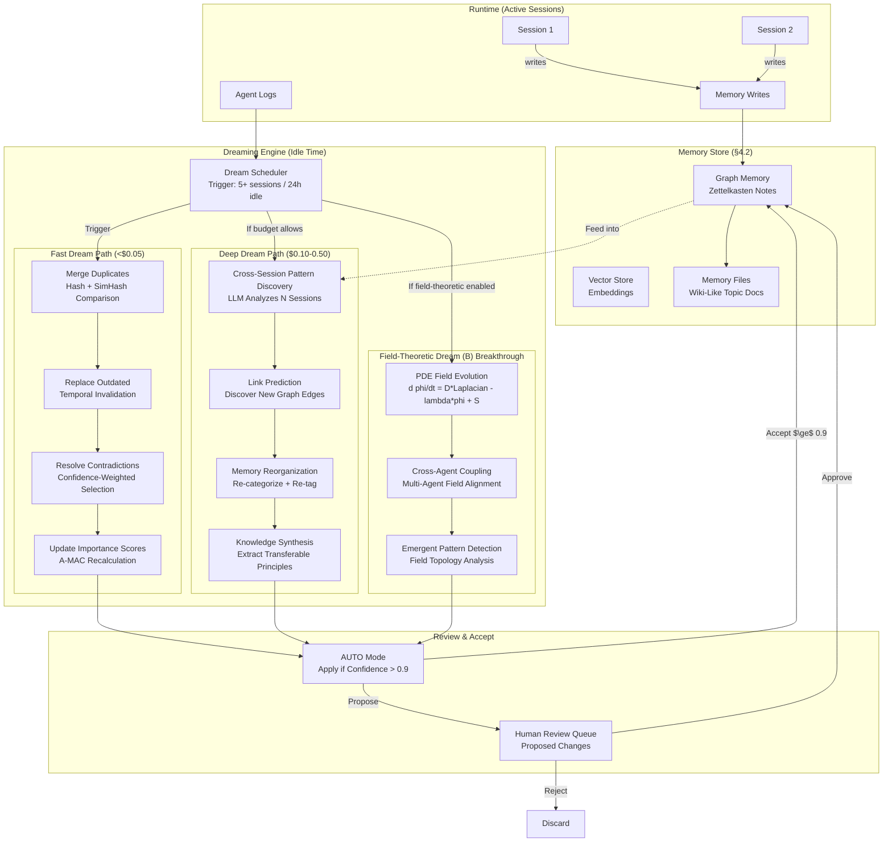
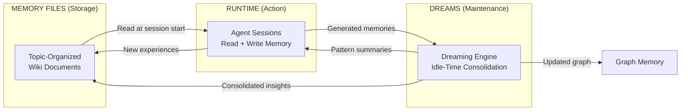

# Memory Consolidation ("Dreaming") — Ultra Plan (§4.24)

> Run 1 — June 3, 2026 | Idle-time background memory consolidation across sessions and agents
> Status: New plan — integrates Anthropic Dreaming, A-MEM Zettelkasten, field-theoretic PDE consolidation, Entropic Memory, CraniMem

## Plain-Language Summary

Lyra's Dreaming Engine is a scheduled background process that operates during idle time — while you're away, Lyra reviews past conversations, memory stores, and agent logs to reorganize, clean up, and discover patterns in its memory. It merges duplicate entries, replaces outdated facts, resolves contradictions, and surfaces cross-session insights that no single session could reveal. The result is a self-curating memory system that gets better over time: cleaner, more connected, and more useful. Combined with Memory Files (topic-organized, wiki-like user-controlled storage), Lyra achieves a Conway-like always-on cycle: Memory Files for storage, Dreams for maintenance, Runtime for action.

## 1. Problem

Lyra's memory system (graph memory from §4.2) accumulates entries during active sessions but has no mechanism for cross-session consolidation. Over time, this leads to: duplicate entries (same fact stored N times), outdated information (old task states, stale conclusions), contradictory facts (different sessions produced incompatible findings), and missed patterns (cross-session insights that no single agent could see). Without consolidation, memory quality degrades with scale — more entries mean more noise, not more signal. The target is Harvey-like ~6x task completion improvement through consolidated, cross-session memory.

## 2. Evidence Synthesis

### 2.1 Anthropic "Dreaming" (May 2026)

Scheduled cross-session memory consolidation for Claude Managed Agents:
- Reviews session history + memory stores during idle periods
- Four core functions: merge duplicates, replace outdated, resolve contradictions, discover hidden patterns
- Configurable frequency; auto-update vs. human-approval mode
- Related "Outcomes" feature: improves task success by "as much as 10 points"
- Cross-agent pattern discovery: insights no single agent could see

### 2.2 Anthropic Memory Files (36kr Article)

File-based persistent memory replacing single rolling summary:
- Claude automatically creates structured documents by topic
- "Dreams" = consolidation, selective retrieval = on-demand, user control = browse/edit/delete
- Underlying Conway always-on agent infrastructure (24/7 background operation)
- Auto-dream trigger: after 5+ sessions or 24+ hours since last consolidation
- Enterprise results: "97% reduction in first-pass error rates" (Netflix, Rakuten, Wisedocs), "30% faster document verification"
- Three Conway zones: Search, Chat, System

### 2.3 A-MEM Zettelkasten Memory (MemAgent Workshop, ICLR 2026)

Multi-attribute note structure with automatic linking and evolution:
- Memory note = {content, timestamp, keywords, tags, contextual description, embedding, links}
- Link generation: cosine similarity + LLM identifies connections between notes
- Memory evolution: new connections trigger updates to existing memories
- Token cost: ~1,200 tokens/operation vs MemGPT ~16,900 (85-93% reduction)
- LoCoMo Avg F1: 27.02 vs MemGPT 2.4

### 2.4 Entropic Memory (Du & Zhao, ICLR 2026)

Thermodynamics-inspired consolidation:
- Two-tier memory (hot working buffer → cold long-term store)
- Consolidation via free energy minimization: F = E + lambda*S
- Internal energy E(m) = -Utility(m); Entropy S(m) = H(e_m) (Shannon entropy of embedding)
- Temperature T regulates plasticity; stochastic replacement prevents local utility optima
- At 50% noise: Entropic maintains SR=0.28 vs greedy Importance degrades to 0.24 (+15% relative)

### 2.5 CraniMem (Mody et al., ICLR 2026)

Neurocognitively motivated gated/bounded memory:
- Goal-conditioned gating + utility tagging + bounded episodic buffer + structured graph
- Scheduled consolidation loop replays high-utility traces into graph, prunes low-utility
- Selective forgetting via importance weighting and temporal decay
- More robust than Vanilla RAG and Mem0 under injected noise

### 2.6 Field-Theoretic Memory (Mitra, 2026)

Memory as continuous scalar fields evolving via PDEs:
- d phi/dt = D*Laplacian(phi) - lambda*phi + S(x,y,t)
- LongMemEval multi-session reasoning F1: +116% (p<0.01, d=3.06)
- Temporal reasoning F1: +43.8% (p<0.001, d=9.21)
- Knowledge-update recall: +27.8% (p<0.001, d=5.00)
- Multi-agent collective intelligence: >99.8% at 2, 4, 8 agents (near-perfect)
- Memory overhead: 7.02MB (baseline 1.01MB); Processing time: 19.8ms/op (baseline 2.1ms/op)

### 2.7 LightMem + MetaClaw Consolidation

- LightMem: dual-architecture for fast consolidation path (<$0.01 per dream)
- MetaClaw: opportunistic fine-tuning during idle windows (LoRA on agent sessions)
- Fast path for everyday memory curation; deep path for pattern discovery + skill refinement

## 3. Proposed Lyra Design

### 3.1 Dreaming Architecture



### 3.2 Dream Scheduler

```python
@dataclass
class DreamConfig:
    """Configuration for the dreaming engine."""
    # Triggers
    auto_dream_enabled: bool = True
    session_threshold: int = 5          # Dream after N new sessions
    idle_hours_threshold: int = 24      # Dream after N hours idle
    min_idle_minutes: int = 15          # Must be idle for at least 15 min
    max_dream_minutes: int = 30         # Max dream duration
    
    # Budget
    fast_dream_budget_usd: float = 0.05
    deep_dream_budget_usd: float = 0.50
    field_theoretic_budget_usd: float = 0.20
    
    # Modes
    auto_apply_threshold: float = 0.9   # Auto-apply if confidence > 0.9
    human_review_required: bool = False  # Always require human review
    
    # Target metrics
    harvey_target_multiple: float = 6.0 # Target 6x task completion improvement

class DreamScheduler:
    """Schedule and manage dreaming sessions."""
    
    def __init__(self, config: DreamConfig):
        self.config = config
        self.last_dream_at: float = 0
        self.sessions_since_last_dream: int = 0
        self.dream_in_progress: bool = False
    
    async def should_dream(self, daemon: SupervisorDaemon) -> bool:
        """Check if dreaming should start."""
        if self.dream_in_progress:
            return False
        
        # Count new sessions since last dream
        new_sessions = len(daemon.list_sessions(created_after=self.last_dream_at))
        idle_hours = (time.time() - daemon.last_active_at) / 3600
        active_sessions = daemon.list_sessions(state_filter=[TaskState.WORKING])
        
        # Only dream when system is truly idle
        if len(active_sessions) > 0:
            return False
        
        # Check triggers
        if new_sessions >= self.config.session_threshold:
            return True
        if idle_hours >= self.config.idle_hours_threshold:
            return True
        
        return False
    
    async def run_dream(self, memory_store: MemoryStore, agent_logs: list[AgentLog]) -> DreamResult:
        """Execute a full dream cycle."""
        self.dream_in_progress = True
        results = []
        
        # 1. Fast dream path (always runs)
        fast_result = await self._fast_dream(memory_store)
        results.append(fast_result)
        
        # 2. Deep dream path (budget-dependent)
        if fast_result.insights_count >= 3:  # Deep dream needs sufficient raw material
            deep_result = await self._deep_dream(memory_store, agent_logs)
            results.append(deep_result)
        
        # 3. Field-theoretic dream (breakthrough tier, gated)
        if self.config.field_theoretic_budget_usd > 0:
            field_result = await self._field_theoretic_dream(memory_store)
            results.append(field_result)
        
        self.last_dream_at = time.time()
        self.sessions_since_last_dream = 0
        self.dream_in_progress = False
        
        return DreamResult(
            dream_id=uuid4(),
            timestamp=self.last_dream_at,
            phases=[r.phase for r in results],
            total_merges=sum(r.merges for r in results),
            total_updates=sum(r.updates for r in results),
            total_new_links=sum(r.new_links for r in results),
            total_forgets=sum(r.forgets for r in results),
            total_patterns=sum(r.patterns for r in results),
            total_cost=sum(r.cost_usd for r in results),
        )
```

### 3.3 Fast Dream Path (Merge + Replace + Resolve)

```python
class FastDream:
    """Lightweight memory consolidation — merge duplicates, replace outdated, resolve contradictions."""
    
    async def merge_duplicates(self, memories: list[MemoryNote]) -> list[MergeAction]:
        """Find and merge duplicate memory notes."""
        merges = []
        
        # Group by SimHash similarity (O(N), not O(N^2))
        hash_groups = defaultdict(list)
        for note in memories:
            simhash = self._compute_simhash(note.content)
            hash_groups[simhash // self.SIMHASH_TOLERANCE].append(note)
        
        for group in hash_groups.values():
            if len(group) < 2:
                continue
            
            # Keep the best version
            best = max(group, key=lambda n: n.importance)
            redundant = [n for n in group if n.id != best.id]
            
            # Merge: add links to best, mark redundant as forgotten
            for dup in redundant:
                best.links.extend(dup.links)
                best.access_count += dup.access_count
                merges.append(MergeAction(
                    survivor_id=best.id,
                    eliminated_ids=[dup.id],
                    rationale=f"Duplicate of '{best.title}' (confidence: {best.confidence:.2f})",
                    confidence=0.95,
                ))
        
        return merges
    
    async def replace_outdated(self, memories: list[MemoryNote]) -> list[UpdateAction]:
        """Find memories that reference outdated information."""
        updates = []
        for note in memories:
            # Check for time-sensitive content
            if self._has_temporal_reference(note.content):
                staleness = time.time() - note.last_modified_at
                if staleness > self.TEMPORAL_STALE_THRESHOLD:
                    updates.append(UpdateAction(
                        note_id=note.id,
                        action=UpdateActionType.FLAG_FOR_REVIEW,
                        rationale=f"Memory contains time-sensitive reference ({staleness:.0f}s old)",
                        confidence=0.6,
                    ))
        return updates
    
    async def resolve_contradictions(self, memories: list[MemoryNote]) -> list[ResolveAction]:
        """Find and resolve contradictory memory entries."""
        contradictions = []
        
        # Find groups of memories with overlapping topics but conflicting claims
        topic_groups = self._group_by_topic(memories)
        for topic, group in topic_groups:
            claims = [self._extract_claims(n.content) for n in group]
            conflicts = self._find_conflicts(claims)
            
            for conflict in conflicts:
                # Keep the one with higher confidence + recency
                winner = max(conflict, key=lambda c: c.note.confidence * c.note.recency)
                resolved = ResolveAction(
                    survivor_id=winner.note.id,
                    eliminated_ids=[c.note.id for c in conflict if c.note.id != winner.note.id],
                    rationale=f"Conflict resolved: '{winner.claim}' (confidence {winner.note.confidence:.2f}) "
                              f"prevails over conflicting versions",
                    confidence=min(0.8, winner.note.confidence + 0.1),
                )
                contradictions.append(resolved)
        
        return contradictions
```

### 3.4 Deep Dream Path (Pattern Discovery + Synthesis)

```python
class DeepDream:
    """Deep memory consolidation — cross-session pattern discovery and knowledge synthesis."""
    
    def __init__(self, router: ModelRouter):
        self.llm = router.get_model_for_effort("medium")  # Sonnet-class for deep analysis
        self.max_sessions_per_dream = 100
        self.max_memories_per_scan = 500
    
    async def discover_patterns(self, session_logs: list[SessionLog]) -> list[Pattern]:
        """Analyze session logs for cross-session patterns."""
        # Sample N recent sessions
        recent = sorted(session_logs, key=lambda s: s.created_at)[-self.max_sessions_per_dream:]
        
        # Build compressed summaries
        session_batch = []
        for session in recent:
            session_batch.append({
                "id": session.id,
                "task": session.task[:200],
                "outcome": session.outcome,
                "key_memories": session.generated_memories[:5],
                "errors": session.errors[:3],
            })
        
        # LLM analysis of the batch
        response = await self.llm.chat([
            {"role": "system", "content": "You are a memory consolidation analyst. Read these session logs and identify:\n"
                                          "1. Recurring patterns (same type of task, same workflow structure)\n"
                                          "2. Cross-session insights (discoveries that span multiple sessions)\n"
                                          "3. Recurring errors (same mistake appearing in multiple sessions)\n"
                                          "4. Knowledge gaps (areas where the agent consistently struggles)\n\n"
                                          "Return structured findings."},
            {"role": "user", "content": json.dumps(session_batch)}
        ])
        
        return self._parse_patterns(response.content)
    
    async def synthesize_knowledge(self, related_memories: list[MemoryNote]) -> list[SynthesisAction]:
        """Extract transferable principles from a group of related memories."""
        if len(related_memories) < 3:
            return []
        
        memory_texts = [{"id": m.id, "title": m.title, "content": m.content} for m in related_memories]
        
        response = await self.llm.chat([
            {"role": "system", "content": "Read these related memory notes and synthesize them into:\n"
                                          "1. A consolidated knowledge entry that captures the essential information\n"
                                          "2. Any gaps or open questions\n"
                                          "3. Cross-references to other knowledge areas\n"
                                          "Keep the synthesized entry specific and actionable."},
            {"role": "user", "content": json.dumps(memory_texts)}
        ])
        
        return [SynthesisAction(
            source_ids=[m["id"] for m in memory_texts],
            synthesized_content=response.content,
            created_by="deep_dream",
            confidence=0.7,
        )]
```

### 3.5 Field-Theoretic Dream (Breakthrough Tier)

```python
class FieldTheoreticDream:
    """PDE-based memory field consolidation.
    
    Memories are projected onto a 2D semantic grid and evolved via:
    d phi/dt = D*Laplacian(phi) - lambda*(1-I)*phi + kappa*coupling
    
    Latent: new links from proximity, merge candidates from overlap,
    forget candidates from low activation.
    """
    
    def __init__(self, grid_resolution: int = 256):
        self.grid_resolution = grid_resolution
        self.diffusion_coefficient = 0.1
        self.decay_coefficient = 0.01
        self.coupling_coefficient = 0.05
        self.dt = 0.01
    
    async def consolidate(self, memories: list[MemoryNote], steps: int = 1000) -> FieldResult:
        """Run PDE consolidation on memory field."""
        # Project memories onto semantic grid
        grid = self._project_to_grid(memories)
        
        # Run finite-difference PDE integration
        for step in range(steps):
            laplacian = self._compute_laplacian(grid)
            importance = self._importance_field(grid, memories)
            coupling = await self._cross_agent_coupling(grid)
            
            # Update: d phi/dt = D*Laplacian - lambda*(1-I)*phi + kappa*coupling
            delta = (
                self.diffusion_coefficient * laplacian
                - self.decay_coefficient * (1.0 - importance) * grid
                + self.coupling_coefficient * coupling
            )
            grid += self.dt * delta
            
            # Prune near-zero values (sparse representation)
            grid[np.abs(grid) < 1e-6] = 0.0
        
        # Extract insights from evolved field
        new_links = self._discover_links_from_proximity(grid, memories)
        merge_candidates = self._find_merge_candidates(grid, memories)
        forget_candidates = self._find_forget_candidates(grid, memories, threshold=0.1)
        
        return FieldResult(
            new_links=new_links,
            merge_candidates=merge_candidates,
            forget_candidates=forget_candidates,
            field_energy=np.sum(grid ** 2),
            processing_time_s=steps * self.dt,
        )
```

### 3.6 Memory Files Integration

```python
class MemoryFiles:
    """Topic-organized, wiki-like user-controlled memory storage.
    
    Memory files are persistent documents organized by topic/project/context.
    They sit alongside the graph memory and are read selectively at session start.
    """
    
    def __init__(self, base_path: Path = Path("~/.lyra/memory-files")):
        self.base_path = base_path.expanduser()
        self.base_path.mkdir(parents=True, exist_ok=True)
    
    async def create_file(self, topic: str, content: str, tags: list[str]) -> Path:
        """Create a new memory file organized by topic."""
        file_path = self.base_path / f"{self._slugify(topic)}.md"
        file_path.write_text(f"# {topic}\n\n{content}\n")
        return file_path
    
    async def update_from_dream(self, dream_result: DreamResult, memory_store: MemoryStore) -> int:
        """Update memory files based on dream consolidation results."""
        updates = 0
        for merge in dream_result.merges:
            await self._reflect_merge(merge, memory_store)
            updates += 1
        for pattern in dream_result.patterns:
            await self._write_pattern(pattern)
            updates += 1
        return updates
    
    def get_relevant_files(self, task: str, n: int = 3) -> list[Path]:
        """Retrieve relevant memory files based on current task context."""
        files = list(self.base_path.glob("*.md"))
        if not files:
            return []
        
        # Score by keyword overlap
        task_keywords = set(task.lower().split())
        scored = []
        for f in files:
            title_keywords = set(f.stem.lower().split("_"))
            overlap = len(task_keywords & title_keywords)
            scored.append((f, overlap))
        
        scored.sort(key=lambda x: x[1], reverse=True)
        return [f for f, _ in scored[:n]]
```

### 3.7 Conway-like Always-On Cycle



### 3.8 Data Model

```python
@dataclass
class DreamResult:
    """Result of a dreaming cycle."""
    dream_id: UUID
    timestamp: float
    phases: list[str]                  # Which paths ran
    total_merges: int
    total_updates: int
    total_new_links: int
    total_forgets: int
    total_patterns: int
    total_cost: float                  # USD cost of this dream
    
    # Per-phase results
    fast_results: FastDreamResult | None = None
    deep_results: DeepDreamResult | None = None
    field_results: FieldResult | None = None

@dataclass
class MergeAction:
    survivor_id: str
    eliminated_ids: list[str]
    rationale: str
    confidence: float

@dataclass
class ResolveAction:
    survivor_id: str
    eliminated_ids: list[str]
    rationale: str
    confidence: float

@dataclass
class UpdateAction:
    note_id: str
    action: UpdateActionType      # UPDATE_CONTENT | FLAG_FOR_REVIEW | ADD_LINK
    rationale: str
    confidence: float

class UpdateActionType(Enum):
    UPDATE_CONTENT = "update_content"
    FLAG_FOR_REVIEW = "flag_for_review"
    ADD_LINK = "add_link"

@dataclass
class Pattern:
    type: PatternType             # RECURRING_TASK | CROSS_SESSION_INSIGHT | RECURRING_ERROR
    description: str
    evidence: list[str]           # Session IDs or memory note IDs
    confidence: float

class PatternType(Enum):
    RECURRING_TASK = "recurring_task"
    CROSS_SESSION_INSIGHT = "cross_session_insight"
    RECURRING_ERROR = "recurring_error"
    KNOWLEDGE_GAP = "knowledge_gap"

@dataclass
class DreamMetrics:
    """Key metrics for dream quality dashboard."""
    sessions_processed: int
    memories_scanned: int
    total_dreams: int
    avg_cost_per_dream: float
    avg_merges_per_dream: float
    avg_patterns_per_dream: float
    total_cost_all_dreams: float
    harvey_task_completion_improvement: float  # Measured vs no-dreaming baseline
```

## 4. Build Outline

### Phase 1: Fast Dream Path (weeks 1-2)

1. **Dream scheduler** — `DreamScheduler` with session-count and idle-time triggers; configurable thresholds; idle detection via §4.13 supervisor daemon.
2. **Duplicate merge** — SimHash-based similarity detection; confidence-weighted survivor selection; link transfer from eliminated notes.
3. **Outdated replacement** — Temporal reference detection; staleness threshold; flag-for-review on stale entries.
4. **Contradiction resolution** — Topic grouping + claim extraction + conflict detection; confidence*recency weighted winner selection.
5. **Review queue** — Human-readable change log; accept/reject per change; batch accept.
6. **Dream metrics** — Track merges, updates, costs; dashboard in fleet view.

**Dependencies:** §4.2 graph memory

### Phase 2: Deep Dream Path (weeks 3-4)

1. **Session log sampling** — Select N most recent sessions for analysis; deduplicate overlapping sessions.
2. **LLM-based pattern discovery** — Prompt Sonnet-class model to identify cross-session patterns; structured output format.
3. **Knowledge synthesis** — Group related memories by topic; LLM synthesizes consolidated entry; preserves source links.
4. **Memory files integration** — Create/update topic-organized wiki documents; selective retrieval at session start.
5. **Conway-like cycle** — Memory Files ↔ Dreams ↔ Runtime loop; auto-trigger on session start and dream completion.

**Dependencies:** Phase 1

### Phase 3: Field-Theoretic Dream (weeks 5-6)

1. **PDE solver** — 2D semantic grid with finite-difference Laplacian; importance field computation; cross-agent coupling term.
2. **Memory projection** — Encode memories onto semantic grid via embedding → grid position mapping.
3. **Insight extraction** — Link discovery from field proximity; merge/forget candidates from field activation analysis.
4. **Bake-off evaluation** — LLM-based dreaming vs PDE consolidation on same memory tasks; F1, cost-per-query, latency.
5. **Winner selection** — Whichever approach scores higher on quality-per-dollar becomes default.

**Dependencies:** §4.2 vector store + graph memory. Bake-off requires both implementations.

### Phase 4: Production + Evaluation (weeks 7-8)

1. **Harvey benchmark** — Measure task completion improvement with vs without dreaming; target 6x improvement.
2. **Budget optimization** — Auto-tune which dream paths run based on budget; dynamic depth adjustment.
3. **Multi-agent dreaming** — Cross-agent pattern discovery (insights that span multiple agents' sessions).
4. **Dream reports** — Human-readable dream outcome reports; auto-update memory files; notification on significant discoveries.
5. **Continuous tuning** — Adjust merge confidence thresholds, stale detection windows, contradiction sensitivity based on logged outcomes.

## 5. Multi-Provider Note

The dreaming engine uses LLMs for deep analysis and link prediction — route these calls via §4.5 router to the cheapest model that can handle the task. Fast dream (merge/replace/resolve) uses no LLM — pure algorithmic (SimHash, temporal checks). Deep dream uses Sonnet-class for pattern discovery, Haiku for routine synthesis. Field-theoretic dream uses CPU/GPU computation (NumPy/JAX), not LLMs — provider-agnostic by nature. Memory files are plain Markdown — provider-agnostic.

## 6. (A) Parity vs (B) Breakthrough

**(A) Parity:** Fast dream path (merge duplicates, replace outdated, resolve contradictions) + deep dream path (LLM-based pattern discovery + knowledge synthesis). Matches Anthropic Dreaming's feature set — cross-session consolidation with human-reviewable changes.

**(B) Breakthrough:** Field-theoretic PDE consolidation for memory evolution + Conway-like always-on cycle (Memory Files + Dreams + Runtime) + Harvey-targeted 6x task completion improvement through consolidated memory. No agent system combines field-theoretic memory maintenance with continuous cross-session pattern discovery. The bake-off between LLM-based and PDE-based dreaming is itself novel — no existing system evaluates both approaches on the same benchmarks.

## 7. Baseline Delta

**Changes:** New dreaming engine (scheduler, fast/deep/field paths), merge/update/resolve pipeline, pattern discovery, memory files, Conway cycle, bake-off evaluator
**Keeps:** Graph memory (§4.2) as the storage substrate; vector store for embeddings; A-MAC admission control
**Replaces:** Ad-hoc memory accumulation → scheduled, principled consolidation
**Migration cost:** ~6 new Python modules; ~1500 lines of code; JAX for field-theoretic path; no breaking changes to existing memory store

## 8. Expert Review

**Senior AI Systems Researcher:** "The three-tier dream path (fast/deep/field) is the right architecture — you don't want to spend $0.50 consolidating every session pair, but you also don't want to miss cross-session patterns. The fast path handles the 90% case. Key question: how do you prevent the dreaming engine from reinforcing its own biases? If it merges duplicates incorrectly and then uses those merged entries as evidence for patterns, errors compound. Solution: log all dream outcomes and periodically evaluate dream quality against ground truth."

**Senior Backend Engineer:** "The Conway cycle sounds great but introduces a circular dependency: dreaming reads memories → produces consolidated memories → agent reads consolidated memories → produces more memories. Need a termination condition. Also, the field-theoretic JAX implementation needs GPU — run it on the cheapest available GPU via the provider abstraction. The bake-off design is excellent but make sure both paths are evaluating on the same task suite with identical metrics."

**Senior Data Engineer:** "The SimHash-based duplicate detection is O(N) which is essential for scaling to 100K+ memories. But SimHash has false positives — add a verification step before auto-merging (check pairwise cosine similarity for flagged candidates). The Harvey benchmark is the right target metric but needs careful design: task completion improvement could come from multiple factors (better memories, but also better routing or skill optimization). Control for those."

**Adversarial Skeptic:** "The $0.05-0.50 per-dream cost is acceptable for nightly runs but if you're dreaming after every 5 sessions, that's $2-10/day for a heavy user. The fast path alone ($0.05) is good enough for most consolidation. Gate the deep + field paths behind a budget slider. Also, the field-theoretic approach is elegant math but the Mitra paper's 6.9x memory overhead is concerning at Lyra scale — validate the sparse representation first."

**Resolution:** Phase 1 (fast dream path) is the production default — proven techniques (SimHash dedup, temporal invalidation, confidence-weighted conflict resolution) at <$0.05 per dream. Deep dream path is Phase 2, gated behind a budget slider (default: $0.10/dream). Field-theoretic path is Phase 3, gated behind the bake-off — it ships only if it beats LLM-based dreaming on quality-per-dollar. Conway cycle is continuous integration of fast dreaming + memory files, not a separate feature.

## 9. References
- Anthropic Dreaming: https://siliconangle.com/2026/05/06/anthropic-letting-claude-agents-dream-dont-sleep-job/
- Anthropic Memory Files: https://36kr.com/p/3824047027458182
- A-MEM: https://openreview.net/pdf?id=FiM0M8gcct
- Entropic Memory: https://openreview.net/pdf?id=um6VpjcOtj
- CraniMem: https://openreview.net/pdf?id=Tts94WVw40
- Field-Theoretic Memory: https://arxiv.org/abs/2602.21220
- Lyra §4.2 Memory Architecture
- LightMem / MetaClaw: 2603.17187

## 10. Changelog
- Run 1: Initial plan written — fast/deep/field dream paths, Conway-like cycle, Memory Files integration, Harvey target
