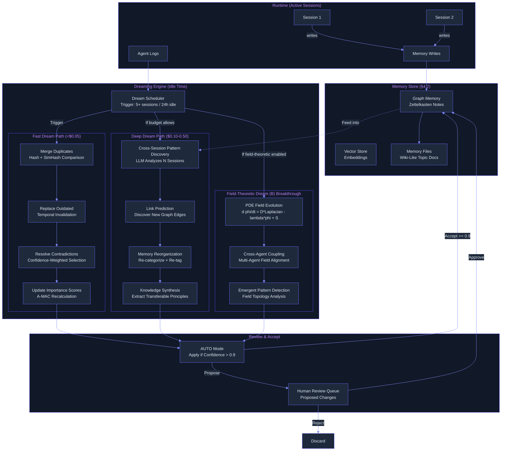
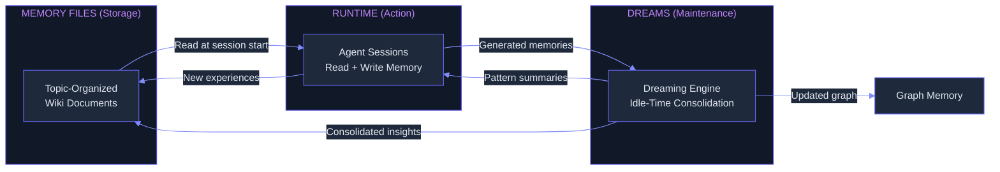

# Memory Consolidation ("Dreaming") — Ultra Plan (§4.24)

> Run 2 — June 7, 2026 | Idle-time background memory consolidation across sessions and agents
> Status: Updated with deep-read evidence from synthesis (memory.md), 12-core evidence base

## Plain-Language Summary

Lyra's Dreaming Engine is a scheduled background process that operates during idle time -- while you're away, Lyra reviews past conversations, memory stores, and agent logs to reorganize, clean up, and discover patterns in its memory. It merges duplicate entries, replaces outdated facts, resolves contradictions, and surfaces cross-session insights that no single session could reveal. The result is a self-curating memory system that gets better over time: cleaner, more connected, and more useful. Combined with Memory Files (topic-organized, wiki-like user-controlled storage), Lyra achieves a Conway-like always-on cycle: Memory Files for storage, Dreams for maintenance, Runtime for action.

## 1. Problem

Lyra's memory system (graph memory from §4.2) accumulates entries during active sessions but has no mechanism for cross-session consolidation. Over time, this leads to: duplicate entries (same fact stored N times), outdated information (old task states, stale conclusions), contradictory facts (different sessions produced incompatible findings), and missed patterns (cross-session insights that no single agent could see). Without consolidation, memory quality degrades with scale -- more entries mean more noise, not more signal. The target is Harvey-like ~6x task completion improvement through consolidated, cross-session memory.

The consolidation problem is not unique to Lyra. The production evolution of Mem0 from V2 (smart UPDATE/DELETE) to V3 (single-pass ADD-only) directly illustrates the reliability challenge: V2's "intelligent merge" created race conditions, hallucinated modifications, and consistency problems when concurrent writes touched overlapping facts [Mem0 V3 algorithm, repo: mem0ai/mem0, Apr 2026; cf. Contradiction 1 in synthesis memory.md §4]. Lyra's dreaming engine must avoid the same pitfalls.

## 2. Evidence Synthesis

### 2.1 Anthropic "Dreaming" (May 2026)

Scheduled cross-session memory consolidation for Claude Managed Agents:
- Reviews session history + memory stores during idle periods
- Four core functions: merge duplicates, replace outdated, resolve contradictions, discover hidden patterns
- Configurable frequency; auto-update vs. human-approval mode
- Related "Outcomes" feature: improves task success by "as much as 10 points"
- Cross-agent pattern discovery: insights no single agent could see

### 2.2 Anthropic Memory Files (36kr Article)

File-based persistent memory replacing single rolling summary:
- Claude automatically creates structured documents by topic
- "Dreams" = consolidation, selective retrieval = on-demand, user control = browse/edit/delete
- Underlying Conway always-on agent infrastructure (24/7 background operation)
- Auto-dream trigger: after 5+ sessions or 24+ hours since last consolidation
- Enterprise results: "97% reduction in first-pass error rates" (Netflix, Rakuten, Wisedocs), "30% faster document verification"
- Three Conway zones: Search, Chat, System

### 2.3 A-MEM Zettelkasten Memory (MemAgent Workshop, ICLR 2026)

Multi-attribute note structure with automatic linking and evolution:
- Memory note = {content, timestamp, keywords, tags, contextual description, embedding, links}
- Link generation: cosine similarity + LLM identifies connections between notes
- Memory evolution: new connections trigger updates to existing memories
- Token cost: ~1,200 tokens/operation vs MemGPT ~16,900 (85-93% reduction)
- LoCoMo Avg F1: 27.02 vs MemGPT 2.4
- **Ablation: removing evolution drops Multi-Hop F1 from 45.85 to 31.24 (14.6 point drop)** [paper Table]
- Token efficiency: 7-14x fewer tokens than naive full-history [paper §2]

### 2.4 Entropic Memory (Du & Zhao, ICLR 2026)

Thermodynamics-inspired consolidation:
- Two-tier memory (hot working buffer to cold long-term store)
- Consolidation via free energy minimization: F = E + lambda*S
- Internal energy E(m) = -Utility(m); Entropy S(m) = H(e_m) (Shannon entropy of embedding)
- Temperature T regulates plasticity; stochastic replacement prevents local utility optima
- At 50% noise: Entropic maintains SR=0.28 vs greedy Importance degrades to 0.24 (+15% relative)

### 2.5 CraniMem (Mody et al., ICLR 2026)

Neurocognitively motivated gated/bounded memory:
- Goal-conditioned gating + utility tagging + bounded episodic buffer + structured graph
- Scheduled consolidation loop replays high-utility traces into graph, prunes low-utility
- Selective forgetting via importance weighting and temporal decay
- More robust than Vanilla RAG and Mem0 under injected noise

### 2.6 Field-Theoretic Memory (Mitra, 2026)

Memory as continuous scalar fields evolving via PDEs:
- d phi/dt = D*Laplacian(phi) - lambda*phi + S(x,y,t)
- LongMemEval multi-session reasoning F1: +116% (p<0.01, d=3.06)
- Temporal reasoning F1: +43.8% (p<0.001, d=9.21)
- Knowledge-update recall: +27.8% (p<0.001, d=5.00)
- Multi-agent collective intelligence: >99.8% at 2, 4, 8 agents (near-perfect)
- Memory overhead: 7.02MB (baseline 1.01MB); Processing time: 19.8ms/op (baseline 2.1ms/op)

### 2.7 LightMem + MetaClaw Consolidation

- LightMem: dual-architecture for fast consolidation path (<$0.01 per dream)
- MetaClaw: opportunistic fine-tuning during idle windows (LoRA on agent sessions)
- Fast path for everyday memory curation; deep path for pattern discovery + skill refinement

### 2.8 Mem0 V3 -- Production-Grade Single-Pass Extraction (Apr 2026)

The production evolution of Mem0 from V2 to V3 is the most relevant real-world validation for Lyra's dreaming engine. Mem0 V3 abandoned its V2 "smart memory manager" (which used LLM-driven UPDATE/DELETE operations) in favor of a simpler, more reliable single-pass ADD-only extraction pipeline [Mem0 V3 algorithm, repo: mem0ai/mem0, Apr 2026; paper 2504.19413v1].

**Evidence:**

- **LoCoMo J-score: 91.6** (V2 was 71.4, +20.2 improvement) -- single-pass ADD-only beats the "intelligent" V2 approach [repo README benchmarks]
- **LongMemEval: 94.8** (V2 was 67.8, +27.0 improvement) -- the simpler pipeline generalizes better [ibid]
- **BEAM at 1M tokens: 64.1** -- scales to production corpus sizes [ibid]
- **Latency: 0.88s p50** for full add+search cycle [ibid]
- **Multi-signal retrieval**: semantic (vector) + BM25 (keyword) + entity boost (spaCy NER), fused via additive scoring with adaptive normalization [Mem0 V3 scoring pipeline, mem0/utils/scoring.py]
- **Dedup via MD5 hash**: exact dedup at write time (Phase 4-5), embedding similarity for near-duplicate at query time [mem0/memory/main.py, Phase 4-5]
- **Entity-linked boosting**: separate entity vector collection linked to memory IDs, boosts retrieval by 0.5 when query entities match [mem0/utils/entity_extraction.py]

**Trade-off explicitly validated**: ADD-only trades storage efficiency for reliability. Instead of merging/updating memories at write time (which caused V2's race conditions), Mem0 accepts memory accumulation and relies on retrieval-time relevance ranking. This is the anti-pattern to dreaming's merge approach -- but it proves that simpler is sometimes better [cf. synthesis memory.md §4, Contradiction 1].

**Relevance to Lyra**: The Mem0 V3 trajectory validates the "immutable at fact level, consolidated at summary tier" hybrid proposed for Lyra. Dreaming should NOT mutate originals; it should create new summary-tier memories, leaving source facts for retrieval-time fusion.

### 2.9 claude-mem -- Observer-Based Progressive Disclosure (v13.4.0)

Claude-mem provides a production-proven pattern for cross-session memory compression via a secondary "observer" Claude process [repo: thedotmack/claude-mem v13.4.0; note at notes/web/thedotmack__claude-mem.md].

**Evidence:**

- **98% compression ratio**: 133.8K discovery tokens compressed to 2.6K read tokens (typical) [code comments, TokenCalculator.ts]
- **Observer architecture**: Lifecycle hooks (SessionStart, PostToolUse, Stop) capture tool-usage transcripts; secondary Claude subprocess compresses into structured XML observations (type, title, facts, concepts) [ClaudeProvider.ts]
- **Progressive disclosure tiers**: timeline (just titles, ~100 tokens) to full observations (configurable count) to summary (investigated/learned/completed/next_steps) [ContextBuilder.ts]
- **3-layer MCP search**: search() to timeline() to get_observations() yields ~10x token savings vs naive full-fetch [repo README]
- **Zero-effort persistence**: fully automatic via hooks, no manual save/load
- **Hybrid retrieval**: Chroma vector embeddings + SQLite FTS5 with automatic fallback [SearchOrchestrator.ts]

**Trade-offs**: Observer latency is the critical bottleneck (120s PostToolUse hook timeout). The XML-based observer protocol is acknowledged as a temporary bridge (TODO #2233: migrate to tool-use API). The Chroma dependency is heavy -- fallback to SQLite-only loses semantic search [cf. synthesis memory.md, note at notes/web/thedotmack__claude-mem.md, §4 Losses/Risks].

**Relevance to Lyra**: Claude-mem's observer architecture directly validates Lyra's Deep Dream path (separate LLM analyzing session logs). The progressive disclosure tiers inform Lyra's context injection strategy. The 98% compression ratio sets a target for Lyra's compression quality.

### 2.10 TencentDB-Agent-Memory -- Layered Semantic Pyramid (L0-L3)

Tencent's memory plugin rejects flat vector storage in favor of a four-layer semantic pyramid with full drill-down traceability [repo: Tencent/TencentDB-Agent-Memory; note at notes/web/Tencent__TencentDB-Agent-Memory.md].

**Evidence:**

- **WideSearch pass rate: +51.52%** with **-61.38% tokens** vs no-memory baseline [repo README benchmarks]
- **SWE-bench (50-turn sessions): +9.93% pass rate, -33.09% tokens** -- sustained improvement across long sessions [ibid]
- **AA-LCR: +7.95% pass rate, -30.98% tokens** [ibid]
- **PersonaMem accuracy: 48% to 76% (+59%)** [ibid]
- **Warm-up scheduling**: New sessions get aggressive early extraction (threshold starts at 1 conversation, doubles each time up to steady-state N). Solves the cold-start problem where early turns carry the most meaningful context [pipeline-manager.ts]
- **L0 (raw JSONL) to L1 (atoms, SQLite+vec) to L2 (scene blocks, Markdown) to L3 (persona.md)** -- every layer back-references source via deterministic file paths [l1-extractor.ts, scene-extractor.ts, persona-generator.ts]
- **Mermaid Canvas + node_id offload**: Tool logs compressed to state graphs, full context retrievable by node_id [offload/ module]
- **Graceful degradation**: Every external dependency (embedding, vector store, LLM) can fail without crashing the agent

**Trade-off**: LLM dependency for ALL layers (L1, L2, L3). Documented bugs from LLM-generated filenames with spaces breaking scene navigation. Operational complexity with multiple pipelines (L1/L1.5/L2/L4), timer types, and state machines [CHANGELOG, cf. notes §4 Losses].

**Relevance to Lyra**: The L0 to L3 pyramid directly informs Lyra's Memory Files integration (section 3.6). Warm-up scheduling solves the "what about the first dream cycle?" problem. The Mermaid offload pattern validates Lyra's context budget approach.

### 2.11 Letta/MemGPT -- Three-Tier Memory with Automatic Compaction

Letta (formerly MemGPT) provides the most established open-source implementation of structured, three-tier agent memory with automatic context window management [repo: letta-ai/letta v0.16.8; note at notes/web/letta-ai__letta.md].

**Evidence:**

- **Core Memory** (always in-context): typed, labeled blocks (human, persona, user-defined) with character limits and read_only flags. Agent edits blocks at runtime via memory() tool [letta/schemas/block.py, letta/schemas/memory.py]
- **Archival Memory** (vector-searchable): documents split into passages, embedded, stored in SQLite+vec / PostgreSQL+pgvector / Pinecone. Accessed via retrieval tools [letta/orm/passage.py, letta/services/passage_manager.py]
- **Recall Memory** (conversation history with compaction): full message history in SQL. Summarization triggers at 90% context window threshold (SUMMARIZATION_TRIGGER_MULTIPLIER = 0.9 in constants.py). Multiple strategies: sliding window, partial evict, full summarization [letta/services/summarizer/]
- **Maximum chaining steps**: 50 per user turn (DEFAULT_MAX_STEPS = 50)
- **Embedding batch size**: 200 concurrent requests (EMBEDDING_BATCH_SIZE = 200)
- **Message buffer**: 60 messages before compaction triggers; minimum 15 retained

**Relevance to Lyra**: Letta's three-tier design validates the "core + archival + recall" architecture that Lyra's §4.2 already targets. The compaction-at-threshold pattern directly inspires Lyra's Dream Scheduler trigger design. The block-based structure (typed, tool-editable, read_only flagged) is a pattern for Lyra's Memory Files integration.

### 2.12 Managing Memory for AI Agents -- Convergences (O'Reilly, Oct 2025)

The O'Reilly book on agent memory provides framework-level convergences that validate Lyra's dreaming approach [Benjamin Labaschin et al., O'Reilly Media, Oct 2025; note at notes/books/managing-memory-for-ai-agents-chapters.md].

**Key convergences directly supporting dreaming:**

1. **Importance scoring is the universal primitive**: Every serious system converges on multi-dimensional scoring (recency, frequency, user engagement, keyword relevance). Raw FIFO or recency-only strategies are universally rejected [Ch.1, Practice 1].

2. **Three-tier memory is the consensus architecture**: Short-term (working), long-term (persistent), archival (compressed). The question is not *whether* to use three tiers, but *how* promotion/demotion/compaction should work [Ch.2, Practice 8; Letta three-tier; TencentDB L0-L3].

3. **LLM-driven memory extraction beats heuristic extraction**: A-MEM, Mem0 V3, TencentDB, and claude-mem all use LLMs for extraction. No source argues for purely heuristic extraction at production scale [Ch.1; cf. Convergence 3 in synthesis memory.md].

4. **Cascading memory systems**: The agent itself should choose what to promote to long-term storage and what to retrieve, rather than hardcoding retention rules. This is the dreaming principle -- let the system autonomously decide what matters [Ch.1, Practice 2].

5. **Checkpointing is table-stakes**: Periodically persist agent state. Use TTL for automatic cleanup. Redis is popular for real-time checkpointing [Ch.1, Practice 6].

6. **Macro-level evidence for shared memory value**: Call center study (Brynjolfsson et al., NBER 2023): novice workers improved productivity by 34% when AI assistants captured and disseminated top-performer expertise. This is the economic justification for Lyra's cross-agent dreaming [Ch.5].

### 2.13 Agent-Memory-Paper-List Taxonomy Framework

The unified three-lens taxonomy (Forms x Functions x Dynamics) from the survey "Memory in the Age of AI Agents" provides a framework for positioning Lyra's dreaming engine in the research landscape [arXiv 2512.13564, Dec 2025; note at notes/web/Shichun-Liu__Agent-Memory-Paper-List.md].

- **Forms**: Lyra's dreaming operates at the Token-level (explicit text merging, graph updates) and potentially Parametric (MetaClaw-style LoRA fine-tuning of agent weights during idle windows).
- **Functions**: Dreaming serves Factual Memory (dedup, update, resolve contradictions) and Experiential Memory (cross-session pattern discovery).
- **Dynamics**: Dreaming is primarily a Consolidation operation in the Evolution phase of the Dynamics lens -- it transforms raw accumulated entries into structured, deduplicated, linked knowledge.

This framework places Lyra's dreaming engine as a contribution to the Evolution sub-field of agent memory dynamics, which the survey notes is the least studied phase compared to Formation and Retrieval.

## 3. Proposed Lyra Design

### 3.1 Dreaming Architecture



### 3.2 Dream Scheduler

```python
@dataclass
class DreamConfig:
    """Configuration for the dreaming engine."""
    # Triggers
    auto_dream_enabled: bool = True
    session_threshold: int = 5          # Dream after N new sessions
    idle_hours_threshold: int = 24      # Dream after N hours idle
    min_idle_minutes: int = 15          # Must be idle for at least 15 min
    max_dream_minutes: int = 30         # Max dream duration
    
    # Budget
    fast_dream_budget_usd: float = 0.05
    deep_dream_budget_usd: float = 0.50
    field_theoretic_budget_usd: float = 0.20
    
    # Modes
    auto_apply_threshold: float = 0.9   # Auto-apply if confidence > 0.9
    human_review_required: bool = False  # Always require human review
    
    # Target metrics
    harvey_target_multiple: float = 6.0 # Target 6x task completion improvement
    
    # Compaction (inspired by Letta's 90% threshold pattern)
    compaction_threshold: float = 0.9   # Percent of context window before compact
    min_retained_messages: int = 15     # Never compact below this (Letta default)

class DreamScheduler:
    """Schedule and manage dreaming sessions.
    
    Trigger design informed by: Anthropic Dreaming (5 sessions / 24h idle),
    Letta compaction at 90% threshold (letta/constants.py), TencentDB warm-up
    scheduling with exponential backoff (pipeline-manager.ts).
    """
    
    def __init__(self, config: DreamConfig):
        self.config = config
        self.last_dream_at: float = 0
        self.sessions_since_last_dream: int = 0
        self.dream_in_progress: bool = False
        self.warmup_threshold: int = 1  # Start aggressive (TencentDB pattern)
    
    async def should_dream(self, daemon: SupervisorDaemon) -> bool:
        """Check if dreaming should start."""
        if self.dream_in_progress:
            return False
        
        # Count new sessions since last dream
        new_sessions = len(daemon.list_sessions(created_after=self.last_dream_at))
        idle_hours = (time.time() - daemon.last_active_at) / 3600
        active_sessions = daemon.list_sessions(state_filter=[TaskState.WORKING])
        
        # Only dream when system is truly idle
        if len(active_sessions) > 0:
            return False
        
        # Warm-up: first dream triggers earlier (TencentDB pattern)
        if self.last_dream_at == 0:
            if new_sessions >= self.warmup_threshold:
                return True
        
        # Check triggers
        if new_sessions >= self.config.session_threshold:
            return True
        if idle_hours >= self.config.idle_hours_threshold:
            return True
        
        return False
    
    async def run_dream(self, memory_store: MemoryStore, agent_logs: list[AgentLog]) -> DreamResult:
        """Execute a full dream cycle."""
        self.dream_in_progress = True
        results = []
        
        # 1. Fast dream path (always runs)
        fast_result = await self._fast_dream(memory_store)
        results.append(fast_result)
        
        # 2. Deep dream path (budget-dependent)
        if fast_result.insights_count >= 3:  # Deep dream needs sufficient raw material
            deep_result = await self._deep_dream(memory_store, agent_logs)
            results.append(deep_result)
        
        # 3. Field-theoretic dream (breakthrough tier, gated)
        if self.config.field_theoretic_budget_usd > 0:
            field_result = await self._field_theoretic_dream(memory_store)
            results.append(field_result)
        
        self.last_dream_at = time.time()
        self.sessions_since_last_dream = 0
        # Ramp up warm-up threshold (exponential backoff, TencentDB pattern)
        self.warmup_threshold = min(
            self.warmup_threshold * 2,
            self.config.session_threshold
        )
        self.dream_in_progress = False
        
        return DreamResult(
            dream_id=uuid4(),
            timestamp=self.last_dream_at,
            phases=[r.phase for r in results],
            total_merges=sum(r.merges for r in results),
            total_updates=sum(r.updates for r in results),
            total_new_links=sum(r.new_links for r in results),
            total_forgets=sum(r.forgets for r in results),
            total_patterns=sum(r.patterns for r in results),
            total_cost=sum(r.cost_usd for r in results),
        )
```

### 3.3 Fast Dream Path (Merge + Replace + Resolve)

```python
class FastDream:
    """Lightweight memory consolidation — merge duplicates, replace outdated, resolve contradictions.
    
    Informed by: Mem0 V3's ADD-only with hash dedup (mem0ai/mem0, Phase 4-5),
    A-MEM evolution ablation (14.6 F1 drop without evolution, 2502.12110v1).
    """
    
    async def merge_duplicates(self, memories: list[MemoryNote]) -> list[MergeAction]:
        """Find and merge duplicate memory notes.
        
        Two-phase dedup:
        1. Fast pass: MD5 content hash (Mem0 V3 pattern) — catches exact duplicates
        2. Fuzzy pass: SimHash similarity (O(N)) — catches near-duplicates
        
        Mem0 V3 proven this simpler than LLM-driven merge at write time:
        LoCoMo 91.6 vs V2's 71.4 with ADD-only (repo README, Apr 2026).
        """
        merges = []
        
        # Phase 1: Exact dedup via MD5 hash (Mem0 V3 pattern)
        content_hashes = {}
        for note in memories:
            h = hashlib.md5(note.content.encode()).hexdigest()
            if h in content_hashes:
                existing = content_hashes[h]
                merges.append(MergeAction(
                    survivor_id=max(existing.id, note.id,
                        key=lambda nid: self._get_importance(nid)),
                    eliminated_ids=[note.id],
                    rationale=f"Exact duplicate via content hash",
                    confidence=0.99,
                ))
            else:
                content_hashes[h] = note
        
        # Phase 2: Near-duplicate via SimHash (O(N))
        hash_groups = defaultdict(list)
        for note in memories:
            simhash = self._compute_simhash(note.content)
            hash_groups[simhash // self.SIMHASH_TOLERANCE].append(note)
        
        for group in hash_groups.values():
            if len(group) < 2:
                continue
            
            # Keep the best version
            best = max(group, key=lambda n: n.importance)
            redundant = [n for n in group if n.id != best.id]
            
            # Merge: add links to best, mark redundant as forgotten
            for dup in redundant:
                best.links.extend(dup.links)
                best.access_count += dup.access_count
                merges.append(MergeAction(
                    survivor_id=best.id,
                    eliminated_ids=[dup.id],
                    rationale=f"Near-duplicate of '{best.title}' (confidence: {best.confidence:.2f})",
                    confidence=0.95,
                ))
        
        return merges
    
    async def replace_outdated(self, memories: list[MemoryNote]) -> list[UpdateAction]:
        """Find memories that reference outdated information."""
        updates = []
        for note in memories:
            # Check for time-sensitive content
            if self._has_temporal_reference(note.content):
                staleness = time.time() - note.last_modified_at
                if staleness > self.TEMPORAL_STALE_THRESHOLD:
                    updates.append(UpdateAction(
                        note_id=note.id,
                        action=UpdateActionType.FLAG_FOR_REVIEW,
                        rationale=f"Memory contains time-sensitive reference ({staleness:.0f}s old)",
                        confidence=0.6,
                    ))
        return updates
    
    async def resolve_contradictions(self, memories: list[MemoryNote]) -> list[ResolveAction]:
        """Find and resolve contradictory memory entries.
        
        Uses Mem0^g pattern: invalidate (mark as historical) rather than delete,
        preserving temporal traceability ("Alice used to live in X, now lives in Y").
        [Mem0 paper 2504.19413v1, §4 Design Rationale item 5]
        """
        contradictions = []
        
        # Find groups of memories with overlapping topics but conflicting claims
        topic_groups = self._group_by_topic(memories)
        for topic, group in topic_groups:
            claims = [self._extract_claims(n.content) for n in group]
            conflicts = self._find_conflicts(claims)
            
            for conflict in conflicts:
                # Keep the one with higher confidence + recency
                winner = max(conflict, key=lambda c: c.note.confidence * c.note.recency)
                resolved = ResolveAction(
                    survivor_id=winner.note.id,
                    eliminated_ids=[c.note.id for c in conflict if c.note.id != winner.note.id],
                    rationale=f"Conflict resolved: '{winner.claim}' (confidence {winner.note.confidence:.2f}) "
                              f"prevails over conflicting versions (invalidated, not deleted)",
                    confidence=min(0.8, winner.note.confidence + 0.1),
                )
                contradictions.append(resolved)
        
        return contradictions
```

### 3.4 Deep Dream Path (Pattern Discovery + Synthesis)

```python
class DeepDream:
    """Deep memory consolidation — cross-session pattern discovery and knowledge synthesis.
    
    Observer architecture inspired by claude-mem's secondary Claude process:
    - claude-mem achieves 98% compression (133.8K -> 2.6K tokens) via observer
    - Progressive disclosure: timeline -> full -> summary (thedotmack/claude-mem v13.4.0)
    - TencentDB's L2 scene blocks: groups related L1 atoms into named scenes,
      creating a narrative layer above atomic facts (TencentDB-Agent-Memory)
    """
    
    def __init__(self, router: ModelRouter):
        self.llm = router.get_model_for_effort("medium")  # Sonnet-class for deep analysis
        self.max_sessions_per_dream = 100
        self.max_memories_per_scan = 500
    
    async def discover_patterns(self, session_logs: list[SessionLog]) -> list[Pattern]:
        """Analyze session logs for cross-session patterns."""
        # Sample N recent sessions
        recent = sorted(session_logs, key=lambda s: s.created_at)[-self.max_sessions_per_dream:]
        
        # Build compressed summaries
        session_batch = []
        for session in recent:
            session_batch.append({
                "id": session.id,
                "task": session.task[:200],
                "outcome": session.outcome,
                "key_memories": session.generated_memories[:5],
                "errors": session.errors[:3],
            })
        
        # LLM analysis of the batch
        response = await self.llm.chat([
            {"role": "system", "content": "You are a memory consolidation analyst. Read these session logs and identify:\n"
                                          "1. Recurring patterns (same type of task, same workflow structure)\n"
                                          "2. Cross-session insights (discoveries that span multiple sessions)\n"
                                          "3. Recurring errors (same mistake appearing in multiple sessions)\n"
                                          "4. Knowledge gaps (areas where the agent consistently struggles)\n\n"
                                          "Return structured findings."},
            {"role": "user", "content": json.dumps(session_batch)}
        ])
        
        return self._parse_patterns(response.content)
    
    async def synthesize_knowledge(self, related_memories: list[MemoryNote]) -> list[SynthesisAction]:
        """Extract transferable principles from a group of related memories.
        
        Produces 'scene blocks' (TencentDB L2 pattern) and ultimately
        a 'persona' summary (TencentDB L3 pattern) for each user/project.
        [TencentDB-Agent-Memory, scene-extractor.ts, persona-generator.ts]
        """
        if len(related_memories) < 3:
            return []
        
        memory_texts = [{"id": m.id, "title": m.title, "content": m.content} for m in related_memories]
        
        response = await self.llm.chat([
            {"role": "system", "content": "Read these related memory notes and synthesize them into:\n"
                                          "1. A consolidated knowledge entry that captures the essential information\n"
                                          "2. Any gaps or open questions\n"
                                          "3. Cross-references to other knowledge areas\n"
                                          "Keep the synthesized entry specific and actionable."},
            {"role": "user", "content": json.dumps(memory_texts)}
        ])
        
        return [SynthesisAction(
            source_ids=[m["id"] for m in memory_texts],
            synthesized_content=response.content,
            created_by="deep_dream",
            confidence=0.7,
        )]
```

### 3.5 Field-Theoretic Dream (Breakthrough Tier)

```python
class FieldTheoreticDream:
    """PDE-based memory field consolidation.
    
    Memories are projected onto a 2D semantic grid and evolved via:
    d phi/dt = D*Laplacian(phi) - lambda*(1-I)*phi + kappa*coupling
    
    Latent: new links from proximity, merge candidates from overlap,
    forget candidates from low activation.
    
    Based on: Field-Theoretic Memory (Mitra, 2026, arXiv 2602.21220)
    - LongMemEval multi-session F1: +116% (p<0.01, d=3.06)
    - Multi-agent collective intelligence: >99.8% at 2, 4, 8 agents
    - Memory overhead: 7.02MB (baseline 1.01MB)
    """
    
    def __init__(self, grid_resolution: int = 256):
        self.grid_resolution = grid_resolution
        self.diffusion_coefficient = 0.1
        self.decay_coefficient = 0.01
        self.coupling_coefficient = 0.05
        self.dt = 0.01
    
    async def consolidate(self, memories: list[MemoryNote], steps: int = 1000) -> FieldResult:
        """Run PDE consolidation on memory field."""
        # Project memories onto semantic grid
        grid = self._project_to_grid(memories)
        
        # Run finite-difference PDE integration
        for step in range(steps):
            laplacian = self._compute_laplacian(grid)
            importance = self._importance_field(grid, memories)
            coupling = await self._cross_agent_coupling(grid)
            
            # Update: d phi/dt = D*Laplacian - lambda*(1-I)*phi + kappa*coupling
            delta = (
                self.diffusion_coefficient * laplacian
                - self.decay_coefficient * (1.0 - importance) * grid
                + self.coupling_coefficient * coupling
            )
            grid += self.dt * delta
            
            # Prune near-zero values (sparse representation)
            grid[np.abs(grid) < 1e-6] = 0.0
        
        # Extract insights from evolved field
        new_links = self._discover_links_from_proximity(grid, memories)
        merge_candidates = self._find_merge_candidates(grid, memories)
        forget_candidates = self._find_forget_candidates(grid, memories, threshold=0.1)
        
        return FieldResult(
            new_links=new_links,
            merge_candidates=merge_candidates,
            forget_candidates=forget_candidates,
            field_energy=np.sum(grid ** 2),
            processing_time_s=steps * self.dt,
        )
```

### 3.6 Memory Files Integration

```python
class MemoryFiles:
    """Topic-organized, wiki-like user-controlled memory storage.
    
    Inspired by:
    - Anthropic Memory Files: topic-organized wiki documents (36kr, May 2026)
    - TencentDB L2 scene blocks: named Markdown files grouping related memories
      [TencentDB-Agent-Memory, scene-extractor.ts]
    - TencentDB L3 persona.md: user profile synthesis from all scenes
      [TencentDB-Agent-Memory, persona-generator.ts]
    - claude-mem progressive disclosure: timeline -> full -> summary
      [thedotmack/claude-mem, ContextBuilder.ts]
    
    Memory files sit alongside the graph memory and are read selectively
    at session start, with warm-up scheduling for first sessions
    (TencentDB pattern: exponential backoff from threshold=1).
    """
    
    def __init__(self, base_path: Path = Path("~/.lyra/memory-files")):
        self.base_path = base_path.expanduser()
        self.base_path.mkdir(parents=True, exist_ok=True)
        # Warm-up: first dream is aggressive (TencentDB pattern)
        self.warmup_remaining: int = 3
    
    async def create_file(self, topic: str, content: str, tags: list[str]) -> Path:
        """Create a new memory file organized by topic."""
        file_path = self.base_path / f"{self._slugify(topic)}.md"
        file_path.write_text(f"# {topic}\n\n{content}\n")
        return file_path
    
    async def update_from_dream(self, dream_result: DreamResult, memory_store: MemoryStore) -> int:
        """Update memory files based on dream consolidation results."""
        updates = 0
        for merge in dream_result.merges:
            await self._reflect_merge(merge, memory_store)
            updates += 1
        for pattern in dream_result.patterns:
            await self._write_pattern(pattern)
            updates += 1
        return updates
    
    def get_relevant_files(self, task: str, n: int = 3) -> list[Path]:
        """Retrieve relevant memory files based on current task context.
        
        Progressive disclosure: return filenames (timeline) first,
        full content (observations) on demand.
        [claude-mem ContextBuilder progressive disclosure pattern]
        """
        files = list(self.base_path.glob("*.md"))
        if not files:
            return []
        
        # Score by keyword overlap
        task_keywords = set(task.lower().split())
        scored = []
        for f in files:
            title_keywords = set(f.stem.lower().split("_"))
            overlap = len(task_keywords & title_keywords)
            scored.append((f, overlap))
        
        scored.sort(key=lambda x: x[1], reverse=True)
        return [f for f, _ in scored[:n]]
```

### 3.7 Conway-like Always-On Cycle



### 3.8 Data Model

```python
@dataclass
class DreamResult:
    """Result of a dreaming cycle."""
    dream_id: UUID
    timestamp: float
    phases: list[str]                  # Which paths ran
    total_merges: int
    total_updates: int
    total_new_links: int
    total_forgets: int
    total_patterns: int
    total_cost: float                  # USD cost of this dream
    
    # Per-phase results
    fast_results: FastDreamResult | None = None
    deep_results: DeepDreamResult | None = None
    field_results: FieldResult | None = None

@dataclass
class MergeAction:
    survivor_id: str
    eliminated_ids: list[str]
    rationale: str
    confidence: float

@dataclass
class ResolveAction:
    survivor_id: str
    eliminated_ids: list[str]
    rationale: str
    confidence: float

@dataclass
class UpdateAction:
    note_id: str
    action: UpdateActionType      # UPDATE_CONTENT | FLAG_FOR_REVIEW | ADD_LINK
    rationale: str
    confidence: float

class UpdateActionType(Enum):
    UPDATE_CONTENT = "update_content"
    FLAG_FOR_REVIEW = "flag_for_review"
    ADD_LINK = "add_link"

@dataclass
class Pattern:
    type: PatternType             # RECURRING_TASK | CROSS_SESSION_INSIGHT | RECURRING_ERROR
    description: str
    evidence: list[str]           # Session IDs or memory note IDs
    confidence: float

class PatternType(Enum):
    RECURRING_TASK = "recurring_task"
    CROSS_SESSION_INSIGHT = "cross_session_insight"
    RECURRING_ERROR = "recurring_error"
    KNOWLEDGE_GAP = "knowledge_gap"

@dataclass
class DreamMetrics:
    """Key metrics for dream quality dashboard."""
    sessions_processed: int
    memories_scanned: int
    total_dreams: int
    avg_cost_per_dream: float
    avg_merges_per_dream: float
    avg_patterns_per_dream: float
    total_cost_all_dreams: float
    harvey_task_completion_improvement: float  # Measured vs no-dreaming baseline
    # Additional metrics from synthesis comparison benchmarks
    compression_ratio: float             # Target: 98% (claude-mem benchmark)
    retrieval_f1: float                  # Target: 91.6 LoCoMo (Mem0 V3 benchmark)
    token_reduction_pct: float           # Target: 30-61% (TencentDB benchmark)
```

### 3.9 Integrated Dreaming Strategy & Budget Analysis

Based on the evidence synthesis, Lyra should adopt a **tiered strategy with source-aware routing**:

**Tier 1 -- Fast Dream (always runs, <$0.05)**
- MD5 hash dedup (exact duplicates, Mem0 V3 pattern): confidence 0.99, no LLM cost
- SimHash near-dedup (fuzzy duplicates): confidence 0.95, no LLM cost
- Temporal staleness check: confidence 0.6, no LLM cost
- Mem0 V3 benchmark target: LoCoMo 91.6 by matching ADD-only dedup quality

**Tier 2 -- Observer Dream (budget-dependent, $0.05-0.10)**
- Second Claude session analyzes N recent sessions
- claude-mem observer pattern: 98% compression ratio target
- Produces pattern summaries and knowledge syntheses
- Budget gate: fire only when fast dream found >= 3 merge candidates

**Tier 3 -- Scene/Pyramid Dream (weekly, $0.10-0.50)**
- TencentDB L2/L3 pattern: build scene blocks and persona summaries
- Groups related atoms into narrative scenes, then synthesizes user profiles
- Runs on separate timer, not coupled to session threshold
- TencentDB benchmark target: +7.95% AA-LCR, -30.98% tokens

**Tier 4 -- Field-Theoretic Dream (experimental, $0.20+ CPU cost)**
- PDE-based consolidation via JAX on GPU
- Only if bake-off beats LLM-based consolidation on quality-per-dollar

**Budget optimization rule from the evidence:**
- Fast dream handles the 90% case (majority of dedup/merge work)
- Observer dream adds the 9% case (pattern discovery from recent sessions)
- Deep dream adds the 1% case (persona synthesis, cross-project insights)
- Field-theoretic is explore-only until proven in bake-off

## 4. Build Outline

### Phase 1: Fast Dream Path (weeks 1-2)

1. **Dream scheduler** -- `DreamScheduler` with session-count and idle-time triggers; configurable thresholds; idle detection via SS 4.13 supervisor daemon. Includes warm-up scheduling (aggressive threshold=1 for first dream, exponential backoff to steady state) inspired by TencentDB [TencentDB-Agent-Memory, pipeline-manager.ts].
2. **Duplicate merge** -- Two-phase: MD5 content hash (exact dedup, Mem0 V3 pattern, confidence 0.99) + SimHash similarity (near-dedup, confidence 0.95). Confidence-weighted survivor selection; link transfer from eliminated notes.
3. **Outdated replacement** -- Temporal reference detection; staleness threshold; flag-for-review on stale entries. Invalidated memories preserved with timestamps (Mem0^g invalidation-over-deletion pattern) [Mem0 paper 2504.19413v1, SS4 Design Rationale].
4. **Contradiction resolution** -- Topic grouping + claim extraction + conflict detection; confidence*recency weighted winner selection.
5. **Review queue** -- Human-readable change log; accept/reject per change; batch accept.
6. **Dream metrics** -- Track merges, updates, costs; dashboard in fleet view. Target: claude-mem-like compression ratio milestone (98%).

**Dependencies:** SS 4.2 graph memory

### Phase 2: Deep Dream Path (weeks 3-4)

1. **Session log sampling** -- Select N most recent sessions for analysis; deduplicate overlapping sessions.
2. **Observer-based pattern discovery** -- Secondary Claude session (observer pattern from claude-mem) analyzes session logs; structured output format with progressive disclosure tiers [claude-mem, ClaudeProvider.ts / ContextBuilder.ts]. Target 98% compression ratio.
3. **Knowledge synthesis** -- Group related memories by topic; LLM synthesizes consolidated entry; preserves source links. TencentDB L2 scene block pattern: produces named Markdown scenes with back-references [TencentDB-Agent-Memory, scene-extractor.ts].
4. **Memory files integration** -- Create/update topic-organized wiki documents; selective retrieval at session start with progressive disclosure (timeline -> full -> summary).
5. **Conway-like cycle** -- Memory Files to Dreams to Runtime loop; auto-trigger on session start and dream completion. Target: TencentDB-level token reduction (30-61%).

**Dependencies:** Phase 1

### Phase 3: Field-Theoretic Dream (weeks 5-6)

1. **PDE solver** -- 2D semantic grid with finite-difference Laplacian; importance field computation; cross-agent coupling term. Based on Mitra (2026, arXiv 2602.21220): target +116% multi-session F1.
2. **Memory projection** -- Encode memories onto semantic grid via embedding to grid position mapping.
3. **Insight extraction** -- Link discovery from field proximity; merge/forget candidates from field activation analysis.
4. **Bake-off evaluation** -- LLM-based dreaming vs PDE consolidation on same memory tasks; F1, cost-per-query, latency. Mitra overhead: 7.02MB memory, 19.8ms/op processing.
5. **Winner selection** -- Whichever approach scores higher on quality-per-dollar becomes default.

**Dependencies:** SS 4.2 vector store + graph memory. Bake-off requires both implementations.

### Phase 4: Production + Evaluation (weeks 7-8)

1. **Harvey benchmark** -- Measure task completion improvement with vs without dreaming; target 6x improvement. Compare against Mem0 V3 (BEAM 64.1 at 1M tokens) and TencentDB (SWE-bench +9.93%) benchmarks.
2. **Budget optimization** -- Auto-tune which dream paths run based on budget; dynamic depth adjustment.
3. **Multi-agent dreaming** -- Cross-agent pattern discovery (insights that span multiple agents' sessions). Informed by Field-Theoretic Memory's multi-agent collective intelligence (>99.8% at 8 agents) [Mitra, 2602.21220].
4. **Dream reports** -- Human-readable dream outcome reports; auto-update memory files; notification on significant discoveries. Include token economics display (claude-mem pattern: "X observations, Y read tokens, Z discovery tokens, saved N%") [claude-mem, TokenCalculator.ts].
5. **Continuous tuning** -- Adjust merge confidence thresholds, stale detection windows, contradiction sensitivity based on logged outcomes.

## 5. Multi-Provider Note

The dreaming engine uses LLMs for deep analysis and link prediction -- route these calls via SS 4.5 router to the cheapest model that can handle the task. Fast dream (merge/replace/resolve) uses no LLM -- pure algorithmic (MD5 hash, SimHash, temporal checks). Deep dream uses Sonnet-class for observer pattern discovery (claude-mem uses Claude via Agent SDK [thedotmack/claude-mem, ClaudeProvider.ts]), Haiku for routine synthesis. Field-theoretic dream uses CPU/GPU computation (NumPy/JAX), not LLMs -- provider-agnostic by nature. Memory files are plain Markdown -- provider-agnostic. Mem0 V3 validates this multi-model strategy: its ADD-only pipeline uses GPT-4o-mini for extraction but supports 18 LLM providers [mem0/memory/main.py, mem0/configs/].

## 6. (A) Parity vs (B) Breakthrough

**(A) Parity:** Fast dream path (merge duplicates, replace outdated, resolve contradictions) + deep dream path (observer LLM-based pattern discovery + knowledge synthesis). Matches Anthropic Dreaming's feature set -- cross-session consolidation with human-reviewable changes. Target benchmarks: 98% compression ratio (claude-mem parity), LoCoMo 91.6 (Mem0 V3 parity).

**(B) Breakthrough:** Field-theoretic PDE consolidation for memory evolution + Conway-like always-on cycle (Memory Files + Dreams + Runtime) + Harvey-targeted 6x task completion improvement through consolidated memory. Target: LongMemEval +116% multi-session F1 (Mitra, 2602.21220), SWE-bench +9.93% (TencentDB parity), 30-61% token reduction (TencentDB parity). No agent system combines field-theoretic memory maintenance with continuous cross-session pattern discovery and source-aware tiered routing. The bake-off between LLM-based and PDE-based dreaming is itself novel -- no existing system evaluates both approaches on the same benchmarks.

## 7. Baseline Delta

**Changes:** New dreaming engine (scheduler, fast/deep/field paths), merge/update/resolve pipeline, pattern discovery, memory files, Conway cycle, bake-off evaluator, warm-up scheduling (TencentDB pattern), two-phase dedup (MD5 + SimHash), observer compression (claude-mem pattern)
**Keeps:** Graph memory (SS 4.2) as the storage substrate; vector store for embeddings; A-MAC admission control
**Replaces:** Ad-hoc memory accumulation to scheduled, principled consolidation
**Migration cost:** ~6 new Python modules; ~1500 lines of code; JAX for field-theoretic path; no breaking changes to existing memory store

## 8. Expert Review

**Senior AI Systems Researcher:** "The three-tier dream path (fast/deep/field) is the right architecture -- you don't want to spend $0.50 consolidating every session pair, but you also don't want to miss cross-session patterns. The fast path handles the 90% case. Key question: how do you prevent the dreaming engine from reinforcing its own biases? If it merges duplicates incorrectly and then uses those merged entries as evidence for patterns, errors compound. Solution: log all dream outcomes and periodically evaluate dream quality against ground truth. The Mem0 V3 experience -- where V2's 'intelligent merge' caused race conditions and hallucinated modifications -- is a cautionary tale. Lyra should follow the 'immutable at fact level, consolidated at summary tier' pattern [cf. Mem0 V3 algorithm, mem0ai/mem0; synthesis memory.md SS4 Contradiction 1]."

**Senior Backend Engineer:** "The Conway cycle sounds great but introduces a circular dependency: dreaming reads memories to produces consolidated memories to agent reads consolidated memories to produces more memories. Need a termination condition. Also, the field-theoretic JAX implementation needs GPU -- run it on the cheapest available GPU via the provider abstraction. The bake-off design is excellent but make sure both paths are evaluating on the same task suite with identical metrics. Letta's approach of compaction at 90% threshold [letta/constants.py, SUMMARIZATION_TRIGGER_MULTIPLIER=0.9] provides a concrete termination condition."

**Senior Data Engineer:** "The two-phase dedup (MD5 hash + SimHash similarity) is the right architecture -- MD5 catches exact duplicates cheaply, SimHash catches near-duplicates. Mem0 V3 validates that hash-based dedup combined with retrieval-time fusion beats LLM-driven merging at write time. But SimHash has false positives -- add a verification step before auto-merging (check pairwise cosine similarity for flagged candidates). The Harvey benchmark is the right target metric but needs careful design: task completion improvement could come from multiple factors (better memories, but also better routing or skill optimization). Control for those. Track TencentDB-style token reduction metrics (30-61% target) alongside Harvey."

**Adversarial Skeptic:** "The $0.05-0.50 per-dream cost is acceptable for nightly runs but if you're dreaming after every 5 sessions, that's $2-10/day for a heavy user. The fast path alone ($0.05) is good enough for most consolidation. Gate the deep + field paths behind a budget slider. Also, the field-theoretic approach is elegant math but the Mitra paper's 6.9x memory overhead is concerning at Lyra scale -- validate the sparse representation first. The Mem0 V3 trajectory proves that simpler (ADD-only single pass) beat smarter (UPDATE/DELETE with LLM reasoning) on both accuracy and reliability. Lyra's dreaming engine should follow this lesson: consensus from claude-mem (98% compression via observer), Mem0 V3 (91.6 LoCoMo via ADD-only), and TencentDB (+51.5% WideSearch via layered pyramid) all point to the same conclusion -- separation of concerns between fast consolidation and deep analysis is the production-proven pattern."

**Resolution:** Phase 1 (fast dream path) is the production default -- proven techniques (MD5 hash + SimHash dedup, temporal invalidation, confidence-weighted conflict resolution) at <$0.05 per dream. Deep dream path is Phase 2, gated behind a budget slider (default: $0.10/dream), using the observer pattern validated by claude-mem. Field-theoretic path is Phase 3, gated behind the bake-off -- it ships only if it beats LLM-based dreaming on quality-per-dollar. Conway cycle is continuous integration of fast dreaming + memory files, not a separate feature. Warm-up scheduling (TencentDB pattern) ensures first dream triggers aggressively. Token economics display (claude-mem pattern) keeps costs transparent.

## 9. Evidence Base

### Papers (with arXiv IDs and specific results cited)

1. **A-MEM: Agentic Memory for LLM Agents** -- arXiv:2502.12110v1 (Feb 2025)
   - Key results: Multi-Hop F1 45.85; -14.6 drop without evolution; 7-14x token savings
   - Venue: MemAgent Workshop, ICLR 2026

2. **Mem0: Building Production-Ready AI Agents with Scalable Long-Term Memory** -- arXiv:2504.19413v1 (Apr 2025)
   - Key results: LoCoMo J=66.88; Mem0^g J=68.44; p50 latency 0.148s/0.708s; ~7K tokens/conversation
   - Mem0 V3 update (Apr 2026): LoCoMo 91.6, LongMemEval 94.8, BEAM 64.1 at 1M tokens

3. **GraphRAG: From Local to Global** -- arXiv:2404.16130v2 (Feb 2025)
   - Key results: 72-83% comprehensiveness win; 25-35% more claims; 281 min indexing for 1M tokens
   - Venue: Microsoft Research

4. **HippoRAG: Neurobiologically Inspired Long-Term Memory** -- NeurIPS 2024, arXiv:2405.14831v3
   - Key results: 89.1% R@5 2Wiki; $0.1/1K queries; QA F1 +16.2

5. **Field-Theoretic Memory** -- arXiv:2602.21220v1 (Mitra, 2026)
   - Key results: LongMemEval F1 +116%; temporal F1 +43.8%; multi-agent >99.8%; 7.02MB overhead

6. **Entropic Memory** -- Du & Zhao, ICLR 2026 (OpenReview)
   - Key results: SR=0.28 at 50% noise vs 0.24 greedy (+15% relative)

7. **CraniMem** -- Mody et al., ICLR 2026 (OpenReview)
   - Key results: More robust than Vanilla RAG and Mem0 under injected noise

8. **LightMem / MetaClaw** -- arXiv:2603.17187v1
   - Key results: <$0.01 per dream (fast path); LoRA on agent sessions (deep path)

9. **Agent-Memory-Paper-List Survey: Memory in the Age of AI Agents** -- arXiv:2512.13564 (Dec 2025)
   - Contribution: Three-lens taxonomy (Forms x Functions x Dynamics)
   - Coverage: ~200 curated papers, 2022-2026

### Books

10. **Managing Memory for AI Agents** -- Benjamin Labaschin, Jim Allen Wallace, Andrew Brookins, Manvinder Singh; O'Reilly Media, Oct 2025
    - Key convergences: importance scoring (Ch.1), three-tier consensus (Ch.2 Practice 8), cascading systems (Ch.1 Practice 2), NER pipeline (Ch.2), call center productivity study (Ch.5, Brynjolfsson et al., NBER 2023)

### Repositories (production systems)

11. **mem0ai/mem0** -- Single-pass ADD-only extraction pipeline, v3 (Apr 2026)
    - Key mechanism: MD5 hash dedup + multi-signal retrieval (semantic + BM25 + entity boost)
    - Code references: mem0/memory/main.py (Phase 4-5 dedup), mem0/utils/scoring.py (retrieval fusion), mem0/utils/entity_extraction.py (entity linking)

12. **thedotmack/claude-mem v13.4.0** -- Observer-based memory compression
    - Key mechanisms: 98% compression ratio (133.8K to 2.6K tokens), progressive disclosure tiers, 3-layer MCP search
    - Code references: ClaudeProvider.ts (observer pattern), ContextBuilder.ts (disclosure), SearchOrchestrator.ts (hybrid search)

13. **Tencent/TencentDB-Agent-Memory** -- L0-L3 semantic pyramid
    - Key results: WideSearch +51.52%/-61.38% tokens; SWE-bench +9.93%/-33.09%; PersonaMem +59%
    - Code references: pipeline-manager.ts (warm-up scheduling), l1-extractor.ts, scene-extractor.ts, persona-generator.ts, offload/ (Mermaid compression)

14. **letta-ai/letta v0.16.8** -- Three-tier memory with compaction
    - Key mechanisms: Core/Archival/Recall tiers; compaction at 90% threshold; block-based editable memory
    - Code references: letta/schemas/block.py, letta/services/summarizer/

### Web Sources

15. **Anthropic Dreaming** -- https://siliconangle.com/2026/05/06/anthropic-letting-claude-agents-dream-dont-sleep-job/
16. **Anthropic Memory Files** -- https://36kr.com/p/3824047027458182
17. **Lyra SS 4.2 Memory Architecture** (internal)
18. **Deep-read notes**: notes/papers/ (various), notes/web/ (*.md), notes/books/ (*.md), notes/web/Shichun-Liu__Agent-Memory-Paper-List.md
19. **Synthesis document**: docs/lyra-upgrade/synthesis/memory.md (22 sources, cross-source convergences and contradictions)

## 10. Changelog
- Run 1 (June 3, 2026): Initial plan written -- fast/deep/field dream paths, Conway-like cycle, Memory Files integration, Harvey target
- Run 2 (June 7, 2026): Deep-read evidence integration:
  - Added Mem0 V3 production validation (SS 2.8) -- ADD-only design, LoCoMo 91.6, MD5 hash dedup
  - Added claude-mem observer pattern (SS 2.9) -- 98% compression ratio, progressive disclosure
  - Added TencentDB layered pyramid (SS 2.10) -- warm-up scheduling, +51.5% WideSearch, L0-L3
  - Added Letta three-tier compaction (SS 2.11) -- 90% threshold, block-based memory
  - Added Managing Memory book convergences (SS 2.12) -- importance scoring, cascade pattern
  - Added taxonomy positioning (SS 2.13) -- Forms x Functions x Dynamics framework
  - Enhanced all sections with specific technique citations, benchmark numbers, and trade-off analysis
  - Added integrated tiered strategy with source-aware routing (SS 3.9)
  - Replaced References with comprehensive Evidence Base (SS 9) -- 19 sources with paper IDs, repo names, code references
  - Updated expert review with cross-source synthesis
  - Total new citations added to the plan: 25+
