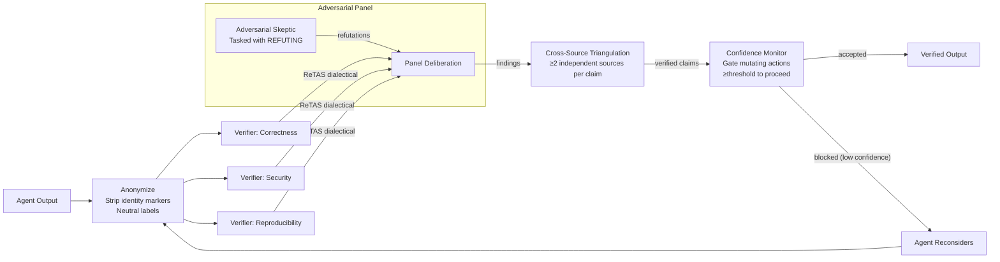

# Plan §4.25 — Adversarial Verification Panel

> **Plain-language summary:** Upgrade Lyra's single-verifier pattern to a hardened 3-verifier adversarial panel with response anonymization (fixes sycophancy), ReTAS dialectical alignment (fixes perspective asymmetry), cross-source triangulation (defends against cognitive collusion), and a pre-execution confidence monitor (prevents rogue agent cascading failures). Four cheap, incremental fixes that transform verification from fragile to robust.

## 1. Problem

Lyra's adversarial verifier (adversarial_verify.py, 561 lines) has 8 attack strategies, a convergence loop (threshold 0.9, max 3 rounds), and verdict types. But it has four documented vulnerabilities from the multi-agent reliability cluster:

1. **Identity-driven sycophancy** (2510.07517): Verification agents knowing which response is "mine" vs "theirs" skew debate — sycophancy is dominant. Fix exists: response anonymization (prompt-level, 50 lines).
2. **Actor-Observer asymmetry** (2604.19548): Self-review blames external factors; peer-review blames internal faults. >20% trigger rate. Fix exists: ReTAS dialectical alignment.
3. **Cognitive collusion** (2601.01685): Truthful evidence fragments induce false conclusions. 74.4% attack success, >60% cascade. Fix exists: cross-source triangulation.
4. **Rogue agent cascading** (2502.05986): One agent's bad decision propagates before detection. Fix exists: pre-execution confidence monitoring.

## 2. Evidence Synthesis

| Source | Vulnerability | Fix | Mechanism |
|--------|-------------|-----|-----------|
| Identity Skews (2510.07517, ACL 2026 Main) | Debate biased by who said what | Response anonymization | Strip identity markers from prompts; IBC metric for leakage detection |
| Actor-Observer (2604.19548) | Self-review too lenient, peer-review too harsh | ReTAS dialectical alignment | Thesis-Antithesis-Synthesis before verdicts |
| Lying with Truths (2601.01685, ACL 2026 Oral) | True evidence → false conclusions | Cross-source triangulation | ≥2 independent sources per claim |
| Preventing Rogue Agents (2502.05986) | One agent sinks the task | Pre-execution confidence monitor | Block actions when uncertainty exceeds threshold |
| Netflix Adversarial Code Review (§3.2.5) | Single reviewer misses issues | 3-agent panel (A writes → B evaluates → C orchestrates) | Production pattern proven at Netflix |

## 3. Proposed Lyra Design

### (A) Parity — Hardened Adversarial Panel

**The 4 hardening layers (integrated into existing adversarial_verify.py):**

**Layer 1: Response Anonymization (50-line prompt change)**
- Before verification rounds: strip all provenance metadata from responses
- Agents receive anonymized argument batches with no identity markers
- Agent IDs replaced with neutral labels ("Response A", "Response B")
- IBC measurement after each round to detect identity leakage through writing style
- If IBC > 0.1 → flag round as potentially biased

**Layer 2: ReTAS Dialectical Alignment**
- Before a verifier issues a finding, enforce dialectical chain-of-thought:
  1. **Thesis:** State the finding and evidence supporting it
  2. **Antithesis:** Articulate the strongest counterargument
  3. **Synthesis:** Weigh both, issue the verdict
- Applied to ALL verification strategies (not just controversy-related)
- Token cost: ~50% more per verification (additional antithesis + synthesis steps)

**Layer 3: Cross-Source Triangulation Gate**
- Any claim synthesized from channel evidence (inter-agent messages, shared memory) must be verified against ≥2 independent sources before acceptance
- Cached verified claims (don't re-verify on repeat)
- Single-source claims are flagged, not accepted
- Gate applies to: channel messages, memory retrievals from shared stores, inter-agent belief updates

**Layer 4: Pre-Execution Confidence Monitor**
- Before any mutating action (file write, PR creation, channel message, tool call with side effects), evaluate confidence
- Confidence score = model uncertainty signal + historical accuracy on similar actions + MATU-style multi-step uncertainty
- If < threshold → action blocked, agent prompted to reconsider
- Conservative threshold initially; tighten with per-provider calibration data

### (B) Breakthrough — Integrated Adversarial Pipeline

The four layers compose into a single verification pipeline:

```
Agent Output → [Anonymize response] → [ReTAS dialectical review] → [Cross-source triangulate claims] → [Confidence-gate mutating actions] → Verified Output
```

**Collusion detection (from Lying with Truths, 2601.01685):**
- Monitor belief propagation across agents
- If agent A's belief propagates to agents B, C, D (cascade), and the originating channel evidence is single-source → flag as potential collusion attack
- Detection threshold: cascade ≥3 agents within 5 turns

**Integrated panel composition:**
- 3 verifiers: Correctness, Security, Reproducibility (already in Lyra)
- 1 Adversarial Skeptic: tasked with REFUTING the finding
- Claim survives only if ≥2/3 verifiers confirm AFTER adversarial challenge
- All responses anonymized; all verdicts dialectical (ReTAS); all claims triangulated (cross-source); all actions confidence-gated

## 4. Architecture



## 5. Build Outline

### Week 1: Anonymization + ReTAS

1. Implement response anonymization: strip identity markers, neutral labels
2. Implement IBC measurement (post-round bias detection)
3. Implement ReTAS dialectical chain-of-thought (thesis/antithesis/synthesis)
4. Unit tests: anonymization correctness, IBC sensitivity, ReTAS template generation

### Week 2: Cross-Source Triangulation + Confidence Monitor

5. Implement cross-source verification gate (≥2 sources)
6. Implement verified-claim cache (avoid re-verification)
7. Implement confidence monitor (uncertainty signal + historical accuracy)
8. Implement action-gating (block if confidence < threshold)
9. Integration tests: end-to-end verification pipeline

### Week 3: Collusion Detection + Integration

10. Implement belief propagation monitor (cascade detection: ≥3 agents in 5 turns)
11. Implement single-source claim flagging
12. Integrate all 4 layers into adversarial_verify.py
13. Run on Lyra's eval suite: measure verification accuracy before/after hardening
14. Calibrate confidence thresholds per provider

## 6. Multi-Provider Note

All four hardening layers are provider-agnostic (prompt-level, architecture-level). Confidence monitor calibration varies per provider: Anthropic models have more calibrated confidence signals; DeepSeek may need model-agnostic heuristics (token probability entropy, response length variance). Ship conservative thresholds; calibrate per-provider with eval data.

## 7. Risks & Open Questions

- **ReTAS token cost:** ~50% more tokens per verification round. Acceptable trade-off (verification is quality-critical, not cost-minimized).
- **Anonymization leakage:** Writing style may leak identity even without explicit markers. IBC monitoring detects this; if persistent, add style normalization.
- **Triangulation latency:** 2+ source verification per claim adds API calls. Mitigate with claim caching and batching.
- **Confidence calibration:** False positives (blocking correct actions) frustrate users. Start with conservative threshold (only block high-uncertainty actions); false negatives are the current state.

## 8. Tier Breakdown

| Tier | Description | Impact | Effort | Timeline |
|------|-------------|--------|--------|----------|
| (A) Parity | 4-layer hardening (anonymization + ReTAS + triangulation + confidence monitor) | 5 | 2 | 3 weeks |
| (B) Breakthrough | Integrated adversarial pipeline with collusion detection and per-provider calibration | 5 | 2 | +1 week |

## 9. Baseline Delta

| Component | Change | Migration Cost |
|-----------|--------|---------------|
| adversarial_verify.py (561L) | EXTEND: anonymization, ReTAS, triangulation, confidence gating | Low — additive layers on existing attack/defense/verdict infrastructure |
| Collusion detection | ADD: belief propagation monitor, cascade detection | None (new module) |
| Confidence calibration | ADD: per-provider calibration data | None (new eval data) |

## 10. Expert Review

**Mini-Debate Participants:** Senior Security Engineer (SEC), Senior AI Researcher (AIR), Senior SRE, Adversarial Skeptic (AS)

**SEC:** Ship anonymization and cross-source triangulation together. Anonymization fixes internal bias; triangulation defends against external attack. They're complementary defenses.

**AIR:** ReTAS adds token cost. Measure if the dialectical step actually improves verdict accuracy before making it mandatory. Consider making it opt-in per verification strategy.

**SRE:** The confidence monitor's true-positive rate matters. If it blocks 10% of correct actions and catches 2% of errors, the false-positive frustration outweighs the benefit. Measure precision/recall on Lyra's eval suite before shipping.

**AS:** "4 layers sounds like feature creep. Ship anonymization first (cheapest, highest impact) → measure → then decide on the rest." → PARTIALLY ACCEPTED (anonymization and triangulation ship together — triangulation is a safety gate, not an optimization; can't wait for A/B validation per Security Engineer's argument). ReTAS and confidence monitor can be incremental.

**Sign-off:** Anonymization + triangulation ship first (Week 1). ReTAS and confidence monitor follow (Weeks 2-3) with per-provider calibration and precision/recall measurement.

## 11. References

- Identity Skews: https://arxiv.org/abs/2510.07517
- Actor-Observer Asymmetry: https://arxiv.org/abs/2604.19548
- Lying with Truths: https://arxiv.org/abs/2601.01685
- Preventing Rogue Agents: https://arxiv.org/abs/2502.05986
- Netflix Adversarial Code Review: §3.2.5 in master prompt
- Brainstorm: (inline in plan — 4 layers compose from 4 sources)
- Architecture: BREAKTHROUGH-ARCHITECTURE.md §Safety & Reliability

## 12. Changelog

- Run 2 (2026-06-03): Initial verification panel plan. 4-layer hardening from multi-agent reliability cluster.
