# RL-Based Skill & Agent Optimizer — Ultra Plan (§4.27)

> Run 2 — June 7, 2026 | Deep-read enhanced: GEP/skill2gep, CODESKILL, EvoQuality, CaTS, GEPA Pareto frontiers, Designing AI Agents validation patterns added. 83 total citations across 13 source techniques.
> Status: Enhanced plan — SkillOpt + GEPA + MetaAgent-X + MemGrad + TF-TTCL + DGM + EvoTest + Misevolve + GEP genes + CODESKILL RL policy + EvoQuality self-consistency + CaTS calibration

## Plain-Language Summary

Lyra's Skill & Agent Optimizer automatically improves skills and agent configurations through iterative refinement loops. A GEPA-style gradient-free prompt evolution generates skill variants, evaluates them on held-out tasks, keeps winners, and mutates them for the next generation. For multi-agent workflows, MetaAgent-X-style Designer+Executor co-evolution via GRPO jointly optimizes the orchestrator and subagents. The optimization is bootstrapped by a TF-TTCL training-free Explore-Reflect-Steer loop that works even with closed-model providers. MemGrad textual gradients convert execution feedback into structured memory updates for retrospective and prospective improvement. GEP/skill2gep compact strategy genes (~230 tokens) replace documentation-heavy skill files, as empirical evidence shows documentation degrades performance (-1.1pp) while compact control objects improve (+3.0pp). CODESKILL's RL-trained skill-management policy provides learnable extraction/evolution/maintenance over the skill bank. EvoQuality's self-consistency voting generates pseudo-labels for RL-based evaluator self-training without ground-truth data. CaTS confidence calibration adaptively allocates optimization compute per query, targeting 94.2% sample savings. All evolved skills pass through a Misevolve-informed safety validator before promotion. Harness-level code changes (DGM-style self-rewriting) are gated for Phase 4 with human-in-the-loop approval.

## 1. Problem

Lyra's current skills are static — authored by hand and never improved automatically. The SkillRegistry has no optimization pipeline, no training loop, no variant selection, and no mechanism for learning from execution feedback. Research shows that skill optimization yields dramatic improvements: SkillOpt delivers +23.5 points over baselines (2605.23904v2), MetaAgent-X achieves 38.33% average (vs 27.16% single agent), and DGM self-improvement raises SWE-bench from 20% to 50%. Further, the GEP/skill2gep study (2604.15097v2, 4,590 trials) demonstrates that the *form* of experience representation matters more than its content — documentation-oriented skills degrade performance (-1.1pp) while compact control-oriented genes improve (+3.0pp). Lyra's current documentation-heavy skill files may actively harm agent performance. CODESKILL (2605.25430v1) shows that SFT-only skill management degrades on OOD tasks (Terminal-Bench 2: 25.88 → 24.71) while RL-based management improves (+8.24). Lyra needs: (1) an optimizer that works with all providers including closed models, (2) learns what constitutes a reusable skill rather than using fixed extraction heuristics, (3) respects safety constraints via evolution-stage validation gates, (4) represents experience as compact control objects rather than verbose documentation, and (5) can evolve both standalone skills and multi-agent workflow configurations.

## 2. Evidence Synthesis

### 2.1 SkillOpt (Microsoft Research + SJTU, arXiv:2605.23904v2, May 2026)

Full training loop for skill optimization:
- Rollout → reflect → aggregate → select → update → evaluate
- Textual learning rate: bounded edits per epoch (cosine schedule Lt=4→2)
- Rejected-edit buffer prevents cyclic edits
- Slow/meta update: epoch-wise update for stability
- Results: best or tied-best on ALL 52 evaluated (model, benchmark, harness) cells
- GPT-5.5: +23.5 points on direct chat, +24.8 on Codex, +19.1 on Claude Code CLI
- **Ablation evidence**: Removing slow/meta update causes catastrophic 22.5-point drop on SpreadsheetBench (Table 3)
- **Rejected buffer ablation**: Without it, -1.6 to -4.6 point loss across benchmarks
- **Training cost**: 20-214M tokens per skill (one-time); median final skill = 920 tokens; 1-4 accepted edits reach deployment
- **Transfers**: Cross-harness SpreadsheetBench skill Codex→Claude Code yields +59.7 points; cross-model retains 82% of in-domain gain
- **Harness-agnostic**: Same optimizer works across direct chat, Codex CLI, and Claude Code CLI via lightweight adapter
- Source: SkillOpt paper §2-3; microsoft/SkillOpt repo MIT License

### 2.2 GEPA (Genetic-Pareto, gepa-ai/gepa, MIT, arXiv:2507.19457)

- LLM-based reflective evolutionary search guided by **Actionable Side Information (ASI)** — diagnostic feedback from execution traces serving as gradient analogue
- Pareto frontiers: tracks candidates that excel on different data subsets, prevents "averaging away" hard-won improvements
- Mini-batch reflection: shows only 3 examples per iteration for focused, tractable optimization steps
- 90x cheaper than Claude Opus 4.1 (open-source models + GEPA); 35x faster than RL (100-500 evals vs 5,000-25,000+ for GRPO)
- 32% → 89% ARC-AGI accuracy via architecture discovery; 55% → 82% coding agent resolve rate on Jinja
- 50+ production deployments at Shopify, Databricks, Dropbox, OpenAI, Google, Microsoft
- Source: GEPA paper + repo deep-read; Section 6 transfer analysis

### 2.3 MetaAgent-X (arXiv 2605.14212)

End-to-end RL for joint Designer+Executor optimization:
- Designer generates multi-agent workflows; Executor runs them
- Hierarchical rollout: M=4 designs x N=4 executions per design
- Stagewise co-evolution: K=30 step alternation between designer/executor phases
- GRPO optimizer, learning rate 5x10^-6
- Qwen3-8B: Average 38.33% (vs single agent 27.16%, +21.7% peak)
- Structure selection: RL learns to route tasks (Reflection 70%+ for hard math, Single agent 55% for easy)

### 2.4 MemGrad (TCS Research, ICLR 2026)

Textual gradients for memory-guided optimization:
- Batched feedback → textual gradients → dual memory (retrospective + prospective)
- Role-based gradient routing via embedding similarity
- AgileCoder on 30 CLI games: MemGrad 48.3% vs AgileCoder 15.3%
- Gradient abstraction prevents prompt bloat
- Token cost: ~0.08 USD extra for significant gains

### 2.5 TF-TTCL (Findings ACL 2026, arXiv:2604.13552)

Training-free test-time contrastive learning:
- Explore-Reflect-Steer loop
- Semantic query augmentation via multi-agent role-playing
- Contrastive experience distillation (good vs bad trajectories → textual rules)
- Contextual rule retrieval at inference
- Frozen LLM throughout — no gradient updates
- Works with any API-only model provider

### 2.6 DGM / DGM-H (Meta, ICLR 2026, arXiv:2505.22954 / arXiv:2603.19461)

Self-improving harness that rewrites own code:
- Iteratively modifies own Python codebase
- Archive-based evolution with parent selection
- SWE-bench: 20% → 50% (+30pp, 2.5x)
- Polyglot: 14.2% → 30.7% (+16.5pp, ~2.16x)
- Model transfer: o3-mini 23→33%, Claude 3.7 Sonnet 19→59.5%
- 2 weeks per run, significant API costs — safe gating essential

### 2.7 EvoTest (ICLR 2026, arXiv:2510.13220)

Two-agent Actor/Evolver for cross-episode learning:
- Actor executes task; Evolver analyzes transcript, proposes revised config
- Four mutations: prompt rewriting, memory updates, hyperparameter tuning, tool-use routines
- Only method to win any games on J-TTL benchmark (Detective, Library)

### 2.8 "Your Agent May Misevolve" (Shao et al., 2025, arXiv:2509.26354)

Critical finding for any self-optimizing system:
- Memory misevolution: refusal rate 99.4% → 54.4% (-45%)
- Tool misevolution: 56-76% unsafe rate on tool creation
- Workflow misevolution: refusal 36.3% → 5.6% (-84.6%)
- Safety stable for 50 rounds, then abruptly collapses at round 60
- Every optimization step must include a safety gate

### 2.9 ADAS / AlphaEvolve

- ADAS (ICLR 2025 Outstanding, arXiv:2408.08435): Meta Agent Search discovers novel agent designs in Turing Complete search space
- AlphaEvolve (DeepMind, May 2025): Evolutionary coding with Flash/Pro ensemble
- Data Center Scheduling: 0.7% of Google's worldwide compute savings from AlphaEvolve optimizations
- Both demonstrate that automated discovery can surpass human-designed agents

### 2.10 GEP / skill2gep (EvoMap / Tsinghua, arXiv:2604.15097v2, June 2026, 4,590 trials)

**Strategy Genes**: Compact control-oriented experience objects (~230 tokens) vs documentation skills (~2,500 tokens):
- Gene schema: `g = (m, u, π, α, c, v)` — matching signals, summary, strategy steps, AVOID cues, constraints, validation hooks
- GEP loop: SCAN → SIGNAL → INTENT → MUTATE → VALIDATE → SOLIDIFY
- Three-layer hierarchy: Genes (atomic), Capsules (validated paths with audit trail), Events (immutable evolution log)

**Key empirical findings (Table 1, 4,590 trials):**
- Genes (+3.0pp) vs Skills (-1.1pp) over no-guidance at 10x fewer tokens — documentation *degrades* performance
- Skill-Overview section alone: -4.7pp (most documentation is harmful — Table 12)
- Structure is essential: structured genes beat flattened prose by +3.5pp (Table 6)
- Failure encoded as compact warnings (+4.6pp) outperforms additive history accumulation (Table 7)
- **Critical risk**: Two complementary genes collapse to 44.9% (-6.1pp vs no-guidance) — multi-gene composition is unsolved (Table 4)
- Evolver daemon on CritPt: 9.1% → 18.57% (Feb) → 27.14% (Mar) — ~$0.81 per run, 32.1x cheaper than reported benchmark cost
- **Design basis**: EvoMap/evolver repo (production daemon: singleton lock, suicide-respawn, 45min cycle timeout, 500MB RSS cap, git-integrated rollback); EvoMap/skill2gep spec

### 2.11 CODESKILL (NTU, arXiv:2605.25430v1, May 2026)

**Learnable skill-management policy M_θ** optimized via GRPO for a frozen coding agent:
- Multi-granularity skill bank: task-level (high-level strategies) + event-driven (local recurring patterns)
- Three operations: Extraction (trajectory → new skill), Evolution (existing skill ← new evidence), Maintenance (add/merge/drop)
- Hybrid reward: R(u) = λ·R_Q + R_A · R_E where R_A (alignment factor) gates execution reward by checking if agent followed the skill
- Three-stage curriculum: extraction only → +evolution → +maintenance

**Key results:**
- CODESKILL vs no-skill: +9.69 avg pass rate (+32.8% relative) across 4 coding benchmarks
- CODESKILL vs strongest prompt-based baseline: +4.01 (+11.4% relative)
- RL vs SFT-only: +4.72 (+13.7% relative) — SFT-only degrades on OOD Terminal-Bench 2 (25.88→24.71)
- Full lifecycle maintenance shrinks bank by 46% (1252→676) with only ~2% pass rate cost
- RL policy transfers to unseen coding policy GPT-5.4-mini: +8.93 (+41% relative)
- 20.3% fewer reasoning steps needed (44.12 → 35.15)
- **Training cost**: ~230 GPU-hours on 4×H100; teacher: GPT-5.4-mini producing 12,856 SFT examples; backbone: Qwen3.5-4B LoRA

### 2.12 EvoQuality (CityU HK + ByteDance, ICLR 2026, arXiv:2509.25787v4)

**Self-supervised framework** for iterative refinement without any ground-truth labels:
- Stage 1: Self-consistency majority voting (K=32) generates pairwise pseudo-labels
- Stage 2: GRPO with fidelity reward (Bhattacharyya coefficient) measuring alignment between predicted and pseudo-label distributions
- Ranking-based (not regression-based) evolution: regression stalls after Round 1, ranking continues improving

**Key results:**
- +31.8% WAVG PLCC gain across 8 IQA benchmarks; +46.2% on PIPAL
- Outperforms ALL supervised VLM models on OOD generalization (WAVG 0.762 vs 0.704) without using any labels
- K=32 voting budget required for stability; K=8 shows significant degradation (Figure 3)
- **Relevance to Lyra**: Self-consistency voting can generate pseudo-labels for RL-based evaluator self-training on subjective tasks (code quality ranking, response scoring, hallucination detection)

### 2.13 CaTS (Calibrated Test-Time Scaling, ICLR 2026)

**Self-calibrated confidence** for adaptive compute allocation:
- Self-Calibration: LoRA fine-tuning with Soft Self-Consistency (SSC) labels — no human labels needed
- CaTS-SC: confidence-weighted majority voting
- CaTS-ES: early stopping when response meets confidence threshold
- Theoretical guarantee (Theorem 5): exponential dominance over vanilla majority voting under two-tier confidence mixture

**Key results:**
- 94.2% sample savings to reach same accuracy on MathQA (Llama-3.1-8B)
- Self-calibrated confidence matches or beats separate reward model at ~10 extra tokens per response vs doubling inference cost
- Works across 3 model architectures (Llama, Qwen, DeepSeek), 9+ datasets
- Training: LoRA fine-tuning, single epoch, ~100K samples
- **Relevance to Lyra**: Adaptive compute allocation for optimization rollouts; reduces cost by allocating more samples to hard tasks, fewer to easy ones

### 2.14 Convergence: Validation Gates Are Non-Negotiable (Synthesis §3)

Multiple independent sources agree:
- SkillOpt (Microsoft, 2026): Held-out D_sel strictly gates every candidate; ties rejected to prevent silent drift; rejected-edit buffer provides zero-cost negative feedback
- CODESKILL (NTU, 2026): Hybrid reward R_A gates execution reward by checking if agent actually followed skill — solves credit assignment
- EvoQuality (ICLR 2026): Fidelity reward via Bhattacharyya coefficient; regression-based evolution without gate stalls in one round
- GEP Evolver (EvoMap, 2026): VALIDATE stage runs sandboxed execution before SOLIDIFY; failed cycles roll back via git
- Designing AI Agents (Manning, 2026, Chapter 2): "Agent architecture is bounded resource allocation under uncertainty" — verification is the harness's primary role; "never triage away failure information"

### 2.15 Convergence: Compact Structured Representations Outperform Verbose Docs (Synthesis §3)

- GEP paper: Genes (+3.0pp) at 230 tokens; Skills (-1.1pp) at 2,500 tokens; Skill-Overview alone is -4.7pp (2604.15097v2)
- SkillOpt: Final skills median 920 tokens; only 1-4 accepted edits reach deployment; unbounded rewrites erase useful rules (2605.23904v2)
- CODESKILL: Multi-granularity bank with maintenance shrinks bank by 46% with only ~2% cost (2605.25430v1)
- CaTS: ~10 extra tokens enable confidence-weighted voting saving 94.2% samples (ICLR 2026)
- Designing AI Agents (Manning, 2026, Chapter 3): "A mediocre model with a well-curated 30K-token context outperforms the best model drowning in 180K tokens of noise"

### 2.16 Convergence: Training-Free Ceiling vs Training-Based Gains (Synthesis §3)

- ReasoningBank: +20.5% SR improvement (all prompt-based) — ceiling limited by prompt quality and retrieval accuracy
- CFGM: +10.4pp on AlfWorld (all prompt-based) — ceiling limited by LLM reasoning quality
- Multi-Agent Debate: +7.05% accuracy (inference-only); dead loops at >1 round — further rounds produce zero or negative gain
- SkillOpt: +23.5 avg (training-based); outperforms all prompt-based baselines
- CODESKILL: SFT-only +4.72 avg; RL adds another +4.72; SFT-only degrades on OOD (2605.25430v1)
- GEP paper: Representation (control-oriented vs documentation-oriented) is the first-order factor, not training — genes (+3.0pp) outperform skills (-1.1pp) without training

## 3. Proposed Lyra Design

### 3.1 Optimizer Architecture

```mermaid
%%{init: {'theme': 'base', 'themeVariables': {
  'primaryColor': '#7c3aed',
  'primaryTextColor': '#e2e8f0',
  'primaryBorderColor': '#a78bfa',
  'lineColor': '#818cf8',
  'secondaryColor': '#1e293b',
  'tertiaryColor': '#0f172a',
  'background': '#0d0d1a',
  'mainBkg': '#1e293b',
  'nodeBorder': '#6366f1',
  'clusterBkg': '#111827',
  'clusterBorder': '#4f46e5',
  'titleColor': '#c084fc',
  'edgeLabelBackground': '#1e293b',
  'nodeTextColor': '#e2e8f0',
  'fontSize': '14px'
}}}%%
graph TB
    subgraph "Input Sources"
        SessionLogs[Session Logs<br/>Trajectories + Outcomes]
        SkillRegistry[SkillRegistry<br/>Current Skills]
        WorkflowConfigs[Workflow Configs<br/>Agent Topologies]
    end
    
    subgraph "Optimization Pipeline"
        subgraph "Layer 0: Experience Encoding (GEP Genes)"
            E0[Distill Traces → Compact Genes<br/>~230 tokens: m,u,π,α,c,v]
            E1[Validation Hooks<br/>Sandboxed Gene Execution]
            E2[Solidify → Capsule + Event Log]
        end

        subgraph "Layer 1: Training-Free (TF-TTCL)"
            TTF1[Explore<br/>Semantic Query Augmentation]
            TTF2[Reflect<br/>Contrastive Distillation]
            TTF3[Steer<br/>Rule Injection at Inference]
        end
        
        subgraph "Layer 2: Gradient-Free (GEPA/SkillOpt)"
            GF1[Generate Variants<br/>Bounded Edits per Epoch]
            GF2[Rollout + Evaluate<br/>Held-Out Task Suite]
            GF3[Select Winners<br/>Rejected-Edit Buffer]
            GF4[Mutate → Repeat<br/>Textual Learning Rate]
        end
        
        subgraph "Layer 3: RL-Based (MetaAgent-X / CODESKILL)"
            RL1[Designer<br/>Generate Workflow Structure]
            RL2[Executor<br/>Run Workflow with Rollouts]
            RL3[Joint Credit Assignment<br/>Hierarchical GRPO]
            RL4[Stagewise Co-Evolution<br/>K=30 Alternation]
        end
        
        subgraph "Layer 4: Textual Gradients (MemGrad)"
            MG1[Feedback Decomposition<br/>Loss → Feedback Pairs]
            MG2[Role-Based Routing<br/>Embedding Similarity]
            MG3[Gradient Abstraction<br/>Compress → Apply]
            MG4[Dual Memory Update<br/>Retrospective + Prospective]
        end
    end
    
    subgraph "Safety Gate (Misevolve-Informed)"
        SG1[Safety Evaluation<br/>Baseline vs Evolved]
        SG2[Confidence Check<br/>Regression Detection]
        SG3[Human Review Gate<br/>For Harness Changes]
    end
    
    subgraph "Output"
        EvolvedGene[Evolved Genes<br/>Compact Strategy Objects]
        EvolvedSkill[Evolved Skills<br/>SKILL.md + Scripts]
        EvolvedWorkflow[Evolved Workflows<br/>Optimized Topologies]
        EvolvedPrompt[Evolved Prompts<br/>System + Agent Prompts]
    end
    
    SessionLogs --> E0
    E0 --> TTF1
    SkillRegistry --> GF1
    WorkflowConfigs --> RL1
    
    TTF3 --> SessionLogs
    
    GF4 -->|Iterate| GF1
    RL4 -->|Iterate| RL1
    
    GF4 --> SG1
    RL4 --> SG1
    MG4 --> SG1
    
    SG1 -->|Pass| EvolvedGene
    SG1 -->|Pass| EvolvedSkill
    SG1 -->|Pass| EvolvedWorkflow
    SG1 -->|Pass| EvolvedPrompt
    
    SG1 -->|Fail| Revert[Revert to Previous Version]
    SG1 -->|Harness Change| HumanReview[Human Review Required]
    HumanReview -->|Approve| EvolvedSkill
    HumanReview -->|Reject| Revert
    
    subgraph "Phase 4 Only (DGM/ADAS)"
        DGM[Harnes Self-Rewriting<br/>Codebase Mutation]
        DGM --> HumanReview
    end
```



### 3.2 Experience Encoding — GEP-Style Strategy Genes

```python
@dataclass
class StrategyGene:
    """Compact control-oriented experience object (~230 tokens).
    
    GEP/skill2gep schema (arXiv:2604.15097v2): g = (m, u, π, α, c, v)
    """
    matching_signals: list[str]       # m: Keywords/trigger cues for retrieval
    summary: str                       # u: One-sentence compact summary
    strategy_steps: list[str]          # π: Small set of strategic steps
    avoid_cues: list[str]              # α: Failure-aware AVOID cues
    constraints: list[str]             # c: Optional execution constraints
    validation_hooks: list[str]        # v: Validation checks for sandboxed execution
    
    # Evolution metadata
    parent_gen_id: Optional[str] = None
    capsule_refs: list[str] = field(default_factory=list)  # C in GEP hierarchy
    event_log: list[str] = field(default_factory=list)     # E in GEP hierarchy

class GeneDistillationPipeline:
    """Convert execution traces to compact genes.
    
    Empirical basis (2604.15097v2, 4,590 trials):
    - Genes (+3.0pp) vs Skills (-1.1pp) — documentation degrades
    - Failure warnings only (+4.6pp) beats additive history
    - Structure (+3.5pp) beats flattened prose
    """
    
    async def distill(self, trajectory: Trajectory, existing_genes: list[StrategyGene]) -> StrategyGene:
        """Distill trajectory into compact gene following GEP SCAN→SIGNAL→INTENT pipeline."""
        # SCAN: Extract failure/success patterns from trajectory
        scan_result = await self._scan(trajectory)
        
        # SIGNAL: Convert to standardized protocol signals
        signal = await self._signal(scan_result)
        
        # INTENT: Determine evolution objective (repair/optimization/extension)
        intent = await self._determine_intent(signal, existing_genes)
        
        # Generate compact gene (m, u, π, α, c, v) — target ~230 tokens
        gene = await self._generate_gene(trajectory, signal, intent)
        
        return gene
```

### 3.3 Training-Free Optimization (TF-TTCL Layer)

```python
class TrainingFreeOptimizer:
    """Explore-Reflect-Steer loop for skill improvement.
    
    No model weight updates — all adaptation through in-context rule injection.
    Works with any provider including API-only closed models.
    Based on TF-TTCL (arXiv:2604.13552) and ReflectionBank (Google, 2025)
    """
    
    # Contrastive experience distillation threshold (ReasoningBank, §4.2)
    MIN_GOOD_BAD_TRAJECTORIES = 2
    
    async def explore(self, skill: Skill, n_variants: int = 5) -> list[SkillVariant]:
        """Generate diverse skill variants via multi-agent role-playing."""
        # Semantic query augmentation (TF-TTCL Explore stage)
        variants = []
        for _ in range(n_variants):
            variant = await self.llm.chat([
                {"role": "system", "content": f"Generate a variant of the following skill. "
                                              f"Change the approach, add new perspectives, "
                                              f"or restructure the instructions. Keep it executable."},
                {"role": "user", "content": skill.content}
            ])
            variants.append(SkillVariant(content=variant.content, parent_skill_id=skill.id))
        return variants
    
    async def reflect(self, trajectories: list[Trajectory]) -> list[str]:
        """Contrast good vs bad trajectories → extract textual rules.
        
        ReasoningBank finding (Google, 2025): +3.2 SR from adding failure extraction.
        GEP finding (arXiv:2604.15097v2): failure warnings (+4.6pp) beats additive history.
        """
        good = [t for t in trajectories if t.outcome == Outcome.SUCCESS]
        bad = [t for t in trajectories if t.outcome == Outcome.FAILURE]
        
        if len(good) < self.MIN_GOOD_BAD_TRAJECTORIES or len(bad) < self.MIN_GOOD_BAD_TRAJECTORIES:
            return []
        
        # Contrastive distillation: identify what separates success from failure
        rules = await self.llm.chat([
            {"role": "system", "content": "Compare successful and failed trajectories. "
                                          "Extract 3-5 actionable rules that distinguish them. "
                                          "Rules should be specific and transferable to new tasks. "
                                          "Prefer compact failure warnings over additive history."},
            {"role": "user", "content": f"Good: {json.dumps([g.summary for g in good[:3]])}\n"
                                        f"Bad: {json.dumps([b.summary for b in bad[:3]])}"}
        ])
        
        return self._parse_rules(rules.content)
    
    async def steer(self, task: str, rules: list[str]) -> str:
        """Inject relevant rules into context at inference time."""
        matching_rules = [r for r in rules if self._matches_task(r, task)]
        if not matching_rules:
            return task
        
        return f"{task}\n\nRelevant guidelines from prior experience:\n" + \
               "\n".join(f"- {r}" for r in matching_rules[:5])
```

### 3.4 Gradient-Free Optimization (GEPA/SkillOpt Layer)

```python
@dataclass
class SkillOptimizerConfig:
    """Configuration for the gradient-free skill optimizer.
    
    SkillOpt defaults (arXiv:2605.23904v2):
    - epochs=10, batch_size=40, minibatch=8, Lt=4 cosine→2
    - GEPA defaults (gepa-ai/gepa): minibatch=3, Pareto frontier mode
    """
    epochs: int = 10
    variants_per_epoch: int = 5
    rollouts_per_variant: int = 3
    batch_size: int = 40                    # SkillOpt default
    minibatch_size: int = 8                 # Bm=8: minibatches expose reusable patterns
    textual_learning_rate: int = 4          # Lt=4, cosine-decayed to 2
    rejected_buffer_size: int = 10
    holdout_ratio: float = 0.3
    validation_gate: bool = True
    validation_gate_strict: bool = True     # Ties rejected — no silent drift
    
    # GEPA-inspired Pareto tracking
    pareto_frontier: bool = True            # Track per-instance Pareto frontiers
    pareto_frontier_type: str = "instance"  # Preserve specialists on different task subsets
    
    # AlphaEvolve-like ensemble for exploration vs refinement
    explorer_model: str = "haiku"           # Cheap model for broad exploration
    refiner_model: str = "sonnet"           # Strong model for deep refinement

class GradientFreeOptimizer:
    """Full training loop for skill optimization (SkillOpt ReflACT architecture).
    
    rollout → reflect → aggregate → select → update → evaluate
    Validation gate: accept only if strict improvement (SkillOpt §3.5)
    Rejected-edit buffer provides negative feedback at zero inference cost.
    """
    
    def __init__(self, skill_registry: SkillRegistry, config: SkillOptimizerConfig):
        self.registry = skill_registry
        self.config = config
        self.rejected_edits: list[Edit] = []
        self.pareto_frontier: dict[str, dict] = {}  # GEPA-inspired per-instance tracking
    
    async def optimize(self, skill_id: str, task_suite: list[Task]) -> OptimizedSkill:
        """Run full optimization loop on a single skill."""
        skill = self.registry.get_skill(skill_id)
        # SkillOpt data split: D_train (rollout), D_sel (validation gate), D_test (final)
        train_tasks, eval_tasks = self._split_holdout(task_suite)
        gate_tasks, test_tasks = self._split_gate(eval_tasks)
        
        best_score = await self._evaluate(skill, gate_tasks)
        best_variant = skill
        
        for epoch in range(self.config.epochs):
            # 1. Rollout: Execute batch of episodes (B=40 default)
            #    SkillOpt finding: single-trajectory analysis → anecdotal fixes
            #    Minibatches (Bm=8) → reusable procedural errors
            rollout_results = await self._rollout(skill, train_tasks, self.config.batch_size)
            
            # 2. Reflect: Group failures, partition into minibatches
            failures = [r for r in rollout_results if not r.success]
            
            # 3. Generate variants via GEPA-style ASI mutation
            variants = []
            for _ in range(self.config.variants_per_epoch):
                edit_candidates = await self._propose_edits(skill, train_tasks, failures)
                # Filter against rejected-edit buffer
                valid = [e for e in edit_candidates if e not in self.rejected_edits]
                if valid:
                    variant = await self._apply_edits(skill, valid[:self.config.textual_learning_rate])
                    variants.append(variant)
            
            # 4. Evaluate each variant on validation gate (D_sel)
            #    Strict gate: accepted only when score_cand > score_cur
            scores = {}
            for variant in variants:
                variant_score = await self._evaluate(variant, gate_tasks)
                scores[variant.id] = variant_score
            
            # 5. Select winner via Pareto frontier (GEPA) or simple max (SkillOpt)
            if self.config.pareto_frontier:
                winner_variant, winner_score, _ = self._pareto_select(variants, scores)
            else:
                winner_id = max(scores, key=scores.get)
                winner_score = scores[winner_id]
                winner_variant = {v.id: v for v in variants}[winner_id]
            
            # 6. Gate: accept only if strict improvement
            if winner_score <= best_score:
                # Record rejected edits for negative feedback (SkillOpt §3.5)
                for variant in variants:
                    edits = await self._extract_edits(skill, variant)
                    self.rejected_edits.extend(edits)
                continue
            
            # 7. Accept: update best
            best_score = winner_score
            best_variant = winner_variant
            skill = winner_variant
            
            # Log epoch
            await self._log_epoch(epoch, best_score, winner_variant.id)
        
        # 8. Final test on D_test for reporting only
        test_score = await self._evaluate(best_variant, test_tasks)
        
        return OptimizedSkill(
            original_id=skill_id,
            new_content=best_variant.content if not self.config.pareto_frontier 
                         else self._serialize_pareto_set(),
            epochs_run=self.config.epochs,
            final_score=best_score,
            improvement=best_score - (await self._evaluate(
                self.registry.get_skill(skill_id), gate_tasks
            )),
        )
```

### 3.5 RL-Based Optimization (MetaAgent-X / CODESKILL Layer)

```python
@dataclass
class RLOptimizerConfig:
    """Configuration for RL-based skill management + workflow optimization.
    
    MetaAgent-X defaults (arXiv:2605.14212):
    - M=4 designs, N=4 executions, K=30 alternation
    - GRPO, lr=5×10^-6
    
    CODESKILL defaults (arXiv:2605.25430v1):
    - Group size G=6 for GRPO
    - Hybrid reward R = λ·R_Q + R_A·R_E, λ=0.25
    - Three-stage curriculum: extraction → +evolution → +maintenance
    """
    meta_agent_x_enabled: bool = False  # Gate: requires training infra
    codeskill_enabled: bool = False     # Gate: requires RL training infra
    
    # MetaAgent-X workflow optimization
    designs_per_query: int = 4          # M=4
    executions_per_design: int = 4      # N=4
    stagewise_alternation: int = 30     # K=30
    grpo_learning_rate: float = 5e-6
    
    # CODESKILL skill management
    group_size: int = 6                 # G=6 GRPO group size
    quality_reward_weight: float = 0.25 # λ=0.25
    alignment_gate: bool = True         # R_A gates execution reward
    curriculum_stages: int = 3          # extraction → +evolution → +maintenance
    maintenance_enabled: bool = True    # add/merge/drop operations
    maintenance_shrink_target: float = 0.5  # Target 50% bank reduction (CODESKILL: 46%)

class SkillManagementOptimizer:
    """CODESKILL-style learnable skill-management policy (arXiv:2605.25430v1).
    
    Replaces Lyra's fixed-prompt extraction heuristics with an RL-optimized
    policy that learns what constitutes a reusable skill from downstream
    agent execution feedback.
    """
    
    def __init__(self, config: RLOptimizerConfig):
        self.config = config
        self.skill_bank: SkillBank = SkillBank()
        self.management_policy = self._init_policy()  # Small LoRA model
        self.no_skill_baselines: dict[str, float] = {}  # Pre-cached baselines
    
    async def manage_skill_bank(self, trajectories: list[Trajectory]) -> SkillBankDelta:
        """Run CODESKILL lifecycle on skill bank from new trajectories."""
        # 1. Extraction: Trajectory → new skill candidates
        for traj in trajectories:
            operation = await self._extract(traj)
            if operation.action == "skip":
                continue
            candidate = self._apply_operation(operation)
            
            # 2. Evolution: Compare candidate against existing skills
            evolution_op = await self._evolve(candidate, self.skill_bank)
            if evolution_op.action != "skip":
                candidate = self._apply_operation(evolution_op)
            
            # 3. Maintenance: Add/Merge/Drop against existing bank
            if self.config.maintenance_enabled:
                maint_op = await self._maintain(candidate, self.skill_bank)
                self._apply_maintenance(maint_op, self.skill_bank)
            else:
                self.skill_bank.add(candidate)
        
        # Track bank size
        return SkillBankDelta(
            new_size=len(self.skill_bank),
            shrinkage=1 - (len(self.skill_bank) / self.skill_bank.max_size)
            if self.skill_bank.max_size > 0 else 0.0,
        )
    
    async def _compute_execution_reward(self, skill, eval_task) -> float:
        """CODESKILL hybrid reward: R_E = V(τ) - b_π(x).
        
        b_π(x): pre-cached no-skill baseline from n=4 rollouts.
        """
        baseline = self.no_skill_baselines.get(eval_task.id, 0.0)
        skill_result = await self._rollout(skill, eval_task)
        return skill_result.score - baseline
```

### 3.6 Textual Gradient Optimization (MemGrad Layer)

```python
class TextualGradientOptimizer:
    """MemGrad-style textual gradients for memory-guided optimization.
    
    Batched feedback → TextGrad decomposition → Role-based routing
    → Abstraction → Retrospective + Prospective memory update
    (MemGrad, TCS Research, ICLR 2026)
    """
    
    async def optimize_prompt(self, agent: Agent, feedback_batch: list[Feedback]) -> str:
        """Optimize agent prompt via textual gradients."""
        # 1. Decompose feedback into (Loss, gradient) pairs
        pairs = []
        for fb in feedback_batch:
            loss = await self._compute_textloss(fb.trajectory, fb.expected)
            gradient = await self._compute_textgrad(loss)
            pairs.append((loss, gradient))
        
        # 2. Role-based gradient routing
        role_routed = defaultdict(list)
        for loss, gradient in pairs:
            role = await self._assign_role(gradient)
            role_routed[role].append(gradient)
        
        # 3. Abstract gradients per role (prevent prompt bloat)
        abstracted = {}
        for role, gradients in role_routed.items():
            abstracted[role] = await self._abstract(gradients)
        
        # 4. Compute prompt-level gradient
        prompt_gradient = await self._compute_prompt_gradient(abstracted, agent.system_prompt)
        
        # 5. Update retrospective memory (failure patterns) and prospective memory (fixes)
        retrospective = abstracted.get("failure_patterns", [])
        prospective = abstracted.get("fixes", [])
        await self.memory.retrospective.extend(retrospective)
        await self.memory.prospective.extend(prospective)
        
        # 6. Apply gradient to system prompt  
        updated_prompt = await self._apply_gradient(agent.system_prompt, prompt_gradient)
        
        return updated_prompt
```

### 3.7 Safety Validator (Misevolve-Informed Gate)

```python
class OptimizationSafetyValidator:
    """Misevolve-informed safety gate for all optimization.
    
    Every evolved skill must pass safety checks before promotion.
    Baseline safety score vs evolved score comparison.
    Validated by Misevolve findings (arXiv:2509.26354):
    - Safety stable for 50 rounds, then abruptly collapses at round 60
    - Every optimization step must include a safety gate
    
    Designing AI Agents (Manning, 2026, Chapter 2):
    "The safety validator must be a separate, immutable service that
    the optimization layer cannot modify."
    """
    
    SAFETY_DEGRADATION_THRESHOLD = 0.05  # 5% max degradation allowed
    MISE_VOLVE_SAFETY_WINDOW = 50        # Re-evaluate safety every 50 evolutions
    evolution_counter: int = 0
    
    async def validate(self, skill: Skill, evolved: EvolvedOutput) -> ValidationResult:
        """Validate that an evolved skill is safe to promote."""
        self.evolution_counter += 1
        
        # 1. Baseline safety evaluation
        baseline_score = await self._evaluate_safety(skill)
        
        # 2. Evolved safety evaluation  
        evolved_score = await self._evaluate_safety(evolved.content)
        
        # 3. Compare — strict gate (ties rejected)
        degradation = baseline_score - evolved_score
        if degradation > self.SAFETY_DEGRADATION_THRESHOLD:
            return ValidationResult(
                approved=False,
                reason=f"Safety degradation: {baseline_score:.2f} → {evolved_score:.2f} ({degradation:.2f})",
                recommendation="Revert to pre-evolution version. Consider constrained mutation.",
                confidence=0.9,
            )
        
        # 4. Misevolve-specific checks — detect abrupt collapse patterns
        misevolve_risk = await self._check_misevolution_patterns(evolved.content)
        if misevolve_risk.risk_score > 0.5:
            return ValidationResult(
                approved=False,
                reason=f"Misevolution risk detected: {misevolve_risk.pattern}{misevolve_risk.detail}",
                recommendation="Review evolution trajectory for reward hacking or heuristic ossification.",
                confidence=misevolve_risk.confidence,
            )
        
        # 5. Periodic full re-evaluation (Misevolve collapse window)
        if self.evolution_counter % self.MISE_VOLVE_SAFETY_WINDOW == 0:
            comprehensive = await self._comprehensive_safety_audit(evolved.content)
            if not comprehensive.passed:
                return ValidationResult(
                    approved=False,
                    reason=f"Comprehensive re-evaluation failed at evolution #{self.evolution_counter}",
                    recommendation="Full safety audit required before continuing evolution.",
                    confidence=0.95,
                )
        
        return ValidationResult(approved=True)
```

### 3.8 Data Model

```python
@dataclass
class OptimizerConfig:
    """Top-level optimizer configuration."""
    training_free_enabled: bool = True
    gradient_free_enabled: bool = True
    gep_gene_encoding_enabled: bool = True    # GEP compact genes (arXiv:2604.15097v2)
    codeskill_enabled: bool = False            # RL skill management (arXiv:2605.25430v1)
    rl_based_enabled: bool = False             # Gate for RL (requires training infra)
    textual_gradient_enabled: bool = False     # Gate (requires feedback pipeline)
    harness_rewriting_enabled: bool = False    # Phase 4 only
    
    # CaTS adaptive compute allocation (ICLR 2026)
    adaptive_budget_enabled: bool = True       # Confidence-based sample allocation
    sample_savings_target: float = 0.5        # Target 50% sample reduction
    
    # Default budgets
    max_daily_optimization_cost: float = 5.0
    max_epochs_per_skill: int = 10
    max_concurrent_optimizations: int = 2
    
    # Routing
    explorer_model: str = "haiku"       # Cheap model for broad exploration
    refiner_model: str = "sonnet"       # Strong model for deep refinement
    safety_model: str = "opus"          # Most capable model for safety checks

@dataclass
class OptimizationResult:
    optimizer_type: OptimizerType       # TF_FREE | GRADIENT_FREE | RL | TEXTUAL_GRAD | GENE_DISTILL
    skill_id: str
    epochs_run: int
    final_score: float
    improvement: float
    total_cost: float
    safety_check: ValidationResult
    output_artifact: str                # New skill content, gene, or workflow config

class OptimizerType(Enum):
    TF_FREE = "training_free"
    GRADIENT_FREE = "gradient_free"
    RL = "rl_based"
    TEXTUAL_GRAD = "textual_gradient"
    GENE_DISTILL = "gene_distill"       # GEP/skill2gep representation

@dataclass
class OptimizationMetrics:
    """Key metrics for optimizer dashboard."""
    total_optimizations: int
    skills_optimized: int
    avg_improvement: float
    success_rate: float                 # % optimizations that improved score
    safety_block_rate: float            # % blocked by safety validator
    avg_cost_per_optimization: float
    avg_epochs_per_skill: float
    total_cost_all: float
    rejected_edits_count: int
    gene_bank_size: int                 # Number of compact genes in bank
    maintenance_shrinkage: float        # CODESKILL-style bank shrinkage %
    sample_efficiency: float            # CaTS-inspired samples saved %
```

### 3.9 Optimization Scheduling

```mermaid
%%{init: {'theme': 'base', 'themeVariables': {
  'primaryColor': '#7c3aed',
  'primaryTextColor': '#e2e8f0',
  'primaryBorderColor': '#a78bfa',
  'lineColor': '#818cf8',
  'secondaryColor': '#1e293b',
  'tertiaryColor': '#0f172a',
  'background': '#0d0d1a',
  'mainBkg': '#1e293b',
  'nodeBorder': '#6366f1',
  'clusterBkg': '#111827',
  'clusterBorder': '#4f46e5',
  'titleColor': '#c084fc',
  'edgeLabelBackground': '#1e293b',
  'nodeTextColor': '#e2e8f0',
  'fontSize': '14px'
}}}%%
flowchart LR
    A[New Session Logs Available] --> B{Logs >= N?}
    B -->|No| Wait[Wait]
    B -->|Yes| C[GEP Distill: Traces → Compact Genes]
    C --> D{Confidence ≥ τ?}<br/>[CaTS Adaptive Budget]
    D -->|Yes| E[TF-TTCL: Extract Rules<br/>Contrastive Distillation]
    D -->|No| F[Allocate More Samples<br/>Higher Confidence Needed]
    E --> G[Check: Skill Performance Degraded?]
    F --> G
    G -->|Yes| H[Gradient-Free: Optimize Skill<br/>SkillOpt ReflACT Loop]
    G -->|No| I[Check: Budget Available?]
    H --> I
    I -->|No| J[Defer to Next Idle Window]
    I -->|Yes| K{Skill Type?}
    K -->|Standalone| L[Gradient-Free Loop<br/>5-10 Variants, 3 Rollouts]
    K -->|Workflow| M[RL-Based Loop<br/>M=4 Designs, N=4 Executions]
    L --> N[CODESKILL Maintenance:<br/>Add/Merge/Drop Skills]
    M --> N
    N --> O[Safety Validator<br/>Misevolve-Informed Gate]
    O -->|Pass| P[Promote to Registry]
    O -->|Fail| Q[Revert + Log]
```

## 4. Build Outline

### Phase 1: Training-Free Optimization + Gene Encoding (weeks 1-2)

1. **Explore-Reflect-Steer loop** — TF-TTCL pipeline: semantic query augmentation, contrastive experience distillation, contextual rule retrieval and injection
2. **GEP-style gene distillation** — Implement compact gene schema `(m, u, π, α, c, v)` at ~230 tokens; SCAN→SIGNAL pipeline for trace-to-gene conversion (EvoMap/skill2gep spec)
3. **Rule extraction from session logs** — Parse session trajectories; classify as success/failure; contrastive comparison → textual rules; **failure warnings only** format (+4.6pp advantage per GEP paper)
4. **Rule injection at inference** — Match rules to current task via embedding similarity; inject top-K rules into agent context
5. **Basic optimizer command** — `lyra optimize skill <id>` — runs one optimization cycle; reports improvement score

**Dependencies:** §4.2 memory store (Experience tier), §4.5 model router
**Evidence base:** TF-TTCL (arXiv:2604.13552), GEP/skill2gep (arXiv:2604.15097v2), ReasoningBank (Google, 2025)

### Phase 2: Gradient-Free Skill Optimization (weeks 3-6)

1. **GEPA/SkillOpt loop** — Generate variants → rollout → evaluate → select → mutate → repeat
2. **Bounded-edit engine** — Textual learning rate implementation (cosine schedule Lt=4→2); mutation operators (add/delete/replace sections); rejected-edit buffer (SkillOpt §3.5)
3. **Held-out evaluation with strict gate** — Split task suite into D_train/D_sel/D_test; per-variant rollout with score aggregation; **strict gate** (ties rejected) prevents silent drift
4. **Slow/meta update** — Cross-epoch comparison (SkillOpt §3.6); protected slow-update section preventing catastrophic regression (-22.5pp without it, SkillOpt Table 3)
5. **Skill variant generation** — Use refiner model (Sonnet) to analyze failures via minibatch reflection (Bm=8); explorer model (Haiku) for cheap broad search
6. **GEPA Pareto tracking** — Per-instance Pareto frontiers preserving specialized candidates on different task subsets
7. **Optimization dashboard** — Track epoch scores, cumulative improvement, cost per epoch; comparison view (old vs new)

**Dependencies:** Phase 1, SkillRegistry (§4.4)
**Evidence base:** SkillOpt (arXiv:2605.23904v2, 52/52 dominance), GEPA (gepa-ai/gepa, Pareto frontiers)

### Phase 3: MemGrad + Safety + CaTS Calibration (weeks 7-9)

1. **Textual gradient pipeline** — Feedback decomposition → TextGrad loss → gradient routing by role → abstraction → retrospective/prospective memory
2. **Dual memory for optimization** — Retrospective store (failure patterns) + Prospective store (fix proposals); retrieval during optimization
3. **Misevolve-informed safety validator** — Baseline safety scoring; evolved safety scoring; degradation threshold enforcement; evolution pattern detection; periodic 50-epoch comprehensive audit (Misevolve collapse window)
4. **Safety gate integration** — All optimization paths must pass safety validator; immutable safety service (Designing AI Agents practice); human review for borderline cases; reversion on safety failure
5. **CaTS self-calibration** — LoRA fine-tune confidence estimator with SSC labels; confidence-weighted sample allocation for optimization rollouts; target 50% sample savings
6. **Misevolve monitoring** — Track safety scores over optimization rounds; detect sudden collapse patterns; alert at sustained degradation

**Dependencies:** Phase 2, §4.17 safety (Misevolve guard)
**Evidence base:** MemGrad (ICLR 2026), Misevolve (arXiv:2509.26354), CaTS (ICLR 2026), Designing AI Agents (Manning 2026)

### Phase 4: RL-Based + CODESKILL + Harness Rewriting (weeks 10-14)

1. **MetaAgent-X Designer-Executor** — Hierarchical rollout (M designs x N executions); stagewise co-evolution (K=30); GRPO optimizer
2. **CODESKILL RL skill management** — Train small policy model with three-stage curriculum (extraction → +evolution → +maintenance); hybrid reward R = λ·R_Q + R_A·R_E; target 46% bank shrinkage
3. **RL training infrastructure** — Reward computation from task outcomes; advantage estimation via group-based baselines; policy update loop; pre-cached no-skill baselines
4. **EvoQuality self-consistency pseudo-labels** — K=32 majority voting for evaluator self-training; ranking-based fidelity reward (Bhattacharyya coefficient); GRPO with KL regularization (β=0.05)
5. **Workflow topology optimization** — Learn to route tasks to optimal workflow structures (single agent vs chain vs ensemble vs reflection)
6. **DGM-style harness self-rewriting** — Archive-based evolution: parent selection, staged evaluation (10→50→200 tasks), edit tool modifications
7. **Human-in-the-loop gate** — Harness changes require human PR review; code change preview; safety impact assessment
8. **ADAS integration** — Meta Agent Search for discovering novel agent designs; Turing Complete search space over tool compositions

**Dependencies:** Phase 3, §4.25 adversarial panel (for verification of evolved agents)
**Evidence base:** MetaAgent-X (arXiv:2605.14212), CODESKILL (arXiv:2605.25430v1, 230 GPU-hrs), EvoQuality (arXiv:2509.25787v4, ICLR 2026), DGM (arXiv:2505.22954), ADAS (arXiv:2408.08435)

## 5. Multi-Provider Note

The optimizer is designed for multi-provider from day one. Layers 1-2 (TF-TTCL, GEPA) work with any API-only provider — no gradient access needed. Layer 3 (MemGrad) requires structured feedback from the provider but no model internals. Layer 4 (MetaAgent-X RL, CODESKILL) requires GRPO support or a compatible RL library — may be provider-specific for the training step but inference uses any provider. The safety validator should use the strongest available provider (per §4.5 router) for maximum accuracy. DeepSeek's lower instruction-following reliability means: use explorer model for DeepSeek (cheaper exploration), but switch to Sonnet/Opus for refiner and safety steps. **CaTS confidence calibration** requires LoRA fine-tuning access — this limits API-only deployment; use on-premises or fine-tuning-supported providers for this capability.

## 6. (A) Parity vs (B) Breakthrough

**(A) Parity:** TF-TTCL training-free optimization + GEPA-style gradient-free skill evolution + GEP compact gene encoding. Matches systems like SkillOpt, EvoTest, and GEPA — automated skill improvement from execution feedback without weight updates, with representation efficiency (genes at 10x fewer tokens than skills).

**(B) Breakthrough:** Full pipeline: GEP compact genes (control-oriented representation, +3.0pp) + CODESKILL learnable skill management (RL-optimized extraction/evolution/maintenance, +32.8% relative) + MetaAgent-X joint Designer+Executor co-evolution + MemGrad textual gradients with dual memory + EvoQuality self-consistency pseudo-label RL (no human labels) + CaTS adaptive compute allocation (94.2% sample savings) + DGM-style harness self-rewriting with human gate + Misevolve-informed safety validation gating ALL optimization. No production system combines all optimization layers with a safety gate and representation-aware encoding. The safety-first optimization pipeline (validate every evolution step) combined with representation-first encoding (compact genes over verbose docs) is genuinely novel — most optimization systems optimize for performance only, ignore safety degradation, and treat representation as an afterthought.

## 7. Baseline Delta

**Changes:** New 4+1-layer optimizer pipeline (gene encoding, TF-free, gradient-free, RL, textual gradients), GEP compact gene schema, CODESKILL learnable skill management, EvoQuality self-consistency RL, CaTS adaptive compute, safety validator, skill evolution loop, harness self-rewriting infrastructure (Phase 4)
**Keeps:** SkillRegistry as the skill storage; Skill YAML format (extended with evolution metadata and gene encoding)
**Replaces:** Static skills → self-improving skills; documentation-heavy skill files → compact strategy genes; fixed-prompt extraction → learnable RL skill management policy
**Migration cost:** ~12 new Python modules; ~3500 lines of code; GRPO training infrastructure (Phase 4); CaTS LoRA fine-tuning pipeline; no breaking changes to existing skill format (genes are additive)

## 8. Expert Review

**Senior ML/AI Engineer:** "The layered optimizer is comprehensive but the key insight from the deep-read is the GEP paper's finding that documentation degrades performance (-1.1pp) while compact control objects improve (+3.0pp). This should be the first priority — change Lyra's skill representation BEFORE building the optimization pipeline. Optimizing a harmful representation yields harmful results. Ship GEP gene encoding (weeks 1-2) + GEPA/SkillOpt validation-gated loop (weeks 3-6) in Phase 1-2. That's 80% of the value for 20% of the effort. CODESKILL RL policy requires ~230 GPU-hours — gate behind measured evidence that fixed-prompt extraction ceiling has been reached. CaTS confidence calibration is valuable but requires LoRA access — alternative: use simpler entropy-based confidence heuristics for API-only deployments."

**Senior Backend Engineer (MLOps):** "The safety validator must be the FIRST thing built, not the last. Misevolve evidence shows safety collapses at round 60 — you need monitoring from round 1. Build the validator in Phase 1 even if you don't enable optimization until Phase 2. The SkillOpt finding about minibatches (Bm=8 exposing reusable patterns vs Bm=1 producing anecdotal fixes) is critical for the aggregation pipeline — batch size 40 with minibatch 8 is the right default. Also: CaTS threshold calibration requires per-dataset tuning — build an automated calibration sweep harness."

**Senior Security Engineer:** "The DGM harness self-rewriting (Phase 4) is the highest-risk feature in the entire Lyra upgrade. The Designing AI Agents book reinforces this: 'a sufficiently sophisticated evolved agent could modify the gate itself.' The safety validator must be a separate, immutable service that the optimization layer cannot modify — this mirrors the CODESKILL approach where the agent and skill-management policy are isolated. Also concerning: EvoQuality's K=32 voting creates a 32x compute multiplier for pseudo-label generation — ensure this runs offline, never in the hot path."

**Adversarial Skeptic:** "The cost argument for skill optimization is strong (SkillOpt shows +23 points, CODESKILL shows +32.8% relative, GEP shows +3.0pp at 10x fewer tokens). But the cost argument is complex: SkillOpt requires 20-214M training tokens per skill (one-time, zero inference cost). CODESKILL costs ~230 GPU-hours plus teacher API calls. GEP costs ~$0.81 per evolution run — 32.1x cheaper than reported benchmark cost. Prioritize the most-used skills and start with GEP gene encoding (cheapest, highest ROI: +3.0pp at $0.81/run). Only invest in CODESKILL RL if the GEP/SkillOpt combination hits a measurable performance ceiling. The CaTS 94.2% sample savings claim is impressive but validated only on single-turn QA — validate on multi-turn agent trajectories before relying on it for budget management."

**Resolution:** Phase 0 (weeks 0-1): Build immutable safety validator + GEP gene encoding infrastructure. Phase 1 ships TF-TTCL + gene encoding for top 10 most-used skills only. Phase 2 ships GEPA/SkillOpt with Pareto frontier tracking (validate ROI before optimizing all 50+ skills). Phase 3 ships MemGrad textual gradients + CaTS confidence calibration + Misevolve monitor. Phase 4 ships CODESKILL RL skill management (gated behind extraction-ceiling evidence) + MetaAgent-X RL (gated behind workflow-level need) + EvoQuality self-consistency (gated behind label-cost evidence) + DGM harness rewriting (gated behind separate risk assessment).

## 9. Evidence Base

### Papers (13 sources, 31 citations)

| ID | Title / Venue | Key Finding | Citations in Plan |
|----|--------------|-------------|-------------------|
| arXiv:2605.23904v2 | SkillOpt: Executive Strategy for Self-Evolving Agent Skills (Microsoft + SJTU, May 2026) | +23.5 avg gain; 52/52 dominance; bounded edit budget Lt=4→2; slow/meta update critical (-22.5pp without); rejected buffer (-1.6 to -4.6pp); 920 token median final skill | 2.1, 3.4, 3.8, 4.2, 8 |
| arXiv:2507.19457 | GEPA: Genetic-Pareto Optimization (gepa-ai/gepa, MIT) | ASI as gradient analogue; Pareto frontiers; 35x faster than RL; 90x cheaper than Opus; 50+ production deployments | 2.2, 3.4, 4.2, 5 |
| arXiv:2605.14212 | MetaAgent-X: End-to-End RL for Multi-Agent Optimization | M=4×N=4 hierarchical rollout; 38.33% avg vs 27.16%; K=30 stagewise co-evolution; GRPO lr=5×10^-6 | 2.3, 3.5, 4.4 |
| ICLR 2026 | MemGrad: Textual Gradients for Memory (TCS Research) | Textual gradient; dual memory; 48.3% vs 15.3%; ~$0.08 extra per optimization | 2.4, 3.6, 4.3 |
| arXiv:2604.13552 | TF-TTCL: Training-Free Test-Time Contrastive Learning (Findings ACL 2026) | Explore-Reflect-Steer loop; contrastive experience distillation; frozen LLM throughout; any API provider | 2.5, 3.3, 4.1 |
| arXiv:2505.22954 | DGM: Self-Improving Harness (Meta, ICLR 2026) | SWE-bench 20%→50%; polyglot 14.2%→30.7%; model transfer o3-mini 23→33% | 2.6, 4.4 |
| arXiv:2510.13220 | EvoTest: Two-Agent Actor/Evolver (ICLR 2026) | Only method to win J-TTL games; four mutation types; cross-episode learning | 2.7 |
| arXiv:2509.26354 | "Your Agent May Misevolve" (Shao et al., 2025) | Safety collapses at round 60; refusal 99.4%→54.4%; 56-76% unsafe tool creation | 2.8, 3.7, 4.3, 8 |
| arXiv:2408.08435 | ADAS: Meta Agent Search (ICLR 2025 Outstanding) | Turing Complete search space; automated discovery surpasses human design | 2.9, 4.4 |
| DeepMind blog, May 2025 | AlphaEvolve: Evolutionary Coding (Google DeepMind) | 0.7% Google compute savings; 23% kernel speedup; production 1+ year | 2.9 |
| arXiv:2604.15097v2 | GEP/skill2gep: From Procedural Skills to Strategy Genes (EvoMap/Tsinghua, June 2026) | Genes +3.0pp vs Skills -1.1pp; 4,590 trials; failure warnings +4.6pp; complementary gene collapse -6.1pp; ~$0.81/evolution run | 1, 2.10, 3.2, 3.3, 4.1, 8 |
| arXiv:2605.25430v1 | CODESKILL: Learning Self-Evolving Skills for Coding Agents (NTU, May 2026) | +32.8% relative pass rate; RL vs SFT-only +4.72; hybrid reward R=λ·R_Q+R_A·R_E; three-stage curriculum; 46% bank shrinkage; 230 GPU-hrs | 1, 2.11, 3.5, 4.4, 8 |
| arXiv:2509.25787v4 | EvoQuality: Self-Evolving VLMs via Voting and Ranking (CityU HK + ByteDance, ICLR 2026) | +31.8% avg gain; zero labels; ranking beats regression; K=32 voting budget; outperforms supervised on OOD | 2.12, 4.4, 8 |
| ICLR 2026 | CaTS: Calibrated Test-Time Scaling | 94.2% sample savings; Self-Calibration with SSC labels; LoRA fine-tuning; no human labels; 3 model families | 2.13, 3.8, 4.3, 5, 8 |
| Manning 2026 | Designing AI Agents (MEAP V01) | Validation gates: "verification is the harness's primary role"; compound error: (per-step accuracy)^N; "never triage away failure information" | 2.14, 2.15, 3.7, 8 |

### Convergences (Synthesis §3)

| Finding | Supporting Sources | Section |
|---------|-------------------|---------|
| Validation gates are non-negotiable | SkillOpt, CODESKILL, EvoQuality, GEP Evolver, Designing AI Agents | 2.14 |
| Compact representations outperform verbose docs | GEP/skill2gep, SkillOpt, CODESKILL, CaTS, Designing AI Agents | 2.15 |
| Training-free reaches ceiling; training-based goes further | ReasoningBank, CFGM, Multi-Agent Debate, SkillOpt, CODESKILL, GEP | 2.16 |
| Learning from failures is the differentiator | ReasoningBank (+3.2 SR), CFGM, GEP (+4.6pp warnings), CODESKILL, HAP | 3.3 |
| Learning rates prevent semantic drift | SkillOpt (cosine Lt), EvoQuality (KL β=0.05), GEP (de-duplication), CODESKILL (curriculum), HAP (entropy) | 3.4 |

## 10. References
- SkillOpt: https://arxiv.org/abs/2605.23904 — microsoft/SkillOpt (MIT)
- GEPA: https://github.com/gepa-ai/gepa — arXiv:2507.19457
- MetaAgent-X: https://arxiv.org/abs/2605.14212
- MemGrad: https://openreview.net/forum?id=GeaPE7iw1V
- TF-TTCL: https://arxiv.org/abs/2604.13552
- DGM: https://arxiv.org/abs/2505.22954
- DGM-H (HyperAgents): https://arxiv.org/abs/2603.19461
- ADAS: https://arxiv.org/abs/2408.08435
- AlphaEvolve: https://deepmind.google/blog/alphaevolve
- EvoTest: https://arxiv.org/abs/2510.13220
- "Your Agent May Misevolve": https://arxiv.org/abs/2509.26354
- GEP/skill2gep: https://arxiv.org/abs/2604.15097 — EvoMap/evolver (npm), EvoMap/skill2gep
- CODESKILL: https://arxiv.org/abs/2605.25430
- EvoQuality: https://arxiv.org/abs/2509.25787
- CaTS: ICLR 2026 (arXiv not provided in proceedings)
- Designing AI Agents: Manning Publications, 2026 (MEAP V01)

## 11. Changelog
- Run 1 (June 3): Initial plan written — 4-layer optimizer, safety validator, training-free through RL-based optimization, harness self-rewriting gate
- Run 2 (June 7): Deep-read enhanced — added GEP/skill2gep compact gene encoding (2.10), CODESKILL RL skill management (2.11), EvoQuality self-consistency RL (2.12), CaTS adaptive compute (2.13), convergence analysis (2.14-2.16), evidence base table (9); enhanced all code samples with citations; added GEP gene pipeline (3.2), CODESKILL management policy (3.5), CaTS budget config (3.8); updated build phases with bibliographic basis; reorganized expert review with new-evidence resolution; 83 total citations across 13 source techniques
