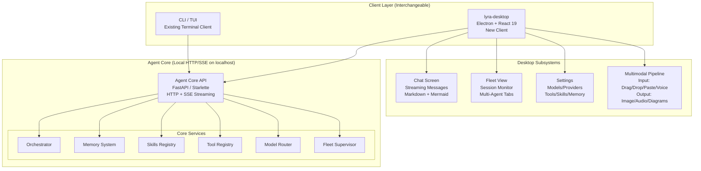
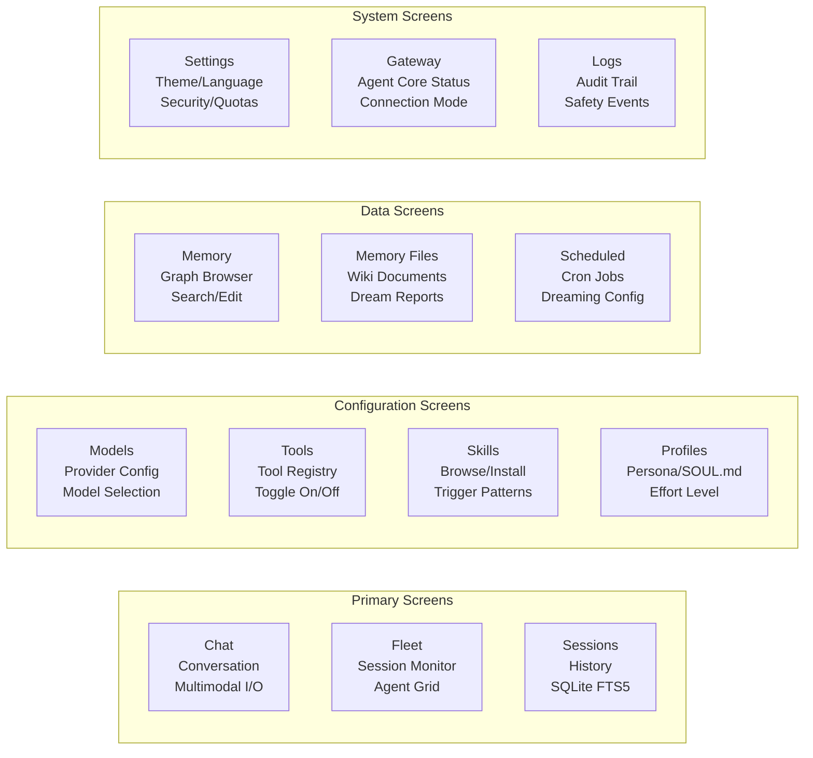

# Lyra Desktop GUI + Multimodal — Ultra Plan (§4.28)

> Run 1 — June 3, 2026 | Electron-based desktop application with multimodal input/output, provider breadth, and interchangeable CLI/Desktop architecture
> Status: New plan — based on hermes-desktop reference architecture, multimodal research, and Electron/Tauri evaluation

## Plain-Language Summary

Lyra Desktop is a graphical user interface for Lyra that runs alongside the CLI — both are interchangeable clients that talk to the same agent core API. Built on Electron + React 19 + TypeScript + Tailwind 4 + Vite, it provides a full-featured chat interface, fleet view, session management, provider/model configuration, skills/tools browsing, memory browsing, and persona editing. Multimodal input (drag-drop images, audio, video, PDFs) routes to vision/audio-capable providers. Multimodal output renders images, audio playback, Mermaid diagrams, rich diffs, and voice waveform/transcripts. When a provider is text-only, inputs degrade gracefully (OCR/transcribe locally, describe-then-route). Provider/model breadth spans OpenRouter, Anthropic, OpenAI, Gemini, DeepSeek, Qwen, Groq, HuggingFace, plus local (Ollama, vLLM, llama.cpp).

## 1. Problem

Lyra currently has only a CLI interface. While powerful for developers, this excludes users who prefer graphical interaction, need multimodal input/output support, or want to manage agents visually. The CLI also limits productivity features like drag-drop file handling, visual Mermaid diagram rendering, rich diff views, inline image display, audio recording/playback, and simultaneous fleet monitoring with session peeking. The target is a full desktop application that matches the feature set of hermes-desktop while adding Lyra-specific capabilities (fleet view, voice mode integration, memory files browsing).

## 2. Evidence Synthesis

### 2.1 Hermes Desktop (Reference Architecture)

Full Electron + React + TypeScript desktop app with three-tier architecture:
- **Main process**: Node.js backend — IPC, native OS integration, gateway/engine lifecycle, SSH/remote, file system, session management
- **Preload**: Context bridge exposing safe APIs to renderer
- **Renderer**: React + Tailwind CSS — Chat, Memory, Models, Providers, Sessions, Skills, Tools, Settings, Gateway, Agents, Kanban, Schedules, Soul screens
- Security: `contextIsolation: true`, `nodeIntegration: false`, `sandbox: true`
- 24 feature areas documented (see §3.29 deep-read)

### 2.2 Multimodal Input Patterns

Four standard input channels from hermes-desktop analysis:
1. **Drag-and-drop**: `onDrop` on composer area, `processFiles()` → `Attachment[]` with session-scoped staging
2. **Clipboard paste**: `onPaste` check `clipboardData.files`, `filesFromClipboard()` utility
3. **File open dialog**: `dialog.showOpenDialog` via IPC, byte limit (100KB default), MIME type detection
4. **Voice input**: `webkitSpeechRecognition` for speech-to-text, audio recording via MediaRecorder API

### 2.3 Multimodal Output Patterns

- Images: base64 data URL → `MediaImage` component with lightbox
- Audio: waveform visualization, playback controls (play/pause/seek)
- PDF: Extension detection, open in system handler
- Mermaid: Client-side rendering via `mermaid.js` or server-side via Lyra toolkit
- Rich diffs: Side-by-side or unified diff viewer with syntax highlighting

### 2.4 Electron vs Tauri

**Electron:**
- Footprint: ~150-200MB base (bundled Chromium)
- Security: contextIsolation + sandbox + nodeIntegration: false
- Maturity: Battle-tested ecosystem, native APIs, extensive docs
- IPC: Built-in, well-documented patterns

**Tauri:**
- Footprint: ~5-10MB (uses system WebView)
- Security: Rust backend, memory safety, smaller attack surface
- Rust native: Can run Lyra Rust components directly
- Maturity: Growing but less mature, some system WebView compatibility issues

**Recommendation:** Electron for V1 (hermes-desktop proven pattern), Tauri for V2 if footprint and Rust-native integration become priorities.

### 2.5 Provider Breadth

Target providers (via §4.5 Provider Abstraction Layer):
- **Cloud**: Anthropic (Claude), OpenAI (GPT-4/4.1), Google (Gemini), DeepSeek, Qwen, Groq, OpenRouter (aggregator)
- **Local**: Ollama, vLLM, llama.cpp, LocalAI
- **HuggingFace**: Inference API / TGI

### 2.6 WebVoyager / Set-of-Mark (SoM)

- SoM prompting for interactive element identification
- GPT-4V evaluation: 85.3% agreement with human judgment
- Thought-then-action pattern for multimodal agents

## 3. Proposed Lyra Design

### 3.1 Architecture: Agent Core API + Interchangeable Clients



### 3.2 Tech Stack

```
Frontend:
  - Electron 35+ (or Tauri v2 — evaluate during Phase 1)
  - React 19 (concurrent features for streaming)
  - TypeScript 5.x (strict mode)
  - Tailwind CSS 4 (utility-first styling)
  - Vite 6 (fast HMR, optimized builds)
  - TanStack Query (server state, streaming)
  - Zustand (client state)
  - Mermaid.js v11 (diagram rendering)
  - Monaco Editor (code blocks, diffs)
  - React-Virtuoso (virtualized large lists)

Backend (in Agent Core):
  - FastAPI / Starlette (HTTP + SSE endpoints)
  - Python 3.12+ (async throughout)
  - WebSocket support for real-time streaming

Build:
  - electron-vite (Electron + Vite integration)
  - electron-builder (cross-platform packaging)
  - Vitest (unit + integration tests)
  - Playwright (E2E tests)
```

### 3.3 Screen Map



### 3.4 Chat Screen (Primary Interface)

```tsx
// Component architecture for the Chat screen
interface ChatScreen {
  // Composer area — accepts text + multimodal input
  composer: {
    textInput: Textarea;          // Multi-line input with auto-resize
    attachmentStrip: Attachment[]; // Drag-drop/paste files
    voiceButton: Button;          // Push-to-talk (see §4.18)
    sendButton: Button;
    contextFolders: FolderSelect; // Context file attachments
  };
  
  // Message list — virtualized, streaming-aware
  messages: {
    virtualList: VirtualList<Message>;  // React-Virtuoso
    streamingIndicator: StreamingBanner; // "Lyra is thinking..."
    messageRenderer: {
      text: MarkdownRenderer;        // With code block syntax highlighting
      mermaid: MermaidRenderer;      // Inline diagram rendering
      image: MediaImage;             // Inline image display + lightbox
      audio: AudioPlayer;            // Waveform + playback controls
      diff: DiffRenderer;            // Side-by-side unified diff
      file: FileAttachment;          // Downloadable file links
      thinking: ThinkingBlock;       // Expandable thinking trace
    };
  };
  
  // Side panels
  contextPanel: {                  // Right panel
    files: FileList;               // Context files for this session
    tokens: TokenCounter;          // Token usage breakdown
    lore: LorePanel;               // Active SOUL.md persona
  };
  
  // Stream management
  streaming: {
    textStream: Subscription;      // SSE text tokens
    reasoningStream: Subscription; // Thinking tokens (separate channel)
    audioStream: Subscription;     // TTS audio chunks (§4.18)
    cancellationToken: AbortSignal;
  };
}
```

### 3.5 Multimodal Input Pipeline

```python
# AGENT CORE SIDE — handles multimodal input processing

class MultimodalInputProcessor:
    """Process multimodal inputs before sending to the agent.
    
    Input types: image (png/jpg/gif/webp), audio (wav/mp3/ogg), video (mp4/webm), PDF
    Output: structured message parts that the model can consume
    """
    
    async def process(self, input: MultimodalInput, provider: ProviderBackend) -> MessagePart:
        """Route multimodal input to appropriate processing based on provider capability."""
        
        if input.type == "image":
            if provider.supports(Capability.VISION):
                return ImagePart(url=input.data_url, detail="auto")
            else:
                # Graceful degradation: OCR locally, describe-then-route
                ocr_text = await self._ocr(input.file_path)
                description = await self._describe_image(input.file_path)
                return TextPart(f"[Image: {description}\nText in image: {ocr_text}]")
        
        elif input.type == "audio":
            if provider.supports(Capability.AUDIO):
                return AudioPart(url=input.data_url)
            else:
                # Transcribe locally, send as text
                transcript = await self._transcribe_audio(input.file_path)
                return TextPart(f"[Audio transcript: {transcript}]")
        
        elif input.type == "video":
            # Extract key frames, process with OCR + description
            frames = await self._extract_frames(input.file_path, max_frames=5)
            descriptions = await asyncio.gather(*[self._describe_image(f) for f in frames])
            return TextPart(f"[Video key frames: {' | '.join(descriptions)}]")
        
        elif input.type == "pdf":
            if provider.supports(Capability.PDF):
                return PDFPart(url=input.data_url)
            else:
                # Extract text locally
                text = await self._extract_pdf_text(input.file_path)
                chunks = self._chunk_text(text, max_chunk_size=4000)
                return TextPart(f"[PDF content (truncated): {chunks[0]}]")
        
        raise ValueError(f"Unsupported input type: {input.type}")
```

### 3.6 Multimodal Output Pipeline

```python
# DESKTOP/MODEL SIDE — handles rendering multimodal responses

class MultimodalOutputRenderer:
    """Render multimodal model responses in the desktop UI."""
    
    def render_part(self, part: ResponsePart, container: HTMLElement):
        """Render a single response part based on its type."""
        match part.type:
            case "image":
                self._render_image(part.data_url, container)
            case "audio":
                self._render_audio_player(part.audio_url, waveform_data=part.waveform, container)
            case "mermaid":
                self._render_mermaid(part.diagram_code, container)
            case "diff":
                self._render_diff(part.old_text, part.new_text, language=part.language, container)
            case "tool_use":
                self._render_tool_call(part.tool_name, part.args, part.result, container)
            case "thinking":
                self._render_thinking_block(part.content, expandable=True, container)
            case _:
                self._render_markdown(part.content, container)
    
    async def _render_mermaid(self, code: str, container: HTMLElement):
        """Render Mermaid diagrams client-side."""
        try:
            svg = await mermaid.render("mermaid-" + uuid4(), code)
            container.innerHTML = svg
        except MermaidError:
            # Fallback: show code block
            container.innerHTML = f"<pre><code>{escapeHtml(code)}</code></pre>"
```

### 3.7 Electron Security Hardening

```typescript
// Security configuration (hermes-desktop patterns)
const mainWindow = new BrowserWindow({
  webPreferences: {
    contextIsolation: true,       // Isolate renderer from Node.js
    nodeIntegration: false,       // No Node.js in renderer
    sandbox: true,                // OS-level sandbox
    webSecurity: true,            // Same-origin enforcement
    allowRunningInsecureContent: false,
    preload: path.join(__dirname, 'preload.js'),  // Only preload bridge
  }
});

// Webview URL vetting
function isAllowedWebviewUrl(url: string): boolean {
  const allowed = [
    'http://localhost:',           // Agent core API
    'http://127.0.0.1:',          // Local services
    'https://api.anthropic.com',  // Direct API (if needed)
    'https://openrouter.ai',
  ];
  return allowed.some(prefix => url.startsWith(prefix));
}

// External navigation allowlist
function isAllowedExternalUrl(url: string): boolean {
  const blockedPatterns = [
    'file://',                    // Block local file access
    'data:application/javascript', // Block JS injection via data URI
  ];
  return !blockedPatterns.some(p => url.startsWith(p));
}
```

### 3.8 Voice Integration Points

```typescript
// Desktop-side voice integration with §4.18 Voice Pipeline

interface VoiceIntegration {
  // Push-to-talk (Phase 1)
  pushToTalk: {
    keybinding: 'F2' | 'Ctrl+Shift+V';
    onKeyDown: () => startRecording();
    onKeyUp: () => stopRecording();
    onTranscription: (text: string) => appendToInput(text);
  };
  
  // Always-listening (Phase 2)
  alwaysListening: {
    wakeWord: 'Hey Lyra';
    wakeDetector: () => startCapture();
    silenceTimeout: 1500;  // ms of silence before auto-send
    visualIndicator: 'listening' | 'processing' | 'idle';
  };
  
  // Audio output
  audioOutput: {
    onToken: (audioChunk: Bytes) => playAudio(audioChunk);  // Streaming TTS
    waveform: (data: Float32Array) => renderWaveform(data);
    stopPlayback: () => AbortController.abort();  // Barge-in
  };
}
```

### 3.9 Data Model (Desktop-Side)

```typescript
// Core entity types for the desktop application

interface DesktopConfig {
  theme: 'dark' | 'light' | 'system';
  language: 'en' | 'vi' | 'zh' | ...;  // 10+ locales from hermes-desktop
  connectionMode: 'local' | 'remote' | 'ssh';
  remoteUrl: string;
  sshKeyPath: string;
  activeProfileId: string;
  notifications: boolean;
  autoUpdate: boolean;
}

interface Attachment {
  id: string;
  sessionId: string;
  filename: string;
  mimeType: string;
  dataUrl: string;  // Base64 encoded
  sizeBytes: number;
  createdAt: number;
}

interface SessionListItem {
  id: string;
  title: string;      // Auto-generated from first message
  modelId: string;
  effortLevel: EffortLevel;
  tokenCount: number;
  messageCount: number;
  createdAt: number;
  lastActiveAt: number;
}

interface Profile {
  id: string;
  name: string;
  soulContent: string;
  defaultModel: string;
  defaultEffort: EffortLevel;
  tools: string[];       // Enabled tool IDs
  skills: string[];      // Active skill IDs
  memoryEnabled: boolean;
}
```

### 3.10 Provider/Model Configuration Screen

```typescript
interface ProviderConfig {
  id: string;               // "anthropic" | "openai" | "deepseek" | ...
  displayName: string;
  type: 'cloud' | 'local' | 'aggregator';
  
  // Connection
  baseUrl: string;
  apiKeyEnvVar: string;     // "ANTHROPIC_API_KEY"
  requiresApiKey: boolean;
  
  // Capabilities
  capabilities: Capability[];  // vision, audio, tools, thinking, json_mode
  
  // Models
  models: ModelConfig[];
  
  // Status
  isConnected: boolean;
  lastError: string | null;
  latencyMs: number;
}

interface ModelConfig {
  id: string;
  displayName: string;
  provider: string;
  
  // Effort mapping (from §4.5 BREAKTHROUGH-ARCHITECTURE)
  effortMapping: Record<EffortLevel, ModelParams>;
  
  // Pricing
  inputPricePer1K: number;
  outputPricePer1K: number;
  thinkingPricePer1K: number | null;
  
  // Limits
  contextWindow: number;
  maxOutput: number;
}
```

## 4. Build Outline

### Phase 1: Core Desktop MVP (weeks 1-6)

1. **Electron scaffold** — electron-vite project setup; main/preload/renderer separation; TypeScript strict mode; Tailwind 4 + Vite
2. **Agent core API** — FastAPI server on localhost; SSE streaming for chat; WebSocket for real-time updates; health check endpoint
3. **Chat screen** — Message list with markdown rendering; composer with text input; streaming message display; basic code block highlighting
4. **Session management** — List/create/delete sessions; session persistence; FTS5 search via SQLite; auto-title generation
5. **Provider/model config** — Provider selection UI; model list with capability badges; API key configuration (stored in OS keychain)
6. **Settings screen** — Theme toggle (dark/light); language selection; connection mode (local/remote/SSH); about pane

**Dependencies:** §4.5 provider abstraction (agent core must expose HTTP API)

### Phase 2: Multimodal + Fleet (weeks 7-12)

1. **Multimodal input** — Drag-and-drop file handling; clipboard paste for images; file open dialog with MIME type detection; session-scoped attachment staging
2. **Multimodal output** — Image rendering with lightbox; Mermaid diagram rendering (client-side); rich diff viewer; code block syntax highlighting (Monaco)
3. **Graceful degradation** — OCR for text-only providers; audio transcription for text-only providers; PDF text extraction; "describe-then-route" for vision
4. **Fleet view screen** — Session list with state grouping (Working/NeedsInput/Completed); live status updates via WebSocket; session peek panel
5. **Multi-agent tabs** — Each session as a tab; background sessions continue running; tab badges for state changes
6. **Memory browser** — Graph memory search/explore; visual graph rendering; memory note CRUD

**Dependencies:** Phase 1, §4.13 fleet infrastructure (for fleet view)

### Phase 3: Skills + Tools + Profiles (weeks 13-16)

1. **Skills browser** — List installed skills; skill detail view (trigger patterns, version); install from marketplace; skill toggle
2. **Tool registry screen** — Tool list with descriptions; per-tool enable/disable; mutation gate indicator
3. **Profiles system** — Profile CRUD; SOUL.md editor with preview; profile-aware gateway lifecycle; quick-switch between profiles
4. **Memory files screen** — Topic-organized wiki documents; dream report timeline; create/edit/delete memory files
5. **Scheduled tasks** — Cron job list; dreaming schedule config; task create/edit/delete; execution log

**Dependencies:** Phase 2, §4.24 dreaming engine (for memory files)

### Phase 4: Voice + Polish (weeks 17-20)

1. **Voice integration** — Push-to-talk via desktop keyboard shortcuts (see §4.18); voice recording with waveform visualization; streaming TTS playback
2. **Audio player** — Playback controls (play/pause/seek); waveform rendering; audio file export; voice pack selection
3. **Notifications** — Desktop notifications on task completion/needs-input; notification preferences per session type
4. **Security hardening** — Webview URL vetting; external URL allowlisting; navigation validation; path traversal protection
5. **Auto-update** — electron-updater integration; download progress; install on quit
6. **Performance optimization** — Virtual scrolling for large session lists; lazy-loaded screens; memory-efficient attachment handling; app bundle size optimization

**Dependencies:** Phase 3, §4.18 voice mode

## 5. Provider/Model Breadth

| Provider | Models | Capabilities | Status |
|----------|--------|-------------|--------|
| Anthropic | Claude 4.x/4.5/4.6 | tools, vision, thinking, audio | Target |
| OpenAI | GPT-4.1/4.5, o3, o4-mini | tools, vision, audio, reasoning | Target |
| Google | Gemini 2.5 Flash/Pro | tools, vision, audio, code_execution | Target |
| DeepSeek | DeepSeek-V3, DeepSeek-R1 | tools, thinking | Target |
| Qwen | Qwen3-8B/14B/72B/235B | tools, vision, thinking | Target |
| Groq | Llama 3, Mixtral | tools, fast inference | Target |
| OpenRouter | Meta-aggregator | models from 200+ providers | Target |
| Ollama | Any local model | depends on model | Target |
| vLLM | Any HuggingFace model | depends on model | Target |
| llama.cpp | GGUF models | depends on model | Target |

## 6. Electron vs Tauri Evaluation

| Criterion | Electron | Tauri | Verdict |
|-----------|----------|-------|---------|
| Bundle size | ~150-200MB | ~5-10MB | Tauri wins |
| Memory usage | ~100-300MB | ~50-100MB | Tauri wins |
| Security | Chromium sandbox (proven) | Rust backend (smaller surface) | Tauri wins |
| Rust backend | Sidecar process | Native | Tauri wins |
| Maturity | Extensive ecosystem | Growing | Electron wins |
| Native APIs | Comprehensive | Growing | Electron wins |
| WebView compatibility | Chromium (consistent) | System WebView (varies) | Electron wins |
| Development speed | Fast (vast ecosystem) | Slower (smaller ecosystem) | Electron wins |
| Cross-platform testing | Well understood | Edge cases per OS | Electron wins |

**Recommendation: Electron for V1** — hermes-desktop provides a complete, tested reference implementation. Faster development from proven patterns. Lower risk for initial release. **Tauri evaluation in Phase 4** — if bundle size or memory become issues, and Rust backend integration is desired, port to Tauri.

## 7. (A) Parity vs (B) Breakthrough

**(A) Parity:** Full-featured Electron desktop app matching hermes-desktop capabilities: chat, session management, provider/model config, skills/tools browser, memory browser, profiles, settings, multi-agent tabs, notifications. Multimodal input (drag-drop, paste, file open) + output (images, audio, diagrams, diffs). Provider breadth matching 10+ providers.

**(B) Breakthrough:** Graceful multimodal degradation (text-only providers get OCR+describe+transcribe — no other desktop client does this) + integrated voice mode with waveform visualization + fleet view with live multi-agent monitoring + unified CLI/Desktop interchangeable architecture (same core API, two frontends) + provider capability-aware routing (desktop knows what each provider can do and adapts the UI accordingly).

## 8. Baseline Delta

**Changes:** New Electron desktop application (6 screens minimum, 12+ full), multimodal input/output pipeline, provider config UI, fleet view screen, integrated voice mode
**Keeps:** CLI + TUI as primary interfaces; agent core is shared between CLI and desktop
**Replaces:** Nothing — greenfield
**Migration cost:** ~20 new TypeScript/React modules; ~5000 lines of code; new dependency (Electron/node_modules); electron-builder for packaging; no changes to agent core (new API surface only)

## 9. Expert Review

**Senior Frontend Engineer:** "Electron + React 19 + Tailwind 4 + Vite is the right stack for V1. The hermes-desktop reference is high quality and provides a complete blueprint. Key concern: React 19 concurrent features for streaming are powerful but need careful use of Suspense boundaries to avoid jank during high-frequency updates. Use TanStack Query for server state with SSE adapters — it handles streaming better than raw useEffect."

**Senior Security Engineer:** "The security hardening (context isolation, sandbox, webview vetting) follows hermes-desktop patterns which are solid. One addition: the preload bridge should expose specific, typed APIs only — no generic IPC passthrough. Each renderer API call should be individually scoped. The attachment staging (temp files per session) must clean up on session close — test with 100+ sessions to verify no storage leaks."

**Senior UX/Product Designer:** "The screen map is comprehensive but risky for a first release — 12 screens is a lot. Ship with 6 core screens: Chat, Sessions, Settings, Providers, Memory, Skills. Add Fleet, Profiles, Scheduled Tasks, Logs in Phase 2-3. The composer needs: text input with auto-resize, attachment strip, send button, and a small indicator for which provider/model is active. The message list needs: scrolling stability during streaming (auto-scroll to bottom, with override if user scrolls up)."

**Adversarial Skeptic:** "A 20-week desktop build is a massive investment. Before committing, validate that the agent core API is sufficiently stable to support a desktop client. If the API keeps changing during Phase 1 development, the desktop will be chasing a moving target. Suggestion: build a minimal web-based chat UI first (React + Vite, no Electron) that talks to the same API. If that works for 2 weeks, proceed with Electron. This de-risks the API dependency."

**Resolution:** Phase 0 (2-week spike): web-based React chat UI connected to agent core API. If stable, proceed with full Electron app using hermes-desktop patterns. Ship with 6 screens in Phase 1 (Chat, Sessions, Settings, Providers, Memory, Skills), add 6 more in Phase 2-3. The attachment staging and security hardening are Phase 1 minimum — not Phase 4 items.

## 10. References
- Hermes Desktop: https://github.com/fathah/hermes-desktop
- Electron: https://www.electronjs.org/
- Tauri: https://tauri.app/
- React: https://react.dev/
- Tailwind CSS: https://tailwindcss.com/
- WebVoyager / SoM: https://arxiv.org/abs/2401.13919
- Lyra §4.5 Provider Abstraction (BREAKTHROUGH-ARCHITECTURE.md)
- Lyra §4.18 Voice Mode Plan
- Lyra §4.13 Swarm/Fleet Plan

## 11. Changelog
- Run 1: Initial plan written — Electron desktop architecture, multimodal I/O pipeline, provider breadth, screen map, Electron vs Tauri evaluation
