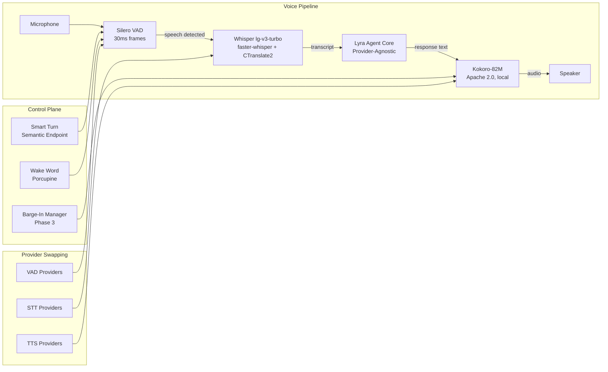

# Lyra Voice Mode — Architecture & Design

> ⭐ Flagship feature — standalone architecture document
> Run 1 — June 3, 2026 | Full plan: plans/18-voice-mode.md

## Architecture Overview



## Provider-Swappable Design

The key innovation: voice providers are swappable like LLM providers.

```python
class STTProvider(Protocol):
    async def transcribe(self, audio: bytes, language: str | None = None) -> str: ...
    @property def latency_ms(self) -> float: ...
    @property def supported_languages(self) -> list[str]: ...

class TTSProvider(Protocol):
    async def synthesize(self, text: str, voice: str = "default") -> bytes: ...
    async def stream_synthesize(self, text: str, voice: str = "default") -> AsyncIterator[bytes]: ...
    @property def latency_ms(self) -> float: ...

class VADProvider(Protocol):
    def detect_speech(self, audio_chunk: bytes) -> float: ...
    def is_speech(self, audio_chunk: bytes, threshold: float = 0.5) -> bool: ...
```

**Default providers:** Whisper large-v3-turbo (STT, MIT) + Kokoro-82M (TTS, Apache 2.0) + Silero VAD (MIT)
**Alternatives:** NVIDIA Parakeet/Canary (STT), Orpheus-TTS/CSM (TTS), WebRTC VAD

## Phased Rollout

| Phase | Feature | E2E Latency | Timeline |
|-------|---------|-------------|----------|
| 1 | Push-to-Talk (Whisper + Kokoro) | <2s | Month 5-6 |
| 2 | Always-Listening + Wake Word | <1.5s | Month 7-8 |
| 3 | Full-Duplex + Barge-In | <800ms | Month 8-9 |
| 4 | Voice in Desktop + Multilingual VI+EN | <800ms | Month 9-10 |

## Latency Budget (Phase 3 Target)

| Stage | Budget |
|-------|--------|
| VAD | <5ms |
| STT | <200ms |
| Agent (first token) | <500ms |
| TTS (first audio) | <100ms |
| **Total E2E** | **<800ms** |
| Barge-in | <200ms |

## Voice Packs (§5.3)

- Warcraft Peon, Portal Turret, HAL 9000, JARVIS
- Hook-based: `on_session_start`, `on_task_complete`, `on_error`
- Community voice pack marketplace
