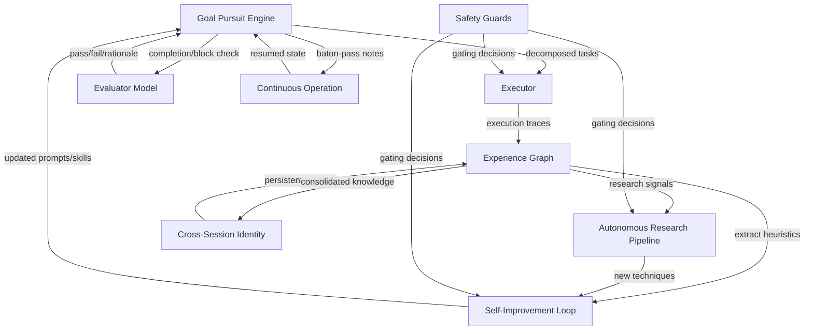

# Lyra Autonomy Engine: Ultra Plan

**Status**: Planning Complete
**Version**: 1.0
**Date**: 2026-05-27
**Target**: Lyra v5.0 -- AGI-Grade Autonomous Multi-Agent System

---

## 1. Executive Summary

Lyra's autonomy engine transforms the system from a task-execution agent into a self-directing, self-improving, continuously operating multi-agent platform. This plan synthesizes research from 12 cutting-edge papers (2024-2026) on self-evolving agents, 5 synthesis documents on autonomous agent architectures, and production observations from Claude Code's autonomy features.

**Core thesis**: True autonomy requires five integrated capabilities operating as a single feedback loop: goal pursuit, experience capture, self-improvement, continuous operation, and autonomous research. Each depends on the others -- a goal engine without experience capture repeats the same mistakes; self-improvement without continuous operation never accumulates compound gains.

**Key research foundations:**

| Paper | Date | Core Contribution | Lyra Application |
|-------|------|-------------------|------------------|
| ADAS | Aug 2024 | Meta-agent optimizes sub-agents via search | Population-based agent improvement |
| Godel Agent | Oct 2024 | Runtime monkey-patching with safety verification | Self-modifying agent code paths |
| Darwin Godel Machine | May 2025 | Archive-based open-ended agent evolution | Agent variant archive with performance selection |
| CASCADE | Dec 2025 | Cumulative autonomous skill creation | Skill extraction from execution traces |
| Ratchet | May 2026 | Minimal recipe for self-evolving agents | Hygiene checklist for self-modification |
| AlphaEvolve | 2026 | Evolution-guided agent optimization | Population-based improvement search |
| CORAL | Apr 2026 | Autonomous multi-agent evolution for discovery | Multi-agent self-play curriculum |
| EVOAGENT | Apr 2026 | Skill learning with delegation trees | Hierarchical skill composition |
| AgentFactory | Mar 2026 | Executable subagent accumulation and reuse | Subagent template library |
| ERL | 2026 | Single-trajectory heuristic extraction (+7.8% Gaia2) | Experience Graph heuristic generation |
| MemGrad | 2026 | Textual gradients for improvement | Reflection loop feedback format |
| Feedback Descent | 2026 | Pairwise comparison with textual rationales | Multi-perspective evaluation |

**Target outcome**: Lyra operating autonomously for 8+ hour sessions, accumulating reusable experience across sessions, self-improving its prompt library and skill repertoire, conducting independent research, and maintaining persistent identity -- all within verifiable safety boundaries.

---

## 2. Architecture Overview

### 2.1 The Autonomy Loop



### 2.2 System Layers

```
Layer 1:  GOAL PURSUIT ENGINE     -- Decompose, evaluate, track, adjust
Layer 2:  EXPERIENCE GRAPH (EXG)   -- Capture, store, retrieve execution traces
Layer 3:  SELF-IMPROVEMENT LOOP    -- Extract heuristics, generate skills, internalize
Layer 4:  CONTINUOUS OPERATION      -- Baton-pass, checkpoint, recover, resume
Layer 5:  AUTONOMOUS RESEARCH       -- Discover papers, analyze code, integrate techniques
Layer 6:  CROSS-SESSION IDENTITY    -- Persistent memory, lifelong learning, identity
Layer 7:  SAFETY GUARDS            -- Mutating action gating, hygiene, alignment
```

### 2.3 Data Flow Summary

```
User Goal → Decomposer → Task Queue → Executor → Traces → EXG
                                                       ↓
                                              Heuristic Extractor → Skill Library
                                                       ↓
                                              Prompt Updater → Improved Agent
                                                       ↓
                                              Research Pipeline → New Techniques
                                                       ↓
                                              Persistent Memory → Next Session
```

---

## 3. Goal Pursuit Engine

The Goal Pursuit Engine (GPE) is the central decision loop: it decomposes high-level goals into executable tasks, monitors progress against conditions, evaluates outcomes, and dynamically adjusts strategy.

### 3.1 Architecture

```
┌──────────────────────────────────────────────────────────────┐
│                   GOAL PURSUIT ENGINE                         │
├──────────────────────────────────────────────────────────────┤
│  ┌────────────┐    ┌──────────────┐    ┌──────────────────┐  │
│  │ Goal       │───→│ Task         │───→│ Executor         │  │
│  │ Decomposer │    │ Scheduler    │    │ (Subagent Pool)  │  │
│  └────────────┘    └──────┬───────┘    └────────┬─────────┘  │
│                           │                      │            │
│                           ▼                      ▼            │
│                    ┌──────────────┐    ┌──────────────────┐  │
│                    │ Condition    │←───│ Progress          │  │
│                    │ Checker      │    │ Tracker           │  │
│                    └──────┬───────┘    └──────────────────┘  │
│                           │                                   │
│                           ▼                                   │
│                    ┌──────────────────────────────────────┐  │
│                    │ Evaluator Model (separate Haiku)     │  │
│                    │ • Rates progress against condition   │  │
│                    │ • Provides textual rationale         │  │
│                    │ • Votes: continue/block/escalate     │  │
│                    └──────────────────────────────────────┘  │
└──────────────────────────────────────────────────────────────┘
```

### 3.2 Goal Decomposition

Goals enter as natural language with structured conditions and are decomposed into a task DAG.

```python
@dataclass
class Goal:
    """A high-level objective with completion conditions."""
    id: str
    description: str                          # "Implement user auth for the API"
    conditions: List[Condition]               # Completion checks
    max_turns: int = 100                      # Safety bound
    max_cost_usd: float = 10.0                # Budget bound
    autonomy_level: Literal[1, 2, 3, 4, 5] = 3
    parent_goal_id: Optional[str] = None
    created_at: datetime
    metadata: Dict[str, Any]

@dataclass
class Condition:
    """A verifiable completion condition -- evaluated by the Evaluator Model."""
    description: str                          # "All API tests pass with >80% coverage"
    evaluator_prompt: str                     # Prompt for the evaluator model
    max_chars: int = 4000                     # Condition description budget
```

**Decomposition strategy** (inspired by Continuous Claude baton-pass pattern):

1. Parse goal into subgoals using the planner model (Sonnet)
2. For each subgoal, generate 2-5 tasks with explicit verifiable conditions
3. Arrange tasks into a DAG respecting dependency edges
4. Schedule tasks via a priority queue weighted by dependency depth and estimated impact
5. After each task completes, re-evaluate the DAG for re-planning

```python
def decompose_goal(goal: Goal) -> TaskDAG:
    """Decompose a high-level goal into an executable task DAG."""
    subgoals = planner.decompose(goal.description, max_subgoals=7)

    tasks = []
    for sg in subgoals:
        sg_tasks = generate_tasks(sg, max_tasks=5)
        for t in sg_tasks:
            t.conditions = generate_conditions(t)
        tasks.extend(sg_tasks)

    dag = build_dag(tasks)
    dag.validate()  # Ensure acyclicity, no orphan nodes
    return dag
```

### 3.3 Evaluator Model

A separate lightweight model (Haiku) evaluates progress against conditions on every N turns. This is the core pattern from Claude Code's goal system.

```python
class EvaluatorModel:
    """Lightweight evaluator that rates progress and votes on continuation."""

    def __init__(self):
        self.model = "haiku"                 # Fast, cheap for frequent checks

    def evaluate(self, goal: Goal, trajectory: List[Turn], conditions: List[Condition]) -> EvaluationResult:
        """Rate each condition and produce a summary verdict."""
        prompt = build_evaluator_prompt(goal, trajectory, conditions)
        response = self.model.complete(prompt, max_tokens=500)

        return EvaluationResult(
            condition_scores={
                c.id: parse_score(response, c.id)
                for c in conditions
            },
            verdict=parse_verdict(response),   # continue | block | escalate
            rationale=parse_rationale(response),
            confidence=parse_confidence(response),
        )
```

**Evaluator prompt template** (4K character budget):

```
You are evaluating an AI agent's progress toward a goal.

GOAL: {goal.description}

CONDITIONS:
{for each condition: "- [{status_icon}] {condition.description}"}

RECENT ACTIONS:
{last 5 turns with tool calls, results, and reasoning}

For each condition above, rate as:
- MET: clearly satisfied
- PARTIAL: progress made but not complete
- UNMET: no progress or regression

Then vote:
- CONTINUE: more work needed, on track
- BLOCK: stuck, repeating, or unsafe -- escalate to operator
- COMPLETE: all conditions MET

Provide a 1-3 sentence rationale.
```

**Evaluation frequency**: Every 10 turns by default. Configurable per goal. High-risk goals evaluate every 3 turns.

### 3.4 Progress Tracking

```python
@dataclass
class ProgressTracker:
    """Tracks task-level and goal-level progress."""

    def record_turn(self, turn: Turn, goal: Goal):
        """Log a turn with its outcome and link to the relevant task."""
        pass

    def summary(self, goal: Goal) -> ProgressSummary:
        """Generate a structured progress summary for the evaluator."""
        return ProgressSummary(
            tasks_completed=...,
            tasks_remaining=...,
            conditions_met=...,
            conditions_partial=...,
            conditions_unmet=...,
            estimated_completion_turns=...,
            current_blockers=...,
        )
```

### 3.5 Dynamic Re-planning

When the evaluator votes BLOCK or progress stalls beyond a threshold, the GPE triggers re-planning:

1. Compress completed work into a summary
2. Identify which sub-goals are blocked and why
3. Generate 3 alternative strategies via parallel Sonnet calls
4. Select the highest-confidence alternative (or escalate to operator)
5. Update the task DAG with the new strategy

---

## 4. Experience Graph (EXG)

The Experience Graph is the central memory substrate: it captures every execution trace as a structured, queryable, reusable experience.

### 4.1 Design Philosophy

The EXG treats agent execution traces as the **primary learning signal** -- not a secondary log. Every tool call, reasoning step, error, and outcome is a node in a growing graph. Over time, patterns emerge: which strategies work for which problem classes, which sequences of tool calls are most efficient, which error recovery paths succeed.

### 4.2 Graph Schema

```
┌───────────────────────────────────────────────────────────────────┐
│                     EXPERIENCE GRAPH SCHEMA                        │
├───────────────────────────────────────────────────────────────────┤
│                                                                    │
│  Node Types:                                                       │
│  ┌──────────┐  ┌──────────┐  ┌──────────┐  ┌──────────────────┐  │
│  │  GOAL    │  │  TASK    │  │  TURN    │  │  OUTCOME          │  │
│  │  node    │  │  node    │  │  node    │  │  node             │  │
│  │          │  │          │  │          │  │  (success/fail/   │  │
│  │ id       │  │ id       │  │ id       │  │  partial/blocked) │  │
│  │ desc     │  │ desc     │  │ reasoning│  │                    │  │
│  │ conds    │  │ goal_id  │  │ tool_call│  │  metrics           │  │
│  │ created  │  │ deps     │  │ result   │  │  error_msg         │  │
│  │ status   │  │ priority │  │ duration │  │  tokens_used       │  │
│  └────┬─────┘  └────┬─────┘  └────┬─────┘  └───────┬──────────┘  │
│       │             │             │                  │             │
│  Edge Types:                                                       │
│  ──────────                                                       │
│  • DECOMPOSES_INTO  (Goal → Task)                                 │
│  • DEPENDS_ON       (Task → Task)                                 │
│  • EXECUTES         (Task → Turn)                                 │
│  • FOLLOWS          (Turn → Turn)  [temporal order]               │
│  • PRODUCES         (Turn → Outcome)                              │
│  • RETRIED_AS       (Turn → Turn)  [retry with different args]    │
│  • GENERALIZES      (Task → Skill) [extracted reusable pattern]   │
│  • SIMILAR_TO        (Task ↔ Task) [embedding cosine > 0.85]      │
│                                                                    │
└───────────────────────────────────────────────────────────────────┘
```

### 4.3 Capture Pipeline

Every execution turn feeds into the EXG automatically.

```python
class EXGCapture:
    """Captures execution traces into the Experience Graph."""

    def capture_turn(self, turn: Turn, task: Task, goal: Goal) -> str:
        """Record a single execution turn as graph nodes and edges."""
        turn_node_id = self.graph.add_node(
            type="TURN",
            properties={
                "reasoning": turn.reasoning,
                "tool_call": turn.tool_call,
                "tool_args": turn.tool_args,
                "result_summary": summarize(turn.result, max_chars=1000),
                "duration_ms": turn.duration_ms,
                "tokens_used": turn.tokens_used,
                "session_id": self.session_id,
            }
        )

        if turn.outcome:
            outcome_node_id = self.graph.add_node(
                type="OUTCOME",
                properties={
                    "status": "success" if turn.outcome.success else "failure",
                    "metrics": turn.outcome.metrics,
                    "error": turn.outcome.error_message,
                }
            )
            self.graph.add_edge(turn_node_id, outcome_node_id, "PRODUCES")

        return turn_node_id

    def close_goal(self, goal: Goal, final_outcome: Outcome):
        """Finalize a goal's subgraph: annotate with overall metrics."""
        self.graph.add_edge(goal.id, final_outcome.id, "RESULT")
        self.graph.set_node_property(goal.id, "status", final_outcome.status)
        self.graph.set_node_property(goal.id, "completed_at", utcnow())
```

### 4.4 Retrieval Strategies

The EXG supports multiple retrieval modes, each optimized for different query types.

| Strategy | Query Type | Method | Use Case |
|----------|-----------|--------|----------|
| **Vector** | "How did I handle auth errors?" | Embed query, cosine similarity on TURN nodes | Fuzzy recall |
| **Graph traversal** | "What depended on the DB migration?" | BFS/DFS from a TASK node following DEPENDS_ON edges | Dependency analysis |
| **Temporal** | "What happened between 2-3pm?" | Range scan on TURN.timestamp index | Session replay |
| **Pattern matching** | "Find all retried tool calls" | Subgraph isomorphism on `(TURN)-[RETRIED_AS]->(TURN)` | Failure pattern mining |
| **Hybrid** | "Best strategy for API integration" | Vector search filtered by OUTCOME.status=success | Strategy retrieval |

```python
class EXGRetriever:
    """Multi-strategy retrieval over the Experience Graph."""

    def retrieve(self, query: str, mode: str = "hybrid", top_k: int = 10) -> List[Experience]:
        if mode == "vector":
            return self._vector_search(query, top_k)
        elif mode == "graph":
            return self._graph_traversal(query, top_k)
        elif mode == "temporal":
            return self._temporal_scan(query, top_k)
        elif mode == "hybrid":
            vector_results = self._vector_search(query, top_k * 2)
            success_filtered = [r for r in vector_results if r.outcome == "success"]
            reranked = self._rerank(success_filtered, query)
            return reranked[:top_k]
```

### 4.5 Experience Consolidation

Raw traces are large and noisy. The EXG runs periodic consolidation (inspired by Auto-Dreamer and hippocampal replay):

1. **Merge**: Combine nearly identical traces (same tool call, same result, same context) into a single representative node
2. **Abstract**: Identify sequences of 3+ TURN nodes that repeatedly co-occur and replace them with a single STRATEGY node
3. **Prune**: Remove traces older than N days with no SIMILAR_TO edges (no reuse value) and failure outcomes
4. **Index**: Rebuild vector indices after each consolidation cycle

---

## 5. Self-Improvement Loop

The self-improvement loop closes the gap between execution and improvement: it extracts heuristics from the EXG, generates textual gradients (not scalar rewards), validates them, and internalizes them into the agent's prompt library and skill repertoire.

### 5.1 The EXECUTE-EVALUATE-REFLECT-CONSOLIDATE Cycle

```
┌─────────────────────────────────────────────────────────────────────┐
│                    SELF-IMPROVEMENT LOOP                             │
│                                                                      │
│  EXECUTE                  EVALUATE                  REFLECT           │
│  ┌──────────┐            ┌──────────┐             ┌──────────────┐  │
│  │ Subagent │───────────→│ Evaluator│────────────→│ Heuristic    │  │
│  │ executes │  traces    │ reviews  │  pass/fail  │ Extractor    │  │
│  │ task     │            │ outcome  │  +rationale │ (ERL-style)  │  │
│  └──────────┘            └──────────┘             └──────┬───────┘  │
│                                                          │           │
│                                          ┌───────────────┘           │
│                                          ▼                           │
│  CONSOLIDATE                                                            │
│  ┌──────────────────────────────────────────────────────────────┐   │
│  │ 1. Validate heuristic against EXG (retrospective)             │   │
│  │ 2. Test heuristic on held-out similar tasks                   │   │
│  │ 3. If validated: internalize as prompt update or skill        │   │
│  │ 4. If rejected: store as negative example in Failure Memory   │   │
│  └──────────────────────────────────────────────────────────────┘   │
└─────────────────────────────────────────────────────────────────────┘
```

### 5.2 Textual Gradient Extraction (MemGrad-inspired)

Instead of scalar reward signals, the system extracts **textual gradients** -- natural language descriptions of what went wrong and how to fix it.

```python
@dataclass
class TextualGradient:
    """A natural language improvement signal extracted from an execution trace."""
    source_trace_id: str              # Which execution produced this
    observation: str                  # "The agent used 5 sequential API calls when a bulk endpoint existed"
    cause: str                        # "The agent did not check the API docs for bulk operations"
    suggestion: str                   # "Before making API calls, search the API docs for batch/bulk endpoints"
    affected_tool: Optional[str]      # Which tool's usage pattern this applies to
    confidence: float                 # 0.0-1.0 based on evaluator agreement
    extraction_timestamp: datetime
```

**Extraction process** (ERL-style single-trajectory heuristic extraction):

1. After each task completes, feed the full trajectory (reasoning steps, tool calls, results) to Sonnet with a prompt that asks: "What went wrong? What went right? What should the agent do differently next time?"
2. Parse the response into structured `TextualGradient` objects
3. Cross-reference with the evaluator's rationale -- if evaluator and gradient extractor agree, confidence is high
4. Store gradients in the EXG with GENERALIZES edges to the parent TASK node

### 5.3 Heuristic Internalization

Validated heuristics are internalized through two paths:

**Path A: Prompt Library Updates** (for general behavioral improvements)

```python
class PromptLibrary:
    """A versioned collection of prompt templates that shape agent behavior."""

    def internalize_heuristic(self, gradient: TextualGradient) -> PromptUpdate:
        """Convert a validated textual gradient into a prompt update."""

        # 1. Identify which prompt template this applies to
        target_prompt = self.classify_prompt_target(gradient)

        # 2. Generate update candidate
        candidate = f"""
        ## Learned Heuristic ({gradient.extraction_timestamp:%Y-%m-%d})
        {gradient.suggestion}
        Source: {gradient.source_trace_id}
        """

        # 3. A/B test: compare old prompt vs new prompt on similar tasks
        if self.ab_test(target_prompt, candidate, n_trials=5):
            # 4. Apply update
            self.update(target_prompt.id, candidate)
            return PromptUpdate(status="applied", prompt_id=target_prompt.id)
        else:
            return PromptUpdate(status="rejected", reason="ab_test_failed")
```

**Path B: Skill Library Expansion** (for reusable procedural patterns)

When a trajectory pattern is used successfully 3+ times across different tasks, it graduates to a named, versioned skill.

### 5.4 Multi-Perspective Reflection (Feedback Descent-inspired)

Rather than a single evaluation, improvements are validated through pairwise comparison with textual rationales:

1. **Generate**: Produce two candidate strategies for the same task
2. **Execute**: Run both in parallel (or on held-out data)
3. **Compare**: Use a Sonnet evaluator to compare the two outcomes with specific textual reasoning about which was better and why
4. **Keep**: Archive the superior strategy, discard or refine the inferior one

### 5.5 Self-Play Improvement

Following CORAL's autonomous multi-agent evolution pattern:

1. **Proposer agent** generates new task variations based on gaps found in EXG
2. **Solver agent** attempts the task
3. **Judge agent** evaluates the solution
4. Both Proposer and Solver improve based on Judge feedback
5. Over time, the task distribution naturally drifts toward harder problems as the agents improve

---

## 6. Continuous Operation

Continuous operation enables Lyra to run for hours or days without losing state, recovering from errors, and maintaining coherent progress through a "baton-pass" pattern of shared task notes.

### 6.1 Baton-Pass Pattern

Inspired by Continuous Claude's architecture, the baton-pass pattern enables seamless handoff between agent invocations:

```python
@dataclass
class BatonPass:
    """Shared state passed between consecutive agent invocations."""
    session_id: str
    goal_id: str
    task_queue: List[Task]               # Remaining work
    completed_tasks: List[TaskSummary]   # What was done
    current_task: Optional[Task]         # In-progress task
    recent_context: str                  # Compressed last 5 turns
    learned_heuristics: List[str]        # New heuristics from this session
    open_questions: List[str]            # Things the agent is uncertain about
    blockers: List[str]                  # Known blockers
    consensus_votes: Dict[str, str]      # Evaluator votes on conditions
    checkpoint_id: str                   # Where to resume from
    created_at: datetime
```

**Flow:**

```
Agent Invocation N
    │
    ├─ Read BatonPass from shared state file
    ├─ Restore context from checkpoint
    ├─ Execute N turns (or until evaluator triggers pause)
    ├─ Update task queue, completed tasks, heuristics
    ├─ Write updated BatonPass
    └─ Pass baton →
                              Agent Invocation N+1
                                  │
                                  ├─ Read BatonPass
                                  ├─ Restore context
                                  ├─ Execute N turns
                                  └─ ...
```

### 6.2 Checkpointing with Compaction

Dual-direction compaction (inspired by Claude Code's checkpoint system):

```python
def compact_and_checkpoint(session: Session) -> Checkpoint:
    """Create a compact checkpoint for fast resume."""

    # 1. Compress old turns (everything before last 10)
    old_turns = session.turns[:-10]
    summary = summarize_turns(old_turns, max_tokens=2000)

    # 2. Extract learnings into the Knowledge block
    knowledge = extract_knowledge_block(old_turns)

    # 3. Keep recent turns intact
    recent = session.turns[-10:]

    # 4. Build checkpoint
    checkpoint = Checkpoint(
        knowledge_block=knowledge,
        recent_turns=recent,
        summary=summary,
        baton_pass=session.baton_pass,
        timestamp=utcnow(),
    )

    # 5. Persist to disk
    checkpoint.save()
    return checkpoint
```

### 6.3 Consensus-Based Completion

A goal is considered complete only when **three independent evaluators** agree:

1. **Fast evaluator** (Haiku): checks conditions after every 10 turns
2. **Thorough evaluator** (Sonnet): reviews full compressed trajectory at milestones
3. **Adversarial evaluator** (Sonnet with "skeptic" prompt): tries to find reasons the goal is NOT complete

All three must vote COMPLETE for the goal to be marked done. This prevents premature termination (a common failure mode observed in autonomous agents).

### 6.4 Error Recovery Ladder

Errors are handled at escalating levels:

| Level | Error Type | Recovery Strategy |
|-------|-----------|-------------------|
| L1 | Single tool call fails | Retry with different arguments (max 3 attempts) |
| L2 | 3 consecutive tool failures | Re-plan the current task with different approach |
| L3 | 3 task failures in a goal | Escalate: generate 3 alternative strategies, evaluate, pick best |
| L4 | Goal blocked by external factor | Pause goal, file baton-pass, notify operator |
| L5 | System-level failure (API down, quota) | Exponential backoff, checkpoint, retry from checkpoint |

### 6.5 Session Resumption

```python
def resume_session(session_id: str) -> Session:
    """Resume a session from its most recent checkpoint."""

    checkpoint = Checkpoint.load_latest(session_id)
    baton_pass = BatonPass.load(session_id)

    # Restore working state
    session = Session(
        id=session_id,
        goal=Goal.load(baton_pass.goal_id),
        task_queue=baton_pass.task_queue,
        completed_tasks=baton_pass.completed_tasks,
    )

    # Inject context
    session.knowledge_block = checkpoint.knowledge_block
    session.recent_turns = checkpoint.recent_turns
    session.summary = checkpoint.summary

    return session
```

---

## 7. Autonomous Research Pipeline

The Autonomous Research Pipeline (ARP) enables Lyra to discover, analyze, and integrate new techniques from papers, code repositories, and benchmarks -- without human prompting.

### 7.1 Pipeline Architecture

```
┌───────────────────────────────────────────────────────────────────────┐
│                 AUTONOMOUS RESEARCH PIPELINE                           │
│                                                                        │
│  DISCOVER                ANALYZE               INTEGRATE               │
│  ┌──────────┐           ┌──────────┐          ┌──────────────┐        │
│  │ Paper    │──┐        │ Extract  │──┐       │ Map to Lyra  │        │
│  │ Monitor  │  │        │ technique│  │       │ capabilities │        │
│  │ (arXiv,  │  │        │ Extract  │  │       │              │        │
│  │  GH, HF) │  │        │ results  │  │       │ Generate     │        │
│  └──────────┘  │        │ Extract  │  │       │ integration  │        │
│                ├───────→│ code     │──┼──────→│ plan         │──┐     │
│  ┌──────────┐  │        └──────────┘  │       └──────────────┘  │     │
│  │ Code     │──┘                      │                          │     │
│  │ Monitor  │                         │       ┌──────────────┐  │     │
│  │ (GitHub  │                         │       │ Prototype    │  │     │
│  │  trending)│                        │       │ integration  │  │     │
│  └──────────┘                         │       └──────┬───────┘  │     │
│                                       │              │           │     │
│  ┌──────────┐                         │              ▼           │     │
│  │ Benchmark│                         │       ┌──────────────┐  │     │
│  │ Monitor  │                         │       │ A/B test on  │  │     │
│  │ (SWE-bench│                        │       │ benchmark    │  │     │
│  │  Gaia,   │                         │       └──────┬───────┘  │     │
│  │  HumanEval)                        │              │           │     │
│  └──────────┘                         │              ▼           │     │
│                                       │       ┌──────────────┐  │     │
│                                       │       │ Deploy to    │  │     │
│                                       │       │ prompt/lib    │  │     │
│                                       │       │ OR archive    │  │     │
│                                       │       └──────────────┘  │     │
└───────────────────────────────────────────────────────────────────────┘
```

### 7.2 Discovery Sources

| Source | Method | Frequency | Filter |
|--------|--------|-----------|--------|
| arXiv cs.AI, cs.CL, cs.LG | RSS + keyword filter | Daily | "agent", "self-improving", "tool use", "multi-agent", "autonomous", "memory" |
| GitHub trending | gh api trending | Daily | Python repos tagged "llm", "agent", "rag" |
| HuggingFace papers | Daily digest API | Daily | Papers with code, >10 citations |
| Papers With Code | State-of-art tracker | Weekly | Benchmarks relevant to Lyra: SWE-bench, Gaia, HumanEval, WebArena |
| Semantic Scholar | Citation alerts | Real-time | Papers citing ADAS, DGM, Ratchet, ERL, MemGrad |

### 7.3 Analysis Pipeline

```python
class PaperAnalyzer:
    """Extract actionable techniques from research papers."""

    def analyze(self, paper: Paper) -> AnalysisReport:
        # 1. Classify relevance
        relevance = self.classify_relevance(paper)
        if relevance.score < 0.7:
            return AnalysisReport(status="skipped", reason="low_relevance")

        # 2. Extract technique description
        technique = self.extract_technique(paper)

        # 3. Extract claimed results
        results = self.extract_results(paper)

        # 4. Extract code (if available)
        code = self.extract_code(paper)

        # 5. Map to Lyra's architecture
        mapping = self.map_to_lyra(technique, code)

        # 6. Generate integration prototype
        prototype = self.generate_prototype(technique, mapping)

        return AnalysisReport(
            technique=technique,
            results=results,
            code=code,
            mapping=mapping,
            prototype=prototype,
            integration_effort=self.estimate_effort(mapping),  # low/medium/high
        )
```

### 7.4 Integration Decision Gates

Not every technique should be integrated. The ARP uses a multi-gate decision process:

1. **Relevance gate**: Does this technique address a gap in Lyra's current capabilities?
2. **Feasibility gate**: Can this be integrated within 40 engineering hours?
3. **Evidence gate**: Are the claimed results reproducible? (Attempt reproduction on a held-out benchmark subset)
4. **Safety gate**: Does the technique introduce new risks? (Review by Safety Guards)
5. **Operator gate**: For high-effort integrations, require explicit operator approval

### 7.5 Continuous Monitoring

After integration, the ARP monitors whether the technique continues to provide value:

- Track performance on benchmarks before/after integration
- Detect regressions within 24 hours
- Auto-rollback if regression exceeds threshold
- Keep a ledger of all integrations with evidence trails

---

## 8. Cross-Session Identity

Cross-session identity gives Lyra persistent memory, a sense of its own history, and the ability to accumulate knowledge over months of operation.

### 8.1 Identity Architecture

```
┌─────────────────────────────────────────────────────────────────────┐
│                    CROSS-SESSION IDENTITY                            │
├─────────────────────────────────────────────────────────────────────┤
│                                                                      │
│  ┌──────────────────┐   ┌──────────────────┐   ┌─────────────────┐ │
│  │ Identity Core    │   │ Memory Continuity │   │ Lifelong        │ │
│  │ • Agent ID       │   │                   │   │ Learning        │ │
│  │ • Version history│   │ • Skill library   │   │ • Accumulated   │ │
│  │ • Capability     │   │ • Prompt history  │   │   heuristics    │ │
│  │   registry       │   │ • Experience Graph│   │ • Failure memory│ │
│  │ • Operator       │   │ • Knowledge base  │   │ • Proficiency   │ │
│  │   preferences    │   │                   │   │   levels        │ │
│  └──────────────────┘   └──────────────────┘   └─────────────────┘ │
│                                                                      │
└─────────────────────────────────────────────────────────────────────┘
```

### 8.2 Identity Core

```python
@dataclass
class AgentIdentity:
    """Persistent identity that survives across sessions, versions, and hosts."""
    agent_id: str                          # Immutable UUID
    name: str                              # Operator-assigned name
    version: str                           # Current Lyra version
    version_history: List[VersionUpgrade]  # How the agent has evolved
    capability_registry: Dict[str, Capability]  # What this agent can do
    prompt_library_version: str
    skill_library_version: str
    created_at: datetime
    total_sessions: int
    total_turns: int
    total_tasks_completed: int
    operator_preferences: Dict[str, Any]   # Learned operator preferences
```

### 8.3 Memory Continuity

Between sessions, Lyra preserves:

1. **Skill Library**: All validated skills, with usage counts and success rates
2. **Prompt Library**: All prompt templates with version history and A/B test results
3. **Experience Graph**: Full EXG with node/edge indices (compacted; raw traces pruned)
4. **Knowledge Base**: Distilled facts about the operator, project, tools, and domain
5. **Failure Memory**: Known failure patterns with avoidance heuristics

### 8.4 Lifelong Learning

Knowledge accumulates across sessions through the consolidation cycle:

1. **End of session**: Compress session traces into the EXG. Extract heuristics into the Prompt Library. Update skill success/failure rates.
2. **Between sessions** (offline "sleep" phase): Run deep consolidation -- abstract patterns, merge similar experiences, detect contradictions, discover cross-session trends.
3. **Start of session**: Load identity, inject relevant EXG context, restore recent heuristics.

**Proficiency tracking**: Each capability has an estimated proficiency score (0.0-1.0) based on success rate over the last 20 attempts. The agent self-assesses and routes uncertain tasks to more proficient capabilities or escalates.

---

## 9. Safety Guards

Safety guards ensure that autonomous operation stays within defined boundaries. The system combines SABER-style mutating action gating, Ratchet's minimal hygiene recipe, and alignment verification through multi-model consensus.

### 9.1 SABER-Style Action Gating

Every tool call passes through a gating function that checks whether the action is permitted at the current autonomy level.

```python
@dataclass
class ActionGate:
    """Gates every tool call based on autonomy level, risk, and preconditions."""

    def gate(self, action: ToolCall, autonomy_level: int, context: GateContext) -> GateResult:
        # 1. Classify risk
        risk = self.classify_risk(action)

        # 2. Check autonomy threshold
        if risk.level > autonomy_level:
            return GateResult(
                allowed=False,
                reason=f"Action risk ({risk.level}) exceeds autonomy ({autonomy_level})",
                escalation="operator_approval",
            )

        # 3. Check preconditions (guard conditions that must be true)
        for precondition in risk.preconditions:
            if not self.check_precondition(precondition, context):
                return GateResult(
                    allowed=False,
                    reason=f"Precondition failed: {precondition}",
                    escalation="fix_precondition",
                )

        # 4. Check postcondition validator exists (failsafe)
        if not risk.postcondition_validator:
            return GateResult(
                allowed=False,
                reason="No postcondition validator defined for risk level",
                escalation="add_validator",
            )

        return GateResult(allowed=True)
```

**Autonomy level thresholds:**

| Level | Name | Allowed Actions | Requires Approval |
|-------|------|----------------|-------------------|
| 1 | Supervised | Read-only | All writes |
| 2 | Assisted | Read + safe writes (new files, tests) | Modifying existing code, installing deps |
| 3 | Autonomous | Most writes, code changes, CLI | Destructive ops (delete, force push, rm -rf) |
| 4 | High Autonomy | All tool calls within budget | Budget-exceeding or security-sensitive |
| 5 | Full Autonomy | All tool calls | Nothing (but all actions logged and auditable) |

### 9.2 Ratchet Hygiene Recipe

Ratchet (May 2026) identifies a minimal set of hygiene rules that prevent self-evolving agents from degrading:

| Rule | Description | Implementation |
|------|-------------|---------------|
| **R1: Never regress tests** | Any modification must pass the full test suite | CI check before merge |
| **R2: Validate on held-out tasks** | Before adopting a self-improvement, test on 5 held-out tasks of the same class | A/B test framework |
| **R3: Archive don't overwrite** | Never delete the previous version; always add to the archive with a new version | AgentArchive pattern |
| **R4: Separate evaluator** | The agent that proposes a change must not be the agent that evaluates it | Dedicated evaluator subagent |
| **R5: Bounded mutation scope** | A single self-modification must not change more than 200 lines of code | Diff size check |
| **R6: Time-bound experiments** | Self-improvement experiments time out after 30 minutes | Watchdog timer |
| **R7: Human-visible changelog** | Every self-modification produces a human-readable changelog entry | Auto-generated CHANGELOG |

### 9.3 Alignment Verification

Every significant self-modification is verified through a three-model consensus protocol:

1. **Proposer** (Sonnet): Generates the modification
2. **Verifier** (Haiku): Checks Ratchet rules R1-R7
3. **Skeptic** (Sonnet with adversarial prompt): Tries to identify hidden risks or alignment issues

If Skeptic finds issues, the modification is blocked. If Verifier and Proposer agree but Skeptic is uncertain, the modification is flagged for operator review.

### 9.4 Kill Switch Architecture

```python
class KillSwitch:
    """Emergency stop mechanism that halts all autonomous operation."""

    def __init__(self):
        self.active = False
        self.trigger_reasons: List[str] = []

    def trigger(self, reason: str):
        """Immediately halt all autonomous execution."""
        self.active = True
        self.trigger_reasons.append(reason)
        # 1. Send interrupt to all running subagents
        # 2. Cancel pending tool calls
        # 3. Save current state as emergency checkpoint
        # 4. Notify operator via all configured channels
        # 5. Await operator intervention

    def can_resume(self) -> bool:
        """Operator must explicitly clear the kill switch."""
        return not self.active
```

**Auto-trigger conditions:**
- 3 consecutive BLOCK votes from the evaluator
- Budget exceeded (cost or turns)
- Safety guard violation (action gated and operator unavailable)
- 5 consecutive tool call failures at L3+ error level
- Self-modification creates a test regression >5%

---

## 10. Implementation Phases

Eight-week implementation plan with parallel workstreams.

### 10.1 Phase Map

```
Week 1-2:  Goal Pursuit Engine         ──┐
Week 2-3:  Experience Graph (EXG)       ──┤ Parallel
Week 3-4:  Self-Improvement Loop        ──┤ (different
Week 4-5:  Continuous Operation         ──┤  subsystems)
Week 5-6:  Autonomous Research Pipeline ──┤
Week 6-7:  Cross-Session Identity       ──┤
Week 7-8:  Safety Guards + Integration  ──┘
Week 8:    System Testing + Hardening
```

### 10.2 Week 1-2: Goal Pursuit Engine

**Objective**: Build the core control loop.

| Day | Task | Deliverable |
|-----|------|-------------|
| 1-2 | Implement `Goal` and `Condition` data models | `lyra/autonomy/models.py` |
| 3-4 | Build goal decomposer (Sonnet-driven task DAG generation) | `lyra/autonomy/decomposer.py` |
| 5-6 | Implement Evaluator Model (Haiku, 4K-char condition checking) | `lyra/autonomy/evaluator.py` |
| 7-8 | Build ProgressTracker with condition scoring | `lyra/autonomy/tracker.py` |
| 9-10 | Implement dynamic re-planning (3-strategy generation + selection) | `lyra/autonomy/replanner.py` |
| 11-12 | Wire GPE into existing Lyra session loop | Integration PR |
| 13-14 | Tests: decomposition accuracy, evaluator precision, re-planning latency | `tests/autonomy/test_gpe.py` |

### 10.3 Week 2-3: Experience Graph (EXG)

**Objective**: Build the structured trace capture and retrieval system.

| Day | Task | Deliverable |
|-----|------|-------------|
| 1-3 | Design EXG schema (GOAL, TASK, TURN, OUTCOME nodes + 8 edge types) | Schema migration |
| 4-6 | Implement node/edge store (SQLite for structured, Qdrant for vectors) | `lyra/autonomy/exg/store.py` |
| 7-8 | Build capture pipeline (hook into Turn execution) | `lyra/autonomy/exg/capture.py` |
| 9-10 | Implement multi-strategy retrieval (vector, graph, temporal, hybrid) | `lyra/autonomy/exg/retrieve.py` |
| 11-12 | Build consolidation worker (merge, abstract, prune, reindex) | `lyra/autonomy/exg/consolidate.py` |
| 13-14 | Tests: capture fidelity, retrieval accuracy, consolidation correctness | `tests/autonomy/test_exg.py` |

### 10.4 Week 3-4: Self-Improvement Loop

**Objective**: Extract heuristics, generate skills, and internalize improvements.

| Day | Task | Deliverable |
|-----|------|-------------|
| 1-3 | Implement TextualGradient extraction (ERL-style) | `lyra/autonomy/improve/gradient.py` |
| 4-5 | Build Prompt Library with versioning and A/B test framework | `lyra/autonomy/improve/prompts.py` |
| 6-7 | Implement heuristic internalization (prompt update + skill creation paths) | `lyra/autonomy/improve/internalize.py` |
| 8-9 | Build multi-perspective reflection (Feedback Descent-style pairwise comparison) | `lyra/autonomy/improve/reflect.py` |
| 10-11 | Implement self-play proposal loop (Proposer/Solver/Judge agents) | `lyra/autonomy/improve/selfplay.py` |
| 12-14 | Tests: gradient quality, prompt improvement efficacy, self-play convergence | `tests/autonomy/test_improve.py` |

### 10.5 Week 4-5: Continuous Operation

**Objective**: Enable multi-hour autonomous runs with error recovery.

| Day | Task | Deliverable |
|-----|------|-------------|
| 1-3 | Implement BatonPass state object and persistence | `lyra/autonomy/continuous/baton.py` |
| 4-5 | Build checkpoint + compaction (dual-direction) | `lyra/autonomy/continuous/checkpoint.py` |
| 6-7 | Implement consensus-based completion (3 evaluators) | `lyra/autonomy/continuous/consensus.py` |
| 8-9 | Build error recovery ladder (L1-L5) | `lyra/autonomy/continuous/recovery.py` |
| 10-11 | Implement session resumption from checkpoint | `lyra/autonomy/continuous/resume.py` |
| 12-14 | Tests: baton-pass integrity, recovery ladders, resumption correctness | `tests/autonomy/test_continuous.py` |

### 10.6 Week 5-6: Autonomous Research Pipeline

**Objective**: Discover and integrate new techniques from papers and repos.

| Day | Task | Deliverable |
|-----|------|-------------|
| 1-3 | Build discovery monitors (arXiv, GitHub, HuggingFace, PapersWithCode) | `lyra/autonomy/research/discover.py` |
| 4-6 | Implement PaperAnalyzer (relevance classify, technique extract, results extract) | `lyra/autonomy/research/analyze.py` |
| 7-8 | Build integration decision gates (5-gate pipeline) | `lyra/autonomy/research/gate.py` |
| 9-10 | Implement prototype generator and A/B test harness | `lyra/autonomy/research/integrate.py` |
| 11-12 | Build continuous monitoring for integrated techniques | `lyra/autonomy/research/monitor.py` |
| 13-14 | Tests: discovery coverage, analysis accuracy, gate correctness | `tests/autonomy/test_research.py` |

### 10.7 Week 6-7: Cross-Session Identity

**Objective**: Persistent memory and lifelong learning across sessions.

| Day | Task | Deliverable |
|-----|------|-------------|
| 1-3 | Implement AgentIdentity data model and persistence | `lyra/autonomy/identity/core.py` |
| 4-5 | Build memory continuity pipeline (skill library, prompt library, EXG, KB sync) | `lyra/autonomy/identity/continuity.py` |
| 6-7 | Implement offline consolidation ("sleep" phase) | `lyra/autonomy/identity/sleep.py` |
| 8-9 | Build proficiency tracking and self-assessment | `lyra/autonomy/identity/proficiency.py` |
| 10-11 | Implement session bootstrap (load identity, inject context, restore state) | `lyra/autonomy/identity/bootstrap.py` |
| 12-14 | Tests: identity persistence, continuity integrity, consolidation correctness | `tests/autonomy/test_identity.py` |

### 10.8 Week 7-8: Safety Guards

**Objective**: Mutating action gating, Ratchet hygiene, alignment verification.

| Day | Task | Deliverable |
|-----|------|-------------|
| 1-3 | Implement SABER-style ActionGate with autonomy levels L1-L5 | `lyra/autonomy/safety/gate.py` |
| 4-5 | Build Ratchet hygiene rules (R1-R7) as automated checks | `lyra/autonomy/safety/hygiene.py` |
| 6-7 | Implement three-model alignment verification consensus | `lyra/autonomy/safety/alignment.py` |
| 8-9 | Build KillSwitch architecture with auto-trigger conditions | `lyra/autonomy/safety/killswitch.py` |
| 10-11 | Implement audit trail (every gated action, every hygiene check, every alignment verdict) | `lyra/autonomy/safety/audit.py` |
| 12-14 | Tests: gate correctness, hygiene rule enforcement, kill switch triggers | `tests/autonomy/test_safety.py` |

### 10.9 Week 8: System Integration and Hardening

| Day | Task |
|-----|------|
| 1-3 | End-to-end integration: GPE → EXG → Self-Improvement → Continuous Operation |
| 4-5 | Integration tests: full autonomy loop with mock tasks |
| 6-7 | Performance benchmarking: latency budgets, memory usage, token efficiency |
| 8-9 | Edge case hardening: empty states, error floods, adversarial inputs |
| 10-12 | Documentation: developer guide, operator manual, API reference |
| 13-14 | Final review, test suite audit, coverage report |

---

## 11. API Design

### 11.1 Core Autonomy Engine API

```python
class AutonomyEngine:
    """Primary entry point for autonomous operation."""

    def __init__(
        self,
        identity: AgentIdentity,
        safety_gate: ActionGate,
        exg: ExperienceGraph,
    ): ...

    async def pursue_goal(self, goal: Goal) -> GoalOutcome:
        """Execute a goal autonomously until completion, block, or timeout."""
        ...

    async def resume(self, session_id: str) -> GoalOutcome:
        """Resume a previously interrupted goal pursuit."""
        ...

    def check_goal(self, goal_id: str) -> GoalStatus:
        """Get current status of any goal (active, completed, blocked, failed)."""
        ...

    def list_experiences(self, query: str, top_k: int = 10) -> List[Experience]:
        """Search the Experience Graph."""
        ...

    def get_identity(self) -> AgentIdentity:
        """Get current agent identity and capabilities."""
        ...

    def trigger_kill_switch(self, reason: str) -> None:
        """Emergency halt."""
        ...
```

### 11.2 Experience Graph API

```python
class ExperienceGraph:
    """Graph-based execution trace storage and retrieval."""

    def add_node(self, type: NodeType, properties: Dict) -> str: ...
    def add_edge(self, from_id: str, to_id: str, type: EdgeType) -> None: ...
    def query(self, query: str, mode: str = "hybrid", top_k: int = 10) -> List[Node]: ...
    def traverse(self, start_id: str, edge_types: List[EdgeType], max_depth: int = 5) -> Subgraph: ...
    def consolidate(self, older_than: timedelta) -> ConsolidationReport: ...
    def stats(self) -> EXGStats: ...
```

### 11.3 Self-Improvement API

```python
class SelfImprovement:
    """Heuristic extraction and internalization."""

    def extract_gradients(self, trace_id: str) -> List[TextualGradient]: ...
    def validate_gradient(self, gradient: TextualGradient) -> ValidationResult: ...
    def internalize(self, gradient: TextualGradient) -> InternalizationResult: ...
    def reflect(self, task_comparison: TaskComparison) -> ReflectionReport: ...
    def self_play_round(self, domain: str) -> SelfPlayResult: ...
```

### 11.4 Research Pipeline API

```python
class ResearchPipeline:
    """Autonomous paper discovery and technique integration."""

    def discover(self, days_back: int = 7) -> List[Paper]: ...
    def analyze(self, paper: Paper) -> AnalysisReport: ...
    def evaluate_integration(self, report: AnalysisReport) -> IntegrationDecision: ...
    def integrate(self, report: AnalysisReport) -> IntegrationResult: ...
    def monitor_integrations(self) -> List[IntegrationHealth]: ...
```

### 11.5 Safety API

```python
class SafetyLayer:
    """Action gating, hygiene, alignment verification."""

    def gate(self, action: ToolCall, level: int) -> GateResult: ...
    def check_hygiene(self, modification: CodeModification) -> HygieneReport: ...
    def verify_alignment(self, modification: CodeModification) -> AlignmentVerdict: ...
    def trigger_kill_switch(self, reason: str) -> None: ...
    def clear_kill_switch(self, operator_auth: str) -> bool: ...
    def audit_log(self, since: datetime) -> List[AuditEntry]: ...
```

---

## 12. Test Strategy

### 12.1 Test Pyramid

```
           ┌─────────┐
           │  E2E    │  15 tests: full autonomy loop, multi-day simulation,
           │         │  research pipeline end-to-end, kill switch scenarios
           ├─────────┤
           │  INTEG  │  60 tests: GPE+EXG integration, self-improvement loop,
           │         │  baton-pass integrity, checkpoint+resume, gate+action
           ├───────────────┤
           │    UNIT        │  150+ tests: per-module, per-class, per-function
           │                │  Data model validation, serialization, edge cases
           └────────────────┘
```

### 12.2 Key Test Categories

| Category | Count | Focus |
|----------|-------|-------|
| **GPE decomposition** | 15 | Accuracy of goal-to-task breakdown on 10 goal templates |
| **Evaluator precision** | 20 | Evaluator correctly identifies MET/PARTIAL/UNMET conditions |
| **EXG capture/retrieval** | 25 | Capture fidelity, retrieval recall@10 > 0.85 |
| **Gradient quality** | 15 | Extracted gradients are actionable and non-redundant |
| **Prompt improvement** | 10 | A/B test framework correctly identifies superior prompts |
| **Baton-pass integrity** | 10 | State survives serialize-deserialize roundtrip |
| **Consensus completion** | 8 | Three evaluators correctly agree/disagree on completion |
| **Error recovery** | 12 | Each ladder level (L1-L5) correctly triggers and resolves |
| **Research pipeline** | 12 | Paper analysis extracts technique, results, code correctly |
| **Safety gates** | 20 | Gate blocks all actions above autonomy level |
| **Hygiene rules** | 10 | R1-R7 correctly enforced on modification attempts |
| **Kill switch** | 8 | Auto-trigger conditions, manual trigger, operator clearance |

### 12.3 Test Fixtures

- **Synthetic goal templates**: 10 pre-defined goals with known decomposition and condition trees
- **Synthetic traces**: 50 pre-built EXG traces covering success, failure, retry, and partial patterns
- **Mock paper corpus**: 5 real papers + 5 synthetic papers with known techniques and results
- **Crash injector**: Tool that can inject failures at any level (tool call, task, goal, system) to test recovery

### 12.4 Continuous Evaluation

- Run autonomy test suite on every PR (~225 tests, target <3 minutes)
- Nightly: full autonomy loop simulation with 50-turn goals
- Weekly: A/B test framework validates no regression on prompt library
- Monthly: Research pipeline discovery run (dry-run, no integration)

---

## 13. Reference Links

### Foundational Papers

| Paper | Link | Key Contribution |
|-------|------|------------------|
| ADAS (Aug 2024) | arxiv.org | Meta-agent search-optimize loop for agent design |
| Godel Agent (Oct 2024) | arxiv.org | Self-referential recursive self-improvement |
| Darwin Godel Machine (May 2025) | [arXiv:2505.22954](https://arxiv.org/abs/2505.22954) | Open-ended evolution of self-improving agents |
| CASCADE (Dec 2025) | arxiv.org | Cumulative agentic skill creation |
| AgentFactory (Mar 2026) | arxiv.org | Executable subagent accumulation and reuse |
| Ratchet (May 2026) | arxiv.org | Minimal hygiene for self-evolving agents |
| AlphaEvolve (2026) | arxiv.org | Evolution-guided agent optimization |
| CORAL (Apr 2026) | arxiv.org | Autonomous multi-agent evolution for discovery |
| EVOAGENT (Apr 2026) | arxiv.org | Evolvable agent with skill learning and delegation |
| ERL (2026) | arxiv.org | Single-trajectory heuristic extraction (+7.8% Gaia2) |
| MemGrad (2026) | arxiv.org | Textual gradients for self-improvement |
| Feedback Descent (2026) | arxiv.org | Pairwise comparison with textual rationales |

### Claude Code Autonomy Features

- Goal System: Stop hook wrapper + evaluator model (Haiku), 4K-char conditions
- `/loop`: Self-paced iteration with ScheduleWakeup
- Auto mode + Goal = fully autonomous operation
- Checkpointing: Dual-direction compaction (Focus-style)
- Session resumption across restarts
- `/batch`: Parallel worktree decomposition

### Lyra Internal References

- [LYRA_ULTRA_ARCHITECTURE.md](../LYRA_ULTRA_ARCHITECTURE.md) -- System architecture
- [LYRA_EVOLUTION_MASTER_PLAN.md](../LYRA_EVOLUTION_MASTER_PLAN.md) -- 8-phase evolution roadmap
- [LYRA_SELF_IMPROVING_SYNTHESIS.md](../LYRA_SELF_IMPROVING_SYNTHESIS.md) -- Self-improving agent research synthesis
- [AUTONOMOUS_AGENTS_RESEARCH.md](../AUTONOMOUS_AGENTS_RESEARCH.md) -- Autonomous agent research
- [lyra_memory_ultra_plan.md](../lyra_memory_ultra_plan.md) -- Cognitive memory architecture
- [AutoResearchClaw_Analysis.md](../AutoResearchClaw_Analysis.md) -- Autonomous research system analysis

### Key Patterns

- **Continuous Claude**: Baton-pass, shared task notes, emergent self-improvement, radiation of probabilities
- **Hermes Agent**: Learning loop, skill creation from experience, self-improvement during use
- **Curriculum Curation**: 30% data sufficiency, ordered task learning
- **SABER**: Mutating action gating with pre/post-condition validation

---

## Appendix A: Key Design Decisions

| Decision | Rationale |
|----------|-----------|
| Separate evaluator model (Haiku) | Prevents self-evaluation bias; cheap enough for frequent checks |
| Textual gradients, not scalar rewards | Richer feedback signal; directly usable as prompt updates |
| Three-evaluator consensus for completion | Prevents premature termination (common failure mode) |
| Archive-style evolution, not in-place mutation | Every version preserved; rollback always possible |
| Graph-based experience, not flat logs | Enables structural queries (dependencies, patterns, similarities) |
| Offline consolidation (sleep phase) | Separates real-time performance from deep processing |
| Ratchet hygiene as code, not policy | Automated enforcement beats manual compliance |

## Appendix B: Glossary

| Term | Definition |
|------|------------|
| **EXG** | Experience Graph -- structured, queryable execution trace store |
| **GPE** | Goal Pursuit Engine -- goal decomposition, evaluation, tracking loop |
| **Textual Gradient** | Natural language improvement signal (vs. scalar reward) |
| **Baton-Pass** | Shared state object passed between consecutive agent invocations |
| **Consensus Completion** | Three independent evaluators must all vote COMPLETE |
| **ARP** | Autonomous Research Pipeline -- paper discovery to technique integration |
| **Ratchet Hygiene** | Minimal rule set (R1-R7) preventing self-evolving agents from degrading |
| **Sleep Phase** | Offline period between sessions for deep memory consolidation |

---

**Document Owner**: Lyra Autonomy Team
**Review Cadence**: Bi-weekly during implementation phase
**Next Update**: After Week 4 milestone
