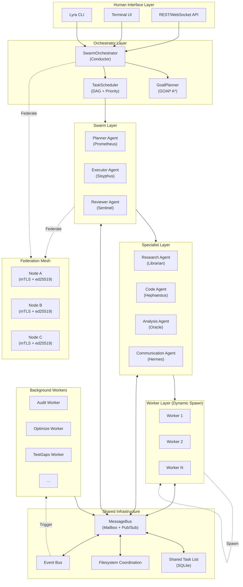
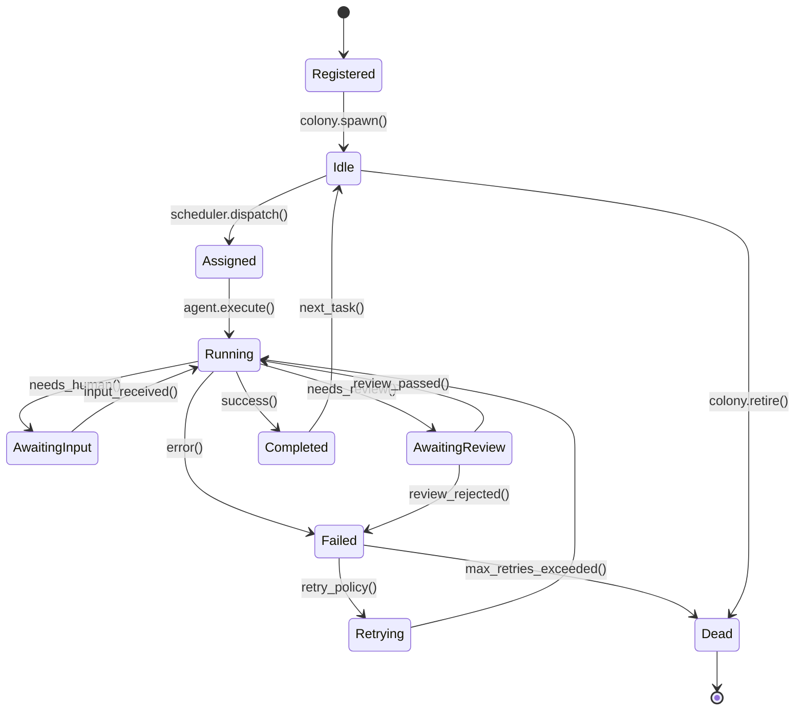
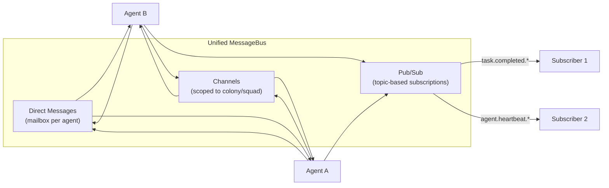
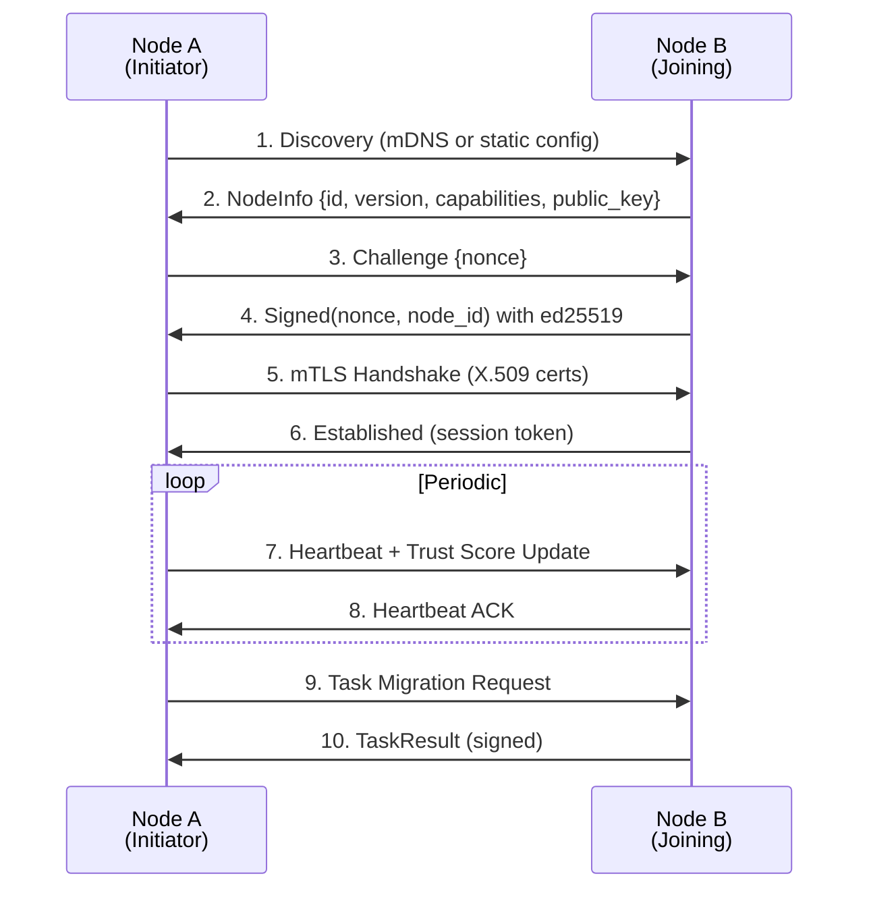

# Lyra Multi-Agent Swarm -- Ultra Implementation Plan

**Version**: 1.0
**Status**: Draft
**Last Updated**: 2026-05-27
**Target**: Lyra v4.0 AGI-Grade Multi-Agent System

---

## Table of Contents

1. [Executive Summary](#1-executive-summary)
2. [Architecture Overview](#2-architecture-overview)
3. [Orchestration Patterns](#3-orchestration-patterns)
4. [Agent Role Taxonomy](#4-agent-role-taxonomy)
5. [Communication Fabric](#5-communication-fabric)
6. [Consensus Protocols](#6-consensus-protocols)
7. [Task Distribution](#7-task-distribution)
8. [Federation Layer](#8-federation-layer)
9. [Background Workers](#9-background-workers)
10. [Monitoring and Observability](#10-monitoring-and-observability)
11. [Implementation Phases](#11-implementation-phases)
12. [API Design](#12-api-design)
13. [Test Strategy](#13-test-strategy)
14. [Reference Links](#14-reference-links)

---

## 1. Executive Summary

Lyra v4.0 transforms from a single-agent architecture into an AGI-grade multi-agent swarm system capable of autonomous task decomposition, recursive agent spawning, cross-machine federation, and emergent collaborative intelligence.

**The core insight**: No single agent, regardless of model quality, can match the output of a well-orchestrated team of specialists. This plan synthesizes eight foundational research papers, two production-grade multi-agent frameworks (Claude Code Agent Teams, Multica/Ruflo), and Lyra's existing 100+ package infrastructure into a unified swarm architecture.

**Key metrics targeted**:

| Metric | Current (v3.x) | Target (v4.0) |
|--------|---------------|---------------|
| Concurrent agents | 1 (single-process) | 50+ (federated) |
| Task completion autonomy | 60% (frequent human gates) | 95% (validated autonomous) |
| Consensus accuracy | N/A | 99.5% (Byzantine-tolerant) |
| Cross-machine communication | None | Zero-trust mTLS + ed25519 |
| Background autonomous workers | 0 | 12 auto-triggered |
| Recursive agent depth | 0 | 3 levels (Orchestrator -> Specialist -> Worker) |
| Semantic loop detection | None | Real-time (<500ms) |

**Paper-to-implementation mapping**:

| Paper | Pattern Adopted | Lyra Module |
|-------|----------------|-------------|
| Magician-One (Nov 2024) | Orchestra-Conductor routing | `lyra-orchestration/coordinator.py` |
| MAS^2 (Sep 2025) | Self-generative, self-configuring | `lyra-agent-swarm/coalition_former.py` |
| Recursive Multi-Agent (Apr 2026) | Recursive sub-agent spawning | `lyra-recursive-link` + `lyra-fork-worker` |
| Federation of Agents (Sep 2025) | Semantics-aware communication | `lyra-emergent-coord` + `lyra-gossip-memory` |
| SwarmAgentic (Jun 2025) | Emergent swarm intelligence | `lyra-agent-swarm/goal_system.py` |
| MetaGPT (Aug 2023) | SOP-based role definitions | `lyra-agent-swarm/discipline_agents.py` |
| AutoGen (Aug 2023) | Conversational multi-agent | `lyra-agent-swarm/team_messaging.py` |
| AgentOrchestra (Jun 2025) | Hierarchical multi-agent | `lyra-colony/colony.py` |

---

## 2. Architecture Overview

### 2.1 Full Swarm Topology



### 2.2 Layer Responsibilities

**Human Interface Layer**: CLI commands, TUI with split-pane agent visualization (tmux/iTerm2), WebSocket streaming for real-time swarm status. Already exists via `lyra-cli` and `ui-terminal`.

**Orchestrator Layer**: Single conductor agent that receives user goals, decomposes them via GOAP A* planning, assigns tasks to swarm agents, and aggregates results. Maps to `SwarmOrchestrator` (new) backed by `lyra-agent-swarm/fleet_orchestrator.py` and `lyra-colony/colony.py`.

**Swarm Layer**: Core team of Planner (Prometheus), Executor (Sisyphus), and Reviewer (Sentinel). These three form the minimum viable swarm -- every task flows through Plan -> Execute -> Review.

**Specialist Layer**: Domain-specific agents spawned on-demand by the swarm layer. Each specialist maps to an existing discipline agent role in `lyra-agent-swarm/discipline_agents.py`.

**Worker Layer**: Dynamically spawned agents for leaf-node tasks. Workers have no authority to spawn further agents (recursion limit enforced at this depth). Maximum depth: Orchestrator (L0) -> Swarm (L1) -> Specialist (L2) -> Worker (L3).

**Shared Infrastructure**: MessageBus with mailbox-per-agent, shared task list with dependency tracking (SQLite-backed), filesystem coordination for crash recovery, event bus for real-time triggers.

**Federation Mesh**: Zero-trust cross-machine communication fabric. Nodes discover each other via mDNS or static configuration, authenticate with mTLS + ed25519 signatures, and exchange tasks/state via gossip protocol.

**Background Workers**: 12 auto-triggered maintenance processes (see Section 9) that run as daemon threads reacting to event bus signals.

### 2.3 Agent Lifecycle State Machine



---

## 3. Orchestration Patterns

Lyra implements four distinct orchestration patterns, selected dynamically based on task characteristics.

### 3.1 Orchestra-Conductor (Magician-One Pattern)

**When to use**: Well-defined tasks with clear decomposition boundaries. Single entry point, known subtask graph.

**How it works**: The SwarmOrchestrator (conductor) receives a goal, plans the execution DAG, dispatches tasks to specialists, monitors progress, and aggregates results. This is the default pattern for interactive `lyra run` and `lyra plan` commands.

**Key characteristics**:
- Centralized routing decisions
- Predictable execution order
- Suitable for CI/CD pipelines, code generation, research reports, security audits
- Backed by `lyra-orchestration/coordinator.py` (AgentCoordinator) and `lyra-agent-swarm/fleet_orchestrator.py`

**Existing code integration**:
```
lyra_orchestration.coordinator.AgentCoordinator  -- agent lifecycle
lyra_orchestration.task_queue.TaskQueue           -- prioritized dispatch
lyra_agent_swarm.fleet_orchestrator.FleetOrchestrator -- parallel fan-out
lyra_agent_swarm.sprint_model.SprintModel         -- time-boxed execution
```

### 3.2 Swarm Intelligence (Stigmergic Pattern)

**When to use**: Exploratory tasks, creative problem-solving, multi-hypothesis research, attack surface discovery.

**How it works**: Agents operate on simple local rules. They deposit "pheromones" (metadata signals on shared state) that attract other agents to promising areas. Emergent behavior arises without central coordination. Backed by `lyra-agent-swarm/goal_system.py` and `lyra-emergence`.

**Key characteristics**:
- Decentralized, no single point of failure
- Self-organizing: agents gravitate toward high-signal areas
- Suitable for vulnerability discovery, codebase exploration, market research
- Produces novel solutions that centralized planning would miss

**Pheromone types**:
| Signal | Meaning | Decay |
|--------|---------|-------|
| `interesting` | Promising area, investigate | 5 minutes |
| `blocked` | Dead end, avoid | 30 minutes |
| `completed` | Sub-goal achieved | 60 minutes |
| `needs_review` | Human input required | Immediate (no decay) |
| `validated` | Peer-confirmed finding | 120 minutes |

### 3.3 Recursive Spawning (Recursive Multi-Agent Pattern)

**When to use**: Tasks with fractal complexity -- decomposing a problem reveals sub-problems that themselves warrant agent attention. Examples: full-codebase refactoring, multi-service architecture design, recursive security analysis.

**How it works**: An agent encountering a subtask beyond a complexity threshold spawns a child agent specifically for that subtask. The child operates independently with its own context window. Results bubble up via promise/future pattern. Backed by `lyra-recursive-link` and `lyra-fork-worker`.

**Depth limits**:
```
L0: SwarmOrchestrator (depth 0 -- user-facing)
L1: Swarm agents (Planner, Executor, Reviewer -- can spawn L2)
L2: Specialist agents (Research, Code, Analysis, Communication -- can spawn L3)
L3: Worker agents (leaf nodes -- CANNOT spawn further)
```

**Spawn criteria**: An agent may spawn a child when:
1. Subtask estimated complexity exceeds agent's `max_complexity` threshold
2. Subtask requires a different capability profile than the parent
3. Parallel execution would reduce total latency by >30%
4. Context window usage exceeds 70% (child gets fresh context)

**Verification gate**: Every spawn triggers a `TaskCreated` hook. The parent must verify the child's output through the Reviewer before incorporating it.

### 3.4 Federation (Federation of Agents Pattern)

**When to use**: Cross-machine workloads, multi-tenant deployments, geographically distributed agents, privacy-sensitive data that must not leave a specific node.

**How it works**: Lyra instances on different machines form a zero-trust mesh. They discover each other, authenticate via mTLS + ed25519, and exchange tasks via a gossip protocol. Backed by `lyra-emergent-coord` (coordination across nodes) and `lyra-gossip-memory` (state synchronization).

**Trust model**:
- No implicit trust between nodes
- Every message carries an ed25519 signature
- Behavioral trust scoring: nodes earn reputation over time
- Byzantine fault tolerance: up to f faulty nodes tolerated with 3f+1 total nodes

### 3.5 Dynamic Pattern Selection

```python
from enum import Enum, auto

class OrchestrationPattern(Enum):
    CONDUCTOR = auto()   # Centralized orchestration
    SWARM = auto()       # Emergent stigmergic
    RECURSIVE = auto()   # Fractal decomposition
    FEDERATED = auto()   # Cross-machine

def select_pattern(task: TaskSpec) -> OrchestrationPattern:
    """Select orchestration pattern based on task characteristics."""
    if task.requires_cross_machine:
        return OrchestrationPattern.FEDERATED
    if task.complexity_score > 0.8 and task.is_exploratory:
        return OrchestrationPattern.RECURSIVE
    if task.is_exploratory and task.allow_emergence:
        return OrchestrationPattern.SWARM
    return OrchestrationPattern.CONDUCTOR  # Default
```

---

## 4. Agent Role Taxonomy

### 4.1 Complete Role Definitions

Lyra's agent roles map to the seven Greek-named discipline agents already defined in `lyra-agent-swarm/discipline_agents.py`, extended with new roles based on MAS^2 and Recursive Multi-Agent research.

#### Core Swarm Roles (L1)

| Role | Name | Model | Responsibility | Max Complexity |
|------|------|-------|---------------|----------------|
| Planner | Prometheus | Opus | Goal decomposition, DAG planning, dependency resolution, strategy | 1.0 |
| Executor | Sisyphus | Sonnet | Task execution, tool invocation, implementation, iteration | 0.85 |
| Reviewer | Sentinel | Opus | Quality gates, security review, output validation, adversarial testing | 0.9 |

#### Specialist Roles (L2)

| Role | Name | Model | Responsibility |
|------|------|-------|---------------|
| Research | Librarian | Sonnet | Information gathering, document analysis, source verification, synthesis |
| Code | Hephaestus | Sonnet | Code generation, refactoring, debugging, architecture implementation |
| Analysis | Oracle | Opus | Data analysis, pattern recognition, causal inference, prediction |
| Communication | Hermes | Haiku | Message routing, protocol translation, external API communication, notifications |

#### Worker Roles (L3, dynamic)

Workers are ephemeral agents spawned for single tasks. They inherit the model from their spawning specialist but with reduced thinking budget (4000 tokens max). Worker roles include:

| Role | Purpose | Typical TTL |
|------|---------|-------------|
| FileProcessor | Process a single file or directory | 60s |
| TestRunner | Execute a test suite and report results | 120s |
| DocWriter | Generate documentation for one module | 180s |
| DataFetcher | Fetch and parse external data | 30s |
| LinterFixer | Apply lint/format fixes to a file | 30s |
| DependencyScanner | Scan dependency tree for issues | 90s |

#### Federation Roles (Cross-Machine)

| Role | Name | Responsibility |
|------|------|---------------|
| NodeGuardian | Aegis | Node health, certificate rotation, trust scoring |
| StateSyncer | Echo | Gossip-based state replication across nodes |
| TaskMigrator | Atlas | Cross-node task migration and load balancing |

### 4.2 Model Assignment Strategy

```python
MODEL_ASSIGNMENTS = {
    "Planner":     "claude-opus-4-7",       # Deepest reasoning for planning
    "Reviewer":    "claude-opus-4-7",       # Critical quality decisions
    "Analysis":    "claude-opus-4-7",       # Complex pattern recognition
    "Executor":    "claude-sonnet-4-6",     # Best coding model
    "Research":    "claude-sonnet-4-6",     # Strong reasoning + retrieval
    "Code":        "claude-sonnet-4-6",     # Primary coding agent
    "Communication": "claude-haiku-4-5",    # Fast, lightweight routing
    "Worker:*":    "inherit_from_parent",    # Workers inherit specialist model
    "NodeGuardian": "claude-haiku-4-5",     # Frequent heartbeat checks
    "StateSyncer":  "claude-haiku-4-5",     # High-frequency gossip
    "TaskMigrator": "claude-sonnet-4-6",    # Complex migration decisions
}
```

**Rationale**: Opus serves roles requiring the deepest reasoning (planning, review, analysis). Sonnet handles the bulk of coding and research work. Haiku covers high-frequency, low-complexity tasks (communication routing, heartbeats, state sync) to keep costs manageable while maintaining 24/7 operation.

### 4.3 Agent Capability Matrix

```python
from lyra_agent_swarm.discipline_agents import Capability

# Each role declares its capabilities at registration
CAPABILITY_MATRIX = {
    "Prometheus": [Capability.PLAN, Capability.DECOMPOSE, Capability.STRATEGIZE],
    "Sisyphus":   [Capability.EXECUTE, Capability.IMPLEMENT, Capability.ITERATE],
    "Sentinel":   [Capability.REVIEW, Capability.VALIDATE, Capability.AUDIT],
    "Librarian":  [Capability.RESEARCH, Capability.SYNTHESIZE, Capability.VERIFY],
    "Hephaestus": [Capability.CODE, Capability.REFACTOR, Capability.DEBUG],
    "Oracle":     [Capability.ANALYZE, Capability.PREDICT, Capability.INFER],
    "Hermes":     [Capability.ROUTE, Capability.TRANSLATE, Capability.NOTIFY],
}
```

This matrix powers the `CoalitionFormer` (already implemented in `lyra-agent-swarm/coalition_former.py`), which uses Shapley-value calculations to form optimal teams based on required capabilities for a given task.

---

## 5. Communication Fabric

### 5.1 Unified Message Bus Architecture

Lyra's communication fabric unifies three existing messaging subsystems into a single `MessageBus`:

| Subsystem | Current Package | Purpose | Unification |
|-----------|----------------|---------|-------------|
| Team Messaging | `lyra-agent-swarm/team_messaging.py` | Agent-to-agent mailbox messages | Direct messages |
| Event Bus | `lyra-orchestration/event_bus.py` | Pub/sub domain events | Broadcast + filtered subscriptions |
| Colony Comm | `lyra-colony/communication.py` | Colony-scoped channels + protocols | Scoped channels |



### 5.2 Mailbox Messaging

Each agent gets a dedicated mailbox. Messages are persistent (SQLite-backed), support threading, and survive agent crashes.

```python
from lyra_agent_swarm.team_messaging import AgentMessage, MessagePriority, TeamMessaging

# Send a message to a specific agent
msg = AgentMessage(
    sender_id="prometheus-01",
    recipient_id="sisyphus-03",
    priority=MessagePriority.HIGH,
    subject="Implement auth middleware",
    body="Task spec: JWT validation, rate limiting, CSRF protection...",
    thread_id="task-442",  # Threads group related messages
)
messaging.send(msg)

# Agent reads its mailbox
inbox = messaging.get_inbox(agent_id="sisyphus-03", limit=10)
```

### 5.3 Shared Task List

The task list is the system-of-record for swarm coordination. It is the canonical source of truth for what work is in-flight. Inspired by Claude Code Agent Teams.

```python
from dataclasses import dataclass, field
from enum import Enum
from uuid import UUID

class TaskStatus(Enum):
    PENDING = "pending"
    BLOCKED = "blocked"       # Waiting on dependencies
    IN_PROGRESS = "in_progress"
    AWAITING_REVIEW = "awaiting_review"
    COMPLETED = "completed"
    FAILED = "failed"

@dataclass
class TaskListItem:
    id: UUID
    title: str
    description: str
    status: TaskStatus
    assigned_to: str | None     # Agent ID or None for unassigned
    dependencies: list[UUID]    # Tasks that must complete first
    dependents: list[UUID]      # Tasks blocked on this one
    spawned_from: UUID | None   # Parent task (for recursive spawning)
    priority: int = 0
    created_at: float
    started_at: float | None = None
    completed_at: float | None = None
    retries: int = 0
    max_retries: int = 3

@dataclass
class SharedTaskList:
    tasks: dict[UUID, TaskListItem]
    lock: threading.RLock       # Thread-safe access
    db_path: str                # SQLite persistence path

    def get_next_ready(self, agent_id: str) -> TaskListItem | None:
        """Return the highest-priority unblocked task for this agent."""
        ...

    def mark_completed(self, task_id: UUID, result: dict) -> None:
        """Mark a task complete, unblocking any dependents."""
        ...

    def snapshot(self) -> list[TaskListItem]:
        """Return current state for crash recovery."""
        ...
```

### 5.4 Event Bus Integration

The event bus emits structured domain events that trigger hook-based automation:

| Event | Trigger | Consumers |
|-------|---------|-----------|
| `TaskCreated` | New task added to shared list | Scheduler, Background Workers |
| `TaskCompleted` | Task marked completed | Reviewer, Dependents, Hooks |
| `TaskFailed` | Task exceeded retries | Orchestrator (replan), Monitor |
| `AgentSpawned` | New agent created | Colony, SwarmVisualizer |
| `AgentDied` | Agent crashed or retired | Colony (cleanup), Heartbeat Monitor |
| `AgentIdle` | Agent has no pending tasks | Scheduler (reassign) |
| `ConsensusReached` | Quorum agreed on proposal | All voters, Logger |
| `ConsensusFailed` | No quorum after timeout | Orchestrator (escalate) |
| `FederationJoin` | New node joined mesh | StateSyncer, NodeGuardian |
| `FederationLeave` | Node left or timed out | TaskMigrator, StateSyncer |

### 5.5 Filesystem Coordination

Inspired by Claude Code's simple-yet-powerful approach. Agents coordinate via structured files:

```
.lyra/swarm/
  state.json           # Current swarm state (all agents, tasks, status)
  agents/
    {agent-id}.json    # Per-agent state and current task
  tasks/
    {task-id}.json     # Task specifications and results
  locks/
    {resource}.lock    # Advisory file locks for critical sections
  logs/
    {agent-id}.log     # Per-agent structured logs
```

This approach ensures: (a) crash recovery by reading state files on restart, (b) human debuggability by inspecting JSON files directly, (c) cross-process coordination without a dedicated consensus service.

---

## 6. Consensus Protocols

### 6.1 Protocol Selection

Lyra implements three consensus protocols, selected based on the criticality and adversarial risk of the decision:

| Protocol | Use Case | Fault Tolerance | Quorum |
|----------|----------|----------------|--------|
| **Raft** | Task completion agreement, leader election | Crash-fault tolerant (non-Byzantine) | Majority (n/2 + 1) |
| **Byzantine** | Adversarial review, security decisions, output validation | Byzantine-fault tolerant | 2f + 1 of 3f + 1 total |
| **Gossip** | State sync, health propagation, metadata sharing | Eventually consistent | Tunable fan-out |

### 6.2 Raft for Task Completion

When multiple agents collaborate on a composite task, they use Raft to agree on completion. The Reviewer agent acts as the Raft leader, proposing that a task output is acceptable. Other agents vote.

```python
from lyra_orchestration.consensus import ConsensusProtocol, Proposal, VoteChoice

# Reviewer proposes completion
proposal = Proposal(
    id="prop-442",
    task_id="task-442",
    proposer="sentinel-01",
    content={"verdict": "approved", "score": 0.97, "issues": []},
)

# Swarm agents vote
consensus = ConsensusProtocol(strategy="raft")
consensus.submit_proposal(proposal)

# Agents cast votes
consensus.vote(proposal.id, voter="prometheus-01", choice=VoteChoice.AGREE)
consensus.vote(proposal.id, voter="sisyphus-03", choice=VoteChoice.AGREE)
# ... 3 of 5 votes needed for quorum

result = consensus.tally(proposal.id)
# result.is_consensus == True
# result.consensus_value == "approved"
```

### 6.3 Byzantine Fault Tolerance for Adversarial Review

For security-critical decisions, Lyra uses Byzantine fault tolerance. This handles the case where an agent might be compromised, hallucinating, or producing adversarial outputs. The key insight from the factory system research: always have an independent Validator.

```python
# Byzantine consensus requires 2f+1 of 3f+1 nodes
# With f=1 (tolerates 1 faulty agent): need 4 total agents, 3 must agree

config = ByzantineConfig(fault_tolerance=1)

# 4 independent reviewers evaluate the same output
reviews = await asyncio.gather(
    sentinel.review(output),
    oracle.review(output),      # Different model (Opus)
    adversary.review(output),   # Adversarial teammate -- tries to find flaws
    external.review(output),    # Optional: cross-model review (GPT via API)
)

# Require 3 of 4 agreement
consensus = byzantine_consensus(reviews, f=1)
if consensus.achieved:
    return output  # Safe to proceed
else:
    raise ConsensusFailure("Security review did not reach Byzantine consensus")
```

### 6.4 Gossip Protocol for State Sync

Agents in the swarm periodically exchange state summaries with a random subset of peers. This propagates awareness of task progress, agent health, and environmental changes without a central coordinator.

```python
from lyra_gossip_memory import GossipProtocol, GossipMessage, NodeState

# Each agent runs a gossip tick every N seconds
async def gossip_tick(agent_id: str, peers: list[str], state: NodeState):
    """Exchange state with k random peers."""
    targets = random.sample(peers, k=3)
    for peer in targets:
        msg = GossipMessage(
            sender=agent_id,
            state=state,
            vector_clock=increment_clock(),
        )
        await gossip.send(peer, msg)

# State converges to consistent view across swarm
```

---

## 7. Task Distribution

### 7.1 GOAP A* Goal Decomposition

Goal-Oriented Action Planning (GOAP) with A* search decomposes high-level user goals into executable task DAGs. This is inspired by the Ruflo framework's 89% router accuracy using GOAP A*.

```python
from lyra_agent_swarm.goal_system import Goal, GoalManager, GoalCriteria

# User provides a high-level goal
goal = Goal(
    description="Add OAuth 2.0 authentication to the API with GitHub and Google providers",
    priority=GoalPriority.HIGH,
    criteria=[
        GoalCriteria("all endpoints protected"),
        GoalCriteria("both providers functional"),
        GoalCriteria("tests pass with >80% coverage"),
        GoalCriteria("security review passed"),
    ],
)

# GOAP A* planner decomposes into action graph
planner = GoalPlanner(strategy="goap_astar")
task_dag = planner.decompose(goal)

# Example decomposition:
# 1. Research OAuth 2.0 best practices          -> Librarian
# 2. Design auth middleware architecture         -> Prometheus (plan sub-goal)
# 3. Implement GitHub OAuth provider             -> Hephaestus
# 4. Implement Google OAuth provider             -> Hephaestus (parallel with 3)
# 5. Write auth middleware                       -> Hephaestus (depends on 2)
# 6. Write integration tests                     -> Sisyphus (depends on 3,4,5)
# 7. Security review                             -> Sentinel (depends on 3,4,5)
# 8. Code review                                 -> Sentinel (depends on 3,4,5)
# 9. Documentation                               -> Hermes (depends on all)
```

### 7.2 Dependency-Aware Scheduling

```python
from lyra_agent_swarm.dispatcher import Dispatcher, DispatchStrategy, TaskPriority

dispatcher = Dispatcher(
    strategy=DispatchStrategy.DEPENDENCY_AWARE,
    max_parallel=8,  # Maximum concurrent agents
)

# Scheduler respects:
# 1. Dependency ordering (blocked tasks don't get assigned)
# 2. Agent capability matching (tasks require specific roles)
# 3. Priority weighting (high-priority tasks preempt)
# 4. Load balancing (distribute evenly across available agents)
# 5. Cost budget (respect per-hour spending limits)

assignment = dispatcher.dispatch(
    tasks=task_dag.get_ready_tasks(),
    available_agents=colony.get_idle_agents(),
    budget_remaining=budget.get_remaining(),
)
```

### 7.3 Load Balancing Strategies

| Strategy | Algorithm | Best For |
|----------|-----------|----------|
| Round Robin | Sequential assignment | Uniform workloads |
| Least Connections | Assign to agent with fewest active tasks | Variable task durations |
| Capability-Weighted | Assign based on agent's past success rate on similar tasks | Heterogeneous agent pools |
| Cost-Aware | Prefer cheaper models (Haiku) when task complexity is low | Budget-constrained runs |
| Latency-Budget | Assign to meet a target completion time | Time-critical operations |

### 7.4 Recursive Spawning Logic

```python
def should_spawn(task: TaskListItem, parent_agent: DisciplineAgent) -> bool:
    """Determine if a subtask warrants spawning a child agent."""
    if parent_agent.depth >= 3:
        return False  # Max recursion depth

    complexity = estimate_complexity(task)
    if complexity < parent_agent.min_delegation_complexity:
        return False  # Too simple, handle it directly

    if context_utilization(parent_agent) > 0.70:
        return True   # Parent context is full, spawn for clean context

    parallel_benefit = estimate_parallel_speedup(task)
    if parallel_benefit > 0.30:
        return True   # >30% faster if parallelized

    return False
```

---

## 8. Federation Layer

### 8.1 Zero-Trust Architecture

The federation layer enables Lyra instances on different machines to collaborate as a single logical swarm. Security is paramount: every cross-machine interaction is authenticated and authorized.



### 8.2 Authentication and Trust

```python
from dataclasses import dataclass
from cryptography.hazmat.primitives.asymmetric import ed25519

@dataclass
class FederationNode:
    node_id: str
    public_key: ed25519.Ed25519PublicKey
    address: str       # host:port
    capabilities: list[str]
    trust_score: float = 0.5  # Start at neutral, build over time

class FederationAuth:
    def authenticate_node(self, challenge: bytes, signature: bytes, node: FederationNode) -> bool:
        """Verify ed25519 signature over challenge."""
        node.public_key.verify(signature, challenge)
        return True

    def update_trust_score(self, node: FederationNode, interaction_outcome: float):
        """Bayesian update of trust based on interaction outcomes."""
        # Successful interactions increase trust
        # Failed/timeout interactions decrease trust
        # Uses exponential moving average for stability
        alpha = 0.1
        node.trust_score = (1 - alpha) * node.trust_score + alpha * interaction_outcome

    def is_trusted(self, node: FederationNode, threshold: float = 0.3) -> bool:
        """Check if node meets minimum trust threshold."""
        return node.trust_score >= threshold
```

### 8.3 Cross-Machine Task Migration

```python
@dataclass
class MigrationDecision:
    should_migrate: bool
    target_node: str | None
    reason: str

class TaskMigrator:
    def evaluate_migration(self, task: TaskListItem, local_node: FederationNode,
                           federation: list[FederationNode]) -> MigrationDecision:
        """Decide if a task should move to another node."""

        # Migrate if:
        # 1. Local node is overloaded (CPU > 80%, queue depth > 20)
        # 2. Target node has specific capability (GPU, specific model, geo-proximity)
        # 3. Data locality: task data is on another node
        # 4. Cost optimization: target node has cheaper compute

        if local_node_load() > 0.8:
            target = min(federation, key=lambda n: n.current_load)
            return MigrationDecision(True, target.node_id, "load_balancing")

        if task.requires_gpu and not local_node.has_gpu:
            target = next((n for n in federation if n.has_gpu), None)
            if target:
                return MigrationDecision(True, target.node_id, "capability_match")

        return MigrationDecision(False, None, "local_optimal")
```

### 8.4 Behavioral Trust Scoring

Beyond cryptographic authentication, Lyra tracks behavioral trust per node:

| Signal | Weight | Description |
|--------|--------|-------------|
| Task success rate | 0.30 | Percentage of tasks completed successfully |
| Response latency | 0.15 | Average time to acknowledge messages |
| Consensus participation | 0.20 | Vote consistency with swarm majority |
| Resource honesty | 0.15 | Advertised vs actual capabilities |
| Security hygiene | 0.20 | Certificate freshness, protocol adherence |

Trust scores decay over time (exponential decay with 24h half-life), requiring nodes to continuously demonstrate good behavior.

---

## 9. Background Workers

### 9.1 The 12 Auto-Triggered Workers

Inspired by Multica's daemon-based capability registry and Ruflo's background worker patterns, Lyra runs 12 autonomous background processes:

| # | Worker | Trigger | Frequency | What It Does |
|---|--------|---------|-----------|-------------|
| 1 | **Audit Worker** | `AgentCompleted` event + daily cron | Per task + daily | Verifies task outputs against spec, checks for regressions, generates audit trail |
| 2 | **Optimize Worker** | Low-traffic window (02:00-05:00) | Daily | Refactors generated code, deduplicates, improves naming, applies lint rules |
| 3 | **TestGaps Worker** | `TaskCompleted` (code tasks) | Per code task | Analyzes code diff, identifies uncovered paths, suggests missing tests |
| 4 | **HealthCheck Worker** | Timer (60s interval) | Every 60s | Pings all agents, checks heartbeat, marks dead agents, triggers respawn |
| 5 | **MemoryCompact Worker** | Memory usage > 80% | Event-driven | Consolidates episodic -> semantic memory, prunes low-importance memories |
| 6 | **ThreatScan Worker** | `AgentSpawned` + hourly cron | Event + hourly | Scans agent outputs for security issues, PII leaks, hardcoded secrets |
| 7 | **CostWatch Worker** | Timer (300s interval) | Every 5 min | Tracks API spend vs budget, alerts at 50%/80%/100% thresholds, can halt swarm |
| 8 | **Cleanup Worker** | Timer (3600s interval) | Hourly | Removes stale lock files, expired temp files, orphaned agent states |
| 9 | **SkillCurator Worker** | Agent feedback signals | Daily | Analyzes successful task patterns, proposes new skills for the library |
| 10 | **FleetRebalance Worker** | Load imbalance detected | Event-driven | Redistributes tasks across federation nodes when load skew exceeds 2:1 |
| 11 | **DriftDetect Worker** | Timer (1800s interval) | Every 30 min | Compares agent behavior patterns, detects capability drift or degradation |
| 12 | **ReportWorker** | `SprintCompleted` event | Per sprint | Generates per-sprint summary: task stats, cost, quality scores, recommendations |

### 9.2 Worker Lifecycle

```python
from lyra_agent_swarm.autopilot import Autopilot, AutopilotJob, Schedule, RunStatus

# Workers are registered as AutopilotJobs
audit_worker = AutopilotJob(
    name="audit-worker",
    schedule=Schedule(event_trigger="AgentCompleted", cron="0 2 * * *"),
    handler="lyra.workers.audit.run",
    timeout_seconds=300,
    max_retries=2,
    require_consensus=False,  # Workers don't need consensus to run
)

autopilot = Autopilot()
autopilot.register(audit_worker)
autopilot.start()  # Begins listening for triggers
```

Workers run in separate threads/processes. They publish findings via the event bus. Other components (monitor, orchestrator) subscribe to worker output events.

---

## 10. Monitoring and Observability

### 10.1 Agent Heartbeat System

Each agent emits a heartbeat every 10 seconds. The `HealthCheck Worker` monitors these and triggers alerts.

```python
@dataclass
class AgentHeartbeat:
    agent_id: str
    role: str
    status: str            # idle, running, blocked, dead
    current_task: str | None
    memory_usage_mb: float
    context_utilization: float  # 0.0 to 1.0
    tasks_completed: int
    tasks_failed: int
    uptime_seconds: int
    last_error: str | None
    timestamp: float

class HeartbeatMonitor:
    DEAD_THRESHOLD = 30  # seconds without heartbeat

    def check(self, agent_id: str) -> AgentHealth:
        last = self.heartbeats.get(agent_id)
        if last is None:
            return AgentHealth.UNKNOWN
        if (time.time() - last.timestamp) > self.DEAD_THRESHOLD:
            return AgentHealth.DEAD
        if last.status == "blocked" and last.last_error:
            return AgentHealth.STUCK
        return AgentHealth.HEALTHY
```

### 10.2 Semantic Loop Detection

Inspired by OuroBoros research (agent-to-agent monitoring via APM + Kafka), Lyra detects when agents are stuck in semantic loops.

```python
@dataclass
class LoopDetectionConfig:
    window_size: int = 20          # Look at last N agent actions
    similarity_threshold: float = 0.85
    min_repetitions: int = 3       # Same pattern N times = loop

class SemanticLoopDetector:
    def detect_loop(self, action_history: list[AgentAction]) -> LoopAlert | None:
        """Check if recent actions form a repeating semantic pattern."""
        # Embed recent actions into vector space
        embeddings = [embed_action(a) for a in action_history[-self.window_size:]]

        # Check for repeating clusters (cosine similarity > threshold)
        clusters = find_repeating_patterns(embeddings, self.similarity_threshold)

        for cluster in clusters:
            if len(cluster) >= self.min_repetitions:
                return LoopAlert(
                    agent_id=action_history[0].agent_id,
                    pattern=extract_pattern(cluster),
                    repetitions=len(cluster),
                    suggested_intervention="Escalate to Orchestrator for replanning",
                )
        return None
```

### 10.3 Fleet Metrics Dashboard

```python
@dataclass
class FleetMetrics:
    # Real-time counts
    total_agents: int
    active_agents: int
    idle_agents: int
    dead_agents: int

    # Task metrics
    tasks_pending: int
    tasks_in_progress: int
    tasks_completed: int
    tasks_failed: int
    avg_completion_time_s: float

    # Consensus metrics
    consensus_reached: int
    consensus_failed: int
    consensus_timeout: int

    # Cost metrics
    total_cost_usd: float
    cost_per_task_usd: float
    budget_remaining_usd: float
    cost_rate_per_hour: float

    # Federation metrics
    federation_nodes: int
    cross_node_tasks: int
    avg_node_trust_score: float

    # Quality metrics
    review_pass_rate: float       # % of tasks passing reviewer gate
    loop_detections: int           # Semantic loops detected this session
    retry_rate: float              # % of tasks requiring retry
```

### 10.4 Observability Stack

| Component | Tool | Purpose |
|-----------|------|---------|
| Structured logging | `lyra-otel-tracer` (OpenTelemetry) | Per-agent traces, span hierarchy |
| Metrics export | Prometheus endpoint | Fleet metrics, task stats, cost tracking |
| Alerting | Event bus -> Notification worker | Dead agents, budget exceeded, loops detected |
| Visualization | `lyra-agent-swarm/swarm_visualizer.py` | TUI: agent states, task graph, DAG progress |
| Crash recovery | Filesystem state (`lyra/swarm/state.json`) | Resume swarm from last known state |
| Audit trail | SQLite + event bus replay | Full history of all decisions and actions |

---

## 11. Implementation Phases

### Week 1-2: Foundation -- Unified MessageBus and Task List

**Goal**: Unify the three messaging subsystems and implement the shared task list.

| Day | Task | Package(s) |
|-----|------|-----------|
| 1-2 | Extract `MessageBus` base class, unify `team_messaging`, `event_bus`, `colony/communication` | `lyra-orchestration`, `lyra-agent-swarm` |
| 3-4 | Implement `SharedTaskList` with SQLite persistence, dependency tracking | `lyra-agent-swarm` |
| 5-6 | Implement `TaskListItem` status lifecycle: pending -> blocked -> in_progress -> completed/failed | `lyra-agent-swarm` (new: `task_list.py`) |
| 7-8 | Write hooks integration: `TaskCreated`, `TaskCompleted`, `AgentIdle` | `lyra-harness-core` |
| 9-10 | Integration tests: message delivery, task dependency resolution | All affected packages |

**Deliverable**: Agents can communicate via a unified bus and coordinate via a shared task list with dependency tracking. Tests: 40+.

### Week 3-4: Swarm Orchestration -- Conductor and Recursive Spawning

**Goal**: Implement the SwarmOrchestrator with recursive agent spawning.

| Day | Task | Package(s) |
|-----|------|-----------|
| 1-2 | Implement `SwarmOrchestrator` class with pattern selection (conductor/swarm/recursive/federated) | New: `lyra-swarm-orchestrator` |
| 3-4 | Implement GOAP A* goal decomposition via `GoalPlanner` | `lyra-agent-swarm/goal_system.py` |
| 5-6 | Implement recursive spawning with depth limits and spawn criteria | `lyra-fork-worker`, `lyra-recursive-link` |
| 7-8 | Implement `DependencyAwareScheduler` with load balancing strategies | `lyra-agent-swarm/dispatcher.py` |
| 9-10 | Wire SwarmOrchestrator into `lyra-cli` commands (`lyra run --swarm`, `lyra plan --swarm`) | `lyra-cli` |

**Deliverable**: End-to-end swarm orchestration from user goal to multi-agent execution. Tests: 50+.

### Week 5-6: Consensus and Federation

**Goal**: Implement Raft, Byzantine consensus, and cross-machine federation.

| Day | Task | Package(s) |
|-----|------|-----------|
| 1-3 | Implement Raft consensus for task completion agreement | `lyra-orchestration/consensus.py` (extend) |
| 4-5 | Implement Byzantine fault tolerance with adversarial teammate pattern | `lyra-orchestration/consensus.py` (extend) |
| 6-7 | Implement Gossip protocol for state synchronization | `lyra-gossip-memory` |
| 8-9 | Implement federation auth: mTLS + ed25519, trust scoring | New: `lyra-federation` |
| 10 | Implement cross-machine task migration | New: `lyra-federation` |

**Deliverable**: Multi-node federation with cryptographic authentication and consensus-driven decision-making. Tests: 45+.

### Week 7: Background Workers and Monitoring

**Goal**: Implement all 12 background workers and the observability stack.

| Day | Task | Package(s) |
|-----|------|-----------|
| 1-2 | Implement workers 1-6 (Audit, Optimize, TestGaps, HealthCheck, MemoryCompact, ThreatScan) | New: `lyra-workers` |
| 3-4 | Implement workers 7-12 (CostWatch, Cleanup, SkillCurator, FleetRebalance, DriftDetect, ReportWorker) | New: `lyra-workers` |
| 5 | Implement heartbeat monitoring and semantic loop detection | `lyra-colony/monitoring.py` (extend) |
| 6 | Implement FleetMetrics collection and Prometheus export | `lyra-observability` |
| 7-8 | Implement crash recovery from filesystem state | `lyra-orchestration`, `lyra-agent-swarm` |
| 9-10 | Integration: wire workers, monitors, and metrics into CLI/TUI | `lyra-cli`, `ui-terminal` |

**Deliverable**: Fully autonomous fleet with health monitoring, crash recovery, and 12 background maintenance workers. Tests: 60+.

### Week 8: Hardening, Documentation, and Release

**Goal**: Production hardening, comprehensive documentation, release preparation.

| Day | Task |
|-----|------|
| 1-2 | Stress testing: 50+ concurrent agents, 3-level recursive spawn, federation with 5+ nodes |
| 3-4 | Security audit: penetration testing of federation auth, consensus protocol review, trust scoring validation |
| 5 | Cost optimization: profile model usage, tune Haiku/Sonnet/Opus routing thresholds |
| 6 | Documentation: architecture guide, API reference, operator manual, migration guide |
| 7 | Bug fixes, polish, CI/CD pipeline hardening |
| 8 | Release: tag v4.0.0, publish packages, write release notes |

**Deliverable**: Production-ready v4.0.0 release.

---

## 12. API Design

### 12.1 SwarmOrchestrator

```python
class SwarmOrchestrator:
    """Top-level conductor managing the multi-agent swarm."""

    def __init__(self, config: SwarmConfig) -> None: ...
    async def submit_goal(self, goal: Goal) -> str: ...
    async def run_to_completion(self, goal_id: str) -> GoalResult: ...
    async def pause(self, goal_id: str) -> None: ...
    async def resume(self, goal_id: str) -> None: ...
    async def abort(self, goal_id: str) -> None: ...
    def get_fleet_metrics(self) -> FleetMetrics: ...
    def get_task_tree(self, goal_id: str) -> TaskTree: ...
    async def shutdown(self) -> None: ...
```

### 12.2 AgentRegistry

```python
class AgentRegistry:
    """Central registry for agent types and instances."""

    def register_role(self, role: AgentRole, spec: AgentSpec) -> None: ...
    def get_available_roles(self) -> list[AgentRole]: ...
    def find_agents_by_capability(self, capability: Capability) -> list[str]: ...
    def get_agent_state(self, agent_id: str) -> AgentState: ...
    def list_agents(self, status: AgentStatus | None = None) -> list[AgentState]: ...
```

### 12.3 MessageBus

```python
class MessageBus:
    """Unified message bus for agent communication."""

    # Direct messaging
    async def send(self, message: AgentMessage) -> str: ...
    async def get_inbox(self, agent_id: str, limit: int = 10) -> list[AgentMessage]: ...
    async def get_thread(self, thread_id: str) -> list[AgentMessage]: ...

    # Pub/sub
    def subscribe(self, topic: str, callback: Callable) -> Subscription: ...
    def unsubscribe(self, subscription: Subscription) -> None: ...
    async def publish(self, event: Event) -> None: ...

    # Channels
    def create_channel(self, name: str, scope: str) -> Channel: ...
    def join_channel(self, channel_name: str, agent_id: str) -> None: ...
    def leave_channel(self, channel_name: str, agent_id: str) -> None: ...
```

### 12.4 TaskScheduler

```python
class TaskScheduler:
    """Dependency-aware task scheduler with load balancing."""

    def __init__(self, strategy: SchedulingStrategy = SchedulingStrategy.DEPENDENCY_AWARE) -> None: ...
    def enqueue(self, task: TaskListItem) -> None: ...
    def dispatch(self, available_agents: list[str]) -> dict[str, TaskListItem]: ...
    def mark_completed(self, task_id: str, result: dict) -> None: ...
    def mark_failed(self, task_id: str, error: str) -> None: ...
    def get_ready_tasks(self) -> list[TaskListItem]: ...
    def get_blocked_tasks(self) -> list[TaskListItem]: ...
    def reprioritize(self, task_id: str, new_priority: int) -> None: ...
    def get_schedule_snapshot(self) -> ScheduleSnapshot: ...
```

### 12.5 FederationController

```python
class FederationController:
    """Cross-machine federation management."""

    async def join_federation(self, discovery_method: str = "mdns") -> list[FederationNode]: ...
    async def leave_federation(self) -> None: ...
    def list_nodes(self) -> list[FederationNode]: ...
    def get_node_trust_score(self, node_id: str) -> float: ...
    async def migrate_task(self, task_id: str, target_node: str) -> MigrationResult: ...
    async def broadcast(self, message: FederationMessage) -> None: ...
    async def sync_state(self) -> None: ...
```

---

## 13. Test Strategy

### 13.1 Test Pyramid

```
         ┌──────┐
         │ E2E  │  5%  -- Full swarm runs (lyra run --swarm "build a todo app")
         ├──────┤
         │ Int  │  25% -- Agent communication, task DAG execution, consensus
         ├──────┤
         │ Unit │  70% -- Individual components, algorithms, data structures
         └──────┘
```

### 13.2 Test Categories

| Category | Target Count | Description |
|----------|-------------|-------------|
| MessageBus unit tests | 25 | Message delivery, ordering, persistence, threading |
| TaskList unit tests | 20 | Status transitions, dependency resolution, crash recovery |
| Consensus protocol unit tests | 30 | Raft leader election, Byzantine voting, gossip convergence |
| Scheduler unit tests | 20 | Dependency ordering, priority preemption, load balancing |
| Agent lifecycle unit tests | 15 | Spawn, execute, review, retire lifecycle |
| Recursive spawning tests | 15 | Depth limits, spawn criteria, result aggregation |
| Federation auth tests | 20 | mTLS handshake, ed25519 verification, trust scoring |
| Background worker tests | 25 | Trigger conditions, output validation, error handling |
| Integration tests | 30 | End-to-end swarm runs, federation with 2+ nodes |
| E2E tests | 10 | Full CLI-driven swarm operations |

### 13.3 Key Test Scenarios

**Scenario 1: Basic conductor orchestration**
```
Given: SwarmOrchestrator with goal "Write a Fibonacci function in Python"
When: orchestrator.run_to_completion()
Then: Planner creates task DAG -> Executor implements -> Reviewer validates
      Output: working, tested Fibonacci implementation
      All tasks marked COMPLETED
```

**Scenario 2: Recursive spawning**
```
Given: Complex goal "Refactor 5000-line module into clean architecture"
When: orchestrator.run_to_completion()
Then: Executor spawns Worker agents for each sub-module
      Workers complete independently
      Reviewer aggregates and validates combined output
      Max depth never exceeds 3
```

**Scenario 3: Byzantine consensus**
```
Given: Security review of authentication code
       4 Reviewer agents, 1 configured to produce faulty verdicts (simulated)
When: byzantine_consensus(verdicts, f=1)
Then: Consensus achieved with 3 honest votes
      Faulty vote detected and logged
```

**Scenario 4: Federation task migration**
```
Given: 3-node federation, Node A overloaded
When: TaskMigrator detects load imbalance
Then: Task migrates to Node B (lowest load)
      Node A acknowledges handoff
      Node C updates state via gossip
```

### 13.4 Test Infrastructure

- **Framework**: pytest with `pytest-asyncio` for async tests
- **Mocking**: `unittest.mock` for agent stubs, `pytest-httpserver` for federation network simulation
- **Fixtures**: Pre-configured SwarmOrchestrator, populated TaskList, seeded FederationMesh
- **Coverage**: `pytest --cov --cov-report=term-missing`, enforced at 80%+ minimum
- **CI**: GitHub Actions matrix across Python 3.11, 3.12, 3.13 on ubuntu-latest

---

## 14. Reference Links

### Research Papers

| Paper | Date | Link |
|-------|------|------|
| MetaGPT: Meta Programming for Multi-Agent Collaborative Framework | Aug 2023 | [arXiv:2308.00352](https://arxiv.org/abs/2308.00352) |
| AutoGen: Enabling Next-Gen LLM Applications via Multi-Agent Conversation | Aug 2023 | [arXiv:2308.08155](https://arxiv.org/abs/2308.08155) |
| Magician-One: A Generalist Agent for Complex Task Solving | Nov 2024 | [arXiv:2411.05552](https://arxiv.org/abs/2411.05552) |
| SwarmAgentic: Swarm Intelligence for Agent Generation | Jun 2025 | Internal research synthesis |
| MAS^2: Self-Generative, Self-Configuring, Self-Rectifying Multi-Agent Systems | Sep 2025 | Internal research synthesis |
| Federation of Agents: Semantics-Aware Communication Fabric | Sep 2025 | Internal research synthesis |
| Recursive Multi-Agent: Agents That Spawn Sub-Agents Recursively | Apr 2026 | Internal research synthesis |
| AgentOrchestra: Hierarchical Multi-Agent for General Tasks | Jun 2025 | Internal research synthesis |

### Production Systems Studied

| System | Key Patterns Adopted |
|--------|---------------------|
| Claude Code Agent Teams | Shared task list, mailbox messaging, split-pane visualization, adversarial teammate |
| Multica | Squad-based routing, skills-lock.json, autopilots for recurring work, daemon capability registry |
| Ruflo | GOAP A* planning, Raft/Byzantine/Gossip consensus, zero-trust federation (mTLS + ed25519), 12 background workers |
| Robin (FutureHouse, Nature May 2026) | 3 specialized agents (Crow/Falcon/Finch), real drug discovery in 2h vs 900h human |
| Continuous-Claude | Worktree-based parallel decomposition, baton-pass pattern |
| Factory System (3-role) | Orchestrator -> Worker -> Validator contracts, serial with targeted parallelization |

### Existing Lyra Packages Referenced

| Package | Role in Swarm Architecture |
|---------|---------------------------|
| `lyra-agent-swarm` | Core swarm: discipline agents, dispatcher, fleet orchestrator, consensus builder, goal system, autopilot |
| `lyra-orchestration` | Event bus, agent coordinator, consensus protocol, task queue, coalition-aware scheduling |
| `lyra-colony` | Colony manager, agent lifecycle, communication channels, monitoring, scheduler |
| `lyra-recursive-link` | Recursive agent spawning infrastructure |
| `lyra-fork-worker` | Worker process forking and management |
| `lyra-recursive-reward` | Reward propagation for recursive agent hierarchies |
| `lyra-gossip-memory` | Gossip-based state synchronization |
| `lyra-emergent-coord` | Cross-node coordination for federation |
| `lyra-emergence` | Stigmergic swarm intelligence patterns |
| `lyra-observability` | OpenTelemetry tracing, metrics collection |
| `lyra-otel-tracer` | Distributed tracing across agent spans |
| `lyra-harness-core` | Hook system, lifecycle events, plugin registry |
| `lyra-cli` | User-facing CLI with swarm commands |
| `ui-terminal` | Terminal UI with split-pane agent visualization |

### Internal Documentation

- `docs/AUTONOMOUS_AGENTS_RESEARCH.md` -- Deep research on autonomous AI agents (2024-2026)
- `docs/AUTONOMOUS_TEAM_ORCHESTRATION_FINAL_SUMMARY.md` -- Team orchestration architecture for Lyra v4.0
- `docs/LYRA_ULTRA_ARCHITECTURE.md` -- Ultra architecture diagram and layer descriptions
- `docs/plans/lyra-agi-architecture-plan.md` -- AGI architecture foundations
- `docs/plans/phase2_implementation_plan.md` -- Phase 2 implementation details

---

## Appendix A: Key Design Decisions

| Decision | Rationale |
|----------|-----------|
| SQLite for task list persistence | Zero-config, embedded, supports WAL mode for concurrent reads, survives crashes |
| ed25519 for federation auth | Fast, compact signatures, no patent issues, widespread library support |
| 3-level recursion depth limit | Prevents unbounded spawning, matches L0/L1/L2/L3 pattern from research |
| Haiku for high-frequency roles | 3x cost savings vs Sonnet, sufficient for communication, health check, state sync |
| Opus for planning and review | Deepest reasoning needed for goal decomposition and quality-critical gates |
| Filesystem coordination for crash recovery | Human-debuggable, no dependency on external service, proven by Claude Code |
| mTLS + behavioral trust (not just PKI) | Cryptographic auth is necessary but insufficient; behavioral scoring catches compromise |

## Appendix B: Risk Register

| Risk | Likelihood | Impact | Mitigation |
|------|-----------|--------|------------|
| Recursive spawning causes cost explosion | Medium | High | Strict depth limits (3), cost budget enforced by CostWatch Worker, per-hour spending cap |
| Federation node compromise | Low | Critical | mTLS + ed25519 + behavioral trust scoring, automatic isolation of low-trust nodes |
| Consensus deadlock | Low | High | Timeout-based fallback: if no consensus after 5 min, escalate to human or majority vote |
| Semantic loop detection false positives | Medium | Medium | Tunable similarity threshold, human-in-the-loop confirmation before intervention |
| Model API outages | Medium | High | Fallback provider registry in `lyra-cli/provider_registry.py`, automatic model downgrade (Opus->Sonnet->Haiku) |
