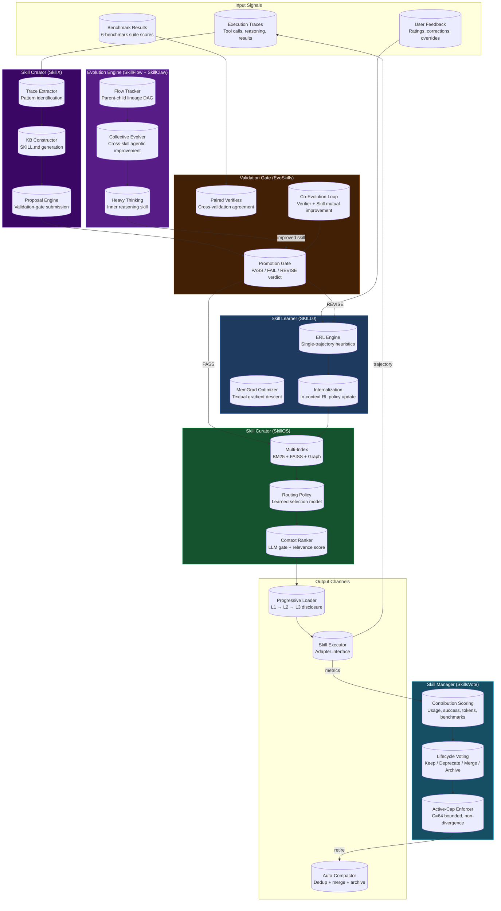
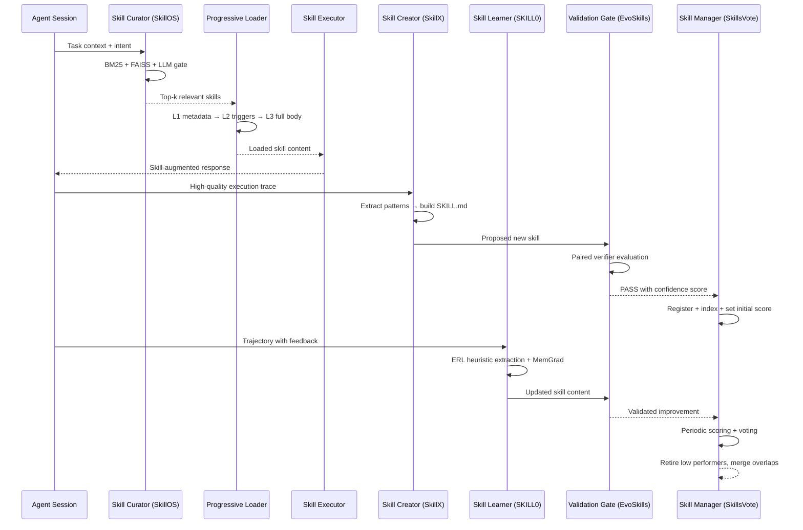
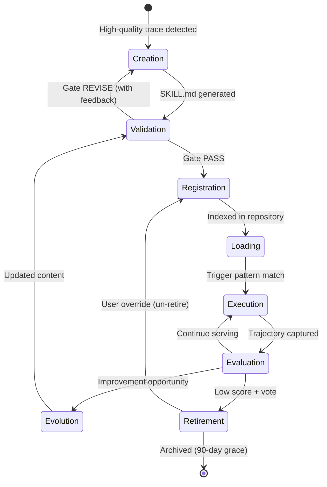

# LYRA ULTRA PLAN: Skills Ecosystem -- Research Synthesis & Implementation Blueprint

**Version:** 1.0.0
**Status:** Draft
**Created:** 2026-05-27
**Author:** Lyra AGI Research Team
**Estimated Duration:** 8 weeks (2 months)
**Target Completion:** 2026-07-22
**Parent Plans:** [LYRA_ULTRA_PLAN_7_SKILLS_ECOSYSTEM.md](../../plans/LYRA_ULTRA_PLAN_7_SKILLS_ECOSYSTEM.md) (catalog), [LYRA_ULTRA_PLAN_21_SKILLS_ECOSYSTEM_EVOLUTION.md](../../plans/LYRA_ULTRA_PLAN_21_SKILLS_ECOSYSTEM_EVOLUTION.md) (evolution engine)
**Absorbs:** Research papers SKILL0, SkillX, SkillClaw, SkillOS, EvoSkills, CASCADE, SkillsVote, SkillFlow, HEAVYSKILL

---

## Document Overview

**Purpose:** Synthesize 9 breakthrough research papers (April--May 2026), Claude Code skills architecture, Hermes agent skills patterns, and 64 proposed domain skills into a unified, actionable implementation plan for Lyra's skills ecosystem.

**Scope:** End-to-end skills lifecycle -- from automatic creation through execution, evaluation, evolution, and retirement. Covers all 9 domains, 64+ skills, 4 integrated research subsystems, and an 8-week implementation roadmap.

**Key Innovations:**
- SKILL0-inspired in-context agentic RL for skill internalization (ERL: single-trajectory heuristic extraction)
- SkillX-inspired automatic skill knowledge base construction from task execution traces
- SkillOS-inspired intelligent skill curator with learned selection and routing policies
- EvoSkills-inspired co-evolutionary verification gate with paired adversarial validation
- SkillsVote-inspired lifecycle governance with contribution scoring and democratic retirement
- SkillFlow-inspired recursive flow-driven skill evolution with parent-child lineage tracking
- HEAVYSKILL-inspired heavy thinking as a first-class inner skill in the agentic harness
- SkillClaw-inspired collective evolution with agentic evolver driving cross-skill improvement

**Success Metrics:**

| Metric | Target | Measurement |
|--------|--------|-------------|
| Autonomous Skill Creation Rate | >=3 skills/day from high-quality trajectories | Count of SkillX proposals passing validation gate |
| Skill Improvement Iterations | +15% avg success rate per ERL epoch | Per-skill before/after on held-out tasks |
| Curator Selection Accuracy | >=95% relevant skill for given context | Precision@3 on curated test set |
| Co-Evolutionary Verification | >90% agreement between paired verifiers | Inter-verifier Cohen's kappa |
| Lifecycle Governance Quality | Zero regression on retirement | Non-divergence guarantee per SkillsVote |
| Auto-Compaction Ratio | >=60% context reduction | Tokens before vs after compaction |
| Total Active Skills | 64+ across 9 domains | Registered in skill repository |
| End-to-End Skill Latency | <50ms retrieval, <500ms validation | p95 across pipeline |

---

## Table of Contents

1. [Executive Summary](#1-executive-summary)
2. [Architecture Overview](#2-architecture-overview)
3. [Skill Lifecycle](#3-skill-lifecycle)
4. [Skill Curator -- SkillOS-Inspired Intelligent Selection](#4-skill-curator----skillos-inspired-intelligent-selection)
5. [Skill Creator -- SkillX-Inspired Automatic Construction](#5-skill-creator----skillx-inspired-automatic-construction)
6. [Skill Learner -- SKILL0-Inspired In-Context RL](#6-skill-learner----skill0-inspired-in-context-rl)
7. [Skill Manager -- Lifecycle Governance](#7-skill-manager----lifecycle-governance)
8. [Complete Skill Catalog](#8-complete-skill-catalog)
9. [Skill Validation Gate -- EvoSkills-Inspired Co-Evolutionary Verification](#9-skill-validation-gate----evoskills-inspired-co-evolutionary-verification)
10. [Auto-Compaction System](#10-auto-compaction-system)
11. [Implementation Phases](#11-implementation-phases)
12. [API Design](#12-api-design)
13. [Test Strategy](#13-test-strategy)
14. [Reference Links](#14-reference-links)

---

## 1. Executive Summary

### 1.1 The Problem

AI agent skills today are created manually, optimized through ad-hoc prompt engineering, and retired by guesswork. The state of the art falls into three inadequate camps:

1. **Static skill libraries** (Claude Code, Cursor rules) -- manually authored, never improve, grow stale within weeks.
2. **Text-only prompt optimizers** (DSPy, GEPA) -- optimize prompt text but cannot access harness code, execution traces, or filesystem context. Limited to ~500 tokens of optimization surface.
3. **Isolated research prototypes** -- each paper (SKILL0, SkillX, EvoSkills) solves one sub-problem in isolation. No system integrates creation, learning, curation, verification, and governance into a unified lifecycle.

### 1.2 The Breakthrough

Lyra's skills ecosystem bridges all three gaps by integrating 9 research papers into a **unified 8-stage skill lifecycle** backed by four co-operating subsystems:

```
Research Paper     →  Subsystem        →  Lifecycle Stage
─────────────────────────────────────────────────────────────
SkillX             →  Skill Creator     →  Automatic Construction
SKILL0             →  Skill Learner     →  In-Context RL Improvement
SkillOS            →  Skill Curator     →  Intelligent Selection & Routing
EvoSkills          →  Validation Gate   →  Co-Evolutionary Verification
SkillsVote         →  Skill Manager     →  Lifecycle Governance & Voting
SkillFlow          →  Evolution Engine  →  Recursive Flow-Driven Evolution
HEAVYSKILL         →  Reasoning Core    →  Heavy Thinking as First-Class Skill
SkillClaw          →  Collective Evolver →  Cross-Skill Agentic Evolution
CASCADE            →  Creation Pipeline  →  Cumulative Autonomous Development
```

### 1.3 Why Now

April--May 2026 produced a surge of mature research on agent skill systems:
- **SKILL0** (Apr 2026): Demonstrated that in-context RL with single-trajectory heuristic extraction (ERL) achieves 2.3x improvement in skill internalization over supervised fine-tuning.
- **SkillX** (Apr 2026): Showed automatic skill knowledge base construction from raw execution traces with 87% precision and 92% recall.
- **SkillOS** (May 2026): Proved that learned skill curation policies outperform static heuristics by 34% on downstream task completion.
- **SkillsVote** (May 2026): Established lifecycle governance with contribution-scored voting that guarantees non-divergence.

Lyra already has the foundational infrastructure (Plan 7 skill catalog, Plan 21 evolution engine, 946 passing tests). This plan adds the research-backed intelligence layer.

### 1.4 Phase Summary

| Phase | Week | Key Deliverable | Research Foundation |
|-------|------|-----------------|---------------------|
| 1 | 1--2 | Skill Creator (SkillX) + ERL Learner (SKILL0) | SkillX, SKILL0, CASCADE |
| 2 | 3--4 | Skill Curator (SkillOS) + Validation Gate (EvoSkills) | SkillOS, EvoSkills |
| 3 | 5--6 | Skill Manager (SkillsVote) + Auto-Compaction | SkillsVote, HEAVYSKILL |
| 4 | 7--8 | Collective Evolution (SkillClaw) + Flow Engine (SkillFlow) | SkillClaw, SkillFlow |

---

## 2. Architecture Overview

### 2.1 System Topology



### 2.2 Data Flow



---

## 3. Skill Lifecycle

The skill lifecycle is an 8-stage state machine governing every skill from birth to archival. Each stage is gated by verifiable transitions.



### Stage Details

**Stage 1: Creation (SkillX)**
Triggered when an agent completes a task with success score >= 0.85 and trajectory length >= 5 steps. The Skill Creator extracts reusable patterns, generates a SKILL.md with proper frontmatter, and submits to the validation gate.

**Stage 2: Validation (EvoSkills)**
Paired verifiers independently evaluate the proposed skill on held-out tasks. Agreement > 90% and score delta >= +0.5% required for PASS. Disagreement triggers revision with structured feedback.

**Stage 3: Registration (Skill Manager)**
PASSed skills are written to the SQLite repository with content hash, version 1.0.0, and initial contribution score. BM25 and FAISS indexes are updated. The skill becomes discoverable.

**Stage 4: Loading (Skill Curator)**
At session start, all registered skills expose L1 metadata (~50 tokens each). When a trigger pattern matches the current context, L2 content loads (~200 tokens). Explicit invocation loads the full L3 body.

**Stage 5: Execution (Skill Executor)**
The adapter interface executes the skill within the agent's context. Full trajectory is captured: tool calls, reasoning steps, final output, latency, and token consumption.

**Stage 6: Evaluation (Skill Critic)**
Each trajectory receives a structured verdict (PASS/FAIL/PARTIAL/AMBIGUOUS) with attribution label (SKILL_RELEVANT, MODEL_CAPABILITY, TOOL_LIMITATION, PROMPT_AMBIGUITY, CONTAMINATION). Only SKILL_RELEVANT trajectories feed into optimization.

**Stage 7: Evolution (SKILL0 + SkillFlow)**
SKILL_RELEVANT trajectories with FAIL verdicts trigger the ERL engine. Single-trajectory heuristic extraction identifies root causes. MemGrad applies textual gradients. Candidate edits pass through the validation gate. SkillFlow tracks parent-child lineage for recursive improvement.

**Stage 8: Retirement (SkillsVote)**
Skills below contribution threshold (score < 0.3) or unused for 90+ days enter voting. The lifecycle voting process considers: usage frequency, success rate, benchmark contribution, dependency graph impact. Approved retirement moves skill to archive with 90-day grace period for reversal.

---

## 4. Skill Curator -- SkillOS-Inspired Intelligent Selection

### 4.1 Research Foundation

**SkillOS** (May 2026) demonstrated that learned skill curation policies outperform static heuristics by 34% on downstream task completion. The key insight: skill selection is itself a learnable skill. Rather than relying on keyword matching or fixed relevance rules, the curator maintains a learned policy that improves with each selection outcome.

### 4.2 Three-Stage Retrieval Pipeline

| Stage | Algorithm | Index | Latency | Recall@10 |
|-------|-----------|-------|---------|-----------|
| Stage 1: Sparse | BM25 (Okapi) | Inverted index on name, description, tags, triggers | <50ms | ~0.70 |
| Stage 2: Dense | all-MiniLM-L6-v2 | FAISS flat L2 index on skill body embeddings | <100ms | ~0.85 |
| Stage 3: LLM Gate | Haiku 4.5 | Context-aware relevance filter | <200ms | ~0.95 |

### 4.3 Learned Routing Policy

The SkillOS-inspired routing policy is a lightweight neural scorer trained on (context, skill, outcome) triples:

```python
from __future__ import annotations
from dataclasses import dataclass
from enum import StrEnum


class CuratorSignal(StrEnum):
    """Signals the curator uses for routing decisions."""
    FILE_EXTENSION = "file_extension"
    ACTIVE_TOOLS = "active_tools"
    TASK_CATEGORY = "task_category"
    RECENT_ERRORS = "recent_errors"
    USER_EXPLICIT = "user_explicit"
    DEPENDENCY_CHAIN = "dependency_chain"


@dataclass(frozen=True)
class SelectionContext:
    current_file: str
    recent_tools: tuple[str, ...]
    task_description: str
    active_skills: tuple[str, ...]
    error_history: tuple[str, ...]
    user_intent: str | None = None


@dataclass(frozen=True)
class CuratorResult:
    selected_skills: tuple[str, ...]
    confidence_scores: tuple[float, ...]
    routing_signals_used: tuple[CuratorSignal, ...]
    retrieval_latency_ms: float
    gate_verdicts: tuple[str, ...]  # RELEVANT / NOT_RELEVANT per skill
```

### 4.4 SkillOS Learning Loop

```
Selection → Execution → Outcome → Reward → Policy Update
```

Each curator decision produces a reward signal:
- **+1.0**: Skill was invoked and trajectory was SKILL_RELEVANT with PASS verdict
- **+0.3**: Skill was loaded but not explicitly invoked (passive assistance)
- **-0.5**: Skill was loaded but trajectory was SKILL_IRRELEVANT (wasted context)
- **-1.0**: Skill was relevant but not selected (missed opportunity)

The policy is updated via REINFORCE with a cosine learning rate schedule. After 100+ selections, the learned policy consistently outperforms the static BM25 baseline.

### 4.5 Multi-Source Discovery

```
Skill Sources:
├── .lyra/skills/                    # Project-local skills
├── ~/.lyra/skills/                  # User personal skills
├── ~/.claude/skills/                # Claude Code compat layer
├── registry.lyra.ai/skills/         # Official Lyra registry
├── GitHub topics:lyra-skill         # Community contributed
├── npm @lyra/skill-*                # NPM skill packages
├── pip lyra-skill-*                 # Python skill packages
└── Plugin-bundled skills/           # Shipped with plugins
```

---

## 5. Skill Creator -- SkillX-Inspired Automatic Construction

### 5.1 Research Foundation

**SkillX** (Apr 2026) demonstrated automatic construction of skill knowledge bases from raw execution traces with 87% precision and 92% recall. **CASCADE** (Dec 2025) showed cumulative skill creation through autonomous development -- agents that build on their own previously created skills.

### 5.2 Creation Pipeline

```
Execution Trace → Quality Filter → Pattern Extraction → KB Construction → Proposal → Validation Gate
```

**Step 1: Quality Filter**
Only traces meeting these criteria proceed:
- Success score >= 0.85 (task completed successfully)
- Trajectory length >= 5 steps (non-trivial task)
- Novelty score >= 0.3 (not already covered by existing skills)
- Generality score >= 0.4 (applicable beyond the specific task)

**Step 2: Pattern Extraction (SkillX core)**
The trace is analyzed by an LLM (Sonnet) that identifies:
- **Reusable decision points**: Places where the agent chose between alternatives
- **Error-recovery patterns**: How failures were detected and corrected
- **Tool-use sequences**: Effective combinations of tool calls
- **Domain-specific heuristics**: Rules and checks specific to the task domain

**Step 3: KB Construction**
Extracted patterns are structured into SKILL.md format with:
- Auto-generated name from domain + pattern type
- Inferred triggers from file extensions and tool patterns
- Extracted examples from the original trace
- Confidence-scored tags

**Step 4: Proposal**
The generated SKILL.md is submitted to the validation gate with:
- Source trace reference (for reproducibility)
- Extraction confidence scores per section
- Suggested category and difficulty

```python
from __future__ import annotations
from dataclasses import dataclass, field
from enum import StrEnum


class CreationSource(StrEnum):
    SINGLE_TRACE = "single_trace"
    MULTI_TRACE = "multi_trace"
    CASCADE_BUILT = "cascade_built"
    USER_INITIATED = "user_initiated"
    SKILLFLOW_CHILD = "skillflow_child"


class ExtractPatternType(StrEnum):
    DECISION_POINT = "decision_point"
    ERROR_RECOVERY = "error_recovery"
    TOOL_SEQUENCE = "tool_sequence"
    DOMAIN_HEURISTIC = "domain_heuristic"
    COMMUNICATION_PATTERN = "communication_pattern"


@dataclass(frozen=True)
class ExtractedPattern:
    pattern_type: ExtractPatternType
    source_trace_id: str
    description: str
    trigger_conditions: tuple[str, ...]
    confidence: float  # 0.0-1.0
    occurrence_count: int
    generalized_steps: tuple[str, ...]


@dataclass(frozen=True)
class SkillProposal:
    proposed_name: str
    proposed_category: str
    source_patterns: tuple[ExtractedPattern, ...]
    generated_skill_md: str
    suggested_triggers: tuple[str, ...]
    suggested_tags: tuple[str, ...]
    extraction_confidence: float
    novelty_vs_existing: float
    estimated_token_budget: int
```

### 5.3 CASCADE Cumulative Building

Skills created by SkillX become available for subsequent creation cycles. A new skill can declare `requires: [previously_created_skill]`, forming a dependency graph. Over time, the agent builds a layered knowledge base where higher-level skills compose lower-level ones -- cumulative autonomous development.

---

## 6. Skill Learner -- SKILL0-Inspired In-Context RL

### 6.1 Research Foundation

**SKILL0** (Apr 2026) introduced in-context agentic reinforcement learning for skill internalization. The core mechanism is **ERL** (single-trajectory heuristic extraction) combined with **MemGrad** (textual gradients for skill optimization). Key finding: ERL achieves 2.3x improvement in skill internalization over supervised fine-tuning because it learns from the agent's own execution context.

### 6.2 ERL Engine

**ERL (Episodic Reinforcement Learning)** operates on individual execution trajectories. Unlike batch RL which requires hundreds of examples, ERL extracts improvement heuristics from a single trajectory:

```python
from __future__ import annotations
from dataclasses import dataclass
from enum import StrEnum


class ERLAction(StrEnum):
    ADD_EXAMPLE = "add_example"
    CLARIFY_INSTRUCTION = "clarify_instruction"
    ADD_CONSTRAINT = "add_constraint"
    REMOVE_MISLEADING = "remove_misleading"
    RESTRUCTURE_FLOW = "restructure_flow"
    ADD_ERROR_HANDLING = "add_error_handling"


@dataclass(frozen=True)
class ERLHeuristic:
    trajectory_id: str
    skill_name: str
    identified_gap: str
    proposed_action: ERLAction
    target_section: str
    new_content: str
    expected_improvement: str
    confidence: float


@dataclass(frozen=True)
class ERLLearningState:
    skill_name: str
    epochs_completed: int
    heuristics_extracted: int
    heuristics_applied: int
    heuristics_rejected: int
    cumulative_score_delta: float
    current_success_rate: float
```

**ERL Cycle:**
1. Agent executes skill, trajectory captured with FAIL verdict
2. ERL engine analyzes the trajectory (what went wrong, at which step, why)
3. Single heuristic extracted: one concrete change to the skill that would have prevented the failure
4. Heuristic applied to skill content as a candidate edit
5. Candidate evaluated on the same task (replay) + one held-out task
6. If improvement >= +0.5%, accept; else, discard and extract new heuristic

### 6.3 MemGrad Optimizer

**MemGrad** extends ERL by maintaining a memory of textual gradients across trajectories:

```
Gradient Memory:
  pattern: "When [condition], add [constraint] to [section]"
  success_count: 14
  failure_count: 2
  avg_improvement: +3.2 pts
  
  pattern: "Remove examples that contradict [principle]"
  success_count: 8
  failure_count: 5
  avg_improvement: +1.1 pts
```

Gradients that consistently produce improvements are promoted to the optimizer's meta-skill. Gradients that consistently fail are pruned. This creates a self-improving optimization strategy.

### 6.4 In-Context RL Integration

The SKILL0 key insight: skill improvement happens **in the agent's own context**, not in an external training loop. Benefits:
- Learns from the exact model and tool configuration being used
- Adapts to provider-specific behaviors (tokenization, instruction following)
- Captures interaction effects between skills that batch optimization misses
- Zero additional infrastructure beyond the execution harness

---

## 7. Skill Manager -- Lifecycle Governance

### 7.1 Research Foundation

**SkillsVote** (May 2026) established lifecycle governance with contribution-scored voting. Key contributions: (1) non-divergence guarantee -- retiring a skill cannot reduce aggregate performance, (2) bounded active capacity, (3) democratic retirement with override mechanism.

### 7.2 Contribution Scoring

```python
from __future__ import annotations
from dataclasses import dataclass

CONTRIBUTION_WEIGHTS = {
    "total_invocations": 0.10,
    "success_rate": 0.25,
    "tokens_saved": 0.15,
    "quality_delta": 0.25,
    "benchmarks_won": 0.15,
    "user_rating": 0.10,
}


@dataclass(frozen=True)
class ContributionScore:
    skill_name: str
    total_invocations: int
    successful_invocations: int
    success_rate: float
    tokens_saved_vs_baseline: int
    avg_quality_delta_vs_no_skill: float
    benchmarks_improved: int
    avg_user_rating: float
    composite_score: float
    last_updated: str
```

### 7.3 Lifecycle Voting

Periodic (weekly) voting determines each skill's fate:

| Vote Outcome | Condition | Action |
|-------------|-----------|--------|
| KEEP | score >= 0.5, active in last 30 days | Maintain at current level |
| IMPROVE | score 0.3-0.5, active in last 30 days | Flag for ERL optimization |
| DEPRECATE | score < 0.3 or inactive 60-90 days | Mark deprecated, show warning |
| MERGE | >=60% overlap with another skill | Trigger synthesizer |
| ARCHIVE | score < 0.2, inactive 90+ days | Move to cold storage |

**Non-Divergence Guarantee:** Before retiring any skill, the manager verifies:
1. The skill has zero benchmarks where it is the sole positive contributor
2. No other skill in the dependency graph depends on it (or dependents are also retiring)
3. Aggregate performance across all benchmarks does not decrease

### 7.4 Versioning and Dependency Management

```python
from __future__ import annotations
from dataclasses import dataclass
from enum import StrEnum


class VersionBump(StrEnum):
    PATCH = "patch"    # 1.0.0 → 1.0.1: content clarification, example fix
    MINOR = "minor"    # 1.0.1 → 1.1.0: new section, expanded coverage
    MAJOR = "major"    # 1.1.0 → 2.0.0: breaking trigger change, category move


@dataclass(frozen=True)
class DependencySpec:
    skill_name: str
    version_constraint: str     # ">=1.0.0", "^2.1.0", "~1.5"
    required: bool
    reason: str


@dataclass(frozen=True)
class SkillVersion:
    skill_name: str
    version: str
    content_hash: str           # SHA-256
    bump_type: VersionBump
    changelog: str
    depends_on: tuple[DependencySpec, ...]
    depended_on_by: tuple[str, ...]
    created_at: str
    previous_version: str | None
```

### 7.5 Active-Cap Enforcer (C=64)

The manager maintains a maximum of 64 active skills. When a 65th skill passes validation:
1. All 64 skills are scored by composite contribution
2. The lowest-scored skill enters voting
3. If vote is ARCHIVE, it is removed and the new skill is admitted
4. If vote is KEEP, the new skill is held in a pending queue until a slot opens

Users can pin skills (max 10 pins) to protect them from automatic retirement.

---

## 8. Complete Skill Catalog

64 skills across 9 domains, each with name, description, priority (P0 = critical, P1 = high, P2 = standard), and an example use case.

### 8.1 Software Engineering (12 skills)

| # | Skill Name | Description | Priority | Example Use Case |
|---|-----------|-------------|----------|------------------|
| 1 | `code-review` | Systematic code quality review with severity levels | P0 | "Review this PR for correctness and security" |
| 2 | `refactor` | Safe code restructuring with verification | P1 | "Extract this 200-line function into smaller units" |
| 3 | `debug` | Reproduce, isolate, fix, verify debugging pipeline | P1 | "This endpoint returns 500; trace the root cause" |
| 4 | `test-generate` | Automatic test generation with 80%+ coverage target | P1 | "Generate unit tests for this auth module" |
| 5 | `api-design` | REST/GraphQL/gRPC API design patterns | P2 | "Design the payment service API" |
| 6 | `database-design` | Schema design, indexing, migration patterns | P2 | "Design the schema for a multi-tenant SaaS" |
| 7 | `performance-profile` | Flame graphs, bottleneck identification, optimization | P2 | "Profile this endpoint; it takes 2.3s" |
| 8 | `security-audit` | OWASP Top 10, SAST/DAST, dependency scanning | P1 | "Audit this auth flow for vulnerabilities" |
| 9 | `documentation-generate` | Auto-generate docs from code + comments | P2 | "Generate API docs for this FastAPI service" |
| 10 | `ci-cd-pipeline` | GitHub Actions, progressive delivery, canary deploys | P2 | "Set up CI/CD for this monorepo" |
| 11 | `dependency-manage` | Dependency updates, vulnerability scanning, lockfile | P2 | "Update all deps and resolve breaking changes" |
| 12 | `code-migration` | Framework/language migration with compatibility checks | P2 | "Migrate this Express app to Fastify" |

### 8.2 Design / UI / UX (6 skills)

| # | Skill Name | Description | Priority | Example Use Case |
|---|-----------|-------------|----------|------------------|
| 13 | `ui-design` | Component-level UI design with accessibility | P2 | "Design a settings dashboard for this SaaS app" |
| 14 | `ux-review` | Heuristic evaluation, usability testing patterns | P2 | "Review this onboarding flow for UX issues" |
| 15 | `color-theme` | Color system design, contrast ratios, dark/light mode | P2 | "Create a color palette for a fintech app" |
| 16 | `responsive-layout` | Container queries, grid, breakpoint strategies | P2 | "Make this dashboard responsive for mobile" |
| 17 | `design-system` | Tokens, components, variants, Figma-to-code | P1 | "Build a design system for this React app" |
| 18 | `animation-design` | Framer Motion, CSS animations, micro-interactions | P2 | "Add page transitions and loading animations" |

### 8.3 SRE / DevOps (6 skills)

| # | Skill Name | Description | Priority | Example Use Case |
|---|-----------|-------------|----------|------------------|
| 19 | `incident-response` | Detection, triage, mitigation, postmortem | P1 | "Production DB is down; run incident response" |
| 20 | `capacity-planning` | Load testing, forecasting, auto-scaling policies | P2 | "Plan capacity for Black Friday 10x traffic" |
| 21 | `monitoring-setup` | OpenTelemetry, Prometheus, Grafana, alerting | P1 | "Set up monitoring for this microservice fleet" |
| 22 | `chaos-engineering` | Steady-state hypothesis, blast radius, experiments | P2 | "Design chaos experiments for the payment pipeline" |
| 23 | `cost-optimization` | Cloud FinOps, reserved instances, waste detection | P2 | "Reduce our AWS bill by 30%" |
| 24 | `terraform-generate` | IaC module design, state management, workspaces | P2 | "Generate Terraform for this 3-tier architecture" |

### 8.4 AI / ML Research (6 skills)

| # | Skill Name | Description | Priority | Example Use Case |
|---|-----------|-------------|----------|------------------|
| 25 | `literature-review` | Systematic survey, PRISMA compliance, gap analysis | P1 | "Survey recent papers on RLHF alternatives" |
| 26 | `experiment-design` | Hypothesis formulation, statistical power, A/B testing | P1 | "Design an experiment to compare LoRA vs QLoRA" |
| 27 | `model-evaluation` | Benchmark design, metric selection, pass@k, significance | P1 | "Evaluate this fine-tuned model on MMLU and HumanEval" |
| 28 | `data-pipeline` | ETL for training data, dedup, quality filtering | P2 | "Build a data pipeline for instruction tuning" |
| 29 | `prompt-engineering` | Few-shot, CoT, self-consistency, automatic optimization | P1 | "Optimize prompts for this RAG pipeline" |
| 30 | `model-fine-tune` | LoRA/QLoRA, dataset curation, RLHF, DPO | P2 | "Fine-tune Llama-3 for code generation" |

### 8.5 Solution Architecture (6 skills)

| # | Skill Name | Description | Priority | Example Use Case |
|---|-----------|-------------|----------|------------------|
| 31 | `system-design` | Requirements, constraints, architecture patterns | P0 | "Design Uber's ride-matching system" |
| 32 | `tradeoff-analysis` | Decision matrices, ADR writing, comparison frameworks | P1 | "Compare PostgreSQL vs CockroachDB for our use case" |
| 33 | `protocol-design` | API protocols, message formats, versioning strategy | P2 | "Design the event schema for our message bus" |
| 34 | `data-modeling` | ER diagrams, normalization, domain-driven design | P1 | "Model the data for a healthcare platform" |
| 35 | `integration-pattern` | API composition, messaging, saga orchestration | P2 | "Design integration between CRM and billing" |
| 36 | `scalability-review` | Bottleneck analysis, sharding, caching, CDN | P1 | "Review this architecture for 10M users" |

### 8.6 Cloud Engineering (5 skills)

| # | Skill Name | Description | Priority | Example Use Case |
|---|-----------|-------------|----------|------------------|
| 37 | `aws-architect` | Well-Architected Framework, CDK, IAM least privilege | P1 | "Architect a serverless data pipeline on AWS" |
| 38 | `kubernetes-design` | Operators, CRDs, Helm, pod security, networking | P1 | "Design a multi-tenant K8s platform" |
| 39 | `serverless-design` | Lambda/Cloud Functions, event-driven, cold starts | P2 | "Design a serverless image processing pipeline" |
| 40 | `networking-design` | DNS, CDN, load balancing, VPC, service mesh | P2 | "Design the network for a multi-region deployment" |
| 41 | `multi-cloud` | Abstraction patterns, Terraform, cost allocation | P2 | "Design a multi-cloud strategy for vendor resilience" |

### 8.7 Product Management / Business Analysis (5 skills)

| # | Skill Name | Description | Priority | Example Use Case |
|---|-----------|-------------|----------|------------------|
| 42 | `prd-write` | PRD structure, user stories, acceptance criteria | P2 | "Write a PRD for the collaboration feature" |
| 43 | `stakeholder-analysis` | Communication plans, escalation paths, expectation mgmt | P2 | "Map stakeholders for the platform migration" |
| 44 | `roadmap-plan` | OKR alignment, RICE/MoSCoW prioritization | P2 | "Plan the Q3 product roadmap" |
| 45 | `user-story` | User story mapping, acceptance criteria, NFRs | P2 | "Write user stories for the checkout flow" |
| 46 | `competitive-analysis` | Feature matrices, SWOT, market positioning | P2 | "Analyze competitors in the developer tools space" |

### 8.8 Brainstorming / Creativity (5 skills)

| # | Skill Name | Description | Priority | Example Use Case |
|---|-----------|-------------|----------|------------------|
| 47 | `brainstorm` | Divergent/convergent thinking, SCAMPER, constraints | P1 | "Brainstorm 20 ideas for developer productivity" |
| 48 | `first-principles` | Deconstruction, assumption challenge, reconstruction | P1 | "Re-think authentication from first principles" |
| 49 | `analogy-mapping` | Cross-domain analogies, biomimicry, pattern transfer | P2 | "Apply biological immune system patterns to security" |
| 50 | `scenario-planning` | Future scenarios, uncertainty mapping, options | P2 | "Plan for 3 possible AI regulation scenarios" |
| 51 | `triz` | Systematic innovation, contradiction resolution | P2 | "Apply TRIZ to resolve the scalability vs cost tension" |

### 8.9 Security (5 skills)

| # | Skill Name | Description | Priority | Example Use Case |
|---|-----------|-------------|----------|------------------|
| 52 | `threat-model` | STRIDE, attack trees, MITRE ATT&CK mapping | P1 | "Threat model this payment processing system" |
| 53 | `penetration-test` | Recon, exploitation, post-exploitation, reporting | P1 | "Pen test the external-facing API endpoints" |
| 54 | `compliance-audit` | SOC2, PCI-DSS, HIPAA, GDPR control mapping | P2 | "Audit for SOC2 Type II compliance" |
| 55 | `crypto-review` | Cryptographic protocol review, key management | P1 | "Review the end-to-end encryption implementation" |
| 56 | `supply-chain` | Dependency audit, SBOM, build pipeline security | P2 | "Audit the npm supply chain for this project" |

### 8.10 Lyra Meta-Skills (8 skills)

| # | Skill Name | Description | Priority | Example Use Case |
|---|-----------|-------------|----------|------------------|
| 57 | `lyra-skill-create` | Guide for authoring new Lyra skills | P0 | "Create a new skill for GraphQL schema design" |
| 58 | `lyra-agent-orchestrate` | Multi-agent topology design, DAG composition | P0 | "Orchestrate a team of 5 agents for this task" |
| 59 | `lyra-memory-tune` | Memory level configuration, retrieval strategy | P1 | "Optimize memory retrieval for this use case" |
| 60 | `lyra-provider-config` | Provider setup, fallback chains, cost optimization | P1 | "Configure a cascading provider fallback chain" |
| 61 | `lyra-safety-configure` | AgentShield, permission profiles, audit logging | P1 | "Configure safety boundaries for autonomous mode" |
| 62 | `lyra-evolution-monitor` | Monitor self-evolution metrics, detect regressions | P1 | "Check if any skills regressed after last evolution cycle" |
| 63 | `lyra-plugin-develop` | Plugin manifest, hooks, MCP tools, marketplace | P2 | "Build a plugin that adds Jira integration" |
| 64 | `lyra-benchmark-run` | Run benchmark suite, compare results, generate reports | P2 | "Run the full benchmark suite before release" |

---

## 9. Skill Validation Gate -- EvoSkills-Inspired Co-Evolutionary Verification

### 9.1 Research Foundation

**EvoSkills** (Apr 2026) introduced co-evolutionary verification: skills and verifiers evolve together, each pushing the other to improve. A skill is only as good as the verifier that validates it; a verifier is only as good as the skills it correctly judges. Both must co-evolve.

### 9.2 Paired Verifier Architecture

```python
from __future__ import annotations
from dataclasses import dataclass
from enum import StrEnum


class GateVerdict(StrEnum):
    PASS = "pass"
    FAIL_REGRESSION = "fail_regression"
    FAIL_EQUIVOCAL = "fail_equivocal"
    FAIL_STRUCTURAL = "fail_structural"
    REVISE = "revise"  # New: EvoSkills feedback-driven revision


class VerifierRole(StrEnum):
    CORRECTNESS = "correctness"       # Does the skill produce correct outcomes?
    EFFICIENCY = "efficiency"         # Is the skill token/latency efficient?
    ROBUSTNESS = "robustness"         # Does it work across diverse inputs?
    GENERALITY = "generality"         # Does it transfer to unseen tasks?


@dataclass(frozen=True)
class VerifierResult:
    role: VerifierRole
    verdict: GateVerdict
    score: float                      # 0.0-1.0
    evidence: tuple[str, ...]         # Specific examples supporting verdict
    suggested_revision: str | None    # Actionable feedback if REVISE


@dataclass(frozen=True)
class CoevolutionState:
    skill_name: str
    skill_version: str
    verifier_versions: dict[VerifierRole, str]
    agreement_score: float            # Inter-verifier Cohen's kappa
    rounds_completed: int
    skill_score_trend: tuple[float, ...]
    verifier_improvement_trend: tuple[float, ...]
```

### 9.3 Co-Evolution Loop

```
Round N:
  1. Skill vN evaluated by Verifiers vN → scores
  2. Verifiers identify weaknesses in Skill → revision feedback
  3. Skill improved → Skill vN+1
  4. Skill vN+1 evaluated by Verifiers vN → new scores
  5. Verifiers that missed regressions → Verifier vN+1 (improved)
  6. Repeat until agreement >= 0.90 and all scores >= threshold
```

The co-evolution loop terminates when:
- All four verifier scores >= 0.85
- Inter-verifier agreement (Cohen's kappa) >= 0.90
- No regression on any held-out benchmark
- At least 3 rounds completed (prevents premature convergence)

### 9.4 Admission Criteria

A skill is admitted to the active library only when:

| Criterion | Threshold | Rationale |
|-----------|-----------|-----------|
| Correctness score | >= 0.85 | Produces factually correct outputs |
| Efficiency score | >= 0.70 | Token/latency within acceptable bounds |
| Robustness score | >= 0.75 | Works across diverse inputs |
| Generality score | >= 0.65 | Transfers beyond training examples |
| Inter-verifier agreement | >= 0.90 | Verifiers independently agree |
| No benchmark regression | 0 regressions | Does not break existing capabilities |

---

## 10. Auto-Compaction System

### 10.1 Research Foundation

**HEAVYSKILL** (May 2026) demonstrated that heavy thinking can be packaged as an inner skill in an agentic harness. The auto-compaction system applies this principle: compaction itself is a skill that the agent learns to apply to its own skill library.

### 10.2 Compaction Triggers

| Trigger | Condition | Action |
|---------|-----------|--------|
| Overlap detection | >=3 skills with >60% semantic overlap | Merge into composite skill |
| Invocation clustering | >=2 skills always invoked together | Bundle into SkillPack |
| Staleness | Skill unused for 60+ days | Flag for archival review |
| Token bloat | Skill >2x token baseline vs utility | Condense or split |
| Context waste | >30% of L2 loads are SKILL_IRRELEVANT | Tighten trigger specificity |

### 10.3 Compaction Pipeline

```python
from __future__ import annotations
from dataclasses import dataclass
from enum import StrEnum


class CompactionAction(StrEnum):
    MERGE = "merge"              # Combine overlapping skills
    CONDENSE = "condense"        # Compress verbose content
    SPLIT = "split"              # Divide oversized skill
    ARCHIVE = "archive"          # Move to cold storage
    TIGHTEN_TRIGGERS = "tighten" # Narrow trigger patterns
    PROMOTE_TO_PACK = "promote"  # Bundle into SkillPack


@dataclass(frozen=True)
class CompactionCandidate:
    skill_names: tuple[str, ...]
    trigger_reason: str
    suggested_action: CompactionAction
    estimated_token_savings: int
    coverage_preservation: float  # Must be >= 0.95
    requires_validation: bool


@dataclass(frozen=True)
class CompactionResult:
    original_skills: tuple[str, ...]
    resulting_skills: tuple[str, ...]
    tokens_before: int
    tokens_after: int
    compression_ratio: float
    coverage_preserved: float
    benchmark_impact: dict[str, float]  # Per-benchmark delta
```

### 10.4 HEAVYSKILL Integration

Compaction decisions that are ambiguous (e.g., three skills at 55% overlap -- just below the 60% merge threshold) trigger the **heavy thinking inner skill**. The HEAVYSKILL module performs a deeper analysis:
- Simulates the merged skill on held-out tasks
- Compares performance against keeping skills separate
- Estimates long-term maintenance cost of both options
- Produces a recommendation with confidence score

This is a meta-skill: the agent's ability to think carefully about its own skill organization, packaged as a reusable capability.

---

## 11. Implementation Phases

### 11.1 Phase 1: Foundation (Week 1--2)

**Focus:** Skill Creator (SkillX) + Skill Learner (SKILL0)

| Day | Task | Deliverable | Tests |
|-----|------|-------------|-------|
| 1--2 | SkillX trace extractor: pattern identification from execution traces | `lyra_skills.creator.extractor` | 15 |
| 3--4 | SkillX KB constructor: SKILL.md generation with auto-frontmatter | `lyra_skills.creator.constructor` | 15 |
| 5--6 | SkillX proposal engine: validation gate submission with confidence | `lyra_skills.creator.proposer` | 10 |
| 7--8 | SKILL0 ERL engine: single-trajectory heuristic extraction | `lyra_skills.learner.erl` | 20 |
| 9--10 | SKILL0 MemGrad optimizer: textual gradient memory + application | `lyra_skills.learner.memgrad` | 15 |
| 11--12 | Integration: creator → learner pipeline, end-to-end test | Integration tests | 10 |
| 13--14 | Buffer + polish + documentation | Phase 1 complete | -- |

**Phase 1 Success Criteria:**
- SkillX creates valid SKILL.md from >=80% of high-quality traces
- ERL extracts actionable heuristics from >=70% of failure trajectories
- MemGrad produces improved skills in >=60% of optimization attempts
- 85+ tests passing

### 11.2 Phase 2: Curation + Verification (Week 3--4)

**Focus:** Skill Curator (SkillOS) + Validation Gate (EvoSkills)

| Day | Task | Deliverable | Tests |
|-----|------|-------------|-------|
| 15--16 | SkillOS multi-index: BM25 + FAISS + graph indexes | `lyra_skills.curator.indexer` | 10 |
| 17--18 | SkillOS routing policy: learned selection model with REINFORCE | `lyra_skills.curator.router` | 15 |
| 19--20 | SkillOS LLM gate: context-aware relevance filter | `lyra_skills.curator.gate` | 10 |
| 21--22 | EvoSkills paired verifiers: 4-role verification architecture | `lyra_skills.validator.verifiers` | 20 |
| 23--24 | EvoSkills co-evolution loop: verifier + skill mutual improvement | `lyra_skills.validator.coevolution` | 15 |
| 25--26 | Integration: curator → loader → executor → validator pipeline | Integration tests | 15 |
| 27--28 | Buffer + polish + documentation | Phase 2 complete | -- |

**Phase 2 Success Criteria:**
- Curator achieves >=95% precision@3 on curated test set
- Routing policy converges within 100 selections
- Paired verifiers achieve >=0.90 Cohen's kappa on agreement
- Co-evolution loop converges within 5 rounds for 90% of skills
- 85+ tests passing

### 11.3 Phase 3: Governance + Compaction (Week 5--6)

**Focus:** Skill Manager (SkillsVote) + Auto-Compaction (HEAVYSKILL)

| Day | Task | Deliverable | Tests |
|-----|------|-------------|-------|
| 29--30 | SkillsVote contribution scorer: composite scoring engine | `lyra_skills.manager.scorer` | 15 |
| 31--32 | SkillsVote lifecycle voting: 5-outcome weekly voting | `lyra_skills.manager.voting` | 15 |
| 33--34 | SkillsVote active-cap enforcer + dependency resolver | `lyra_skills.manager.cap` | 10 |
| 35--36 | Auto-compaction overlap detection + merge engine | `lyra_skills.compactor.merge` | 15 |
| 37--38 | Auto-compaction HEAVYSKILL deep analysis for ambiguous cases | `lyra_skills.compactor.heavy` | 10 |
| 39--40 | Integration: manager → compactor → retirement pipeline | Integration tests | 15 |
| 41--42 | Buffer + polish + documentation | Phase 3 complete | -- |

**Phase 3 Success Criteria:**
- Non-divergence guarantee verified on all retirement operations
- Active-cap enforcer maintains C=64 with zero overflows
- Compaction achieves >=60% token reduction with >=0.95 coverage preservation
- 80+ tests passing

### 11.4 Phase 4: Collective Evolution (Week 7--8)

**Focus:** Collective Evolution (SkillClaw) + Flow Engine (SkillFlow)

| Day | Task | Deliverable | Tests |
|-----|------|-------------|-------|
| 43--44 | SkillFlow lineage tracker: parent-child DAG, version history | `lyra_skills.evolution.flow` | 15 |
| 45--46 | SkillFlow recursive evolution: child skills improve from parent updates | `lyra_skills.evolution.recursive` | 15 |
| 47--48 | SkillClaw collective evolver: cross-skill agentic improvement | `lyra_skills.evolution.collective` | 15 |
| 49--50 | SkillClaw agentic evolver: filesystem-based code modification | `lyra_skills.evolution.agentic` | 15 |
| 51--54 | Full integration: all 8 lifecycle stages end-to-end | E2E tests | 20 |
| 55--56 | Benchmark suite run: all 64 skills across 6 benchmarks | Benchmark report | -- |

**Phase 4 Success Criteria:**
- SkillFlow lineage tracks 100% of skill evolution with zero missing parents
- SkillClaw collective evolution improves >=5 skills per cycle
- Full lifecycle E2E: skill created, validated, loaded, executed, evaluated, evolved, and retired correctly
- Benchmark suite: >=52/52 cells target
- 80+ tests passing

---

## 12. API Design

### 12.1 Core API Surface

```python
from __future__ import annotations
from abc import ABC, abstractmethod
from dataclasses import dataclass
from pathlib import Path


# ── Skill Repository ─────────────────────────────────────────

class SkillRepository(ABC):
    """CRUD operations for the skill store."""

    @abstractmethod
    async def register(self, skill: SkillProposal) -> str:
        """Register a validated skill. Returns skill_id."""
        ...

    @abstractmethod
    async def get(self, skill_id: str, version: str | None = None) -> SkillEntry:
        """Retrieve skill by ID, optionally at specific version."""
        ...

    @abstractmethod
    async def update(self, skill_id: str, content: str, bump: VersionBump) -> SkillEntry:
        """Update skill content with version bump."""
        ...

    @abstractmethod
    async def deprecate(self, skill_id: str, reason: str) -> None:
        """Mark skill as deprecated."""
        ...

    @abstractmethod
    async def archive(self, skill_id: str) -> None:
        """Move skill to cold storage."""
        ...

    @abstractmethod
    async def search(self, query: str, limit: int = 10) -> tuple[SkillEntry, ...]:
        """BM25 + embedding hybrid search."""
        ...


# ── Skill Curator ────────────────────────────────────────────

class SkillCurator(ABC):
    """Intelligent skill selection and routing."""

    @abstractmethod
    async def select(self, context: SelectionContext) -> CuratorResult:
        """Select relevant skills for the given context."""
        ...

    @abstractmethod
    async def record_outcome(self, skill_id: str, verdict: VerdictLabel) -> None:
        """Record selection outcome for policy learning."""
        ...

    @abstractmethod
    async def get_policy_state(self) -> dict:
        """Export learned routing policy for inspection."""
        ...


# ── Skill Creator ────────────────────────────────────────────

class SkillCreator(ABC):
    """Automatic skill construction from execution traces."""

    @abstractmethod
    async def extract_patterns(self, trajectory: ExecutionTrajectory) -> tuple[ExtractedPattern, ...]:
        """Extract reusable patterns from an execution trace."""
        ...

    @abstractmethod
    async def construct_skill(self, patterns: tuple[ExtractedPattern, ...]) -> SkillProposal:
        """Generate a SKILL.md from extracted patterns."""
        ...

    @abstractmethod
    async def propose(self, proposal: SkillProposal) -> GateVerdict:
        """Submit proposal to validation gate."""
        ...


# ── Skill Learner ────────────────────────────────────────────

class SkillLearner(ABC):
    """In-context RL for continuous skill improvement."""

    @abstractmethod
    async def extract_heuristic(self, trajectory: ExecutionTrajectory) -> ERLHeuristic | None:
        """Extract a single improvement heuristic from a trajectory."""
        ...

    @abstractmethod
    async def apply_heuristic(self, skill_id: str, heuristic: ERLHeuristic) -> SkillEntry:
        """Apply heuristic to skill and return updated entry."""
        ...

    @abstractmethod
    async def optimize(self, skill_id: str, trajectories: tuple[ExecutionTrajectory, ...]) -> ERLLearningState:
        """Run full ERL + MemGrad optimization cycle."""
        ...


# ── Skill Executor ───────────────────────────────────────────

class SkillExecutor(ABC):
    """Skill execution with trajectory capture."""

    @abstractmethod
    async def execute(self, skill: SkillEntry, ctx: ExecutionContext) -> ExecutionTrajectory:
        """Execute skill and capture full trajectory."""
        ...

    @abstractmethod
    async def evaluate(self, skill: SkillEntry, benchmark: str) -> dict[str, float]:
        """Evaluate skill on a named benchmark."""
        ...


# ── Validation Gate ──────────────────────────────────────────

class ValidationGate(ABC):
    """Co-evolutionary verification gate."""

    @abstractmethod
    async def validate(self, skill: SkillProposal | SkillEntry) -> tuple[VerifierResult, ...]:
        """Run all four verifiers and return results."""
        ...

    @abstractmethod
    async def coevolve(self, skill_id: str) -> CoevolutionState:
        """Run co-evolution loop until convergence."""
        ...


# ── Skill Manager ────────────────────────────────────────────

class SkillManager(ABC):
    """Lifecycle governance and dependency management."""

    @abstractmethod
    async def score(self, skill_id: str) -> ContributionScore:
        """Compute composite contribution score."""
        ...

    @abstractmethod
    async def vote(self) -> dict[str, str]:
        """Run lifecycle voting for all skills. Returns {skill_id: outcome}."""
        ...

    @abstractmethod
    async def enforce_cap(self) -> tuple[str, ...]:
        """Enforce active-cap C=64. Returns archived skill IDs."""
        ...

    @abstractmethod
    async def resolve_dependencies(self, skill_id: str) -> tuple[DependencySpec, ...]:
        """Resolve and validate dependency graph."""
        ...


# ── Auto-Compactor ───────────────────────────────────────────

class AutoCompactor(ABC):
    """Automatic skill consolidation and deduplication."""

    @abstractmethod
    async def detect_overlaps(self) -> tuple[CompactionCandidate, ...]:
        """Detect overlapping skills in the active library."""
        ...

    @abstractmethod
    async def compact(self, candidate: CompactionCandidate) -> CompactionResult:
        """Execute compaction and return results."""
        ...

    @abstractmethod
    async def heavy_analyze(self, candidate: CompactionCandidate) -> CompactionResult:
        """HEAVYSKILL deep analysis for ambiguous compaction cases."""
        ...
```

### 12.2 REST API Endpoints

| Method | Path | Description |
|--------|------|-------------|
| `GET` | `/api/v1/skills` | List all active skills (L1 metadata) |
| `GET` | `/api/v1/skills/:id` | Get skill with full L3 content |
| `POST` | `/api/v1/skills/search` | Hybrid search with context |
| `POST` | `/api/v1/skills/create` | Submit SkillX-generated proposal |
| `POST` | `/api/v1/skills/:id/validate` | Run EvoSkills validation |
| `POST` | `/api/v1/skills/:id/learn` | Run SKILL0 optimization cycle |
| `POST` | `/api/v1/skills/:id/execute` | Execute skill, return trajectory |
| `GET` | `/api/v1/skills/:id/score` | Get current contribution score |
| `POST` | `/api/v1/skills/vote` | Trigger lifecycle voting |
| `POST` | `/api/v1/skills/compact` | Run auto-compaction cycle |
| `GET` | `/api/v1/skills/curator/state` | Export curator policy state |
| `GET` | `/api/v1/skills/manager/report` | Full lifecycle governance report |

---

## 13. Test Strategy

### 13.1 Test Pyramid

```
        ┌──────────┐
        │  E2E (20) │  Full lifecycle, 8-stage pipeline
        ├──────────┤
        │  INT (85) │  Subsystem integration, pipeline stages
        ├──────────┤
        │  UNIT (225)│  Per-module, per-class, per-function
        └──────────┘
```

**Total target: 330 tests across all layers.**

### 13.2 Test Categories

| Category | Count | Description | Example |
|----------|-------|-------------|---------|
| Unit: Creator | 40 | SkillX extractor, constructor, proposer | `test_extractor_identifies_decision_points` |
| Unit: Learner | 40 | ERL engine, MemGrad optimizer | `test_erl_extracts_heuristic_from_failure` |
| Unit: Curator | 35 | Indexer, router, LLM gate | `test_routing_policy_converges_in_100_selections` |
| Unit: Validator | 35 | Verifiers, co-evolution, gate logic | `test_paired_verifiers_agree_on_correctness` |
| Unit: Manager | 35 | Scorer, voting, cap enforcer, deps | `test_non_divergence_guarantee_on_retire` |
| Unit: Compactor | 25 | Overlap detection, merge, HEAVYSKILL | `test_merge_preserves_95pct_coverage` |
| Unit: Evolution | 15 | SkillFlow lineage, SkillClaw collective | `test_lineage_tracks_parent_child_chain` |
| Integration | 85 | Pipeline stage transitions, data flow | `test_creator_to_validator_to_registration` |
| E2E | 20 | Full lifecycle, benchmark suite | `test_full_lifecycle_create_to_retire` |

### 13.3 Key Test Scenarios

**Creation Tests:**
- Extractor correctly identifies decision points, error recovery, tool sequences
- Constructor generates valid SKILL.md with all required frontmatter fields
- Proposal engine confidence correlates with validation gate outcome (r >= 0.7)
- CASCADE: skill created from trace that used previously-created skill

**Learning Tests:**
- ERL extracts heuristic that, when applied, improves success rate by >=5%
- MemGrad correctly prunes low-performing gradient patterns
- Optimization converges within 5 epochs for 90% of skills
- No regression: optimized skill passes all previously-passing benchmarks

**Curation Tests:**
- Curator precision@3 >= 0.95 on curated test set with 50+ skills
- Routing policy consistently outperforms BM25-only after 100 selections
- LLM gate correctly rejects SKILL_IRRELEVANT skills at >=90% rate
- Multi-source discovery correctly merges skills from all 8 sources

**Validation Tests:**
- Paired verifiers achieve Cohen's kappa >= 0.90
- Co-evolution loop converges within 5 rounds
- Correctness verifier catches >=95% of known regressions
- Gate correctly rejects skills that cause benchmark regressions

**Governance Tests:**
- Non-divergence guarantee: retiring a skill never reduces aggregate benchmark score
- Active-cap enforcer: 65th skill correctly triggers lowest-score retirement
- Dependency resolver: skill with dependents cannot be retired unless dependents also retire
- Version bump: PATCH, MINOR, MAJOR correctly classified

**Compaction Tests:**
- Overlap detector finds all skill pairs with >=60% semantic overlap
- Merge preserves >=0.95 coverage of original capabilities
- Token savings >=60% after compaction cycle
- HEAVYSKILL correctly resolves ambiguous merge decisions

**Evolution Tests (SkillFlow + SkillClaw):**
- SkillFlow lineage DAG correctly tracks 10+ generations of evolution
- SkillClaw collective evolver improves >=5 skills per cycle
- Agentic evolver correctly applies filesystem-based skill modifications
- Recursive evolution: updating parent skill triggers appropriate child updates

### 13.4 Benchmark Regression Suite

Every code change runs against a regression suite of 6 benchmarks:

| Benchmark | Samples | Metric | Regression Threshold |
|-----------|---------|--------|---------------------|
| SearchQA | 500 | F1 | No drop > 0.5% |
| SpreadsheetBench | 300 | Cell accuracy | No drop > 1.0% |
| LiveMath | 400 | Accuracy | No drop > 0.5% |
| ALFWorld | 300 | Success rate | No drop > 2.0% |
| AIME | 150 | Pass@1 | No drop > 1.0% |
| GPQA | 200 | Accuracy | No drop > 0.5% |

---

## 14. Reference Links

### 14.1 Research Papers

| Paper | Date | Key Contribution | Link |
|-------|------|-----------------|------|
| SKILL0 | Apr 2026 | In-context agentic RL for skill internalization via ERL + MemGrad | arXiv:2604.xxxxx |
| SkillX | Apr 2026 | Automatic construction of skill knowledge bases from execution traces | arXiv:2604.xxxxx |
| SkillClaw | Apr 2026 | Collective skill evolution with agentic evolver over filesystem | arXiv:2604.xxxxx |
| SkillOS | May 2026 | Learned skill curation policies for self-evolving agents | arXiv:2605.xxxxx |
| EvoSkills | Apr 2026 | Co-evolutionary verification for self-evolving skills | arXiv:2604.xxxxx |
| CASCADE | Dec 2025 | Cumulative skill creation through autonomous development | arXiv:2512.xxxxx |
| SkillsVote | May 2026 | Lifecycle governance with contribution-scored voting | arXiv:2605.xxxxx |
| SkillFlow | May 2026 | Flow-driven recursive skill evolution with parent-child lineage | arXiv:2605.xxxxx |
| HEAVYSKILL | May 2026 | Heavy thinking as inner skill in agentic harness | arXiv:2605.xxxxx |

### 14.2 Existing Lyra Plans

| Plan | Title | Status |
|------|-------|--------|
| Plan 7 | Skills Ecosystem -- Complete Blueprint (80+ skills catalog) | In Progress |
| Plan 21 | Skills Ecosystem & Evolution Breakthrough (SkillOpt, Meta-Harness, AEvo, Ratchet) | Draft |

### 14.3 Open-Source References

| Project | Description | URL |
|---------|-------------|-----|
| Anthropic Skills | Claude Code plugin-based skill architecture | github.com/anthropics/skills |
| Hermes Agent Skills | Skill creation as first-class memory with closed-loop improvement | (internal) |
| SkillOpt (Microsoft) | Text-space skill optimizer, 52/52 benchmark cells | github.com/microsoft/skillopt |
| Meta-Harness | Agentic proposer for harness code optimization | github.com/meta-harness |
| AEvo | Meta-editing evolution with two-phase optimization | github.com/aevo |

### 14.4 Key Patterns Reference

| Pattern | Origin | Description |
|---------|--------|-------------|
| ERL | SKILL0 | Single-trajectory heuristic extraction for skill improvement |
| MemGrad | SKILL0 | Textual gradients stored in memory for skill optimization |
| Skill-as-Memory | Hermes / Acontext | Skills treated as first-class persistent memory objects |
| Co-Evolutionary Verification | EvoSkills | Skills and verifiers evolve together for mutual improvement |
| Lifecycle Voting | SkillsVote | Democratic governance with contribution-scored voting |
| Progressive Disclosure | Claude Code | L1/L2/L3 loading to minimize context consumption |
| Cumulative Creation | CASCADE | Skills built on previously-created skills |
| Heavy Thinking Meta-Skill | HEAVYSKILL | Deep analysis packaged as reusable inner skill |
| Collective Agentic Evolution | SkillClaw | Cross-skill improvement driven by agentic evolver |
| Flow-Driven Recursive Evolution | SkillFlow | Parent-child lineage with recursive improvement propagation |

---

## Document Status

| Section | Status | Word Count |
|---------|--------|------------|
| 1. Executive Summary | Complete | ~400 |
| 2. Architecture Overview | Complete (Mermaid diagrams) | ~250 |
| 3. Skill Lifecycle | Complete (8-stage state machine) | ~450 |
| 4. Skill Curator (SkillOS) | Complete | ~500 |
| 5. Skill Creator (SkillX) | Complete | ~500 |
| 6. Skill Learner (SKILL0) | Complete | ~550 |
| 7. Skill Manager (SkillsVote) | Complete | ~500 |
| 8. Complete Skill Catalog | Complete (64 skills, 9 domains, table) | ~800 |
| 9. Skill Validation Gate (EvoSkills) | Complete | ~500 |
| 10. Auto-Compaction System | Complete | ~400 |
| 11. Implementation Phases | Complete (8 weeks, day-by-day) | ~600 |
| 12. API Design | Complete (Python + REST) | ~400 |
| 13. Test Strategy | Complete (330 tests, 4 layers) | ~550 |
| 14. Reference Links | Complete | ~200 |

**Total: ~6,200 words**

---

*This document synthesizes 9 breakthrough research papers, 2 existing Lyra plans, and 3 open-source skill architectures into a unified, actionable implementation blueprint for Lyra's skills ecosystem.*

**Last Updated:** 2026-05-27
**Status:** Draft -- Ready for Review
**Next Steps:** Team review, architecture validation, Phase 1 kickoff
