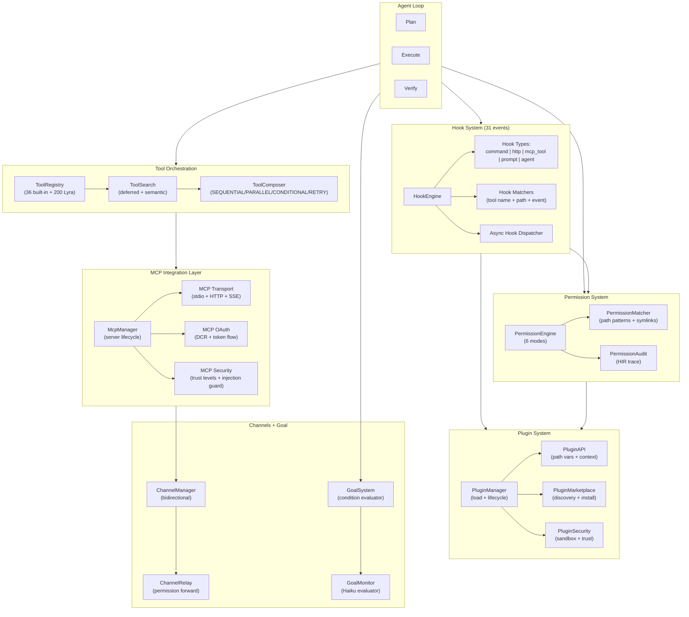
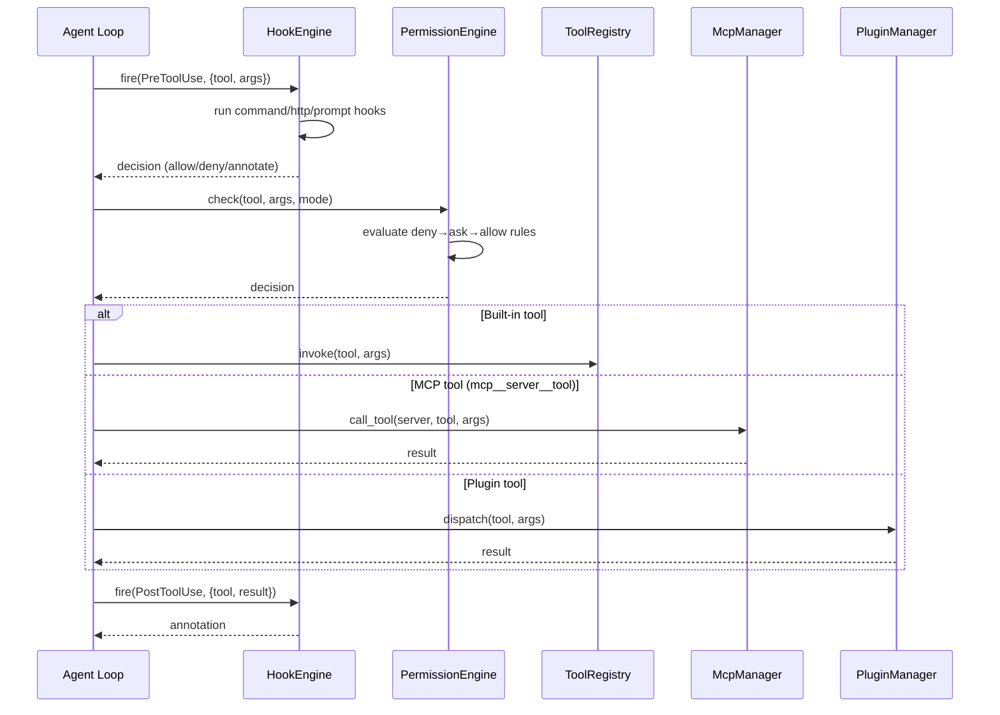

# LYRA ULTRA PLAN: Tools, MCP, Plugin & Hook Orchestration Ecosystem

**Plan Version:** 1.0.0
**Status:** Draft
**Target Scope:** 10 weeks (2 implementation engineers)
**Prerequisites:** Lyra core v2.5.0+, 20-toolset registry, basic HookRegistry

---

## 1. Executive Summary

This plan defines the complete implementation of Lyra's tools, MCP, plugin, hook, permission, channels, and goal subsystems. Drawing from Claude Code's 36 built-in tools, the MCP protocol specification, the Claude Code plugin ecosystem, and Lyra's existing 200+ tool architecture, this plan unifies six subsystems into a cohesive orchestration layer.

The outcome is a Lyra agent that can:

- Invoke any of 36+ built-in tools across 10 categories with progressive disclosure and deferred schema loading
- Connect to arbitrary MCP servers over stdio, HTTP, or SSE with automatic reconnection, OAuth support, and tool search
- Extend itself via user-installed plugins containing skills, agents, hooks, MCP servers, and themes
- React to 31 lifecycle events through a 5-type hook system (command, http, mcp_tool, prompt, agent)
- Enforce fine-grained permissions with declarative rule patterns, path-aware matching, and bypass mode
- Receive external events via bidirectional channels with permission relay
- Run autonomously with goal-conditioned Stop hooks and separate evaluator models

### Key Metrics

| Metric | Current | Target |
|--------|---------|--------|
| Built-in tools | 200+ (ToolRegistry) | 236+ (36 CC + 200 Lyra) |
| Tool disclosure levels | Static (L1/L2/L3) | Dynamic + deferred |
| Hook events | 3 (Pre/Post/Stop) | 31 (full lifecycle) |
| Hook types | 1 (python function) | 5 (command/http/mcp_tool/prompt/agent) |
| Permission modes | 4 (lyra) | 6 (default/acceptEdits/plan/auto/dontAsk/bypass) |
| MCP transports | Stdio only | Stdio + HTTP (streamable) + SSE |
| Plugin system | Not implemented | Full marketplace + manifest |
| Goal system | Not implemented | Condition evaluator + auto mode |
| Channels | Not implemented | Bidirectional + permission relay |

---

## 2. Architecture Overview

### 2.1 Ecosystem Diagram



### 2.2 Request Flow (Tool Invocation)



---

## 3. Complete Tool Catalog

### 3.1 Category Map

Lyra's 20-toolset registry (already implemented in `lyra_tools/tool_registry.py`) provides 200+ tools across these categories:

| Category | Tools | Status | Key Implementations |
|----------|-------|--------|---------------------|
| Filesystem | 12 | Implemented | Read, Write, Edit, Delete, Move, Copy, Search, Watch, Stat, Glob, DirCreate, DirList |
| Code | 18 | Implemented | LSP (7 tools), AST search/replace, Format, Lint, Typecheck, Test run/coverage, Dependency graph, Complexity, Dead imports, Smells |
| Search | 10 | Implemented | Grep, Code search, File search, Symbol search, Content search, Regex, History, Web, Docs, Wiki |
| Shell | 8 | Implemented | Run, Run bg, Pipe, Env, Which, Kill, Tmux, Script |
| Git | 14 | Implemented | Status, Diff, Log, Branch, Checkout, Commit, Add, Push, Pull, Stash, Rebase, Tag, Blame, Bisect |
| Web Browser | 15 | Implemented | Fetch, Search, Browse, Screenshot, Extract, Form fill, API call, Download, WebSocket, GraphQL, RSS, Sitemap, Auth, Cookie, PDF |
| Database | 14 | Implemented | Query, Execute, Schema, Migrate, Seed, Backup, Restore, Explain, Index, Connect, Vector search, Graph query, Cache, Replication status |
| Document | 12 | Implemented | Read, Write, Convert, Parse table, OCR, Translate, Summarize, Diff, Merge, Template, TOC, Citations |
| Media | 12 | Implemented | Image view/edit/generate, Audio play/record/transcribe, Video play/extract, SVG render, Color analyze, Metadata, Compress |
| Network | 10 | Implemented | HTTP, DNS, Ping, Traceroute, SSH, Port scan, SSL check, Bandwidth, Proxy, gRPC |
| Security | 13 | Implemented | Secrets scan, Vuln scan, SAST, DAST, SBOM, License check, OWASP check, Permission audit, Encrypt, Decrypt, Hash, JWT, CSRF |
| Agent Orchestration | 12 | Implemented | Spawn, Delegate, Squad create, Fanout, Map-reduce, Debate, Handoff, Fleet status, Colony start, Schedule, Broadcast, Kill |
| Memory | 10 | Implemented | Save, Recall, Search, Compact, Prune, KG query/add, Context stats, Forget, Consolidate |
| Skill | 11 | Implemented | List, Load, Create, Evolve, Evaluate, Weave, Search, Import, Export, Benchmark, Trace2skill |
| Observability | 8 | Implemented | Log, Metric, Trace start/end, Dashboard, Alert, Health, Audit |
| Automation | 10 | Implemented | Goal create/list/status, Continuous start/stop, Schedule, Webhook, Workflow, Checkpoint, Rollback |
| Communication | 8 | Implemented | Slack send/thread, Email, Discord, Teams, Notify, Webhook, WhatsApp |
| MCP Management | 8 | Implemented | Server start/stop, List servers/tools, Call tool, Discover, Install, Security scan |
| Voice | 8 | Implemented | Speak, Listen, Pack set/list, Sound play, Volume, Dictation start/stop |
| UI | 9 | Implemented | Theme set/list, Banner, Keybinding set/list, Render markdown, Progress bar, Table, Diff view |

### 3.2 New Claude Code-Inspired Tools (36 to integrate)

These 36 tools from Claude Code's architecture must be integrated into Lyra's registry, either as new tools or as enhanced versions of existing ones:

**Agent & Task Management (8 tools)**
| Tool | Description | Category | Parameters |
|------|-------------|----------|------------|
| `agent_spawn` | Spawn subagent with own context window (already exists) | Agent | agent_type, prompt, model, tools |
| `task_create` | Create tracked asynchronous task | Automation | description, model, tools |
| `task_get` | Fetch task result by ID | Automation | task_id |
| `task_list` | List all tasks (running + completed) | Automation | status_filter |
| `task_stop` | Stop a running background task | Automation | task_id |
| `task_update` | Update task description/metadata | Automation | task_id, description |
| `team_create` | Create agent team with roles | Agent | name, members, domain |
| `team_delete` | Delete agent team | Agent | name |

**Scheduling & Automation (6 tools)**
| Tool | Description | Category | Parameters |
|------|-------------|----------|------------|
| `cron_create` | Schedule recurring task within session | Automation | schedule, task |
| `cron_delete` | Remove scheduled cron task | Automation | cron_id |
| `cron_list` | List active cron schedules | Automation | -- |
| `schedule_wakeup` | Dynamic interval for self-paced loops | Automation | interval_seconds |
| `remote_trigger_create` | Create a triggerable Routine | Automation | name, steps |
| `remote_trigger_run` | Execute a Routine on demand | Automation | routine_id |

**Git Workspace (2 tools)**
| Tool | Description | Category | Parameters |
|------|-------------|----------|------------|
| `worktree_enter` | Create isolated git worktree | Git | name, base_ref |
| `worktree_exit` | Leave worktree (keep or remove) | Git | action, discard_changes |

**Communication (3 tools)**
| Tool | Description | Category | Parameters |
|------|-------------|----------|------------|
| `ask_user_question` | Multiple-choice requirements gathering | Communication | questions, options |
| `send_message` | Team/messaging communication | Communication | channel, message |
| `push_notification` | Desktop + phone push notification | Communication | title, message |

**Web & LSP (already partially covered)**
| Tool | Description | Notes |
|------|-------------|-------|
| `web_fetch` | URL fetch with prompt extraction, 15-min cache | Already exists |
| `web_search` | Web search with domain filtering | Already exists |
| LSP tools (8) | Go to def, references, hover, rename, symbols, diagnostics, code actions, implementations | Already covered by Code toolset |
| `notebook_edit` | Jupyter cell modification (replace/insert/delete) | New Document tool |

**Planning & System (2 tools)**
| Tool | Description | Category | Parameters |
|------|-------------|----------|------------|
| `plan_mode_enter` | Enter structured plan mode | Automation | -- |
| `plan_mode_exit` | Exit plan mode | Automation | -- |

**MCP Resource Tools (already partially covered)**
| Tool | Description | Notes |
|------|-------------|-------|
| `mcp_list_resources` | List MCP resources via @ mentions | Enhance MCP toolset |
| `mcp_read_resource` | Read MCP resource content | Enhance MCP toolset |
| `mcp_tool_search` | Deferred MCP tool discovery | Enhance MCP toolset |
| `mcp_wait_for_servers` | Wait for MCP server readiness | Enhance MCP toolset |

### 3.3 Implementation Priority

**P0 (Week 1-2):** Core 36 tools already have equivalents in Lyra's 200+ toolset. Add 10 genuinely new tools: `task_create/get/list/stop/update`, `cron_create/delete/list`, `notebook_edit`, `ask_user_question`.

**P1 (Week 3-4):** Worktree tools, schedule_wakeup, push_notification, send_message.

**P2 (Week 5-6):** Team tools (enhance existing agent squad tools), remote triggers, plan mode.

**P3 (Week 7-10):** MCP resource tools, tool search integration, progressive disclosure optimization.

---

## 4. MCP Integration

### 4.1 Architecture

Lyra's MCP layer (`packages/lyra-mcp/`) currently provides:

- `MCPServerConfig` + JSON config loader (`~/.lyra/mcp.json` and project-local)
- `MCPAdapter` with transport-agnostic protocol
- `MCPEnterpriseGateway` with rate limiting and policy
- `MCPSecurityScanner` with taint analysis

This must be expanded to support all three MCP transports, OAuth authentication, tool search/deferral, and resource management.

### 4.2 Transport Support

```python
# New: Transport enum + factory
from enum import Enum
from dataclasses import dataclass
from typing import Optional

class MCPTransportKind(Enum):
    STDIO = "stdio"           # Local subprocess (implemented)
    STREAMABLE_HTTP = "http"  # Recommended for remote servers (new)
    SSE = "sse"               # Deprecated but still in use (new)

@dataclass(frozen=True)
class MCPTransportConfig:
    kind: MCPTransportKind
    # Stdio
    command: Optional[tuple[str, ...]] = None
    env: Optional[dict[str, str]] = None
    # HTTP/SSE
    url: Optional[str] = None
    headers: Optional[dict[str, str]] = None
    # Common
    timeout_ms: int = 60_000
    reconnect_attempts: int = 5
    reconnect_base_delay_ms: int = 1_000
```

**Implementation Notes:**

- **Stdio transport** (existing): Subprocess with JSON-RPC over stdin/stdout. Already implemented.
- **Streamable HTTP transport** (new): Single `POST /mcp` endpoint. Supports SSE streaming for server-to-client notifications. Recommended for all remote deployments.
- **SSE transport** (new): Deprecated but required for compatibility with existing MCP servers. Uses `GET /sse` for event stream + `POST /message` for client-to-server.
- **Reconnection**: Exponential backoff across all transports. Base 1s, max 5 attempts. Configurable via `MCPTransportConfig`.

### 4.3 OAuth 2.0 Integration

New module: `lyra_mcp.client.oauth`

```python
@dataclass
class MCPOAuthConfig:
    """OAuth 2.0 with Dynamic Client Registration per MCP spec."""
    server_url: str
    client_id: Optional[str] = None
    client_secret: Optional[str] = None
    scopes: list[str] = field(default_factory=list)
    registration_endpoint: str = "/.well-known/oauth-protected-resource"

class MCPOAuthFlow:
    """Handles DCR + authorization code flow for MCP servers."""
    async def register_client(self) -> None: ...
    async def get_authorization_url(self) -> str: ...
    async def exchange_code(self, code: str) -> MCPToken: ...
    async def refresh_token(self) -> None: ...
```

### 4.4 Tool Search & Deferral

New module: `lyra_mcp.tool_search`

The deferred tool discovery system solves the context-window problem where listing all MCP tools upfront consumes excessive tokens.

```python
@dataclass
class ToolSearchConfig:
    mode: str = "auto"        # true | auto | auto:N | false
    auto_threshold_pct: float = 0.10  # load within 10% of context window
    always_load: list[str] = field(default_factory=list)  # exempt servers/tools

class McpToolSearch:
    """Deferred MCP tool discovery with context-aware loading."""
    def __init__(self, config: ToolSearchConfig, gateway: MCPEnterpriseGateway): ...
    async def search(self, query: str) -> list[ToolManifest]: ...
    async def load_tool(self, server: str, tool: str) -> ToolManifest: ...
    def handle_list_changed(self, server: str) -> None: ...
```

**Tool Naming Convention:** `mcp__<server>__<tool>` (matches Claude Code convention).

**Resource @-mentions:** Resources exposed via `@server/resource` syntax with fuzzy-searchable autocomplete.

**MCP Prompts as Commands:** Servers that expose prompts are invocable via `/mcp__<server>__<prompt>`.

### 4.5 Safety & Limits

| Limit | Value | Enforcement |
|-------|-------|-------------|
| Per-server timeout | Configurable, minimum 1s | `MCPAdapter.call_tool` threading timeout |
| Output warning | 10,000 tokens | Post-call check |
| Output hard limit | 25,000 tokens | Truncation |
| Server annotation max | 500,000 characters | Server-side |
| Tool description truncation | 2KB per tool | Client-side on load |
| Server instructions truncation | 2KB | Client-side on load |

### 4.6 Dynamic Headers

New feature: `headersHelper` support for servers that need per-request dynamic headers (e.g., rotating API keys, session tokens).

```python
class MCPHeadersHelper:
    """Resolve dynamic headers before each MCP request."""
    def register(self, server: str, provider: Callable[[], dict[str, str]]) -> None: ...
    async def resolve(self, server: str) -> dict[str, str]: ...
```

---

## 5. Plugin System

### 5.1 Plugin Directory Structure

A plugin is a self-contained directory that extends Lyra with skills, agents, hooks, MCP servers, LSP servers, monitors, and themes.

```
my-plugin/
  .claude-plugin/
    plugin.json          # Manifest (optional, auto-discovered)
  skills/
    my-skill.md           # SKILL.md file with YAML frontmatter
  agents/
    my-agent.md           # Agent definition
  hooks/
    pre-tool-use.sh       # Shell hook script
    post-compact.py       # Python hook handler
    validation.prompt     # Prompt-based hook
  mcp-servers/
    my-server/
      server.py           # MCP server implementation
      requirements.txt
  lsp-servers/
    my-lsp/               # Language server config
  monitors/
    build-watcher.json    # Background process monitor
  themes/
    my-theme.json         # Terminal color theme
```

### 5.2 Plugin Manifest Schema

```json
{
  "$schema": "https://lyra.dev/plugin-manifest-v1.json",
  "name": "my-plugin",
  "version": "1.2.0",
  "displayName": "My Plugin",
  "description": "Adds custom skill and agent capabilities",
  "author": {
    "name": "Plugin Author",
    "email": "author@example.com"
  },
  "license": "MIT",
  "minLyraVersion": "2.5.0",
  "components": {
    "skills": ["./skills/*.md"],
    "agents": ["./agents/*.md"],
    "hooks": ["./hooks/*"],
    "mcpServers": [
      {
        "name": "my-server",
        "command": "python",
        "args": ["./mcp-servers/my-server/server.py"],
        "env": {
          "API_KEY": "${CLAUDE_PLUGIN_DATA}/api-key.txt"
        },
        "trust": "first-party"
      }
    ],
    "lspServers": ["./lsp-servers/*.json"],
    "monitors": ["./monitors/*.json"],
    "themes": ["./themes/*.json"]
  },
  "dependencies": {
    "other-plugin": ">=2.0.0"
  },
  "userConfig": {
    "apiEndpoint": {
      "type": "string",
      "label": "API Endpoint URL",
      "default": "https://api.example.com",
      "sensitive": false
    },
    "authToken": {
      "type": "string",
      "label": "Auth Token",
      "sensitive": true
    }
  },
  "keywords": ["automation", "testing"],
  "homepage": "https://github.com/author/my-plugin"
}
```

### 5.3 Plugin API (Path Variables)

| Variable | Resolves To |
|----------|------------|
| `${CLAUDE_PLUGIN_ROOT}` | Plugin install directory |
| `${CLAUDE_PLUGIN_DATA}` | Plugin data directory (persists across updates) |
| `${CLAUDE_PROJECT_DIR}` | Current project root directory |

### 5.4 Plugin Manager API

```python
class PluginManager:
    """Load, validate, and lifecycle-manage plugins."""

    def __init__(self, config: PluginConfig): ...

    # Discovery
    async def discover(self) -> list[PluginManifest]:
        """Scan configured plugin directories for manifests."""

    async def install(self, plugin_ref: str, *, version: Optional[str] = None) -> Plugin:
        """Install a plugin from marketplace or local path."""

    async def uninstall(self, name: str) -> None: ...

    # Lifecycle
    async def load(self, manifest: PluginManifest) -> Plugin: ...
    async def activate(self, plugin: Plugin) -> None: ...
    async def deactivate(self, plugin: Plugin) -> None: ...

    # Component access
    def get_skills(self, plugin: Plugin) -> list[Skill]: ...
    def get_agents(self, plugin: Plugin) -> list[Agent]: ...
    def get_hooks(self, plugin: Plugin) -> list[Hook]: ...
    def get_mcp_servers(self, plugin: Plugin) -> list[MCPServerConfig]: ...

    # Version management
    async def check_updates(self, plugin: Plugin) -> Optional[str]: ...
    async def update(self, plugin: Plugin, version: str) -> Plugin: ...
```

### 5.5 Plugin Security

- **Path traversal blocked**: All plugin file access validated against `${CLAUDE_PLUGIN_ROOT}`. `../` traversal rejected.
- **Symlink resolution**: Symlinks inside plugins resolved and copied (not followed at runtime).
- **Trust levels**: `first-party` (no restrictions), `third-party` (sandbox applies), custom levels configurable.
- **Sensitive user config**: Values marked `"sensitive": true` stored in system keychain, not in plaintext config files.
- **Plugin caching**: Marketplace plugins copied to `~/.lyra/plugins/cache/` on install.
- **Dependency validation**: Plugin-to-plugin dependencies validated with optional semver matching.

### 5.6 Namespacing

Plugin components are namespaced to prevent collisions:

- **Skills**: `plugin-name:skill-name`
- **Agents**: `plugin-name:agent-name`
- **Hooks**: `plugin-name:hook-name`
- **MCP tools**: `mcp__plugin-name__tool-name`

---

## 6. Hook System

### 6.1 Current State

Lyra's `lyra_harness_core.hooks` module provides:
- 3 events: `PreToolUse`, `PostToolUse`, `Stop`
- 1 handler type: Python function callback
- Basic fnmatch-based matcher
- Block/annotate decision model

This must be expanded to the full 31-event lifecycle with 5 handler types.

### 6.2 Complete Event Catalog (31 Events)

**Session Events (4)**
| Event | Fires When | Handler Signature |
|-------|-----------|-------------------|
| `SessionStart` | Agent session begins | `(session_id: str) -> HookDecision` |
| `Setup` | Session initialization complete | `(session_id: str) -> HookDecision` |
| `SessionEnd` | Agent session ending | `(session_id: str) -> HookDecision` |
| `Notification` | System notification received | `(notification: dict) -> HookDecision` |

**User Interaction Events (3)**
| Event | Fires When | Handler Signature |
|-------|-----------|-------------------|
| `UserPromptSubmit` | User submits a prompt | `(prompt: str) -> HookDecision` |
| `UserPromptExpansion` | Prompt expansion processing | `(prompt: str, expanded: str) -> HookDecision` |
| `AskUserQuestion` | Agent asks user a question | `(question: str) -> HookDecision` |

**Tool Events (4)**
| Event | Fires When | Handler Signature |
|-------|-----------|-------------------|
| `PreToolUse` | Before tool execution (existing) | `(call: ToolCall) -> HookDecision` |
| `PostToolUse` | After successful tool execution (existing) | `(call: ToolCall, result: ToolResult) -> HookDecision` |
| `PostToolUseFailure` | After tool execution fails | `(call: ToolCall, error: Exception) -> HookDecision` |
| `PermissionRequest` | Permission prompt shown to user | `(call: ToolCall, reason: str) -> HookDecision` |

**Permission Events (2)**
| Event | Fires When | Handler Signature |
|-------|-----------|-------------------|
| `PermissionRequest` | Agent requests tool permission | `(call: ToolCall, mode: str) -> HookDecision` |
| `PermissionDenied` | Permission was denied | `(call: ToolCall, reason: str) -> HookDecision` |

**Agent Events (3)**
| Event | Fires When | Handler Signature |
|-------|-----------|-------------------|
| `SubagentStart` | Subagent spawned | `(agent_id: str, task: str) -> HookDecision` |
| `SubagentStop` | Subagent completed | `(agent_id: str, result: dict) -> HookDecision` |
| `Stop` | Agent requests to stop (existing) | `() -> HookDecision` |

**Compaction Events (2)**
| Event | Fires When | Handler Signature |
|-------|-----------|-------------------|
| `PreCompact` | Before context compaction | `(current_tokens: int, target_tokens: int) -> HookDecision` |
| `PostCompact` | After context compaction | `(old_tokens: int, new_tokens: int) -> HookDecision` |

**Stop Events (2)**
| Event | Fires When | Handler Signature |
|-------|-----------|-------------------|
| `Stop` | Agent requests to stop (existing) | `() -> HookDecision` |
| `StopFailure` | Agent stop failed | `(error: Exception) -> HookDecision` |

### 6.3 Five Hook Types

```python
from enum import Enum
from dataclasses import dataclass
from typing import Callable, Optional, Union

class HookType(Enum):
    COMMAND = "command"      # Shell command, synchronous
    HTTP = "http"            # POST to URL
    MCP_TOOL = "mcp_tool"    # Call an MCP tool
    PROMPT = "prompt"        # Single-turn LLM evaluation
    AGENT = "agent"          # Multi-turn subagent with tools

@dataclass
class HookConfig:
    name: str
    event: HookEvent
    hook_type: HookType
    matcher: str = "*"       # fnmatch pattern on tool name / event context
    scope: str = "global"    # global | project | plugin:<name>
    async_mode: bool = False # fire-and-forget hooks

    # Type-specific config (only one set based on hook_type)
    command: Optional[tuple[str, ...]] = None         # COMMAND
    http_url: Optional[str] = None                     # HTTP
    http_headers: Optional[dict[str, str]] = None      # HTTP
    mcp_server: Optional[str] = None                   # MCP_TOOL
    mcp_tool: Optional[str] = None                     # MCP_TOOL
    mcp_args: Optional[dict] = None                    # MCP_TOOL
    prompt: Optional[str] = None                       # PROMPT
    prompt_model: Optional[str] = None                 # PROMPT (default: haiku)
    agent_prompt: Optional[str] = None                 # AGENT
    agent_model: Optional[str] = None                  # AGENT
    agent_tools: Optional[list[str]] = None            # AGENT

    # Security
    timeout_ms: int = 30_000
    max_retries: int = 0
```

**Example Hook Configurations:**

```json
{
  "hooks": {
    "validate-formatting": {
      "event": "PostToolUse",
      "hook_type": "command",
      "matcher": "file_write",
      "command": ["black", "--check", "--quiet", "${FILE}"],
      "async_mode": false
    },
    "notify-deploy": {
      "event": "PostToolUse",
      "hook_type": "http",
      "matcher": "shell_run(deploy)",
      "http_url": "https://hooks.slack.com/services/T...",
      "http_headers": {"Content-Type": "application/json"},
      "async_mode": true
    },
    "security-review": {
      "event": "PreToolUse",
      "hook_type": "mcp_tool",
      "matcher": "shell_run",
      "mcp_server": "security-scanner",
      "mcp_tool": "audit_command",
      "mcp_args": {"command": "${TOOL_ARGS.command}"}
    },
    "code-quality": {
      "event": "PostToolUse",
      "hook_type": "prompt",
      "matcher": "file_write",
      "prompt": "Review this code change for bugs: ${TOOL_RESULT}",
      "prompt_model": "haiku"
    },
    "comprehensive-review": {
      "event": "PreCompact",
      "hook_type": "agent",
      "agent_prompt": "Review the entire session for quality issues and suggest improvements.",
      "agent_model": "sonnet",
      "agent_tools": ["file_read", "search_grep", "code_lsp_diagnostics"]
    }
  }
}
```

### 6.4 Decision Control

Hooks follow the same precedence as permissions: **deny > ask > allow**. A hook at a more restrictive scope can tighten decisions but never loosen them.

```python
class HookDecisionControl:
    """Hook decisions follow deny > ask > allow precedence."""
    DENY = "deny"   # Block the operation
    ASK = "ask"     # Prompt user for decision
    ALLOW = "allow" # Allow the operation
```

**Key rule**: A `deny` from any hook wins. A hook cannot "allow" what a prior hook denied. This ensures hooks compose safely.

### 6.5 Async Hooks

Async hooks are fire-and-forget -- they run in background tasks and do not block the main agent loop. Their results are delivered via `Notification` events when they complete.

```python
class AsyncHookDispatcher:
    """Dispatch fire-and-forget hooks in background."""
    def __init__(self, max_concurrent: int = 10): ...
    async def dispatch(self, hook: Hook, context: HookContext) -> str:
        """Returns a task_id for later wakeup."""
    async def get_result(self, task_id: str) -> Optional[HookResult]: ...
```

### 6.6 Hook Engine API

```python
class HookEngine:
    """Central hook execution engine with 31 events, 5 types."""

    def __init__(self, plugin_manager: PluginManager): ...

    def register(self, hook: HookConfig) -> None: ...
    def unregister(self, name: str) -> None: ...

    async def fire(
        self,
        event: HookEvent,
        context: HookContext,
    ) -> HookDecision:
        """Run all matching hooks for an event. First deny wins."""

    def list_hooks(self, event: Optional[HookEvent] = None) -> list[HookConfig]: ...

    # Matcher resolution
    def match(self, hook: HookConfig, context: HookContext) -> bool: ...
```

---

## 7. Permission System

### 7.1 Current State

Lyra has two permission layers:

1. **`lyra_harness_core.permissions`**: Mode-based resolver (plan/default/acceptEdits/bypass) with fnmatch pattern matching on tool signatures. Rule precedence: deny > ask > allow > mode default.

2. **`lyra_permissions`**: Risk-level system (SAFE/MEDIUM/DANGEROUS/CRITICAL) with policies (STRICT/BALANCED/PERMISSIVE/BYPASS), time-based rules, granular per-tool permissions, and audit logging.

These must be unified into a single PermissionEngine that supports all 6 modes, path-aware matching, compound command handling, and symlink resolution.

### 7.2 Six Permission Modes

| Mode | Behavior | Use Case |
|------|----------|----------|
| `default` | Prompt for writes, allow reads | Normal interactive use |
| `acceptEdits` | Auto-accept edit tools, prompt for destructive | Pair programming |
| `plan` | Read-only (build/plan) -- no writes allowed | Planning phase |
| `auto` | Allow all except CRITICAL | Supervised autonomous runs |
| `dontAsk` | Never show permission prompts, auto-deny | Headless CI |
| `bypassPermissions` | Allow everything (audit logged) | Trusted autonomous runs |

### 7.3 Rule Format Grammar

```
<tool_name>(<arg_spec>)   -> matches specific tool + args
<tool_name>(*)            -> matches all invocations of a tool
<tool_name>               -> shorthand, matches all invocations
*                         -> matches everything
```

**Path patterns:**
```
//path                    -> absolute path
~/path                    -> home directory
/path                     -> project root
path                      -> relative to CWD
```

**Compound commands:**
```
Bash(git status && npm test)   -> split into two rules:
  Bash(git status)
  Bash(npm test)
```

**Process wrappers stripped before matching:**
`timeout`, `time`, `nice`, `nohup`, `stdbuf` are stripped from the command before rule matching.

### 7.4 Rule Evaluation Order

```
1. deny  rules (hard block)     -> DENY (first match wins)
2. ask   rules (force prompt)   -> ASK  (first match wins)
3. allow rules (force allow)    -> ALLOW (first match wins)
4. mode  default                 -> based on mode + risk level
```

### 7.5 Symlink Handling

Both the symlink path AND the resolved target path must match an allow rule. If either path fails, the operation is denied. This closes a common bypass where users redirect `~/secrets -> ~/safe` to circumvent rules.

### 7.6 Unified PermissionEngine API

```python
@dataclass
class PermissionRule:
    decision: Decision           # allow | ask | deny
    tool_pattern: str            # fnmatch pattern
    arg_pattern: Optional[str]   # path or argument pattern
    scope: str = "global"        # global | project | plugin:<name>

class PermissionEngine:
    """Unified permission engine with 6 modes, path-aware matching."""

    def __init__(self, mode: PermissionMode, rules: list[PermissionRule]): ...

    async def check(
        self,
        tool: str,
        args: dict[str, Any],
        context: PermissionContext,
    ) -> PermissionDecision:
        """
        Full evaluation pipeline:
        1. Symlink resolution check
        2. Process wrapper stripping (for shell commands)
        3. Compound command splitting (Bash only)
        4. deny rule matching (first match wins)
        5. Mode-based gating (plan = read-only, bypass = allow all)
        6. ask rule matching
        7. allow rule matching
        8. Mode default (based on tool risk level)
        """

    def add_rule(self, rule: PermissionRule) -> None: ...
    def remove_rule(self, tool_pattern: str) -> None: ...
    def list_rules(self) -> list[PermissionRule]: ...

    # Audit
    def get_audit_log(self, since: datetime) -> list[PermissionAuditEntry]: ...
```

### 7.7 Read-Only Command Safelist

The following commands are always allowed in `plan` mode because they are read-only:

`ls`, `cat`, `echo`, `pwd`, `head`, `tail`, `grep`, `find`, `wc`, `sort`, `uniq`, `file`, `stat`, `which`, `type`, `date`, `env`, `printenv`

---

## 8. Channels System

### 8.1 Overview

Channels enable bidirectional communication between Lyra and external systems. A channel is an MCP server that advertises the `claude/channel` experimental capability, allowing external events to be injected into the agent loop and permission prompts to be forwarded to remote users.

### 8.2 Architecture

```python
class ChannelManager:
    """Manage bidirectional communication channels."""

    def __init__(self, mcp_manager: McpManager, permission_engine: PermissionEngine): ...

    async def register(self, server: MCPServerConfig) -> Channel: ...
    async def unregister(self, channel_id: str) -> None: ...

    # Incoming events
    async def receive(self, channel_id: str) -> AsyncIterator[ChannelEvent]: ...
    async def inject(self, event: ChannelEvent) -> None:
        """Inject external event into agent loop."""

    # Permission relay
    async def forward_permission_request(
        self,
        request: PermissionRequest,
        channels: list[str],
    ) -> PermissionDecision:
        """Forward permission prompt to remote users. First answer wins."""
```

### 8.3 Notification Format

```json
{
  "jsonrpc": "2.0",
  "method": "notifications/claude/channel",
  "params": {
    "content": "External system detected deployment failure in production.",
    "meta": {
      "source": "ci-cd-pipeline",
      "severity": "critical",
      "timestamp": "2026-05-27T10:30:00Z"
    }
  }
}
```

### 8.4 Reply Tool

Channels expose a `reply` tool that allows Lyra to send responses back through the channel. Transport is stdio only for channels (bidirectional streams over a single process pair).

### 8.5 Permission Relay

When a permission prompt is triggered, Lyra can forward it to all registered channels. Each channel presents the prompt to its connected user. The first answer received (within timeout) wins. Request IDs are 5 random alphanumeric characters.

---

## 9. Goal System

### 9.1 Overview

The Goal System wraps a session-scoped Stop hook around a user-defined condition. A separate evaluator model (Haiku by default) checks whether the condition is met after each agent turn, enabling fully autonomous operation when combined with Auto mode.

### 9.2 Architecture

```python
@dataclass
class GoalConfig:
    condition: str                    # Free-form condition, up to 4K characters
    evaluator_model: str = "haiku"   # Model to evaluate goal completion
    max_turns: int = 100             # Safety limit
    auto_mode: bool = False          # Combine with Auto permission mode

class GoalSystem:
    """Goal-conditioned autonomous execution."""

    def __init__(self, config: GoalConfig, hook_engine: HookEngine): ...

    async def evaluate(self, session_context: str) -> GoalStatus:
        """
        After each agent turn:
        1. Send condition + current session context to evaluator model
        2. Evaluator judges if condition is met (NO tool calls)
        3. Return COMPLETE / IN_PROGRESS / BLOCKED
        """

    async def start(self) -> None:
        """Register Stop hook and begin monitoring."""

    async def stop(self) -> None:
        """Remove Stop hook and finalize."""

    # Persistence
    def save(self) -> dict: ...
    @classmethod
    def restore(cls, data: dict) -> "GoalSystem": ...
```

### 9.3 Evaluator Model

The evaluator is a separate LLM call (default Haiku for cost efficiency) that:

1. Receives the user's condition (up to 4K chars)
2. Receives the current session context (summary of agent actions)
3. Returns `COMPLETE`, `IN_PROGRESS`, or `BLOCKED`
4. Does NOT call tools -- judges only what the agent surfaced

### 9.4 Persistence

Goals persist across `--resume`/`--continue` invocations. Goal state is serialized to `~/.lyra/goals/<goal_id>.json` and restored on session start.

### 9.5 Auto Mode Integration

When `auto_mode=True`:
- Permission mode is set to `bypassPermissions`
- Goal evaluator runs after every agent turn
- Agent continues until goal is `COMPLETE` or `BLOCKED`
- `BLOCKED` triggers user notification via channel or push notification

---

## 10. Implementation Phases

### Phase 1: Foundation (Week 1-2)

**Goal:** Extend tool registry, unify permission engine.

| Task | Package | Effort | Dependencies |
|------|---------|--------|--------------|
| Add 10 new CC-inspired tools to ToolRegistry | `lyra-tools` | 3d | None |
| Unify permission engines (harness-core + lyra-permissions) | `lyra-harness-core` | 3d | None |
| Add path-aware matching to PermissionEngine | `lyra-permissions` | 2d | Unification |
| Add compound command splitting to PermissionEngine | `lyra-permissions` | 1d | Path matching |
| Add symlink resolution to PermissionEngine | `lyra-permissions` | 1d | Path matching |

**Deliverables:**
- 210+ total tools in registry (200 existing + 10 new)
- Single PermissionEngine with 6 modes
- Path pattern matching with symlink handling

### Phase 2: MCP Expansion (Week 3-4)

**Goal:** Full MCP transport support, OAuth, tool search.

| Task | Package | Effort | Dependencies |
|------|---------|--------|--------------|
| Implement Streamable HTTP transport | `lyra-mcp` | 2d | None |
| Implement SSE transport (for backwards compat) | `lyra-mcp` | 2d | None |
| Implement OAuth 2.0 + DCR flow | `lyra-mcp` | 2d | HTTP transport |
| Implement MCP tool search/deferral | `lyra-mcp` | 2d | Transports |
| Implement MCP @-mention resource autocomplete | `lyra-mcp` | 1d | Tool search |
| Implement dynamic headers helper | `lyra-mcp` | 1d | None |

**Deliverables:**
- 3 transport types operational (stdio, HTTP, SSE)
- OAuth flow with DCR working
- Deferred tool loading with `mcp__<server>__<tool>` naming

### Phase 3: Hook System (Week 5-6)

**Goal:** 31 events, 5 hook types, async dispatch.

| Task | Package | Effort | Dependencies |
|------|---------|--------|--------------|
| Expand HookEvent to 31 events | `lyra-harness-core` | 2d | None |
| Implement 5 hook types (command/http/mcp_tool/prompt/agent) | `lyra-harness-core` | 3d | Event expansion |
| Implement hook config loader (JSON) | `lyra-harness-core` | 1d | Hook types |
| Implement async hook dispatcher | `lyra-harness-core` | 2d | Hook types |
| Implement hook scope (global/project/plugin) | `lyra-harness-core` | 1d | Config loader |
| Integrate hooks with PermissionEngine | `lyra-harness-core` | 1d | Both systems |

**Deliverables:**
- All 31 lifecycle events fireable
- 5 hook types operational
- Async hooks with background task management
- Hook-permission integration

### Phase 4: Plugin System (Week 7-8)

**Goal:** Plugin discovery, loading, lifecycle, marketplace.

| Task | Package | Effort | Dependencies |
|------|---------|--------|--------------|
| Implement PluginManifest schema + validation | `lyra-plugin` (new) | 2d | None |
| Implement PluginManager (discover/load/activate) | `lyra-plugin` (new) | 3d | Manifest |
| Implement PluginAPI (path vars + context) | `lyra-plugin` (new) | 1d | Manager |
| Implement PluginSecurity (sandbox + trust levels) | `lyra-plugin` (new) | 2d | Manager |
| Implement plugin-to-plugin dependency resolution | `lyra-plugin` (new) | 1d | Manager |
| Implement PluginMarketplace (discovery + install) | `lyra-plugin` (new) | 2d | Manager |
| Implement plugin config (sensitive flag + keychain) | `lyra-plugin` (new) | 1d | Manager |

**Deliverables:**
- `lyra-plugin` package
- Plugin manifest schema validated
- Plugin install/load/activate/deactivate lifecycle
- Path traversal and symlink security
- Sensitive config in system keychain

### Phase 5: Channels + Goal (Week 9)

**Goal:** Bidirectional channels, goal system.

| Task | Package | Effort | Dependencies |
|------|---------|--------|--------------|
| Implement ChannelManager | `lyra-channel` (new) | 2d | MCP (Phase 2) |
| Implement Channel notification format | `lyra-channel` (new) | 1d | Manager |
| Implement Channel permission relay | `lyra-channel` (new) | 1d | Permissions (Phase 1) |
| Implement GoalSystem + evaluator | `lyra-goal` (new) | 3d | Hooks (Phase 3) |
| Implement Goal persistence (save/restore) | `lyra-goal` (new) | 1d | GoalSystem |
| Implement Auto mode integration | `lyra-goal` (new) | 1d | GoalSystem + Permissions |

**Deliverables:**
- `lyra-channel` package with bidirectional event injection
- Permission prompt relay to remote users
- `lyra-goal` package with condition evaluator
- Goal persistence across session resume

### Phase 6: Integration, Testing, Documentation (Week 10)

**Goal:** End-to-end integration, comprehensive tests, documentation.

| Task | Effort |
|------|--------|
| Integration tests across all 6 subsystems | 3d |
| MCP end-to-end tests (stdio + HTTP + SSE) | 2d |
| Hook regression tests (31 events x 5 types) | 2d |
| Plugin lifecycle integration tests | 2d |
| Documentation: API reference + plugin authoring guide | 2d |
| Performance benchmarks (tool dispatch, hook latency) | 1d |

---

## 11. API Design

### 11.1 ToolRegistry (Enhanced)

```python
# packages/lyra-tools/src/lyra_tools/tool_registry.py (enhanced)

class ToolRegistry:
    """Central registry: 236+ tools across 20+ toolsets."""

    # Existing API preserved
    def get(self, name: str) -> ToolManifest | None: ...
    def search(self, query: str) -> list[ToolManifest]: ...
    def resolve_dependencies(self, name: str) -> tuple[ToolManifest, ...]: ...

    # New: deferred tool loading
    def get_deferred(self, name: str) -> ToolManifest:
        """Return manifest with L1 disclosure. Full schema loaded on first call."""

    # New: capability-based search
    def search_by_capability(self, capability: str) -> list[ToolManifest]: ...

    # New: progressive disclosure filter
    def list_at_level(
        self,
        level: ToolDisclosureLevel,
        category: Optional[ToolCategory] = None,
    ) -> list[ToolManifest]: ...

    # New: MCP tool integration
    def register_mcp_tool(self, server: str, tool: dict) -> ToolManifest: ...
    def unregister_mcp_tool(self, server: str, tool_name: str) -> None: ...
```

### 11.2 McpManager

```python
# packages/lyra-mcp/src/lyra_mcp/manager.py (new)

class McpManager:
    """Full MCP server lifecycle, transport, and tool management."""

    def __init__(self, config_paths: list[Path]): ...

    # Server lifecycle
    async def start_all(self) -> list[str]: ...
    async def start(self, name: str) -> None: ...
    async def stop(self, name: str) -> None: ...
    async def restart(self, name: str) -> None: ...

    # Tool management
    async def list_tools(self, server: Optional[str] = None) -> dict[str, list[Tool]]: ...
    async def call_tool(self, server: str, tool: str, args: dict) -> Any: ...
    async def search_tools(self, query: str) -> list[ToolSearchResult]: ...

    # Transport
    def get_transport(self, server: str) -> MCPTransport: ...

    # Resource management
    async def list_resources(self, server: str) -> list[Resource]: ...
    async def read_resource(self, server: str, uri: str) -> ResourceContent: ...

    # Security
    async def scan_server(self, server: str) -> list[MCPVulnerability]: ...

    # Dynamic updates
    def on_list_changed(self, server: str) -> None: ...
```

### 11.3 PluginManager

```python
# packages/lyra-plugin/src/lyra_plugin/manager.py (new)

class PluginManager:
    """Plugin discovery, lifecycle, and component management."""

    def __init__(self, config: PluginConfig): ...

    # Discovery
    async def discover(self) -> list[PluginManifest]: ...
    async def install(self, ref: str, *, version: Optional[str] = None) -> Plugin: ...
    async def uninstall(self, name: str) -> None: ...

    # Lifecycle
    async def load(self, manifest: PluginManifest) -> Plugin: ...
    async def activate(self, plugin: Plugin) -> None: ...
    async def deactivate(self, plugin: Plugin) -> None: ...
    async def reload(self, name: str) -> Plugin: ...  # Hot reload

    # Components
    def get_skills(self, plugin: Plugin) -> list[Skill]: ...
    def get_agents(self, plugin: Plugin) -> list[Agent]: ...
    def get_hooks(self, plugin: Plugin) -> list[HookConfig]: ...
    def get_mcp_servers(self, plugin: Plugin) -> list[MCPServerConfig]: ...
    def get_lsp_servers(self, plugin: Plugin) -> list[LSPServerConfig]: ...
    def get_monitors(self, plugin: Plugin) -> list[MonitorConfig]: ...
    def get_themes(self, plugin: Plugin) -> list[ThemeConfig]: ...

    # Version management
    async def check_updates(self, plugin: Plugin) -> Optional[str]: ...
    async def update(self, plugin: Plugin, version: str) -> Plugin: ...

    # State
    def list_plugins(self) -> list[Plugin]: ...
    def get_plugin(self, name: str) -> Optional[Plugin]: ...
```

### 11.4 HookEngine

```python
# packages/lyra-harness-core/src/lyra_harness_core/hooks.py (expanded)

class HookEngine:
    """Full lifecycle hook engine: 31 events, 5 types, async dispatch."""

    def __init__(self, plugin_manager: PluginManager): ...

    # Registration
    def register(self, hook: HookConfig) -> None: ...
    def unregister(self, name: str) -> None: ...
    def register_from_json(self, path: Path) -> list[str]: ...

    # Execution
    async def fire(
        self,
        event: HookEvent,
        context: HookContext,
    ) -> HookDecision: ...

    # Async hooks
    async def fire_async(
        self,
        event: HookEvent,
        context: HookContext,
    ) -> list[str]:  # Returns task IDs
        ...

    # Management
    def list_hooks(
        self,
        event: Optional[HookEvent] = None,
        scope: Optional[str] = None,
    ) -> list[HookConfig]: ...

    def get_hook(self, name: str) -> Optional[HookConfig]: ...
```

### 11.5 PermissionEngine

```python
# packages/lyra-permissions/src/lyra_permissions/engine.py (new, unified)

class PermissionEngine:
    """Unified permission engine: 6 modes, path-aware, symlink-safe."""

    def __init__(
        self,
        mode: PermissionMode = PermissionMode.DEFAULT,
        rules: Optional[list[PermissionRule]] = None,
    ): ...

    # Core checking
    async def check(
        self,
        tool: str,
        args: dict[str, Any],
        context: Optional[PermissionContext] = None,
    ) -> PermissionDecision: ...

    # Rule management
    def add_rule(self, rule: PermissionRule) -> None: ...
    def remove_rule(self, tool_pattern: str) -> None: ...
    def list_rules(self) -> list[PermissionRule]: ...
    def import_rules(self, rules_json: Path) -> int: ...

    # Mode management
    def set_mode(self, mode: PermissionMode) -> None: ...
    def get_mode(self) -> PermissionMode: ...

    # Audit
    def get_audit_log(
        self,
        since: Optional[datetime] = None,
        decision: Optional[Decision] = None,
    ) -> list[PermissionAuditEntry]: ...

    # Utilities
    def suggest_rule(self, tool: str, args: dict) -> str:
        """Suggest a permission rule based on a recent tool call."""
```

---

## 12. Test Strategy

### 12.1 Unit Tests

| Component | Tests | Key Scenarios |
|-----------|-------|---------------|
| ToolRegistry | 50+ | Tool lookup, search, dependency resolution, deferred loading, MCP tool registration |
| McpManager | 40+ | Server start/stop, 3 transport types, OAuth flow, tool call timeout, reconnection |
| HookEngine | 60+ | 31 events, 5 hook types, deny precedence, async dispatch, scope isolation |
| PermissionEngine | 50+ | 6 modes, path patterns, symlink resolution, compound command splitting, rule import |
| PluginManager | 40+ | Discover, install, load, activate, deactivate, dependency resolution, hot reload |
| ChannelManager | 20+ | Register, inject, permission relay, notification format |
| GoalSystem | 20+ | Evaluator, persistence, auto mode, max turns, BLOCKED detection |

**Total unit tests target:** 280+

### 12.2 Integration Tests

| Scenario | Components | Count |
|----------|------------|-------|
| Full tool dispatch pipeline | AgentLoop -> HookEngine -> PermissionEngine -> ToolRegistry | 10 |
| MCP end-to-end (stdio) | AgentLoop -> ToolRegistry -> McpManager -> MCP server (Fake) | 5 |
| MCP end-to-end (HTTP) | AgentLoop -> McpManager -> HTTP transport -> MCP server | 5 |
| Hook chain (5 hooks on PreToolUse) | HookEngine -> command + http + mcp + prompt + agent | 5 |
| Plugin with skills + hooks + MCP server | PluginManager -> HookEngine + SkillRegistry + McpManager | 5 |
| Goal-driven autonomous run | GoalSystem -> HookEngine -> AgentLoop (10 turns) | 5 |
| Permission relay via Channel | ChannelManager -> PermissionEngine + remote | 3 |

**Total integration tests target:** 38+

### 12.3 E2E Tests

| Scenario | Description |
|----------|-------------|
| Install plugin, activate, use skill | Full plugin lifecycle E2E |
| MCP server tool call with OAuth | OAuth flow + tool execution |
| Autonomous goal completion | 50-turn autonomous run with goal evaluator |
| Hook blocks dangerous operation | Agent tries `shell_run(rm -rf /)`, hook denies |
| Channel event triggers agent action | External event injected, agent responds |

### 12.4 Test Infrastructure

```python
# Fake/Stub implementations needed for testing
class FakeMCPServer: ...       # Existing in lyra_mcp.testing
class FakeLLMProvider: ...     # Deterministic responses for goal evaluator tests
class FakePluginSource: ...    # Local plugin registry for marketplace tests
class FakeChannel: ...         # In-process channel for relay tests
class StubKeychain: ...        # Memory-backed keychain for sensitive config tests
```

### 12.5 Performance Benchmarks

| Benchmark | Target |
|-----------|--------|
| Tool dispatch latency (built-in) | < 5ms |
| MCP tool call latency (stdio) | < 100ms |
| Hook engine fire (10 hooks) | < 50ms |
| Permission check (100 rules) | < 10ms |
| Plugin load (50 components) | < 500ms |
| Goal evaluation (1 turn) | < 200ms |

---

## 13. Reference Links

### 13.1 Research Sources

- [Claude Code Documentation](https://docs.anthropic.com/en/docs/claude-code)
- [MCP Protocol Specification](https://modelcontextprotocol.io/)
- [Claude Code Plugin System](https://docs.anthropic.com/en/docs/claude-code/plugins)
- [Claude Code Hook Reference](https://docs.anthropic.com/en/docs/claude-code/hooks)
- [Claude Code Permission System](https://docs.anthropic.com/en/docs/claude-code/iam)
- [Claude Code Goals](https://docs.anthropic.com/en/docs/claude-code/goals)
- [Hermes Agent Tools](https://github.com/hermes-multi-agent/hermes)

### 13.2 Lyra-Internal References

- `ARCHITECTURE.md` -- System topology and layer architecture
- `packages/lyra-tools/src/lyra_tools/tool_registry.py` -- 200+ tool registry
- `packages/lyra-mcp/src/lyra_mcp/client/adapter.py` -- MCP adapter
- `packages/lyra-mcp/src/lyra_mcp/client/config.py` -- MCP config loader
- `packages/lyra-harness-core/src/lyra_harness_core/hooks.py` -- Existing hook system
- `packages/lyra-harness-core/src/lyra_harness_core/permissions.py` -- Existing permission resolver
- `packages/lyra-permissions/src/lyra_permissions/permission_manager.py` -- Risk-based permission manager
- `packages/lyra-skills/` -- Skills ecosystem
- `docs/plans/` -- All ultra plan documents

### 13.3 New Packages to Create

| Package | Purpose | Phase |
|---------|---------|-------|
| `lyra-plugin` | Plugin manager, manifest, lifecycle, security | Phase 4 |
| `lyra-channel` | Bidirectional channels, notification format, permission relay | Phase 5 |
| `lyra-goal` | Goal system, condition evaluator, auto mode | Phase 5 |

### 13.4 Key Design Decisions

| Decision | Rationale | Trade-off |
|----------|-----------|-----------|
| Unify permissions in `lyra-permissions` rather than duplicating in harness-core | Single source of truth, avoids rule drift between layers | Requires `lyra-harness-core` to depend on `lyra-permissions` |
| Keep `lyra-tools` as the canonical registry, add MCP registration hooks | ToolRegistry already has 200+ tools, disclosure levels, dependency resolution | MCP tool lifecycle (add/remove) adds complexity |
| Implement plugin system as new `lyra-plugin` package | Clean separation of concerns, no refactoring risk to existing packages | Adds another package to the 135+ monorepo |
| Separate channel and goal into distinct packages | Channels are transport-layer; goals are session-layer. Different lifecycles. | Two new packages instead of one combined |
| Use Haiku as default goal evaluator model | Cost-effective for per-turn evaluation (~100 tokens per eval) | Lower accuracy than Sonnet for complex conditions |
| Implement all 31 hook events upfront | Avoids compatibility breaks from incremental event addition | More upfront work, but cleaner architecture |
