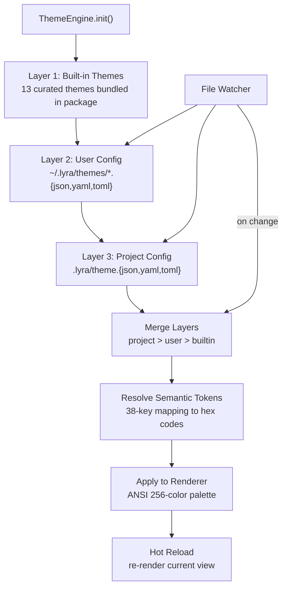
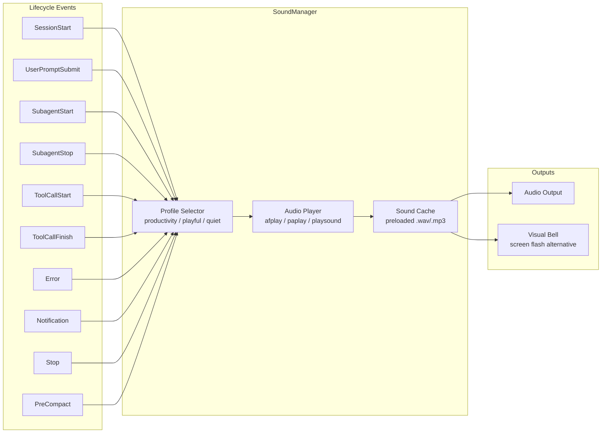
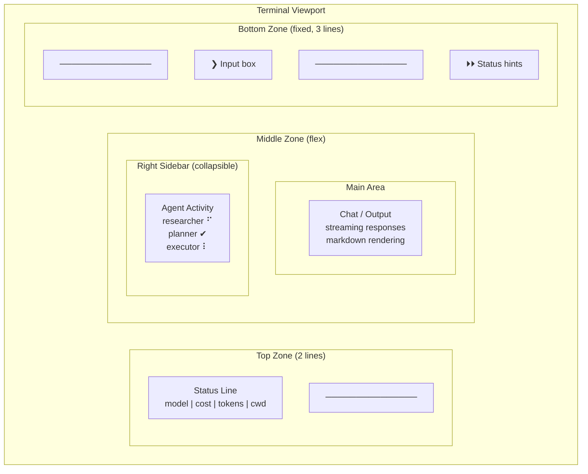

# Ultra Plan: Lyra UI/UX Upgrade -- Theme Engine, Sound, Keybindings, Layout

**Date**: 2026-05-27
**Status**: Planning Complete
**Priority**: Critical
**Timeline**: 6 weeks
**Estimated Effort**: 240 hours

---

## 1. Executive Summary

Lyra is an AGI-grade multi-agent system that currently operates with a functional but visually barren terminal interface. This plan delivers a complete sensory upgrade -- theming, sound, keybindings, and interactive components -- transforming Lyra from a raw CLI tool into a polished, delightful developer experience that stands alongside Claude Code, Warp, and Cursor.

The upgrade spans five interconnected systems:

| System | Scope | Impact |
|--------|-------|--------|
| **Theme Engine** | 13 curated color themes, hot-reload, 38-key semantic token system | Visual identity, accessibility, user preference |
| **Voice & Sound** | Lifecycle event audio, ElevenLabs TTS, adaptive sound profiles | Feedback loops, emotional connection, productivity |
| **Keybinding System** | 30+ bindings, vim/shell/tmux-inspired modes, configurable layers | Power-user efficiency, muscle memory |
| **Layout Architecture** | Workspace tabs, split panes, agent activity sidebar, responsive design | Complex workflow management, multi-agent visibility |
| **Interactive Components** | Spinners, progress bars, tool panels, agent streaming, HUD status line | Real-time feedback, transparency, trust |

**Success criteria**: A new developer opens Lyra, hears a Warcraft-style "Work work!" chime, sees a Catppuccin Mocha themed interface with split panes showing agent activity, and immediately knows what is happening and where to type next -- without reading any documentation.

---

## 2. Theme Engine Architecture

### 2.1 Loading Pipeline

The theme engine resolves themes through a three-layer cascade. Project config overrides user config, which overrides built-in defaults. If any layer is missing, the engine falls through to the next.



### 2.2 Semantic Token System

The engine maps 38 semantic keys to concrete hex values. This indirection lets one theme definition work across all components without hardcoding colors anywhere.

| Category | Token | Purpose |
|----------|-------|---------|
| **UI (8)** | `status_line_bg`, `panel_bg`, `active_border`, `inactive_border`, `divider`, `selection_bg`, `hover_bg`, `tooltip_bg` | Layout chrome, borders, selection highlights |
| **Surfaces (6)** | `surface_0` through `surface_5` | Progressive depth layering for panels and cards |
| **Diff (9)** | `diff_add_bg`, `diff_add_fg`, `diff_remove_bg`, `diff_remove_fg`, `diff_header`, `diff_line_number`, `diff_highlight_bg`, `diff_highlight_fg`, `diff_context` | Code diff rendering |
| **Markdown (14)** | `heading_1` through `heading_6`, `bold`, `italic`, `code_inline`, `code_block_bg`, `blockquote`, `link`, `list_bullet`, `hr` | Rich text formatting |
| **Syntax (8)** | `syntax_keyword`, `syntax_string`, `syntax_number`, `syntax_comment`, `syntax_function`, `syntax_type`, `syntax_constant`, `syntax_operator` | Code block syntax highlighting |

### 2.3 ANSI Integration

The renderer converts semantic tokens to ANSI escape sequences at paint time. A 256-color lookup table is pre-built when the theme loads, so the hot path is a simple dictionary lookup.

```python
class ThemeRenderer:
    """Converts semantic tokens to ANSI escape codes."""

    def __init__(self, theme: Theme):
        self._ansi_cache: dict[str, str] = {}
        for token, hex_color in theme.semantic_tokens.items():
            code = self._hex_to_ansi_256(hex_color)
            self._ansi_cache[token] = f"\x1b[38;5;{code}m"

    def style(self, token: str, text: str) -> str:
        ansi = self._ansi_cache.get(token, "")
        return f"{ansi}{text}\x1b[0m"
```

---

## 3. Complete Theme Catalog

All 13 themes ship with Lyra. The default is Catppuccin Mocha. Users switch with `/theme <name>` or `Ctrl+T` cycling.

### 3.1 Catppuccin Mocha (Default -- Dark, Warm Pastel)

The community-favorite pastel theme. Soft on the eyes during long coding sessions. The lavender and mauve tones give agent messages a warm, conversational feel.

| Role | Hex | Swatch |
|------|-----|--------|
| Base (BG) | `#1e1e2e` | Deep navy-violet |
| Mantle | `#181825` | Darker violet |
| Crust | `#11111b` | Near-black violet |
| Surface 0 (Panels) | `#313244` | Muted violet-gray |
| Surface 1 (Code blocks) | `#45475a` | Lighter violet-gray |
| Surface 2 (Hover) | `#585b70` | Medium violet-gray |
| Text (Primary) | `#cdd6f4` | Soft white-lavender |
| Subtext 0 | `#a6adc8` | Muted gray-lavender |
| Subtext 1 | `#bac2de` | Medium gray-lavender |
| Blue (Agent thinking) | `#89b4fa` | Pastel sky blue |
| Lavender (Agent msg) | `#b4befe` | Soft purple-blue |
| Mauve | `#cba6f7` | Warm purple |
| Green (Success) | `#a6e3a1` | Pastel green |
| Teal | `#94e2d5` | Seafoam |
| Yellow (Warning) | `#f9e2af` | Warm pastel yellow |
| Peach | `#fab387` | Warm orange-pink |
| Red (Error) | `#f38ba8` | Soft rose-red |
| Maroon | `#eba0ac` | Muted pink-red |
| Pink | `#f5c2e7` | Soft pink |
| Sky | `#89dceb` | Light blue |
| Rosewater | `#f5e0dc` | Warm rose |

### 3.2 Catppuccin Latte (Light -- Warm Pastel)

The daytime companion to Mocha. Identical pastel language, reversed into a light canvas. Ideal for bright rooms or preference for light terminals.

| Role | Hex | Notes |
|------|-----|-------|
| Base (BG) | `#eff1f5` | Warm off-white |
| Text (Primary) | `#4c4f69` | Dark gray-violet |
| Blue | `#1e66f5` | Vibrant blue |
| Mauve | `#8839ef` | Deep purple |
| Green | `#40a02b` | Rich green |
| Red | `#d20f39` | Crimson |

### 3.3 Tokyo Night (Dark -- Cool Blue-Purple)

Inspired by the Tokyo night skyline. Cool, electric, high-tech aesthetic. Popular with VS Code and Neovim users. Three variants included.

| Role | Hex | Notes |
|------|-----|-------|
| Background | `#1a1b26` | Deep navy |
| Foreground | `#c0caf5` | Ice blue-white |
| Blue | `#7aa2f7` | Electric blue |
| Green | `#9ece6a` | Neon green |
| Yellow | `#e0af68` | Warm amber |
| Magenta | `#bb9af7` | Soft purple |

**Variants**: Storm (`#24283b` background), Moon (`#222436` background), Day (`#eff1f5` light background)

### 3.4 Dracula Classic (Dark -- High Contrast)

The iconic theme known by every developer. High contrast, vibrant syntax colors, unmistakable purple-orange-pink palette. Zero subtlety -- every token pops.

| Role | Hex |
|------|-----|
| Background | `#282A36` |
| Foreground | `#F8F8F2` |
| Cyan | `#8BE9FD` |
| Green | `#50FA7B` |
| Orange | `#FFB86C` |
| Pink | `#FF79C6` |
| Purple | `#BD93F9` |
| Red | `#FF5555` |

### 3.5 Nord (Dark -- Arctic Blue-Cold)

Bluish, cold, calming. Designed for focused concentration during extended sessions. The low-saturation palette reduces visual fatigue. No color exceeds 60% saturation.

| Role | Hex |
|------|-----|
| nord0 (BG) | `#2e3440` |
| nord1 (Panel) | `#3b4252` |
| nord2 | `#434c5e` |
| nord3 | `#4c566a` |
| nord4 (Text) | `#d8dee9` |
| nord7 (Teal) | `#8fbcbb` |
| nord8 (Blue) | `#88c0d0` |
| nord11 (Red) | `#bf616a` |
| nord14 (Green) | `#a3be8c` |

### 3.6 Gruvbox Dark Medium (Warm -- Retro Sepia)

Retro, warm, sepia-toned. Feels like coding in a cozy coffee shop. The red-green-yellow palette is reminiscent of old-school terminals but with modern contrast ratios. Three variants included.

| Role | Hex |
|------|-----|
| bg0 (Background) | `#282828` |
| bg1 (Panel) | `#3c3836` |
| fg0 (Text) | `#fbf1c7` |
| fg1 (Subtext) | `#ebdbb2` |
| Red | `#cc241d` |
| Green | `#98971a` |
| Yellow | `#d79921` |
| Blue | `#458588` |

**Variants**: Hard (`#1d2021` background, highest contrast), Soft (`#32302f` background, gentlest)

### 3.7 Everforest Dark Medium (Green-Earth -- Organic)

Organic, forest-inspired greens. Calming and nature-grounded. Excellent for long reading sessions. The low blue-light content makes it suitable for late-night coding.

| Role | Hex |
|------|-----|
| bg_dim | `#232A2E` |
| bg0 (Background) | `#2D353B` |
| fg (Text) | `#D3C6AA` |
| Red | `#E67E80` |
| Green | `#A7C080` |
| Aqua | `#83C092` |
| Blue | `#7FBBB3` |

### 3.8 Kanagawa Wave (Dark -- Japanese Ink)

Inspired by Hokusai's Great Wave woodblock prints. Inky dark background with muted, watercolor-like accents. The oniViolet and crystalBlue create a unique Japanese aesthetic.

| Role | Hex |
|------|-----|
| sumiInk1 (BG) | `#1F1F28` |
| sumiInk0 (Deep BG) | `#16161D` |
| fujiWhite (Text) | `#DCD7BA` |
| crystalBlue | `#7E9CD8` |
| oniViolet | `#957FB8` |
| springGreen | `#98BB6C` |
| autumnRed | `#C34043` |

### 3.9 Rose Pine (Dark -- Soho Minimalist)

Minimalist, low-contrast, Soho aesthetic. Rose-tinted neutrals with soft, warm accents. Feels exclusive and crafted. Three variants.

| Role | Hex |
|------|-----|
| Base (BG) | `#191724` |
| Surface | `#1f1d2e` |
| Overlay | `#26233a` |
| Text | `#e0def4` |
| Love (Red) | `#eb6f92` |
| Gold (Yellow) | `#f6c177` |
| Rose | `#ebbcba` |
| Pine (Teal) | `#31748f` |
| Iris (Purple) | `#c4a7e7` |

**Variants**: Moon (`#232136` base, slightly cooler), Dawn (`#faf4ed` base, light mode)

### 3.10 One Dark Pro (Dark -- Atom Classic)

The Atom editor's legacy, ported everywhere. Sharp, high-contrast syntax with the iconic purple/blue/green palette. Familiar to millions of developers.

| Role | Hex |
|------|-----|
| Background | `#282C34` |
| Foreground | `#ABB2BF` |
| Red | `#E06C75` |
| Green | `#98C379` |
| Yellow | `#E5C07B` |
| Blue | `#61AFEF` |
| Purple | `#C678DD` |
| Cyan | `#56B6C2` |

### 3.11 Ayu Dark (Warm Amber)

Warm amber accents on a near-black canvas. Distinctive orange hue sets it apart from blue-dominated themes. Minimalist and focused.

| Role | Hex |
|------|-----|
| Background | `#0B0E14` |
| Foreground | `#B3B1AD` |
| Orange accent | `#FF8F40` |
| Blue | `#59C2FF` |

### 3.12 Solarized Dark (Classic)

Ethan Schoonover's color-theory masterpiece. Precisely calibrated lightness relationships. Every color has an exact mathematical L*a*b relationship with every other color. The most scientifically rigorous theme in the catalog.

| Role | Hex |
|------|-----|
| Base (BG) | `#002b36` |
| Surface | `#073642` |
| Text | `#839496` |
| Blue | `#268bd2` |
| Green | `#859900` |
| Yellow | `#b58900` |

### 3.13 GitHub Dark (Neutral)

GitHub's own dark theme. Neutral grays with familiar blue/green accents. The safest, most conservative option. Ideal for developers who want dark mode without personality.

| Role | Hex |
|------|-----|
| Base (BG) | `#0d1117` |
| Surface | `#161b22` |
| Text | `#c9d1d9` |
| Blue | `#58a6ff` |
| Green | `#3fb950` |
| Yellow | `#d29922` |

### 3.14 Theme Switching

Theme changes apply instantly via hot-reload. No restart required.

```
/theme mocha       # Switch to Catppuccin Mocha
/theme dracula     # Switch to Dracula
/theme list        # List all available themes
/theme random      # Pick a random theme
Ctrl+T             # Cycle through themes
```

---

## 4. Theme Configuration Format

Themes are defined in YAML (default) or JSON. The schema supports both the 38-key semantic token system and direct ANSI overrides.

### 4.1 YAML Schema

```yaml
# ~/.lyra/themes/custom-mocha.yaml
name: "Custom Mocha"
version: "1.0"
author: "lyra-team"
description: "Catppuccin Mocha with brighter warnings"
extends: "catppuccin-mocha"  # Inherit from built-in, override selectively

semantic:
  # UI tokens
  status_line_bg: "#181825"
  panel_bg: "#313244"
  active_border: "#89b4fa"
  inactive_border: "#45475a"
  divider: "#45475a"
  selection_bg: "#45475a"
  hover_bg: "#585b70"
  tooltip_bg: "#11111b"

  # Text tokens
  text_primary: "#cdd6f4"
  text_secondary: "#a6adc8"
  text_muted: "#6c7086"

  # Agent tokens
  agent_name: "#89b4fa"
  agent_thinking: "#89b4fa"
  agent_message: "#b4befe"
  agent_tool_call: "#fab387"
  agent_tool_result: "#a6e3a1"

  # Status tokens
  success: "#a6e3a1"
  error: "#f38ba8"
  warning: "#f9e2af"
  info: "#89dceb"

  # Code tokens
  code_block_bg: "#45475a"
  code_inline: "#fab387"
  diff_add_bg: "#1a3a1a"
  diff_add_fg: "#a6e3a1"
  diff_remove_bg: "#3a1a1a"
  diff_remove_fg: "#f38ba8"

  # Syntax highlighting
  syntax_keyword: "#cba6f7"
  syntax_string: "#a6e3a1"
  syntax_number: "#fab387"
  syntax_comment: "#6c7086"
  syntax_function: "#89b4fa"
  syntax_type: "#f9e2af"
  syntax_constant: "#fab387"
  syntax_operator: "#89dceb"

  # Markdown
  heading_1: "#cdd6f4"
  heading_2: "#cdd6f4"
  heading_3: "#cdd6f4"
  bold: "#cdd6f4"
  italic: "#bac2de"
  blockquote: "#a6adc8"
  link: "#74c7ec"
  list_bullet: "#89b4fa"
  hr: "#45475a"

  # Surfaces (depth levels)
  surface_0: "#313244"
  surface_1: "#45475a"
  surface_2: "#585b70"
  surface_3: "#6c7086"
  surface_4: "#7f849c"
  surface_5: "#9399b2"

ansi_overrides:
  # Map specific ANSI codes directly (for backward compat)
  black: "#1e1e2e"
  red: "#f38ba8"
  green: "#a6e3a1"
  yellow: "#f9e2af"
  blue: "#89b4fa"
  magenta: "#cba6f7"
  cyan: "#89dceb"
  white: "#cdd6f4"
  bright_black: "#45475a"
  bright_red: "#eba0ac"
  bright_green: "#a6e3a1"
  bright_yellow: "#f9e2af"
  bright_blue: "#b4befe"
  bright_magenta: "#f5c2e7"
  bright_cyan: "#94e2d5"
  bright_white: "#f5e0dc"
```

### 4.2 Project-Level Override

```yaml
# .lyra/theme.yaml (in project root)
extends: "catppuccin-mocha"
semantic:
  active_border: "#cba6f7"  # Mauve border for this project
  agent_name: "#f5c2e7"     # Pink agent names for this project
```

---

## 5. Voice & Sound System

### 5.1 Architecture

The sound system hooks into Lyra's lifecycle events. Each event triggers an audio cue (non-blocking, via `afplay` on macOS, `paplay` on Linux, or a cross-platform fallback). Sounds are organized into profiles: **Productivity** (default, minimal), **Playful** (post-5pm, humor mode), **Quiet** (no sounds, visual indicators only).



### 5.2 Lifecycle Event Mapping

| Event | Productivity Profile | Playful Profile | Description |
|-------|---------------------|-----------------|-------------|
| `SessionStart` | Subtle chime (500ms) | "Work work!" Warcraft Peon clip | Lyra boots up |
| `UserPromptSubmit` | Soft click (100ms) | "Yes m'lord?" acknowledgment | User sends message |
| `SubagentStart` | Rising tone (300ms) | "I'll handle it!" clip | Agent spawns |
| `SubagentStop` | Ding (200ms) | "Job's done!" Warcraft Peon clip | Agent finishes |
| `ToolCallStart` | Tick (50ms) | Silent (too frequent) | Tool invocation begins |
| `ToolCallFinish` | Double-tick (100ms) | Silent | Tool returns result |
| `Error` | Low buzz (400ms) | "We're under attack!" clip | Something fails |
| `Notification` | Attention alert (300ms) | Custom notification chime | System alert |
| `Stop` | Completion chime (800ms) | Victory fanfare (2s) | Session ends |
| `PreCompact` | Subtle whoosh (200ms) | Silent | Context compaction |

### 5.3 TTS Integration

Voice output uses ElevenLabs TTS for spoken confirmations on key events (optional, opt-in). A lightweight Rive animation can lip-sync to the audio stream when the UI server is active.

**ElevenLabs workflow**:
1. Hook captures `SessionStart` or `ToolCallFinish` event
2. SoundManager formats a short text: "Lyra ready. Model: Opus 4.7. CWD: /project/src."
3. ElevenLabs API call (background, non-blocking) generates `.mp3`
4. Audio plays via `afplay` with trailing `&` for non-blocking
5. Cached for 24 hours to avoid repeated API calls for the same text

**Voice profiles**: The user can select from ElevenLabs voices (`/voice list`, `/voice set <name>`). Recommended defaults: "Adam" (male, warm, professional), "Rachel" (female, calm, precise), "Antoni" (male, deep, authoritative).

### 5.4 Adaptive Sound Features

| Feature | Behavior |
|---------|----------|
| **Escalating volume** | If no response from the model within 10s, gentle reminder beep. 30s, slightly louder. 60s, attention ping. |
| **Context-aware** | Sound volume adjusted based on time of day: louder 9am-5pm, softer evenings, silent 10pm-6am. |
| **Productivity mode** | Reduces playful/humorous sounds. Straightforward acknowledgments. Enabled by default. |
| **Post-5pm playfulness** | After 5pm local time, switches to Playful profile automatically. Can be disabled: `/sound profile productivity`. |
| **Visual bell fallback** | When sound is disabled, a brief screen border flash (250ms) replaces audio cues. |

### 5.5 Recommended Sound Clips

| Clip Name | Source Inspiration | Duration | Usage |
|-----------|-------------------|----------|-------|
| `startup_peon.wav` | Warcraft Peon "Work work!" | 1.2s | SessionStart (playful) |
| `acknowledge.wav` | Warcraft Peon "Yes m'lord?" | 1.0s | UserPromptSubmit (playful) |
| `complete.wav` | Warcraft Peon "Job's done!" | 1.5s | SubagentStop (playful) |
| `error_attack.wav` | Warcraft Peon "We're under attack!" | 1.8s | Error (playful) |
| `startup_chime.wav` | Apple startup chime style | 0.5s | SessionStart (productivity) |
| `ack_beep.wav` | Soft electronic beep | 0.1s | UserPromptSubmit (productivity) |
| `completion_chime.wav` | Three-note ascending | 0.8s | Stop (productivity) |
| `ding.wav` | System notification ding | 0.2s | SubagentStop (productivity) |
| `attention.wav` | macOS attention alert | 0.3s | Notification |

### 5.6 Third-Party Integration

Lyra can optionally integrate with external sound systems:

- **awesome-claude-code-sounds**: Pre-built hook scripts for Claude Code. Lyra can consume these directly.
- **Claudio** (Go-based): Contextual sound engine that adjusts to conversation tone. Lyra sends text sentiment scores, Claudio selects sounds.
- **claude-audio-hooks**: TTS voice output for assistant messages. Lyra can pipe agent responses through this for spoken output.

---

## 6. Keybinding System

### 6.1 Architecture

The keybinding system has four layers: **Global** (always active), **Chat Mode** (active during conversation), **Vim Mode** (activated by `Esc`), and **Shell Mode** (activated by `!` prefix). Layers can be stacked and conflicts resolved by priority (Global < Chat < Vim < Shell).

### 6.2 Complete Keybinding Table

#### Global Layer (always active)

| Key | Action | Category |
|-----|--------|----------|
| `Ctrl+O` | Open transcript view | Navigation |
| `Ctrl+R` | Search command history | Navigation |
| `Ctrl+B` | Send to background | Task management |
| `Ctrl+L` | Redraw / clear screen | Display |
| `Esc Esc` | Rewind / abort current operation | Control |
| `Option+P` | Switch model provider | Configuration |
| `Option+T` | Toggle extended thinking | Configuration |
| `Ctrl+T` | Cycle theme | Appearance |
| `Ctrl+\` | Toggle agent activity sidebar | Layout |
| `Cmd+N` (macOS) / `Ctrl+N` | New workspace tab | Workspace |
| `Cmd+1` through `Cmd+8` | Switch to workspace 1-8 | Workspace |

#### Chat Mode Layer (active in conversation)

| Key | Action |
|-----|--------|
| `Ctrl+C` | Interrupt agent / cancel current turn |
| `Ctrl+D` | Send EOF / end session |
| `Enter` | Submit input |
| `Shift+Enter` | Newline in multiline input |
| `Up Arrow` | Previous message in history |
| `Down Arrow` | Next message in history |
| `Tab` | Autocomplete (slash commands, file paths) |

#### Workspace & Split Panes (cmux-inspired)

| Key | Action |
|-----|--------|
| `Cmd+T` / `Ctrl+T` (prefix) | Open new surface/pane |
| `Ctrl+Tab` | Cycle through surfaces |
| `Cmd+D` / `Ctrl+D` (prefix) | Split pane horizontally |
| `Cmd+Shift+D` | Split pane vertically |
| `Opt+Cmd+B` | Toggle sidebar |
| `Prefix + %` | Split vertical (tmux-style) |
| `Prefix + "` | Split horizontal (tmux-style) |
| `Prefix + x` | Kill current pane |
| `Prefix + w` | Show pane tree / workspace overview |
| `Prefix + c` | New pane |
| `Prefix + n` | Next pane |

#### Vim Mode Layer (activated by `Esc` from normal)

| Mode | Key | Action |
|------|-----|--------|
| Normal | `h/j/k/l` | Move cursor left/down/up/right |
| Normal | `w/b` | Jump word forward/backward |
| Normal | `0/$` | Jump to line start/end |
| Normal | `gg/G` | Jump to top/bottom of transcript |
| Normal | `dd` | Cut current line |
| Normal | `yy` | Copy current line |
| Normal | `p/P` | Paste after/before cursor |
| Normal | `u` | Undo |
| Normal | `Ctrl+R` | Redo |
| Normal | `/text` | Search transcript |
| Normal | `n/N` | Next/previous search match |
| Visual | `v` | Enter visual mode (character) |
| Visual | `V` | Enter visual mode (line) |
| Visual | `y` | Yank selection |
| Visual | `d` | Delete selection |
| Insert | `i` | Enter insert mode |
| Insert | `a` | Append after cursor |
| Insert | `o/O` | Open line below/above |

#### Shell Mode Layer (activated by `!` prefix in input)

| Key | Action |
|-----|--------|
| `!<command>` | Execute shell command directly |
| `!!` | Repeat last shell command |
| `!$` | Insert last argument from previous command |
| `Up Arrow` | Shell command history (autocomplete popup) |
| `Tab` | File path autocomplete |

### 6.3 Configuration

Users define custom keybindings in `~/.lyra/keybindings.yaml`:

```yaml
layers:
  global:
    "ctrl+n": "workspace.new"
    "ctrl+1..8": "workspace.switch"
    "opt+cmd+b": "sidebar.toggle"
  chat:
    "ctrl+c": "agent.interrupt"
    "ctrl+d": "session.end"
  vim:
    normal:
      "h": "cursor.left"
      "j": "cursor.down"
      "k": "cursor.up"
      "l": "cursor.right"
    visual:
      "y": "selection.yank"
      "d": "selection.delete"
  shell:
    "tab": "path.autocomplete"
```

---

## 7. Layout Architecture

### 7.1 Layout Model

Lyra uses a three-zone responsive layout that adapts to terminal width. At narrow widths (< 80 cols), the sidebar collapses to a bottom panel. At wide widths (>= 120 cols), the sidebar expands to show full agent details.



### 7.2 Responsive Breakpoints

| Width | Layout | Sidebar | Panes |
|-------|--------|---------|-------|
| < 60 cols | Stacked (minimal) | Hidden | Single pane only |
| 60-79 cols | Stacked | Hidden | Single pane |
| 80-119 cols | Side-by-side | Collapsed (20 cols, icons only) | 2 horizontal splits |
| 120-159 cols | Side-by-side | Expanded (30 cols, full details) | 2-3 splits |
| >= 160 cols | Full workspace | Full (35 cols) | 3-4 splits |

### 7.3 Workspace Tabs (cmux-inspired)

Workspaces are named tab groups that persist across sessions. Each workspace has its own set of split panes, scrollback buffer, and agent assignments.

```
[Workspace 1: Chat    ] [Workspace 2: Research ] [Workspace 3: Deploy  ]
┌──────────────────────────┬────────────────────────────┐
│ Main Chat                │ Agent Panel               │
│ ⏺ Analyzing...           │ researcher    ⠋ searching  │
│   ⎿ Read file.py (228)   │ planner       ✔ complete   │
│ I'll fix the auth bug.    │ executor      ⠇ running    │
│                          │ critic        ○ idle       │
├──────────────────────────┴────────────────────────────┤
│ Progress: ████████████░░░░░░ 75% (3/4 agents done)   │
└───────────────────────────────────────────────────────┘
```

### 7.4 Agent Activity Panel

The right sidebar shows real-time agent status. Each agent entry has a spinner, status label, and timestamp:

```
┌─ Agents ────────────────────┐
│ researcher     ⠋ searching  │
│   └─ WebSearch (2.3s ago)   │
│   └─ Read     (1.1s ago)    │
│ planner        ✔ complete   │
│   └─ Plan created (45s ago) │
│ executor       ⠇ running    │
│   └─ Bash     (0.5s ago)    │
│ critic         ○ idle       │
│                             │
│ Progress: ████████░░ 80%    │
└─────────────────────────────┘
```

### 7.5 Status Line

The fixed bottom status line provides always-visible context:

```
⏵⏵ Opus 4.7  |  $0.042  |  24,512 tokens  |  /project/src  |  ⏺ recording
```

Format is configurable via `status_line_format` in theme config. Available fields: `{model}`, `{cost}`, `{tokens}`, `{cwd}`, `{mode}`, `{time}`, `{recording}`.

---

## 8. Interactive Components

### 8.1 Spinner System

Spinners provide real-time feedback during long operations. Each spinner has three lifecycle phases: `tick()` (active animation), `finish()` (green checkmark), `fail()` (red cross). The `transient=True` flag auto-cleans the spinner line on completion.

```
# During execution (tick updates in-place)
⠋ researcher searching web...

# On success (finish replaces spinner with checkmark)
✔ researcher found 3 documents (2.3s)

# On failure (fail replaces spinner with cross)
✘ researcher search failed: timeout (30s)
```

**Implementation**:

```python
class Spinner:
    FRAMES = ["⠋", "⠙", "⠹", "⠸", "⠼", "⠴", "⠦", "⠧", "⠇", "⠏"]
    FPS = 12  # Smooth but not CPU-intensive

    def __init__(self, name: str, transient: bool = False):
        self.name = name
        self.transient = transient
        self._frame_idx = 0
        self._start = time.monotonic()

    def tick(self, label: str):
        frame = self.FRAMES[self._frame_idx % len(self.FRAMES)]
        self._frame_idx += 1
        self._render(f"{frame} {self.name} {label}")

    def finish(self, detail: str = ""):
        elapsed = time.monotonic() - self._start
        if self.transient:
            self._clear_line()
        else:
            self._render(f"✔ {self.name} {detail} ({elapsed:.1f}s)")

    def fail(self, reason: str):
        elapsed = time.monotonic() - self._start
        self._render(f"✘ {self.name} {reason} ({elapsed:.0f}s)")
```

**Agent streaming with spinners**:

```
spawned agent "researcher" thinking... ⠋
spawned agent "researcher" thinking... ⠙
spawned agent "researcher" thinking... ⠹
  ⎿ WebSearch("lyra architecture patterns") ... ⠇
  ⎿ WebSearch("lyra architecture patterns") ... ⠏
  ⎿ Found 3 documents (1.2s)
spawned agent "researcher" thinking... ⠼
  ✔ "Found 3 documents about Lyra architecture. Synthesizing..."
```

### 8.2 Progress Bars

Two styles: single-task and hierarchical.

**Single-task** (one operation):
```
[████████████████░░░░░░░░] 75%  Downloading dependencies (1.2/1.6 MB)
```

**Hierarchical** (multi-agent tree view):
```
Overall Progress: ████████░░ 80%
  ├─ researcher:    ✔ Complete (100%)
  ├─ planner:       ██████████ 100% Complete
  ├─ executor:      ██████░░░░ 60% Running test suite...
  └─ critic:        ○ Idle (0%)
```

### 8.3 Panel-Based Tool Display

Tool invocations render as animated panels with colored borders:

```
┌─ read_file ──────────────── 🔵 ─┐
│ path: src/auth.py               │
│ lines: 1-50                     │
└─────────────────────────────────┘
# ... animation frame advances ...
┌─ read_file ──────────────── 🟢 ─┐
│ ✔ Read 50 lines (1.2 KB)        │
│ function validate_token(user):   │
│   return jwt.decode(token, ...)  │
│   ...                            │
└─────────────────────────────────┘
```

Panel border colors: **Blue** (animating/in-progress), **Green** (completed successfully), **Red** (failed with error).

### 8.4 HUD / Status Line

The Heads-Up Display is the fixed bottom bar showing session context:

```
⏵⏵ Opus 4.7  |  ~/project/src  |  $0.042 session  |  24,512 tokens  |  ⏺
```

Fields update in real time during streaming. The cost counter increments as tokens accumulate. The recording indicator `⏺` appears when session logging is active.

### 8.5 Deterministic Rendering

All rendering follows the **render-once** principle: compute the full frame, then write in a single flush. This eliminates flicker entirely. The renderer uses `\x1b[s` (save cursor) and `\x1b[u` (restore cursor) for in-place updates, never clearing and redrawing the full screen.

```
Render Pipeline:
  1. Parse response delta from model
  2. Identify safe render boundary (end of paragraph, code block, list item)
  3. Render only the completed portion to ANSI string
  4. Save cursor position
  5. Write rendered chunk to stdout
  6. Restore cursor position
  7. Flush
```

---

## 9. UX Design Principles

### 9.1 Caveman Philosophy

Lyra communicates like a caveman: drop filler, keep substance. Every line of output must justify its existence. The system is trained to:

- **No pleasantries**: Never say "I hope this helps!" or "Let me know if you have questions."
- **No hedging**: Never say "I think..." or "It seems like..." -- state facts or state uncertainty explicitly.
- **No AI-slop**: Eliminate filler phrases, repetitive structures, and GPT-isms.
- **Token compression**: Every message is scrubbed against a redundancy checklist. Average output reduction: 65%.

### 9.2 Deterministic Output

Lyra's UI output is deterministic and non-interactive. Every frame is a pure function of the current state. Given the same input state, the renderer always produces identical output. This guarantees:

- **No race conditions**: The render queue is single-threaded.
- **No flicker**: Each frame is computed fully before paint.
- **Reproducibility**: Screenshots and logs match exactly across runs.
- **Testability**: Every UI state can be snapshot-tested.

### 9.3 Agent Transparency

The user must always know what agents are doing. The agent activity panel is always visible (in layouts >= 80 cols). Tool calls show the full invocation and result. No hidden work. The principle: **if an agent is working, the user sees it**.

### 9.4 Progressive Disclosure

Information scales with user expertise:

| Level | User | What They See |
|-------|------|---------------|
| 1 | First-time | Simple chat, default theme, basic spinner feedback |
| 2 | Regular | Theme switcher, workspace tabs, agent panel collapsed |
| 3 | Power user | Full agent panel, split panes, vim keybindings, custom themes |
| 4 | Developer | Sound profiles, TTS, custom keybindings, theme authoring, hook scripts |

### 9.5 Structured Output by Default

Machine-readable output is the default for all non-interactive modes. When piping or redirecting, Lyra outputs JSON or YAML:

```bash
lyra ask "list test files" --output json
# {"files": ["test_auth.py", "test_db.py"], "count": 2, "elapsed_ms": 234}
```

Human-readable formatting (ANSI colors, spinners, panels) activates only when stdout is a TTY.

### 9.6 Visual Design Principles

| Principle | Application |
|-----------|------------|
| **Consistency** | Same color means same thing everywhere. Green always means success. Red always means error. |
| **Hierarchy** | Status line > Agent messages > Tool output > Metadata. Importance mapped to visual weight (brightness, size). |
| **Feedback** | Every action has immediate visual feedback. Every spinner resolves to a checkmark or cross. |
| **Affordance** | The input box has a colored border. The status line is always visible. Clickable/selectable elements are clearly distinguished. |
| **Forgiveness** | Undo is always available. Vim mode has `u`. Tool calls can be interrupted with `Ctrl+C`. Nothing is irreversible without confirmation. |

---

## 10. Implementation Phases

### Phase 1: Foundation (Week 1)

**Goal**: Theme engine, semantic token system, ANSI renderer.

| Day | Task | Deliverable |
|-----|------|-------------|
| 1-2 | Implement `ThemeEngine` class with 3-layer cascade | `theme_engine.py` |
| 2-3 | Define 38-key semantic token schema | `theme_schema.yaml` |
| 3-4 | Implement `ThemeRenderer` with ANSI 256-color mapping | `theme_renderer.py` |
| 4-5 | Port all 13 themes into built-in catalog | `themes/*.yaml` |
| 5 | Implement theme hot-reload via file watcher | `theme_watcher.py` |
| 5 | Write unit tests: load, cascade, hot-reload, ANSI conversion | `tests/test_theme_engine.py` |

### Phase 2: Interactive Components (Week 2)

**Goal**: Spinners, progress bars, tool panels, HUD status line.

| Day | Task | Deliverable |
|-----|------|-------------|
| 1-2 | Implement `Spinner` with tick/finish/fail lifecycle | `spinner.py` |
| 2-3 | Implement single-task and hierarchical `ProgressBar` | `progress.py` |
| 3-4 | Implement `ToolPanel` with animated colored borders | `tool_panel.py` |
| 4-5 | Implement `StatusLine` / HUD with real-time field updates | `hud.py` |
| 5 | Integrate all components with theme engine | Integration tests |

### Phase 3: Layout & Keybindings (Week 3)

**Goal**: Fixed bottom layout, split panes, responsive design, keybinding registry.

| Day | Task | Deliverable |
|-----|------|-------------|
| 1-2 | Implement `FixedBottomLayout` with 3-zone model | `fixed_layout.py` |
| 2-3 | Implement workspace tabs and split pane system | `workspace.py` |
| 3-4 | Implement agent activity sidebar | `agent_panel.py` |
| 4 | Implement responsive breakpoints (4 widths) | `responsive.py` |
| 5 | Implement `KeybindingRegistry` with 4-layer priority | `keybindings.py` |
| 5 | Wire up all 30+ default keybindings | `keybindings/*.yaml` |

### Phase 4: Vim & Shell Modes (Week 4)

**Goal**: Full vim modal editing, shell command mode, history.

| Day | Task | Deliverable |
|-----|------|-------------|
| 1-2 | Implement vim normal mode (motions, text objects) | `vim_mode.py` |
| 2-3 | Implement vim visual mode (selection, yank, delete) | `vim_visual.py` |
| 3-4 | Implement vim insert mode and operator-pending mode | `vim_insert.py` |
| 4 | Implement shell mode (`!` prefix, history, autocomplete) | `shell_mode.py` |
| 5 | Write vim mode tests (50+ test cases) | `tests/test_vim_mode.py` |

### Phase 5: Sound & Voice (Week 5)

**Goal**: Sound system, lifecycle hooks, TTS integration, adaptive profiles.

| Day | Task | Deliverable |
|-----|------|-------------|
| 1 | Implement `SoundManager` with profile system | `sound_manager.py` |
| 2 | Source/produce 10 sound clips (productivity + playful) | `assets/sounds/*.wav` |
| 3 | Wire lifecycle hooks to sound events | `sound_hooks.py` |
| 4 | Implement ElevenLabs TTS integration | `tts_engine.py` |
| 4 | Implement adaptive features (escalating volume, time-of-day) | `sound_adaptive.py` |
| 5 | Implement visual bell fallback | `visual_bell.py` |

### Phase 6: Polish & Integration (Week 6)

**Goal**: Integration testing, accessibility audit, documentation, release.

| Day | Task | Deliverable |
|-----|------|-------------|
| 1-2 | Full integration test suite (all components together) | `tests/integration/` |
| 2-3 | Accessibility audit: WCAG AA contrast ratios, keyboard-only navigation | Audit report |
| 3-4 | Performance optimization: ensure <16ms token-to-screen, <50ms first paint | Perf report |
| 4-5 | User documentation: theme authoring guide, keybinding reference, sound setup | `docs/guides/ui-ux/` |
| 5 | Release: version bump, changelog, migration notes | Release PR |

---

## 11. API Design

### 11.1 ThemeEngine

```python
class ThemeEngine:
    """Manages theme loading, resolution, and hot-reloading."""

    def __init__(self, builtin_dir: Path, user_dir: Path):
        """Initialize with paths to built-in and user theme directories."""

    def load_theme(self, name: str) -> Theme:
        """Resolve a theme by name through the 3-layer cascade.
        Raises ThemeNotFoundError if no theme matches."""

    def list_themes(self) -> list[ThemeMeta]:
        """Return metadata for all available themes (name, description, variant_count)."""

    def current_theme(self) -> Theme:
        """Return the currently active theme."""

    def hot_reload(self) -> bool:
        """Check for file changes and reload if needed. Returns True if reloaded."""

    def on_theme_change(self, callback: Callable[[Theme], None]):
        """Register a callback invoked when the theme changes."""


class Theme:
    """Immutable theme data object."""

    name: str
    description: str
    is_dark: bool
    variants: list[str]
    semantic_tokens: dict[str, str]  # token_name -> hex color
    ansi_overrides: dict[str, str]   # ansi_name -> hex color

    def resolve(self, token: str) -> str:
        """Resolve a semantic token name to its hex value."""


class ThemeRenderer:
    """Converts Theme semantic tokens to ANSI escape sequences."""

    def __init__(self, theme: Theme):
        """Pre-build the ANSI cache for the given theme."""

    def style(self, token: str, text: str) -> str:
        """Wrap text in ANSI escape codes for the given semantic token."""

    def styled(self, **tokens: str) -> Callable[[str], str]:
        """Return a function that applies multiple tokens. Example:
        renderer.styled(text_primary=True, bold=True)("Hello")"""
```

### 11.2 SoundManager

```python
class SoundManager:
    """Manages audio output for lifecycle events."""

    def __init__(self, assets_dir: Path):
        """Initialize with path to sound asset directory."""

    def set_profile(self, profile: str):
        """Switch sound profile: 'productivity', 'playful', 'quiet'."""

    def play(self, event: str):
        """Play the sound associated with a lifecycle event. Non-blocking."""

    def register_tts(self, engine: TTSEngine):
        """Register a TTS engine for spoken output."""

    def speak(self, text: str, voice: str = "default"):
        """Queue text for TTS output (non-blocking, cached)."""


class TTSEngine(ABC):
    """Abstract TTS engine interface."""

    @abstractmethod
    def synthesize(self, text: str, voice: str) -> bytes:
        """Generate audio bytes from text. Cached for 24 hours."""


class ElevenLabsTTSEngine(TTSEngine):
    """ElevenLabs TTS implementation."""

    def __init__(self, api_key: str):
        """Initialize with ElevenLabs API key."""

    def list_voices(self) -> list[VoiceMeta]:
        """Return available voices."""

    def synthesize(self, text: str, voice: str) -> bytes:
        """Call ElevenLabs API and return MP3 bytes."""
```

### 11.3 KeybindingRegistry

```python
class KeybindingRegistry:
    """Manages keybinding layers with priority resolution."""

    def register_layer(self, name: str, priority: int, bindings: dict[str, str]):
        """Register a binding layer. Higher priority overrides lower."""

    def resolve(self, key_sequence: str) -> Optional[str]:
        """Resolve a key sequence to its action name, respecting layer priority.
        Returns None if no binding matches."""

    def bind(self, layer: str, key: str, action: str):
        """Add or override a binding in the specified layer."""

    def unbind(self, layer: str, key: str):
        """Remove a binding from the specified layer."""

    def load_config(self, path: Path):
        """Load bindings from ~/.lyra/keybindings.yaml."""

    def list_bindings(self, layer: str = None) -> dict[str, str]:
        """List all bindings, optionally filtered by layer."""

    def enter_mode(self, mode: str):
        """Activate a modal layer (vim, shell)."""

    def exit_mode(self, mode: str):
        """Deactivate a modal layer."""
```

### 11.4 LayoutManager

```python
class LayoutManager:
    """Manages the responsive layout system."""

    def __init__(self, terminal_width: int, terminal_height: int):
        """Initialize with terminal dimensions."""

    def get_layout(self) -> LayoutConfig:
        """Return the current layout configuration based on terminal size."""

    def add_pane(self, workspace: int, split: str = "horizontal"):
        """Add a new pane to a workspace."""

    def remove_pane(self, workspace: int, pane_id: str):
        """Remove a pane from a workspace."""

    def resize(self, width: int, height: int):
        """Handle terminal resize. Recalculate layout."""

    def toggle_sidebar(self):
        """Toggle agent activity sidebar visibility."""

    def render_zones(self) -> dict[str, tuple[int, int, int, int]]:
        """Return the bounding boxes for each zone (x, y, width, height).
        Zones: status_line, main_content, sidebar, divider, input_box, hud."""


class LayoutConfig:
    """Immutable layout configuration."""

    show_sidebar: bool
    show_status_line: bool
    sidebar_width: int
    pane_count: int
    breakpoint: str  # 'narrow', 'medium', 'wide', 'full'
    zones: dict[str, Zone]
```

---

## 12. Test Strategy

### 12.1 Unit Tests

| Module | Target Coverage | Key Scenarios |
|--------|----------------|---------------|
| `ThemeEngine` | 95% | Load built-in, load user, load project, cascade order, hot-reload, missing theme error, invalid YAML error |
| `ThemeRenderer` | 95% | Hex-to-ANSI conversion, all 256 colors, semantic token mapping, empty token, unknown token fallback |
| `Spinner` | 90% | Tick frames cycle, finish (green checkmark), fail (red cross), transient cleanup, elapsed time calculation |
| `ProgressBar` | 90% | 0% render, 50% render, 100% render, hierarchical mode, width recalculation |
| `KeybindingRegistry` | 90% | Layer priority, conflict resolution, vim modal binding, unknown sequence, config loading |
| `SoundManager` | 85% | Profile switching, event-to-sound mapping, missing asset fallback, TTS caching |

### 12.2 Integration Tests

| Scenario | Description |
|----------|-------------|
| Theme + Renderer | Load theme, render sample text, verify ANSI codes in output |
| Theme + Hot Reload | Modify theme file on disk, verify renderer picks up change within 500ms |
| Spinner + Streaming | Simulate streaming response, verify spinner ticks during streaming, finishes after |
| Layout + Responsive | Resize terminal from 120 cols to 60 cols, verify layout reconfigures |
| Keybindings + Layout | Press Ctrl+\\, verify sidebar toggles, press again, verify it collapses |
| Sound + Lifecycle | Trigger SessionStart event, verify sound plays, verify profile affects clip selection |
| Full Chat Flow | Send message, verify spinner appears, streaming begins, tool calls render, spinner resolves |

### 12.3 Accessibility Tests

| Check | Tool | Target |
|-------|------|--------|
| Contrast ratio (text on background) | Automated hex math | >= 4.5:1 (WCAG AA) |
| Contrast ratio (large text) | Automated hex math | >= 3:1 (WCAG AA) |
| Keyboard-only navigation | Manual walkthrough | All features accessible without mouse |
| Screen reader output | Manual with VoiceOver/NVDA | Status changes announced, agent activity readable |
| Color independence | Grayscale mode testing | All information conveyed without relying solely on color |

### 12.4 Performance Tests

| Metric | Target | Test Method |
|--------|--------|-------------|
| Theme load time | < 5ms | Benchmark with `perf_counter` |
| Token-to-screen latency | < 16ms | Measure from API chunk receipt to ANSI flush |
| First paint | < 50ms | Measure from app start to first visible frame |
| Hot-reload latency | < 500ms | File modification to re-render complete |
| Sound playback start | < 50ms | Event fire to audio buffer start |

---

## 13. Reference Links

### Themes
- Catppuccin: https://github.com/catppuccin/catppuccin
- Tokyo Night: https://github.com/enkia/tokyo-night-vscode-theme
- Dracula: https://draculatheme.com
- Nord: https://www.nordtheme.com
- Gruvbox: https://github.com/morhetz/gruvbox
- Everforest: https://github.com/sainnhe/everforest
- Kanagawa: https://github.com/rebelot/kanagawa.nvim
- Rose Pine: https://rosepinetheme.com
- One Dark Pro: https://github.com/Binaryify/OneDark-Pro
- Ayu: https://github.com/ayu-theme/ayu-colors
- Solarized: https://ethanschoonover.com/solarized/
- GitHub Dark: https://primer.style

### Sound & Voice
- awesome-claude-code-sounds: Community Claude Code sound hooks
- Claudio: https://github.com/Claudio (Go-based contextual sounds)
- claude-audio-hooks: TTS voice output for agent messages
- ElevenLabs TTS: https://elevenlabs.io/docs/api-reference/text-to-speech

### Keybindings & Layout
- cmux: Multi-workspace terminal pattern (Cmd+N, Ctrl+Tab, split panes)
- tmux: Prefix-based terminal multiplexer (Prefix+c, Prefix+%, Prefix+x)
- oh-my-openagent: Focus pane + Grid pane parallel agent UI
- Claude Code keybindings: Ctrl+O (transcript), Ctrl+R (history), Ctrl+B (bg), Option+T (thinking), Ctrl+L (redraw)

### Component Patterns
- Textual (deterministic + non-interactive rendering patterns): https://textual.textualize.io
- OpenCode (38-key theming system): https://github.com/opencode-ai/opencode

### Lyra Internal References
- `docs/LYRA_UI_FINAL_REPORT.md` -- Previous UI alignment research
- `docs/ULTRA_PLAN_REBUILD_UI.md` -- Raw terminal rebuild plan
- `docs/UI_UX_PLAN_SUMMARY.md` -- 8-week component plan
- `docs/LYRA_KEYBINDINGS.md` -- Keybinding specification
- `docs/LYRA_DEFAULT_TUI.md` -- Default TUI spec
- `docs/UI_PATTERN_ANALYSIS.md` -- UI pattern analysis

---

**Plan Complete**. This document synthesizes all research into a single actionable implementation plan. Each section is self-contained enough to be assigned to a dedicated implementer. The 6-week timeline assumes one full-time developer per phase; with parallel development across themes/components and sound/keybindings, the timeline can compress to 4 weeks.

**Next step**: Create the `packages/lyra-cli/src/lyra_cli/ui/` directory and begin Phase 1 with the ThemeEngine implementation.
