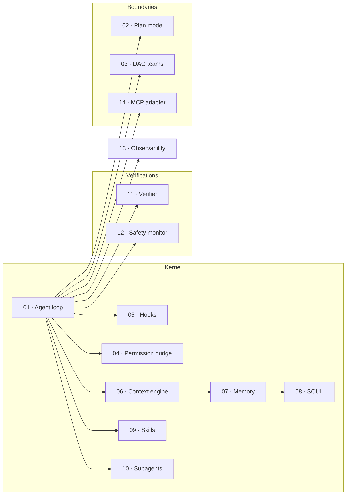

# The 14 building blocks reference

Each block is a coherent piece of the kernel with its own contract.
The block specs are the **canonical** descriptions of behaviour;
concept and architecture pages summarise and visualise them, but if
they ever disagree, the block spec wins.

## The catalogue

| # | Block | One-line summary |
|---|------|------------------|
| 01 | [Agent loop](../blocks/01-agent-loop.md) | The kernel: assemble → think → tool → reduce → repeat. |
| 02 | [Plan mode](../blocks/02-plan-mode.md) | Read-only design pass with a written, approvable plan artifact. |
| 03 | [DAG teams](../blocks/03-dag-teams.md) | Parallel multi-strand work with `PARK` for non-blocking approvals. |
| 04 | [Permission bridge](../blocks/04-permission-bridge.md) | Authorization as a runtime primitive, not an LLM decision. |
| 05 | [Hooks & TDD gate](../blocks/05-hooks-and-tdd-gate.md) | Deterministic Python on lifecycle events; flagship is the TDD gate. |
| 06 | [Context engine](../blocks/06-context-engine.md) | Five-layer transcript with prompt-cache breakpoints and never-compacted SOUL. |
| 07 | [Three-tier memory](../blocks/07-memory-three-tier.md) | Procedural / episodic / semantic + persona, SQLite FTS5 + Chroma. |
| 08 | [SOUL.md persona](../blocks/08-soul-md-persona.md) | The agent's persona partition; lives in L2; never compacted. |
| 09 | [Skill engine + extractor](../blocks/09-skill-engine-and-extractor.md) | Discover-by-description, narrowed tool surface, post-task extraction. |
| 10 | [Subagent + worktree](../blocks/10-subagent-worktree.md) | Scoped agents in isolated git worktrees with structured returns. |
| 11 | [Verifier (cross-channel)](../blocks/11-verifier-cross-channel.md) | Two-phase: cheap objective checks then different-family LLM judge. |
| 12 | [Safety monitor](../blocks/12-safety-monitor.md) | Continuous cheap-model monitor running every N steps. |
| 13 | [Observability + HIR](../blocks/13-observability-hir.md) | OTel + JSONL spans tagged with HIR primitives; replayable. |
| 14 | [MCP adapter](../blocks/14-mcp-adapter.md) | stdio + HTTP MCP client; wraps every external tool with the bridge. |

## How blocks compose

The "kernel" group is the read-this-first set; the "verifications"
group is what runs alongside the loop; "boundaries" is what the loop
delegates to or talks to.

## Suggested reading paths

- **First-time reader:** 01 → 04 → 05 → 06 → 09 → 10
- **Operator (running it in production):** 04 → 05 → 11 → 12 → 13
- **Plugin author:** 05 → 09 → 14 (and the
  [How-To](../howto/index.md) recipes)
- **Researcher:** 01 → 11 → 13 → [Research](../research/index.md)

[← Reference overview](index.md){ .md-button }
[Continue to Slash commands →](commands.md){ .md-button .md-button--primary }
