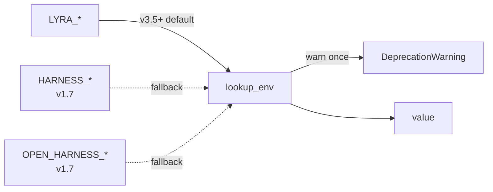
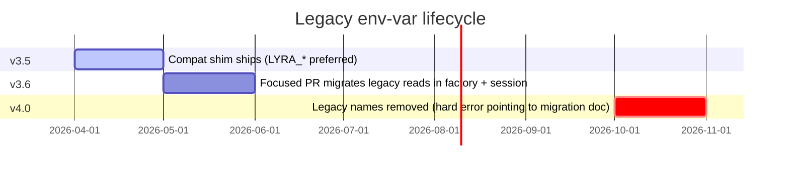

# Environment variables <span class="lyra-badge reference">reference</span>

Lyra reads runtime config from `~/.lyra/config.toml`, from the
project's `.lyra/config.toml`, and from the environment. Environment
wins.

The canonical names use the `LYRA_*` prefix. Older deployments still
use `HARNESS_*` (v1.7) and `OPEN_HARNESS_*` (v1.7). The
[`env_compat`](https://github.com/lyra-contributors/lyra/tree/main/packages/lyra-core/src/lyra_core/env_compat.py)
shim reads new names first and falls back to the legacy ones, with a
one-shot `DeprecationWarning` per legacy hit.

## Canonical → legacy map



| Canonical (use this) | Legacy aliases (still read) |
|---|---|
| `LYRA_LLM_MODEL` | `HARNESS_LLM_MODEL` |
| `LYRA_REASONING_EFFORT` | `HARNESS_REASONING_EFFORT` |
| `LYRA_MAX_OUTPUT_TOKENS` | `HARNESS_MAX_OUTPUT_TOKENS` |
| `LYRA_MODE` | `OPEN_HARNESS_MODE` |
| `LYRA_MODEL` | `OPEN_HARNESS_MODEL`, `HARNESS_LLM_MODEL` |
| `LYRA_DEEPSEEK_MODEL` | `OPEN_HARNESS_DEEPSEEK_MODEL`, `DEEPSEEK_MODEL` |
| `LYRA_OPENAI_MODEL` | `OPEN_HARNESS_OPENAI_MODEL`, `OPENAI_MODEL` |
| `LYRA_OPENAI_REASONING_MODEL` | `OPEN_HARNESS_OPENAI_REASONING_MODEL` |
| `LYRA_XAI_MODEL` | `OPEN_HARNESS_XAI_MODEL`, `XAI_MODEL` |
| `LYRA_GROQ_MODEL` | `OPEN_HARNESS_GROQ_MODEL`, `GROQ_MODEL` |
| `LYRA_CEREBRAS_MODEL` | `OPEN_HARNESS_CEREBRAS_MODEL`, `CEREBRAS_MODEL` |
| `LYRA_MISTRAL_MODEL` | `OPEN_HARNESS_MISTRAL_MODEL`, `MISTRAL_MODEL` |
| `LYRA_OPENROUTER_MODEL` | `OPEN_HARNESS_OPENROUTER_MODEL`, `OPENROUTER_MODEL` |
| `LYRA_DASHSCOPE_MODEL` | `OPEN_HARNESS_DASHSCOPE_MODEL`, `DASHSCOPE_MODEL` |
| `LYRA_QWEN_MODEL` | `OPEN_HARNESS_QWEN_MODEL`, `QWEN_MODEL` |
| `LYRA_GEMINI_MODEL` | `OPEN_HARNESS_GEMINI_MODEL`, `GEMINI_MODEL` |
| `LYRA_LOCAL_MODEL` | `OPEN_HARNESS_LOCAL_MODEL`, `OLLAMA_MODEL` |
| `LYRA_LMSTUDIO_MODEL` | `OPEN_HARNESS_LMSTUDIO_MODEL` |
| `LYRA_VLLM_MODEL` | `OPEN_HARNESS_VLLM_MODEL`, `VLLM_MODEL` |
| `LYRA_TGI_MODEL` | `OPEN_HARNESS_TGI_MODEL`, `TGI_MODEL` |
| `LYRA_LLAMA_SERVER_MODEL` | `OPEN_HARNESS_LLAMA_SERVER_MODEL` |
| `LYRA_LLAMAFILE_MODEL` | `OPEN_HARNESS_LLAMAFILE_MODEL` |
| `LYRA_MLX_MODEL` | `OPEN_HARNESS_MLX_MODEL`, `MLX_MODEL` |
| `LYRA_MLX_BASE_URL` | `OPEN_HARNESS_MLX_BASE_URL` |

## Provider credentials (no legacy alias)

These are owned by the provider, not by Lyra — Lyra reads them as-is
without deprecation rewriting:

| Var | Provider |
|---|---|
| `ANTHROPIC_API_KEY` | Anthropic |
| `OPENAI_API_KEY` | OpenAI |
| `DEEPSEEK_API_KEY` | DeepSeek |
| `GEMINI_API_KEY` | Google Gemini |
| `XAI_API_KEY` | xAI |
| `GROQ_API_KEY` | Groq |
| `CEREBRAS_API_KEY` | Cerebras |
| `MISTRAL_API_KEY` | Mistral |
| `DASHSCOPE_API_KEY` | Qwen / Alibaba |
| `OPENROUTER_API_KEY` | OpenRouter |
| `COPILOT_TOKEN` | GitHub Copilot |
| `OPENAI_COMPAT_API_KEY` | Generic OpenAI-compatible |

AWS Bedrock and GCP Vertex use their respective SDK credential chains
(`AWS_PROFILE` / `~/.aws/credentials`, ADC for GCP) — Lyra doesn't
prescribe alternatives.

## Other Lyra vars

| Var | Default | Use |
|---|---|---|
| `LYRA_HOME` | `~/.lyra` | Override the user-scope state root |
| `LYRA_CONFIG` | `$LYRA_HOME/config.toml` | Override the config file path |
| `LYRA_LOG_LEVEL` | `INFO` | `DEBUG`/`INFO`/`WARNING`/`ERROR` |
| `LYRA_TRACE_DIR` | `<session>/trace.jsonl` | Override the trace output dir |
| `LYRA_DAEMON_URL` | `unix:///tmp/lyra.sock` | Daemon socket / URL |
| `LYRA_DISABLE_TELEMETRY` | `1` (default off) | Reserved; Lyra ships no telemetry |
| `NO_COLOR` | (unset) | Standard `NO_COLOR` honoured by the renderer |

## Deprecation timeline



## Inspecting your environment

```bash
$ lyra doctor --json | jq .legacy_env

{
  "HARNESS_LLM_MODEL": 4,
  "OPEN_HARNESS_DEEPSEEK_MODEL": 1
}
```

`lyra doctor --json` reports the per-name legacy hit count from
[`env_compat.legacy_hits()`](https://github.com/lyra-contributors/lyra/tree/main/packages/lyra-core/src/lyra_core/env_compat.py)
so you know exactly which vars in your dotfiles still need updating
before v4.0.

[← Slash commands](commands.md){ .md-button }
[Continue to Research →](../research/index.md){ .md-button .md-button--primary }
