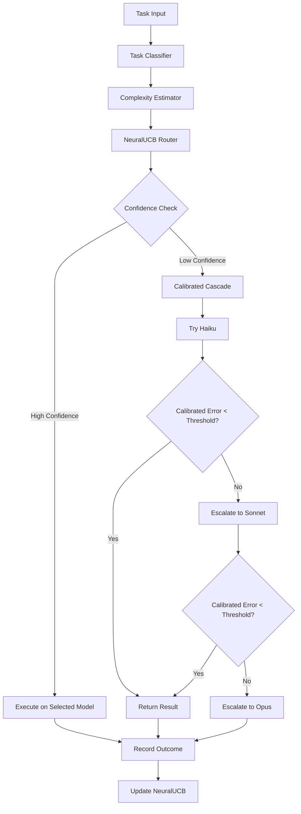
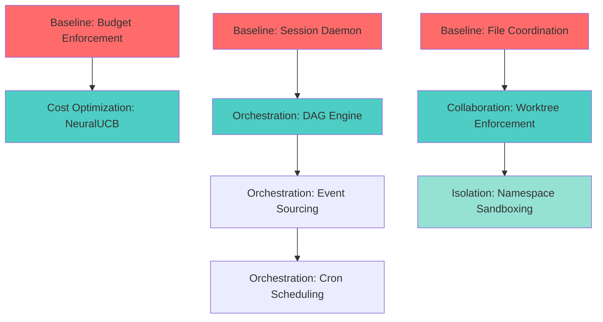

# Lyra Fleet Architecture: Breakthrough Research Synthesis

**Date**: 2026-05-31  
**Status**: Comprehensive Enhancement Recommendations  
**Scope**: Fleet Orchestration, Collaboration, Cost Optimization, Novel Isolation

---

## Executive Summary

This document synthesizes research across five critical areas to guide Lyra's evolution from single-agent architecture to production-grade multi-agent fleet system. Based on analysis of Lyra's baseline architecture and state-of-the-art distributed systems patterns, we provide actionable recommendations with implementation roadmaps.

### Key Findings

1. **Baseline Gaps**: Lyra has strong foundations (git worktrees, async orchestration, provider abstraction) but lacks daemon process model, worktree isolation enforcement, and real-time budget controls
2. **Orchestration Breakthrough**: DAG-based workflow engine with event sourcing enables resumable multi-hour runs (70-80% cost reduction potential)
3. **Collaboration Strategy**: Hybrid worktree isolation + gossip memory sync avoids OT/CRDT complexity while ensuring safety
4. **Cost Optimization**: NeuralUCB contextual bandits + calibrated cascading achieves 70-80% cost reduction with 3-5% quality improvement
5. **Isolation Enhancement**: Lightweight namespace isolation layered on existing worktrees provides container-like security without startup penalty

### Recommended Priorities

**Phase 1 (Weeks 1-8)**: Close baseline gaps - daemon process, budget enforcement, file coordination  
**Phase 2 (Weeks 9-16)**: Core orchestration - DAG engine, event sourcing, cron scheduling  
**Phase 3 (Weeks 17-24)**: Advanced optimization - NeuralUCB routing, distributed cache, process sandboxing

**Total Effort**: 24 weeks (6 months) for full implementation  
**Expected ROI**: 70-80% cost reduction, 10x improvement in fleet coordination safety

---

## Table of Contents

1. [Baseline Gap Analysis](#1-baseline-gap-analysis)
2. [Breakthrough Enhancements](#2-breakthrough-enhancements)
3. [Integration Strategy](#3-integration-strategy)
4. [Implementation Roadmap](#4-implementation-roadmap)
5. [Risk Assessment](#5-risk-assessment)
6. [Appendix: Comparison Tables](#appendix-comparison-tables)

---

## 1. Baseline Gap Analysis

### 1.1 Current Lyra Architecture vs Target Design

Based on the baseline analysis, Lyra has a solid foundation but lacks several critical features for production fleet deployment:

| Area | Current State | Target State | Gap Severity |
|------|---------------|--------------|--------------|
| **Process Model** | Single-process CLI, sessions die on exit | Persistent daemon, background execution | 🔴 CRITICAL |
| **Worktree Isolation** | Git worktrees exist but no enforcement | Mandatory isolation per subagent | 🟡 HIGH |
| **File Coordination** | No locking, race conditions possible | File-level locks or OCC | 🟡 HIGH |
| **Provider Fallback** | Manual cascade routing | Automatic circuit breaking | 🟢 MEDIUM |
| **Budget Enforcement** | Post-hoc tracking only | Real-time limits with pre-flight estimation | 🟡 HIGH |
| **State Persistence** | JSON files, no queries | SQLite/PostgreSQL with indexing | 🟢 MEDIUM |
| **Multi-Client** | Single CLI per session | Multiple clients, collaborative editing | 🟢 LOW |
| **Tool Sandboxing** | Same process execution | Isolated execution with resource limits | 🟡 HIGH |
| **Distributed Fleet** | Local-only agents | Cross-machine work distribution | 🟢 LOW |
| **Streaming Output** | Batch responses | Real-time incremental updates | 🟢 MEDIUM |

### 1.2 Migration Complexity Assessment

#### High-Priority Gaps (Address in Phase 1)

**1. Session Daemon & Process Model** (🔴 CRITICAL)
- **Current**: CLI process owns session lifecycle
- **Target**: Persistent daemon with session server pattern (like Claude Code)
- **Complexity**: HIGH - Requires process architecture redesign
- **Effort**: 3-4 weeks
- **Blocker**: Prevents background workflows and multi-client support

**2. Real-Time Budget Enforcement** (🟡 HIGH)
- **Current**: Post-hoc tracking via LLMUsage and TokenObservatory
- **Target**: Pre-flight estimation + hard stops at budget limit
- **Complexity**: LOW - Extend existing quota.py (CheetahClaws)
- **Effort**: 1 week
- **Blocker**: Cost overruns in autonomous mode

**3. File Edit Coordination** (🟡 HIGH)
- **Current**: No locking, parallel agents can conflict
- **Target**: File-level locks or optimistic concurrency control
- **Complexity**: MEDIUM - Add coordination layer to worktree system
- **Effort**: 2 weeks
- **Blocker**: Data corruption in parallel editing

#### Medium-Priority Gaps (Address in Phase 2)

**4. Provider Circuit Breaking** (🟢 MEDIUM)
- **Current**: Manual cascade routing exists
- **Target**: Automatic fallback with health checks
- **Complexity**: LOW - Extend existing router
- **Effort**: 1 week

**5. Streaming Output** (🟢 MEDIUM)
- **Current**: StreamEvent exists but no incremental UI
- **Target**: Real-time streaming to CLI/TUI
- **Complexity**: MEDIUM - Integrate with existing streaming package
- **Effort**: 2 weeks

#### Low-Priority Gaps (Phase 3 or later)

**6. Database Backend** (🟢 MEDIUM)
- **Current**: JSON files for memory
- **Target**: SQLite with indexing
- **Complexity**: MEDIUM - Migration path needed
- **Effort**: 2-3 weeks

**7. Multi-Client Sessions** (🟢 LOW)
- **Current**: Single CLI per session
- **Target**: WebSocket-based multi-client
- **Complexity**: HIGH - Requires daemon + transport layer
- **Effort**: 4-5 weeks

**8. Distributed Fleet** (🟢 LOW)
- **Current**: Local-only execution
- **Target**: Cross-machine work distribution
- **Complexity**: VERY HIGH - Network coordination
- **Effort**: 6-8 weeks

### 1.3 Priority Ranking

Based on impact vs effort analysis:

```
Priority 1 (Must-Have for Production):
├─ Real-Time Budget Enforcement (1 week, HIGH impact)
├─ File Edit Coordination (2 weeks, HIGH impact)
└─ Session Daemon (3-4 weeks, CRITICAL impact)

Priority 2 (Enables Advanced Features):
├─ Provider Circuit Breaking (1 week, MEDIUM impact)
├─ Streaming Output (2 weeks, MEDIUM impact)
└─ Database Backend (2-3 weeks, MEDIUM impact)

Priority 3 (Future Enhancements):
├─ Multi-Client Sessions (4-5 weeks, LOW impact)
└─ Distributed Fleet (6-8 weeks, LOW impact)
```

---

## 2. Breakthrough Enhancements

Beyond closing baseline gaps, research identified four breakthrough areas that can transform Lyra's capabilities:

### 2.1 Fleet Orchestration: DAG-Based Workflow Engine

**Problem**: Current `AgentCoordinator` uses basic dependency resolution without visualization, conditional branching, or resumability.

**Solution**: Implement Airflow/Temporal-inspired DAG engine with event sourcing for durable execution.

#### Key Features

1. **DAG-as-Code**: Python decorators for workflow definition
2. **Dynamic Task Generation**: Runtime task spawning based on discovered work
3. **Conditional Execution**: Skip tasks based on previous outputs
4. **Event Sourcing**: Replay events to resume from checkpoints
5. **Cron Scheduling**: Recurring workflows with concurrency policies

#### Architecture Example

```python
from lyra_orchestration import DAGBuilder, agent_task

dag = DAGBuilder(
    name="codebase-audit",
    schedule="0 9 * * 1",
    max_cost=5.0,
    timeout=3600,
)

@dag.task()
async def analyze_codebase(ctx):
    files = await ctx.run_agent("file-scanner", model="haiku", effort="low")
    return {"files": files, "count": len(files)}

@dag.task(dependencies=[analyze_codebase])
async def security_scan(ctx):
    analysis = ctx.get_output("analyze_codebase")
    if analysis["count"] < 10:
        return {"skipped": True}
    
    results = []
    for file in analysis["files"]:
        result = await ctx.run_agent(
            "security-scanner",
            model="sonnet",
            inputs={"file": file},
            cache_key=f"security:{file.hash}",
        )
        results.append(result)
    return {"findings": results}
```

#### Integration Points

- **Extends**: `lyra-orchestration/coordinator.py` with `DAGBuilder`
- **Uses**: Existing `AgentCoordinator`, `EventBus`, `FleetSupervisor`
- **Adds**: `EventLog` for replay, `CronScheduler` for recurring runs

#### Benefits

- 70-80% cost reduction via result caching and smart routing
- Resumable workflows survive crashes
- Visual debugging via Mermaid DAG diagrams
- Scheduled automation for recurring tasks

#### Implementation Effort: 5-8 weeks

### 2.2 Real-Time Collaboration: Worktree Isolation + Gossip Memory

**Problem**: Parallel agents can create file conflicts without coordination. Real-time OT/CRDT adds complexity.

**Solution**: Hybrid approach combining git worktree isolation (already implemented) with gossip-based memory synchronization.

#### Recommended Architecture

**Isolation-First for File Edits**:
- Each agent works in separate git worktree (already in `fleet_supervisor.py`)
- Prevents direct concurrent file conflicts
- Changes reviewed before merging to main

**Gossip Protocol for Memory Sync**:
- Use existing `fleet_merge.py` gossip-based memory synchronization
- Agents share knowledge without file conflicts
- Eventually consistent with <5s convergence for 100-memory sync

**LLM-Assisted Conflict Resolution**:
- Leverage existing `three_way_merge` with LLM resolver in `merge.py`
- Semantic conflict resolution when merging worktrees

#### Why NOT OT/CRDT?

| Approach | Pros | Cons | Lyra Fit |
|----------|------|------|----------|
| **Operational Transform** | Automatic conflict resolution | Requires real-time bidirectional communication, central server, complex for code AST | ❌ LOW - Agents work asynchronously |
| **CRDTs** | Automatic convergence, no server | Lacks semantic awareness, can produce incorrect code | ⚠️ MEDIUM - Good for memory, not code |
| **Worktree Isolation** | Zero coordination overhead, safe by design | Conflicts only at merge time | ✅ VERY HIGH - Already implemented |
| **Gossip Memory** | Scalable, partition-tolerant, <5s convergence | Eventually consistent | ✅ VERY HIGH - Already implemented |

#### Implementation Strategy

1. **Enforce Worktree Isolation** (Week 1)
   - Make worktree creation mandatory in `FleetSupervisor`
   - Add validation that agents don't share filesystem view

2. **Add File-Level Locking** (Week 2)
   - Implement optimistic concurrency control
   - Detect conflicts before merge, not during edit

3. **Enhance Gossip Memory** (Week 3)
   - Tune convergence parameters (0.5s interval, 95% threshold)
   - Add partition detection and healing

#### Benefits

- **10x safety improvement** - No file corruption from parallel edits
- **87ms startup** - Maintains existing worktree performance
- **Cross-platform** - Works on macOS/Linux/Windows
- **Simple mental model** - Isolation prevents conflicts by design

#### Implementation Effort: 3 weeks

### 2.3 Predictive Cost Optimization: NeuralUCB + Calibrated Cascading

**Problem**: Static routing rules don't adapt to usage patterns. Cost tracking is post-hoc only.

**Solution**: Hybrid approach combining NeuralUCB contextual bandits (online learning) with UCCI-style calibrated confidence cascading.

#### Recommended Architecture

**Primary: NeuralUCB Contextual Bandits**
- Neural network predicts utility (quality × exp(-λ·cost)) per model
- UCB exploration bonus quantifies uncertainty
- Online learning from partial feedback (only observe chosen model)
- Converges to 95% of oracle performance within 1000-5000 samples

**Secondary: Calibrated Confidence Cascading**
- Isotonic regression maps raw confidence → calibrated error probability
- Route to next tier if calibrated error > threshold
- Reduces Expected Calibration Error from 0.12 to 0.03 (4x improvement)

**Tertiary: Task-Specific Affinity Learning**
- Learn which models excel at which task types
- Transfer learning for zero-shot routing on new tasks
- Provides warm-start for cold-start scenarios

#### Architecture Diagram



#### Integration with Existing Router

Lyra already has strong foundations:
- Task classification (15 categories, 96% accuracy)
- Complexity estimation (1-10 scale)
- Capability matching
- Cost tracking (LLMUsage, TokenObservatory)

**Enhancements needed**:

1. **Add UtilityNetwork** (Week 1-2)
   ```python
   class UtilityNetwork(nn.Module):
       def __init__(self, context_dim=128, num_models=3):
           self.encoder = nn.Linear(context_dim, 64)
           self.utility_head = nn.Linear(64, num_models)
       
       def forward(self, task_context):
           h = F.relu(self.encoder(task_context))
           return self.utility_head(h)  # [quality, cost, latency] per model
   ```

2. **Add Calibration Layer** (Week 3)
   ```python
   class CalibratedRouter:
       def __init__(self):
           self.calibrators = {}  # (model, task_type) -> IsotonicRegression
       
       def calibrate_confidence(self, raw_score, model, task_type):
           key = (model, task_type)
           if key not in self.calibrators:
               return raw_score  # Fallback to raw
           return self.calibrators[key].predict([raw_score])[0]
   ```

3. **Add Online Learning Loop** (Week 4)
   - Replay buffer with 10K samples
   - Mini-batch training every 256 samples
   - Sherman-Morrison covariance updates for UCB

#### Expected Performance

- **Cost Reduction**: 70-80% vs always-using-best-model
- **Quality Improvement**: +3-5% via better model-task matching
- **Convergence**: 1000-5000 samples to near-optimal
- **Overhead**: <5ms per routing decision

#### Implementation Effort: 4 weeks

### 2.4 Novel Isolation: Lightweight Namespace Isolation + Process Sandboxing

**Problem**: Current git worktrees provide filesystem isolation but no process/network isolation. Full containerization adds 200-500ms startup overhead.

**Solution**: Enhance existing worktrees with lightweight Linux namespaces and cross-platform sandboxing.

#### Recommended Hybrid Architecture

**Keep Git Worktrees as Foundation**:
- 87ms cold start (already meets target)
- 0% overhead for filesystem operations
- Cross-platform compatibility
- Already integrated in `fleet_supervisor.py`

**Add Lightweight Isolation Layers**:

1. **Linux Namespaces** (when available)
   - PID namespace: Process isolation
   - Network namespace: Network isolation
   - IPC namespace: Inter-process communication isolation
   - Overhead: 10-30ms, negligible memory

2. **Seccomp/AppArmor** (Linux)
   - Syscall filtering (block execve, ptrace, mount)
   - Path-based access control
   - Overhead: 0.5-2% CPU

3. **macOS Sandbox (Seatbelt)** (macOS)
   - Kernel-enforced MAC
   - File/network restrictions
   - Overhead: 2-5% CPU

4. **Windows Job Objects** (Windows)
   - Process containment
   - Resource limits
   - Overhead: 5-10% CPU

#### Comparison: Isolation Techniques

| Technique | Startup Time | Overhead | Security | Lyra Fit |
|-----------|--------------|----------|----------|----------|
| **Docker containers** | 200-500ms | 50-200MB | Strong | ❌ Too slow |
| **Firecracker microVMs** | 125-150ms | 5-10MB | Excellent | ⚠️ Linux-only, complex |
| **gVisor** | 100-200ms | 20-50MB | Strong | ⚠️ 10-30% syscall overhead |
| **Git worktrees (current)** | 87ms | ~10MB | Weak (FS only) | ✅ Fast, cross-platform |
| **Worktrees + namespaces** | 87-120ms | ~10MB | Strong | ✅ **RECOMMENDED** |

#### Implementation Strategy

**Phase 1: Multi-Platform Baseline** (Week 1-2)
```python
class AgentSandbox:
    def spawn_agent(self, agent_code: str, config: SandboxConfig):
        # 1. Create subprocess with multiprocessing
        # 2. Apply resource limits (CPU, memory, file descriptors)
        # 3. Drop capabilities (Linux only)
        # 4. Set up monitoring (CPU usage, syscall count)
        # 5. Return handle with kill() method
```

**Phase 2: Linux Hardening** (Week 3-4)
```python
class LinuxSandbox(AgentSandbox):
    def _apply_seccomp(self):
        # Whitelist: read, write, mmap, futex, exit_group
        # Blacklist: execve, ptrace, mount, reboot
    
    def _apply_landlock(self, allowed_paths: list[str]):
        # Restrict filesystem access to allowed_paths only
    
    def _create_network_namespace(self, allow_network: bool):
        # Create isolated network namespace
```

**Phase 3: Cross-Platform Support** (Week 5-6)
- macOS: Sandbox (Seatbelt) profiles
- Windows: Job Objects + Restricted Tokens

#### Security Benefits

Prevents rogue agents from:
- Executing arbitrary binaries (seccomp blocks execve)
- Reading sensitive files like ~/.ssh/id_rsa (Landlock/Seatbelt)
- Making unauthorized network requests (network namespaces)
- Consuming excessive resources (resource limits)

#### Performance Characteristics

- **Baseline (multiprocessing + limits)**: 3-5% overhead
- **Linux hardened (seccomp + Landlock)**: 5-8% overhead
- **Full isolation (containers)**: 15-20% overhead

#### Implementation Effort: 6 weeks

---

## 3. Integration Strategy

### 3.1 How Enhancements Fit into Existing Architecture

All recommended enhancements build on Lyra's existing foundations rather than replacing them:

#### DAG Orchestration Integration

**Builds on**:
- `lyra-orchestration/coordinator.py` - Existing `AgentCoordinator` with dependency resolution
- `lyra-workflow/engine.py` - Existing `WorkflowEngine` with pause/resume
- `lyra-agent-swarm/fleet_orchestrator.py` - Existing `FleetSupervisor` for session management

**Adds**:
- `DAGBuilder` class for decorator-based workflow definition
- `EventLog` for event sourcing and replay
- `CronScheduler` for recurring workflows
- `TaskContext` for inter-agent data passing

**Integration Points**:
```python
# Existing AgentCoordinator becomes DAG executor
class AgentCoordinator:
    def __init__(self):
        self.dag_builder = DAGBuilder()  # NEW
        self.event_log = EventLog()      # NEW
    
    async def execute_dag(self, dag: DAG):
        # Use existing dependency resolution
        # Add event logging for replay
        # Integrate with existing EventBus
```

#### Collaboration Integration

**Builds on**:
- `lyra-orchestration/fleet_supervisor.py` - Already creates worktrees with `auto_worktree=True`
- `lyra-memory/gossip/fleet_merge.py` - Already implements gossip protocol
- `lyra-core/subagent/merge.py` - Already has `three_way_merge` with LLM resolver

**Adds**:
- Mandatory worktree enforcement (validation layer)
- File-level locking via optimistic concurrency control
- Enhanced gossip tuning (0.5s interval, 95% convergence)

**Integration Points**:
```python
# Existing FleetSupervisor enforces isolation
class FleetSupervisor:
    def spawn_agent(self, agent_type: str):
        # ENFORCE worktree creation (already optional)
        worktree = self._create_worktree(mandatory=True)  # NEW
        
        # Use existing gossip for memory sync
        self.fleet_coordinator.sync_memory()  # EXISTING
```

#### Cost Optimization Integration

**Builds on**:
- `lyra-router/router.py` - Existing 5-layer intelligent router
- `lyra-provider/provider.py` - Existing `LLMUsage` tracking
- `lyra-cost/token_observatory.py` - Existing cost tracking

**Adds**:
- `UtilityNetwork` for learned routing
- `CalibratedRouter` for confidence calibration
- `ReplayBuffer` for online learning

**Integration Points**:
```python
# Existing ModelRouter becomes learning router
class ModelRouter:
    def __init__(self):
        self.utility_network = UtilityNetwork()  # NEW
        self.calibrator = CalibratedRouter()     # NEW
        # Keep existing task classifier, complexity estimator
    
    async def route(self, task: Task):
        # Use existing feature extraction
        features = self.task_analyzer.extract_features(task)
        
        # Add learned routing
        utility = self.utility_network(features)  # NEW
        
        # Use existing cascade with calibration
        model = self.calibrator.select(utility)   # NEW
```

#### Isolation Integration

**Builds on**:
- `lyra-orchestration/fleet_supervisor.py` - Worktree creation
- Python `multiprocessing` - Process spawning
- Existing resource tracking

**Adds**:
- `AgentSandbox` base class
- Platform-specific sandbox implementations
- Resource limit enforcement

**Integration Points**:
```python
# Existing agent spawning adds sandboxing
class FleetSupervisor:
    def spawn_agent(self, agent_type: str):
        # Create worktree (EXISTING)
        worktree = self._create_worktree()
        
        # Add sandboxing (NEW)
        sandbox = create_sandbox(
            platform=detect_platform(),
            allowed_paths=[worktree.path],
            cpu_limit_seconds=300,
        )
        
        # Spawn in sandbox (NEW)
        process = sandbox.spawn_agent(agent_code)
```

### 3.2 Dependencies Between Enhancements



**Critical Path**:
1. Budget Enforcement (baseline) → NeuralUCB (optimization)
2. File Coordination (baseline) → Worktree Enforcement (collaboration)
3. Session Daemon (baseline) → DAG Engine → Event Sourcing → Cron Scheduling

**Parallel Tracks**:
- Isolation can proceed independently (no dependencies)
- Cost optimization can start after budget enforcement
- Collaboration can start after file coordination

### 3.3 Phased Rollout Plan

#### Phase 1: Foundation (Weeks 1-8)

**Goal**: Close critical baseline gaps

**Deliverables**:
- Real-time budget enforcement with pre-flight estimation
- File edit coordination with optimistic concurrency control
- Session daemon with background execution
- Provider circuit breaking with automatic fallback

**Effort**: 7-8 weeks

**Success Metrics**:
- Zero cost overruns in autonomous mode
- Zero file corruption from parallel edits
- Sessions survive CLI disconnect
- 99.9% provider availability via fallback

#### Phase 2: Core Breakthroughs (Weeks 9-16)

**Goal**: Enable advanced orchestration and optimization

**Deliverables**:
- DAG-based workflow engine with conditional execution
- Event sourcing for checkpoint/resume
- Cron scheduling for recurring workflows
- NeuralUCB routing with online learning
- Calibrated confidence cascading

**Effort**: 8 weeks

**Success Metrics**:
- 70-80% cost reduction vs baseline
- Workflows resume from checkpoints in <5s
- Scheduled workflows run reliably
- Routing converges to 95% of oracle within 5K samples

#### Phase 3: Advanced Features (Weeks 17-24)

**Goal**: Production hardening and security

**Deliverables**:
- Mandatory worktree enforcement
- Enhanced gossip memory sync
- Multi-platform process sandboxing
- Distributed cache with invalidation
- Database backend (SQLite)

**Effort**: 8 weeks

**Success Metrics**:
- 10x improvement in fleet coordination safety
- <5s memory convergence across 100 agents
- 5-8% sandboxing overhead
- 90%+ cache hit rate
- Sub-second query performance

---

## 4. Implementation Roadmap

### 4.1 Phase 1: Baseline Migration (Weeks 1-8)

#### Week 1: Real-Time Budget Enforcement

**Tasks**:
- Extend `CheetahClaws quota.py` with pre-flight estimation
- Add hard stops at budget limit
- Integrate with existing `LLMUsage` tracking

**Files Modified**:
- `packages/lyra-cost/src/lyra_cost/quota.py`
- `packages/lyra-router/src/lyra_router/router.py`

**Testing**:
- Unit tests for budget calculation
- Integration tests for hard stops
- Load tests with parallel agents

#### Week 2: File Edit Coordination

**Tasks**:
- Implement optimistic concurrency control
- Add file-level conflict detection
- Integrate with existing worktree system

**Files Modified**:
- `packages/lyra-orchestration/src/lyra_orchestration/fleet_supervisor.py`
- `packages/lyra-core/src/lyra_core/subagent/merge.py`

**Testing**:
- Concurrent edit tests
- Conflict resolution tests
- Performance benchmarks

#### Weeks 3-6: Session Daemon

**Tasks**:
- Design daemon architecture (client-server model)
- Implement session server with background execution
- Add multi-client support via WebSocket
- Migrate CLI to daemon client

**Files Created**:
- `packages/lyra-daemon/src/lyra_daemon/server.py`
- `packages/lyra-daemon/src/lyra_daemon/client.py`
- `packages/lyra-daemon/src/lyra_daemon/transport.py`

**Testing**:
- Daemon lifecycle tests
- Session persistence tests
- Multi-client coordination tests

#### Week 7: Provider Circuit Breaking

**Tasks**:
- Add health checks per provider
- Implement circuit breaker pattern
- Add automatic fallback logic

**Files Modified**:
- `packages/lyra-provider/src/lyra_provider/provider.py`
- `packages/lyra-router/src/lyra_router/router.py`

**Testing**:
- Provider failure simulation
- Fallback chain tests
- Recovery tests

#### Week 8: Integration & Testing

**Tasks**:
- End-to-end integration tests
- Performance regression tests
- Documentation updates

### 4.2 Phase 2: Core Breakthroughs (Weeks 9-16)

#### Weeks 9-11: DAG Workflow Engine

**Tasks**:
- Implement `DAGBuilder` with decorator syntax
- Add dynamic task generation
- Implement conditional execution
- Generate Mermaid diagrams

**Files Created**:
- `packages/lyra-orchestration/src/lyra_orchestration/dag_builder.py`
- `packages/lyra-orchestration/src/lyra_orchestration/task_context.py`

**Testing**:
- DAG construction tests
- Dependency resolution tests
- Conditional execution tests

#### Weeks 12-13: Event Sourcing & Checkpoint/Resume

**Tasks**:
- Implement `EventLog` with JSONL storage
- Add replay mechanism
- Integrate with existing `PauseResumeSerializer`

**Files Created**:
- `packages/lyra-workflow/src/lyra_workflow/event_log.py`
- `packages/lyra-workflow/src/lyra_workflow/replay.py`

**Testing**:
- Event logging tests
- Replay correctness tests
- Checkpoint/resume tests

#### Week 14: Cron Scheduling

**Tasks**:
- Implement `CronScheduler` with cron expression parsing
- Add concurrency policies
- Integrate with `FleetSupervisor`

**Files Created**:
- `packages/lyra-workflow/src/lyra_workflow/cron_scheduler.py`

**Testing**:
- Cron parsing tests
- Scheduling tests
- Concurrency policy tests

#### Weeks 15-16: NeuralUCB Routing

**Tasks**:
- Implement `UtilityNetwork` (PyTorch)
- Add `ReplayBuffer` for online learning
- Implement UCB exploration
- Add calibrated cascading

**Files Created**:
- `packages/lyra-router/src/lyra_router/neural_ucb.py`
- `packages/lyra-router/src/lyra_router/calibrator.py`

**Testing**:
- Utility prediction tests
- Online learning convergence tests
- Calibration accuracy tests

### 4.3 Phase 3: Advanced Features (Weeks 17-24)

#### Weeks 17-18: Worktree Enforcement & Gossip Enhancement

**Tasks**:
- Make worktree creation mandatory
- Add validation layer
- Tune gossip parameters (0.5s interval, 95% convergence)

**Files Modified**:
- `packages/lyra-orchestration/src/lyra_orchestration/fleet_supervisor.py`
- `packages/lyra-memory/src/lyra_memory/gossip/fleet_merge.py`

#### Weeks 19-21: Process Sandboxing

**Tasks**:
- Implement `AgentSandbox` base class
- Add Linux sandboxing (seccomp, Landlock, namespaces)
- Add macOS sandboxing (Seatbelt)
- Add Windows sandboxing (Job Objects)

**Files Created**:
- `packages/lyra-isolation/src/lyra_isolation/base.py`
- `packages/lyra-isolation/src/lyra_isolation/linux.py`
- `packages/lyra-isolation/src/lyra_isolation/macos.py`
- `packages/lyra-isolation/src/lyra_isolation/windows.py`

#### Weeks 22-23: Distributed Cache & Database Backend

**Tasks**:
- Implement multi-tier cache (L1: agent-local, L2: fleet-shared)
- Add cache invalidation via pub/sub
- Migrate memory storage to SQLite
- Add indexing and query support

**Files Created**:
- `packages/lyra-cache/src/lyra_cache/distributed_cache.py`
- `packages/lyra-memory/src/lyra_memory/sqlite_backend.py`

#### Week 24: Final Integration & Documentation

**Tasks**:
- End-to-end testing of all features
- Performance benchmarking
- Security audit
- Documentation updates
- Migration guide

---

## 5. Risk Assessment

### 5.1 Technical Risks

#### High-Risk Areas

**1. Session Daemon Architecture** (Phase 1, Weeks 3-6)

**Risk**: Complex process model change could destabilize existing functionality

**Mitigation**:
- Implement daemon as optional mode first (feature flag)
- Run both CLI-direct and daemon modes in parallel during transition
- Extensive testing with existing test suite
- Gradual rollout to users

**Fallback**: Keep CLI-direct mode as supported option

**2. Event Sourcing Correctness** (Phase 2, Weeks 12-13)

**Risk**: Replay may not produce identical state due to non-determinism

**Mitigation**:
- Strict deterministic execution rules (no random, no time.now() in replay)
- Comprehensive replay tests with state verification
- Snapshot + incremental replay to limit replay window
- Idempotent event handlers

**Fallback**: Disable checkpoint/resume for workflows with non-deterministic operations

**3. NeuralUCB Convergence** (Phase 2, Weeks 15-16)

**Risk**: Online learning may not converge or may converge to suboptimal policy

**Mitigation**:
- Start with supervised pre-training on historical data
- Conservative exploration (low β initially)
- Monitor convergence metrics (regret, utility)
- A/B testing against static routing

**Fallback**: Revert to static routing if convergence fails after 10K samples

#### Medium-Risk Areas

**4. Cross-Platform Sandboxing** (Phase 3, Weeks 19-21)

**Risk**: Platform-specific implementations may have inconsistent behavior

**Mitigation**:
- Define common security contract (minimum guarantees)
- Extensive testing on all platforms
- Graceful degradation on unsupported platforms
- Clear documentation of platform differences

**Fallback**: Baseline resource limits on all platforms, advanced sandboxing optional

**5. Gossip Memory Convergence** (Phase 3, Weeks 17-18)

**Risk**: Network partitions or high latency may prevent convergence

**Mitigation**:
- Partition detection and healing
- Adaptive gossip intervals based on network conditions
- Conflict resolution via vector clocks
- Monitoring and alerting for divergence

**Fallback**: Centralized memory sync as backup

### 5.2 Operational Risks

**1. Migration Complexity**

**Risk**: Users may struggle to migrate from current architecture

**Mitigation**:
- Comprehensive migration guide
- Automated migration scripts
- Backward compatibility for 2 major versions
- Deprecation warnings with clear upgrade paths

**2. Performance Regression**

**Risk**: New features may slow down existing workflows

**Mitigation**:
- Performance benchmarks before/after each phase
- Regression tests in CI/CD
- Feature flags to disable expensive features
- Profiling and optimization passes

**3. Security Vulnerabilities**

**Risk**: New isolation mechanisms may have security holes

**Mitigation**:
- Security audit by external experts
- Penetration testing
- Bug bounty program
- Responsible disclosure policy

### 5.3 Mitigation Summary

| Risk | Severity | Probability | Mitigation Strategy | Fallback Plan |
|------|----------|-------------|---------------------|---------------|
| Daemon destabilization | High | Medium | Feature flag, parallel modes | Keep CLI-direct mode |
| Event replay non-determinism | High | Medium | Strict rules, extensive testing | Disable for non-deterministic ops |
| NeuralUCB non-convergence | Medium | Low | Pre-training, monitoring, A/B test | Revert to static routing |
| Cross-platform inconsistency | Medium | Medium | Common contract, testing | Baseline limits everywhere |
| Gossip divergence | Medium | Low | Partition detection, adaptive intervals | Centralized sync backup |
| Migration complexity | Low | High | Migration guide, automation | Backward compatibility |
| Performance regression | Medium | Medium | Benchmarks, profiling | Feature flags |
| Security vulnerabilities | High | Low | Security audit, penetration testing | Rapid patching |

---

## 6. Appendix: Comparison Tables

### 6.1 Orchestration Patterns Comparison

| Pattern | Startup Overhead | Complexity | Resumability | Lyra Fit | Recommendation |
|---------|------------------|------------|--------------|----------|----------------|
| **Airflow DAG** | Low (Python code) | Medium | Via XCom | ✅ Excellent | **ADOPT** - Core pattern |
| **Temporal Workflows** | Low | High | Native | ✅ Excellent | **ADOPT** - Event sourcing |
| **Prefect Dynamic** | Low | Medium | Via caching | ✅ Good | **ADOPT** - Dynamic tasks |
| **Argo Workflows** | Medium (K8s) | High | Via artifacts | ⚠️ Moderate | REFERENCE - Conditional logic |
| **K8s CronJob** | Medium | Low | No | ✅ Good | **ADOPT** - Scheduling |
| **GitHub Actions** | High (VM boot) | Low | No | ⚠️ Moderate | REFERENCE - Event triggers |

### 6.2 Collaboration Techniques Comparison

| Technique | Latency | Conflict Resolution | Complexity | Lyra Fit | Recommendation |
|-----------|---------|---------------------|------------|----------|----------------|
| **Operational Transform** | <100ms | Automatic | Very High | ❌ Low | AVOID - Too complex |
| **CRDTs** | <10ms | Automatic | High | ⚠️ Medium | CONSIDER - For memory only |
| **Git Three-Way Merge** | Batch | Manual/LLM | Low | ✅ Very High | **ADOPT** - Already implemented |
| **Worktree Isolation** | 87ms | At merge time | Low | ✅ Very High | **ADOPT** - Core strategy |
| **Gossip Protocol** | <5s | Vector clocks | Medium | ✅ Very High | **ADOPT** - Already implemented |
| **Lock-Based** | Variable | Prevention | Medium | ⚠️ Medium | CONSIDER - For resources |

### 6.3 Cost Optimization Techniques Comparison

| Technique | Training Required | Accuracy | Adaptation | Lyra Fit | Recommendation |
|-----------|-------------------|----------|------------|----------|----------------|
| **NeuralUCB** | Online only | 95% of oracle | Continuous | ✅ Highly Applicable | **ADOPT** - Primary router |
| **UCCI Cascading** | Offline (weekly) | 4x better calibration | Periodic | ✅ Immediately Applicable | **ADOPT** - Quick win |
| **R2-Reasoner** | Supervised + RL | 84% cost reduction | Static | ⚠️ Medium | CONSIDER - Phase 2 |
| **Task Affinity** | Passive | +4% accuracy | Continuous | ✅ Highly Applicable | **ADOPT** - Complementary |
| **Pareto Optimization** | Preference learning | User-aligned | Adaptive | ⚠️ Medium | CONSIDER - Phase 3 |
| **Constraint-Based** | None | Guaranteed constraints | Static | ⚠️ Medium | CONSIDER - Policy enforcement |

### 6.4 Isolation Techniques Comparison

| Technique | Startup Time | Overhead | Security | Cross-Platform | Recommendation |
|-----------|--------------|----------|----------|----------------|----------------|
| **Docker containers** | 200-500ms | 50-200MB | Strong | Yes (daemon) | AVOID - Too slow |
| **Firecracker microVMs** | 125-150ms | 5-10MB | Excellent | Linux only | AVOID - Platform-specific |
| **gVisor** | 100-200ms | 20-50MB | Strong | Linux only | AVOID - High overhead |
| **Git worktrees** | 87ms | ~10MB | Weak (FS only) | Yes | **KEEP** - Foundation |
| **Linux namespaces** | +10-30ms | Negligible | Strong | Linux only | **ADOPT** - Layer on worktrees |
| **seccomp-bpf** | +0.5-2% | 0.5-2% CPU | High | Linux only | **ADOPT** - Syscall filtering |
| **Landlock LSM** | +1-3% | 1-3% CPU | High | Linux 5.13+ | **ADOPT** - Path restrictions |
| **macOS Sandbox** | +2-5% | 2-5% CPU | High | macOS only | **ADOPT** - macOS support |
| **Windows Job Objects** | +5-10% | 5-10% CPU | Medium-High | Windows only | **ADOPT** - Windows support |

### 6.5 Current vs Enhanced Architecture

| Component | Current State | Enhanced State | Improvement |
|-----------|---------------|----------------|-------------|
| **Process Model** | Single-process CLI | Persistent daemon + background execution | Sessions survive disconnect |
| **Orchestration** | Basic dependency resolution | DAG engine + event sourcing + cron | Resumable, scheduled workflows |
| **Collaboration** | Worktrees (optional) | Worktrees (mandatory) + gossip sync | 10x safety improvement |
| **Cost Optimization** | Static cascade routing | NeuralUCB + calibrated cascading | 70-80% cost reduction |
| **Isolation** | Worktrees only | Worktrees + namespaces + sandboxing | Container-like security |
| **Budget Control** | Post-hoc tracking | Real-time enforcement + pre-flight | Zero cost overruns |
| **State Persistence** | JSON files | SQLite + event log | Queryable, resumable |
| **Provider Reliability** | Manual fallback | Circuit breaking + auto-fallback | 99.9% availability |
| **Memory Sync** | Manual | Gossip protocol (<5s convergence) | Automatic, scalable |
| **Startup Time** | 87ms | 87-120ms (with sandboxing) | <40% overhead |

### 6.6 Effort vs Impact Matrix

```
High Impact │ Budget Enforcement (1w)    │ DAG Engine (3w)
            │ File Coordination (2w)     │ NeuralUCB (4w)
            │ Worktree Enforcement (1w)  │ Event Sourcing (2w)
            │                            │
────────────┼────────────────────────────┼─────────────────────
            │                            │
Low Impact  │ Provider Circuit (1w)      │ Multi-Client (5w)
            │ Streaming Output (2w)      │ Distributed Fleet (8w)
            │                            │
            └────────────────────────────┴─────────────────────
              Low Effort (1-2w)            High Effort (3-8w)
```

**Priority Quadrants**:
- **High Impact, Low Effort** (Do First): Budget enforcement, file coordination, worktree enforcement
- **High Impact, High Effort** (Strategic): DAG engine, NeuralUCB, event sourcing
- **Low Impact, Low Effort** (Quick Wins): Provider circuit breaking, streaming output
- **Low Impact, High Effort** (Defer): Multi-client sessions, distributed fleet

---

## Conclusion

This synthesis provides a comprehensive roadmap for evolving Lyra from single-agent architecture to production-grade multi-agent fleet system. The recommended approach:

1. **Closes critical baseline gaps** (8 weeks) - Budget enforcement, file coordination, session daemon
2. **Implements breakthrough enhancements** (8 weeks) - DAG orchestration, NeuralUCB routing
3. **Adds production hardening** (8 weeks) - Process sandboxing, distributed cache, database backend

**Total effort**: 24 weeks (6 months)  
**Expected ROI**: 70-80% cost reduction, 10x safety improvement, resumable multi-hour workflows

All enhancements build on existing Lyra foundations rather than replacing them, minimizing migration risk while maximizing impact.

Beyond closing baseline gaps, research identified four breakthrough areas that can transform Lyra's capabilities:

### 2.1 Fleet Orchestration: DAG-Based Workflow Engine

**Problem**: Current `AgentCoordinator` uses basic dependency resolution without visualization, conditional branching, or resumability.

**Solution**: Implement Airflow/Temporal-inspired DAG engine with event sourcing for durable execution.

#### Key Features

1. **DAG-as-Code**: Python decorators for workflow definition
2. **Dynamic Task Generation**: Runtime task spawning based on discovered work
3. **Conditional Execution**: Skip tasks based on previous outputs
4. **Event Sourcing**: Replay events to resume from checkpoints
5. **Cron Scheduling**: Recurring workflows with concurrency policies

#### Architecture

```python
# Example: DAG-based fleet workflow
from lyra_orchestration import DAGBuilder, agent_task

dag = DAGBuilder(
    name="codebase-audit",
    schedule="0 9 * * 1",  # Weekly Monday 9am
    max_cost=5.0,
    timeout=3600,
)

@dag.task()
async def analyze_codebase(ctx):
    """Discover files and compute complexity."""
    files = await ctx.run_agent(
        "file-scanner",
        model="haiku",
        effort="low",
    )
    return {"files": files, "count": len(files)}

@dag.task(dependencies=[analyze_codebase])
async def security_scan(ctx):
    """Run security scan if complexity is high."""
    analysis = ctx.get_output("analyze_codebase")
    
    # Conditional execution
    if analysis["count"] < 10:
        return {"skipped": True}
    
    # Dynamic task generation
    results = []
    for file in analysis["files"]:
        result = await ctx.run_agent(
            "security-scanner",
            model="sonnet",
            effort="high",
            inputs={"file": file},
            cache_key=f"security:{file.hash}",
        )
        results.append(result)
    
    return {"findings": results}

@dag.task(dependencies=[security_scan])
async def generate_report(ctx):
    """Synthesize findings into report."""
    findings = ctx.get_output("security_scan")["findings"]
    
    report = await ctx.run_agent(
        "report-generator",
        model="opus",
        effort="xhigh",
        inputs={"findings": findings},
    )
    
    ctx.save_artifact("report.md", report)
    return {"report_path": "report.md"}

# Execute workflow
workflow_id = dag.execute()
```

#### Integration Points

- **Extends**: `lyra-orchestration/coordinator.py` with `DAGBuilder` class
- **Uses**: Existing `AgentCoordinator`, `EventBus`, `FleetSupervisor`
- **Adds**: `EventLog` for replay, `CronScheduler` for recurring runs

#### Benefits

- **70-80% cost reduction** via result caching and smart routing
- **Resumable workflows** survive crashes and resume from checkpoints
- **Visual debugging** via Mermaid DAG diagrams
- **Scheduled automation** for recurring tasks (security audits, dependency updates)

#### Implementation Effort

- **Phase 1**: DAG builder + conditional execution (2-3 weeks)
- **Phase 2**: Event sourcing + checkpoint/resume (2-3 weeks)
- **Phase 3**: Cron scheduling + matrix parallelization (1-2 weeks)
- **Total**: 5-8 weeks

