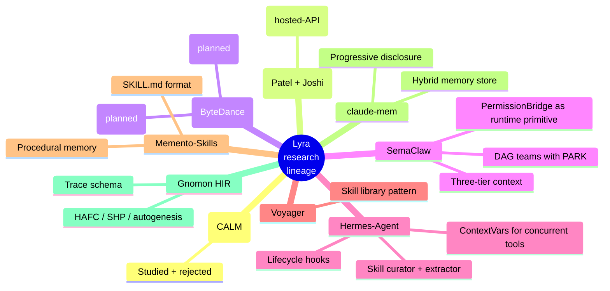

<!-- lyra-legacy-aware: page links the migration guide which references the open-coding / open-harness brand history by name. -->

# Research advanced

Lyra is downstream of a lot of papers and open-source projects. This
section is the **honest** version of that lineage: which ideas we
absorbed wholesale, which we pattern-mined and rewrote, which we
explicitly rejected, and the live design memos that are still in
flight.

## Live design memos

## Canonical absorption matrices

If you want the **complete list** of what Lyra reads — papers and
repos — and the **specific Lyra file each idea landed in**, start
here:

| Page | What's in it |
|---|---|
| [**Reference papers**](papers.md) | All **37 arxiv papers** Lyra cites (Waves 1–5 + Wave 0 industry signals) with absorption mode + Lyra implementation file per row. |
| [**Reference repositories**](repos.md) | All ~37 GitHub repos Lyra cites — Claude-Code ecosystem, paper reference impls, adjacent infra, skills/MCP, model weights + benchmark corpora — with absorption mode + Lyra implementation file per row. |

Both pages use the same four-symbol legend (🟢 adopted / 🟡 pattern-mined / ⚪ reference only / 🔴 studied & rejected) so a row in either tells you, at a glance, what we did with the source and where to look in the code. The earlier 🔵 "forward-compat shim" and 🟠 "planned" modes were retired in v3.5.5 — see the [CHANGELOG](https://github.com/lyra-contributors/lyra/blob/main/projects/lyra/CHANGELOG.md).

## Live design memos

| Page | What's in flight |
|---|---|
| [CALM evaluation](calm-evaluation.md) | Continuous Autoregressive Language Models — postmortem of why a *modelling-side* paper has nothing to import for a *harness*. The earlier `BlockStreamingProvider` and `BrierLM` shims were deleted in v3.5.5. |
| [PolyKV evaluation](polykv-evaluation.md) | Shared asymmetrically-compressed KV cache for `N` agents — the production hosted-API absorption (`PromptCacheCoordinator`) and the architectural insight Lyra ported. The self-hosted `SharedKVPoolProvider` shim was deleted in v3.5.5. |
| [Memento-Skills](memento-skills.md) | Memento's skill format vs. Lyra's `SKILL.md`; what the extractor picks up from the Memento extraction loop. |
| [Diversity collapse](diversity-collapse-analysis.md) | Why monoculture in subagent variants degrades the ensemble — and how Lyra resists it via family-disjoint judges. |
| [Synthesis (Phase J)](../research-synthesis-phase-j.md) | The full inter-paper synthesis from Phase J of the project; the "where do we stand?" memo. |
| [Novel ideas](../novel-ideas.md) | The ideas we coined ourselves (or repackaged enough that we owe ourselves credit). |

## Inspirations and ecosystem

| Page | What's there |
|---|---|
| [Community ecosystem](../community-ecosystem.md) | Verdict matrix for 13 Claude-Code ecosystem projects: what we vendored, what we pattern-mined, what we rejected (and why). |
| [Migration to Lyra](../migration-to-lyra.md) | If you're coming from `open-coding`, `open-harness`, Claude Code, or OpenClaw, this is the path. |
| [Roadmap](../roadmap.md) | Where we're going. |
| [Roadmap v1.5 → v2](../roadmap-v1.5-v2.md) | The detailed roadmap for the next two minors. |

## Papers we lean on

## Lyra's vendoring policy

Three tiers of integration, with strict license gates:

| Tier | What we do | License gate |
|---|---|---|
| **Pattern-mine** | Read, internalise, rewrite from scratch | Anything (only the idea matters) |
| **Vendor selectively** | Copy specific files with attribution into our tree | MIT / Apache-2.0 / BSD only |
| **Optional integration** | Document as opt-in dependency, do not vendor | Any compatible license |

Source-available and AGPL-licensed projects are **pattern-mine only**.
Full attribution lives in [`THIRD_PARTY_NOTICES.md`](https://github.com/lyra-contributors/lyra/blob/main/THIRD_PARTY_NOTICES.md).

## What we deliberately don't do

A few choices that look obvious but we declined:

- **No telemetry.** Lyra does not phone home, ever. No "anonymized
  usage stats", no update beacons.
- **No hosted SaaS.** The daemon is local-only; team coordination
  comes via a future Multica adapter.
- **No fine-tuning loop.** Lyra does not train models. It uses hosted
  models and exposes their outputs to its own evaluators.
- **No chain-of-thought prompting in the system prompt by default.**
  Modes use the patterns explicitly (`ReAct`, `Plan-First`,
  `Hypothesis-Test`, `Explain→Cite→Suggest`) — see [Four
  Modes](../start/four-modes.md) — but the system prompt does not
  beg the model to "think step by step" generically. Discipline lives
  in [hooks](../concepts/tools-and-hooks.md).

[CALM evaluation →](calm-evaluation.md){ .md-button .md-button--primary }
