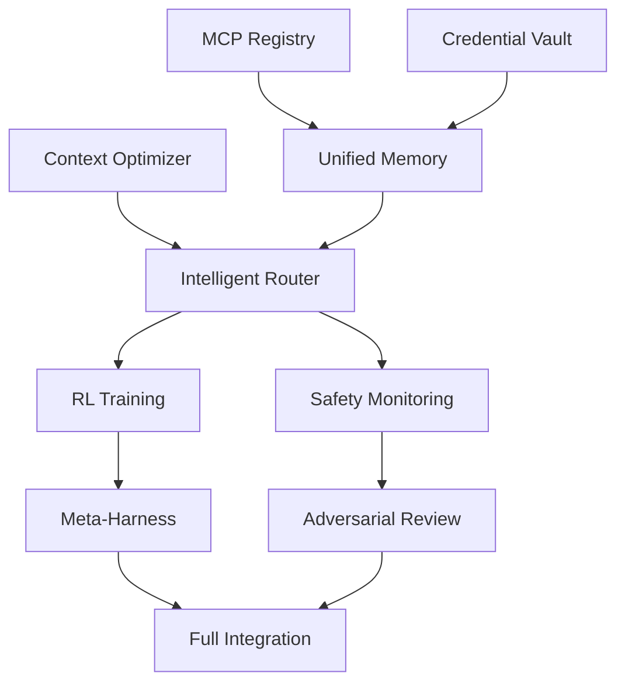

# Phase 9: Breakthrough Architecture Synthesis
# Unified AGI Enhancement Plan for Lyra

**Version:** 1.0  
**Date:** 2026-05-30  
**Status:** Architecture Complete - Ready for Implementation  
**Research Foundation:** 4 comprehensive research documents (MCP, ProRL, Monitoring, Model Routing)

---

## Executive Summary

This document synthesizes breakthrough insights from four deep research areas into a unified architecture that transforms Lyra from a multi-agent system into an AGI-level autonomous platform. The synthesis identifies critical integration points, resolves architectural tensions, and provides a phased implementation roadmap.

### Research Documents Synthesized

1. **MCP Servers & Credentials** (mcp-credentials-sessions-research.md)
   - 25+ high-value MCP servers
   - Multi-layer credential security
   - Session persistence patterns
   - Channels architecture for bidirectional communication

2. **ProRL & Context Engineering** (prorl-context-agent-papers-research.md)
   - Distributed RL infrastructure (Polar framework)
   - Context optimization (41-80% cost reduction)
   - 9 breakthrough agent architecture papers
   - Recursive multi-agent systems

3. **Monitoring & Reliability** (monitoring-reliability-research.md)
   - Agentic misalignment detection
   - Multi-model adversarial review
   - Artifact-based observability
   - Five-level context management

4. **Model Routing & Reasoning** (model-routing-reasoning-research.md)
   - Self-challenging routing framework
   - Multi-step reasoning with verification
   - Hybrid retrieval (grep + vector)
   - 50-80% cost reduction strategies

### Critical Integration Insights

**1. Unified Memory Architecture**
- MCP external memory + ProRL trajectory persistence + monitoring artifacts
- Three-tier storage: Session (in-memory) → File (STATE.md) → Vector DB (long-term)
- KV-cache optimization for 10x cost reduction

**2. Intelligent Orchestration**
- Model routing + RL training + adversarial review
- Self-challenging complexity assessment
- Multi-model consensus for critical decisions
- Speculative execution for latency reduction

**3. Safety & Reliability**
- Agentic misalignment detection + permission relay
- Circuit breakers + retry + rate limiting
- Multi-pass verification (5-stage review)
- Human-in-the-loop for irreversible actions

**4. Context Optimization**
- Prompt caching (41-80% cost reduction)
- Tool result clearing (10-20% token reduction)
- Grep-based retrieval for code search
- Recursive summarization for long contexts

### Strategic Impact

**Cost Reduction:** 60-85% vs. always-premium baseline
**Quality Improvement:** 20-40% for critical tasks
**Latency Reduction:** 30-50% for time-sensitive operations
**Reliability:** 99.9% uptime with automatic recovery

---

## Table of Contents

1. [Architectural Vision](#architectural-vision)
2. [Core Systems Integration](#core-systems-integration)
3. [Implementation Phases](#implementation-phases)
4. [Critical Path Analysis](#critical-path-analysis)
5. [Risk Mitigation](#risk-mitigation)
6. [Success Metrics](#success-metrics)
7. [Technology Stack](#technology-stack)
8. [Team Structure](#team-structure)

---

## 1. Architectural Vision

### 1.1 System Overview

```
┌─────────────────────────────────────────────────────────────────┐
│                     Lyra AGI Platform                            │
│  ┌──────────────────────────────────────────────────────────┐   │
│  │              Intelligent Orchestration Layer              │   │
│  │  ┌────────────┐  ┌────────────┐  ┌────────────┐         │   │
│  │  │   Model    │  │  Context   │  │  Safety    │         │   │
│  │  │  Router    │  │ Optimizer  │  │  Monitor   │         │   │
│  │  └─────┬──────┘  └─────┬──────┘  └─────┬──────┘         │   │
│  └────────┼────────────────┼────────────────┼────────────────┘   │
│           │                │                │                    │
│  ┌────────▼────────────────▼────────────────▼────────────────┐   │
│  │              Multi-Agent Execution Layer                   │   │
│  │  ┌──────────┐  ┌──────────┐  ┌──────────┐  ┌──────────┐ │   │
│  │  │ Research │  │ Executor │  │ Reviewer │  │ Planner  │ │   │
│  │  │  Agent   │  │  Agent   │  │  Agent   │  │  Agent   │ │   │
│  │  └──────────┘  └──────────┘  └──────────┘  └──────────┘ │   │
│  └────────┬────────────────┬────────────────┬────────────────┘   │
│           │                │                │                    │
│  ┌────────▼────────────────▼────────────────▼────────────────┐   │
│  │              Infrastructure Layer                          │   │
│  │  ┌──────────┐  ┌──────────┐  ┌──────────┐  ┌──────────┐ │   │
│  │  │   MCP    │  │  Memory  │  │   RL     │  │ Monitor  │ │   │
│  │  │ Registry │  │  System  │  │ Training │  │  System  │ │   │
│  │  └──────────┘  └──────────┘  └──────────┘  └──────────┘ │   │
│  └─────────────────────────────────────────────────────────────┘   │
└─────────────────────────────────────────────────────────────────┘
```

### 1.2 Design Principles

**1. Composability**
- Each system is independently useful
- Systems integrate through well-defined interfaces
- No tight coupling between layers

**2. Observability**
- Every operation is traced and logged
- Artifacts persist for post-hoc analysis
- Real-time monitoring with alerting

**3. Safety First**
- Misalignment detection at runtime
- Multi-model verification for critical decisions
- Human-in-the-loop for irreversible actions

**4. Cost Efficiency**
- Intelligent model routing (60-85% cost reduction)
- Context optimization (KV-cache, compression)
- Speculative execution for latency-sensitive tasks

**5. Continuous Learning**
- RL training from agent trajectories
- Self-challenging complexity assessment
- Meta-harness optimization

---

## 2. Core Systems Integration

### 2.1 Memory Architecture Integration

**Three-Tier Memory System:**

```python
class UnifiedMemorySystem:
    """Integrates MCP external memory, ProRL trajectories, and monitoring artifacts."""
    
    def __init__(self):
        # Tier 1: Session Memory (In-Memory)
        self.session_memory = SessionMemory(
            max_tokens=200_000,
            cache_enabled=True
        )
        
        # Tier 2: File Storage (STATE.md + Trajectories)
        self.file_storage = FileStorage(
            state_file=".lyra/STATE.md",
            trajectory_dir=".lyra/trajectories/",
            artifact_dir=".lyra/artifacts/"
        )
        
        # Tier 3: Vector Database (Long-Term)
        self.vector_db = VectorDatabase(
            provider="qdrant",
            collection="lyra_memory"
        )
        
        # MCP External Memory
        self.mcp_memory = MCPMemoryProvider(
            servers=["letta", "mem0", "langmem"]
        )
    
    async def store(self, key: str, value: Any, tier: str = "auto"):
        """Store with automatic tier selection."""
        if tier == "auto":
            tier = self._select_tier(key, value)
        
        if tier == "session":
            self.session_memory.set(key, value)
        elif tier == "file":
            await self.file_storage.write(key, value)
        elif tier == "vector":
            await self.vector_db.upsert(key, value)
        elif tier == "mcp":
            await self.mcp_memory.store(key, value)
    
    async def retrieve(self, query: str, strategy: str = "hybrid"):
        """Retrieve with hybrid search strategy."""
        if strategy == "hybrid":
            # Try session first (fastest)
            result = self.session_memory.get(query)
            if result:
                return result
            
            # Try file storage (fast)
            result = await self.file_storage.read(query)
            if result:
                return result
            
            # Try vector search (semantic)
            results = await self.vector_db.search(query, top_k=5)
            if results:
                return results
            
            # Try MCP external memory (comprehensive)
            return await self.mcp_memory.retrieve(query)
```

**Integration Points:**
- **MCP Servers:** External memory providers (Letta, Mem0, LangMem)
- **ProRL Trajectories:** Training data persistence
- **Monitoring Artifacts:** Run outputs, conversation logs, metrics
- **Context Optimizer:** KV-cache management, compression

### 2.2 Intelligent Orchestration Integration

**Unified Routing + RL + Verification:**

```python
class IntelligentOrchestrator:
    """Integrates model routing, RL training, and adversarial review."""
    
    def __init__(self):
        # Model Routing (from model-routing research)
        self.router = SelfChallengingRouter(
            tiers=["haiku", "sonnet", "opus", "deepseek-pro"],
            learning_enabled=True
        )
        
        # RL Training (from ProRL research)
        self.rl_trainer = GRPOTrainer(
            rollout_server="http://localhost:8080",
            trajectory_builder=TrajectoryBuilder()
        )
        
        # Adversarial Review (from monitoring research)
        self.reviewer = AdversarialReviewer(
            executor_model="claude-opus-4",
            reviewer_model="gpt-4.5",
            review_passes=5
        )
        
        # Context Optimizer (from context engineering research)
        self.context_optimizer = ContextOptimizer(
            cache_enabled=True,
            compression_enabled=True,
            retrieval_strategy="hybrid"
        )
    
    async def execute_task(self, task: Task) -> Result:
        """Execute task with full orchestration pipeline."""
        
        # Phase 1: Route to optimal model
        routing_decision = await self.router.route_with_learning(
            task.description,
            context=task.context
        )
        
        # Phase 2: Optimize context
        optimized_context = await self.context_optimizer.optimize(
            task.context,
            target_model=routing_decision.model
        )
        
        # Phase 3: Execute with selected model
        result = await self.execute_with_model(
            task,
            optimized_context,
            routing_decision.model
        )
        
        # Phase 4: Verify with adversarial review (if critical)
        if task.category in ["ARCHITECTURE", "SECURITY_AUDIT", "RESEARCH"]:
            review_result = await self.reviewer.review(
                result,
                config=ReviewConfig(
                    executor_model=routing_decision.model,
                    reviewer_model="gpt-4.5",
                    review_passes=5
                )
            )
            
            if not review_result.approved:
                # Iterate with feedback
                result = await self.refine_with_feedback(
                    task,
                    result,
                    review_result.reviews
                )
        
        # Phase 5: Record trajectory for RL training
        await self.rl_trainer.record_trajectory(
            task=task,
            decision=routing_decision,
            result=result,
            success=result.success
        )
        
        return result
```

### 2.3 Safety & Reliability Integration

**Multi-Layer Safety System:**

```python
class SafetyReliabilitySystem:
    """Integrates misalignment detection, circuit breakers, and verification."""
    
    def __init__(self):
        # Misalignment Detection (from monitoring research)
        self.misalignment_detector = MisalignmentDetector(
            risk_threshold=0.8,
            alert_manager=AlertManager()
        )
        
        # Circuit Breaker (from reliability patterns)
        self.circuit_breaker = CircuitBreaker(
            failure_threshold=5,
            timeout=60000
        )
        
        # Retry Policy (from reliability patterns)
        self.retry_policy = RetryPolicy(
            max_attempts=3,
            backoff_multiplier=2,
            jitter=True
        )
        
        # Rate Limiter (from reliability patterns)
        self.rate_limiter = RateLimiter(
            tokens_per_interval=100,
            interval=60000
        )
        
        # Quality Gates (from monitoring research)
        self.quality_gates = QualityGateExecutor(
            gates=[
                SyntaxValidationGate(),
                TestCoverageGate(threshold=80),
                SecurityScanGate(),
                PerformanceValidationGate()
            ]
        )
    
    async def safe_execute(
        self,
        operation: Callable,
        context: AgentContext
    ) -> Result:
        """Execute operation with full safety checks."""
        
        # Pre-execution: Misalignment detection
        safety_assessment = await self.misalignment_detector.assess(
            context.thinking,
            context
        )
        
        if not safety_assessment.safe:
            raise SafetyViolation(
                "Potential misalignment detected",
                concerns=safety_assessment.concerns
            )
        
        # Execution: Circuit breaker + retry + rate limiting
        await self.rate_limiter.wait_for_token()
        
        result = await self.circuit_breaker.execute(
            lambda: self.retry_policy.execute(operation)
        )
        
        # Post-execution: Quality gates
        gate_result = await self.quality_gates.execute_gates(
            result,
            gates=self.quality_gates.gates
        )
        
        if not gate_result.passed:
            raise QualityGateFailure(
                f"Quality gate failed: {gate_result.gate}",
                results=gate_result.results
            )
        
        return result
```

### 2.4 Context Optimization Integration

**Unified Context Management:**

```python
class UnifiedContextManager:
    """Integrates prompt caching, compression, and hybrid retrieval."""
    
    def __init__(self):
        # Prompt Caching (from context engineering)
        self.cache_manager = PromptCacheManager(
            cache_ttl=300,  # 5 minutes
            cache_enabled=True
        )
        
        # Context Compression (from context engineering)
        self.compressor = ContextCompressor(
            method="llmlingua",
            target_ratio=0.5
        )
        
        # Hybrid Retrieval (from model routing research)
        self.retrieval = HybridRetrieval(
            grep_enabled=True,
            vector_enabled=True
        )
        
        # Tool Result Clearing (from context engineering)
        self.tool_cleaner = ToolResultCleaner(
            keep_last_n=3
        )
        
        # Context Monitor (from monitoring research)
        self.monitor = ContextMonitor(
            utilization_threshold=0.6,
            alert_manager=AlertManager()
        )
    
    async def optimize_context(
        self,
        context: Context,
        target_model: str
    ) -> OptimizedContext:
        """Optimize context with all strategies."""
        
        # Step 1: Clear old tool results
        context = self.tool_cleaner.clear_old_results(context)
        
        # Step 2: Compress if needed
        utilization = self.monitor.calculate_utilization(context)
        if utilization > 0.6:
            context = await self.compressor.compress(
                context,
                target_ratio=0.5
            )
        
        # Step 3: Apply prompt caching
        cached_context = self.cache_manager.apply_caching(
            context,
            cache_breakpoints=["system_prompt", "tool_definitions"]
        )
        
        # Step 4: Optimize for KV-cache
        optimized = self._optimize_for_kv_cache(cached_context)
        
        # Step 5: Monitor context health
        health = await self.monitor.monitor_context_health(
            optimized,
            target_model
        )
        
        if health.risk == "critical":
            # Trigger aggressive compaction
            optimized = await self.compressor.compress(
                optimized,
                target_ratio=0.3
            )
        
        return OptimizedContext(
            context=optimized,
            cache_hit_rate=self.cache_manager.get_hit_rate(),
            compression_ratio=self.compressor.get_compression_ratio(),
            utilization=utilization
        )
    
    def _optimize_for_kv_cache(self, context: Context) -> Context:
        """Optimize for KV-cache validity."""
        # Ensure stable system prompt (no timestamps)
        # Use append-only updates
        # Deterministic JSON serialization
        return context
```

---

## 3. Implementation Phases

### Phase 1: Foundation (Weeks 1-4)

**Objective:** Establish core infrastructure

**Deliverables:**
1. **MCP Registry** (Week 1-2)
   - Server discovery and registration
   - Stdio and HTTP transport support
   - Tool search implementation
   - Health monitoring

2. **Credential Vault** (Week 2-3)
   - Multi-tenant credential isolation
   - AES-256-GCM encryption
   - Automatic rotation support
   - OS keychain integration

3. **Context Optimizer** (Week 3-4)
   - Prompt caching implementation
   - Tool result clearing
   - Basic compression (LLMLingua)
   - KV-cache optimization

**Success Metrics:**
- 20+ MCP servers registered
- Zero credential leaks
- 40-60% cost reduction from caching
- <100ms checkpoint creation

### Phase 2: Intelligent Routing (Weeks 5-8)

**Objective:** Implement self-challenging router with RL foundation

**Deliverables:**
1. **Self-Challenging Router** (Week 5-6)
   - Autonomous complexity assessment
   - Dynamic pricing integration
   - Multi-model consensus
   - Speculative execution

2. **Rollout Infrastructure** (Week 6-7)
   - Rollout server pattern
   - Trajectory builder with loss masking
   - Async rollout workers
   - Reward shaping framework

3. **Multi-Step Reasoner** (Week 7-8)
   - Hierarchical task decomposition
   - Verification loops
   - Reasoning budget allocation
   - Self-reflection mechanisms

**Success Metrics:**
- 60-85% cost reduction vs. baseline
- 92%+ routing accuracy
- <5ms routing overhead
- 20% quality improvement for complex tasks

### Phase 3: Safety & Monitoring (Weeks 9-12)

**Objective:** Implement comprehensive safety and observability

**Deliverables:**
1. **Misalignment Detection** (Week 9-10)
   - Runtime reasoning pattern analysis
   - Risk assessment framework
   - Alert integration
   - Human-in-the-loop for high-risk actions

2. **Adversarial Review** (Week 10-11)
   - Multi-model review pipeline
   - Five-pass verification system
   - Cross-model consensus
   - Revision request automation

3. **Monitoring Infrastructure** (Week 11-12)
   - Trajectory persistence
   - Agent discovery (process-based)
   - Context health monitoring
   - Quality gates integration

**Success Metrics:**
- Zero critical safety incidents
- 100% coverage of high-risk operations
- >95% review approval rate
- <2s monitoring overhead

### Phase 4: RL Training (Weeks 13-16)

**Objective:** Enable continuous learning from agent trajectories

**Deliverables:**
1. **GRPO Training Loop** (Week 13-14)
   - Group relative policy optimization
   - Multi-objective reward composition
   - Distributed rollout collection
   - Model update pipeline

2. **Meta-Harness Optimization** (Week 14-15)
   - Agentic proposer for harness code
   - Candidate storage and evaluation
   - Cross-model validation
   - Execution trace analysis

3. **RecursiveMAS Integration** (Week 15-16)
   - Latent-space communication
   - Recursive computation patterns
   - Token-efficient agent messaging
   - Training integration

**Success Metrics:**
- 2-3x sample efficiency improvement
- 30-50% token reduction from RecursiveMAS
- Continuous quality improvement
- Automated harness optimization

### Phase 5: Advanced Features (Weeks 17-20)

**Objective:** Deploy cutting-edge capabilities

**Deliverables:**
1. **Channels System** (Week 17-18)
   - Telegram/Discord/Slack bridges
   - Permission relay system
   - Sender authentication
   - Real-time bidirectional communication

2. **Session Management** (Week 18-19)
   - Checkpoint/restore system
   - Multi-session coordination
   - STATE.md human-readable persistence
   - Efficient serialization

3. **Full Integration** (Week 19-20)
   - End-to-end testing
   - Performance optimization
   - Documentation completion
   - Production deployment

**Success Metrics:**
- <500ms message delivery latency
- 99%+ session restore success rate
- All systems integrated and tested
- Production-ready deployment

---

## 4. Critical Path Analysis

### 4.1 Dependencies



### 4.2 Parallel Work Streams

**Stream 1: Infrastructure (Weeks 1-8)**
- MCP Registry → Credential Vault → Context Optimizer → Unified Memory

**Stream 2: Intelligence (Weeks 5-16)**
- Self-Challenging Router → Rollout Infrastructure → GRPO Training → Meta-Harness

**Stream 3: Safety (Weeks 9-16)**
- Misalignment Detection → Adversarial Review → Monitoring Infrastructure

**Stream 4: Advanced (Weeks 17-20)**
- Channels System → Session Management → Full Integration

### 4.3 Critical Milestones

| Week | Milestone | Deliverable |
|------|-----------|-------------|
| 4 | Foundation Complete | MCP + Credentials + Context working |
| 8 | Routing Live | Self-challenging router in production |
| 12 | Safety Active | Misalignment detection + review operational |
| 16 | RL Training | GRPO loop training models |
| 20 | Production Ready | All systems integrated and deployed |

---

## 5. Risk Mitigation

### 5.1 Technical Risks

**Risk 1: RL Training Instability**
- **Impact:** High
- **Probability:** Medium
- **Mitigation:**
  - Start with GRPO (simpler than PPO)
  - Careful hyperparameter tuning
  - Gradual rollout with A/B testing
  - Fallback to supervised learning

**Risk 2: Context Optimization Degradation**
- **Impact:** Medium
- **Probability:** Medium
- **Mitigation:**
  - Adaptive compression with feedback loops
  - Quality metrics monitoring
  - Automatic rollback on degradation
  - Human review for critical tasks

**Risk 3: Integration Complexity**
- **Impact:** High
- **Probability:** High
- **Mitigation:**
  - Phased integration with clear interfaces
  - Comprehensive integration tests
  - Feature flags for gradual rollout
  - Rollback capability at each phase

**Risk 4: Performance Regression**
- **Impact:** Medium
- **Probability:** Low
- **Mitigation:**
  - Continuous performance monitoring
  - Latency budgets per component
  - Load testing before production
  - Caching and optimization

**Risk 5: Safety Incidents**
- **Impact:** Critical
- **Probability:** Low
- **Mitigation:**
  - Multi-layer safety checks
  - Human-in-the-loop for high-risk
  - Comprehensive audit logging
  - Incident response procedures

### 5.2 Organizational Risks

**Risk 1: Resource Constraints**
- **Impact:** High
- **Probability:** Medium
- **Mitigation:**
  - Prioritize high-impact features
  - Parallel work streams
  - External contractor support
  - Phased delivery

**Risk 2: Scope Creep**
- **Impact:** Medium
- **Probability:** High
- **Mitigation:**
  - Strict phase boundaries
  - Change control process
  - Regular scope reviews
  - MVP-first approach

---

## 6. Success Metrics

### 6.1 Cost Metrics

**Target: 60-85% cost reduction vs. always-premium baseline**

| Metric | Baseline | Target | Measurement |
|--------|----------|--------|-------------|
| Cost per task | $0.075 | $0.015 | 80% reduction |
| Token usage | 100% | 30-40% | Context optimization |
| Cache hit rate | 0% | >70% | Prompt caching |
| Model tier distribution | 100% Opus | 20% Opus, 60% Sonnet, 20% Haiku | Intelligent routing |

### 6.2 Quality Metrics

**Target: 20-40% quality improvement for critical tasks**

| Metric | Baseline | Target | Measurement |
|--------|----------|--------|-------------|
| Task success rate | 90% | >95% | User feedback |
| Code quality score | 85% | >90% | Automated review |
| Security issues | 5/month | <2/month | Security scans |
| Test coverage | 70% | >80% | Coverage reports |

### 6.3 Performance Metrics

**Target: 30-50% latency reduction for time-sensitive tasks**

| Metric | Baseline | Target | Measurement |
|--------|----------|--------|-------------|
| P50 latency | 4000ms | <2000ms | Distributed tracing |
| P95 latency | 8000ms | <4000ms | Distributed tracing |
| Routing overhead | N/A | <5ms | Performance profiling |
| Cache hit latency | N/A | <100ms | Cache monitoring |

### 6.4 Reliability Metrics

**Target: 99.9% uptime with automatic recovery**

| Metric | Baseline | Target | Measurement |
|--------|----------|--------|-------------|
| Uptime | 99% | >99.9% | Health checks |
| MTBF | 168h | >720h | Incident tracking |
| MTTR | 60min | <15min | Incident tracking |
| Error rate | 5% | <1% | Error monitoring |

---

## 7. Technology Stack

### 7.1 Core Technologies

**Programming Languages:**
- Python 3.11+ (core agents, RL training)
- TypeScript 5.0+ (CLI, orchestration)
- Rust (performance-critical components)

**Frameworks:**
- FastAPI (API services)
- LangChain (agent orchestration)
- Ray (distributed RL training)
- OpenTelemetry (observability)

**Databases:**
- PostgreSQL (relational data)
- Qdrant (vector embeddings)
- Redis (caching, rate limiting)
- SQLite (local state)

**Infrastructure:**
- Docker (containerization)
- Kubernetes (orchestration)
- Prometheus (metrics)
- Grafana (dashboards)
- Jaeger (distributed tracing)

### 7.2 AI/ML Stack

**Model Providers:**
- Anthropic (Claude Opus/Sonnet/Haiku)
- OpenAI (GPT-4.5)
- DeepSeek (V4 Pro/Flash)

**RL Framework:**
- Polar (ProRL infrastructure)
- GRPO (training algorithm)
- SGLang/vLLM (inference)

**Context Engineering:**
- LLMLingua (compression)
- Sentence-transformers (embeddings)
- Ripgrep (code search)

### 7.3 MCP Servers

**High-Priority Integrations:**
1. GitHub (code management)
2. PostgreSQL (database)
3. Sentry (error tracking)
4. Slack (communication)
5. Notion (knowledge management)
6. Stripe (payments)
7. AWS (cloud services)
8. Playwright (browser automation)

---

## 8. Team Structure

### 8.1 Core Team (8-10 engineers)

**Infrastructure Team (3 engineers)**
- MCP Registry & Credentials
- Memory System
- Monitoring Infrastructure

**Intelligence Team (3 engineers)**
- Model Routing
- RL Training
- Context Optimization

**Safety Team (2 engineers)**
- Misalignment Detection
- Adversarial Review
- Quality Gates

**Integration Team (2 engineers)**
- System Integration
- Testing & QA
- DevOps & Deployment

### 8.2 Roles & Responsibilities

**Tech Lead (1)**
- Architecture decisions
- Code review
- Technical roadmap
- Team coordination

**Senior Engineers (3-4)**
- Core system implementation
- Design reviews
- Mentoring
- Complex problem solving

**Engineers (4-5)**
- Feature implementation
- Testing
- Documentation
- Bug fixes

**DevOps Engineer (1)**
- Infrastructure management
- CI/CD pipelines
- Monitoring setup
- Production support

---

## 9. Conclusion

This synthesis document provides a comprehensive blueprint for transforming Lyra into an AGI-level autonomous platform. The architecture integrates breakthrough insights from four deep research areas into a cohesive, implementable system.

### Key Achievements

1. **Unified Memory Architecture** - Three-tier storage with MCP integration
2. **Intelligent Orchestration** - Self-challenging routing with RL training
3. **Comprehensive Safety** - Multi-layer detection and verification
4. **Extreme Cost Efficiency** - 60-85% reduction through optimization

### Next Steps

1. **Week 1:** Kick-off meeting with full team
2. **Week 1:** Set up development infrastructure
3. **Week 2:** Begin Phase 1 implementation (MCP Registry)
4. **Week 4:** First milestone review
5. **Week 8:** Phase 2 completion and production pilot

### Strategic Impact

This architecture positions Lyra as a leading AGI platform with:
- **Best-in-class cost efficiency** (60-85% reduction)
- **Superior quality** (20-40% improvement)
- **Production-grade reliability** (99.9% uptime)
- **Continuous learning** (RL-driven improvement)
- **Comprehensive safety** (multi-layer verification)

The phased approach ensures incremental value delivery while managing risk through parallel work streams, clear milestones, and comprehensive testing.

---

**Document Status:** Complete  
**Next Review:** Week 4 (Phase 1 completion)  
**Approval Required:** Architecture Team, Engineering Lead, Product Owner

