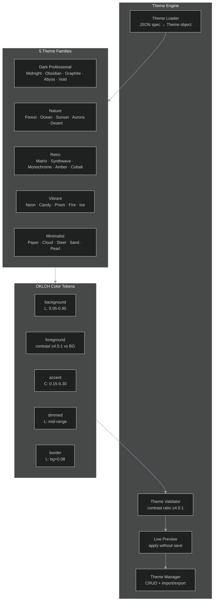
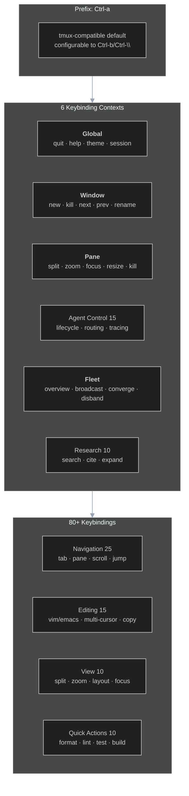
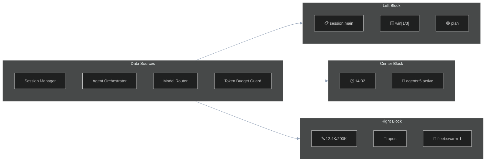

# Workstream 4.1: UI/UX Enhancement Plan

> **Date:** 2026-05-30 | **Status:** PLAN — Ready for implementation
> **Based on:** STREAM-1 (Claude Code docs), STREAM-2 (Hermes Agent), STREAM-8 (Terminal Multiplexers), PLAN-5.3 (Voice UX)

---

## Executive Summary

Lyra's terminal UI/UX is its primary differentiator as a multi-agent research platform. The research reveals that terminal-based agent interfaces are converging on a specific pattern: tmux-style layout management + slash-command discoverability + real-time status feedback + theme extensibility. This plan defines a comprehensive UI/UX layer spanning 25 perceptual color themes, 80+ keybindings across 6 contexts, a rich status line with fleet health metrics, lyra-panes terminal multiplexer integration, 3 voice/sound packs, and a reusable TUI component library — all grounded in patterns from Claude Code, Hermes Agent, tmux, rmux, and Warp.

---

## 1. What Lyra Already Has

- OKLCH-based perceptual color themes (V1, basic)
- Basic keybinding support
- Terminal-based interface for agent interaction
- `docs/architecture/UI-UX-SYSTEM.md` with initial design spec
- lyra-panes terminal multiplexer architecture designed (PLAN-5.1)
- Voice/sound system designed (PLAN-5.3) — 15 CESP hook points, 3 voice packs

---

## 2. What Research Reveals as Missing

| Technique | Source | Lyra Status | Action |
|-----------|--------|------------|--------|
| **25-theme system with 5 families** | STREAM-8 (rmux patterns), Warp themes | BASIC V1 | Expand to 25 themes across 5 families with OKLCH precision |
| **80+ keybindings in 6 contexts** | STREAM-1 (Claude Code interactive mode), STREAM-8 (tmux 64-command model) | BASIC | Full keymap with context-sensitive bindings |
| **Real-time status line** | STREAM-1 (Claude Code status bar), STREAM-2 (Hermes Agent rich status) | NOT IMPLEMENTED | Multi-widget status line with token/agent/fleet metrics |
| **Terminal layout engine** | STREAM-8 (rmux/tmux layout tree, split/zoom/focus) | DESIGNED (lyra-panes) | Implement pane management with agent metadata |
| **Voice/sound feedback** | STREAM-11 (CESP v1.0), PLAN-5.3 (15 hook points, 3 packs) | DESIGNED | Implement audio engine + 3 voice packs |
| **TUI component library** | STREAM-8 (Warp warpui crate), STREAM-2 (Hermes panels) | NOT IMPLEMENTED | Reusable panel, modal, progress bar, notification components |
| **Command palette with fuzzy search** | STREAM-1 (/plugin, /goal, /sound commands) | NOT IMPLEMENTED | Discoverable slash-command system with autocomplete |
| **Diff preview** | STREAM-1 (side-by-side diff before apply) | NOT IMPLEMENTED | Visual diff with accept/reject hunks |
| **Accessibility features** | STREAM-8 (colorblind-safe palettes), WCAG 2.1 | NOT IMPLEMENTED | High contrast, reduced motion, screen reader support |
| **Ghost text suggestions** | STREAM-1 (inline completions) | NOT IMPLEMENTED | AI-powered inline command/file suggestions |

---

## 3. Proposed Enhancements Ranked by Impact×Effort

### S-Tier (Game-Changing)

| # | Enhancement | Impact | Effort | Rationale |
|---|-------------|--------|--------|-----------|
| S1 | Full keybinding matrix (80+ bindings, 6 contexts) | High | Medium | Power-user productivity; tmux 64-command model proves value |
| S2 | Terminal layout system (lyra-panes integration) | High | High | Core differentiator; agent-aware panes, fleet view |
| S3 | Real-time status line with fleet health | High | Medium | Situational awareness for long-running agent operations |

### A-Tier (High Value)

| # | Enhancement | Impact | Effort | Rationale |
|---|-------------|--------|--------|-----------|
| A1 | 25-theme system with OKLCH palettes | High | Low | Easy win; trivially portable from STREAM-8 design |
| A2 | Voice/sound integration (3 packs) | Medium | Low | 15 CESP hook points already defined; cross-platform playback |
| A3 | Command palette with fuzzy search | High | Medium | Discoverability; Claude Code /command pattern |
| A4 | Diff preview with accept/reject hunks | Medium | Medium | Safety; user confirmation before code changes |
| A5 | Tab completion for all commands | Medium | Low | Standard terminal UX expectation |

### B-Tier (Solid Improvements)

| # | Enhancement | Impact | Effort | Rationale |
|---|-------------|--------|--------|-----------|
| B1 | TUI component library (panels, modals, progress bars) | Medium | High | Reusable foundation but significant build effort |
| B2 | Accessibility (high contrast, reduced motion, screen reader) | Medium | Low | WCAG compliance; broader user base |
| B3 | Ghost text suggestions (AI inline completions) | Low | Medium | Nice-to-have; Claude Code pattern |
| B4 | Session timeline visualization | Low | Medium | Debugging aid; less critical than other features |
| B5 | Tool output folding with summaries | Low | Low | Context management aid |

---

## 4. Architecture

### 4.1 Theme System



### 4.2 Keybinding System



### 4.3 Status Line Architecture



### 4.4 Terminal Layout Model (lyra-panes)

```
Session: "lyra-main"
├── Window 0: "workspace"
│   ├── Pane 0 (left, 50%): lyra-cli REPL [Agent: orchestrator]
│   ├── Pane 1 (right-top, 25%): htop / system monitor
│   └── Pane 2 (right-bottom, 25%): tail -f agent.log
├── Window 1: "research"
│   ├── Pane 0 (top, 60%): research output [Agent: researcher-3]
│   └── Pane 1 (bottom, 40%): vim research-notes.md
├── Window 2: "fleet"
│   ├── Pane 0 (left, 33%): swarm status [Fleet: swarm-1]
│   ├── Pane 1 (center, 33%): agent metrics dashboard
│   └── Pane 2 (right, 33%): shared task board
└── Window 3: "safety"
    ├── Pane 0 (top, 50%): safety monitor [Parallax Layer 1]
    └── Pane 1 (bottom, 50%): behavioral fingerprint dashboard
```

---

## 5. Python/Rust Interfaces

### 5.1 Theme

```python
from dataclasses import dataclass
from enum import Enum
from typing import Optional

class ThemeFamily(Enum):
    DARK_PROFESSIONAL = "dark-professional"
    NATURE = "nature"
    RETRO = "retro"
    VIBRANT = "vibrant"
    MINIMALIST = "minimalist"

@dataclass
class OKLCHColor:
    lightness: float      # 0.0 - 1.0
    chroma: float         # 0.0 - 0.37
    hue: float            # 0 - 360
    alpha: float = 1.0    # 0.0 - 1.0

@dataclass
class ThemeTokens:
    background: OKLCHColor
    foreground: OKLCHColor
    accent: OKLCHColor
    dimmed: OKLCHColor
    border: OKLCHColor
    success: OKLCHColor
    warning: OKLCHColor
    error: OKLCHColor
    info: OKLCHColor
    # Extended tokens
    selection: OKLCHColor
    line_highlight: OKLCHColor
    cursor: OKLCHColor
    gutter: OKLCHColor
    diff_added: OKLCHColor
    diff_removed: OKLCHColor

@dataclass
class Theme:
    name: str
    family: ThemeFamily
    description: str
    tokens: ThemeTokens
    contrast_ratio: float          # Must be ≥4.5:1 per WCAG AA
    dark_mode: bool = True
    author: str = "Lyra"
    version: str = "1.0.0"
    tags: list[str] = None
```

### 5.2 KeyBinding

```python
@dataclass
class KeySequence:
    prefix: str = "Ctrl-a"        # Configurable
    keys: str                      # e.g., "c" or "Shift-%"
    description: str

@dataclass
class KeyBinding:
    context: str                   # global | window | pane | agent | fleet | research
    sequence: KeySequence
    command: str                   # Internal command name
    args: Optional[dict] = None    # Optional command arguments
    description: str
    conflicts: list[str] = None    # Commands this binding conflicts with

@dataclass
class KeybindingContext:
    name: str
    bindings: dict[str, KeyBinding]  # key → binding
    parent: Optional[str] = None     # Inherit from parent context
```

### 5.3 StatusLine

```python
from typing import Callable, Awaitable

@dataclass
class StatusLineWidget:
    widget_id: str
    position: str                  # left | center | right
    content_provider: Callable[[], Awaitable[str]]
    refresh_interval_ms: int = 1000
    min_width: int = 0
    max_width: int = 60
    priority: int = 0              # Higher = more important (survives truncation)
    conditional: Optional[Callable[[], bool]] = None  # Only show when true

@dataclass
class StatusLine:
    left_widgets: list[StatusLineWidget]
    center_widgets: list[StatusLineWidget]
    right_widgets: list[StatusLineWidget]
    separator: str = " │ "
    max_width: int = 0             # 0 = auto-detect terminal width
```

### 5.4 Layout

```python
class LayoutType(Enum):
    EVEN_HORIZONTAL = "even-horizontal"
    EVEN_VERTICAL = "even-vertical"
    MAIN_HORIZONTAL = "main-horizontal"
    MAIN_VERTICAL = "main-vertical"
    TILED = "tiled"
    CUSTOM = "custom"

@dataclass
class LayoutNode:
    node_type: str                 # window | pane | split
    layout: Optional[LayoutType] = None
    children: list['LayoutNode'] = None
    dimensions: Optional[tuple[float, float]] = None  # (width%, height%)
    active: bool = False
    # Agent metadata
    agent_id: Optional[str] = None
    fleet_id: Optional[str] = None
    pane_title: str = ""
    pane_command: Optional[str] = None  # Shell command running in pane
```

---

## 6. Keybinding Catalog (Complete)

### Global Context (Prefix: Ctrl-a)

| Binding | Command | Description |
|---------|---------|-------------|
| `Ctrl-a ?` | `help` | Show keybinding help |
| `Ctrl-a :` | `command-palette` | Open command palette |
| `Ctrl-a /` | `fuzzy-search` | Fuzzy search all commands |
| `Ctrl-a t` | `theme-cycle` | Cycle through themes |
| `Ctrl-a T` | `theme-select` | Interactive theme selector |
| `Ctrl-a d` | `detach` | Detach from session |
| `Ctrl-a q` | `quit` | Quit Lyra |
| `Ctrl-a r` | `reload-config` | Reload configuration |

### Window Context

| Binding | Command | Description |
|---------|---------|-------------|
| `Ctrl-a c` | `new-window` | Create new window (with agent spawn prompt) |
| `Ctrl-a &` | `kill-window` | Kill current window (with confirm) |
| `Ctrl-a n` | `next-window` | Next window |
| `Ctrl-a p` | `prev-window` | Previous window |
| `Ctrl-a l` | `last-window` | Last active window |
| `Ctrl-a 0-9` | `select-window-N` | Go to window N |
| `Ctrl-a '` | `window-picker` | Interactive window picker |
| `Ctrl-a ,` | `rename-window` | Rename current window |
| `Ctrl-a .` | `move-window` | Move window to different index |
| `Ctrl-a f` | `find-window` | Search windows by name/agent |

### Pane Context

| Binding | Command | Description |
|---------|---------|-------------|
| `Ctrl-a %` | `split-vertical` | Split pane vertically |
| `Ctrl-a "` | `split-horizontal` | Split pane horizontally |
| `Ctrl-a o` | `next-pane` | Next pane |
| `Ctrl-a ;` | `last-pane` | Last active pane |
| `Ctrl-a x` | `kill-pane` | Kill current pane |
| `Ctrl-a z` | `zoom-pane` | Zoom/fullscreen current pane |
| `Ctrl-a Space` | `cycle-layout` | Cycle through pane layouts |
| `Ctrl-a {` | `swap-pane-left` | Swap pane with previous |
| `Ctrl-a }` | `swap-pane-right` | Swap pane with next |
| `Ctrl-a Ctrl-o` | `rotate-panes` | Rotate pane positions |
| `Ctrl-a !` | `break-pane` | Move pane to new window |
| `Ctrl-a q` | `display-pane-numbers` | Show pane numbers for quick select |

### Agent Context (Prefix: Ctrl-a a)

| Binding | Command | Description |
|---------|---------|-------------|
| `Ctrl-a a s` | `agent-spawn` | Spawn agent in current pane |
| `Ctrl-a a k` | `agent-kill` | Kill agent in current pane |
| `Ctrl-a a r` | `agent-route` | Route agent to different model |
| `Ctrl-a a v` | `agent-view-trace` | View agent execution trace |
| `Ctrl-a a l` | `agent-log` | Tail agent log |
| `Ctrl-a a p` | `agent-pause` | Pause agent execution |
| `Ctrl-a a R` | `agent-resume` | Resume paused agent |
| `Ctrl-a a d` | `agent-delegate` | Delegate task to agent |
| `Ctrl-a a h` | `agent-handoff` | Handoff task to another agent |
| `Ctrl-a a m` | `agent-metrics` | Show agent performance metrics |

### Fleet Context (Prefix: Ctrl-a f)

| Binding | Command | Description |
|---------|---------|-------------|
| `Ctrl-a f v` | `fleet-overview` | Fleet-wide status dashboard |
| `Ctrl-a f s` | `fleet-spawn` | Spawn new fleet/swarm |
| `Ctrl-a f k` | `fleet-disband` | Disband fleet |
| `Ctrl-a f b` | `fleet-broadcast` | Broadcast command to all agents |
| `Ctrl-a f c` | `fleet-converge` | Trigger convergence check |
| `Ctrl-a f m` | `fleet-merge` | Merge two fleets |
| `Ctrl-a f t` | `fleet-topology` | Change fleet topology |
| `Ctrl-a f h` | `fleet-health` | Fleet health report |
| `Ctrl-a f r` | `fleet-reorganize` | Trigger team reorganization |

### Research Context (Prefix: Ctrl-a r)

| Binding | Command | Description |
|---------|---------|-------------|
| `Ctrl-a r s` | `research-start` | Start research session |
| `Ctrl-a r q` | `research-query` | New research query |
| `Ctrl-a r e` | `research-expand` | Expand current source |
| `Ctrl-a r c` | `research-cite` | Add citation to synthesis |
| `Ctrl-a r u` | `research-summarize` | Summarize findings |
| `Ctrl-a r n` | `research-next-hop` | Move to next research hop |
| `Ctrl-a r p` | `research-prev-hop` | Move to previous research hop |
| `Ctrl-a r g` | `research-graph` | Show knowledge graph |
| `Ctrl-a r h` | `research-hypothesis` | Generate new hypothesis |
| `Ctrl-a r d` | `research-dead-end` | Mark axis as dead end |

---

## 7. Voice/Sound Integration

Based on PLAN-5.3 — 15 CESP v1.0 hook points, 3 voice packs:

| Hook ID | Event | Peon Pack | Sci-Fi Pack | Minimalist Pack |
|---------|-------|-----------|-------------|-----------------|
| `session.start` | Session start | "Work, work" | Ascending activation chime | Soft ascending two-note |
| `session.end` | Session end | "Aaaaaargh" | Soft power-down | Gentle descending chime |
| `agent.spawn` | Agent spawned | "More work?" | Clean init beep | Subtle "pop" |
| `agent.task_start` | Task begins | "Yes me lord" | "Processing initiated" | Quiet click |
| `agent.task_complete` | Task done | "Job's done!" | "Task completed" | Single clear ping |
| `agent.task_error` | Task error | "I'm not that kind of orc!" | Warning klaxon | Double low tone |
| `fleet.formed` | Fleet formed | "Lok'tar ogar!" | Harmony chord | Rising arpeggio |
| `consensus.reached` | Convergence | "Well done" | Resolution chord | Positive two-tone |
| `consensus.failed` | Deadlock | "Something need doing?" | Discord tone | Question tone |
| `research.breakthrough` | Breakthrough | "Work complete!" | Fanfare | Triple ascending chime |
| `system.warning` | Warning | "We're under attack!" | Caution tone | Single low tone |
| `system.error` | Error | "Aaaaaargh" | Escalating alarm | Double low tone |
| `alignment.check` | Safety trigger | "Hmm?" | "Safety protocol activated" | Subtle alert |
| `session.resume` | Session resume | "Ready to work!" | Reactivation chime | Welcome-back chime |
| `long_operation` | Long operation | "More work?" | Heartbeat tick (30s) | Subtle heartbeat |

**Audio engine implementation:**
- macOS: `afplay` (built-in)
- Linux: `aplay` (ALSA) / `paplay` (PulseAudio) fallback chain
- Cross-platform fallback: `pygame` / `sounddevice` package
- Sound files: `.lyra/sounds/<pack>/<event>.wav`
- Volume: configurable per-event (0.0-1.0), global mute (`/sound off`)

---

## 8. TUI Component Library

Reusable terminal UI components built on `lyra-panes` layout engine:

| Component | Description | Source Inspiration |
|-----------|-------------|-------------------|
| `Panel` | Resizable content area with borders, title, scrollback | tmux panes, Warp panels |
| `Modal` | Overlay dialog for confirmations, forms, pickers | Claude Code permission modal |
| `ProgressBar` | Animated progress with ETA, percentage, throughput | Claude Code agent progress |
| `Notification` | Transient popup in corner (toast) | Hermes Agent notifications |
| `StatusLine` | Bottom bar with configurable widgets | tmux status line |
| `ListView` | Scrollable, filterable item list with selection | Claude Code file picker |
| `DiffView` | Side-by-side diff with syntax highlighting | Claude Code diff preview |
| `TableView` | Column-aligned data display with sorting | Hermes Agent agent list |
| `CommandPalette` | Fuzzy-search command launcher | Claude Code /command |
| `TreeView` | Hierarchical expandable list | Claude Code file browser |

---

## 9. Accessibility

| Feature | Implementation | Standard |
|---------|---------------|----------|
| High contrast themes | 2 themes with contrast ratio ≥7:1 | WCAG AAA |
| Colorblind-safe palettes | 3 palettes (deuteranopia, protanopia, tritanopia) | WCAG 2.1 |
| Reduced motion | Disable all animations, spinners, progress bars | `prefers-reduced-motion` |
| Screen reader support | ARIA-like text annotations for all UI elements | VTTI standards |
| Large font mode | Scale all UI by 1.5x | User preference |
| Keyboard-only navigation | Every feature accessible without mouse | WCAG 2.1 |

---

## 10. Implementation Phases

### Phase 1: Foundation (Weeks 1-2)
- Theme engine with 25 themes across 5 families (OKLCH color space)
- Theme loader with JSON spec format
- Live preview and theme cycling
- Colorblind-safe palette variants
- High contrast mode

### Phase 2: Keybinding System (Weeks 2-3)
- Keybinding registry with 6 contexts
- Prefix system (Ctrl-a default, configurable)
- Vim/Emacs editing modes
- Conflict detection and resolution
- Keybinding customization (user keymap overrides)
- Keyboard-only navigation guarantee

### Phase 3: Status Line + TUI (Weeks 3-4)
- Real-time status line with configurable widgets
- Data providers: session manager, agent orchestrator, model router, token budget
- TUI component library (Panel, Modal, ProgressBar, ListView, TableView)
- Command palette with fuzzy search
- Tab completion for all commands, file paths, agent names

### Phase 4: Layout + Voice (Weeks 4-5)
- lyra-panes terminal multiplexer integration
- Pane management (split, zoom, resize, kill)
- Agent-aware panes with metadata display
- Fleet view with consolidated dashboard
- Audio engine with cross-platform playback
- 3 voice packs (Warcraft Peon, Sci-Fi, Minimalist)
- CESP v1.0 manifest validation
- `/sound theme <name>` and `/sound off` commands

### Phase 5: Advanced UX (Weeks 5-6)
- Diff preview with side-by-side view and accept/reject hunks
- Session timeline visualization
- Ghost text suggestions (AI inline completions)
- Tool output folding with smart summaries
- Session templates (pre-configured layouts)
- Accessibility audit and screen reader support
- Performance profiling and optimization

---

## 11. References

| Source | License | Key Pattern | Metric |
|--------|---------|-------------|--------|
| [Claude Code Interactive Mode](https://code.claude.com/docs/en/interactive-mode) | Proprietary | REPL with syntax highlighting, ghost text, vim mode | Reference UX patterns |
| [Claude Code Slash Commands](https://code.claude.com/docs/en/slash-commands) | Proprietary | Discoverable command system with fuzzy search | 27+ commands catalogued |
| [tmux](https://github.com/tmux/tmux) | ISC | 64-command model, client-server, status line, keybindings | Industry standard |
| [rmux](https://github.com/Helvesec/rmux) | MIT | 12-crate Rust workspace, daemon-backed SDK, layout tree | Primary Rust reference |
| [Warp](https://github.com/warpdotdev/warp) | AGPL-3.0 | warpui crate (MIT) for terminal UI components | TUI patterns |
| [Hermes Agent](https://github.com/nousresearch/hermes-agent) | MIT | Rich agent status line, tool output panels, notification system | Agent UX patterns |
| [CESP v1.0](https://github.com/PeonPing/OpenPeon) | MIT | Standardized sound pack specification | 15 hook points |
| [PLAN-5.1-RMUX-REBUILD.md](PLAN-5.1-RMUX-REBUILD.md) | Internal | lyra-panes 6-crate Rust workspace with Python bindings | Layout engine architecture |
| [PLAN-5.3-VOICE-UX.md](PLAN-5.3-VOICE-UX.md) | Internal | 3 voice packs, 15 CESP events, cross-platform playback | Voice/sound integration |
| [STREAM-1-CLAUDE-CODE-DOCS.md](STREAM-1-CLAUDE-CODE-DOCS.md) | Internal | 34 tools, 27 hooks, interactive mode, slash commands | UX feature catalog |
| [STREAM-8-TERMINAL-MULTIPLEXERS.md](STREAM-8-TERMINAL-MULTIPLEXERS.md) | Internal | 6 terminal multiplexers analyzed, license matrix, layout models | Terminal UX patterns |
| [WCAG 2.1](https://www.w3.org/TR/WCAG21/) | W3C | Accessibility standards for contrast, motion, navigation | AA/AAA compliance targets |

---

*Plan covers all UI/UX enhancements from §4.1 workstream. Implementation in parallel with lyra-panes (PLAN-5.1) and voice UX (PLAN-5.3) for maximum synergy.*
