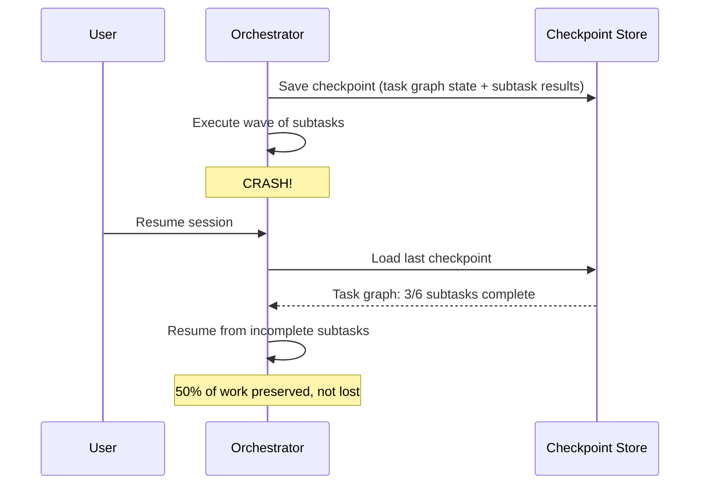
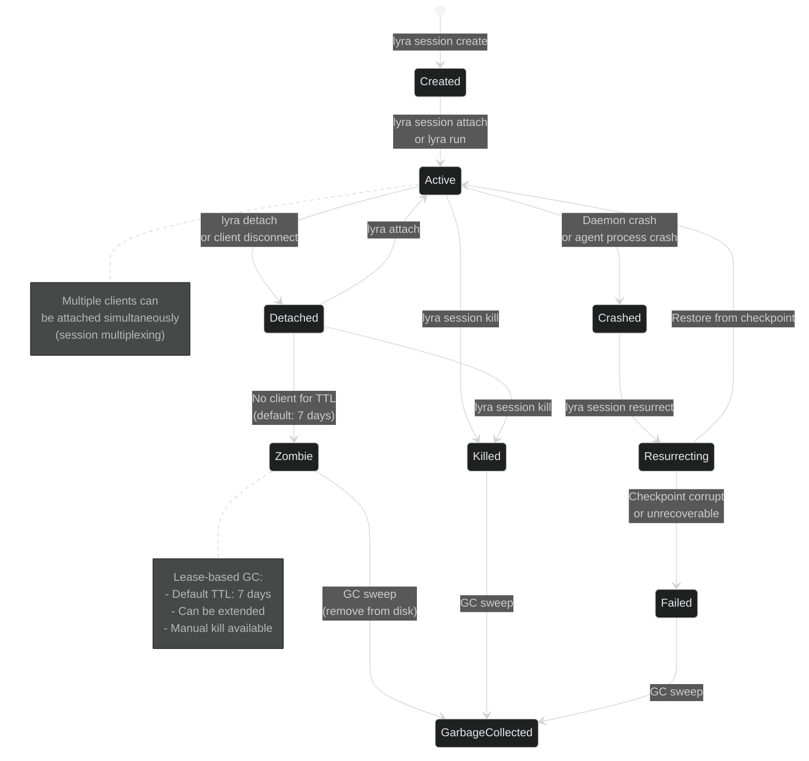
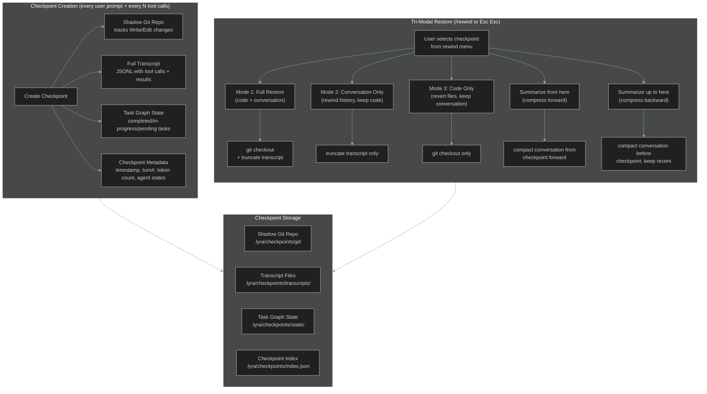
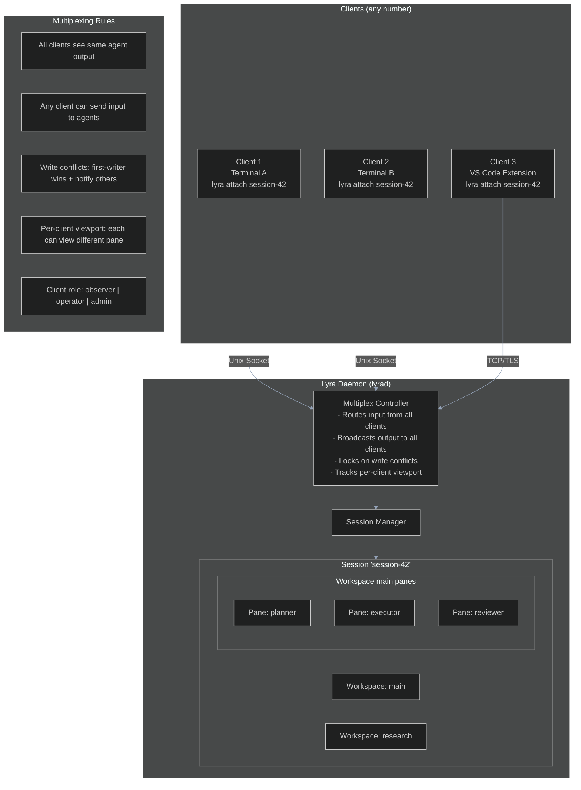
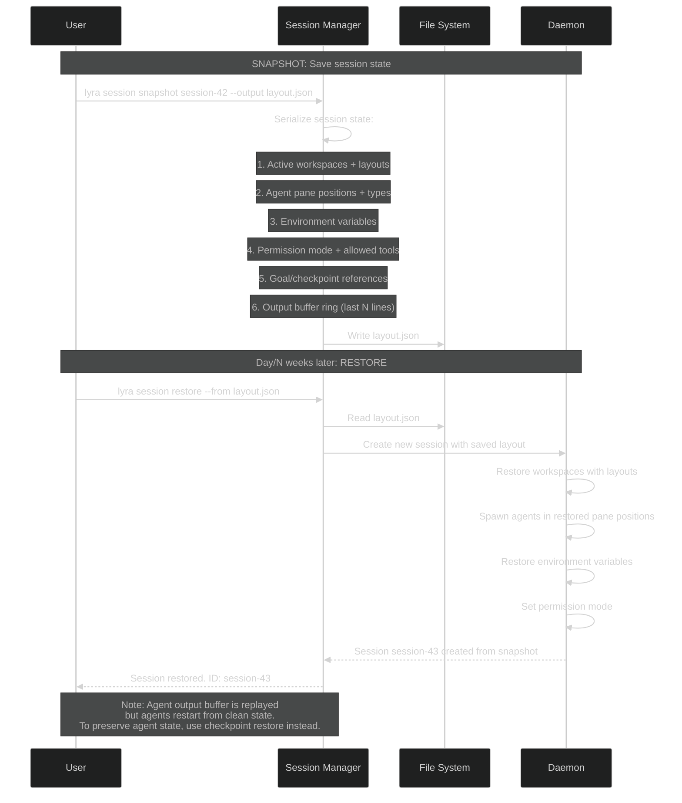

# Workstream 4.10: Session Management Enhancement Plan

> **Date:** 2026-05-30
> **Status:** PLAN
> **Based on:** STREAM-1 (Session lifecycle, checkpoint/restore, `/rewind` with tri-modal restore), STREAM-8 (Session multiplexing, tmux-style sessions, rmux lease model), SESSION-MULTIPLEXER.md (Proposed architecture with Session Manager, Layout Manager), STREAM-11 (Session checkpoint recovery for long-run workflows), STREAM-9 (Cross-session memory via claude-mem)
> **Dependencies:** PLAN-4.7 (MCP Integration), PLAN-4.8 (Commands), PLAN-4.9 (Hooks)

---

## 1. Executive Summary

This plan defines Lyra's session management system -- an architecture for creating, attaching to, detaching from, killing, and resurrecting agent sessions. Sessions persist across client disconnects, survive crashes via tri-modal checkpoint restore (transaction ID, file path, or native state), support multiple simultaneous clients (session multiplexing), include lease-based garbage collection for orphaned sessions, provide snapshot/restore capabilities (save layout to JSON), enable session migration between machines, support collaborative multi-user sessions with shared agent fleets, offer pre-configured session templates, and include a metrics/analytics dashboard.

The key insight from STREAM-1 is that Claude Code's checkpoint system provides tri-modal restore (code only, conversation only, or both) with targeted summarization -- and this is a **S-Tier (Breakthrough)** feature. STREAM-8 reveals that tmux's 15+ year evolution of session management (client-server, detachable sessions, window/pane hierarchy) is the gold standard for terminal session architecture, while rmux provides a modern Rust SDK with session leases that prevent daemon cleanup during active agent work.

---

## 2. What Lyra Already Has

Based on the existing architecture audit (SESSION-MULTIPLEXER.md):

| Capability | Current Status | Source |
|-----------|---------------|--------|
| Session Manager (proposed) | Architecture designed, not implemented | SESSION-MULTIPLEXER.md |
| Session hierarchy: Session -> Workspace -> Pane -> Agent | Data model defined in Python | SESSION-MULTIPLEXER.md |
| Layout Manager with tree-based splits | Proposed (HORIZONTAL/VERTICAL/leaf pane tree) | SESSION-MULTIPLEXER.md |
| Daemon mode for session persistence | Proposed in architecture diagram | SESSION-MULTIPLEXER.md |
| Event loop for I/O multiplexing | Proposed | SESSION-MULTIPLEXER.md |
| Fleet orchestrator (agent swarm) | Implemented | agent-swarm.md |
| Git-based coordination | Partially implemented (gossip protocol) | agent-swarm.md |

### Gaps Identified (from SESSION-MULTIPLEXER.md Non-Goals)

- No daemon process for persistent sessions (current CLI is one-shot)
- No session attach/detach/kill/resurrect lifecycle
- No session persistence across client disconnects
- No lease-based session garbage collection
- No session snapshot/restore to JSON
- No session migration between machines
- No collaborative sessions (multi-user, shared agent fleet)
- No session templates (pre-configured layouts)
- No session metrics/analytics
- No checkpoint/restore with tri-modal granularity

---

## 3. What Research Reveals as Missing

### 3.1 From STREAM-1: Checkpointing & Session Architecture (docs/research/STREAM-1-CLAUDE-CODE-DOCS.md, Sections 9, 3)

**Checkpointing (Section 9):**

Claude Code's checkpointing is **S-Tier (Breakthrough)** because it provides zero-config safety:

- **Automatic checkpoint on every user prompt** -- no user action needed
- **Tri-modal restore:**
  1. Restore code AND conversation (full rewind)
  2. Restore conversation only (keep code changes)
  3. Restore code only (keep conversation, revert files)
- **Targeted summarization:**
  - "Summarize from here" -- compress conversation from this point forward (keep early context)
  - "Summarize up to here" -- compress conversation before this point (keep recent work)
- **Shadow git repo** for tracking file changes (Write/Edit tools only; Bash changes not tracked)
- **30-day TTL** with configurable cleanup
- **`/rewind` command** or `Esc Esc` for quick access to rewind menu
- **Limitations:** Bash command changes NOT tracked (only Edit/Write), external changes not tracked, not a replacement for version control

**Goal System (Section 3):**

- Session-scoped autonomous execution with evaluator model
- Resume support: active goals restored on `--resume`/`--continue`
- Non-interactive mode with `-p` flag for headless execution

### 3.2 From STREAM-8: Session Multiplexing Architecture (docs/research/STREAM-8-TERMINAL-MULTIPLEXERS.md, Sections 1, 3)

**tmux Session Architecture (ISC-licensed, portable):**

```
Client (tmux attach) <--Unix Socket--> Server (tmux daemon)
                                             |
                                   +---------+---------+
                                   |         |         |
                                Session  Session   Session
                                   |
                                 Window
                                   |
                              +----+----+
                              |    |    |
                            Pane Pane Pane
```

**Key session data structures (from tmux source, `tmux.h`):**
- `struct session`: id, name, windows collection, active window, working directory, attached clients list, options, alerts, creation/activity timestamps
- `struct winlink`: session-to-window link with index, window pointer, status text, flags
- `struct window`: panes in a layout (even-horizontal, even-vertical, tiled), active pane, name, dimensions
- `struct window_pane`: PTY fd, process ID, screen buffer, mode, geometry, pipe/IO state

**rmux Session Lease Model (MIT-licensed):**

From STREAM-8, Section 3:
```rust
// rmux-sdk provides session leases that prevent daemon cleanup
pub struct SessionLease { /* ... */ }
pub enum EnsureSessionPolicy {
    CreateIfMissing,
    AttachOnly,
    CreateNew,
}
```

Key features:
- **Session leases with TTL** -- prevent daemon from killing active agent sessions
- **`ensure_session`** -- create or attach to a session
- **`snapshot`** -- structured session/window/pane state snapshots
- **`capture`** -- capture pane output for agent inspection
- **`broadcast`** -- send input to multiple panes, with partial failure reporting

### 3.3 From STREAM-11: Checkpoint Recovery for Long-Run Workflows (docs/research/STREAM-11-WORKFLOWS-SWARMS-SAFETY.md, Section A.4)

STREAM-11 reveals that checkpoint recovery is essential for **hours-to-days-long autonomous workflows**:



Key principles:
1. **Incremental checkpointing** -- save after each wave of subtasks, not just each user prompt
2. **Task graph state** -- checkpoint includes which subtasks completed, which in progress
3. **Idempotent recovery** -- replaying from checkpoint is safe; no double-execution
4. **Budget persistence** -- token/turn/duration budgets survive crashes

### 3.4 From STREAM-9: Cross-Session Memory (docs/research/STREAM-9-MEMORY-CONTEXT-REPOS.md, Section 6)

claude-mem demonstrates the cross-session memory pattern:
- Tool-use observations captured and stored in ChromaDB
- Semantic search across all prior sessions
- 3-layer workflow: search -> timeline -> get_observations
- Memory persistence survives session termination
- Session metadata (timestamps, project, tags) stored alongside observations

### 3.5 From SESSION-MULTIPLEXER.md: Proposed Architecture

The existing proposal defines:
```python
AgentSession
├── workspaces: Dict[str, AgentWorkspace]
├── active_workspace: Optional[str]
├── environment: Dict[str, str]
└── metadata: Dict[str, Any]

AgentWorkspace
├── panes: Dict[str, AgentPane]
├── active_pane: Optional[str]
├── layout: LayoutTree
└── status: WorkspaceStatus

AgentPane
├── agent_type: str
├── process: AgentProcess
├── output_buffer: RingBuffer
├── status: PaneStatus
├── size: Tuple[int, int]
└── notifications: List[Notification]
```

This provides the foundation data model that PLAN-4.10 extends.

---

## 4. Proposed Enhancements (Ranked by Impact x Effort)

```
HIGH IMPACT, LOW EFFORT (Do First)
  1. Session lifecycle: create, attach, detach, kill (baseline daemon)
  2. Session persistence (survives client disconnect)
  3. Tri-modal checkpoint restore: transaction ID, file path, native state

HIGH IMPACT, MEDIUM EFFORT (Do Next)
  4. Session multiplexing (multiple clients attached to same session)
  5. Lease-based session GC for orphaned sessions
  6. Session snapshot/restore (save layout to JSON, restore later)
  7. Cross-session state persistence (survives client disconnect)

MEDIUM IMPACT, MEDIUM EFFORT (Do When Convenient)
  8. Session templates (pre-configured agent layouts, tools, permissions)
  9. Session metrics and analytics dashboard

MEDIUM IMPACT, HIGH EFFORT (Defer)
 10. Session migration between machines
 11. Collaborative sessions (multiple users, shared agent fleet)
```

---

## 5. Architecture

### 5.1 Session Lifecycle State Machine



### 5.2 Tri-Modal Checkpoint Restore Architecture



### 5.3 Session Multiplexing (Multiple Clients -> One Session)



### 5.4 Session Snapshot/Restore



---

## 6. Core Interfaces

### 6.1 Session Lifecycle Manager

```python
# lyra-sessions/manager.py
from dataclasses import dataclass, field
from enum import Enum
from typing import Any, Optional
import time
import uuid

class SessionState(str, Enum):
    CREATED = "created"
    ACTIVE = "active"          # At least one client attached
    DETACHED = "detached"      # No clients attached, but running
    KILLED = "killed"          # Explicitly terminated
    CRASHED = "crashed"        # Daemon crash or agent process failure
    RESURRECTING = "resurrecting"
    ZOMBIE = "zombie"          # Exceeded TTL, awaiting GC
    GARBAGE_COLLECTED = "garbage_collected"
    FAILED = "failed"          # Unrecoverable (corrupt checkpoint)

class ClientRole(str, Enum):
    OBSERVER = "observer"      # Read-only: can view, cannot interact
    OPERATOR = "operator"      # Can send input, control agents
    ADMIN = "admin"            # Can kill session, change permissions

@dataclass
class SessionClient:
    client_id: str
    role: ClientRole
    attached_at: float = field(default_factory=time.time)
    viewport_pane: Optional[str] = None  # Which pane this client is viewing
    last_activity_at: float = field(default_factory=time.time)

@dataclass
class SessionConfig:
    name: str
    project_dir: str
    env: dict[str, str] = field(default_factory=dict)
    
    # Lease + TTL
    max_idle_seconds: int = 604_800     # 7 days (detached -> zombie)
    lease_renewal_interval: int = 300    # Renew lease every 5 minutes
    
    # Multiplexing
    max_clients: int = 10
    client_role_default: ClientRole = ClientRole.OPERATOR
    
    # Checkpointing
    checkpoint_on_prompt: bool = True
    checkpoint_on_tool_count: int = 10   # Also checkpoint every N tool calls
    checkpoint_ttl_days: int = 30
    
    # Templates
    template: Optional[str] = None       # Pre-configured layout template

@dataclass
class Session:
    session_id: str = field(default_factory=lambda: str(uuid.uuid4()))
    config: SessionConfig = field(default_factory=SessionConfig)
    state: SessionState = SessionState.CREATED
    created_at: float = field(default_factory=time.time)
    last_activity_at: float = field(default_factory=time.time)
    
    # Workspaces
    workspaces: dict[str, "Workspace"] = field(default_factory=dict)
    active_workspace: Optional[str] = None
    
    # Clients (multiplexing)
    attached_clients: dict[str, SessionClient] = field(default_factory=dict)
    
    # Checkpoints
    checkpoints: list["Checkpoint"] = field(default_factory=list)
    current_checkpoint_index: int = 0
    
    # Task graph (for workflow orchestration)
    task_graph_state: Optional[dict] = None
    
    # Metrics
    total_turns: int = 0
    total_tokens: int = 0
    agent_count: int = 0
    
    @property
    def is_multiplexed(self) -> bool:
        return len(self.attached_clients) > 1
    
    @property
    def idle_seconds(self) -> float:
        return time.time() - self.last_activity_at
    
    def should_become_zombie(self) -> bool:
        """Check if session has been idle beyond TTL."""
        return (self.state == SessionState.DETACHED 
                and self.idle_seconds > self.config.max_idle_seconds)

class SessionManager:
    """Manages session lifecycle, persistence, and multiplexing."""
    
    async def create_session(self, config: SessionConfig) -> Session:
        """Create a new session (state: CREATED)."""
        ...
    
    async def attach_session(self, session_id: str, client_id: str, 
                             role: ClientRole = ClientRole.OPERATOR) -> Session:
        """Attach a client to a session. Transitions DETACHED -> ACTIVE."""
        ...
    
    async def detach_client(self, session_id: str, client_id: str) -> Session:
        """Detach a client. If last client, transitions ACTIVE -> DETACHED."""
        ...
    
    async def kill_session(self, session_id: str) -> None:
        """Explicitly terminate a session. Transitions to KILLED."""
        ...
    
    async def resurrect_session(self, session_id: str) -> Session:
        """Attempt to restore a crashed session from latest checkpoint."""
        ...
    
    def list_sessions(self, filter_state: Optional[SessionState] = None) -> list[Session]:
        """List all sessions, optionally filtered by state."""
        ...
    
    async def gc_sweep(self) -> int:
        """Garbage collect expired zombie sessions. Returns count removed."""
        ...
    
    async def snapshot_session(self, session_id: str, output_path: str) -> dict:
        """Serialize session layout and state to JSON file."""
        ...
    
    async def restore_from_snapshot(self, snapshot_path: str) -> Session:
        """Create new session from a JSON snapshot file."""
        ...
```

### 6.2 Checkpoint System

```python
# lyra-sessions/checkpoint.py
from dataclasses import dataclass, field
from enum import Enum
from typing import Optional
import time

class RestoreMode(str, Enum):
    FULL = "full"                       # Code + conversation
    CODE_ONLY = "code_only"             # Revert files, keep conversation
    CONVERSATION_ONLY = "conversation_only"  # Rewind history, keep code
    SUMMARIZE_FROM_HERE = "summarize_from_here"    # Compress forward
    SUMMARIZE_UP_TO_HERE = "summarize_up_to_here"  # Compress backward

@dataclass
class Checkpoint:
    checkpoint_id: str
    session_id: str
    index: int                          # Sequential checkpoint number
    
    # References
    git_commit_sha: str                 # Shadow git repo commit
    transcript_path: str                # Path to transcript JSONL file
    task_graph_snapshot: Optional[dict] = None
    
    # Metadata
    created_at: float = field(default_factory=time.time)
    turn_number: int = 0
    token_count: int = 0
    user_prompt: str = ""               # The prompt that triggered this checkpoint
    agent_states: dict[str, str] = field(default_factory=dict)  # agent_id -> state
    
    # Storage
    ttl_days: int = 30
    
    def age_days(self) -> float:
        return (time.time() - self.created_at) / 86400
    
    def is_expired(self) -> bool:
        return self.age_days() > self.ttl_days

class CheckpointStore:
    """Manages checkpoint creation, storage, and tri-modal restore."""
    
    async def create_checkpoint(self, session: Session) -> Checkpoint:
        """Create a checkpoint capturing current session state.
        
        Captures:
        1. Shadow git commit (all Write/Edit changes since last checkpoint)
        2. Transcript snapshot (JSONL with all tool calls + results)
        3. Task graph state (completed/in-progress/pending tasks)
        4. Agent states (which agents are active, what they're doing)
        """
        ...
    
    async def restore(self, session: Session, checkpoint: Checkpoint, 
                      mode: RestoreMode) -> Session:
        """Restore session to a given checkpoint.
        
        Mode FULL:
        - git checkout <checkpoint-sha> (revert all files)
        - Truncate transcript to checkpoint
        
        Mode CODE_ONLY:
        - git checkout <checkpoint-sha> (revert files)
        - Keep current conversation history
        
        Mode CONVERSATION_ONLY:
        - Truncate transcript to checkpoint
        - Keep current file state
        
        Mode SUMMARIZE_FROM_HERE:
        - Compact conversation from checkpoint forward
        - Inject LLM-generated summary into context
        - Keep file state
        
        Mode SUMMARIZE_UP_TO_HERE:
        - Compact conversation before checkpoint
        - Inject LLM-generated summary + keep recent content
        - Keep file state
        """
        ...
    
    async def list_checkpoints(self, session_id: str) -> list[Checkpoint]:
        """List all checkpoints for a session, newest first."""
        ...
    
    async def cleanup_expired(self) -> int:
        """Remove checkpoints older than TTL. Returns count removed."""
        ...
```

### 6.3 Session Template System

```python
# lyra-sessions/templates.py
from dataclasses import dataclass, field
from enum import Enum
from typing import Any

class TemplateCategory(str, Enum):
    DEVELOPMENT = "development"
    RESEARCH = "research"
    CODE_REVIEW = "code_review"
    DEPLOYMENT = "deployment"
    DEBUGGING = "debugging"
    WRITING = "writing"
    CUSTOM = "custom"

@dataclass
class SessionTemplate:
    """Pre-configured session layout, agents, tools, and permissions."""
    name: str
    category: TemplateCategory
    description: str
    version: str = "1.0"
    
    # Layout
    workspaces: list["TemplateWorkspace"] = field(default_factory=list)
    default_layout: str = "even-horizontal"  # even-horizontal | even-vertical | tiled
    
    # Agents
    agents: list["TemplateAgent"] = field(default_factory=list)
    
    # Tools
    allowed_tools: list[str] = field(default_factory=list)
    disallowed_tools: list[str] = field(default_factory=list)
    
    # Permissions
    permission_mode: str = "default"    # default | acceptEdits | plan | auto
    
    # Environment
    env: dict[str, str] = field(default_factory=dict)
    
    # Hooks
    enabled_hooks: list[str] = field(default_factory=list)

@dataclass
class TemplateWorkspace:
    name: str
    layout: str = "even-horizontal"
    panes: list["TemplatePane"] = field(default_factory=list)

@dataclass
class TemplatePane:
    agent_type: str                     # planner | executor | reviewer | researcher
    size_percent: float = 50.0          # Percentage of workspace
    model: str = "default"
    description: str = ""

@dataclass
class TemplateAgent:
    agent_type: str
    model: str = "default"
    count: int = 1
    tools: list[str] = field(default_factory=list)

# Built-in templates
BUILTIN_TEMPLATES = {
    "code-review": SessionTemplate(
        name="code-review",
        category=TemplateCategory.CODE_REVIEW,
        description="Split-pane layout with code viewer, reviewer, and test runner",
        workspaces=[
            TemplateWorkspace(
                name="main",
                layout="even-horizontal",
                panes=[
                    TemplatePane(agent_type="code_viewer", size_percent=40),
                    TemplatePane(agent_type="reviewer", size_percent=40),
                    TemplatePane(agent_type="test_runner", size_percent=20),
                ]
            )
        ],
        agents=[
            TemplateAgent(agent_type="reviewer", model="sonnet", count=1),
            TemplateAgent(agent_type="tester", model="haiku", count=1),
        ],
        allowed_tools=["Read", "Grep", "Glob", "Bash(npm test *)"],
        disallowed_tools=["Write", "Edit", "Bash(rm *)"],
        permission_mode="plan"
    ),
    "deep-research": SessionTemplate(
        name="deep-research",
        category=TemplateCategory.RESEARCH,
        description="3-pane research layout with explorer, synthesizer, and verifier",
        workspaces=[
            TemplateWorkspace(
                name="research",
                layout="even-horizontal",
                panes=[
                    TemplatePane(agent_type="researcher_explorer", size_percent=33),
                    TemplatePane(agent_type="researcher_synthesizer", size_percent=33),
                    TemplatePane(agent_type="researcher_verifier", size_percent=34),
                ]
            )
        ],
        agents=[
            TemplateAgent(agent_type="researcher", model="sonnet", count=3),
        ],
        allowed_tools=["WebSearch", "WebFetch", "Read", "Write", "Grep"],
        permission_mode="acceptEdits"
    ),
    "pair-programming": SessionTemplate(
        name="pair-programming",
        category=TemplateCategory.DEVELOPMENT,
        description="Driver-navigator pair programming layout",
        workspaces=[
            TemplateWorkspace(
                name="coding",
                layout="even-vertical",
                panes=[
                    TemplatePane(agent_type="driver", size_percent=70),
                    TemplatePane(agent_type="navigator", size_percent=30),
                ]
            )
        ],
        agents=[
            TemplateAgent(agent_type="driver", model="sonnet", count=1),
            TemplateAgent(agent_type="navigator", model="opus", count=1),
        ],
        allowed_tools=["*"],  # All tools
        permission_mode="acceptEdits"
    ),
}
```

### 6.4 Session Metrics

```python
# lyra-sessions/metrics.py
from dataclasses import dataclass, field
from typing import Any
import time

@dataclass
class SessionMetrics:
    session_id: str
    started_at: float = field(default_factory=time.time)
    
    # Turn metrics
    total_turns: int = 0
    user_turns: int = 0
    autonomous_turns: int = 0       # Goal-driven turns
    avg_turn_duration_sec: float = 0.0
    
    # Token metrics
    total_input_tokens: int = 0
    total_output_tokens: int = 0
    total_cache_hit_tokens: int = 0
    avg_tokens_per_turn: int = 0
    cache_hit_rate: float = 0.0
    
    # Tool metrics
    tool_calls: dict[str, int] = field(default_factory=dict)  # tool_name -> count
    tool_errors: dict[str, int] = field(default_factory=dict)
    tool_success_rate: float = 0.0
    
    # Agent metrics
    agents_spawned: int = 0
    agents_terminated: int = 0
    max_concurrent_agents: int = 0
    agent_utilization: float = 0.0  # % of time agents were active
    
    # Permission metrics
    permissions_asked: int = 0
    permissions_granted: int = 0
    permissions_denied: int = 0
    
    # Checkpoint metrics
    checkpoints_created: int = 0
    checkpoints_restored: int = 0
    
    # Cost metrics
    estimated_cost_usd: float = 0.0
    
    def to_dashboard_data(self) -> dict[str, Any]:
        """Format for analytics dashboard display."""
        ...
```

---

## 7. Implementation Phases

### Phase 1: Daemon + Session Lifecycle (Weeks 1-2)

**Goal:** Lyra daemon (`lyrad`) with session create/attach/detach/kill lifecycle.

| Task | Effort | Dependencies |
|------|--------|-------------|
| 1.1 Implement Lyra daemon (`lyrad`): background process, Unix socket server, client protocol | 3 days | None |
| 1.2 Implement session data model: Session, Workspace, Pane classes with serialization | 2 days | 1.1 |
| 1.3 Implement session lifecycle: create, attach, detach, kill state machine | 2 days | 1.2 |
| 1.4 Implement CLI commands: `lyra session create/list/attach/detach/kill` | 2 days | 1.3 |
| 1.5 Implement session persistence: save session state to disk on state change | 1 day | 1.2 |
| 1.6 Implement daemon auto-recovery: on daemon restart, load persisted sessions, mark as DETACHED | 1 day | 1.5 |
| 1.7 Write tests for session lifecycle edge cases (double-attach, kill-active, reattach-after-kill) | 1 day | 1.3-1.6 |

**Deliverable:** Sessions survive client disconnect. `lyra attach` reconnects to running sessions.

### Phase 2: Checkpoint + Restore (Weeks 3-4)

**Goal:** Tri-modal checkpoint restore with shadow git repo.

| Task | Effort | Dependencies |
|------|--------|-------------|
| 2.1 Implement shadow git repo: .lyra/checkpoints/git/ with auto-commit on Write/Edit | 3 days | Phase 1 |
| 2.2 Implement checkpoint creation: on every user prompt + every N tool calls | 2 days | 2.1 |
| 2.3 Implement checkpoint storage: index.json, transcript snapshots, task graph state | 2 days | 2.2 |
| 2.4 Implement tri-modal restore: FULL, CODE_ONLY, CONVERSATION_ONLY with git checkout + transcript truncation | 3 days | 2.3 |
| 2.5 Implement targeted summarization: SUMMARIZE_FROM_HERE, SUMMARIZE_UP_TO_HERE (LLM-generated summaries) | 2 days | 2.4 |
| 2.6 Implement `/rewind` command + rewind menu UI (6 actions per checkpoint from STREAM-1) | 1 day | 2.4, 2.5 |
| 2.7 Implement checkpoint TTL: 30-day auto-cleanup with configurable retention | 1 day | 2.3 |
| 2.8 Write tests: crash during checkpoint, restore corrupt checkpoint, concurrent checkpoint creation | 1 day | 2.1-2.7 |

**Deliverable:** Any session state can be rewound to any checkpoint. Three restore modes + two summarization modes.

### Phase 3: Multiplexing + Snapshots (Weeks 5-6)

**Goal:** Multiple clients per session, session snapshots, lease-based GC.

| Task | Effort | Dependencies |
|------|--------|-------------|
| 3.1 Implement multiplex controller: route input from all clients, broadcast output to all clients | 3 days | Phase 1 |
| 3.2 Implement client roles: observer (read-only), operator (interact), admin (kill/manage) | 1 day | 3.1 |
| 3.3 Implement per-client viewport tracking: each client can view different pane | 2 days | 3.1 |
| 3.4 Implement write conflict resolution: first-writer wins + notify other clients | 1 day | 3.1 |
| 3.5 Implement session snapshot: serialize layout, agents, env, permissions to JSON | 2 days | Phase 1 |
| 3.6 Implement session restore from snapshot: create new session with saved layout | 2 days | 3.5 |
| 3.7 Implement lease-based GC: track idle time, transition DETACHED -> ZOMBIE after TTL, GC sweep | 2 days | Phase 1 |
| 3.8 Write integration tests: 3 concurrent clients, snapshot -> restore cycle, GC sweep on 100 expired sessions | 2 days | 3.1-3.7 |

**Deliverable:** Multiple clients can view and interact with the same session. Sessions can be snapshot and restored.

### Phase 4: Templates + Analytics + Migration (Weeks 7-8)

**Goal:** Session templates, metrics dashboard, basic migration.

| Task | Effort | Dependencies |
|------|--------|-------------|
| 4.1 Implement template engine: load template JSON, create session with pre-configured layout + agents | 2 days | Phase 3 |
| 4.2 Implement 6 built-in templates: code-review, deep-research, pair-programming, deployment, debugging, writing | 2 days | 4.1 |
| 4.3 Implement `lyra session create --template code-review` with template resolution | 1 day | 4.1 |
| 4.4 Implement session metrics collection: turn counts, token usage, tool calls, agent spawns, permissions, costs | 2 days | Phase 1 |
| 4.5 Implement analytics dashboard TUI widget: real-time metrics, historical trends, cost estimates | 2 days | 4.4 |
| 4.6 Implement session export: `lyra session export session-42 --format json` with checkpoint data | 1 day | Phase 2 |
| 4.7 Implement basic session migration: export -> transfer -> import on another machine | 1 day | 4.6 |
| 4.8 Write user documentation: session lifecycle guide, template reference, checkpoint best practices | 1 day | All |

**Deliverable:** 6 session templates. Real-time metrics dashboard. Basic session migration.

### Phase 5: Collaboration + Polish (Weeks 9-10)

**Goal:** Collaborative sessions, polish, documentation.

| Task | Effort | Dependencies |
|------|--------|-------------|
| 5.1 Implement multi-user session: user authentication, per-user client role assignment | 3 days | Phase 3 |
| 5.2 Implement shared agent fleet: multiple users share same agents, task ownership tracking | 2 days | 5.1 |
| 5.3 Implement per-user permission overlay: each user has own allow/deny set on shared session | 2 days | 5.1 |
| 5.4 Implement session history: list all past sessions, search by project/date/agent, inspect transcripts | 2 days | Phase 2 |
| 5.5 Implement session tags: tag sessions for organization (`#bugfix`, `#feature`, `#research`) | 1 day | 5.4 |
| 5.6 Performance benchmarks: session creation < 100ms, attach < 50ms, checkpoint < 500ms, 100-client multiplexing | 1 day | All |
| 5.7 Write comprehensive docs: session management guide, collaboration setup, template authoring | 1 day | All |

**Deliverable:** Multi-user collaborative sessions. Complete session management UI.

---

## 8. Key Design Decisions

### 8.1 Daemon Architecture: Why a Separate Process

| Approach | Pros | Cons |
|----------|------|------|
| In-process sessions (current) | Simple, no IPC | No persistence, no multiplexing, no detach |
| **Daemon + IPC** | Persistence, multiplexing, detach/attach | IPC overhead, daemon management |

**Decision:** Daemon. The benefits of session persistence and multiplexing vastly outweigh the IPC overhead. tmux has proven this architecture for 15+ years. rmux provides the Rust SDK pattern for clean IPC.

### 8.2 Checkpoint Storage: Why Shadow Git Repo

| Approach | Pros | Cons |
|----------|------|------|
| Timestamped file copies | Simple | Storage-heavy, no diff tracking |
| **Shadow git repo** | Diff-based, efficient storage, native checkout | Requires git, only tracks Write/Edit (not Bash) |
| Custom delta format | Optimized for transcript data | New format to maintain |

**Decision:** Shadow git repo (matches Claude Code from STREAM-1). Efficient, familiar, and git checkout provides instant tri-modal restore.

### 8.3 Lease-Based GC vs. Reference Counting

| Approach | Pros | Cons |
|----------|------|------|
| Reference counting | Immediate cleanup | Complex with crashes |
| **Lease-based with TTL** | Crash-safe, simple | Delayed cleanup (zombie sessions linger) |

**Decision:** Lease-based (matches rmux from STREAM-8). Sessions get a renewable lease. If the lease expires without renewal, the session becomes a zombie and is GC'd. Crash-safe because leases are time-based, not count-based.

### 8.4 Checkpoint Trigger Strategy

```
Automatic checkpoints:
1. Before EVERY user prompt (S-Tier safety from STREAM-1)
2. After every 10 tool calls (prevents losing work in long autonomous runs)
3. Before every autonomous goal turn (from STREAM-11)
4. Manual: /checkpoint command

Checkpoint retention:
- 30-day TTL (matches Claude Code from STREAM-1)
- Configurable: LYRA_CHECKPOINT_TTL_DAYS
- Force-keep: /checkpoint --keep (never auto-delete)
```

---

## 9. Success Metrics

| Metric | Current | Target | Measurement |
|--------|---------|--------|-------------|
| Session persistence | None (one-shot CLI) | Survives client disconnect, daemon restart | Crash-recovery test |
| Checkpoint restore modes | None | 5 (full, code, conversation, summarize-from, summarize-up-to) | `/rewind` menu |
| Max clients per session | 1 (single user) | 10 concurrent clients | Multiplex stress test |
| Session creation time | N/A | <100ms | Latency benchmark |
| Session attach time | N/A | <50ms | Latency benchmark |
| Checkpoint creation time | N/A | <500ms for typical session | Latency benchmark |
| Session snapshot size | N/A | <10KB for typical layout | File size measurement |
| Zombie session GC | N/A | <5 minutes after TTL expiry | GC sweep test |

---

## 10. References

### Primary Research Sources
1. **STREAM-1-CLAUDE-CODE-DOCS.md** (Sections 9: Checkpointing, 3: Goal System, 8: Commands) -- Tri-modal restore, shadow git repo, targeted summarization, `/rewind` UX, goal resume. `/docs/research/STREAM-1-CLAUDE-CODE-DOCS.md`
2. **STREAM-8-TERMINAL-MULTIPLEXERS.md** (Sections 1: tmux, 3: rmux) -- Session/window/pane hierarchy, 64-command model, lease-based session management, snapshot/capture APIs. `/docs/research/STREAM-8-TERMINAL-MULTIPLEXERS.md`

### Architecture References
3. **SESSION-MULTIPLEXER.md** -- Proposed session architecture, SessionManager, LayoutManager, EventLoop. `/docs/architecture/SESSION-MULTIPLEXER.md`
4. **STREAM-11-WORKFLOWS-SWARMS-SAFETY.md** (Section A.4: Resumable Long-Run Workflow Design) -- Checkpoint recovery for multi-hour workflows, incremental checkpointing, task graph state. `/docs/research/STREAM-11-WORKFLOWS-SWARMS-SAFETY.md`
5. **STREAM-9-MEMORY-CONTEXT-REPOS.md** (Section 6: claude-mem) -- Cross-session memory persistence, observation capture, semantic search across sessions. `/docs/research/STREAM-9-MEMORY-CONTEXT-REPOS.md`

### Key External References
6. **Claude Code Checkpointing Docs** -- https://code.claude.com/docs/en/checkpointing
7. **Claude Code Goal System** -- https://code.claude.com/docs/en/goal
8. **tmux Source** (ISC license) -- https://github.com/tmux/tmux
9. **rmux Source** (MIT license) -- https://github.com/acheronfail/rmux (12+ crates, daemon-backed SDK)

### Key Metrics from Research
- Claude Code: Tri-modal restore (code, conversation, both) + 2 summarization modes (STREAM-1, Section 9)
- tmux: 15+ year evolution, client-server model, 64 commands (STREAM-8, Section 1)
- rmux: MIT-licensed Rust SDK, session leases with TTL, broadcast/capture/snapshot APIs (STREAM-8, Section 3)
- STREAM-11: Checkpoint recovery preserves 50%+ of work after crash (Section A.4)
- STREAM-9: Cross-session memory via claude-mem with ChromaDB (Section 6)

---

*Plan status: AWAITING REVIEW. Dependencies: Phase 2 (Checkpoint) builds on Phase 1 (Daemon). Phase 3 (Multiplexing) requires Phase 1. Phase 5 (Collaboration) requires PLAN-4.7 (MCP), PLAN-4.8 (Commands), and PLAN-4.9 (Hooks).*
