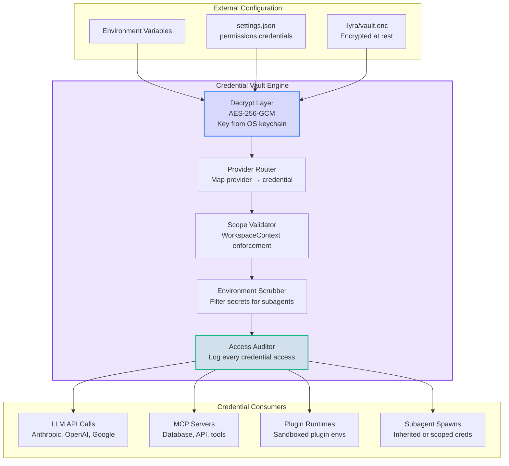

# PLAN-4.11: Permissions & Credentials Architecture Enhancement

**Status:** Proposed  
**Date:** 2026-05-30  
**Version:** 1.0  
**Target Effort:** 8-10 weeks  
**Priority:** CRITICAL (S-Tier Safety Foundation)

---

## Executive Summary

This plan defines a comprehensive permissions and credentials architecture for Lyra that goes beyond simple tool-name allowlisting. Drawing from Claude Code's production permission model, Hermes Agent's multi-tier approval system, and cutting-edge intent-based authorization research, it delivers deny-first evaluation, pattern-based rules, permission modes with escalating requirements, per-agent scoping, workspace-isolated credential vaults, intent-based authorization, immutable audit trails, and time-limited escalation. The architecture treats permissions as a **structural security boundary** -- not a runtime preference.

---

## 1. What Lyra Already Has

Based on the existing architecture and safety design:

| Component | Status | Source |
|-----------|--------|--------|
| 6-layer safety architecture (Parallax cognitive-executive separation) | Designed | `docs/architecture/safety-architecture.md` |
| Layer 2: Permission Gating (plan/auto-edit/bypass modes) | Designed | `docs/architecture/safety-architecture.md` |
| PermissionBridge mode checker | Designed | `docs/architecture/safety-architecture.md` |
| Risk assessment engine (destructive pattern detection, escalation policies) | Designed | `docs/architecture/autonomy-system.md` |
| Hook system foundations (27 event types planned) | Designed | Stream-1 Claude Code Docs |
| Multi-tier approval with dangerous-command patterns (Hermes) | Researched | `docs/research/STREAM-2-HERMES-AGENT.md` |
| Hermes YOLO-mode freeze at import time (prevents runtime injection) | Researched | `docs/research/STREAM-2-HERMES-AGENT.md` |

**Gap:** These are primarily design documents and research analyses. The actual implementation of the permission engine with deny-first evaluation, pattern-based rules, and credential vaulting does not yet exist as production code.

---

## 2. What Research Reveals as Missing

### 2.1 Permission Model Gaps

| Technique | Source | Status | Action |
|-----------|--------|--------|--------|
| **Deny-first evaluation** (Deny > Ask > Allow precedence) | Claude Code Permissions (§10, Stream-1) | NOT IMPLEMENTED | Implement explicit deny-overrides-allow chain |
| **ToolName(specifier) pattern rules** | Claude Code Permissions (§10, Stream-1) | NOT IMPLEMENTED | `Bash(npm run *)`, `Read(~/secrets/**)`, `WebFetch(domain:example.com)` |
| **Bare vs scoped deny** (bare removes tool; scoped blocks matching calls) | Claude Code Permissions (§10, Stream-1) | NOT IMPLEMENTED | Two-tier deny semantics |
| **Permission modes: plan / auto-edit / bypass** with escalating requirements | Claude Code Permissions (§10, Stream-1) | DESIGNED, NOT BUILT | Full mode state machine |
| **Compound command awareness** (&&, \|\|, ;, \|, & detection) | Claude Code Permissions (§10, Stream-1) | NOT IMPLEMENTED | Subcommand-level permission checking |
| **Process wrapper stripping** (timeout, nice, nohup, stdbuf) | Claude Code Permissions (§10, Stream-1) | NOT IMPLEMENTED | Prevent permission bypass via wrappers |
| **Symlink-aware checking** (deny on either symlink OR target) | Claude Code Permissions (§10, Stream-1) | NOT IMPLEMENTED | Path traversal prevention |
| **Permission inheritance for subagents** (from lead at spawn time) | Claude Code Agent Teams (§11, Stream-1) | NOT IMPLEMENTED | Per-agent permission scoping |
| **Intent-based authorization** (classify by intent, not command name -- nah pattern) | GAP-ANALYSIS-2026-05-30 (§6) | NOT IN SAFETY | `github.com/manuelschipper/nah` |
| **Permission audit trail** (immutable log of all grants/denials) | GAP-ANALYSIS-2026-05-30 (§6) | NOT IMPLEMENTED | Ed25519-signed permission log |
| **Time-limited permission escalation** | Research synthesis | NOT IMPLEMENTED | TTL-based temporary grants |
| **Permission policy templates** for common workflows | Research synthesis | NOT IMPLEMENTED | Pre-built policy bundles |

### 2.2 Credential Management Gaps

| Technique | Source | Status | Action |
|-----------|--------|--------|--------|
| **Credential vault with provider-specific API key management** | Hermes Agent (Stream-2) + research synthesis | NOT IMPLEMENTED | Encrypted key store with provider routing |
| **Workspace-scoped credential isolation** (WorkspaceContext pattern) | Research synthesis (Hermes, CC managed policies) | NOT IMPLEMENTED | Per-project credential boundaries |
| **Least-privilege token scoping** | Stream-11 Safety (§C.4) | DESIGNED | Minimal required permissions per operation |
| **Secret access audit** | Stream-11 Safety (§C.4) | DESIGNED | Detect and log all credential access |
| **Environment scrubbing** (secrets filtered before subagent spawn) | Hermes Agent (Stream-2, PTC sandbox) | NOT IMPLEMENTED | `_scrub_environment()` for child processes |

---

## 3. Proposed Enhancements (Ranked by Impact x Effort)

| # | Enhancement | Impact | Effort | Score | Phase |
|---|-------------|--------|--------|-------|-------|
| 1 | Deny-first permission evaluation engine | CRITICAL | Medium | **P0** | 1 |
| 2 | ToolName(specifier) pattern-based rules | CRITICAL | Medium | **P0** | 1 |
| 3 | Workspace-scoped credential vault | CRITICAL | Medium | **P0** | 1 |
| 4 | Permission modes with escalating requirements | HIGH | Medium | **P0** | 2 |
| 5 | Per-agent permission inheritance and scoping | HIGH | Medium | **P1** | 2 |
| 6 | Intent-based authorization (nah pattern) | HIGH | High | **P1** | 3 |
| 7 | Permission audit trail (immutable, signed log) | HIGH | Low | **P1** | 2 |
| 8 | Time-limited permission escalation | MEDIUM | Low | **P1** | 3 |
| 9 | Permission policy templates for common workflows | MEDIUM | Low | **P2** | 3 |
| 10 | Compound command + symlink-aware checking | MEDIUM | Medium | **P2** | 3 |

---

## 4. Architecture

### 4.1 Permission Evaluation Pipeline

```mermaid
flowchart TD
    subgraph Trigger["Tool Call Triggered"]
        TC[Tool Call Request<br/>ToolName + Args + Agent + Intent]
    end

    subgraph DenyFirst["Layer 1: Deny-First Evaluation"]
        direction TB
        D1{Bare Deny?<br/>ToolName in global deny list}
        D2{Scoped Deny?<br/>ToolName(args) matches deny pattern}
        D3{Symlink Deny?<br/>Path via symlink OR target denied}

        D1 -->|Yes| BLOCK[BLOCK: Tool removed from context]
        D1 -->|No| D2
        D2 -->|Yes| BLOCK_SCOPED[BLOCK: Matching calls denied]
        D2 -->|No| D3
        D3 -->|Yes| BLOCK_SCOPED
        D3 -->|No| CONTINUE[Continue to Layer 2]
    end

    subgraph AllowRules["Layer 2: Allow Rule Matching"]
        direction TB
        A1{Exact Allow Match?}
        A2{Pattern Allow Match?}
        A3{Read-Only Command?}

        A1 -->|Yes| ALLOW[AUTO-ALLOW]
        A1 -->|No| A2
        A2 -->|Yes| ALLOW
        A2 -->|No| A3
        A3 -->|Yes| ALLOW
        A3 -->|No| CONTINUE2[Continue to Layer 3]
    end

    subgraph IntentAuth["Layer 3: Intent-Based Authorization"]
        direction TB
        I1[Classify Intent<br/>nah-style embedding classifier]
        I2{Intent matches<br/>allowed intent class?}
        I3{Intent needs<br/>escalation?}

        I1 --> I2
        I2 -->|Yes| I3
        I2 -->|No| BLOCK_INTENT[BLOCK: Intent mismatch]
        I3 -->|Yes| ESCALATE[ESCALATE: Request approval]
        I3 -->|No| ALLOW
    end

    subgraph ModeGate["Layer 4: Permission Mode Gate"]
        direction TB
        M1{Current Mode?}
        M1 -->|plan| PLAN[BLOCK: Read-only mode]
        M1 -->|auto-edit| AUTO[ALLOW: Auto-accept edits]
        M1 -->|bypass| BYPASS[ALLOW: Require explicit override]
        M1 -->|default| ASK[ASK: Prompt user]
    end

    subgraph AuditLog["Layer 5: Immutable Audit Trail"]
        AL[Append decision to HIR<br/>Signed: Ed25519<br/>Timestamped, non-repudiable]
    end

    TC --> DenyFirst
    CONTINUE --> AllowRules
    CONTINUE2 --> IntentAuth
    ALLOW --> ModeGate
    ASK --> AuditLog
    BLOCK --> AuditLog
    BLOCK_SCOPED --> AuditLog
    BLOCK_INTENT --> AuditLog
    ESCALATE --> AuditLog

    style BLOCK fill:#ef444420,stroke:#ef4444,stroke-width:2px
    style BLOCK_SCOPED fill:#ef444420,stroke:#ef4444,stroke-width:2px
    style BLOCK_INTENT fill:#ef444420,stroke:#ef4444,stroke-width:2px
    style ALLOW fill:#10b98120,stroke:#10b981,stroke-width:2px
    style PLAN fill:#f59e0b20,stroke:#f59e0b,stroke-width:2px
```

### 4.2 Credential Vault Architecture



### 4.3 Permission Mode State Machine

```mermaid
stateDiagram-v2
    [*] --> Default: Session start

    Default --> AcceptEdits: User elevates (acceptEdits)
    Default --> Plan: User restricts (plan mode)
    Default --> DontAsk: User restricts (dontAsk)

    AcceptEdits --> Auto: Background safety checks pass
    AcceptEdits --> Default: Timeout / user revokes

    Auto --> AcceptEdits: User downgrades
    Auto --> Bypass: Explicit user approval + TTL

    Plan --> Default: User exits plan mode
    Plan --> AcceptEdits: User elevates

    DontAsk --> Default: User enables tool

    Bypass --> Auto: TTL expires
    Bypass --> Default: User revokes

    note right of Plan: Read-only exploration<br/>No file mutation<br/>No shell execution
    note right of Auto: Auto-approve +<br/>background safety checks<br/>Research preview
    note right of Bypass: Skip all prompts<br/>Still guards root/home rm<br/>Requires TTL + audit
```

---

## 5. Key Component Interfaces (Python dataclasses)

### 5.1 Permission Rule Engine

```python
from dataclasses import dataclass, field
from enum import Enum, auto
from typing import Optional, Pattern, Callable
from datetime import datetime, timedelta
import re

class PermissionDecision(Enum):
    ALLOW = auto()
    ASK = auto()
    DENY = auto()
    BLOCK_SCOPED = auto()  # block tool for matching calls, tool remains in context
    BLOCK_BARE = auto()     # remove tool entirely from context

class PermissionMode(Enum):
    DEFAULT = "default"           # Prompt on first use of each tool
    ACCEPT_EDITS = "acceptEdits"  # Auto-accept edits + common FS commands
    PLAN = "plan"                 # Read-only exploration, no edits
    AUTO = "auto"                 # Auto-approve with background safety checks
    DONT_ASK = "dontAsk"         # Auto-deny unless pre-approved
    BYPASS = "bypass"            # Skip all prompts (guards root/home rm)

@dataclass
class PermissionRule:
    """A single permission rule in deny-first evaluation chain."""
    tool_name: str
    specifier: Optional[str] = None  # e.g., "npm run *", "~/secrets/**"
    decision: PermissionDecision = PermissionDecision.ALLOW
    is_bare_deny: bool = False  # True = remove tool; False = block matching calls
    compiled_pattern: Optional[Pattern] = field(default=None, repr=False)
    scope: str = "user"  # user | project | plugin | managed
    priority: int = 0     # higher = evaluated first (managed = 100)

    def __post_init__(self):
        if self.specifier:
            self.compiled_pattern = self._compile_pattern(self.specifier)

    def _compile_pattern(self, spec: str) -> Pattern:
        """Convert ToolName(specifier) to regex with gitignore-like syntax."""
        # Bash(npm run *): specifier = "npm run *"
        # Read(~/secrets/**): specifier = "~/secrets/**"
        # WebFetch(domain:example.com): specifier = "domain:example.com"
        escaped = re.escape(spec).replace(r'\*', '.*').replace(r'\*\*', '.*')
        return re.compile(f"^{escaped}$")

    def matches(self, tool_name: str, args: str) -> bool:
        """Check if this rule applies to a given tool call."""
        if self.tool_name != tool_name:
            return False
        if self.compiled_pattern is None:
            return True  # bare rule, matches all uses of this tool
        return bool(self.compiled_pattern.match(args))

@dataclass
class PermissionEvaluation:
    """Result of evaluating a tool call against the permission chain."""
    tool_name: str
    args: str
    decision: PermissionDecision
    matched_rule: Optional[PermissionRule] = None
    deny_reason: Optional[str] = None
    intent_class: Optional[str] = None
    mode_override: Optional[PermissionMode] = None
    escalation_ttl: Optional[timedelta] = None
    timestamp: datetime = field(default_factory=datetime.utcnow)
```

### 5.2 Credential Vault

```python
from dataclasses import dataclass, field
from typing import Dict, List, Optional
from pathlib import Path
from datetime import datetime
import hashlib

@dataclass
class ProviderCredential:
    """Encrypted credential for a specific API provider."""
    provider: str           # "anthropic", "openai", "google", "custom"
    key_name: str           # "ANTHROPIC_API_KEY", "OPENAI_API_KEY"
    key_hash: str           # SHA-256 of key (never stored in plaintext)
    created_at: datetime
    last_rotated: Optional[datetime] = None
    expires_at: Optional[datetime] = None
    allowed_workspaces: List[str] = field(default_factory=list)  # empty = all workspaces
    scopes: List[str] = field(default_factory=list)  # "read:files", "write:files", etc.

@dataclass
class WorkspaceContext:
    """Security boundary for credential isolation."""
    workspace_id: str       # Unique workspace identifier
    workspace_root: Path    # Filesystem root for the workspace
    allowed_providers: List[str] = field(default_factory=list)
    allowed_domains: List[str] = field(default_factory=list)  # for WebFetch/WebSearch
    credential_overrides: Dict[str, str] = field(default_factory=dict)  # provider → key_name

@dataclass
class CredentialAccessLog:
    """Immutable audit entry for credential access."""
    access_id: str          # UUID
    timestamp: datetime
    workspace_id: str
    agent_id: str
    provider: str
    key_name: str           # Reference only, never the key itself
    operation: str          # "read", "list", "rotate"
    success: bool
    signature: str          # Ed25519 signature of the log entry

@dataclass
class PermissionAuditEntry:
    """Immutable audit entry for permission decision."""
    entry_id: str           # UUID
    timestamp: datetime
    session_id: str
    agent_id: str
    tool_name: str
    args_preview: str       # Truncated args for privacy
    decision: PermissionDecision
    mode: PermissionMode
    matched_rule_id: Optional[str]
    intent_class: Optional[str]
    user_override: bool
    signature: str          # Ed25519 signature of all above fields
```

### 5.3 Intent-Based Authorization Engine

```python
from dataclasses import dataclass, field
from typing import List, Dict, Any
from enum import Enum

class IntentClass(Enum):
    """Intent categories for nah-style authorization."""
    FILE_READ = "file_read"
    FILE_WRITE = "file_write"
    FILE_DELETE = "file_delete"
    SHELL_READ = "shell_read"         # ls, cat, grep, find, stat
    SHELL_MUTATE = "shell_mutate"     # mv, cp, rm, chmod
    SHELL_EXECUTE = "shell_execute"   # arbitrary command execution
    NETWORK_OUTBOUND = "network_outbound"
    NETWORK_INBOUND = "network_inbound"
    GIT_READ = "git_read"
    GIT_WRITE = "git_write"
    GIT_FORCE = "git_force"           # push --force, hard reset
    SYSTEM_CONFIG = "system_config"   # env vars, settings changes
    SAFETY_OVERRIDE = "safety_override"  # disable safety layers

@dataclass
class IntentClassification:
    """Result of intent-based classification for a tool call."""
    tool_call: str          # Original tool name + args
    primary_intent: IntentClass
    secondary_intents: List[IntentClass] = field(default_factory=list)
    confidence: float = 1.0  # 0.0 - 1.0
    embedding: List[float] = field(default_factory=list)  # For audit/investigation
    classified_by: str = "nah-classifier"  # model or rule-engine
```

---

## 6. Implementation Phases

### Phase 1: Permission Engine Core (Weeks 1-3)

**Goal:** Production-ready deny-first permission evaluation with pattern-based rules.

| Task | Description | Effort | Tests |
|------|-------------|--------|-------|
| 1.1 | Implement `PermissionEngine` class with deny-first evaluation chain | 3 days | 20 unit |
| 1.2 | Implement `ToolName(specifier)` pattern parser (gitignore syntax, regex fallback) | 2 days | 15 unit |
| 1.3 | Implement bare vs scoped deny semantics | 1 day | 10 unit |
| 1.4 | Implement settings.json permission rule loader (managed > CLI > local > shared > user) | 2 days | 10 unit |
| 1.5 | Implement permission mode state machine (plan / acceptEdits / auto / dontAsk / bypass) | 3 days | 15 unit |
| 1.6 | Integrate with existing hook system (PreToolUse permission check) | 2 days | 10 integration |
| 1.7 | Implement compound command awareness for Bash (&&, \|\|, ;, \|, &) | 2 days | 15 unit |

**Deliverable:** `lyra-permissions` package with deny-first engine, pattern rules, mode FSM, hook integration.

### Phase 2: Credential Vault + Scoping (Weeks 4-6)

**Goal:** Encrypted credential management with workspace-scoped isolation.

| Task | Description | Effort | Tests |
|------|-------------|--------|-------|
| 2.1 | Implement `CredentialVault` with AES-256-GCM encryption (key from OS keychain) | 3 days | 15 unit |
| 2.2 | Implement provider credential router (map provider string → credential) | 2 days | 10 unit |
| 2.3 | Implement `WorkspaceContext` scope enforcement for credentials | 2 days | 10 unit |
| 2.4 | Implement environment scrubbing for subagent spawns | 2 days | 10 unit |
| 2.5 | Implement per-agent permission inheritance from lead agent | 2 days | 10 unit |
| 2.6 | Implement `CredentialAccessLog` with Ed25519 signing | 2 days | 10 unit |
| 2.7 | Implement process wrapper stripping (timeout, nice, nohup, stdbuf) | 1 day | 10 unit |

**Deliverable:** `lyra-credentials` package with vault, router, scope isolation, subagent scrubbing.

### Phase 3: Intent-Based Authorization + Audit (Weeks 7-9)

**Goal:** Intent-based classification, immutable audit trail, time-limited escalation.

| Task | Description | Effort | Tests |
|------|-------------|--------|-------|
| 3.1 | Implement `IntentClassifier` (embedding-based, nah-pattern) with 11 intent classes | 4 days | 20 unit |
| 3.2 | Implement intent-to-permission mapping (SHELL_MUTATE requires higher mode than FILE_READ) | 2 days | 15 unit |
| 3.3 | Implement `PermissionAuditTrail` (append-only HIR, Ed25519 chain, non-repudiable) | 3 days | 15 unit |
| 3.4 | Implement time-limited permission escalation (TTL-based temporary grants) | 2 days | 10 unit |
| 3.5 | Implement symlink-aware permission checking (deny on symlink OR target) | 1 day | 10 unit |
| 3.6 | Implement permission policy templates (low-risk-dev, research, production, restricted) | 2 days | 10 unit |

**Deliverable:** Intent classifier, immutable audit trail, time-limited escalation, policy templates.

### Phase 4: Integration + Hardening (Week 10)

**Goal:** Full integration testing, security audit, documentation.

| Task | Description | Effort | Tests |
|------|-------------|--------|-------|
| 4.1 | End-to-end permission chain testing (all layers) | 2 days | 15 E2E |
| 4.2 | Security audit: pen-test permission bypass vectors | 1 day | N/A |
| 4.3 | Integration with Lyra CLI (`/permissions` command, Ctrl+T display) | 2 days | 10 integration |
| 4.4 | Documentation: permission model, credential setup, policy guide | 2 days | N/A |

**Deliverable:** Production-hardened permissions and credentials system, security audited.

---

## 7. Configuration Schema

### 7.1 Permission Rules (settings.json)

```json
{
  "permissions": {
    "mode": "default",
    "deny": [
      "Bash(rm -rf /*)",
      "Bash(rm -rf ~/*)",
      "Read(//**/.env)",
      "Write(//**/.env)",
      "Bash(git push --force origin main)",
      "Bash(curl * | bash)",
      "mcp__*__delete_table"
    ],
    "allow": [
      "Bash(npm run *)",
      "Bash(npm test *)",
      "Bash(git status)",
      "Bash(git diff *)",
      "Bash(git log *)",
      "Bash(git branch *)",
      "Read(./*.ts)",
      "Read(./*.py)",
      "Write(./*.ts)",
      "Write(./*.py)",
      "WebFetch(domain:github.com)",
      "WebFetch(domain:docs.python.org)",
      "WebSearch",
      "Agent(Explore)",
      "Agent(Code-Review)"
    ],
    "additionalDirectories": ["/tmp/lyra-sandbox"],
    "escalation": {
      "max_ttl_minutes": 60,
      "require_justification": true,
      "max_escalations_per_session": 10
    }
  }
}
```

### 7.2 Credential Configuration

```json
{
  "credentials": {
    "vault_path": ".lyra/vault.enc",
    "providers": {
      "anthropic": {
        "env_key": "ANTHROPIC_API_KEY",
        "keychain_service": "lyra/anthropic",
        "workspaces": ["*"]
      },
      "openai": {
        "env_key": "OPENAI_API_KEY",
        "keychain_service": "lyra/openai",
        "workspaces": ["research-project"]
      },
      "google": {
        "env_key": "GOOGLE_API_KEY",
        "keychain_service": "lyra/google",
        "workspaces": ["*"]
      }
    },
    "workspace_scoping": {
      "default": {
        "allowed_providers": ["anthropic"],
        "allowed_domains": ["github.com", "pypi.org", "npmjs.com"]
      },
      "research-project": {
        "allowed_providers": ["anthropic", "openai", "google"],
        "allowed_domains": ["*"]
      }
    }
  }
}
```

---

## 8. Key Metrics & Success Criteria

| Metric | Target | Measurement |
|--------|--------|-------------|
| Permission bypass blocked | 100% of known vectors | Penetration test suite |
| Deny-first evaluation latency | <5ms per rule chain | Benchmark with 100 rules |
| Credential access audit completeness | 100% of accesses logged | Integration test |
| Intent classification accuracy | >95% on known tool calls | Test suite with labeled data |
| Permission mode transition consistency | 0 invalid state transitions | FSM model checking |
| Audit trail integrity | Tamper-evident (Ed25519 verification passes) | Cryptographic test |

---

## 9. Integration Points

### 9.1 With Safety Architecture

Permissions integrate at **Layer 2** of the 6-layer safety model:
- Layer 0 (Input Validation) feeds into deny-first rules
- Layer 1 (Cognitive-Executive Separation) generates structured execution plans checked by permissions
- Layer 2 (Permission Gating) is **this entire plan**
- Layers 3-5 receive permission decisions for monitoring/audit

### 9.2 With Hook System

Permission evaluation triggers at these hook points:
- `PreToolUse` -- Main permission check (deny-first evaluation)
- `PermissionRequest` -- User prompt for approval
- `PermissionDenied` -- Logging and audit
- `PostToolUse` -- Verify permission wasn't bypassed post-hoc

### 9.3 With Agent Teams

- Subagents inherit lead agent's permissions at spawn time
- Subagent permissions are **always <= lead agent permissions** (never elevated)
- Per-agent permission override: `Agent(type).allow([...])` and `Agent(type).deny([...])`

---

## 10. References

| Source | Link / Location | Key Contribution |
|--------|----------------|------------------|
| Claude Code Permissions Docs | `docs/research/STREAM-1-CLAUDE-CODE-DOCS.md` §10 | Deny-first evaluation, ToolName(specifier) format, permission modes, scoping hierarchy |
| Hermes Agent Approval System | `docs/research/STREAM-2-HERMES-AGENT.md` §4.J | Multi-tier approval, pattern matching, YOLO-mode freeze, plugin hooks |
| Lyra Safety Architecture | `docs/architecture/safety-architecture.md` | 6-layer defense model, Layer 2 Permission Gating, Parallax separation |
| Gap Analysis (§6 Safety) | `docs/research/GAP-ANALYSIS-2026-05-30.md` §6 | Intent-based authorization (nah), behavioral fingerprint regression |
| nah (Intent-Based Auth) | `github.com/manuelschipper/nah` | Classify tool calls by intent, not command name |
| JAW Adversarial Workflow Security | `arXiv:2605.11229` (Stream-11) | Input provenance tracking, credential exfiltration prevention |
| Claude Code Hooks Reference | `docs/research/STREAM-1-CLAUDE-CODE-DOCS.md` §5 | 27 hook events, exit code 2 = block protocol, structured JSON output |
| Anthropic Agentic Misalignment | Stream-11 §C.2 | Evaluation vs reality gap, autonomy threat misalignment triggers |

---

**Next Steps:**
1. Create `packages/lyra-permissions/` with Phase 1 core engine (deny-first + pattern rules + mode FSM)
2. Create `packages/lyra-credentials/` with Phase 2 vault + router + scoping
3. Implement intent classifier as part of Phase 3
4. Security audit after Phase 4 completion
