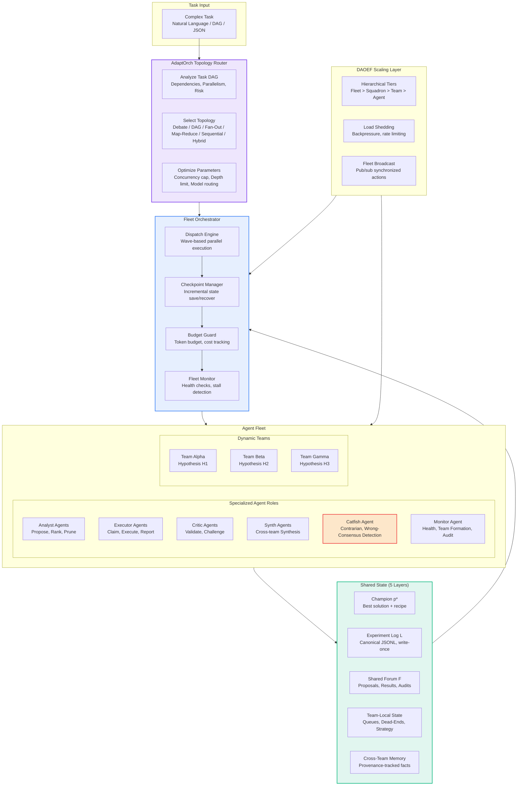
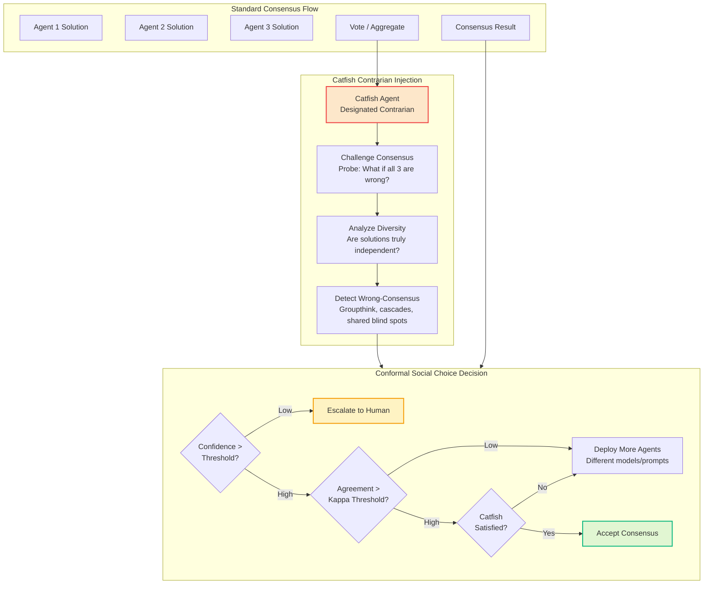
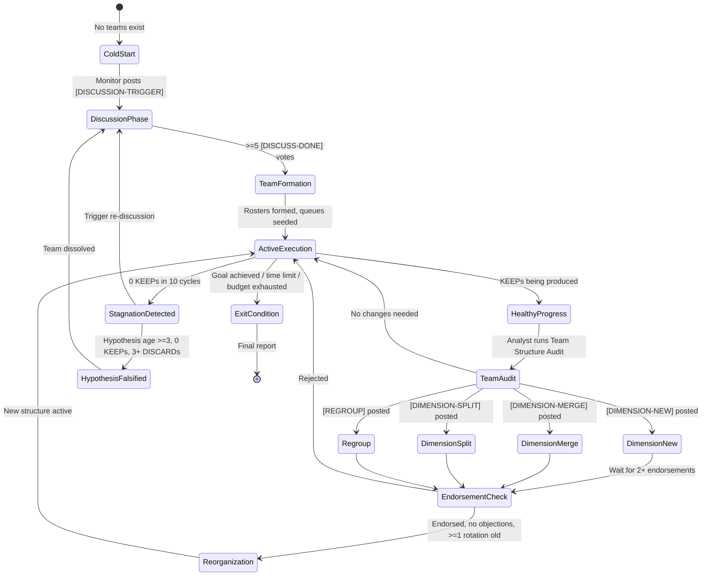
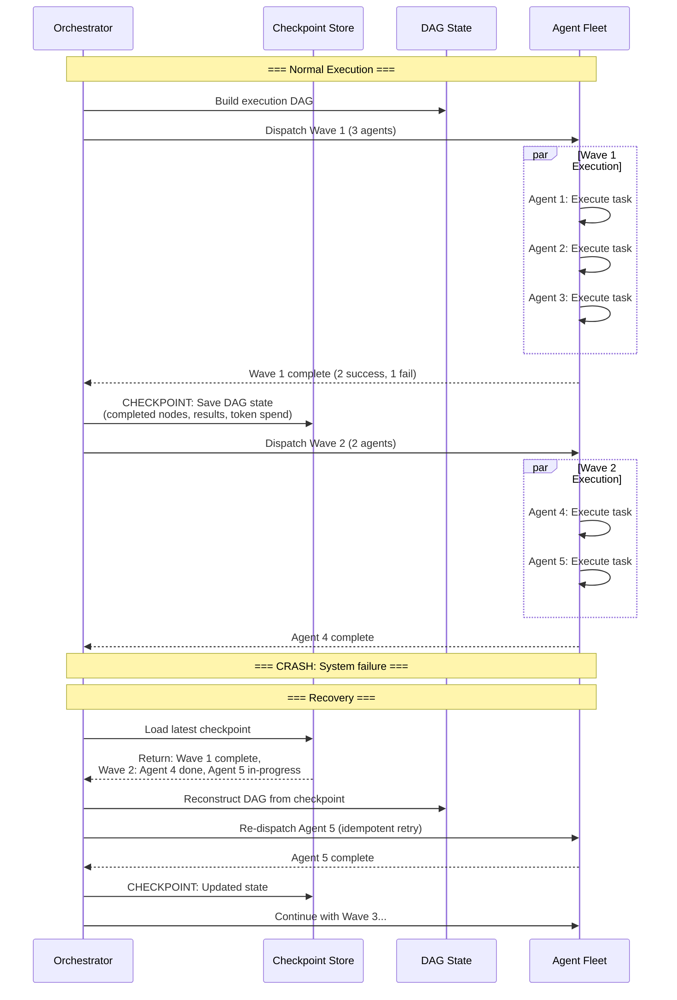

# PLAN-4.12: Agent Swarm & Fleet Orchestration Enhancement

**Status:** Proposed  
**Date:** 2026-05-30  
**Version:** 1.0  
**Target Effort:** 10-12 weeks  
**Priority:** CRITICAL (S-Tier Multi-Agent Foundation)

---

## Executive Summary

This plan defines a comprehensive upgrade to Lyra's agent swarm and fleet orchestration, moving beyond the current AutoScientists-inspired design to incorporate topology-aware routing (AdaptOrch), contrarian agent consensus protection (Catfish), cumulative subagent reuse (AgentFactory), conformal social choice for calibrated escalation, DAOEF scaling patterns for large fleets, checkpoint recovery, and dynamic team formation with false-negative convergence detection. The architecture transforms Lyra's swarm from a research prototype into a production-grade, self-organizing, fault-tolerant multi-agent system capable of coordinating 100+ agents.

---

## 1. What Lyra Already Has

Based on the existing architecture and implemented code:

| Component | Status | Source |
|-----------|--------|--------|
| FleetOrchestrator with 5 execution patterns (DEBATE, DAG, FAN_OUT, MAP_REDUCE, SEQUENTIAL) | Implemented | `packages/lyra-agent-swarm` |
| 4 consensus methods (Majority, Weighted, Unanimous, Bayesian) | Implemented | `packages/lyra-agent-swarm` |
| Decentralized coordination (AutoScientists-inspired) | Designed | `docs/architecture/agent-swarm.md` |
| Dynamic team formation around hypotheses | Designed | `docs/architecture/agent-swarm.md` |
| 4-layer shared state (Champion, Experiment Log, Forum, Team-Local) | Designed | `docs/architecture/agent-swarm.md` |
| SwarmCoordinator with TeamFormationEngine and ConvergenceManager | Designed | `docs/architecture/agent-swarm.md` |
| Agent roles: Analyst, Experimenter, Critic, Synthesizer | Designed | `docs/architecture/agent-swarm.md` |
| Contract chain system with evidence-based validation | Designed | `docs/architecture/agent-orchestration.md` |
| Wave-based execution in dependency-ordered waves | Designed | `docs/architecture/agent-orchestration.md` |
| Self-claiming task model with capability matching | Designed | `docs/architecture/agent-orchestration.md` |
| Speculative router and zero-trust federation | Implemented | `packages/lyra-agent-swarm` |
| Fleet merge with convergence detection | Partially implemented | Git log: `fix(gossip): fix false-negative convergence detection in fleet merge` |
| Autopilot integration | Implemented | `packages/lyra-agent-swarm` |

**Gap:** The core orchestration loops, AutoScientists-style research swarm, team formation, and most coordination patterns are designed but not implemented as production code. The swarm packages exist but need substantial enhancement.

---

## 2. What Research Reveals as Missing

### 2.1 Orchestration & Topology Gaps

| Technique | Source | Status | Action |
|-----------|--------|--------|--------|
| **AdaptOrch topology routing** (dynamic topology selection based on task DAG, 12-23% improvement) | `arXiv:2602.16873` (GAP §5) | NOT IN SWARM | Implement topology selection engine |
| **AgentFactory subagent accumulation** (reuse successful subagents across tasks) | `arXiv:2603.18000` (GAP §5) | NOT IN SWARM | Subagent template library with success metrics |
| **Recursive multi-agent spawning** with depth limits | `arXiv:2604.25917` (GAP §5) | PARTIAL | Depth-bounded recursive spawn with budget controls |
| **Dynamic workflow orchestration** (JS/Python scripts outside context windows) | Stream-11 §A.2 | PARTIAL | Orchestration script execution engine |
| **Incremental checkpointing** for resumable multi-hour runs | Stream-11 §A.4 | NOT IMPLEMENTED | Save DAG state every N completions |
| **Cost-aware model routing** (Haiku/Sonnet/Opus per subtask) | Stream-11 §A.5 | PARTIAL | Integrate with lyra-model-router |
| **Token budget guard** with warning/stop thresholds | Stream-11 §A.5 | NOT IMPLEMENTED | 80%/95% warning/stop thresholds |

### 2.2 Consensus & Safety Gaps

| Technique | Source | Status | Action |
|-----------|--------|--------|--------|
| **Catfish contrarian agent** (prevent wrong-consensus, 81.9% interception) | `arXiv:2505.21503` (GAP §5) | NOT IN SWARM | Designated contrarian with weighted voting |
| **Conformal social choice** (calibrated act-vs-escalate decisions) | `arXiv:2604.07667` (GAP §5) | NOT IN SWARM | Confidence-calibrated escalation thresholds |
| **Agreement metrics** (Fleiss' kappa, 41% disagreement rate validation) | Stream-11 §A.3 | NOT IMPLEMENTED | Formal inter-rater agreement scoring |
| **Interaction topology randomization** (prevent ordering instability, information cascades) | `arXiv:2605.01147` (Stream-11 §C.3) | NOT IMPLEMENTED | Randomized agent ordering, delayed info sharing |
| **Distributed Sentinel / STT** (cross-agent taint tracking, F1=0.95) | `arXiv:2604.22879` (Stream-11 §C.3) | NOT IMPLEMENTED | Semantic Taint Token propagation |

### 2.3 Scaling Gaps

| Technique | Source | Status | Action |
|-----------|--------|--------|--------|
| **DAOEF scaling patterns** (>100 agent fleets, prevent Synergistic Collapse) | `arXiv:2604.20129` (GAP §5) | NOT IN SWARM | Hierarchical coordination tiers, load shedding |
| **Fleet-wide broadcast** and synchronized actions | Research synthesis | NOT IMPLEMENTED | Pub/sub message bus for fleet coordination |
| **Cross-team shared memory** with provenance tracking | Stream-4 (MemAgent Workshop) | NOT IMPLEMENTED | Turn-level fact tracking with conflict resolution |
| **Dynamic team formation: DIMENSION-NEW/MERGE/SPLIT/REGROUP** | AutoScientists (Stream-6 §3.1) | DESIGNED, NOT BUILT | Team evolution protocol with endorsement requirements |
| **Fleet merge with false-negative convergence detection fix** | Git log recent commit | RECENTLY FIXED | Verify fix, add regression tests |

---

## 3. Proposed Enhancements (Ranked by Impact x Effort)

| # | Enhancement | Impact | Effort | Score | Phase |
|---|-------------|--------|--------|-------|-------|
| 1 | Catfish contrarian agent for consensus protection | CRITICAL | Medium | **P0** | 1 |
| 2 | AdaptOrch topology routing engine | CRITICAL | High | **P0** | 2 |
| 3 | AgentFactory subagent accumulation and reuse | HIGH | Medium | **P0** | 1 |
| 4 | Conformal social choice for calibrated escalation | HIGH | High | **P1** | 2 |
| 5 | Incremental checkpoint recovery for swarm workflows | HIGH | Medium | **P1** | 2 |
| 6 | Dynamic team formation (DIMENSION-NEW/MERGE/SPLIT/REGROUP) | HIGH | High | **P1** | 3 |
| 7 | DAOEF scaling patterns for >100 agent fleets | MEDIUM | High | **P2** | 3 |
| 8 | Cross-team shared memory with provenance tracking | MEDIUM | Medium | **P2** | 3 |
| 9 | Fleet-wide broadcast and synchronized actions | MEDIUM | Medium | **P2** | 3 |
| 10 | Fleet merge integration hardening | HIGH | Low | **P0** | 1 |

---

## 4. Architecture

### 4.1 Enhanced Swarm Architecture



### 4.2 Catfish Contrarian Agent Integration



### 4.3 Dynamic Team Formation & Reorganization



### 4.4 Checkpoint Recovery Architecture



---

## 5. Key Component Interfaces (Python dataclasses)

### 5.1 AdaptOrch Topology Router

```python
from dataclasses import dataclass, field
from typing import List, Dict, Optional, Tuple
from enum import Enum

class TopologyType(Enum):
    DEBATE = "debate"           # Adversarial verification, convergence required
    DAG = "dag"                 # Dependency-ordered parallel execution
    FAN_OUT = "fan_out"         # Independent parallel subtasks
    MAP_REDUCE = "map_reduce"   # Parallel processing with aggregation
    SEQUENTIAL = "sequential"   # Linear pipeline
    HYBRID = "hybrid"           # Mixed: e.g., Fan-Out → Debate per branch

@dataclass
class TaskCharacteristics:
    """Features that determine optimal topology."""
    parallelism: float          # 0.0 (sequential) to 1.0 (embarrassingly parallel)
    dependency_depth: int       # Max depth of dependency chain
    risk_level: float           # 0.0 (safe) to 1.0 (critical)
    require_consensus: bool     # Does the task need multi-agent agreement?
    output_cardinality: int     # Expected number of output items
    estimated_tokens: int       # Estimated token consumption
    domain: str                 # "code", "research", "analysis", "creative"

@dataclass
class TopologySelection:
    """Result of topology routing decision."""
    topology: TopologyType
    confidence: float           # 0.0 - 1.0
    concurrency_cap: int        # Max parallel agents
    max_depth: int             # Max recursive spawn depth
    effort_tiers: Dict[str, str]  # Agent role → effort level (low/medium/high/max)
    model_routing: Dict[str, str]  # Agent role → model (haiku/sonnet/opus)
    estimated_improvement: float  # Expected gain vs default topology

@dataclass
class AdaptOrchRouter:
    """Dynamic topology selector based on task DAG analysis.

    Source: arXiv:2602.16873 — AdaptOrch achieves 12-23% improvement
    by selecting the right topology for each task structure.
    """
    def analyze(self, task_dag: Dict, characteristics: TaskCharacteristics) -> TopologySelection:
        """Select optimal topology based on task characteristics."""
        # High parallelism + low risk → FAN_OUT
        # High risk + need consensus → DEBATE
        # Deep dependencies → DAG
        # Aggregation needed → MAP_REDUCE
        # Simple pipeline → SEQUENTIAL
        # Mixed characteristics → HYBRID (decompose into sub-topologies)
        ...

    def estimate_improvement(self, current: TopologyType, candidate: TopologyType,
                            characteristics: TaskCharacteristics) -> float:
        """Estimate expected improvement from topology change."""
        ...
```

### 5.2 Catfish Contrarian Agent

```python
from dataclasses import dataclass, field
from typing import List, Dict, Optional, Set
import numpy as np

@dataclass
class ContrarianChallenge:
    """A contrarian challenge to the current consensus."""
    challenge_id: str
    target_consensus: str      # What is being challenged
    challenge_type: str         # "groupthink", "cascade", "blind_spot", "independence_violation"
    evidence: List[str]         # Specific evidence against consensus
    proposed_alternative: Optional[str] = None
    confidence: float = 0.0

@dataclass
class ConsensusHealth:
    """Health assessment of a consensus decision."""
    fleiss_kappa: float         # Inter-rater agreement (-1 to 1)
    independence_score: float   # How independent are the solutions? (0 to 1)
    diversity_score: float      # How diverse are the approaches? (0 to 1)
    cascade_risk: float         # Risk of information cascade (0 to 1)
    catfish_satisfied: bool     # Did the Catfish agent approve?
    challenges: List[ContrarianChallenge] = field(default_factory=list)
    recommendation: str = ""    # "accept", "more_agents", "escalate"

@dataclass
class CatfishAgent:
    """Designated contrarian that prevents wrong-consensus convergence.

    Source: arXiv:2505.21503 — Catfish achieves 81.9% wrong-consensus interception.
    Injected into every consensus-forming agent group.
    """
    agent_id: str = "catfish-0"
    model: str = "sonnet"       # Requires strong reasoning
    challenge_aggressiveness: float = 0.7  # 0 (passive) to 1.0 (hyper-skeptical)

    def evaluate_consensus(self, solutions: List[Dict], agent_metadata: List[Dict]) -> ConsensusHealth:
        """Evaluate whether a consensus is genuine or false."""
        # 1. Compute Fleiss' kappa for agreement level
        # 2. Check solution independence (different models? different approaches? different prompts?)
        # 3. Detect cascade patterns (did later agents see earlier outputs?)
        # 4. Generate contrarian challenges
        # 5. If any challenge is unaddressed → not satisfied
        ...

    def generate_challenge(self, solutions: List[Dict]) -> ContrarianChallenge:
        """Generate a specific contrarian challenge to the consensus."""
        # Probe: "What if all solutions share the same blind spot?"
        # Probe: "What edge case would break all of these?"
        # Probe: "What assumption do all solutions share?"
        ...
```

### 5.3 AgentFactory (Subagent Accumulation)

```python
from dataclasses import dataclass, field
from typing import List, Dict, Optional, Any
from datetime import datetime

@dataclass
class SubagentTemplate:
    """Reusable subagent configuration learned from successful past agents."""
    template_id: str
    role: str                   # "analyst", "executor", "critic", "catfish", etc.
    system_prompt: str
    tools: List[str]            # Tool allowlist
    blocked_tools: List[str]    # Tool denylist
    model_preference: str       # "haiku", "sonnet", "opus"
    effort_level: str           # "low", "medium", "high", "max"
    success_rate: float         # Historical success rate
    avg_token_cost: float       # Average token cost per invocation
    task_domains: List[str]     # Domains this subagent works well for
    created_from: str           # Original task that spawned this template
    used_count: int = 0         # Times reused
    last_used: Optional[datetime] = None
    performance_history: List[Dict] = field(default_factory=list)

@dataclass
class AgentFactory:
    """Accumulates and reuses successful subagent configurations across tasks.

    Source: arXiv:2603.18000 — AgentFactory accumulation pattern.
    Reuse successful subagents instead of re-designing from scratch.
    """
    templates: Dict[str, SubagentTemplate] = field(default_factory=dict)
    max_templates: int = 50

    def register_success(self, agent_config: Dict, task_result: Dict) -> SubagentTemplate:
        """Register a successful subagent as a reusable template."""
        ...

    def find_best_match(self, task_domain: str, requirements: Dict) -> Optional[SubagentTemplate]:
        """Find the best matching template for a new task."""
        ...

    def instantiate(self, template_id: str, task_specific_overrides: Dict) -> Dict:
        """Create a new subagent from a template with task-specific overrides."""
        ...

    def prune_low_performers(self, min_success_rate: float = 0.5) -> int:
        """Remove templates below success threshold. Returns count removed."""
        ...
```

---

## 6. Implementation Phases

### Phase 1: Core Swarm Hardening (Weeks 1-3)

**Goal:** Fix existing issues, add Catfish agent, implement AgentFactory.

| Task | Description | Effort | Tests |
|------|-------------|--------|-------|
| 1.1 | Verify and harden fleet merge false-negative convergence fix | 1 day | 10 regression |
| 1.2 | Implement Catfish contrarian agent class with challenge generation | 3 days | 20 unit |
| 1.3 | Integrate Catfish into all consensus-forming execution patterns | 2 days | 10 integration |
| 1.4 | Implement Fleiss' kappa agreement metrics | 2 days | 15 unit |
| 1.5 | Implement AgentFactory with template registration, matching, instantiation | 3 days | 20 unit |
| 1.6 | Implement AgentFactory template pruning with performance decay | 1 day | 10 unit |
| 1.7 | Add random agent ordering to all debate patterns (prevent cascade) | 1 day | 10 integration |
| 1.8 | Implement delayed information sharing (agents don't see peers' outputs before own) | 2 days | 10 integration |

**Deliverable:** Hardened swarm with contrarian agent, agreement metrics, subagent reuse.

### Phase 2: Topology & Checkpointing (Weeks 4-7)

**Goal:** AdaptOrch routing, conformal escalation, checkpoint recovery.

| Task | Description | Effort | Tests |
|------|-------------|--------|-------|
| 2.1 | Implement `TaskCharacteristics` analyzer (parallelism, depth, risk, consensus) | 2 days | 15 unit |
| 2.2 | Implement AdaptOrch topology selection engine with HYBRID support | 4 days | 20 unit |
| 2.3 | Implement topology selection confidence scoring + fallback | 1 day | 10 unit |
| 2.4 | Implement conformal social choice for calibrated escalation | 3 days | 15 unit |
| 2.5 | Implement incremental DAG checkpointing (save every N completions) | 3 days | 15 unit |
| 2.6 | Implement checkpoint recovery (reconstruct DAG, re-dispatch in-progress tasks) | 3 days | 15 unit |
| 2.7 | Implement token budget guard with 80%/95% warning/stop thresholds | 2 days | 10 unit |
| 2.8 | Implement cost-aware model routing integration with lyra-model-router | 2 days | 10 integration |

**Deliverable:** Topology-adaptive routing, escalated consensus, fault-tolerant checkpointing.

### Phase 3: Dynamic Teams & Scaling (Weeks 8-10)

**Goal:** Dynamic team formation, DAOEF scaling, cross-team memory.

| Task | Description | Effort | Tests |
|------|-------------|--------|-------|
| 3.1 | Implement DIMENSION-NEW/MERGE/SPLIT/REGROUP team evolution protocol | 4 days | 20 unit |
| 3.2 | Implement endorsement requirement engine (2+ approvals, no objections, >=1 rotation old) | 2 days | 15 unit |
| 3.3 | Implement DAOEF hierarchical tiers (Fleet > Squadron > Team > Agent) | 3 days | 15 unit |
| 3.4 | Implement load shedding and backpressure for >100 agent fleets | 2 days | 10 unit |
| 3.5 | Implement fleet-wide broadcast (pub/sub message bus for synchronized actions) | 2 days | 10 unit |
| 3.6 | Implement cross-team shared memory with provenance tracking | 3 days | 15 unit |
| 3.7 | Implement 5th shared state layer (Cross-Team Memory with fact-level provenance) | 2 days | 10 unit |

**Deliverable:** Dynamic team evolution, large-fleet scaling, cross-team knowledge sharing.

### Phase 4: Integration & Hardening (Weeks 11-12)

**Goal:** End-to-end testing, performance benchmarking, documentation.

| Task | Description | Effort | Tests |
|------|-------------|--------|-------|
| 4.1 | End-to-end swarm workflow tests (10-agent research task, 50-agent parallel task) | 3 days | 15 E2E |
| 4.2 | Performance benchmarking: topology selection improvement measurement | 2 days | N/A |
| 4.3 | Fault injection testing (crash at each phase, verify checkpoint recovery) | 2 days | 10 recovery |
| 4.4 | Consensus health validation (measure Catfish interception rate on known wrong-consensus cases) | 2 days | 10 validation |
| 4.5 | Documentation: swarm architecture, topology guide, team formation protocol | 2 days | N/A |

**Deliverable:** Production-hardened agent fleet with validated topology routing and fault tolerance.

---

## 7. Configuration Schema

```yaml
# swarm_config.yaml
swarm:
  max_concurrent_agents: 16
  max_queued_tasks: 1000
  heartbeat_interval_seconds: 10
  checkpoint_interval: 5  # Save every N completions

topology:
  auto_select: true        # Enable AdaptOrch
  default: "hybrid"
  fallback: "sequential"
  improvement_threshold: 0.05  # Only switch if >5% improvement expected

catfish:
  enabled: true
  challenge_aggressiveness: 0.7
  require_satisfaction: true  # Block consensus if Catfish not satisfied
  model: "sonnet"

consensus:
  method: "weighted"       # majority | weighted | unanimous | threshold
  agreement_threshold: 0.6  # Fleiss' kappa
  max_escalation_rounds: 3
  diversity_minimum: 0.3   # Minimum solution diversity score

agent_factory:
  enabled: true
  max_templates: 50
  min_success_rate: 0.5
  auto_prune: true
  prune_interval_hours: 24

scaling:
  tiers:
    fleet: { max_squadrons: 10 }
    squadron: { max_teams: 5 }
    team: { max_agents: 8 }
  load_shedding:
    enabled: true
    backpressure_threshold: 0.8  # % of capacity
  broadcast:
    enabled: true
    max_message_size_kb: 64

budget:
  token_budget_per_run: 1000000
  warning_threshold: 0.8
  stop_threshold: 0.95
  cost_attribution: true
```

---

## 8. Key Metrics & Success Criteria

| Metric | Target | Measurement |
|--------|--------|-------------|
| Catfish wrong-consensus interception | >80% (baseline: 81.9% from research) | Test suite with known wrong-consensus scenarios |
| AdaptOrch topology improvement | 12-23% over default (baseline: AdaptOrch paper) | Benchmark across 5 task types |
| Checkpoint recovery success | 100% (no data loss) | Fault injection tests |
| AgentFactory template reuse rate | >30% of new agents from templates | Production telemetry |
| Dynamic team reorganization latency | <30s from trigger to new structure | Performance test |
| Fleet scaling linearity | >0.8 correlation agents→throughput to 100 agents | Load test |
| Token budget guard accuracy | Stop within 2% of budget limit | Budget exhaustion test |

---

## 9. Integration Points

### 9.1 With Safety Architecture

- Catfish agent integrates at Layer 3 (Multi-Agent Validation)
- Conformal social choice provides calibrated escalation to Layer 4 (Behavioral Monitoring)
- Cross-team STT propagation applies at all interaction points
- Interaction topology randomization prevents cascade/ordering pathologies

### 9.2 With Research Engine

- Swarm becomes the primary execution substrate for deep research tasks
- AgentFactory templates accumulate successful research subagent patterns
- Cross-team shared memory provides provenance-tracked research facts
- Checkpoint recovery enables multi-hour/days research runs

### 9.3 With Full Autonomy System

- Swarm orchestration scripts generated by HTN planner
- AdaptOrch topology selected automatically based on plan structure
- Budget guard prevents autonomous runs from exceeding cost limits
- Checkpoint recovery integrates with goal-system resume

---

## 10. References

| Source | Link / Location | Key Contribution |
|--------|----------------|------------------|
| AutoScientists (Gao et al., 2026) | `arXiv:2605.28655` (Stream-6) | Decentralized coordination, 10 design principles, 4-layer shared state, critique-before-spend |
| AdaptOrch Topology Routing | `arXiv:2602.16873` (GAP §5) | Dynamic topology selection, 12-23% improvement |
| Catfish Contrarian Agent | `arXiv:2505.21503` (GAP §5) | Wrong-consensus prevention, 81.9% interception |
| AgentFactory Accumulation | `arXiv:2603.18000` (GAP §5) | Subagent template reuse across tasks |
| Conformal Social Choice | `arXiv:2604.07667` (GAP §5) | Calibrated act-vs-escalate decisions |
| DAOEF Scaling | `arXiv:2604.20129` (GAP §5) | Prevent Synergistic Collapse at >100 agents |
| Dynamic Workflows (Claude Code, May 2026) | Stream-11 §A.2 | Orchestration scripts, concurrent caps, checkpoint recovery |
| Safety Topology (arXiv:2605.01147) | Stream-11 §C.3 | Ordering instability, information cascades, functional collapse |
| Distributed Sentinel (arXiv:2604.22879) | Stream-11 §C.3 | STT cross-agent taint tracking, F1=0.95 |
| Lyra Agent Swarm Architecture | `docs/architecture/agent-swarm.md` | Existing swarm design foundation |
| Lyra Agent Orchestration | `docs/architecture/agent-orchestration.md` | Contract chains, wave execution, self-claiming tasks |
| MemAgent Workshop (Stream-4) | `docs/research/STREAM-4-MEMAGENT-MEMORY-ARCHITECTURE.md` | Multi-agent shared memory with provenance |
| Gap Analysis | `docs/research/GAP-ANALYSIS-2026-05-30.md` §5 | Identified swarm gaps and priorities |
| Concrete convergence detection fix | Git commit `0309c9f7` | False-negative convergence detection fix in fleet merge |
| Recursive Multi-Agent Systems | `arXiv:2604.25917` (Stream-5 §14) | Latent-space communication, 34.6-75.6% token reduction |

---

**Next Steps:**
1. Harden fleet merge convergence fix (Phase 1, Week 1)
2. Implement Catfish agent core and integrate with debate pattern (Phase 1, Week 1-2)
3. Implement AgentFactory with template registration and matching (Phase 1, Week 2-3)
4. Begin AdaptOrch topology router after Catfish is validated
