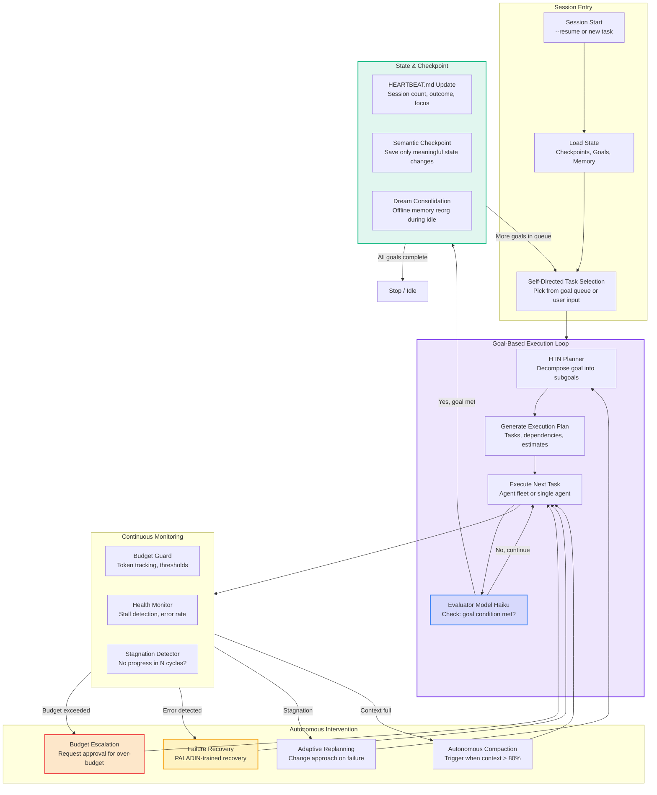
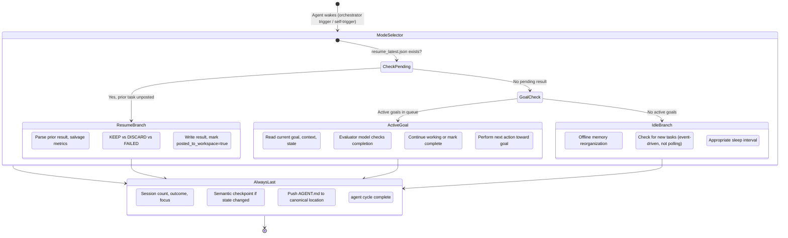
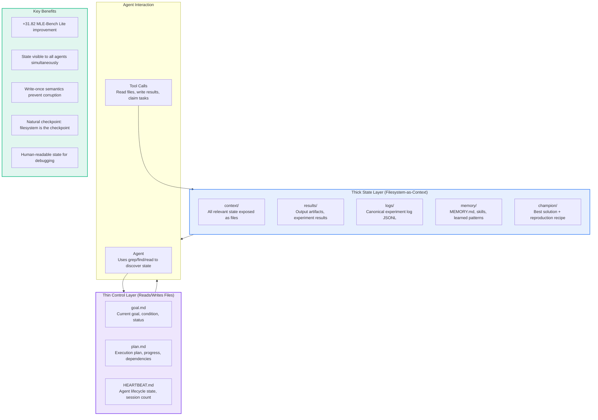

# PLAN-4.13: Full Autonomy System Enhancement

**Status:** Proposed  
**Date:** 2026-05-30  
**Version:** 1.0  
**Target Effort:** 8-10 weeks  
**Priority:** CRITICAL (S-Tier Autonomous Operation)

---

## Executive Summary

This plan defines a comprehensive full autonomy system for Lyra that enables continuous, self-directed, goal-driven operation with automatic failure recovery, budget awareness, idle efficiency, and task resumption. Drawing from Claude Code's goal system (separate evaluator model), the continuous-claude pattern, AutoScientists' HEARTBEAT.md protocol, PALADIN failure recovery, and the File-as-Bus state management pattern, the architecture enables Lyra to operate for hours or days without human intervention while maintaining safety guardrails and cost controls.

---

## 1. What Lyra Already Has

Based on the existing architecture and design documents:

| Component | Status | Source |
|-----------|--------|--------|
| HTN Planner with LLM heuristics (goal decomposition, plan validation, adaptive replanning) | Designed | `docs/architecture/autonomy-system.md` |
| Semantic checkpointing (75% overhead reduction target) | Designed | `docs/architecture/autonomy-system.md` |
| Risk assessment engine (destructive pattern detection, escalation policies) | Designed | `docs/architecture/autonomy-system.md` |
| Multi-session coordinator (state sharing, task handoffs) | Designed | `docs/architecture/autonomy-system.md` |
| Intelligent hooks system (pre-tool, post-tool, error recovery) | Designed | `docs/architecture/autonomy-system.md` |
| Autopilot agent implementation | Implemented | `packages/lyra-agent-swarm` |
| Agent lifecycle management | Partial | Existing packages |
| Task resumption support | Partial | Existing packages |

**Gap:** The autonomy system exists primarily as a design document. The core continuous autonomous loop, goal-based execution with separate evaluator, File-as-Bus state management, PALADIN recovery training, HEARTBEAT.md protocol, and budget awareness are not implemented as production code.

---

## 2. What Research Reveals as Missing

| Technique | Source | Status | Action |
|-----------|--------|--------|--------|
| **Continuous autonomous loop** with self-directed task selection | Stream-1 §3 (Goal System), GAP §7 | NOT FULLY IMPLEMENTED | Full continuous-claude pattern |
| **Separate evaluator model** (Haiku validates expensive model output) | Stream-1 §3 (Goal System) | NOT IMPLEMENTED | Cheap model completion checking |
| **File-as-Bus pattern** (thin control over thick state, +31.82 MLE-Bench Lite) | `arXiv:2604.13018` (GAP §7) | NOT IMPLEMENTED | Filesystem-based state management |
| **PALADIN failure recovery** (systematic failure injection training, 89.7% recovery) | AAAI 2026 (GAP §7) | NOT IMPLEMENTED | Failure injection + recovery training |
| **HEARTBEAT.md protocol** (authoritative over agent memory, prevents protocol decay) | AutoScientists (Stream-6 §2.2) | NOT IMPLEMENTED | Universal agent lifecycle protocol |
| **Idle loop efficiency** (<5% token waste on polling) | Research synthesis (GAP §7) | NOT IMPLEMENTED | Event-driven wake instead of polling |
| **Autonomous compaction trigger** (agent decides when to compact) | `arXiv:2601.07190` (GAP §1) | NOT IMPLEMENTED | Context-aware compaction decision |
| **Task resumption after crash** (last checkpoint recovery) | Stream-11 §A.4 | DESIGNED, NOT BUILT | Resume from exact failure point |
| **Budget awareness with escalation** (never exceeds without approval) | Stream-11 §A.5 | NOT IMPLEMENTED | Token budget with approval gates |
| **Dream consolidation during idle** (offline memory reorganization) | Stream-4 (MemAgent Workshop), GAP §7 | DESIGNED, NOT BUILT | Sleep-phase memory consolidation |

---

## 3. Proposed Enhancements (Ranked by Impact x Effort)

| # | Enhancement | Impact | Effort | Score | Phase |
|---|-------------|--------|--------|-------|-------|
| 1 | Continuous autonomous loop with goal-based execution | CRITICAL | High | **P0** | 1 |
| 2 | Separate evaluator model (Haiku for completion checking) | CRITICAL | Low | **P0** | 1 |
| 3 | HEARTBEAT.md protocol (authoritative agent lifecycle) | CRITICAL | Medium | **P0** | 1 |
| 4 | File-as-Bus state management pattern | HIGH | Medium | **P0** | 2 |
| 5 | PALADIN failure recovery training | HIGH | High | **P1** | 3 |
| 6 | Budget awareness with escalation gates | HIGH | Medium | **P1** | 2 |
| 7 | Task resumption after crash (checkpoint recovery) | HIGH | Medium | **P1** | 2 |
| 8 | Idle loop efficiency (<5% token waste) | MEDIUM | Low | **P1** | 2 |
| 9 | Autonomous compaction trigger | MEDIUM | Medium | **P2** | 3 |
| 10 | Dream consolidation during idle | MEDIUM | High | **P2** | 3 |

---

## 4. Architecture

### 4.1 Continuous Autonomous Loop



### 4.2 HEARTBEAT.md Protocol (Mode Selector)



### 4.3 File-as-Bus State Management Pattern



### 4.4 PALADIN Failure Recovery Training

```mermaid
flowchart TD
    subgraph FailureInjection["Systematic Failure Injection"]
        FI1[Network timeout during API call]
        FI2[File system error during write]
        FI3[Context overflow mid-task]
        FI4[Subprocess crash during shell execution]
        FI5[Concurrent modification conflict]
        FI6[Authentication token expiry]
        FI7[Rate limit exceeded]
        FI8[Partial state corruption]
    end

    subgraph RecoveryTraining["PALADIN Recovery Training"]
        RT1[Detect failure type from error signature]
        RT2[Select recovery strategy<br/>Retry / Rollback / Alternative / Escalate]
        RT3[Execute recovery with verification]
        RT4[Log recovery outcome for future learning]
    end

    subgraph RecoveryStrategies["Recovery Strategy Catalog"]
        RS1[Exponential backoff retry<br/>1s → 2s → 4s → 8s → 16s → escalate]
        RS2[State rollback to last checkpoint]
        RS3[Alternative approach selection<br/>Try different tool/method]
        RS4[Graceful degradation<br/>Skip non-critical subtask]
        RS5[Human escalation with structured context]
        RS6[Idempotent replay<br/>Re-execute safely replayable steps]
    end

    FailureInjection --> RecoveryTraining
    RecoveryTraining --> RecoveryStrategies
    RecoveryStrategies -->|89.7% recovery rate target| VERIFY[Verification<br/>Task completed successfully?]

    style FailureInjection fill:#ef444420,stroke:#ef4444,stroke-width:2px
    style RecoveryStrategies fill:#f59e0b20,stroke:#f59e0b,stroke-width:2px
    style VERIFY fill:#10b98120,stroke:#10b981,stroke-width:2px
```



---

## 5. Key Component Interfaces (Python dataclasses)

### 5.1 Goal-Based Autonomous Loop

```python
from dataclasses import dataclass, field
from typing import List, Dict, Optional, Callable
from datetime import datetime, timedelta
from enum import Enum

class GoalStatus(Enum):
    PENDING = "pending"
    IN_PROGRESS = "in_progress"
    COMPLETED = "completed"
    FAILED = "failed"
    BLOCKED = "blocked"          # Waiting for external input
    ESCALATED = "escalated"      # Needs human approval

@dataclass
class Goal:
    """A goal for the autonomous execution loop."""
    goal_id: str
    description: str             # Natural language goal description
    completion_condition: str    # Up to 4000 chars, measurable end state
    priority: int = 0            # Higher = more urgent
    status: GoalStatus = GoalStatus.PENDING
    subgoals: List['Goal'] = field(default_factory=list)
    estimated_tokens: int = 0
    actual_tokens: int = 0
    max_tokens: int = 100000     # Budget cap for this goal
    created_at: datetime = field(default_factory=datetime.utcnow)
    started_at: Optional[datetime] = None
    completed_at: Optional[datetime] = None
    turn_count: int = 0
    last_evaluator_reason: str = ""
    parent_goal_id: Optional[str] = None

@dataclass
class EvaluatorCheck:
    """Result from the separate evaluator model checking goal completion."""
    goal_met: bool
    reason: str                  # Why the evaluator thinks goal is met/not met
    confidence: float            # 0.0 - 1.0
    model_used: str              # "haiku" (for cost efficiency)
    tokens_consumed: int
    timestamp: datetime = field(default_factory=datetime.utcnow)

@dataclass
class AutonomousLoopConfig:
    """Configuration for the continuous autonomous loop."""
    max_consecutive_turns: int = 100
    max_total_tokens: int = 1000000
    idle_sleep_seconds: int = 30
    evaluator_model: str = "haiku"  # Cheap model for completion checking
    executor_model: str = "sonnet"  # Main model for actual work
    auto_compact_threshold: float = 0.8  # Compact when context > 80% full
    checkpoint_frequency: int = 5       # Save state every N turns
    budget_warning_threshold: float = 0.8
    budget_stop_threshold: float = 0.95
    require_approval_above_tokens: int = 500000

@dataclass
class AutonomousLoop:
    """Main continuous autonomous execution loop.

    Source: Claude Code Goal System (Stream-1 §3) — separate evaluator model
    pattern, session-scoped goals, resume support.
    Source: continuous-claude (GAP §7) — persist, resume, self-direct.
    """
    config: AutonomousLoopConfig
    goals: List[Goal] = field(default_factory=list)
    current_goal: Optional[Goal] = None
    turn_count: int = 0
    total_tokens: int = 0

    async def run(self) -> None:
        """Main autonomous loop. Runs until goals exhausted or budget exceeded."""
        while self.goals and self._within_budget():
            self.current_goal = self._select_next_goal()
            self.current_goal.status = GoalStatus.IN_PROGRESS

            while True:
                # 1. Execute one turn
                await self._execute_turn()

                # 2. Evaluate completion with cheap model
                check = await self._evaluate_completion()

                # 3. Record evaluator feedback
                self.current_goal.last_evaluator_reason = check.reason

                if check.goal_met:
                    self.current_goal.status = GoalStatus.COMPLETED
                    break

                # 4. Check for intervention needs
                if await self._needs_compaction():
                    await self._trigger_compaction()

                if await self._detect_stagnation():
                    await self._replan()

                # 5. Periodic checkpoint
                if self.turn_count % self.config.checkpoint_frequency == 0:
                    await self._checkpoint()

            await self._on_goal_complete(self.current_goal)

        # Idle: dream consolidation if no active goals
        if not self.goals:
            await self._enter_idle()

    async def _evaluate_completion(self) -> EvaluatorCheck:
        """Use Haiku (cheap model) to check if goal is met."""
        ...

    async def _enter_idle(self) -> None:
        """Event-driven idle mode with dream consolidation.
        Wakes on: new task, hook event, schedule trigger.
        NOT polling — uses event-driven wake.
        Token waste: <5% of active usage.
        """
        ...
```

### 5.2 HEARTBEAT.md Protocol

```python
from dataclasses import dataclass, field
from typing import List, Optional, Dict, Any
from datetime import datetime
from enum import Enum

class HeartbeatBranch(Enum):
    """The five branches of the HEARTBEAT protocol."""
    RESUME = "resume"               # Prior task unposted, rehydrate and post
    ACTIVE_GOAL = "active_goal"     # Active goal, execute next turn
    IDLE = "idle"                   # No active goals, consolidate or wait
    DISCUSSION = "discussion"       # Multi-agent discussion phase (swarm only)
    ALWAYS_LAST = "always_last"     # State update, checkpoint, promise tag

@dataclass
class HeartbeatState:
    """Agent state tracked by the HEARTBEAT protocol.

    HEARTBEAT.md is AUTHORITATIVE over agent memory.
    Procedural memories that conflict with the heartbeat MUST be deleted.
    This prevents protocol decay over long autonomous runs.

    Source: AutoScientists (Stream-6 §2.2) — 5-branch mode selector,
    authoritative over agent memory.
    """
    agent_id: str
    session_count: int = 0
    total_turns: int = 0
    total_tokens: int = 0
    current_branch: HeartbeatBranch = HeartbeatBranch.IDLE
    current_goal_id: Optional[str] = None
    last_action: str = "none"
    last_outcome: str = "none"
    focus_area: str = ""
    errors_this_session: int = 0
    consecutive_errors: int = 0
    last_checkpoint_time: Optional[datetime] = None
    pending_result: bool = False   # Is there an unposted result?
    promise_received: bool = False # Was <promise> tag received?

    def to_markdown(self) -> str:
        """Serialize to HEARTBEAT.md format."""
        ...

    @classmethod
    def from_markdown(cls, content: str) -> 'HeartbeatState':
        """Parse from HEARTBEAT.md file.
        Conflicts with stored memory files → HEARTBEAT wins.
        """
        ...

    def is_authoritative_over(self, memory_entry: Dict) -> bool:
        """Check if HEARTBEAT overrides a memory entry.
        Procedural memories conflicting with this protocol must be deleted.
        """
        ...
```

### 5.3 File-as-Bus State Manager

```python
from dataclasses import dataclass, field
from pathlib import Path
from typing import List, Dict, Optional, Any
from datetime import datetime
import json

@dataclass
class FileBusState:
    """Filesystem-as-context state management.

    Source: arXiv:2604.13018 (GAP §7) — File-as-Bus pattern:
    thin control over thick state, +31.82 MLE-Bench Lite.

    All state is exposed as files. Agents use grep/find/read to discover
    state. This enables:
    - Multi-agent visibility (all agents read the same files)
    - Write-once semantics (immutable experiment log)
    - Natural checkpointing (filesystem = checkpoint)
    - Human debuggability (cat any file to understand state)
    """
    workspace_root: Path

    # Control files (thin layer — ~10KB total)
    goal_file: Path       # goal.md — current goal, condition, status
    plan_file: Path       # plan.md — execution plan, progress, dependencies
    heartbeat_file: Path  # HEARTBEAT.md — agent lifecycle state

    # State files (thick layer — can be 100MB+ per run)
    context_dir: Path     # context/ — all relevant state as files
    results_dir: Path     # results/ — output artifacts
    logs_dir: Path        # logs/ — canonical experiment log JSONL
    champion_dir: Path    # champion/ — best solution + reproduction

    def initialize(self, goal: 'Goal') -> None:
        """Initialize filesystem state for a new goal."""
        self.workspace_root.mkdir(parents=True, exist_ok=True)
        self.context_dir.mkdir(exist_ok=True)
        self.results_dir.mkdir(exist_ok=True)
        self.logs_dir.mkdir(exist_ok=True)
        self.champion_dir.mkdir(exist_ok=True)

        # Write control files
        self.goal_file.write_text(self._format_goal(goal))
        self.plan_file.write_text("# Plan\n\nPending...")
        self.heartbeat_file.write_text("# HEARTBEAT\n\nSession 1, Turn 0")

    def write_result(self, exp_id: str, result: Dict, outcome: str) -> None:
        """Write an experiment result with write-once semantics.
        Results are NEVER overwritten — append-only.
        """
        result_file = self.results_dir / f"{exp_id}.md"
        if result_file.exists():
            raise FileExistsError(f"Result {exp_id} already exists — write-once semantics")

        # Write per-experiment result
        result_content = self._format_result(exp_id, result, outcome)
        result_file.write_text(result_content)

        # Append to canonical experiment log
        log_entry = {
            "exp_id": exp_id,
            "timestamp": datetime.utcnow().isoformat(),
            "outcome": outcome,
            **result
        }
        with open(self.logs_dir / "experiments.jsonl", "a") as f:
            f.write(json.dumps(log_entry) + "\n")

    def discover_state(self, agent_role: str) -> Dict[str, Any]:
        """Agent discovers state by reading files (no direct API).
        This is the key File-as-Bus pattern:
        Agent uses grep/find/read to discover what it needs.
        """
        ...
```

### 5.4 PALADIN Recovery Engine

```python
from dataclasses import dataclass, field
from typing import List, Dict, Optional, Callable, Any
from enum import Enum

class FailureType(Enum):
    NETWORK_TIMEOUT = "network_timeout"
    FILE_SYSTEM_ERROR = "file_system_error"
    CONTEXT_OVERFLOW = "context_overflow"
    SUBPROCESS_CRASH = "subprocess_crash"
    CONCURRENT_CONFLICT = "concurrent_conflict"
    AUTH_EXPIRY = "auth_expiry"
    RATE_LIMIT = "rate_limit"
    STATE_CORRUPTION = "state_corruption"
    UNKNOWN = "unknown"

class RecoveryAction(Enum):
    RETRY_BACKOFF = "retry_backoff"
    ROLLBACK_CHECKPOINT = "rollback_checkpoint"
    ALTERNATIVE_APPROACH = "alternative_approach"
    GRACEFUL_DEGRADATION = "graceful_degradation"
    HUMAN_ESCALATION = "human_escalation"
    IDEMPOTENT_REPLAY = "idempotent_replay"

@dataclass
class FailureSignature:
    """Detected failure to recover from."""
    failure_type: FailureType
    error_message: str
    tool_name: str
    args_preview: str
    attempt_number: int
    timestamp: datetime

@dataclass
class RecoveryAttempt:
    """A recovery attempt with outcome tracking."""
    signature: FailureSignature
    action: RecoveryAction
    success: bool
    recovery_time_ms: int
    tokens_consumed: int
    learned_from: bool = False  # Was this recovery incorporated into training?

@dataclass
class PaladinRecoveryEngine:
    """Systematic failure recovery with injection-based training.

    Source: PALADIN (AAAI 2026) — systematic failure injection training,
    achieves 89.7% recovery rate.

    Key principle: Train on injected failures during development
    so the agent handles real failures in production.
    """
    strategy_map: Dict[FailureType, List[RecoveryAction]] = field(default_factory=dict)
    recovery_history: List[RecoveryAttempt] = field(default_factory=list)
    recovery_success_rate: Dict[FailureType, float] = field(default_factory=dict)

    def __post_init__(self):
        # Default strategy mapping (PALADIN baseline)
        self.strategy_map = {
            FailureType.NETWORK_TIMEOUT: [
                RecoveryAction.RETRY_BACKOFF,
                RecoveryAction.ALTERNATIVE_APPROACH,
                RecoveryAction.HUMAN_ESCALATION
            ],
            FailureType.FILE_SYSTEM_ERROR: [
                RecoveryAction.RETRY_BACKOFF,
                RecoveryAction.ROLLBACK_CHECKPOINT,
                RecoveryAction.HUMAN_ESCALATION
            ],
            FailureType.CONTEXT_OVERFLOW: [
                RecoveryAction.ROLLBACK_CHECKPOINT,
                RecoveryAction.GRACEFUL_DEGRADATION,
            ],
            FailureType.AUTH_EXPIRY: [
                RecoveryAction.RETRY_BACKOFF,
                RecoveryAction.HUMAN_ESCALATION
            ],
            FailureType.RATE_LIMIT: [
                RecoveryAction.RETRY_BACKOFF,
                RecoveryAction.ALTERNATIVE_APPROACH,
            ],
            FailureType.STATE_CORRUPTION: [
                RecoveryAction.ROLLBACK_CHECKPOINT,
                RecoveryAction.HUMAN_ESCALATION
            ],
        }

    def classify_failure(self, error: Exception, context: Dict) -> FailureSignature:
        """Classify failure type from error signature and context."""
        ...

    def select_recovery(self, signature: FailureSignature) -> RecoveryAction:
        """Select best recovery action based on failure type + history.
        Uses Thompson Sampling to balance exploration vs exploitation.
        """
        ...

    async def execute_recovery(self, signature: FailureSignature,
                               action: RecoveryAction) -> RecoveryAttempt:
        """Execute a recovery action and track outcome."""
        ...

    def inject_failure(self, failure_type: FailureType) -> None:
        """Inject a failure during training/evaluation.
        Used during PALADIN training to build recovery capability.
        """
        ...

    def train_recovery(self, scenarios: List[FailureType]) -> Dict[FailureType, float]:
        """Run PALADIN training across failure scenarios.
        Returns recovery success rate per failure type.
        Target: 89.7% overall.
        """
        ...
```

---

## 6. Implementation Phases

### Phase 1: Core Autonomous Loop (Weeks 1-3)

**Goal:** Continuous autonomous loop with goal-based execution and evaluator model.

| Task | Description | Effort | Tests |
|------|-------------|--------|-------|
| 1.1 | Implement `Goal` and `AutonomousLoop` classes with goal queuing | 3 days | 20 unit |
| 1.2 | Implement separate evaluator model (Haiku) for completion checking | 2 days | 15 unit |
| 1.3 | Implement goal decomposition with HTN planner integration | 2 days | 15 unit |
| 1.4 | Implement turn counter, token tracking, status display | 1 day | 10 unit |
| 1.5 | Implement HEARTBEAT.md protocol with 5-branch mode selector | 3 days | 20 unit |
| 1.6 | Implement HEARTBEAT authority over agent memory (conflict resolution) | 2 days | 15 unit |
| 1.7 | Implement session resume support (--resume flag, goal restoration) | 2 days | 10 integration |

**Deliverable:** Continuous autonomous loop with goal-based execution, evaluator, heartbeat protocol.

### Phase 2: State Management & Budget (Weeks 4-6)

**Goal:** File-as-Bus pattern, budget awareness, checkpoint recovery.

| Task | Description | Effort | Tests |
|------|-------------|--------|-------|
| 2.1 | Implement File-as-Bus state manager (workspace structure, write-once semantics) | 3 days | 15 unit |
| 2.2 | Implement filesystem-as-context discovery (agents use grep/find/read) | 2 days | 10 unit |
| 2.3 | Implement budget guard with 80%/95% warning/stop thresholds | 2 days | 10 unit |
| 2.4 | Implement budget escalation request (never exceeds without approval) | 2 days | 10 unit |
| 2.5 | Implement semantic checkpointing (save only meaningful state changes, 75% overhead reduction) | 3 days | 15 unit |
| 2.6 | Implement task resumption after crash (last checkpoint recovery) | 2 days | 15 recovery |
| 2.7 | Implement idle loop efficiency (event-driven wake, <5% token waste) | 2 days | 10 unit |

**Deliverable:** File-as-Bus state, budget controls, checkpoint recovery, efficient idle.

### Phase 3: Recovery & Intelligence (Weeks 7-9)

**Goal:** PALADIN recovery, autonomous compaction, dream consolidation.

| Task | Description | Effort | Tests |
|------|-------------|--------|-------|
| 3.1 | Implement failure classification from error signatures (8 failure types) | 2 days | 15 unit |
| 3.2 | Implement PALADIN recovery strategy selection (Thompson Sampling) | 3 days | 15 unit |
| 3.3 | Implement PALADIN recovery execution with outcome tracking | 3 days | 15 unit |
| 3.4 | Implement PALADIN failure injection training harness | 2 days | 10 unit |
| 3.5 | Train recovery across 8 failure scenarios (target 89.7% recovery rate) | 2 days | N/A |
| 3.6 | Implement autonomous compaction trigger (agent decides, not threshold) | 2 days | 10 unit |
| 3.7 | Implement dream consolidation during idle (offline memory reorganization) | 2 days | 10 unit |

**Deliverable:** PALADIN-trained recovery engine, autonomous compaction, dream consolidation.

### Phase 4: Integration (Week 10)

**Goal:** End-to-end testing with real tasks, hardening.

| Task | Description | Effort | Tests |
|------|-------------|--------|-------|
| 4.1 | End-to-end autonomous run (multi-hour task with injected failures) | 2 days | 5 E2E |
| 4.2 | Budget escalation testing (verify approval gate works) | 1 day | 5 E2E |
| 4.3 | Crash recovery testing (kill process mid-task, verify resume) | 2 days | 10 recovery |
| 4.4 | Integrate with Lyra CLI (`/goal` command, `lyra resume`) | 2 days | 10 integration |
| 4.5 | Documentation: autonomous mode guide, HEARTBEAT.md reference | 2 days | N/A |

**Deliverable:** Production-hardened autonomous system with validated recovery and budget controls.

---

## 7. Configuration Schema

```json
{
  "autonomy": {
    "enabled": true,
    "evaluator_model": "haiku",
    "executor_model": "sonnet",
    "max_consecutive_turns": 100,
    "max_total_tokens": 1000000,
    "idle_sleep_seconds": 30,
    "auto_compact_threshold": 0.8,
    "checkpoint_frequency": 5,
    "heartbeat": {
      "enabled": true,
      "authoritative_over_memory": true,
      "mirror_to_workspace": true
    },
    "file_bus": {
      "enabled": true,
      "workspace_root": ".lyra/autonomy",
      "write_once_results": true
    },
    "budget": {
      "warning_threshold": 0.8,
      "stop_threshold": 0.95,
      "require_approval_above_tokens": 500000,
      "escalation_message": "Goal requires additional tokens beyond budget."
    },
    "recovery": {
      "enabled": true,
      "max_retries_per_failure": 3,
      "backoff_base_seconds": 1,
      "backoff_max_seconds": 300,
      "paladin_trained": false
    },
    "idle": {
      "dream_consolidation_enabled": true,
      "event_driven_wake": true,
      "max_idle_polling_tokens_per_hour": 100
    }
  }
}
```

---

## 8. Key Metrics & Success Criteria

| Metric | Target | Measurement |
|--------|--------|-------------|
| Goal completion rate (autonomous) | >90% on defined goals | Test suite of 50 goals |
| Evaluator accuracy (completion check) | >95% agreement with human judgment | Labeled completion dataset |
| Recovery rate after injected failures | >89.7% (PALADIN baseline) | Failure injection test suite |
| Token waste during idle | <5% of active usage | Idle monitoring benchmark |
| Checkpoint overhead reduction | >70% (vs full state serialization) | Semantic diff measurement |
| Crash recovery success | 100% (no partial state) | 100 random crash-injection tests |
| Budget escalation accuracy | Stop within 2% of limit | Budget exhaustion test |
| HEARTBEAT.md protocol adherence | 0 protocol violations after 1000 turns | Long-run protocol check |

---

## 9. Integration Points

### 9.1 With Swarm/Fleet

- Autonomous loop dispatches goals to swarm when parallelism is beneficial
- HEARTBEAT.md protocol extended to all swarm agents
- Checkpoint recovery coordinates with swarm checkpoint system (PLAN-4.12)
- File-as-Bus state shared across all agents in the fleet

### 9.2 With Safety Architecture

- Evaluator model runs in separate context (cannot execute tools) — Parallax Layer 1
- Budget escalation gates require permission mode check (Layer 2)
- Recovery actions verified by behavioral monitor before execution (Layer 4)
- Dream consolidation runs in isolated sandbox

### 9.3 With Memory System

- Dream consolidation feeds into Lyra's 7-tier memory system
- File-as-Bus results feed into episodic and semantic memory
- HEARTBEAT.md state updates procedural memory
- Checkpoint state stored in persistent memory tier

---

## 10. References

| Source | Link / Location | Key Contribution |
|--------|----------------|------------------|
| Claude Code Goal System | `docs/research/STREAM-1-CLAUDE-CODE-DOCS.md` §3 | Separate evaluator model, condition-as-directive, session-scoped goals, resume support |
| AutoScientists HEARTBEAT.md | `docs/research/STREAM-6-AUTOSCIENTISTS.md` §2.2 | 5-branch mode selector, authoritative over agent memory, prevents protocol decay |
| File-as-Bus Pattern | `arXiv:2604.13018` (GAP §7) | Thin control over thick state, +31.82 MLE-Bench Lite |
| PALADIN Failure Recovery | AAAI 2026 (GAP §7) | Systematic failure injection training, 89.7% recovery rate |
| Continuous-Claude Pattern | Stream-11 §A.2, GAP §7 | Persist, resume, self-direct, handle interruptions |
| Lyra Autonomy System Design | `docs/architecture/autonomy-system.md` | HTN planning, semantic checkpointing, risk assessment, multi-session coordinator |
| Focus Agent Compaction | `arXiv:2601.07190` (GAP §1) | Agent decides when to compact, not fixed thresholds |
| Dream Consolidation | Stream-4 (MemAgent Workshop), GAP §7 | Sleep-phase memory reorganization during idle |
| Dynamic Workflows Checkpointing | Stream-11 §A.4 | Incremental checkpointing, state snapshot, partial result streaming |
| MemAgent Survey (Stream-4) | `docs/research/STREAM-4-MEMAGENT-MEMORY-ARCHITECTURE.md` | Storage → Reflection → Experience evolution, memory as first-class primitive |
| Gap Analysis (§7 Full Autonomy) | `docs/research/GAP-ANALYSIS-2026-05-30.md` §7 | Identified autonomy gaps and priorities |

---

**Next Steps:**
1. Implement core autonomous loop with evaluator model (Phase 1, Week 1)
2. Implement HEARTBEAT.md protocol as universal agent lifecycle (Phase 1, Week 2-3)
3. Implement File-as-Bus state management (Phase 2, Week 4-5)
4. Implement PALADIN recovery engine (Phase 3, Week 7-8)
