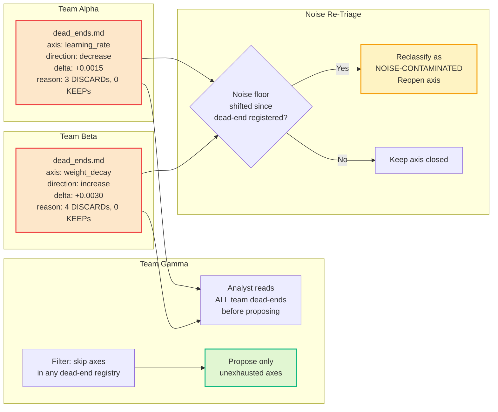

# PLAN-4.14: Deep Research Engine Enhancement

**Status:** Proposed  
**Date:** 2026-05-30  
**Version:** 1.0  
**Target Effort:** 10-12 weeks  
**Priority:** HIGH (A-Tier Research Capability)

---

## Executive Summary

This plan defines a comprehensive deep research engine for Lyra that goes beyond the current multi-hop search design to implement a fully autonomous research loop inspired by AutoScientists. The architecture supports hypothesis generation with proposal gates, critique-before-spend validation, dead-end registries with cross-team visibility, noise-aware champion validation, post-breakthrough inductive reasoning, source credibility scoring, research strategy auto-selection, canonical JSONL experiment logging, and structured research artifact management. The research engine enables Lyra to conduct autonomous scientific discovery with the same rigor as multi-agent research teams.

---

## 1. What Lyra Already Has

Based on the existing architecture:

| Component | Status | Source |
|-----------|--------|--------|
| Multi-hop reasoning engine (iterative query refinement, 3-5 hops) | Designed | `docs/architecture/research-engine-architecture.md` |
| Knowledge graph construction (entity-relationship, query/concept/reference nodes) | Designed | `docs/architecture/research-engine-architecture.md` |
| Source credibility scoring (5 dimensions: authority, recency, citations, methodology, relevance) | Designed | `docs/architecture/research-engine-architecture.md` |
| Evidence synthesis (aggregation, contradiction detection) | Designed | `docs/architecture/research-engine-architecture.md` |
| Citation management (provenance tracking, traversal) | Designed | `docs/architecture/research-engine-architecture.md` |
| Research strategy selection (breadth-first, depth-first, iterative, comparative, exploratory) | Designed | `docs/architecture/research-engine-architecture.md` |
| Research cache and cross-session history | Designed | `docs/architecture/research-engine-architecture.md` |
| RESEARCH-ENGINE-V2 architecture doc | Designed | `docs/architecture/RESEARCH-ENGINE-V2.md` |

**Gap:** The research engine is well-designed but exists primarily as architecture documentation. The AutoScientists-style autonomous research loop (Hypothesis → Proposal Gate → Execute → Log → Champion), critique-before-spend, dead-end registry, noise-aware validation, and post-KEEP inductive reasoning are not integrated.

---

## 2. What Research Reveals as Missing

| Technique | Source | Status | Action |
|-----------|--------|--------|--------|
| **AutoScientists-style autonomous research loop** (Hypothesis → Proposal Gate → Execute → Log → Champion) | AutoScientists (Stream-6 §6) | NOT INTEGRATED | Full research cycle with hypothesis tracking |
| **Critique-before-spend gate** (proposal requires >=1 peer comment before execution) | AutoScientists (Stream-6 §5) | NOT IMPLEMENTED | Proposal gate with peer review |
| **Dead-end registry** with cross-team visibility | AutoScientists (Stream-6 §7.1) | NOT IMPLEMENTED | Structured failure tracking |
| **Noise-aware champion validation** (multi-seed gate, 2-sigma margin) | AutoScientists (Stream-6 §7.3) | NOT IMPLEMENTED | Statistical champion promotion |
| **Post-KEEP inductive reasoning** (analyze mechanism after breakthrough) | AutoScientists (Stream-6 §6.2) | NOT IMPLEMENTED | Breakthrough exploitation protocol |
| **Canonical JSONL experiment logging** (write-once, append-only) | AutoScientists (Stream-6 §4.2) | NOT IMPLEMENTED | Immutable experiment log |
| **Research artifact management** with structured metadata | AutoScientists (Stream-6 §4.3) | NOT IMPLEMENTED | Per-experiment results with provenance |
| **Falsifiable hypothesis tracking** (prediction, falsification criteria, age) | AutoScientists (Stream-6 §6.1) | NOT IMPLEMENTED | Strategy.md with hypothesis lifecycle |
| **Research strategy auto-selection** (breadth-first vs depth-first based on task) | Research synthesis | PARTIAL (manual selection) | Automated strategy classifier |
| **Cold numeric axis bracket rule** (3-value bracket for unexplored continuous params) | AutoScientists (Stream-6 §6.4) | NOT IMPLEMENTED | Exploration heuristic for continuous search |

---

## 3. Proposed Enhancements (Ranked by Impact x Effort)

| # | Enhancement | Impact | Effort | Score | Phase |
|---|-------------|--------|--------|-------|-------|
| 1 | AutoScientists-style autonomous research loop | CRITICAL | High | **P0** | 1 |
| 2 | Critique-before-spend proposal gate | CRITICAL | Medium | **P0** | 1 |
| 3 | Dead-end registry with cross-team visibility | HIGH | Low | **P0** | 1 |
| 4 | Canonical JSONL experiment logging | HIGH | Low | **P0** | 1 |
| 5 | Noise-aware champion validation | HIGH | Medium | **P1** | 2 |
| 6 | Falsifiable hypothesis tracking | HIGH | Low | **P1** | 2 |
| 7 | Post-KEEP inductive reasoning protocol | HIGH | Low | **P1** | 2 |
| 8 | Research strategy auto-selection | MEDIUM | Medium | **P1** | 3 |
| 9 | Research artifact management with structured metadata | MEDIUM | Medium | **P2** | 3 |
| 10 | Cold numeric axis bracket rule | LOW | Low | **P2** | 3 |

---

## 4. Architecture

### 4.1 Autonomous Research Loop (AutoScientists-Inspired)

```mermaid
flowchart TD
    subgraph TaskDefinition["Research Task Definition"]
        TASK[TASK.md<br/>Problem, Objective Metric, Constraints]
        PROFILE[task-profile.md<br/>13 Hooks: dispatch, champion, stagnation, exit]
    end

    subgraph ResearchCycle["Autonomous Research Cycle"]
        direction TB

        ORIENT[Orient Phase<br/>Read champion, experiment log, dead-ends<br/>Extract ALL numeric constants]
        HYPOTHESIZE[Hypothesize Phase<br/>Generate falsifiable hypothesis<br/>With prediction and falsification criteria]
        PROPOSE[Propose Phase<br/>Post [PROPOSAL] with exact code/text diff<br/>At least 1 bold-move per cycle]
        GATE[Critique-Before-Spend Gate<br/>>=1 non-author peer comment required<br/>Auto-clear: 15-min timeout or queue-starvation]
        EXECUTE[Execute Phase<br/>Claim → dedup → apply diff → run → evaluate]
        CLASSIFY[Classify Outcome<br/>KEEP / DISCARD / FAILED / NEAR-MISS]
        CHAMPION[Champion Update<br/>Noise-gated promotion<br/>Multi-seed validation at 2-sigma margin]
        LOG[Canonical Logging<br/>Write-once JSONL append<br/>Per-experiment result artifact]
    end

    subgraph CrossCutting["Cross-Cutting Intelligence"]
        DEAD_ENDS[Dead-End Registry<br/>3+ DISCARDs, 0 KEEPs = dead end<br/>Cross-team readable<br/>Noise-contamination re-triage]
        POST_KEEP[Post-KEEP Inductive Reasoning<br/>What mechanism worked?<br/>3-5 untried related changes<br/>At least 1 follow-up via different mechanism]
        STRATEGY[Strategy Revision<br/>Hypothesis falsification detection<br/>Axis exhaustion detection<br/>Stagnation trigger]
    end

    TASK --> ResearchCycle
    ORIENT --> HYPOTHESIZE
    HYPOTHESIZE --> PROPOSE
    PROPOSE --> GATE
    GATE --> EXECUTE
    EXECUTE --> CLASSIFY
    CLASSIFY --> CHAMPION
    CHAMPION --> LOG
    LOG --> ORIENT

    CLASSIFY --> DEAD_ENDS
    CHAMPION --> POST_KEEP
    DEAD_ENDS --> ORIENT
    POST_KEEP --> HYPOTHESIZE
    STRATEGY --> ORIENT

    style ResearchCycle fill:#7c3aed20,stroke:#7c3aed,stroke-width:2px
    style GATE fill:#ef444420,stroke:#ef4444,stroke-width:2px
    style CHAMPION fill:#f59e0b20,stroke:#f59e0b,stroke-width:2px
    style LOG fill:#10b98120,stroke:#10b981,stroke-width:2px
```

### 4.2 Critique-Before-Spend Gate

```mermaid
flowchart TD
    PROPOSAL[Analyst posts [PROPOSAL]<br/>Hypothesis + exact diff + expected effect]

    GATE_START{Gate Check}

    GATE_START --> PEER_REVIEW{>=1 non-author<br/>peer comment?}
    GATE_START --> TIMEOUT{15 minutes<br/>elapsed?}
    GATE_START --> STARVATION{Queue empty<br/>queue-starvation escape?}

    PEER_REVIEW -->|Yes| ENTER_QUEUE[Enter queue.md pending list<br/>with axis/direction/value tags]
    PEER_REVIEW -->|No| WAIT[Wait in proposal forum]

    TIMEOUT -->|Yes| ENTER_QUEUE
    TIMEOUT -->|No| WAIT

    STARVATION -->|Yes| ENTER_QUEUE
    STARVATION -->|No| WAIT

    WAIT --> GATE_START

    ENTER_QUEUE --> RANK[Rank in queue by priority:<br/>1. Consensus-breaking tier<br/>2. Cold axis exploration<br/>3. High mean |Δ| axes<br/>4. Noise-band proposals]

    RANK --> CLAIM[GPU/Exec agent claims<br/>If-Match atomic PUT]

    style PEER_REVIEW fill:#3b82f620,stroke:#3b82f6,stroke-width:2px
    style ENTER_QUEUE fill:#10b98120,stroke:#10b981,stroke-width:2px
    style WAIT fill:#f59e0b20,stroke:#f59e0b,stroke-width:2px
```

### 4.3 Noise-Aware Champion Validation

```mermaid
flowchart TD
    RESULT[New experiment result<br/>metric against current champion]

    COMPARE{Compare: |Δ| vs noise floor}

    COMPARE -->|"|Δ| > 2σ"| PROMOTE[Promote immediately<br/>Copy to champion/<br/>Atomic temp-then-rename]
    COMPARE -->|"0 < |Δ| <= 2σ"| RESEED[Re-run on second seed]

    RESEED --> RESEED_CHECK{Second seed<br/>beats champion?}
    RESEED_CHECK -->|Yes| PROMOTE
    RESEED_CHECK -->|No| DEMOTE[Demote to DISCARD<br/>Log both seeds to noise floor ledger]

    COMPARE -->|"|Δ| <= 0"| DISCARD[Classify as DISCARD]

    PROMOTE --> PROVENANCE[Write champion/SOURCE<br/>exp_id, agent, timestamp, metric, seeds]
    PROMOTE --> NOISE_LOG[Append to noise floor ledger<br/>(metric_a, metric_b, code_hash)]

    DEMOTE --> NOISE_LOG
    DISCARD --> DEAD_END{3+ DISCARDs<br/>0 KEEPs on<br/>same axis/direction?}
    DEAD_END -->|Yes| REGISTER[Register dead end in <br/>dead_ends.md]
    DEAD_END -->|No| LOG_RESULT[Log result only]

    style PROMOTE fill:#10b98120,stroke:#10b981,stroke-width:2px
    style DEMOTE fill:#ef444420,stroke:#ef4444,stroke-width:2px
    style RESEED fill:#f59e0b20,stroke:#f59e0b,stroke-width:2px
```

### 4.4 Dead-End Registry & Cross-Team Visibility



---

## 5. Key Component Interfaces (Python dataclasses)

### 5.1 Research Loop Engine

```python
from dataclasses import dataclass, field
from typing import List, Dict, Optional, Any, Literal
from datetime import datetime
from pathlib import Path
from enum import Enum

class ExperimentOutcome(Enum):
    KEEP = "KEEP"           # Improvement over champion
    DISCARD = "DISCARD"     # No improvement
    FAILED = "FAILED"       # Execution failed (diff error, timeout)
    NEAR_MISS = "NEAR_MISS" # Within noise band but not confirmed

class GateStatus(Enum):
    PENDING_REVIEW = "pending_review"    # Awaiting peer comment
    AUTO_CLEARED = "auto_cleared"        # 15-min timeout override
    STARVATION_CLEARED = "starvation_cleared"  # Queue empty override
    PASSED = "passed"                    # >=1 peer comment received

@dataclass
class Hypothesis:
    """Falsifiable hypothesis with lifecycle tracking.

    Source: AutoScientists (Stream-6 §6.1).
    Teams organize around falsifiable hypotheses, not search-space axes.
    """
    hypothesis_id: str
    statement: str                      # Falsifiable claim
    prediction: str                     # What result would support it
    falsification: str                  # What pattern would refute it
    team_id: str
    age_rotations: int = 0              # Cycles since formulation
    supported_keeps: List[str] = field(default_factory=list)  # Exp IDs supporting
    refuted_discards: List[str] = field(default_factory=list)  # Exp IDs refuting
    status: Literal["active", "falsified", "confirmed", "superseded"] = "active"
    created_at: datetime = field(default_factory=datetime.utcnow)

    def is_falsified(self) -> bool:
        """Auto-falsification: age >=3, 0 KEEPs, 3+ DISCARDs."""
        return (
            self.age_rotations >= 3
            and len(self.supported_keeps) == 0
            and len(self.refuted_discards) >= 3
        )

@dataclass
class Proposal:
    """An experiment proposal with critique gate tracking."""
    proposal_id: str
    hypothesis_id: str
    team_id: str
    description: str          # What change, why it should work
    code_diff: str            # Exact diff to apply
    expected_effect: float    # Estimated |Δ|
    bold_move: bool = False   # >=10% param change, correctness fix, etc.
    axis: str = ""            # Search axis (e.g., "learning_rate")
    direction: str = ""       # "increase", "decrease", "replace"
    value: Any = None         # Proposed value
    gate_status: GateStatus = GateStatus.PENDING_REVIEW
    peer_comments: List[str] = field(default_factory=list)
    proposed_at: datetime = field(default_factory=datetime.utcnow)
    auto_clear_at: Optional[datetime] = None  # 15-min timeout timestamp

@dataclass
class ExperimentLog:
    """Canonical experiment log entry (write-once, append-only).

    Source: AutoScientists (Stream-6 §4.2).
    Appended to experiments.jsonl. Never overwritten.
    """
    exp_id: str
    agent_id: str
    team_id: str
    hypothesis_id: str
    metric: float
    champion_before: float
    champion_after: float
    delta: float
    outcome: ExperimentOutcome
    description: str
    started_at: datetime
    completed_at: datetime
    training_seconds: float
    race_condition: bool = False  # Champion changed during experiment
    seeds_run: int = 1            # Number of validation seeds
    seed_metrics: List[float] = field(default_factory=list)

    def to_jsonl(self) -> str:
        """Serialize as JSONL line."""
        import json
        return json.dumps(self.__dict__, default=str) + "\n"

@dataclass
class DeadEnd:
    """Structured failure tracking entry.

    Source: AutoScientists (Stream-6 §7.1).
    Cross-team readable. Prevents redundant exploration.
    """
    axis: str                       # Search axis (e.g., "learning_rate")
    direction: str                  # "increase", "decrease", "replace"
    value: Any                      # The value that failed
    delta: float                    # Metric change observed
    family: str                     # Mechanism family (e.g., "optimizer_config")
    team_id: str
    date: datetime
    reason: str                     # "3 DISCARDs, 0 KEEPs" or similar
    noise_contaminated: bool = False  # Re-triaged: noise floor shifted
    discard_count: int = 3
    keep_count: int = 0

@dataclass
class NoiseFloor:
    """Empirical noise floor from paired measurements.

    Source: AutoScientists (Stream-6 §7.3).
    Accumulated from multi-seed runs. Used for champion validation.
    """
    sigma: float = 0.0              # Current noise floor (std dev of paired deltas)
    paired_measurements: int = 0    # Number of paired measurements
    recent_deltas: List[float] = field(default_factory=list)
    last_updated: Optional[datetime] = None

    def is_noise_band(self, delta: float) -> bool:
        """Check if a delta falls within the noise band (|Δ| <= 2σ)."""
        if self.sigma == 0:
            return False
        return abs(delta) <= 2 * self.sigma
```

### 5.2 Research Artifact Manager

```python
from dataclasses import dataclass, field
from typing import List, Dict, Optional, Any
from pathlib import Path
from datetime import datetime
import json

@dataclass
class ResearchArtifact:
    """Structured research artifact with provenance metadata.

    Source: AutoScientists (Stream-6 §4.2, §4.3).
    Write-once semantics. Includes full provenance.
    """
    artifact_id: str
    exp_id: str
    artifact_type: str           # "result", "champion_snapshot", "code_diff", "analysis"
    content_path: Path           # Path to artifact file
    metadata: Dict[str, Any]     # Structured metadata (model, params, metrics, etc.)
    created_by: str              # Agent ID
    created_at: datetime
    checksum: str                # SHA-256 of artifact content
    provenance_chain: List[str] = field(default_factory=list)  # Prior artifact IDs

@dataclass
class ResearchArtifactManager:
    """Manages research artifacts with structured metadata.

    All artifacts are write-once — never overwritten.
    Canonical log is experiments.jsonl (append-only).
    Per-experiment results stored in results/{exp_id}.md.
    """
    workspace_root: Path
    results_dir: Path = field(init=False)
    artifacts_dir: Path = field(init=False)
    log_file: Path = field(init=False)

    def __post_init__(self):
        self.results_dir = self.workspace_root / "results"
        self.artifacts_dir = self.workspace_root / "artifacts"
        self.log_file = self.workspace_root / "experiments.jsonl"

    def write_result(self, log: ExperimentLog, artifacts: List[ResearchArtifact]) -> str:
        """Write experiment result with write-once semantics.
        Returns exp_id.
        """
        # 1. Write per-experiment result (write-once)
        result_path = self.results_dir / f"{log.exp_id}.md"
        if result_path.exists():
            raise FileExistsError(f"Result {log.exp_id} already exists — write-once")

        result_content = self._format_result_markdown(log, artifacts)
        result_path.write_text(result_content)

        # 2. Append to canonical experiment log (JSONL, append-only)
        with open(self.log_file, "a") as f:
            f.write(log.to_jsonl())

        # 3. Store artifacts
        for artifact in artifacts:
            artifact_dir = self.artifacts_dir / log.exp_id
            artifact_dir.mkdir(parents=True, exist_ok=True)
            # Copy artifact to managed storage
            ...

        return log.exp_id

    def query_log(self, filters: Dict) -> List[ExperimentLog]:
        """Query the canonical experiment log with filters.
        Zero LLM cost — pure JSONL parsing.
        """
        ...

    def get_champion(self) -> Optional[Dict]:
        """Get current champion state."""
        champion_file = self.workspace_root / "champion" / "champion.md"
        if not champion_file.exists():
            return None
        return self._parse_champion(champion_file.read_text())
```

### 5.3 Post-KEEP Inductive Reasoning Protocol

```python
from dataclasses import dataclass, field
from typing import List, Optional

@dataclass
class InductiveAnalysis:
    """Result of Post-KEEP inductive reasoning protocol.

    Source: AutoScientists (Stream-6 §6.2).
    Triggered after any champion improvement (KEEP outcome).
    Three mandatory questions:
    1. What mechanism made the KEEP work?
    2. What 3-5 untried changes share that property?
    3. At least 1 next proposal must target same property via different mechanism.
    """
    keep_exp_id: str
    mechanism_analysis: str            # Q1: What mechanism caused the improvement?
    related_untried: List[str]         # Q2: 3-5 untried changes sharing the property
    follow_up_proposals: List[str]     # Q3: At least 1 via different mechanism
    cross_team_applicability: List[str]  # Which other teams could benefit?
    generated_at: datetime

@dataclass
class PostKeepProtocol:
    """Autonomous protocol triggered after every KEEP (champion improvement).

    Forces systematic exploitation of breakthroughs rather than
    random-walk exploration after success.
    """
    def trigger(self, log: ExperimentLog, champion_before: Dict,
                champion_after: Dict) -> InductiveAnalysis:
        """Run the post-KEEP inductive reasoning protocol.

        This is NOT optional — every KEEP triggers this analysis.
        The output feeds directly into the next hypothesis generation cycle.
        """
        # The LLM (analyst agent) answers:
        # 1. What mechanism made this work?
        # 2. What 3-5 untried changes share that property?
        # 3. Propose at least 1 follow-up via different mechanism
        ...

    def generate_follow_ups(self, analysis: InductiveAnalysis) -> List[Proposal]:
        """Convert inductive analysis into concrete proposals."""
        ...
```

---

## 6. Implementation Phases

### Phase 1: Research Loop Foundation (Weeks 1-3)

**Goal:** Core autonomous research loop with proposal gates and logging.

| Task | Description | Effort | Tests |
|------|-------------|--------|-------|
| 1.1 | Implement `Hypothesis`, `Proposal`, `ExperimentLog`, `ExperimentOutcome` data models | 2 days | 20 unit |
| 1.2 | Implement canonical JSONL experiment logging (write-once, append-only) | 2 days | 15 unit |
| 1.3 | Implement proposal gate with peer review requirement (>=1 non-author comment) | 3 days | 15 unit |
| 1.4 | Implement auto-clear overrides (15-min timeout, queue-starvation escape) | 1 day | 10 unit |
| 1.5 | Implement basic research cycle (Orient → Hypothesize → Propose → Execute → Log) | 3 days | 15 unit |
| 1.6 | Implement research artifact manager (write-once result files, structured metadata) | 2 days | 10 unit |
| 1.7 | Integrate with existing multi-hop search engine | 2 days | 10 integration |

**Deliverable:** Working autonomous research loop with proposal gates and canonical logging.

### Phase 2: Validation & Failure Tracking (Weeks 4-7)

**Goal:** Noise-aware champion validation, dead-end registry, hypothesis tracking.

| Task | Description | Effort | Tests |
|------|-------------|--------|-------|
| 2.1 | Implement empirical noise floor estimation (accumulate paired deltas) | 2 days | 15 unit |
| 2.2 | Implement noise-aware champion validation (multi-seed gate, 2-sigma margin) | 3 days | 20 unit |
| 2.3 | Implement champion promotion with atomic temp-then-rename, provenance tracking | 2 days | 15 unit |
| 2.4 | Implement dead-end registry (structured, cross-team readable) | 2 days | 15 unit |
| 2.5 | Implement noise-contamination re-triage (reopen axes if noise floor shifted) | 2 days | 10 unit |
| 2.6 | Implement falsifiable hypothesis lifecycle (auto-falsification, status tracking) | 2 days | 15 unit |
| 2.7 | Implement hypothesis-driven strategy.md generation with prediction + falsification | 2 days | 10 unit |

**Deliverable:** Validated champion promotion, dead-end prevention, falsifiable hypothesis lifecycle.

### Phase 3: Intelligence & Strategy (Weeks 8-10)

**Goal:** Post-KEEP reasoning, strategy auto-selection, cold axis exploration.

| Task | Description | Effort | Tests |
|------|-------------|--------|-------|
| 3.1 | Implement Post-KEEP inductive reasoning protocol (3 mandatory questions) | 2 days | 15 unit |
| 3.2 | Implement follow-up proposal generation from post-KEEP analysis | 2 days | 10 unit |
| 3.3 | Implement automatic research strategy selection (breadth vs depth classifier) | 3 days | 15 unit |
| 3.4 | Implement cold numeric axis bracket rule (3-value bracket for unexplored axes) | 1 day | 10 unit |
| 3.5 | Implement queue ranking formula (consensus-breaking → cold axis → high |Δ| → noise) | 2 days | 15 unit |
| 3.6 | Implement stagnation detection integration (0 KEEPs in 10 → trigger re-discussion) | 2 days | 10 unit |
| 3.7 | Implement cross-team hypothesis transfer detection | 2 days | 10 unit |

**Deliverable:** Intelligent research exploration with breakthrough exploitation.

### Phase 4: Integration (Weeks 11-12)

**Goal:** End-to-end research runs, integration with swarm, production hardening.

| Task | Description | Effort | Tests |
|------|-------------|--------|-------|
| 4.1 | End-to-end autonomous research run (BioML-Bench style task, 24h) | 3 days | 5 E2E |
| 4.2 | Integration with agent swarm (research tasks dispatched to fleet) | 2 days | 10 integration |
| 4.3 | Integration with full autonomy system (goal-based research objectives) | 2 days | 10 integration |
| 4.4 | Performance validation: measure research efficiency vs baseline | 2 days | N/A |
| 4.5 | Documentation: research engine guide, hypothesis format, artifact schema | 2 days | N/A |

**Deliverable:** Production-hardened research engine with validated efficiency.

---

## 7. Configuration Schema

```yaml
# research_config.yaml
research:
  auto_loop: true
  max_cycles: 100
  max_experiments: 1000

  champion:
    noise_sigma_threshold: 2.0    # Multi-seed validation margin
    min_seeds_for_noise_band: 2   # Seeds needed for near-noise validation
    require_provenance: true      # champion/SOURCE file required

  proposal_gate:
    require_peer_comment: true    # >=1 non-author comment required
    auto_clear_timeout_minutes: 15
    allow_starvation_escape: true

  dead_end:
    auto_register_threshold: 3    # 3+ DISCARDs + 0 KEEPs = dead end
    cross_team_visible: true      # All teams can read all dead-ends
    noise_re_triage: true         # Reopen axes if noise floor shifted
    downgrade_threshold: 2        # 2 DISCARDs + 0 KEEPs = low priority

  hypothesis:
    auto_falsify_age: 3           # Cycles before auto-falsification check
    require_prediction: true      # Every hypothesis needs a prediction
    require_falsification: true   # Every hypothesis needs falsification criteria

  logging:
    canonical_format: "jsonl"     # experiments.jsonl
    write_once: true              # Never overwrite results
    per_experiment_artifact: true # results/{exp_id}.md
    store_raw_outputs: true       # Save raw stdout/stderr

  strategy:
    auto_select: true             # Auto-select breadth vs depth
    cold_axis_bracket: true       # 3-value bracket for unexplored continuous params
    bold_move_requirement: 1      # At least 1 bold-move per cycle

  post_keep:
    enabled: true
    mandatory: true               # Always run after KEEP
    min_related_proposals: 3      # 3-5 untried changes sharing the mechanism
```

---

## 8. Key Metrics & Success Criteria

| Metric | Target | Measurement |
|--------|--------|-------------|
| Research efficiency vs single-agent baseline | >1.5x more improvements per experiment | A/B test on standard research tasks |
| Dead-end prevention (redundant experiments avoided) | >30% reduction | Compare with/without dead-end registry |
| Champion noise robustness | 0 false promotions in 100 noisy runs | Noise-injection test suite |
| Proposal gate effectiveness | >50% of proposals receive >=1 comment before execution | Gate telemetry |
| Post-KEEP follow-up effectiveness | >20% of post-KEEP proposals produce additional KEEPs | Chain analysis |
| Canonical log integrity | 100% write-once enforcement, 0 overwrites | Audit test |
| Cross-team knowledge transfer | Dead-ends from Team A prevent >=3 Team B experiments | Cross-team telemetry |

---

## 9. Integration Points

### 9.1 With Swarm/Fleet (PLAN-4.12)

- Research swarm uses the research loop as its core execution engine
- Dead-end registry shared across all teams via 5-layer shared state
- Catfish agent critiques research proposals before execution
- Checkpoint recovery enables multi-day research runs

### 9.2 With Full Autonomy (PLAN-4.13)

- Research goals enter the autonomous loop as `Goal` objects
- HEARTBEAT.md extended to track research agent lifecycle
- File-as-Bus pattern used for research state (champion, experiments, forum)
- Budget guard prevents runaway research costs

### 9.3 With Memory System

- Research artifacts stored in episodic and semantic memory tiers
- Post-KEEP analyses create procedural memory (learned patterns)
- Dead-end registry informs future research task selection
- Canonical experiment log serves as ground truth for memory retrieval

### 9.4 With Knowledge Graph

- Each experiment adds entity/relationship nodes to the research KG
- Dead-end entries create "negative" edges in the KG
- Champion improvements create "breakthrough" nodes with chain links
- Post-KEEP analyses create mechanism-to-experiment relationship edges

---

## 10. References

| Source | Link / Location | Key Contribution |
|--------|----------------|------------------|
| AutoScientists (Gao et al., 2026) | `arXiv:2605.28655` (Stream-6) | Full autonomous research loop, 10 design principles, critique-before-spend, dead-end registry, noise-aware validation, post-KEEP reasoning, canonical JSONL logging |
| Polar RL Training | `arXiv:2605.24220` (Stream-5 §1) | Harness-agnostic RL rollout, trajectory recording, evaluator isolation |
| SIA Self-Improving AI | `arXiv:2605.27276` (Stream-5 §2) | Feedback-Agent classifies failures, harness-rewrite or weight-update |
| AutoResearchClaw | `arXiv:2605.20025` (Stream-5 §13) | Self-healing executor (Pivot/Refine), cross-run evolution, 54.7% improvement over AI Scientist v2 |
| Meta-Harness Optimization | `arXiv:2603.28052` (Stream-5 §16) | Outer-loop harness code search, agentic proposer with full trace access |
| Lyra Research Engine Architecture | `docs/architecture/research-engine-architecture.md` | Multi-hop reasoning, knowledge graph, source credibility, evidence synthesis |
| Lyra Research Engine V2 | `docs/architecture/RESEARCH-ENGINE-V2.md` | Enhanced research engine design |
| MemAgent Workshop Memory | `docs/research/STREAM-4-MEMAGENT-MEMORY-ARCHITECTURE.md` | Multi-graph memory, active reconstruction retrieval, thermodynamic consolidation |
| Gap Analysis | `docs/research/GAP-ANALYSIS-2026-05-30.md` | Identified research engine gaps and priorities |
| Core Papers (Stream-5) | `docs/research/STREAM-5-CORE-PAPERS.md` | Polar, SIA, TGL, Meta-Harness, SkillOpt, AutoResearchClaw |
| Paper Lists (Stream-3) | `docs/research/STREAM-3-PAPER-LISTS.md` | Top 30 papers, 5 critical gaps |

---

**Next Steps:**
1. Implement Hypothesis + Proposal + ExperimentLog data models (Phase 1, Week 1)
2. Implement canonical JSONL logging (Phase 1, Week 1-2)
3. Implement critique-before-spend proposal gate (Phase 1, Week 2-3)
4. Implement noise-aware champion validation (Phase 2, Week 4-5)
5. Implement Post-KEEP inductive reasoning protocol (Phase 3, Week 8)
