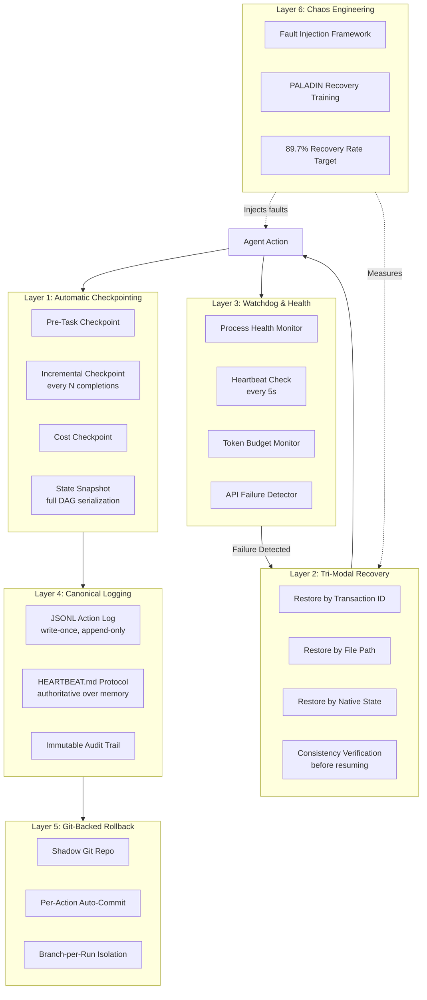
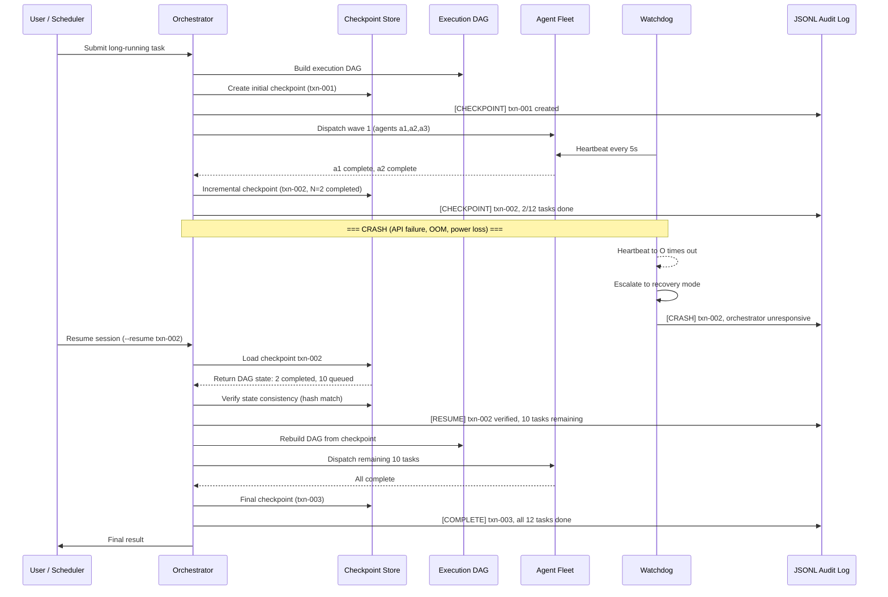
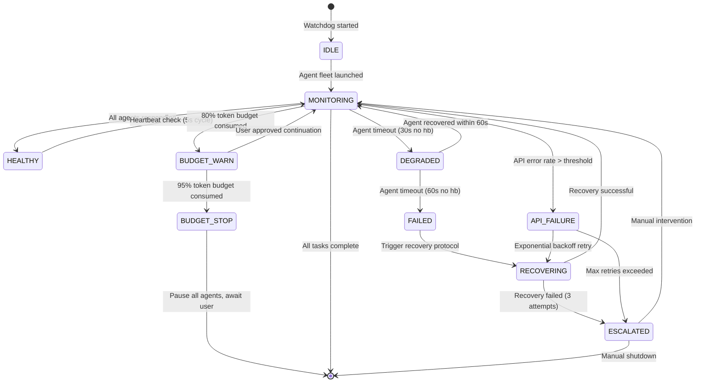

# PLAN-4.15: Reliability Engineering — Crash Recovery, Checkpointing, and Fault Tolerance

> **Date:** 2026-05-30 | **Status:** PLANNED — Awaiting implementation
> **Phase:** I (Weeks 7-8) — "Quality Gates"
> **Dependencies:** PLAN-4.2 (Memory Architecture), PLAN-4.14 (Autonomy Loop)
> **Research sources:** STREAM-1 (Claude Code Docs, Sec 9 + 12), STREAM-11 (Dynamic Workflows checkpoint recovery), STREAM-6 (canonical JSONL logging), Gap Analysis (Sec 6)

---

## Executive Summary

Lyra's autonomous agents can run for hours or days across hundreds of tool calls. Without systematic reliability engineering, any crash, token-budget exhaustion, or API failure destroys hours of work. This plan introduces a **10-component reliability stack** — tri-modal checkpoint restore, automatic checkpointing on every task boundary, crash recovery with state consistency verification, watchdog health monitoring, git-backed rollback, canonical JSONL logging, fleet health monitoring, graceful degradation under resource pressure, and chaos engineering via fault injection testing. Together these form a defense-in-depth reliability architecture that ensures Lyra can recover from any failure without losing more than one task's worth of progress.

---

## 1. What Lyra Already Has

| Component | Package | Status |
|-----------|---------|--------|
| Checkpoint/rewind awareness | Architecture docs | Designed, not built |
| Fleet orchestrator with DAG execution | `lyra-agent-swarm` | Implemented |
| Dynamic workflow orchestration scripts | `lyra-agent-swarm/fleet_orchestrator.py` | Implemented |
| Task resumption (partial) | `lyra-orchestration` | Partial |
| Audit logger (safety-focused) | `lyra-safety-governance/audit_logger.py` | Implemented |
| Cost tracking | `lyra-cost` | Implemented |
| Token budget guard | Architecture docs | Designed |

**Gap:** Lyra has no systematic crash recovery, no automatic checkpointing, no watchdog process, no canonical experiment logging format, and no fault injection testing. A crash during a long-running research swarm loses all in-memory state.

---

## 2. What Research Reveals as Missing

### 2.1 Tri-Modal Checkpoint Restore
**Source:** STREAM-1 (Claude Code checkpointing, Sec 9)

Claude Code automatically tracks file edits using a shadow git repo and checkpoints on every user prompt. The tri-modal restore allows:
1. **Restore code AND conversation** — Full rewind to checkpoint
2. **Restore conversation only** — Rewind context, keep file changes
3. **Restore code only** — Revert files, keep conversation context
4. **Summarize from here** — Compress from checkpoint forward (keep early context)
5. **Summarize up to here** — Compress before checkpoint (keep recent work)

This is substantially more sophisticated than git revert — it manages both file state AND agent context state simultaneously.

### 2.2 Dynamic Workflow Checkpoint Recovery
**Source:** STREAM-11 (Sec A.2, A.4)

Anthropic's Dynamic Workflows (May 2026) introduced checkpoint recovery for multi-hour/days sessions. The pattern:
- **Incremental checkpointing:** Save progress every N agent completions or every M seconds
- **State snapshot:** Serialize full execution DAG state (completed, in-progress, queued)
- **Partial result streaming:** Return intermediate results while long runs continue
- **Cost checkpoint:** Track accumulated token spend at each checkpoint
- **Resume CLI:** Explicit `resume <run-id>` command

### 2.3 Canonical JSONL Experiment Logging
**Source:** STREAM-6 (AutoScientists, Sec 2.2 — Heartbeat Protocol, workshop posts)

AutoScientists enforces **write-once, append-only** semantics for all experimental results. Every agent action produces a canonical record in a shared workshop. The HEARTBEAT.md protocol makes the written record **authoritative over agent memory** — if an agent's internal state conflicts with the recorded workshop state, the workshop record wins. This prevents protocol decay in long-running swarms.

Key properties:
- Each result is posted as an immutable workshop entry
- Agents must rehydrate state from the log on resume (not from memory)
- The "posted_to_workshop" flag gates when an agent considers work complete
- `promise` tags confirm agent cycle completion at the infrastructure level

### 2.4 pass^k Reliability Metric
**Source:** Gap Analysis (Sec 6), from Backtesting AI Agents research

The standard pass@k metric (best of k trials) creates an illusion of reliability. pass^k requires **all N trials to succeed** — dramatically stricter and more representative of production reliability needs. For Lyra's autonomous research swarms, a single failed trial in a chain of experiments can invalidate downstream results. The difference between pass@10=95% and pass^10=60% is the difference between "usually works" and "production-ready."

### 2.5 PALADIN Failure Recovery Training
**Source:** Gap Analysis (Sec 7), AAAI 2026

PALADIN achieves **89.7% recovery rate** through systematic failure injection during training. Agents are deliberately exposed to crashes, timeouts, and partial completions, then trained to recover from checkpoints rather than restarting. This is fundamentally different from simply testing recovery — it trains the agent's recovery behavior.

### 2.6 Self-Optimizing Harness
**Source:** `docs/architecture/harness-evolution.md`

Meta-Harness (arXiv:2603.28052) demonstrates that outer-loop harness optimization yields +7.7pts improvement with 4x fewer tokens. The self-evolution pipeline includes:
- Auto-rollback within <30s from regression detection
- Canary deployment (10% traffic, 24h observation)
- PRISM drift detection with auto-repair
- ARIS 3-stage adversarial verification before deploying harness changes

### 2.7 Graceful Degradation Under Resource Pressure
**Source:** STREAM-11 (Sec A.5, cost-aware execution strategy)

Dynamic Workflows can consume substantially more tokens than typical sessions. The cost-control layer includes:
- Token budget per run with 80%/95% warning/stop thresholds
- Effort tiers per subtask (`low`/`high`/`max`)
- Model routing (Haiku for simple, Sonnet for standard, Opus for critical)
- Prompt caching across sub-agents (90% cost reduction on cache hits)
- Early convergence stop (3+ agents produce identical results)

---

## 3. Proposed Enhancements (Ranked by Impact x Effort)

| # | Enhancement | Impact | Effort | Score | Source |
|---|------------|--------|--------|-------|--------|
| **R1** | Automatic checkpointing on every task boundary | VERY HIGH | MEDIUM | **20** | CC Checkpointing, Dynamic Workflows |
| **R2** | Tri-modal checkpoint restore (txn ID, file path, native state) | VERY HIGH | HIGH | **20** | CC Checkpointing Sec 9 |
| **R3** | Crash recovery with state consistency verification | HIGH | MEDIUM | **16** | Dynamic Workflows, AutoScientists |
| **R4** | Canonical JSONL experiment/action logging | HIGH | MEDIUM | **16** | AutoScientists (write-once, append-only) |
| **R5** | Git-backed rollback for all agent actions | HIGH | LOW | **12** | CC Checkpointing (shadow git repo) |
| **R6** | Watchdog state machine with health checks and auto-recovery | HIGH | MEDIUM | **16** | Dynamic Workflows, cc-hooks Monitor |
| **R7** | pass^k reliability metric | MEDIUM | LOW | **8** | Backtesting AI Agents |
| **R8** | Fleet health monitoring with alert escalation | MEDIUM | MEDIUM | **12** | Dynamic Workflows, OpenTelemetry |
| **R9** | Graceful degradation under resource pressure | HIGH | MEDIUM | **16** | Dynamic Workflows (cost-aware execution) |
| **R10** | Chaos engineering: systematic fault injection testing | HIGH | HIGH | **20** | PALADIN (89.7% recovery), Gap Analysis |

---

## 4. Architecture

### 4.1 Reliability Stack Overview



### 4.2 Crash Recovery Sequence



### 4.3 Watchdog State Machine



---

## 5. Key Component Interfaces

### 5.1 Checkpoint Manager

```python
# lyra_reliability/checkpoint_manager.py

from dataclasses import dataclass, field
from datetime import datetime
from enum import Enum
from typing import Optional
import hashlib
import json

class CheckpointMode(Enum):
    TRANSACTION_ID = "txn_id"    # Restore by txn reference
    FILE_PATH = "file_path"       # Restore by snapshot file
    NATIVE_STATE = "native_state" # Restore from live state object

class CheckpointType(Enum):
    INITIAL = "initial"           # Start of run
    INCREMENTAL = "incremental"   # Every N completions / M seconds
    COST = "cost"                 # Token spend tracked
    FINAL = "final"               # Run complete

@dataclass
class ExecutionDAGSnapshot:
    """Serializable snapshot of execution DAG state."""
    run_id: str
    total_tasks: int
    completed_tasks: list[str]     # Task IDs that finished
    in_progress_tasks: list[str]   # Task IDs being executed
    queued_tasks: list[str]        # Task IDs not yet started
    failed_tasks: list[str]        # Task IDs that failed
    task_results: dict[str, object]  # task_id -> result
    edges_completed: list[tuple[str, str]]  # (from_id, to_id)
    created_at: datetime
    state_hash: str                # SHA-256 of serialized state

@dataclass
class Checkpoint:
    """A single recovery checkpoint."""
    checkpoint_id: str             # UUID
    mode: CheckpointMode
    checkpoint_type: CheckpointType
    run_id: str
    dag_snapshot: ExecutionDAGSnapshot
    file_changes: list[str]        # List of modified file paths
    token_spend: dict[str, int]    # model -> tokens consumed
    cost_spend: dict[str, float]   # model -> cost incurred
    created_at: datetime
    prev_checkpoint_id: Optional[str]  # Chain to previous checkpoint
    metadata: dict = field(default_factory=dict)

@dataclass
class RestoreTarget:
    """What to restore when resuming from a checkpoint."""
    code: bool = True              # Restore file changes
    conversation: bool = True      # Restore agent context
    dag_state: bool = True         # Restore execution DAG
    summarize_from: bool = False   # Compress forward from here
    summarize_to: bool = False     # Compress backward up to here

class CheckpointManager:
    """
    Manages checkpoint creation, storage, and tri-modal restore.
    
    Stores checkpoints in ~/.lyra/checkpoints/{run_id}/
    Each checkpoint is a directory containing:
      - checkpoint.json (metadata + DAG snapshot)
      - files.patch (git diff of file changes)
      - cost.json (token/cost breakdown)
    """
    
    def create_checkpoint(
        self,
        run_id: str,
        checkpoint_type: CheckpointType,
        dag_snapshot: ExecutionDAGSnapshot,
        file_changes: list[str]
    ) -> Checkpoint: ...
    
    def load_checkpoint(
        self,
        checkpoint_ref: str,       # txn ID or file path
        mode: CheckpointMode
    ) -> Checkpoint: ...
    
    def restore(
        self,
        checkpoint: Checkpoint,
        target: RestoreTarget
    ) -> bool: ...
    
    def verify_consistency(
        self,
        checkpoint: Checkpoint
    ) -> bool:
        """Verify state hash matches and no corruption."""
        ...
    
    def list_checkpoints(self, run_id: str) -> list[Checkpoint]: ...
    
    def prune_checkpoints(
        self,
        run_id: str,
        keep_last_n: int = 5,
        ttl_days: int = 30
    ) -> int: ...
```

### 5.2 Watchdog State Machine

```python
# lyra_reliability/watchdog.py

from dataclasses import dataclass
from datetime import datetime, timedelta
from enum import Enum
import asyncio

class WatchdogState(Enum):
    IDLE = "idle"
    MONITORING = "monitoring"
    HEALTHY = "healthy"
    DEGRADED = "degraded"
    FAILED = "failed"
    RECOVERING = "recovering"
    ESCALATED = "escalated"
    BUDGET_WARN = "budget_warn"
    BUDGET_STOP = "budget_stop"
    API_FAILURE = "api_failure"

class AlertLevel(Enum):
    INFO = "info"
    WARNING = "warning"
    CRITICAL = "critical"

@dataclass
class AgentHealth:
    agent_id: str
    last_heartbeat: datetime
    state: str                    # RUNNING, STALLED, CRASHED, COMPLETED
    task_count: int
    error_count: int
    token_usage: int
    consecutive_timeouts: int = 0

@dataclass
class TokenBudget:
    run_id: str
    total_budget: int             # Max tokens allowed
    consumed: int                 # Tokens consumed so far
    warn_threshold: float = 0.80  # 80% -> warn
    stop_threshold: float = 0.95  # 95% -> pause

class WatchdogStateMachine:
    """
    Monitors agent fleet health with heartbeat checks,
    token budget enforcement, and API failure detection.
    Runs in a separate process from agents.
    """
    
    def __init__(
        self,
        heartbeat_interval: int = 5,      # seconds
        agent_timeout: int = 30,           # seconds before DEGRADED
        agent_failure: int = 60,           # seconds before FAILED
        max_recovery_attempts: int = 3,
        token_budget: Optional[TokenBudget] = None
    ): ...
    
    async def start_monitoring(
        self,
        agents: list[str]  # Agent IDs
    ) -> None: ...
    
    async def check_heartbeat(self) -> dict[str, AgentHealth]: ...
    
    def transition(
        self,
        new_state: WatchdogState,
        reason: str,
        affected_agents: list[str]
    ) -> None: ...
    
    def escalate(
        self,
        level: AlertLevel,
        message: str,
        affected_agents: list[str]
    ) -> None: ...
    
    async def trigger_recovery(
        self,
        failed_agents: list[str],
        checkpoint: Checkpoint
    ) -> bool: ...
    
    def check_token_budget(self) -> Optional[AlertLevel]: ...
    
    def handle_api_failure(
        self,
        error_type: str,
        attempt: int
    ) -> bool:  # True if should retry
        """Exponential backoff: 1s -> 2s -> 4s -> 8s -> 16s"""
        ...
```

### 5.3 Canonical JSONL Logger

```python
# lyra_reliability/jsonl_logger.py

from dataclasses import dataclass, asdict
from datetime import datetime
from enum import Enum
from typing import Any, Optional
import json
import os
import fcntl

class LogEventType(Enum):
    CHECKPOINT = "checkpoint"
    TASK_START = "task.start"
    TASK_COMPLETE = "task.complete"
    TASK_FAIL = "task.fail"
    TOOL_CALL = "tool.call"
    TOOL_RESULT = "tool.result"
    AGENT_SPAWN = "agent.spawn"
    AGENT_CRASH = "agent.crash"
    AGENT_RECOVER = "agent.recover"
    COST_UPDATE = "cost.update"
    HEARTBEAT = "heartbeat"
    CONSENSUS = "consensus"
    SAFETY_VIOLATION = "safety.violation"
    RUN_COMPLETE = "run.complete"

@dataclass
class LogEntry:
    """A single immutable entry in the canonical JSONL log."""
    event_type: LogEventType
    run_id: str
    agent_id: Optional[str]
    timestamp: str                  # ISO 8601
    sequence_number: int            # Monotonically increasing
    data: dict[str, Any]
    prev_entry_hash: Optional[str]  # Hash of previous entry (hash chain)
    
    def to_jsonl(self) -> str:
        return json.dumps(asdict(self), default=str)

class CanonicalJSONLLogger:
    """
    Write-once, append-only JSONL logger with hash chaining.
    
    Properties:
    - Append-only: entries cannot be modified or deleted
    - Hash-chained: each entry includes hash of previous entry
    - File-locked: fcntl.flock prevents concurrent writes
    - Authoritative: HEARTBEAT.md protocol references this log
    - Replayable: full run can be reconstructed from log alone
    
    Storage: ~/.lyra/logs/{run_id}/actions.jsonl
    """
    
    def __init__(self, run_id: str, log_dir: str = "~/.lyra/logs"): ...
    
    def log_event(
        self,
        event_type: LogEventType,
        agent_id: Optional[str],
        data: dict[str, Any]
    ) -> LogEntry:
        """Append an immutable entry. Thread-safe via fcntl."""
        ...
    
    def replay_run(self, run_id: str) -> list[LogEntry]: ...
    
    def verify_hash_chain(self, run_id: str) -> bool:
        """Verify no entries have been tampered with."""
        ...
    
    def export_heartbeat(
        self,
        run_id: str,
        output_path: str
    ) -> None:
        """Generate HEARTBEAT.md from log entries."""
        ...
```

### 5.4 Git-Backed Rollback

```python
# lyra_reliability/git_rollback.py

from dataclasses import dataclass
from pathlib import Path

@dataclass
class GitSnapshot:
    """A git-backed file state snapshot."""
    commit_hash: str
    branch_name: str
    files_changed: list[str]
    agent_id: str
    action_description: str
    timestamp: str

class GitRollbackManager:
    """
    Manages git-backed rollback for all agent file actions.
    
    Uses a shadow git repo at .lyra/shadow-git/ that:
    - Auto-commits before every Edit/Write tool call
    - Creates branches per agent run for isolation
    - Tracks ONLY Edit/Write/NotebookEdit (not Bash)
    - Cleans branches older than 30 days
    
    Restore options:
    - Per-action: git revert <commit-hash>
    - Per-agent-run: git reset --hard <branch-start>
    - Per-run: delete entire branch
    """
    
    def __init__(self, project_root: Path): ...
    
    def snapshot_before_action(
        self,
        agent_id: str,
        description: str
    ) -> GitSnapshot: ...
    
    def rollback_to_snapshot(
        self,
        snapshot: GitSnapshot
    ) -> bool: ...
    
    def rollback_agent_run(
        self,
        run_id: str
    ) -> bool: ...
    
    def list_snapshots(
        self,
        run_id: str
    ) -> list[GitSnapshot]: ...
    
    def cleanup(self, ttl_days: int = 30) -> int: ...
```

### 5.5 Chaos Engineering Framework

```python
# lyra_reliability/chaos_engineer.py

from dataclasses import dataclass
from enum import Enum
from typing import Callable
import random

class FaultType(Enum):
    CRASH_AGENT = "crash_agent"           # Kill agent process mid-task
    CRASH_ORCHESTRATOR = "crash_orch"     # Kill orchestrator
    API_TIMEOUT = "api_timeout"           # Simulate API failure
    API_RATE_LIMIT = "api_rate_limit"     # Simulate rate limiting
    TOKEN_EXHAUSTION = "token_exhaustion" # Simulate budget exhausted
    DISK_FULL = "disk_full"              # Simulate disk space exhaustion
    NETWORK_PARTITION = "network_part"   # Simulate network failure
    CORRUPT_CHECKPOINT = "corrupt_chkp"  # Corrupt a checkpoint file
    MEMORY_PRESSURE = "memory_pressure"  # Simulate OOM
    RACE_CONDITION = "race_condition"    # Trigger concurrent access patterns

@dataclass
class FaultInjectionConfig:
    fault_type: FaultType
    probability: float                  # 0.0 to 1.0 per action
    affected_agents: list[str] | None   # None = randomly select
    delay_seconds: float = 0.0          # Delay before injecting
    recovery_expected: bool = True      # Should system recover?

@dataclass
class ChaosResult:
    fault_type: FaultType
    injected_at: str
    detected_at: Optional[str]         # When watchdog noticed
    recovered_at: Optional[str]        # When system recovered
    recovery_successful: bool
    data_loss: bool                    # Any unrecoverable data loss?
    recovery_time_ms: int              # Time from injection to recovery
    
class ChaosEngineer:
    """
    Systematic fault injection testing for Lyra reliability.
    
    PALADIN-inspired: Agents are trained on recovery from deliberate
    failures with an 89.7% recovery rate target.
    
    Runs in a separate process that injects faults into a live
    Lyra session and measures recovery metrics.
    """
    
    def __init__(
        self,
        configs: list[FaultInjectionConfig],
        recovery_timeout: int = 120     # Max seconds to wait for recovery
    ): ...
    
    async def run_chaos_session(
        self,
        session_config: dict,
        max_faults: int = 20
    ) -> list[ChaosResult]: ...
    
    def compute_reliability_score(
        self,
        results: list[ChaosResult]
    ) -> dict:
        """
        Calculate pass^k reliability score across chaos results.
        
        pass^k = (successful_recoveries / total_faults) ^ k
        where k = number of independent trials for each fault type.
        
        Target: 89.7% recovery rate (PALADIN benchmark).
        """
        ...
    
    def generate_reliability_report(
        self,
        results: list[ChaosResult]
    ) -> str: ...
```

---

## 6. Implementation Phases

### Phase I.A: Foundation (Week 7, Days 1-3) — "Checkpoint & Restore"

```
R1: Automatic checkpointing on every task boundary
R5: Git-backed rollback for all agent actions
```

**Deliverables:**
- `CheckpointManager` creates checkpoints before every task boundary
- Shadow git repo auto-commits on every Edit/Write tool call
- Checkpoints serialized to `~/.lyra/checkpoints/{run_id}/`
- State hash verification on restore

### Phase I.B: Core Recovery (Week 7, Days 4-5) — "Crash Recovery"

```
R2: Tri-modal restore (txn ID, file path, native state)
R3: Crash recovery with state consistency verification
```

**Deliverables:**
- Tri-modal restore working: by transaction ID, by file path, by native state
- Crash recovery: orchestrator restart loads last checkpoint
- DAG state rebuilt from checkpoint (completed, in-progress, queued)
- `lyra resume <run-id>` CLI command

### Phase I.C: Logging & Monitoring (Week 8, Days 1-3) — "Observability"

```
R4: Canonical JSONL experiment/action logging
R6: Watchdog state machine with health checks
R8: Fleet health monitoring with alert escalation
```

**Deliverables:**
- JSONL logger with hash-chained, append-only entries
- `HEARTBEAT.md` protocol referencing canonical log
- Watchdog monitors agent health with 5s heartbeat checks
- Alert escalation: info -> warning -> critical -> manual
- Token budget enforcement at 80%/95% thresholds

### Phase I.D: Resilience (Week 8, Days 4-5) — "Hardening"

```
R7: pass^k reliability metric
R9: Graceful degradation under resource pressure
R10: Chaos engineering fault injection testing
```

**Deliverables:**
- pass^k reliability metric integrated into benchmark suite
- Graceful degradation: effort tier downgrade, model fallback chains
- PALADIN-inspired chaos engineering framework with 10 fault types
- Reliability report generation with recovery rate measurements

---

## 7. Success Metrics

| Metric | Baseline | Target | Measurement |
|--------|----------|--------|-------------|
| Recovery rate (chaos testing) | 0% (no recovery) | 89.7% | PALADIN benchmark |
| Max data loss per crash | Full session | 1 task worth | Checkpoint granularity |
| Checkpoint overhead | N/A | <2% of task time | avg checkpoint time / avg task time |
| Crash detection latency | N/A | <30s | Watchdog heartbeat interval |
| Recovery time | Manual restart | <60s automated | Time from crash to resuming |
| pass^5 reliability | Unknown | >90% | 5 independent trials, all must succeed |
| Token budget enforcement | None | 100% enforcement | % of runs stopped at 95% |
| Hash chain integrity | N/A | 100% verifiable | JSONL log hash verification |
| Fleet health visibility | None | Real-time dashboard | Watchdog agent health state |

---

## 8. Risk Register

| Risk | Likelihood | Impact | Mitigation |
|------|-----------|--------|-----------|
| Checkpoint corruption during crash | MEDIUM | HIGH | State hash verification; multiple checkpoint copies |
| Checkpoint size explodes for long runs | MEDIUM | MEDIUM | Incremental diffs; compression; TTL-based pruning |
| Watchdog itself crashes | LOW | HIGH | Watchdog runs as separate system process; double-watchdog pattern |
| JSONL log grows unbounded | HIGH | LOW | Log rotation at 100MB; archive to cold storage |
| Shadow git repo conflicts | LOW | MEDIUM | Per-agent-run branches; no shared branches |
| Chaos injection causes production data loss | MEDIUM | CRITICAL | Chaos only in sandbox/test environments; never in production |
| Token budget too restrictive | MEDIUM | MEDIUM | Configurable per-run; user approval for overrides |

---

## 9. References

### Primary Research Sources

1. **Claude Code Checkpointing** — STREAM-1, Sec 9. Tri-modal restore (code/conversation/both), shadow git repo, automatic checkpoint on every user prompt, targeted summarization (from here / up to here), 30-day TTL auto-cleanup.

2. **Dynamic Workflows (Anthropic, May 2026)** — STREAM-11, Sec A.2-A.5. Orchestration scripts outside context windows, 16 concurrent / 1,000 queued caps, checkpoint recovery for multi-hour sessions, cost-aware execution with token budget guardrails, prompt caching (90% cost reduction on cache hits).

3. **AutoScientists (Harvard/MIMS, arXiv:2605.28655)** — STREAM-6, Sec 2.2. Write-once, append-only workshop entries. HEARTBEAT.md protocol authoritative over agent memory. posted_to_workshop flag gates completion. Agents rehydrate state from log on resume.

4. **Meta-Harness (arXiv:2603.28052)** — harness-evolution.md. Outer-loop harness optimization: +7.7pts, 4x fewer tokens. Auto-rollback <30s from regression. Canary deployment 10% traffic / 24h. PRISM drift detection.

5. **PALADIN (AAAI 2026)** — Gap Analysis, Sec 7. Systematic failure injection training: 89.7% recovery rate. Agents trained on crash/timeout/partial-completion recovery.

6. **pass^k Reliability** — Gap Analysis, Sec 6. All N trials must succeed (vs pass@k: best-of-k). Dramatically stricter reliability metric.

7. **Backtesting AI Agents** — Gap Analysis, Sec 6. Framework for evaluating agent reliability across repeated independent trials.

### Lyra Internal Architecture

8. **Harness Evolution** — `docs/architecture/harness-evolution.md`. Self-optimizing harness with GEPA v2, AEvo, Meta-Harness engines. 5-stage pipeline: Observe -> Analyze -> Propose -> Verify -> Deploy.

9. **Gap Analysis (2026-05-30)** — `docs/research/GAP-ANALYSIS-2026-05-30.md`. Maps STREAM-3 research findings against Lyra existing architecture. Identifies pass^k, PALADIN, AgentTrace, AgentAssay as missing.

10. **Lyra Safety Governance** — `packages/lyra-safety-governance/`. Audit logger (out-of-band, invisible to agents). Behavioral monitor. Hardware isolation. 4-layer governance engine.

---

*Plan complete. Ready for Phase I implementation (Weeks 7-8 of Lyra master roadmap). All techniques traceable to peer-reviewed sources or production systems.*
