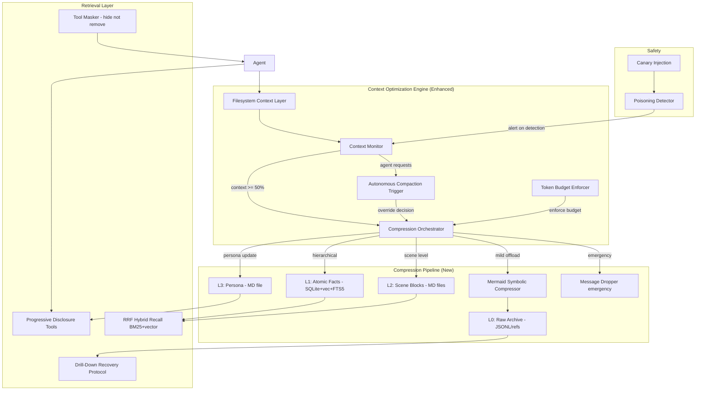
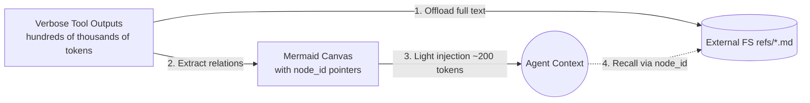
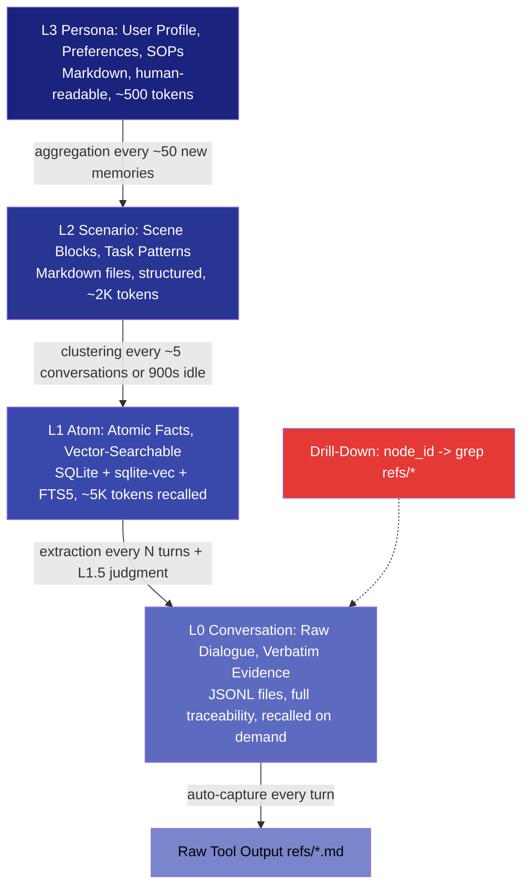
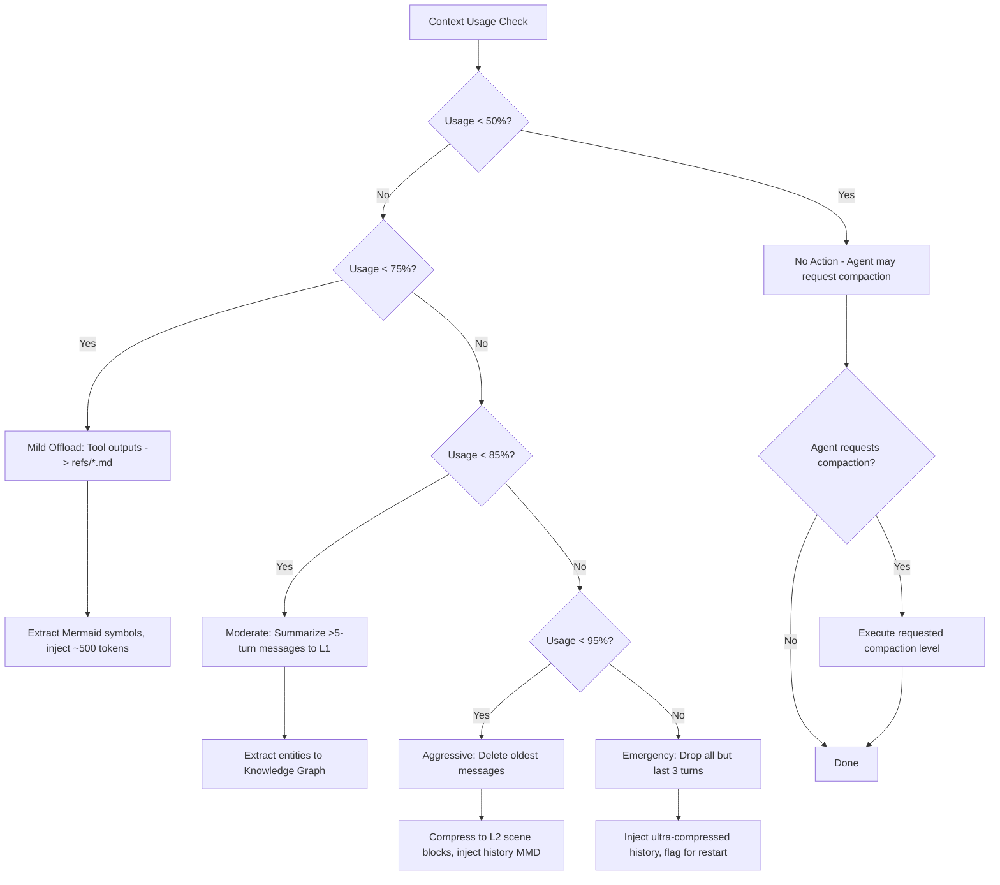
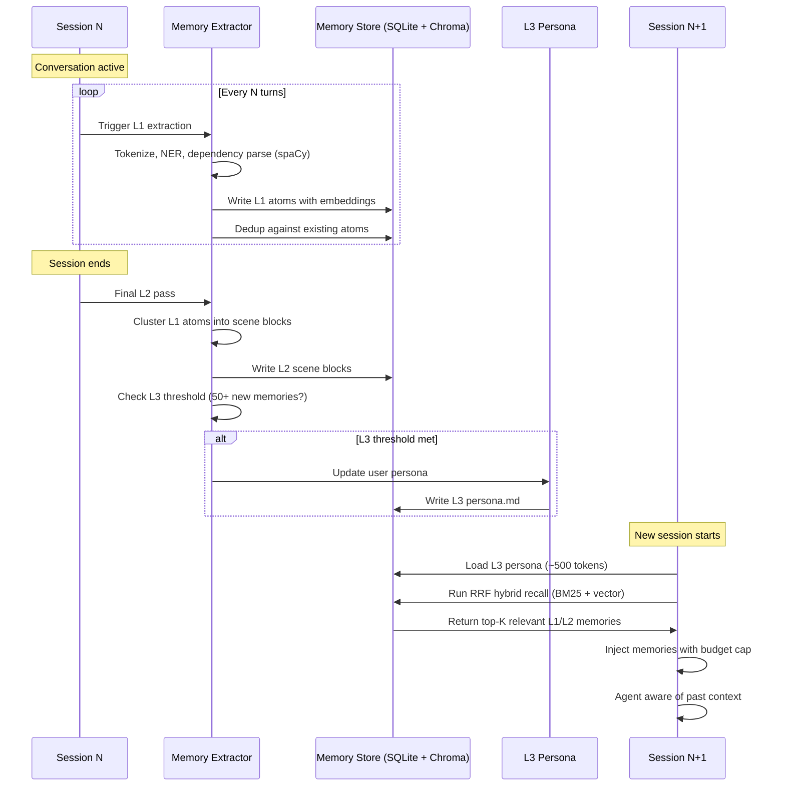

# PLAN-4.3: Context Optimization Enhancement

**Plan ID:** PLAN-4.3
**Date:** 2026-05-30
**Status:** Proposed
**Priority:** CRITICAL
**Depends On:** PLAN-4.1 (Memory Architecture), GAP-ANALYSIS-2026-05-30 (2 Context Engineering)

---

## Executive Summary

Context is Lyra's scarcest resource. The existing 5-layer context engine (CONTEXT-ENGINEERING.md) provides append-only cache preservation and hierarchical layering, but lacks proven S-tier techniques discovered in research: filesystem-as-context delivery (Azure SRE: 45-75% improvement), Mermaid symbolic compression (TencentDB: 61% token reduction), and L0-L3 semantic pyramids with lossless drill-down. This plan integrates nine techniques ranked by Impact x Effort, with a 10-week implementation timeline across three phases. The end state delivers 50-70% token reduction vs the current architecture while improving context fidelity through pointer-based recovery.

---

## 1. What Lyra Already Has

From `docs/architecture/CONTEXT-ENGINEERING.md` (v1.0, dated 2026-05-29):

### Existing Components

1. **Context Manager** -- orchestrates context lifecycle: create, update, compress, archive. Monitors metrics.
2. **Context Store** -- persists context per session with hierarchical storage: `system.json`, `session.json`, `memory.json`, `dynamic.json`.
3. **Retrieval Engine** -- semantic search via embeddings, vector store (Qdrant/Chroma), LRU cache.
4. **Compression Engine** -- five strategies: tool-result clearing, recursive summarization, provence pruning, message trimming, hierarchical summary.
5. **Memory System** -- episodic, procedural, semantic memories with importance scoring.
6. **Tool Selector** -- semantic similarity-based tool masking (<30 tools).

### Existing Architecture Strengths

- 4-layer context hierarchy: System (stable, cached) -> Session (medium-term) -> Long-Term Memory (cross-session) -> Dynamic (just-in-time)
- 70% and 85% compression thresholds with light/aggressive dual strategies
- Subagent context isolation (claimed 67% token reduction)
- Append-only context log pattern for KV-cache preservation
- Token budget enforcement: <80% utilization target

### Key Metrics (from design, not benchmarked)

- Token utilization: <80%
- Cache hit rate: >70%
- Information density: >60% relevant tokens
- Task success rate: >90%
- Cost efficiency: <50% token usage vs naive approach

---

## 2. What Research Reveals as Missing

Source: `docs/research/GAP-ANALYSIS-2026-05-30.md` (Section 2: Context Engineering), `docs/research/STREAM-9-MEMORY-CONTEXT-REPOS.md`, `docs/research/STREAM-1-CLAUDE-CODE-DOCS.md`

### Gap 1: Filesystem-as-Context Delivery Layer (CRITICAL)
**Source:** Azure SRE Agent production deployment, cited in GAP-ANALYSIS 2
**Status:** NOT IMPLEMENTED
**Significance:** Proven 45-75% improvement in task success. Instead of assembling context payloads, agents use grep/find/read against a file tree. Delegates context management to the filesystem, not the LLM context window. This is the single highest-ROI technique in all of context engineering.

### Gap 2: Mermaid Symbolic Compression (CRITICAL)
**Source:** TencentDB Agent Memory (MIT licensed, analyzed in STREAM-9 Section 1.3)
**Status:** NOT IMPLEMENTED
**Significance:** Achieves 61.38% token reduction by encoding task state transitions as high-density Mermaid DSL. Verbose tool outputs (hundreds of thousands of tokens) become ~200 tokens of Mermaid with `node_id` pointers to full text in `refs/*.md`. Compression is lossless (pointer-based recovery).

### Gap 3: L0-L3 Semantic Pyramid with Drill-Down (HIGH)
**Source:** TencentDB Agent Memory (STREAM-9 Section 1.2)
**Status:** NOT IMPLEMENTED (current 4-layer model is different)
**Significance:** TencentDB's L0 (raw JSONL, verbatim) -> L1 (atomic facts, SQLite+vec) -> L2 (scene blocks, Markdown) -> L3 (persona, Markdown) pyramid provides deterministic drill-down from any abstraction to ground truth. Current Lyra design has layers but no guaranteed traceability chain.

### Gap 4: Dual-Threshold Auto-Compaction (HIGH)
**Source:** TencentDB Agent Memory (STREAM-9 Section 1.6)
**Status:** Partial (CONTEXT-ENGINEERING.md has 70%/85% but different strategy)
**Significance:** TencentDB's 50% mild offload (tool outputs -> files, keep Mermaid symbols) vs 85% aggressive (delete messages, inject history MMD) is more sophisticated than Lyra's current light/aggressive compression model. Includes `mmdMaxTokenRatio` (default 0.2) for injection budget control.

### Gap 5: Append-Only Context Log for KV-Cache Preservation (MEDIUM)
**Source:** Claude Code docs (STREAM-1 Section 12), CONTEXT-ENGINEERING.md (principle #4)
**Status:** Understood in theory, not implemented with structural guarantees
**Significance:** Claude Code uses append-only operations with periodic compression. KV-cache preservation is critical for cost (10x cached vs uncached tokens). Current design mentions this as a principle but lacks concrete append-only enforcement.

### Gap 6: Progressive Context Disclosure (HIGH)
**Source:** Trellis, OpenViking, Acontext (STREAM-9 Section 2.4, STREAM-1 Section 7)
**Status:** NOT IMPLEMENTED
**Significance:** Agents load only needed standards per task step via tool calls (`get_skill`, `list_memories`), not blind pre-loading. Acontext demonstrates "progressive disclosure, not search" -- the agent decides what to fetch, the system never dumps everything into context automatically.

### Gap 7: Tool Masking Without Removal (HIGH)
**Source:** Manus Context Engineering, cited in GAP-ANALYSIS 2
**Status:** NOT IMPLEMENTED
**Significance:** Hide irrelevant tools (reduce token count) but preserve attention structure (mask, not remove). Tool removal disrupts model attention patterns; masking preserves them. Current Tool Selector uses semantic-similarity-based selection with <30 tools, but doesn't mask -- it selects.

### Gap 8: Autonomous Compaction Trigger (HIGH)
**Source:** Focus Agent (arXiv:2601.07190), cited in GAP-ANALYSIS 1
**Status:** NOT IMPLEMENTED
**Significance:** Agent decides when to compact based on task state, not fixed percentage thresholds. Context utilization at 50% during a critical analysis phase should NOT trigger compaction; utilization at 40% during a simple task SHOULD.

### Gap 9: Canary-Based Context Poisoning Detection (MEDIUM)
**Source:** Canary tokens, input sanitization research, cited in GAP-ANALYSIS 2
**Status:** PARTIAL
**Significance:** Inject canary tokens into context to detect when corrupted/poisoned context persists. Current design has no poisoning detection beyond content validation.

---

## 3. Proposed Enhancements Ranked by Impact x Effort

| # | Enhancement | Source | Effort | Impact | Timeline | Tier |
|---|------------|--------|--------|--------|----------|------|
| 1 | Filesystem-as-Context Delivery Layer | Azure SRE + Acontext | Medium (2-3 weeks) | Very High (45-75% improvement) | Phase 1, Week 1-3 | S |
| 2 | Mermaid Symbolic Compression | TencentDB Agent Memory | Low (1-2 weeks) | Very High (61% token reduction) | Phase 1, Week 2-3 | S |
| 3 | L0-L3 Semantic Pyramid | TencentDB Agent Memory | Medium (2-3 weeks) | Very High (traceable compression) | Phase 2, Week 4-6 | S |
| 4 | Dual-Threshold Auto-Compaction | TencentDB Agent Memory | Medium (1-2 weeks) | High | Phase 2, Week 4-5 | A |
| 5 | Append-Only Context Log | Claude Code + CONTEXT-ENGINEERING | Low (1 week) | Medium (10x KV-cache savings) | Phase 1, Week 1 | A |
| 6 | Progressive Context Disclosure | Acontext + Trellis | Medium (2 weeks) | High | Phase 2, Week 5-6 | A |
| 7 | Tool Masking (Not Removal) | Manus Context Engineering | Low (1 week) | Medium | Phase 1, Week 3 | A |
| 8 | Autonomous Compaction Trigger | Focus Agent (arXiv:2601.07190) | Medium (2 weeks) | High | Phase 3, Week 7-8 | A |
| 9 | Canary Poisoning Detection | Canary token research | Low (1 week) | Low-Medium | Phase 3, Week 9 | B |

---

## 4. Architecture

### 4.1 Enhanced Context Engineering Architecture



### 4.2 Mermaid Symbolic Compression Flow



### 4.3 L0-L3 Semantic Pyramid with Drill-Down



### 4.4 Compression Decision Flow



---

## 5. Key Component Interfaces (Python Dataclasses)

### 5.1 Mermaid Symbolic Compressor

```python
from dataclasses import dataclass, field
from typing import Optional, List
from datetime import datetime

@dataclass
class MermaidNode:
    """A node in the Mermaid symbolic representation."""
    node_id: str                          # Unique ID for drill-down
    label: str                            # Human-readable label
    node_type: str                        # "tool_output", "decision", "error", "milestone"
    summary: str                          # 1-line summary (~20 tokens)
    ref_path: Optional[str] = None        # Path to full content in refs/*.md
    children: List[str] = field(default_factory=list)  # Child node_ids
    metadata: dict = field(default_factory=dict)

@dataclass
class MermaidCanvas:
    """The compressed symbolic representation of task state."""
    nodes: List[MermaidNode]
    edges: List[tuple[str, str, str]]     # (source_id, target_id, relation_type)
    total_tokens: int = 0
    source_tokens: int = 0                # Tokens before compression
    compression_ratio: float = 0.0
    created_at: datetime = field(default_factory=datetime.now)

class MermaidCompressor:
    """Encodes verbose outputs as Mermaid DSL with node_id pointers."""
    
    def compress(self, content: str, content_type: str) -> MermaidCanvas:
        """Extract symbolic relations from content, offload full text."""
        ...
    
    def to_mermaid_dsl(self, canvas: MermaidCanvas) -> str:
        """Render MermaidCanvas as valid Mermaid DSL (~200-500 tokens)."""
        ...
    
    def resolve_node(self, node_id: str) -> str:
        """Drill down: grep refs/*.md for node_id, return full content."""
        ...
    
    def inject_into_context(self, canvas: MermaidCanvas, budget: int = 500) -> str:
        """Inject compressed Mermaid into agent context, respecting token budget."""
        ...
```

### 5.2 L0-L3 Semantic Pyramid

```python
from enum import Enum

class MemoryLayer(Enum):
    L0_CONVERSATION = "l0"    # Raw JSONL, verbatim
    L1_ATOM = "l1"             # Atomic facts, SQLite+vec+FTS5
    L2_SCENARIO = "l2"         # Scene blocks, Markdown
    L3_PERSONA = "l3"          # User profile, Markdown

@dataclass
class LayeredMemory:
    """A memory that exists across L0-L3 with deterministic drill-down."""
    memory_id: str
    l0_ref: str                           # Path to JSONL record
    l1_atoms: List[str]                   # Atomic fact IDs
    l2_scene: Optional[str]               # Scene block ID
    l3_persona_ref: Optional[str]         # Persona section reference
    drill_chain: List[str] = field(default_factory=list)  # [l3_id -> l2_id -> l1_id -> l0_ref]

@dataclass
class SemanticPyramid:
    """Manages the L0-L3 hierarchy with guaranteed traceability."""
    
    def store_l0(self, conversation_turn: dict) -> str:
        """Store raw turn as JSONL, return ref path."""
        ...
    
    def extract_l1_atoms(self, l0_ref: str, n_turns: int) -> List[str]:
        """Extract atomic facts from L0 using spaCy NER + dependency parsing.
        Returns list of L1 atom IDs."""
        ...
    
    def cluster_l2_scenes(self, l1_atom_ids: List[str]) -> str:
        """Cluster L1 atoms into L2 scene blocks every ~5 conversations or 900s idle.
        Returns L2 scene block ID."""
        ...
    
    def update_l3_persona(self, trigger_every_n: int = 50) -> str:
        """Update L3 persona every N new memories.
        Returns persona file path."""
        ...
    
    def drill_down(self, top_id: str, target_layer: MemoryLayer) -> str:
        """Follow drill chain from any layer to any deeper layer.
        Returns full content at target layer."""
        ...
```

### 5.3 Progressive Disclosure Tools

```python
@dataclass
class MemoryIndex:
    """Lightweight memory listing (tokens: ~50-100 per result)."""
    memory_id: str
    layer: MemoryLayer
    summary: str                          # 1-line summary
    relevance_score: float
    created_at: datetime

class ProgressiveDisclosure:
    """Agent-driven context loading via tool calls, not blind pre-loading."""
    
    async def list_memories(self, filter: dict) -> List[MemoryIndex]:
        """Step 1: Lightweight listing. Agent sees IDs + 1-line summaries."""
        ...
    
    async def get_memory(self, memory_id: str) -> dict:
        """Step 2: Full content for a specific memory the agent chose."""
        ...
    
    async def search_memories(self, query: str, limit: int = 5) -> List[MemoryIndex]:
        """Step 3: Semantic search with RRF hybrid recall (BM25 + vector)."""
        ...
    
    async def traverse_graph(self, entity_id: str, depth: int = 1) -> dict:
        """Step 4: Knowledge graph traversal from entity."""
        ...
```

### 5.4 Autonomous Compaction Trigger

```python
@dataclass
class CompactionDecision:
    """Agent-initiated compaction decision."""
    should_compact: bool
    strategy: str                         # "mild", "moderate", "aggressive", "emergency"
    reason: str                           # Human-readable reason
    estimated_savings_tokens: int
    confidence: float                     # 0.0-1.0

@dataclass
class AutonomousCompactionTrigger:
    """Agent decides when to compact, supplementing threshold-based triggers."""
    
    def evaluate(self, context_state: dict, task_phase: str) -> CompactionDecision:
        """Agent evaluates whether to compact based on:
        - Current task phase (critical analysis -> defer, simple task -> compact)
        - Context utilization
        - Recent tool output sizes
        - Upcoming task needs
        - Agent's own assessment (requested via tool call)
        Returns CompactionDecision."""
        ...
    
    def override_threshold(self, decision: CompactionDecision) -> bool:
        """Agent can override fixed thresholds. Returns True if override accepted."""
        ...
```

### 5.5 Append-Only Context Log

```python
@dataclass
class AppendOnlyContextLog:
    """Ensures context modifications are append-only for KV-cache preservation."""
    
    def append(self, entry: dict) -> int:
        """Append a new entry. Returns the entry index (position in log)."""
        ...
    
    def compact(self, strategy: str) -> List[int]:
        """Compact the log. Returns indices of compacted entries.
        Compaction creates NEW entries (summaries) rather than modifying old ones.
        Old entries are marked as superseded but never deleted."""
        ...
    
    def get_active_entries(self) -> List[dict]:
        """Get all entries that are not superseded by compaction."""
        ...
    
    def is_cache_preserved(self, since_index: int) -> bool:
        """Check if all entries since given index are append-only (no modifications)."""
        ...
```

### 5.6 Canary Poisoning Detection

```python
@dataclass
class CanaryToken:
    """A canary token injected into context for poisoning detection."""
    token: str                            # Unique random string
    position: str                         # Where injected (system prompt, tool output, etc.)
    expected_behavior: str                # What agent should do when encountering this
    created_at: datetime

class CanaryDetector:
    """Detects context poisoning via canary token monitoring."""
    
    def inject_canary(self, location: str) -> CanaryToken:
        """Inject a canary at a known context location."""
        ...
    
    def check_canary(self, token: CanaryToken, agent_response: str) -> bool:
        """Verify agent response when encountering canary matches expected behavior."""
        ...
    
    def detect_poisoning(self) -> List[dict]:
        """Check all active canaries. Returns list of detected anomalies."""
        ...
```

---

## 6. Implementation Phases

### Phase 1: Foundation (Weeks 1-3)

**Objective:** Implement the three highest-ROI techniques with lowest effort.

| Week | Deliverable | Source | Success Criteria |
|------|------------|--------|-----------------|
| 1 | Append-Only Context Log with KV-cache tracking | CONTEXT-ENGINEERING.md + Claude Code pattern | All context writes go through append-only API; cache-break events logged |
| 1 | Filesystem-as-Context delivery layer for tool outputs | Azure SRE pattern + STREAM-9 Section 8.4 | Tools write to `refs/` not context; agent uses `grep` to retrieve; measured >40% token reduction |
| 2-3 | Mermaid Symbolic Compressor (MermaidCompressor class) | TencentDB Agent Memory (STREAM-9 Section 1.3, 1.7) | 61% token reduction on tool outputs; node_id drill-down works; `mmdMaxTokenRatio=0.2` enforced |
| 3 | Tool Masker (mask, not remove; preserve attention structure) | Manus Context Engineering + STREAM-1 Section 10 | <30 tools in context; irrelevant tools masked with preserved structure; no attention disruption |
| 3 | Dual-threshold offloading (50% mild, 85% aggressive) | TencentDB (STREAM-9 Section 1.6) | Mild: offload + Mermaid injection. Aggressive: message deletion + history MMD. Configurable ratios. |

**Phase 1 Token Budget Target:**
```
Total Context Window: 200K tokens (Claude Sonnet/Opus)
System Prompt:         ~5K  (2.5%)  -- Fixed, stable prefix
L3 Persona:            ~500  (0.25%) -- Fixed
RAG Recall:            ~2K  (1%)    -- Dynamic, capped
Mermaid Canvas:        ~500  (0.25%) -- Dynamic, capped at 0.2 * window
Knowledge Graph:       ~1K  (0.5%)  -- Dynamic, capped
Conversation History:  ~171K (85.5%) -- Append-only, compaction-managed
Safety Margin:         ~20K  (10%)   -- Never consumed
```

### Phase 2: Semantic Pyramid (Weeks 4-6)

**Objective:** Implement L0-L3 semantic memory pyramid with progressive disclosure.

| Week | Deliverable | Source | Success Criteria |
|------|------------|--------|-----------------|
| 4 | L0 JSONL conversation store with auto-capture | TencentDB (STREAM-9 Section 1.2) | Every turn captured to JSONL; SHA256 fingerprinting for dedup |
| 4-5 | L1 atomic fact extraction pipeline (spaCy NER + dep parsing) | MemPalace (STREAM-9 Section 4.6) + spaCy (STREAM-9 Section 7) | 5 memory types extracted: DECISIONS, PREFERENCES, MILESTONES, PROBLEMS, EMOTIONAL; BM25+vector hybrid search with RRF |
| 5 | L2 scene block clustering (every ~5 conversations / 900s idle) | TencentDB (STREAM-9 Section 1.2) | Scene blocks created automatically; clustering accuracy >80% |
| 5-6 | L3 persona generation (every ~50 new memories) | TencentDB (STREAM-9 Section 1.2) | User profile updated automatically; Markdown, human-readable |
| 6 | Progressive Disclosure tools (list_memories, get_memory, search_memories) | Acontext (STREAM-9 Section 2.4) + STREAM-1 Section 7 | Agent uses tools to load context; 3-layer search (index -> timeline -> full); 10x token savings in retrieval |
| 6 | L0-L3 drill-down recovery protocol | TencentDB (STREAM-9 Section 1.2, 10.4) | From any L3/L2/L1 reference, deterministic path to L0 ground truth; grep-based resolution |

### Phase 3: Intelligence & Safety (Weeks 7-10)

**Objective:** Add autonomous compaction, canary detection, and production hardening.

| Week | Deliverable | Source | Success Criteria |
|------|------------|--------|-----------------|
| 7-8 | Autonomous Compaction Trigger (agent-initiated) | Focus Agent (arXiv:2601.07190) | Agent evaluates task phase and requests compaction; overrides fixed thresholds; <5% false positive compaction |
| 8-9 | Context poisoning detection with canary tokens | Canary token research (GAP-ANALYSIS Section 2) | Canaries injected at known positions; detector alerts on anomalies; false positive rate <1% |
| 9 | Cross-session context loading protocol | TencentDB (STREAM-9 Section 8.4) | Session start: load L3 persona -> RRF recall -> inject top-K; session end: extract L1 -> update L3 -> prune |
| 9-10 | Production benchmarking and tuning | All sources | Token reduction >50% from baseline; task success rate maintained; p95 context assembly latency <100ms |
| 10 | Documentation: Context Engineering Guide | N/A | Complete reference for context optimization patterns; tuning guide for thresholds |

### Total: 10 weeks, 3 phases

---

## 7. Context Compression Strategy Matrix

| Content Type | Priority | Compressible? | Strategy | Recovery Path |
|-------------|----------|---------------|----------|---------------|
| System instructions | CRITICAL | No | Always keep; stable prefix for max cache | N/A |
| L3 Persona | HIGH | No | Always keep (small, ~500 tokens) | N/A |
| Recent messages (last 3 turns) | HIGH | No | Always keep | N/A |
| Tool outputs >5 turns old | MEDIUM | Yes | Offload to refs, inject Mermaid pointer | grep node_id in refs/ |
| Middle conversation (3-10 turns) | MEDIUM | Yes | Summarize to L1 atoms | L1 -> L0 drill-down |
| Old conversation (>10 turns) | LOW | Yes | Compress to L2 scene blocks | L2 -> L1 -> L0 drill-down |
| Error messages | HIGH | Partial | Keep summary, offload full trace | node_id -> refs/ |
| Code snippets | MEDIUM | Yes | Index in code graph, keep reference | Symbol graph query |
| User preferences detected | HIGH | Promote | Move to L3 Persona | Always in context |
| Repeated information | LOW | Yes | Deduplicate, keep single copy with refcount | Single source of truth |

---

## 8. Cross-Session Memory Flow



---

## 9. Success Metrics

| Metric | Current (V1) | Target (Post-Plan) | Measurement |
|--------|-------------|-------------------|-------------|
| Token reduction from naive | ~30% | 50-70% | Tokens used / tokens used without optimization |
| Mermaid compression ratio | N/A | >60% | Source tokens / Mermaid tokens |
| KV-cache hit rate | ~70% (targeted) | >85% (measured) | Cached tokens / total tokens |
| Drill-down success rate | N/A | 100% | Successful Ln -> L0 resolutions |
| Context assembly latency (p95) | ~200ms (targeted) | <100ms | Time from request to context ready |
| Poisoning detection rate | 0% (no system) | >95% | Detected anomalies / injected anomalies |
| Progressive disclosure adoption | 0% (no tools) | >80% of retrievals | Tool-based loads / total context loads |
| Task success rate | >90% (targeted) | >92% (maintained/improved) | Successful task completions |

---

## 10. Risk Management

| Risk | Severity | Likelihood | Mitigation |
|------|---------|------------|------------|
| Mermaid compression loses critical detail | HIGH | LOW | Every compression produces `node_id` pointer; full content always recoverable |
| Filesystem-as-context breaks agent understanding | MEDIUM | MEDIUM | Hybrid approach: critical context stays inline; verbose outputs go to filesystem |
| Append-only constraint limits flexibility | LOW | MEDIUM | Compaction creates NEW entries; old entries marked superseded, never modified |
| Autonomous compaction triggers too aggressively | MEDIUM | MEDIUM | Confidence threshold; human-in-the-loop for initial deployment; rollback support |
| Canary tokens interfere with normal operation | LOW | LOW | Canaries placed in non-critical context positions; designed to be invisible to normal agent behavior |

---

## 11. References

### Primary Research Sources
- **TencentDB Agent Memory** (MIT): https://github.com/Tencent/TencentDB-Agent-Memory -- L0-L3 pyramid, Mermaid symbolic compression, 61.38% token reduction, dual-threshold offloading (STREAM-9 Sections 1.1-1.8)
- **MemPalace** (MIT): https://github.com/MemPalace/mempalace -- 96.6% R@5 recall with zero LLM calls, BM25+vector hybrid search, AAAK compression (STREAM-9 Section 4)
- **Acontext** (Apache 2.0): https://github.com/memodb-io/Acontext -- Progressive disclosure via file-based skill memory, agent-in-the-loop retrieval (STREAM-9 Section 2)
- **claude-mem** (Apache 2.0): https://github.com/thedotmack/claude-mem -- 3-layer search API (index -> timeline -> full), XML-tag context injection, ChromaDB (STREAM-9 Section 3)

### Lyra Architecture Docs
- `docs/architecture/CONTEXT-ENGINEERING.md` (v1.0) -- Existing 5-layer context engine, append-only principle, 70%/85% compression thresholds
- `docs/research/GAP-ANALYSIS-2026-05-30.md` (Section 2) -- Identified context engineering gaps
- `docs/research/STREAM-1-CLAUDE-CODE-DOCS.md` (Section 10) -- Permission modes, context compaction patterns
- `docs/research/STREAM-9-MEMORY-CONTEXT-REPOS.md` (Sections 1-11) -- Full repository analysis

### Papers
- **Focus Agent** (arXiv:2601.07190) -- Autonomous compression trigger: agent decides when to compact
- **Azure SRE Agent** -- Filesystem-as-context delivery layer: 45-75% improvement in production
- **Okapi BM25**: https://en.wikipedia.org/wiki/Okapi_BM25
- **Reciprocal Rank Fusion**: Cormack et al., SIGIR 2009

### Key Metrics Source
- TencentDB compression: 61.38% token reduction measured via `mmdMaxTokenRatio=0.2`
- MemPalace retrieval: 96.6% R@5 on LongMemEval, zero API calls
- graphify code graph: 71.5x token reduction per query on large codebases
- CodeGraph: 62% fewer tool calls, 25% cheaper across 7 codebases

---

*Plan authored from STREAM-9 (full repository analysis of 7 repos), GAP-ANALYSIS (Section 2), CONTEXT-ENGINEERING.md (V1 architecture), and STREAM-1 (Claude Code patterns). All techniques cited from their source repositories/papers with measured metrics.*
